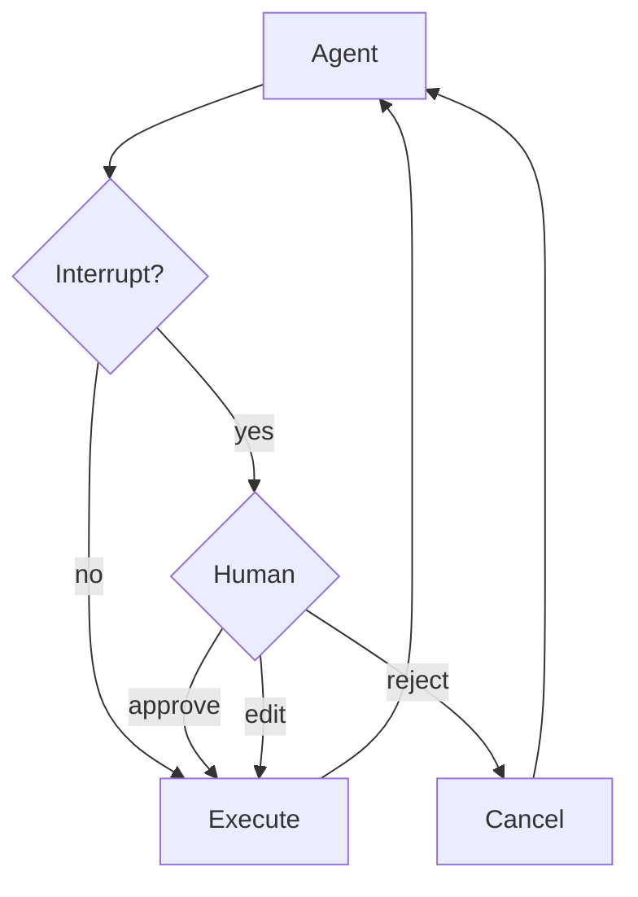

# Human-in-the-loop

민감한 도구 작업에 대한 사람 승인 구성 방법 알아보기

일부 도구 작업은 민감할 수 있으며 실행 전에 사람의 승인이 필요합니다. Deep agents는 LangGraph의 인터럽트 기능을 통해 human-in-the-loop 워크플로우를 지원합니다. `interrupt_on` 파라미터를 사용하여 어떤 도구가 승인이 필요한지 구성할 수 있습니다.



## 기본 구성

`interrupt_on` 파라미터는 도구 이름을 인터럽트 구성에 매핑하는 딕셔너리를 받습니다. 각 도구는 다음과 같이 구성할 수 있습니다:

*   `True`: 기본 동작으로 인터럽트 활성화 (`approve`, `edit`, `reject` 허용)
*   `False`: 이 도구에 대한 인터럽트 비활성화
*   `{"allowed_decisions": [...]}`: 특정 허용된 결정이 있는 커스텀 구성

```python
from langchain.tools import tool
from deepagents import create_deep_agent
from langgraph.checkpoint.memory import MemorySaver

@tool
def delete_file(path: str) -> str:
    """Delete a file from the filesystem."""
    return f"Deleted {path}"

@tool
def read_file(path: str) -> str:
    """Read a file from the filesystem."""
    return f"Contents of {path}"

@tool
def send_email(to: str, subject: str, body: str) -> str:
    """Send an email."""
    return f"Sent email to {to}"

# 체크포인터는 human-in-the-loop에 필수입니다
checkpointer = MemorySaver()

agent = create_deep_agent(
    model="claude-sonnet-4-5-20250929",
    tools=[delete_file, read_file, send_email],
    interrupt_on={
        "delete_file": True,  # 기본값: approve, edit, reject
        "read_file": False,   # 인터럽트 필요 없음
        "send_email": {"allowed_decisions": ["approve", "reject"]},  # 편집 없음
    },
    checkpointer=checkpointer  # 필수!
)
```

## 결정 유형

`allowed_decisions` 목록은 도구 호출을 검토할 때 사람이 취할 수 있는 작업을 제어합니다:

*   `"approve"`: 에이전트가 제안한 원래 인자로 도구 실행
*   `"edit"`: 실행 전에 도구 인자 수정
*   `"reject"`: 이 도구 호출 실행 완전히 건너뛰기

각 도구에 사용 가능한 결정을 커스터마이즈할 수 있습니다:

```python
interrupt_on = {
    # 민감한 작업: 모든 옵션 허용
    "delete_file": {"allowed_decisions": ["approve", "edit", "reject"]},

    # 중간 위험: 승인 또는 거부만
    "write_file": {"allowed_decisions": ["approve", "reject"]},

    # 반드시 승인 (거부 불허)
    "critical_operation": {"allowed_decisions": ["approve"]},
}
```

## 인터럽트 처리

인터럽트가 트리거되면 에이전트가 실행을 일시 중지하고 제어를 반환합니다. 결과에서 인터럽트를 확인하고 적절히 처리합니다.

```python
import uuid
from langgraph.types import Command

# 상태 영속성을 위한 thread_id와 함께 config 생성
config = {"configurable": {"thread_id": str(uuid.uuid4())}}

# 에이전트 호출
result = agent.invoke({
    "messages": [{"role": "user", "content": "Delete the file temp.txt"}]
}, config=config)

# 실행이 중단되었는지 확인
if result.get("__interrupt__"):
    # 인터럽트 정보 추출
    interrupts = result["__interrupt__"][0].value
    action_requests = interrupts["action_requests"]
    review_configs = interrupts["review_configs"]

    # 도구 이름에서 검토 구성으로의 조회 맵 생성
    config_map = {cfg["action_name"]: cfg for cfg in review_configs}

    # 사용자에게 보류 중인 작업 표시
    for action in action_requests:
        review_config = config_map[action["name"]]
        print(f"Tool: {action['name']}")
        print(f"Arguments: {action['args']}")
        print(f"Allowed decisions: {review_config['allowed_decisions']}")

    # 사용자 결정 가져오기 (action_request당 하나씩, 순서대로)
    decisions = [
        {"type": "approve"}  # 사용자가 삭제를 승인함
    ]

    # 결정과 함께 실행 재개
    result = agent.invoke(
        Command(resume={"decisions": decisions}),
        config=config  # 동일한 config 사용 필수!
    )

# 최종 결과 처리
print(result["messages"][-1].content)
```

## 여러 도구 호출

에이전트가 승인이 필요한 여러 도구를 호출할 때, 모든 인터럽트가 단일 인터럽트로 일괄 처리됩니다. 각각에 대해 순서대로 결정을 제공해야 합니다.

```python
config = {"configurable": {"thread_id": str(uuid.uuid4())}}

result = agent.invoke({
    "messages": [{
        "role": "user",
        "content": "Delete temp.txt and send an email to admin@example.com"
    }]
}, config=config)

if result.get("__interrupt__"):
    interrupts = result["__interrupt__"][0].value
    action_requests = interrupts["action_requests"]

    # 두 도구가 승인 필요
    assert len(action_requests) == 2

    # action_requests와 동일한 순서로 결정 제공
    decisions = [
        {"type": "approve"},  # 첫 번째 도구: delete_file
        {"type": "reject"}    # 두 번째 도구: send_email
    ]

    result = agent.invoke(
        Command(resume={"decisions": decisions}),
        config=config
    )
```

## 도구 인자 편집

"edit"이 허용된 결정에 있으면, 실행 전에 도구 인자를 수정할 수 있습니다:

```python
if result.get("__interrupt__"):
    interrupts = result["__interrupt__"][0].value
    action_request = interrupts["action_requests"][0]

    # 에이전트의 원래 인자
    print(action_request["args"])  # {"to": "everyone@company.com", ...}

    # 사용자가 수신자를 편집하기로 결정
    decisions = [{
        "type": "edit",
        "edited_action": {
            "name": action_request["name"],  # 도구 이름 포함 필수
            "args": {"to": "team@company.com", "subject": "...", "body": "..."}
        }
    }]

    result = agent.invoke(
        Command(resume={"decisions": decisions}),
        config=config
    )
```

## 서브에이전트 인터럽트

각 서브에이전트는 메인 에이전트의 설정을 재정의하는 자체 `interrupt_on` 구성을 가질 수 있습니다:

```python
agent = create_deep_agent(
    tools=[delete_file, read_file],
    interrupt_on={
        "delete_file": True,
        "read_file": False,
    },
    subagents=[{
        "name": "file-manager",
        "description": "Manages file operations",
        "system_prompt": "You are a file management assistant.",
        "tools": [delete_file, read_file],
        "interrupt_on": {
            # 재정의: 이 서브에이전트에서 읽기에 승인 필요
            "delete_file": True,
            "read_file": True,  # 메인 에이전트와 다름!
        }
    }],
    checkpointer=checkpointer
)
```

서브에이전트가 인터럽트를 트리거하면 처리는 동일합니다 – `__interrupt__`를 확인하고 `Command`로 재개합니다.

## 모범 사례

### 항상 체크포인터 사용

Human-in-the-loop는 인터럽트와 재개 사이의 에이전트 상태를 유지하기 위해 체크포인터가 필요합니다:

```python
from langgraph.checkpoint.memory import MemorySaver

checkpointer = MemorySaver()
agent = create_deep_agent(
    tools=[...],
    interrupt_on={...},
    checkpointer=checkpointer  # HITL에 필수
)
```

### 동일한 스레드 ID 사용

재개할 때 동일한 `thread_id`가 있는 동일한 config를 사용해야 합니다:

```python
# 첫 번째 호출
config = {"configurable": {"thread_id": "my-thread"}}
result = agent.invoke(input, config=config)

# 재개 (동일한 config 사용)
result = agent.invoke(Command(resume={...}), config=config)
```

### 결정 순서를 작업에 맞추기

decisions 목록은 `action_requests`의 순서와 일치해야 합니다:

```python
if result.get("__interrupt__"):
    interrupts = result["__interrupt__"][0].value
    action_requests = interrupts["action_requests"]

    # 작업당 하나의 결정을, 순서대로 생성
    decisions = []
    for action in action_requests:
        decision = get_user_decision(action)  # 귀하의 로직
        decisions.append(decision)

    result = agent.invoke(
        Command(resume={"decisions": decisions}),
        config=config
    )
```

### 위험 수준별 구성 조정

위험 수준에 따라 다른 도구를 구성합니다:

```python
interrupt_on = {
    # 고위험: 전체 제어 (approve, edit, reject)
    "delete_file": {"allowed_decisions": ["approve", "edit", "reject"]},
    "send_email": {"allowed_decisions": ["approve", "edit", "reject"]},

    # 중간 위험: 편집 불허
    "write_file": {"allowed_decisions": ["approve", "reject"]},

    # 저위험: 인터럽트 없음
    "read_file": False,
    "list_files": False,
}
```

---

<p align="center">
  <a href="06-subagents_ko.md">← 이전: 서브에이전트</a> • <a href="README.md">목차</a> • <a href="08-long-term-memory_ko.md">다음: 장기 메모리 →</a>
</p>
