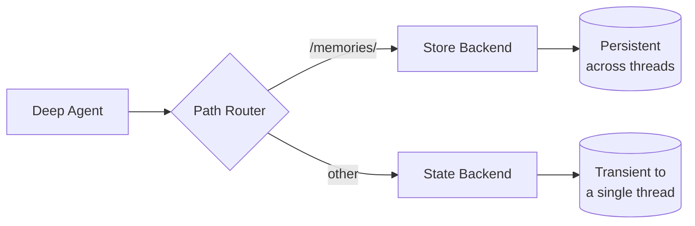

# 장기 메모리

스레드 간 영구 메모리로 deep agents를 확장하는 방법 알아보기

Deep agents는 메모리를 오프로드하기 위한 로컬 파일시스템을 갖추고 있습니다. 기본적으로 이 파일시스템은 에이전트 상태에 저장되며 단일 스레드에 일시적입니다—대화가 끝나면 파일이 손실됩니다.

특정 경로를 영구 스토리지로 라우팅하는 `CompositeBackend`를 사용하여 deep agents를 장기 메모리로 확장할 수 있습니다. 이를 통해 일부 파일은 스레드 간에 유지되고 다른 파일은 임시로 남는 하이브리드 스토리지가 가능합니다.



## 설정

`/memories/` 경로를 `StoreBackend`로 라우팅하는 `CompositeBackend`를 사용하여 장기 메모리를 구성합니다:

```python
from deepagents import create_deep_agent
from deepagents.backends import CompositeBackend, StateBackend, StoreBackend
from langgraph.store.memory import InMemoryStore
from langgraph.checkpoint.memory import MemorySaver

checkpointer = MemorySaver()

def make_backend(runtime):
    return CompositeBackend(
        default=StateBackend(runtime), # 임시 스토리지
        routes={
            "/memories/": StoreBackend(runtime) # 영구 스토리지
        }
    )

agent = create_deep_agent(
    store=InMemoryStore(), # StoreBackend에 필수
    backend=make_backend,
    checkpointer=checkpointer
)
```

## 작동 방식

`CompositeBackend`를 사용할 때, deep agents는 **두 개의 별도 파일시스템**을 유지합니다:

### 1. 단기 (일시적) 파일시스템

- 에이전트 상태에 저장됨 (`StateBackend`를 통해)
- 단일 스레드 내에서만 유지됨
- 스레드가 끝나면 파일이 손실됨
- 표준 경로를 통해 접근: `/notes.txt`, `/workspace/draft.md`

### 2. 장기 (영구) 파일시스템

- LangGraph Store에 저장됨 (`StoreBackend`를 통해)
- 모든 스레드와 대화 간에 유지됨
- 에이전트 재시작 후에도 유지됨
- `/memories/` 접두사가 있는 경로를 통해 접근: `/memories/preferences.txt`

### 경로 라우팅

`CompositeBackend`는 경로 접두사에 따라 파일 작업을 라우팅합니다:

- `/memories/`로 시작하는 경로의 파일은 Store에 저장됨 (영구)
- 이 접두사가 없는 파일은 일시적 상태에 남음
- 모든 파일시스템 도구(`ls`, `read_file`, `write_file`, `edit_file`)가 둘 다와 작동

```python
# 일시적 파일 (스레드 종료 후 손실)
agent.invoke({
    "messages": [{"role": "user", "content": "Write draft to /draft.txt"}]
})

# 영구 파일 (스레드 간 유지)
agent.invoke({
    "messages": [{"role": "user", "content": "Save final report to /memories/report.txt"}]
})
```

## 스레드 간 영속성

장기 메모리의 주요 이점은 한 스레드에서 생성된 파일을 다른 스레드에서 읽을 수 있다는 것입니다.

```python
# 스레드 1: 환경설정 저장
config_1 = {"configurable": {"thread_id": "thread-1"}}
agent.invoke({"messages": [("user", "Save my name 'Alice' to /memories/user.txt")]}, config_1)

# 스레드 2: 환경설정 읽기
config_2 = {"configurable": {"thread_id": "thread-2"}}
response = agent.invoke({"messages": [("user", "What is my name?")]}, config_2)
# 에이전트가 /memories/user.txt를 확인하고 'Alice'를 찾음
```

## 사용 사례

### 사용자 환경설정

세션 간에 유지되는 사용자 환경설정 저장:

```python
agent = create_deep_agent(
    store=InMemoryStore(),
    backend=lambda rt: CompositeBackend(
        default=StateBackend(rt),
        routes={"/memories/": StoreBackend(rt)}
    ),
    system_prompt="""When users tell you their preferences, save them to
    /memories/user_preferences.txt so you remember them in future conversations."""
)
```

### 자기 개선 지침

에이전트가 피드백에 기반하여 자체 지침을 업데이트할 수 있습니다:

```python
agent = create_deep_agent(
    store=InMemoryStore(),
    backend=lambda rt: CompositeBackend(
        default=StateBackend(rt),
        routes={"/memories/": StoreBackend(rt)}
    ),
    system_prompt="""You have a file at /memories/instructions.txt with additional
    instructions and preferences.

    Read this file at the start of conversations to understand user preferences.

    When users provide feedback like "please always do X" or "I prefer Y",
    update /memories/instructions.txt using the edit_file tool."""
)
```

시간이 지남에 따라 지침 파일에 사용자 환경설정이 축적되어 에이전트가 개선됩니다.

### 지식 베이스

여러 대화에 걸쳐 지식 구축:

```python
# 대화 1: 프로젝트에 대해 학습
agent.invoke({
    "messages": [{"role": "user", "content": "We're building a web app with React. Save project notes."}]
})

# 대화 2: 그 지식 사용
agent.invoke({
    "messages": [{"role": "user", "content": "What framework are we using?"}]
})
# 에이전트가 이전 대화의 /memories/project_notes.txt를 읽음
```

### 리서치 프로젝트

세션 간 리서치 상태 유지:

```python
research_agent = create_deep_agent(
    store=InMemoryStore(),
    backend=lambda rt: CompositeBackend(
        default=StateBackend(rt),
        routes={"/memories/": StoreBackend(rt)}
    ),
    system_prompt="""You are a research assistant.

    Save your research progress to /memories/research/:
    - /memories/research/sources.txt - List of sources found
    - /memories/research/notes.txt - Key findings and notes
    - /memories/research/report.md - Final report draft

    This allows research to continue across multiple sessions."""
)
```

## Store 구현

모든 LangGraph `BaseStore` 구현이 작동합니다

### InMemoryStore (개발용)

테스트와 개발에 적합하지만, 재시작 시 데이터가 손실됩니다:

```python
from langgraph.store.memory import InMemoryStore

store = InMemoryStore()
agent = create_deep_agent(
    store=store,
    backend=lambda rt: CompositeBackend(
        default=StateBackend(rt),
        routes={"/memories/": StoreBackend(rt)}
    )
)
```

### PostgresStore (프로덕션용)

프로덕션에서는 영구 store를 사용합니다:

```python
from langgraph.store.postgres import PostgresStore
import os

# PostgresStore.from_conn_string을 컨텍스트 매니저로 사용
store_ctx = PostgresStore.from_conn_string(os.environ["DATABASE_URL"])
store = store_ctx.__enter__()
store.setup()

agent = create_deep_agent(
    store=store,
    backend=lambda rt: CompositeBackend(
        default=StateBackend(rt),
        routes={"/memories/": StoreBackend(rt)}
    )
)
```

## 모범 사례

### 설명적인 경로 사용

명확한 경로로 영구 파일 정리:

```text
/memories/user_preferences.txt
/memories/research/topic_a/sources.txt
/memories/research/topic_a/notes.txt
/memories/project/requirements.md
```

### 메모리 구조 문서화

시스템 프롬프트에서 에이전트에게 무엇이 어디에 저장되어 있는지 알려줍니다:

```text
Your persistent memory structure:
- /memories/preferences.txt: User preferences and settings
- /memories/context/: Long-term context about the user
- /memories/knowledge/: Facts and information learned over time
```

### 오래된 데이터 정리

스토리지를 관리하기 위해 오래된 영구 파일의 주기적인 정리를 구현합니다.

### 적절한 스토리지 선택

- **개발**: 빠른 반복을 위해 `InMemoryStore` 사용
- **프로덕션**: `PostgresStore` 또는 기타 영구 store 사용
- **멀티테넌트**: store에서 `assistant_id` 기반 네임스페이싱 사용 고려

---

<p align="center">
  <a href="07-human-in-the-loop_ko.md">← 이전: Human-in-the-loop</a> • <a href="README.md">목차</a> • <a href="09-middleware_ko.md">다음: 미들웨어 →</a>
</p>
