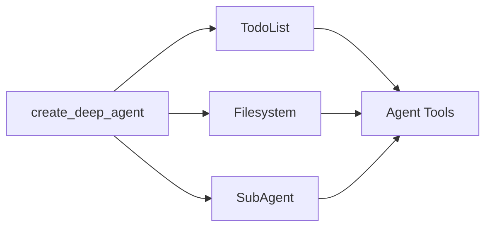

# Deep Agents Middleware

Understand the middleware that powers deep agents

Deep agents are built with a modular middleware architecture. Deep agents have access to:

1. A planning tool
2. A filesystem for storing context and long-term memories
3. The ability to spawn subagents

Each feature is implemented as separate middleware. When you create a deep agent with `create_deep_agent`, we automatically attach `TodoListMiddleware`, `FilesystemMiddleware`, and `SubAgentMiddleware` to your agent.



Middleware is composable—you can add as many or as few middleware to an agent as needed. You can use any middleware independently.

The following sections explain what each middleware provides.

## To-do list middleware

Planning is integral to solving complex problems. If you've used Claude Code recently, you'll notice how it writes out a to-do list before tackling complex, multi-part tasks. You'll also notice how it can adapt and update this to-do list on the fly as more information comes in.

`TodoListMiddleware` provides your agent with a tool specifically for updating this to-do list. Before and while it executes a multi-part task, the agent is prompted to use the `write_todos` tool to keep track of what it's doing and what still needs to be done.

```python
from langchain.agents import create_agent
from langchain.agents.middleware import TodoListMiddleware

# TodoListMiddleware is included by default in create_deep_agent
# You can customize it if building a custom agent
agent = create_agent(
    model="claude-sonnet-4-5-20250929",
    # Custom planning instructions can be added via middleware
    middleware=[
        TodoListMiddleware(
            system_prompt="Use the write_todos tool to..."  # Optional: Custom addition to the system prompt
        ),
    ],
)
```

## Filesystem middleware

Context engineering is a main challenge in building effective agents. This is particularly difficult when using tools that return variable-length results (for example, `web_search` and RAG), as long tool results can quickly fill your context window.

`FilesystemMiddleware` provides four tools for interacting with both short-term and long-term memory:

- `ls`: List the files in the filesystem
- `read_file`: Read an entire file or a certain number of lines from a file
- `write_file`: Write a new file to the filesystem
- `edit_file`: Edit an existing file in the filesystem

```python
from langchain.agents import create_agent
from deepagents.middleware.filesystem import FilesystemMiddleware

# FilesystemMiddleware is included by default in create_deep_agent
# You can customize it if building a custom agent
agent = create_agent(
    model="claude-sonnet-4-5-20250929",
    middleware=[
        FilesystemMiddleware(
            backend=None,  # Optional: custom backend (defaults to StateBackend)
            system_prompt="Write to the filesystem when...",  # Optional custom addition to the system prompt
            custom_tool_descriptions={
                "ls": "Use the ls tool when...",
                "read_file": "Use the read_file tool to..."
            }  # Optional: Custom descriptions for filesystem tools
        ),
    ],
)
```

### Short-term vs. long-term filesystem

By default, these tools write to a local "filesystem" in your graph state. To enable persistent storage across threads, configure a `CompositeBackend` that routes specific paths (like `/memories/`) to a `StoreBackend`.

```python
from langchain.agents import create_agent
from deepagents.middleware import FilesystemMiddleware
from deepagents.backends import CompositeBackend, StateBackend, StoreBackend
from langgraph.store.memory import InMemoryStore

store = InMemoryStore()

agent = create_agent(
    model="claude-sonnet-4-5-20250929",
    store=store,
    middleware=[
        FilesystemMiddleware(
            backend=lambda rt: CompositeBackend(
                default=StateBackend(rt),
                routes={"/memories/": StoreBackend(rt)}
            ),
            custom_tool_descriptions={
                "ls": "Use the ls tool when...",
                "read_file": "Use the read_file tool to..."
            }  # Optional: Custom descriptions for filesystem tools
        ),
    ],
)
```

When you configure a `CompositeBackend` with a `StoreBackend` for `/memories/`, any files prefixed with `/memories/` are saved to persistent storage and survive across different threads. Files without this prefix remain in ephemeral state storage.

## Subagent middleware

Handing off tasks to subagents isolates context, keeping the main (supervisor) agent's context window clean while still going deep on a task.

The subagents middleware allows you to supply subagents through a task tool.

```python
from langchain.tools import tool
from langchain.agents import create_agent
from deepagents.middleware.subagents import SubAgentMiddleware


@tool
def get_weather(city: str) -> str:
    """Get the weather in a city."""
    return f"The weather in {city} is sunny."

agent = create_agent(
    model="claude-sonnet-4-5-20250929",
    middleware=[
        SubAgentMiddleware(
            default_model="claude-sonnet-4-5-20250929",
            default_tools=[],
            subagents=[
                {
                    "name": "weather",
                    "description": "This subagent can get weather in cities.",
                    "system_prompt": "Use the get_weather tool to get the weather in a city.",
                    "tools": [get_weather],
                    "model": "gpt-4o",
                    "middleware": [],
                }
            ],
        )
    ],
)
```

A subagent is defined with a name, description, system prompt, and tools. You can also provide a subagent with a custom model, or with additional middleware. This can be particularly useful when you want to give the subagent an additional state key to share with the main agent.

For more complex use cases, you can also provide your own pre-built LangGraph graph as a subagent.

```python
from langchain.agents import create_agent
from deepagents.middleware.subagents import SubAgentMiddleware
from deepagents import CompiledSubAgent
from langgraph.graph import StateGraph

# Create a custom LangGraph graph
def create_weather_graph():
    workflow = StateGraph(...)
    # Build your custom graph
    return workflow.compile()

weather_graph = create_weather_graph()

# Wrap it in a CompiledSubAgent
weather_subagent = CompiledSubAgent(
    name="weather",
    description="This subagent can get weather in cities.",
    runnable=weather_graph
)

agent = create_agent(
    model="claude-sonnet-4-5-20250929",
    middleware=[
        SubAgentMiddleware(
            default_model="claude-sonnet-4-5-20250929",
            default_tools=[],
            subagents=[weather_subagent],
        )
    ],
)
```

In addition to any user-defined subagents, the main agent has access to a `general-purpose` subagent at all times. This subagent has the same instructions as the main agent and all the tools it has access to. The primary purpose of the `general-purpose` subagent is context isolation—the main agent can delegate a complex task to this subagent and get a concise answer back without bloat from intermediate tool calls.

---

<p align="center">
  <a href="08-long-term-memory.md">← Previous: Long-term Memory</a> • <a href="README.md">Table of Contents</a> • <a href="10-cli.md">Next: CLI →</a>
</p>
