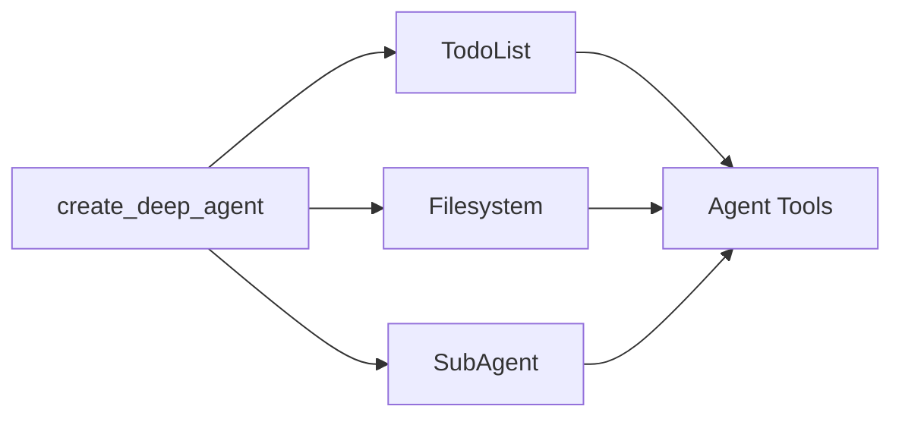

# Deep Agents 미들웨어

deep agents를 구동하는 미들웨어 이해하기

Deep agents는 모듈식 미들웨어 아키텍처로 구축되었습니다. Deep agents는 다음에 접근할 수 있습니다:

1. 계획 도구
2. 컨텍스트와 장기 메모리를 저장하기 위한 파일시스템
3. 서브에이전트 생성 능력

각 기능은 별도의 미들웨어로 구현됩니다. `create_deep_agent`로 deep agent를 생성하면, 자동으로 `TodoListMiddleware`, `FilesystemMiddleware`, `SubAgentMiddleware`가 에이전트에 연결됩니다.



미들웨어는 조합 가능합니다—필요한 만큼 많거나 적은 미들웨어를 에이전트에 추가할 수 있습니다. 어떤 미들웨어든 독립적으로 사용할 수 있습니다.

다음 섹션에서는 각 미들웨어가 제공하는 것을 설명합니다.

## 할 일 목록 미들웨어

계획은 복잡한 문제를 해결하는 데 필수적입니다. 최근 Claude Code를 사용해 보셨다면, 복잡한 다단계 작업을 처리하기 전에 할 일 목록을 작성하는 것을 알아챘을 것입니다. 또한 새로운 정보가 들어오면 즉시 이 할 일 목록을 조정하고 업데이트할 수 있다는 것도 알아채셨을 것입니다.

`TodoListMiddleware`는 이 할 일 목록을 업데이트하기 위한 특별한 도구를 에이전트에게 제공합니다. 다단계 작업을 실행하기 전과 실행하는 동안, 에이전트는 `write_todos` 도구를 사용하여 무엇을 하고 있는지와 아직 해야 할 것이 무엇인지 추적하도록 프롬프트됩니다.

```python
from langchain.agents import create_agent
from langchain.agents.middleware import TodoListMiddleware

# TodoListMiddleware는 create_deep_agent에 기본적으로 포함되어 있습니다
# 커스텀 에이전트를 구축하는 경우 커스터마이즈할 수 있습니다
agent = create_agent(
    model="claude-sonnet-4-5-20250929",
    # 미들웨어를 통해 커스텀 계획 지침 추가 가능
    middleware=[
        TodoListMiddleware(
            system_prompt="Use the write_todos tool to..."  # 선택사항: 시스템 프롬프트에 커스텀 추가
        ),
    ],
)
```

## 파일시스템 미들웨어

컨텍스트 엔지니어링은 효과적인 에이전트 구축의 주요 과제입니다. 이것은 가변 길이 결과를 반환하는 도구(예: `web_search` 및 RAG)를 사용할 때 특히 어렵습니다. 긴 도구 결과가 컨텍스트 윈도우를 빠르게 채울 수 있기 때문입니다.

`FilesystemMiddleware`는 단기 및 장기 메모리와 상호작용하기 위한 네 가지 도구를 제공합니다:

- `ls`: 파일시스템의 파일 나열
- `read_file`: 전체 파일 또는 파일의 특정 줄 수 읽기
- `write_file`: 파일시스템에 새 파일 쓰기
- `edit_file`: 파일시스템의 기존 파일 편집

```python
from langchain.agents import create_agent
from deepagents.middleware.filesystem import FilesystemMiddleware

# FilesystemMiddleware는 create_deep_agent에 기본적으로 포함되어 있습니다
# 커스텀 에이전트를 구축하는 경우 커스터마이즈할 수 있습니다
agent = create_agent(
    model="claude-sonnet-4-5-20250929",
    middleware=[
        FilesystemMiddleware(
            backend=None,  # 선택사항: 커스텀 백엔드 (기본값은 StateBackend)
            system_prompt="Write to the filesystem when...",  # 선택사항: 시스템 프롬프트에 커스텀 추가
            custom_tool_descriptions={
                "ls": "Use the ls tool when...",
                "read_file": "Use the read_file tool to..."
            }  # 선택사항: 파일시스템 도구에 대한 커스텀 설명
        ),
    ],
)
```

### 단기 vs. 장기 파일시스템

기본적으로 이 도구들은 그래프 상태의 로컬 "파일시스템"에 씁니다. 스레드 간 영구 스토리지를 활성화하려면, 특정 경로(예: `/memories/`)를 `StoreBackend`로 라우팅하는 `CompositeBackend`를 구성합니다.

```python
from langchain.agents import create_agent
from deepagents.middleware import FilesystemMiddleware
from deepagents.backends import CompositeBackend, StateBackend, StoreBackend
from langgraph.store.memory import InMemoryStore

store = InMemoryStore()

agent = create_agent(
    model="claude-sonnet-4-5-20250929",
    store=store,
    middleware=[
        FilesystemMiddleware(
            backend=lambda rt: CompositeBackend(
                default=StateBackend(rt),
                routes={"/memories/": StoreBackend(rt)}
            ),
            custom_tool_descriptions={
                "ls": "Use the ls tool when...",
                "read_file": "Use the read_file tool to..."
            }  # 선택사항: 파일시스템 도구에 대한 커스텀 설명
        ),
    ],
)
```

`/memories/`용 `StoreBackend`와 함께 `CompositeBackend`를 구성하면, `/memories/` 접두사가 있는 모든 파일은 영구 스토리지에 저장되고 다른 스레드에서도 유지됩니다. 이 접두사가 없는 파일은 임시 상태 스토리지에 남습니다.

## 서브에이전트 미들웨어

작업을 서브에이전트에게 넘기면 컨텍스트가 격리되어, 작업을 깊이 있게 수행하면서도 메인 (수퍼바이저) 에이전트의 컨텍스트 윈도우를 깨끗하게 유지합니다.

서브에이전트 미들웨어는 task 도구를 통해 서브에이전트를 제공할 수 있게 합니다.

```python
from langchain.tools import tool
from langchain.agents import create_agent
from deepagents.middleware.subagents import SubAgentMiddleware


@tool
def get_weather(city: str) -> str:
    """Get the weather in a city."""
    return f"The weather in {city} is sunny."

agent = create_agent(
    model="claude-sonnet-4-5-20250929",
    middleware=[
        SubAgentMiddleware(
            default_model="claude-sonnet-4-5-20250929",
            default_tools=[],
            subagents=[
                {
                    "name": "weather",
                    "description": "This subagent can get weather in cities.",
                    "system_prompt": "Use the get_weather tool to get the weather in a city.",
                    "tools": [get_weather],
                    "model": "gpt-4o",
                    "middleware": [],
                }
            ],
        )
    ],
)
```

서브에이전트는 이름, 설명, 시스템 프롬프트, 도구로 정의됩니다. 서브에이전트에 커스텀 모델이나 추가 미들웨어를 제공할 수도 있습니다. 이것은 서브에이전트에게 메인 에이전트와 공유할 추가 상태 키를 제공하고 싶을 때 특히 유용할 수 있습니다.

더 복잡한 사용 사례의 경우, 자체 사전 구축된 LangGraph 그래프를 서브에이전트로 제공할 수도 있습니다.

```python
from langchain.agents import create_agent
from deepagents.middleware.subagents import SubAgentMiddleware
from deepagents import CompiledSubAgent
from langgraph.graph import StateGraph

# 커스텀 LangGraph 그래프 생성
def create_weather_graph():
    workflow = StateGraph(...)
    # 커스텀 그래프 구축
    return workflow.compile()

weather_graph = create_weather_graph()

# CompiledSubAgent로 래핑
weather_subagent = CompiledSubAgent(
    name="weather",
    description="This subagent can get weather in cities.",
    runnable=weather_graph
)

agent = create_agent(
    model="claude-sonnet-4-5-20250929",
    middleware=[
        SubAgentMiddleware(
            default_model="claude-sonnet-4-5-20250929",
            default_tools=[],
            subagents=[weather_subagent],
        )
    ],
)
```

사용자 정의 서브에이전트 외에도, 메인 에이전트는 항상 `general-purpose` 서브에이전트에 접근할 수 있습니다. 이 서브에이전트는 메인 에이전트와 동일한 지침과 접근 가능한 모든 도구를 가지고 있습니다. `general-purpose` 서브에이전트의 주요 목적은 컨텍스트 격리입니다—메인 에이전트가 복잡한 작업을 이 서브에이전트에게 위임하고 중간 도구 호출로 인한 비대화 없이 간결한 답변을 돌려받을 수 있습니다.

---

<p align="center">
  <a href="08-long-term-memory_ko.md">← 이전: 장기 메모리</a> • <a href="README.md">목차</a> • <a href="10-cli_ko.md">다음: CLI →</a>
</p>
