# Models

LLMs are powerful AI tools that can interpret and generate text like humans. They’re versatile enough to write content, translate languages, summarize, and answer questions without needing specialized training for each task.

In addition to text generation, many models support:
- [Tool calling](https://docs.langchain.com/oss/python/langchain/models#tool-calling) - calling external tools (like databases queries or API calls) and use results in their responses.
- [Structured output](https://docs.langchain.com/oss/python/langchain/models#structured-output) - where the model’s response is constrained to follow a defined format.
- [Multimodality](https://docs.langchain.com/oss/python/langchain/models#multimodal) - process and return data other than text, such as images, audio, and video.
- [Reasoning](https://docs.langchain.com/oss/python/langchain/models#reasoning) - models perform multi-step reasoning to arrive at a conclusion.

Models are the reasoning engine of agents. They drive the agent’s decision-making process, determining which tools to call, how to interpret results, and when to provide a final answer.

The quality and capabilities of the model you choose directly impact your agent’s baseline reliability and performance. Different models excel at different tasks - some are better at following complex instructions, others at structured reasoning, and some support larger context windows for handling more information.

LangChain’s standard model interfaces give you access to many different provider integrations, which makes it easy to experiment with and switch between models to find the best fit for your use case.

For provider-specific integration information and capabilities, see the [provider’s chat model page](https://docs.langchain.com/oss/python/integrations/chat).

## Basic usage

Models can be utilized in two ways:

1. With [agents](https://docs.langchain.com/oss/python/langchain/agents#model) - Models can be dynamically specified when creating an agent.
2. Standalone - Models can be called directly (outside of the agent loop) for tasks like text generation, classification, or extraction without the need for an agent framework.

The same model interface works in both contexts, which gives you the flexibility to start simple and scale up to more complex agent-based workflows as needed.

### Initialize a model

The easiest way to get started with a standalone model in LangChain is to use `init_chat_model` to initialize one from a chat model provider of your choice (examples below):

#### OpenAI

👉 [Read the OpenAI chat model integration docs](https://docs.langchain.com/oss/python/integrations/chat/openai)

```bash
pip install -U "langchain[openai]"
```

**init_chat_model**

```python
import os
from langchain.chat_models import init_chat_model

os.environ["OPENAI_API_KEY"] = "sk-..."

model = init_chat_model("gpt-4.1")
```

**Model Class**

```python
import os
from langchain_openai import ChatOpenAI

os.environ["OPENAI_API_KEY"] = "sk-..."

model = ChatOpenAI(model="gpt-4.1")
```

#### Anthropic

👉 [Read the Anthropic chat model integration docs](https://docs.langchain.com/oss/python/integrations/chat/anthropic)

```bash
pip install -U "langchain[anthropic]"
```

**init_chat_model**

```python
import os
from langchain.chat_models import init_chat_model

os.environ["ANTHROPIC_API_KEY"] = "sk-..."

model = init_chat_model("claude-sonnet-4-5-20250929")
```

**Model Class**

```python
import os
from langchain_anthropic import ChatAnthropic

os.environ["ANTHROPIC_API_KEY"] = "sk-..."

model = ChatAnthropic(model = "claude-sonnet-4-5-20250929")
```

#### Azure

👉 [Read the Azure chat model integration docs](https://docs.langchain.com/oss/python/integrations/chat/azure_chat_openai)

```bash
pip install -U "langchain[openai]"
```

**init_chat_model**

```python
import os
from langchain.chat_models import init_chat_model

os.environ["AZURE_OPENAI_API_KEY"] = "..."
os.environ["AZURE_OPENAI_ENDPOINT"] = "..."
os.environ["OPENAI_API_VERSION"] = "2025-03-01-preview"

model = init_chat_model(
    "azure_openai:gpt-4.1",
    azure_deployment=os.environ["AZURE_OPENAI_DEPLOYMENT_NAME"],
)
```

**Model Class**

```python
import os
from langchain_openai import AzureChatOpenAI

os.environ["AZURE_OPENAI_API_KEY"] = "..."
os.environ["AZURE_OPENAI_ENDPOINT"] = "..."
os.environ["OPENAI_API_VERSION"] = "2025-03-01-preview"

model = AzureChatOpenAI(
    model="gpt-4.1",
    azure_deployment=os.environ["AZURE_OPENAI_DEPLOYMENT_NAME"]
)
```

#### Google Gemini

👉 [Read the Google GenAI chat model integration docs](https://docs.langchain.com/oss/python/integrations/chat/google_generative_ai)

```bash
pip install -U "langchain[google-genai]"
```

**init_chat_model**

```python
import os
from langchain.chat_models import init_chat_model

os.environ["GOOGLE_API_KEY"] = "..."

model = init_chat_model("google_genai:gemini-2.5-flash-lite")
```

**Model Class**

```python
import os
from langchain_google_genai import ChatGoogleGenerativeAI

os.environ["GOOGLE_API_KEY"] = "..."

model = ChatGoogleGenerativeAI(model="gemini-2.5-flash-lite")
```

#### AWS Bedrock

👉 [Read the AWS Bedrock chat model integration docs](https://docs.langchain.com/oss/python/integrations/chat/bedrock)

```bash
pip install -U "langchain[aws]"
```

**init_chat_model**

```python
from langchain.chat_models import init_chat_model

# Follow the steps here to configure your credentials:
# https://docs.aws.amazon.com/bedrock/latest/userguide/getting-started.html

model = init_chat_model(
    "anthropic.claude-3-5-sonnet-20240620-v1:0",
    model_provider="bedrock_converse",
)
```

**Model Class**

```python
from langchain_aws import ChatBedrock

model = ChatBedrock(
    model="anthropic.claude-3-5-sonnet-20240620-v1:0"
)
```

#### HuggingFace

👉 [Read the HuggingFace chat model integration docs](https://docs.langchain.com/oss/python/integrations/chat/huggingface)

```bash
pip install -U "langchain[huggingface]"
```

**init_chat_model**

```python
import os
from langchain.chat_models import init_chat_model

os.environ["HUGGINGFACEHUB_API_TOKEN"] = "hf_..."

model = init_chat_model(
    "microsoft/Phi-3-mini-4k-instruct",
    model_provider="huggingface",
    temperature=0.7,
    max_tokens=1024,
)
```

**Model Class**

```python
import os
from langchain_huggingface import ChatHuggingFace, HuggingFaceEndpoint

os.environ["HUGGINGFACEHUB_API_TOKEN"] = "hf_..."

llm = HuggingFaceEndpoint(
    repo_id="microsoft/Phi-3-mini-4k-instruct",
    temperature=0.7,
    max_length=1024,
)
model = ChatHuggingFace(llm=llm)
```

```python
response = model.invoke("Why do parrots talk?")
```

See `init_chat_model` for more detail, including information on how to pass model parameters.

### Supported models

LangChain supports all major model providers, including OpenAI, Anthropic, Google, Azure, AWS Bedrock, and more. Each provider offers a variety of models with different capabilities. For a full list of supported models in LangChain, see the [integrations page](https://docs.langchain.com/oss/python/integrations/providers/overview).

### Key methods

<table style="width: 100%; border-spacing: 0 10px; border-collapse: separate;">
  <tr>
    <td style="border: 1px solid #e0e0e0; border-radius: 10px; padding: 15px;">
        <a href="https://docs.langchain.com/oss/python/langchain/models#invoke" style="text-decoration: none; color: inherit; display: block;">
            <div style="font-weight: bold; font-size: 1.1em; margin-bottom: 5px;">Invoke</div>
            <div style="color: #555;">The model takes messages as input and outputs messages after generating a complete response.</div>
        </a>
    </td>
  </tr>
  <tr>
    <td style="border: 1px solid #e0e0e0; border-radius: 10px; padding: 15px;">
        <a href="https://docs.langchain.com/oss/python/langchain/models#stream" style="text-decoration: none; color: inherit; display: block;">
            <div style="font-weight: bold; font-size: 1.1em; margin-bottom: 5px;">Stream</div>
            <div style="color: #555;">Invoke the model, but stream the output as it is generated in real-time.</div>
        </a>
    </td>
  </tr>
  <tr>
    <td style="border: 1px solid #e0e0e0; border-radius: 10px; padding: 15px;">
        <a href="https://docs.langchain.com/oss/python/langchain/models#batch" style="text-decoration: none; color: inherit; display: block;">
            <div style="font-weight: bold; font-size: 1.1em; margin-bottom: 5px;">Batch</div>
            <div style="color: #555;">Send multiple requests to a model in a batch for more efficient processing.</div>
        </a>
    </td>
  </tr>
</table>

> In addition to chat models, LangChain provides support for other adjacent technologies, such as embedding models and vector stores. See the [integrations page](https://docs.langchain.com/oss/python/integrations/providers/overview) for details.

## Parameters

A chat model takes parameters that can be used to configure its behavior. The full set of supported parameters varies by model and provider, but standard ones include:

<div style="margin-bottom: 20px;">
  <div style="display: flex; align-items: center; gap: 10px; margin-bottom: 10px;">
    <code style="color: #00766c; font-weight: bold; font-size: 1.1em;">model</code>
    <span style="background-color: #fca5a533; color: #b91c1c; padding: 2px 8px; border-radius: 4px; font-size: 0.9em; font-family: monospace;">required</span>
    <span style="background-color: #f3f4f6; color: #1f2937; padding: 2px 8px; border-radius: 4px; font-size: 0.9em; font-family: monospace;">string</span>
  </div>
  <p style="margin-top: 0; color: #374151;">The name or identifier of the specific model you want to use with a provider. You can also specify both the model and its provider in a single argument using the ’:’ format, for example, ‘openai:o1’.</p>
</div>

<div style="margin-bottom: 20px;">
  <div style="display: flex; align-items: center; gap: 10px; margin-bottom: 10px;">
    <code style="color: #00766c; font-weight: bold; font-size: 1.1em;">api_key</code>
    <span style="background-color: #f3f4f6; color: #1f2937; padding: 2px 8px; border-radius: 4px; font-size: 0.9em; font-family: monospace;">string</span>
  </div>
  <p style="margin-top: 0; color: #374151;">The key required for authenticating with the model’s provider. This is usually issued when you sign up for access to the model. Often accessed by setting an <a href="https://docs.langchain.com/oss/python/langchain/models/messages#environment-variables">environment variable</a>.</p>
</div>

<div style="margin-bottom: 20px;">
  <div style="display: flex; align-items: center; gap: 10px; margin-bottom: 10px;">
    <code style="color: #00766c; font-weight: bold; font-size: 1.1em;">temperature</code>
    <span style="background-color: #f3f4f6; color: #1f2937; padding: 2px 8px; border-radius: 4px; font-size: 0.9em; font-family: monospace;">number</span>
  </div>
  <p style="margin-top: 0; color: #374151;">Controls the randomness of the model’s output. A higher number makes responses more creative; lower ones make them more deterministic.</p>
</div>

<div style="margin-bottom: 20px;">
  <div style="display: flex; align-items: center; gap: 10px; margin-bottom: 10px;">
    <code style="color: #00766c; font-weight: bold; font-size: 1.1em;">max_tokens</code>
    <span style="background-color: #f3f4f6; color: #1f2937; padding: 2px 8px; border-radius: 4px; font-size: 0.9em; font-family: monospace;">number</span>
  </div>
  <p style="margin-top: 0; color: #374151;">Limits the total number of <a href="https://docs.langchain.com/oss/python/langchain/models/messages#tokens">tokens</a> in the response, effectively controlling how long the output can be.</p>
</div>

<div style="margin-bottom: 20px;">
  <div style="display: flex; align-items: center; gap: 10px; margin-bottom: 10px;">
    <code style="color: #00766c; font-weight: bold; font-size: 1.1em;">timeout</code>
    <span style="background-color: #f3f4f6; color: #1f2937; padding: 2px 8px; border-radius: 4px; font-size: 0.9em; font-family: monospace;">number</span>
  </div>
  <p style="margin-top: 0; color: #374151;">The maximum time (in seconds) to wait for a response from the model before canceling the request.</p>
</div>

<div style="margin-bottom: 20px;">
  <div style="display: flex; align-items: center; gap: 10px; margin-bottom: 10px;">
    <code style="color: #00766c; font-weight: bold; font-size: 1.1em;">max_retries</code>
    <span style="background-color: #f3f4f6; color: #1f2937; padding: 2px 8px; border-radius: 4px; font-size: 0.9em; font-family: monospace;">number</span>
  </div>
  <p style="margin-top: 0; color: #374151;">The maximum number of attempts the system will make to resend a request if it fails due to issues like network timeouts or rate limits.</p>
</div>

Using `init_chat_model`, pass these parameters as inline `**kwargs`:

#### Initialize using model parameters

```python
model = init_chat_model(
    "claude-sonnet-4-5-20250929",
    # Kwargs passed to the model:
    temperature=0.7,
    timeout=30,
    max_tokens=1000,
)
```

> Each chat model integration may have additional params used to control provider-specific functionality.
> For example, `ChatOpenAI` has `use_responses_api` to dictate whether to use the OpenAI Responses or Completions API.
> To find all the parameters supported by a given chat model, head to the [chat model integrations](https://docs.langchain.com/oss/python/integrations/chat) page.

## Invocation

A chat model must be invoked to generate an output. There are three primary invocation methods, each suited to different use cases.

### Invoke

The most straightforward way to call a model is to use `invoke()` with a single message or a list of messages.

#### Single message

```python
response = model.invoke("Why do parrots have colorful feathers?")
print(response)
```

A list of messages can be provided to a chat model to represent conversation history. Each message has a role that models use to indicate who sent the message in the conversation.

See the [messages guide](https://docs.langchain.com/oss/python/langchain/models/messages) for more detail on roles, types, and content.

#### Dictionary format

```python
conversation = [
    {"role": "system", "content": "You are a helpful assistant that translates English to French."},
    {"role": "user", "content": "Translate: I love programming."},
    {"role": "assistant", "content": "J'adore la programmation."},
    {"role": "user", "content": "Translate: I love building applications."}
]

response = model.invoke(conversation)
print(response)  # AIMessage("J'adore créer des applications.")
```

#### Message objects

```python
from langchain.messages import HumanMessage, AIMessage, SystemMessage

conversation = [
    SystemMessage("You are a helpful assistant that translates English to French."),
    HumanMessage("Translate: I love programming."),
    AIMessage("J'adore la programmation."),
    HumanMessage("Translate: I love building applications.")
]

response = model.invoke(conversation)
print(response)  # AIMessage("J'adore créer des applications.")
```

> If the return type of your invocation is a string, ensure that you are using a chat model as opposed to a LLM. Legacy, text-completion LLMs return strings directly. LangChain chat models are prefixed with “Chat”, e.g., [`ChatOpenAI`](https://docs.langchain.com/oss/integrations/chat/openai).

### Stream

Most models can stream their output content while it is being generated. By displaying output progressively, streaming significantly improves user experience, particularly for longer responses.

Calling `stream()` returns an iterator that yields output chunks as they are produced. You can use a loop to process each chunk in real-time:

#### Basic text streaming

```python
for chunk in model.stream("Why do parrots have colorful feathers?"):
    print(chunk.text, end="|", flush=True)
```

#### Stream tool calls, reasoning, and other content

```python
for chunk in model.stream("What color is the sky?"):
    for block in chunk.content_blocks:
        if block["type"] == "reasoning" and (reasoning := block.get("reasoning")):
            print(f"Reasoning: {reasoning}")
        elif block["type"] == "tool_call_chunk":
            print(f"Tool call chunk: {block}")
        elif block["type"] == "text":
            print(block["text"])
        else:
            ...
```

As opposed to `invoke()`, which returns a single `AIMessage` after the model has finished generating its full response, `stream()` returns multiple `AIMessageChunk` objects, each containing a portion of the output text. Importantly, each chunk in a stream is designed to be gathered into a full message via summation:

#### Construct an AIMessage

```python
full = None  # None | AIMessageChunk
for chunk in model.stream("What color is the sky?"):
    full = chunk if full is None else full + chunk
    print(full.text)

# The
# The sky
# The sky is
# The sky is typically
# The sky is typically blue
# ...

print(full.content_blocks)
# [{"type": "text", "text": "The sky is typically blue..."}]
```

The resulting message can be treated the same as a message that was generated with `invoke()` – for example, it can be aggregated into a message history and passed back to the model as conversational context.

> Streaming only works if all steps in the program know how to process a stream of chunks. For instance, an application that isn’t streaming-capable would be one that needs to store the entire output in memory before it can be processed.

<details>
<summary>Advanced streaming topics</summary>

<details>
<summary>Streaming events</summary>

LangChain chat models can also stream semantic events using `astream_events()`. This simplifies filtering based on event types and other metadata, and will aggregate the full message in the background. See below for an example.

```python
async for event in model.astream_events("Hello"):

    if event["event"] == "on_chat_model_start":
        print(f"Input: {event['data']['input']}")

    elif event["event"] == "on_chat_model_stream":
        print(f"Token: {event['data']['chunk'].text}")

    elif event["event"] == "on_chat_model_end":
        print(f"Full message: {event['data']['output'].text}")

    else:
        pass
```

**Output example:**
```text
Input: Hello
Token: Hi
Token:  there
Token: !
Token:  How
Token:  can
Token:  I
...
Full message: Hi there! How can I help today?
```

See the `astream_events()` reference for event types and other details.

</details>

<details>
<summary>"Auto-streaming" chat models</summary>

LangChain simplifies streaming from chat models by automatically enabling streaming mode in certain cases, even when you’re not explicitly calling the streaming methods. This is particularly useful when you use the non-streaming `invoke` method but still want to stream the entire application, including intermediate results from the chat model.

In **LangGraph agents**, for example, you can call `model.invoke()` within nodes, but LangChain will automatically delegate to streaming if running in a streaming mode.

**How it works**

When you `invoke()` a chat model, LangChain will automatically switch to an internal streaming mode if it detects that you are trying to stream the overall application. The result of the invocation will be the same as far as the code that was using invoke is concerned; however, while the chat model is being streamed, LangChain will take care of invoking `on_llm_new_token` events in LangChain’s callback system.

Callback events allow LangGraph `stream()` and `astream_events()` to surface the chat model’s output in real-time.

</details>

</details>

### Batch

Batching a collection of independent requests to a model can significantly improve performance and reduce costs, as the processing can be done in parallel:

#### Batch

```python
responses = model.batch([
    "Why do parrots have colorful feathers?",
    "How do airplanes fly?",
    "What is quantum computing?"
])
for response in responses:
    print(response)
```

> This section describes a chat model method `batch()`, which parallelizes model calls client-side.
> 
> It is distinct from batch APIs supported by inference providers, such as OpenAI or Anthropic.

By default, `batch()` will only return the final output for the entire batch. If you want to receive the output for each individual input as it finishes generating, you can stream results with `batch_as_completed()`:

#### Yield batch responses upon completion

```python
for response in model.batch_as_completed([
    "Why do parrots have colorful feathers?",
    "How do airplanes fly?",
    "What is quantum computing?"
]):
    print(response)
```

> When using `batch_as_completed()`, results may arrive out of order. Each includes the input index for matching to reconstruct the original order as needed.

> When processing a large number of inputs using `batch()` or `batch_as_completed()`, you may want to control the maximum number of parallel calls. This can be done by setting the `max_concurrency` attribute in the `RunnableConfig` dictionary.
> 
> #### Batch with max concurrency
> 
> ```python
> model.batch(
>     list_of_inputs,
>     config={
>         'max_concurrency': 5,  # Limit to 5 parallel calls
>     }
> )
> ```
> 
> See the [RunnableConfig reference](https://api.python.langchain.com/en/latest/runnables/langchain_core.runnables.config.RunnableConfig.html) for a full list of supported attributes.

For more details on batching, see the [reference](https://python.langchain.com/docs/how_to/#batch).

## Tool calling

Models can request to call tools that perform tasks such as fetching data from a database, searching the web, or running code. Tools are pairings of:

1. A schema, including the name of the tool, a description, and/or argument definitions (often a JSON schema)
2. A function or coroutine to execute.

> You may hear the term “function calling”. We use this interchangeably with “tool calling”.

Here’s the basic tool calling flow between a user and a model:

```mermaid
sequenceDiagram
    participant U as User
    participant M as Model
    participant T as Tools

    U->>M: "What's the weather in SF and NYC?"
    Note over M: Analyze request & decide tools needed

    par [Parallel Tool Calls]
        M->>T: get_weather("San Francisco")
        M->>T: get_weather("New York")
    end

    par [Tool Execution]
        T-->>M: SF weather data
        T-->>M: NYC weather data
    end

    Note over M: Process results & generate response
    M-->>U: "SF: 72°F sunny, NYC: 68°F cloudy"
```



To make tools that you have defined available for use by a model, you must bind them using `bind_tools`. In subsequent invocations, the model can choose to call any of the bound tools as needed.

Some model providers offer built-in tools that can be enabled via model or invocation parameters (e.g. `ChatOpenAI`, `ChatAnthropic`). Check the respective provider reference for details.

> See the [tools guide](https://python.langchain.com/docs/how_to/tool_calling/) for details and other options for creating tools.

### Binding user tools

```python
from langchain.tools import tool

@tool
def get_weather(location: str) -> str:
    """Get the weather at a location."""
    return f"It's sunny in {location}."


model_with_tools = model.bind_tools([get_weather])  

response = model_with_tools.invoke("What's the weather like in Boston?")
for tool_call in response.tool_calls:
    # View tool calls made by the model
    print(f"Tool: {tool_call['name']}")
    print(f"Args: {tool_call['args']}")
```

When binding user-defined tools, the model’s response includes a request to execute a tool. When using a model separately from an agent, it is up to you to execute the requested tool and return the result back to the model for use in subsequent reasoning. When using an agent, the agent loop will handle the tool execution loop for you.

Below, we show some common ways you can use tool calling.

<details>
<summary>Tool execution loop</summary>

When a model returns tool calls, you need to execute the tools and pass the results back to the model. This creates a conversation loop where the model can use tool results to generate its final response. LangChain includes **agent** abstractions that handle this orchestration for you.

Here's a simple example of how to do this:

```python
# Bind (potentially multiple) tools to the model
model_with_tools = model.bind_tools([get_weather])

# Step 1: Model generates tool calls
messages = [{"role": "user", "content": "What's the weather in Boston?"}]
ai_msg = model_with_tools.invoke(messages)
messages.append(ai_msg)

# Step 2: Execute tools and collect results
for tool_call in ai_msg.tool_calls:
    # Execute the tool with the generated arguments
    tool_result = get_weather.invoke(tool_call)
    messages.append(tool_result)

# Step 3: Pass results back to model for final response
final_response = model_with_tools.invoke(messages)
print(final_response.text)
# "The current weather in Boston is 72°F and sunny."
```
Each `ToolMessage` returned by the tool includes a `tool_call_id` that matches the original tool call, helping the model correlate results with requests.

</details>

<details>
<summary>Forcing tool calls</summary>

By default, the model has the freedom to choose which bound tool to use based on the user's input. However, you might want to force choosing a tool, ensuring the model uses either a particular tool or **any** tool from a given list:

**Tab: Force use of any tool**
```python
model_with_tools = model.bind_tools([tool_1], tool_choice="any")
```

**Tab: Force use of specific tools**
```python
model_with_tools = model.bind_tools([tool_1], tool_choice="tool_1")
```

</details>

<details>
<summary>Parallel tool calls</summary>

Many models support calling multiple tools in parallel when appropriate. This allows the model to gather information from different sources simultaneously.

```python
model_with_tools = model.bind_tools([get_weather])

response = model_with_tools.invoke(
    "What's the weather in Boston and Tokyo?"
)


# The model may generate multiple tool calls
print(response.tool_calls)
# [
#   {'name': 'get_weather', 'args': {'location': 'Boston'}, 'id': 'call_1'},
#   {'name': 'get_weather', 'args': {'location': 'Tokyo'}, 'id': 'call_2'},
# ]


# Execute all tools (can be done in parallel with async)
results = []
for tool_call in response.tool_calls:
    if tool_call['name'] == 'get_weather':
        result = get_weather.invoke(tool_call)
    ...
    results.append(result)
```

The model intelligently determines when parallel execution is appropriate based on the independence of the requested operations.

> [!TIP]
> Most models supporting tool calling enable parallel tool calls by default. Some (including OpenAI and Anthropic) allow you to disable this feature. To do this, set `parallel_tool_calls=False`:
>
> ```python
> model.bind_tools([get_weather], parallel_tool_calls=False)
> ```

</details>

<details>
<summary>Streaming tool calls</summary>

When streaming responses, tool calls are progressively built through ToolCallChunk. This allows you to see tool calls as they’re being generated rather than waiting for the complete response.

```python
for chunk in model_with_tools.stream(
    "What's the weather in Boston and Tokyo?"
):
    # Tool call chunks arrive progressively
    for tool_chunk in chunk.tool_call_chunks:
        if name := tool_chunk.get("name"):
            print(f"Tool: {name}")
        if id_ := tool_chunk.get("id"):
            print(f"ID: {id_}")
        if args := tool_chunk.get("args"):
            print(f"Args: {args}")

# Output:
# Tool: get_weather
# ID: call_SvMlU1TVIZugrFLckFE2ceRE
# Args: {"lo
# Args: catio
# Args: n": "B
# Args: osto
# Args: n"}
# Tool: get_weather
# ID: call_QMZdy6qInx13oWKE7KhuhOLR
# Args: {"lo
# Args: catio
# Args: n": "T
# Args: okyo
# Args: "}
```

You can accumulate chunks to build complete tool calls:

**Accumulate tool calls**

```python
gathered = None
for chunk in model_with_tools.stream("What's the weather in Boston?"):
    gathered = chunk if gathered is None else gathered + chunk
    print(gathered.tool_calls)
```

</details>

## Structured output

Models can be requested to provide their response in a format matching a given schema. This is useful for ensuring the output can be easily parsed and used in subsequent processing. LangChain supports multiple schema types and methods for enforcing structured output.

To learn about structured output, see [Structured output](https://python.langchain.com/docs/how_to/structured_output/).

#### Pydantic

Pydantic models provide the richest feature set with field validation, descriptions, and nested structures.

```python
from pydantic import BaseModel, Field

class Movie(BaseModel):
    """A movie with details."""
    title: str = Field(..., description="The title of the movie")
    year: int = Field(..., description="The year the movie was released")
    director: str = Field(..., description="The director of the movie")
    rating: float = Field(..., description="The movie's rating out of 10")

model_with_structure = model.with_structured_output(Movie)
response = model_with_structure.invoke("Provide details about the movie Inception")
print(response)  # Movie(title="Inception", year=2010, director="Christopher Nolan", rating=8.8)
```

#### TypedDict

Python’s TypedDict provides a simpler alternative to Pydantic models, ideal when you don’t need runtime validation.

```python
from typing_extensions import TypedDict, Annotated

class MovieDict(TypedDict):
    """A movie with details."""
    title: Annotated[str, "The title of the movie"]
    year: Annotated[int, "The year the movie was released"]
    director: Annotated[str, "The director of the movie"]
    rating: Annotated[float, "The movie's rating out of 10"]

model_with_structure = model.with_structured_output(MovieDict)
response = model_with_structure.invoke("Provide details about the movie Inception")
print(response)  # {'title': 'Inception', 'year': 2010, 'director': 'Christopher Nolan', 'rating': 8.8}
```

#### JSON Schema

Provide a JSON Schema for maximum control and interoperability.

```python
import json

json_schema = {
  "title": "Movie",
  "description": "A movie with details",
  "type": "object",
  "properties": {
    "title": { "type": "string", "description": "The title of the movie" },
    "year": { "type": "integer", "description": "The year the movie was released" },
    "director": { "type": "string", "description": "The director of the movie" },
    "rating": { "type": "number", "description": "The movie's rating out of 10" }
  },
  "required": ["title", "year", "director", "rating"]
}

model_with_structure = model.with_structured_output(
  json_schema,
  method="json_schema",
)
response = model_with_structure.invoke("Provide details about the movie Inception")
print(response)  # {'title': 'Inception', 'year': 2010, ...}
```

> [!INFO]
> **Key considerations for structured output**
>
> *   **Method parameter**: Some providers support different methods for structured output:
>     *   `'json_schema'` : Uses dedicated structured output features offered by the provider.
>     *   `'function_calling'` : Derives structured output by forcing a [tool call](https://docs.langchain.com/oss/python/langchain/models#tool-calling) that follows the given schema.
>     *   `'json_mode'` : A precursor to `'json_schema'` offered by some providers. Generates valid JSON, but the schema must be described in the prompt.
> *   **Include raw**: Set `include_raw=True` to get both the parsed output and the raw `AIMessage`.
> *   **Validation**: Pydantic models provide automatic validation. `TypedDict` and JSON Schema require manual validation.
>
> See your [provider’s integration page](https://docs.langchain.com/oss/python/integrations/providers/overview) for supported methods and configuration options.

<details>
<summary>Example: Message output alongside parsed structure</summary>

It can be useful to return the raw AIMessage object alongside the parsed representation to access response metadata such as token counts. To do this, set `include_raw=True` when calling with_structured_output:

```python
from pydantic import BaseModel, Field

class Movie(BaseModel):
    """A movie with details."""
    title: str = Field(..., description="The title of the movie")
    year: int = Field(..., description="The year the movie was released")
    director: str = Field(..., description="The director of the movie")
    rating: float = Field(..., description="The movie's rating out of 10")

model_with_structure = model.with_structured_output(Movie, include_raw=True)  
response = model_with_structure.invoke("Provide details about the movie Inception")
response
# {
#     "raw": AIMessage(...),
#     "parsed": Movie(title=..., year=..., ...),
#     "parsing_error": None,
# }
```

</details>

<details>
<summary>Example: Nested structures</summary>

Schemas can be nested:

**Tab: Pydantic**
```python
from pydantic import BaseModel, Field

class Actor(BaseModel):
    name: str
    role: str

class MovieDetails(BaseModel):
    title: str
    year: int
    cast: list[Actor]
    genres: list[str]
    budget: float | None = Field(None, description="Budget in millions USD")

model_with_structure = model.with_structured_output(MovieDetails)
```

**Tab: TypedDict**
```python
from typing_extensions import Annotated, TypedDict

class Actor(TypedDict):
    name: str
    role: str

class MovieDetails(TypedDict):
    title: str
    year: int
    cast: list[Actor]
    genres: list[str]
    budget: Annotated[float | None, ..., "Budget in millions USD"]

model_with_structure = model.with_structured_output(MovieDetails)
```

</details>

## Advanced topics

### Model profiles

> Model profiles require `langchain>=1.1`.

LangChain chat models can expose a dictionary of supported features and capabilities through a `.profile` attribute:

```python
model.profile
# {
#   "max_input_tokens": 400000,
#   "image_inputs": True,
#   "reasoning_output": True,
#   "tool_calling": True,
#   ...
# }
```

Refer to the full set of fields in the [API reference](https://api.python.langchain.com/en/latest/chat_models/langchain_core.chat_models.base.BaseChatModel.html#langchain_core.chat_models.base.BaseChatModel.profile).

Much of the model profile data is powered by the [models.dev](https://models.dev/) project, an open source initiative that provides model capability data. These data are augmented with additional fields for purposes of use with LangChain. These augmentations are kept aligned with the upstream project as it evolves.

Model profile data allow applications to work around model capabilities dynamically. For example:
1. Summarization middleware can trigger summarization based on a model’s context window size.
2. Structured output strategies in `create_agent` can be inferred automatically (e.g., by checking support for native structured output features).
3. Model inputs can be gated based on supported modalities and maximum input tokens.

<details>
<summary>Updating or overwriting profile data</summary>

Model profile data can be changed if it is missing, stale, or incorrect.

**Option 1 (quick fix)**

You can instantiate a chat model with any valid profile:

```python
custom_profile = {
    "max_input_tokens": 100_000,
    "tool_calling": True,
    "structured_output": True,
    # ...
}
model = init_chat_model("...", profile=custom_profile)
```
The profile is also a regular dict and can be updated in place. If the model instance is shared, consider using model_copy to avoid mutating shared state.

```python
new_profile = model.profile | {"key": "value"}
model.model_copy(update={"profile": new_profile})
```

**Option 2 (fix data upstream)**
The primary source for the data is the **models.dev** project. This data is merged with additional fields and overrides in LangChain **integration packages** and are shipped with those packages.

Model profile data can be updated through the following process:
1. (If needed) update the source data at **models.dev** through a pull request to its **repository on GitHub**.
2. (If needed) update additional fields and overrides in `langchain_<package>/data/profile_augmentations.toml` through a pull request to the LangChain **integration package**.
3. Use the `langchain-model-profiles` CLI tool to pull the latest data from **models.dev**, merge in the augmentations and update the profile data:

```bash
pip install langchain-model-profiles
langchain-profiles refresh --provider <provider> --data-dir <data_dir>
```

This command:
- Downloads the latest data for <provider> from models.dev
- Merges augmentations from profile_augmentations.toml in <data_dir>
- Writes merged profiles to profiles.py in <data_dir>

For example: from libs/partners/anthropic in the LangChain monorepo:

```bash
uv run --with langchain-model-profiles --provider anthropic --data-dir langchain_anthropic/data
```

</details>

> Model profiles are a beta feature. The format of a profile is subject to change.

### Multimodal

Certain models can process and return non-textual data such as images, audio, and video. You can pass non-textual data to a model by providing content blocks.

> All LangChain chat models with underlying multimodal capabilities support:
> - Data in the cross-provider standard format (see our [messages guide](https://docs.langchain.com/oss/python/langchain/models/messages))
> - OpenAI chat completions format
> - Any format that is native to that specific provider (e.g., Anthropic models accept Anthropic native format)

See the [multimodal section](https://docs.langchain.com/oss/python/langchain/models/messages#multimodal) of the messages guide for details.

Some models can return multimodal data as part of their response. If invoked to do so, the resulting `AIMessage` will have content blocks with multimodal types.

#### Multimodal output

```python
response = model.invoke("Create a picture of a cat")
print(response.content_blocks)
# [
#     {"type": "text", "text": "Here's a picture of a cat"},
#     {"type": "image", "base64": "...", "mime_type": "image/jpeg"},
# ]
```

See the [integrations page](https://docs.langchain.com/oss/python/integrations/providers/overview) for details on specific providers.

### Reasoning

Many models are capable of performing multi-step reasoning to arrive at a conclusion. This involves breaking down complex problems into smaller, more manageable steps.

If supported by the underlying model, you can surface this reasoning process to better understand how the model arrived at its final answer.

#### Stream reasoning output

```python
for chunk in model.stream("Why do parrots have colorful feathers?"):
    reasoning_steps = [r for r in chunk.content_blocks if r["type"] == "reasoning"]
    print(reasoning_steps if reasoning_steps else chunk.text)
```

#### Complete reasoning output

```python
response = model.invoke("Why do parrots have colorful feathers?")
reasoning_steps = [b for b in response.content_blocks if b["type"] == "reasoning"]
print(" ".join(step["reasoning"] for step in reasoning_steps))
```

Depending on the model, you can sometimes specify the level of effort it should put into reasoning. Similarly, you can request that the model turn off reasoning entirely. This may take the form of categorical “tiers” of reasoning (e.g., `'low'` or `'high'`) or integer token budgets.

For details, see the [integrations page](https://docs.langchain.com/oss/python/integrations/providers/overview) or reference for your respective chat model.

### Local models

LangChain supports running models locally on your own hardware. This is useful for scenarios where either data privacy is critical, you want to invoke a custom model, or when you want to avoid the costs incurred when using a cloud-based model.

[Ollama](https://docs.langchain.com/oss/python/integrations/chat/ollama) is one of the easiest ways to run chat and embedding models locally.

### Prompt caching

Many providers offer prompt caching features to reduce latency and cost on repeat processing of the same tokens. These features can be implicit or explicit:

- **Implicit prompt caching**: providers will automatically pass on cost savings if a request hits a cache. Examples: OpenAI and Gemini.
- **Explicit caching**: providers allow you to manually indicate cache points for greater control or to guarantee cost savings. Examples:
    - `ChatOpenAI` (via `prompt_cache_key`)
    - Anthropic’s `AnthropicPromptCachingMiddleware`
    - Gemini.
    - AWS Bedrock

> Prompt caching is often only engaged above a minimum input token threshold. See provider pages for details.

Cache usage will be reflected in the usage metadata of the model response.

### Server-side tool use

Some providers support server-side tool-calling loops: models can interact with web search, code interpreters, and other tools and analyze the results in a single conversational turn.

If a model invokes a tool server-side, the content of the response message will include content representing the invocation and result of the tool. Accessing the content blocks of the response will return the server-side tool calls and results in a provider-agnostic format:

#### Invoke with server-side tool use

```python
from langchain.chat_models import init_chat_model

model = init_chat_model("gpt-4.1-mini")

tool = {"type": "web_search"}
model_with_tools = model.bind_tools([tool])

response = model_with_tools.invoke("What was a positive news story from today?")
print(response.content_blocks)
```

**Result**

```python
[
    {
        "type": "server_tool_call",
        "name": "web_search",
        "args": {
            "query": "positive news stories today",
            "type": "search"
        },
        "id": "ws_abc123"
    },
    {
        "type": "server_tool_result",
        "tool_call_id": "ws_abc123",
        "status": "success"
    },
    {
        "type": "text",
        "text": "Here are some positive news stories from today...",
        "annotations": [
            {
                "end_index": 410,
                "start_index": 337,
                "title": "article title",
                "type": "citation",
                "url": "..."
            }
        ]
    }
]
```

This represents a single conversational turn; there are no associated `ToolMessage` objects that need to be passed in as in client-side tool-calling.

See the integration page for your given provider for available tools and usage details.

### Rate limiting

Many chat model providers impose a limit on the number of invocations that can be made in a given time period. If you hit a rate limit, you will typically receive a rate limit error response from the provider, and will need to wait before making more requests.

To help manage rate limits, chat model integrations accept a `rate_limiter` parameter that can be provided during initialization to control the rate at which requests are made.

<details>
<summary>Initialize and use a rate limiter</summary>

LangChain in comes with (an optional) built-in `InMemoryRateLimiter`. This limiter is thread safe and can be shared by multiple threads in the same process.

```python
from langchain_core.rate_limiters import InMemoryRateLimiter

rate_limiter = InMemoryRateLimiter(
    requests_per_second=0.1,  # 1 request every 10s
    check_every_n_seconds=0.1,  # Check every 100ms whether allowed to make a request
    max_bucket_size=10,  # Controls the maximum burst size.
)

model = init_chat_model(
    model="gpt-5",
    model_provider="openai",
    rate_limiter=rate_limiter
)
```

> [!WARNING]
> The provided rate limiter can only limit the number of requests per unit time. It will not help if you need to also limit based on the size of the requests.

</details>

### Base URL or proxy

For many chat model integrations, you can configure the base URL for API requests, which allows you to use model providers that have OpenAI-compatible APIs or to use a proxy server.

<details>
<summary>Base URL</summary>

Many model providers offer OpenAI-compatible APIs (e.g., Together AI, vLLM). You can use `init_chat_model` with these providers by specifying the appropriate `base_url` parameter:

```python
model = init_chat_model(
    model="MODEL_NAME",
    model_provider="openai",
    base_url="BASE_URL",
    api_key="YOUR_API_KEY",
)
```
> *Note: When using direct chat model class instantiation, the parameter name may vary by provider. Check the respective reference for details.*

</details>

<details>
<summary>Proxy configuration</summary>

For deployments requiring HTTP proxies, some model integrations support proxy configuration:

```python
from langchain_openai import ChatOpenAI

model = ChatOpenAI(
    model="gpt-4o",
    openai_proxy="http://proxy.example.com:8080"
)
```
> *Note: Proxy support varies by integration. Check the specific model provider’s reference for proxy configuration options.*

</details>

### Log probabilities

Certain models can be configured to return token-level log probabilities representing the likelihood of a given token by setting the `logprobs` parameter when initializing the model:

```python
model = init_chat_model(
    model="gpt-4o",
    model_provider="openai"
).bind(logprobs=True)

response = model.invoke("Why do parrots talk?")
print(response.response_metadata["logprobs"])
```

### Token usage

A number of model providers return token usage information as part of the invocation response. When available, this information will be included on the `AIMessage` objects produced by the corresponding model. For more details, see the [messages guide](https://docs.langchain.com/oss/python/langchain/models/messages).

> Some provider APIs, notably OpenAI and Azure OpenAI chat completions, require users opt-in to receiving token usage data in streaming contexts. See the streaming usage metadata section of the integration guide for details.

You can track aggregate token counts across models in an application using either a callback or context manager, as shown below:

**Tab: Callback handler**

```python
from langchain.chat_models import init_chat_model
from langchain_core.callbacks import UsageMetadataCallbackHandler

model_1 = init_chat_model(model="gpt-4o-mini")
model_2 = init_chat_model(model="claude-haiku-4-5-20251001")

callback = UsageMetadataCallbackHandler()
result_1 = model_1.invoke("Hello", config={"callbacks": [callback]})
result_2 = model_2.invoke("Hello", config={"callbacks": [callback]})
print(callback.usage_metadata)
```

**Tab: Context manager**

```python
from langchain.chat_models import init_chat_model
from langchain_core.callbacks import get_usage_metadata_callback

model_1 = init_chat_model(model="gpt-4o-mini")
model_2 = init_chat_model(model="claude-haiku-4-5-20251001")

with get_usage_metadata_callback() as cb:
    model_1.invoke("Hello")
    model_2.invoke("Hello")
    print(cb.usage_metadata)
```

```text
{
    'gpt-4o-mini-2024-07-18': {
        'input_tokens': 8,
        'output_tokens': 10,
        'total_tokens': 18,
        'input_token_details': {'audio': 0, 'cache_read': 0},
        'output_token_details': {'audio': 0, 'reasoning': 0}
    },
    'claude-haiku-4-5-20251001': {
        'input_tokens': 8,
        'output_tokens': 21,
        'total_tokens': 29,
        'input_token_details': {'cache_read': 0, 'cache_creation': 0}
    }
}
```

### Invocation config

When invoking a model, you can pass additional configuration through the `config` parameter using a `RunnableConfig` dictionary. This provides run-time control over execution behavior, callbacks, and metadata tracking.

Common configuration options include:

#### Invocation with config

```python
response = model.invoke(
    "Tell me a joke",
    config={
        "run_name": "joke_generation",      # Custom name for this run
        "tags": ["humor", "demo"],          # Tags for categorization
        "metadata": {"user_id": "123"},     # Custom metadata
        "callbacks": [my_callback_handler], # Callback handlers
    }
)
```

These configuration values are particularly useful when:
- Debugging with LangSmith tracing
- Implementing custom logging or monitoring
- Controlling resource usage in production
- Tracking invocations across complex pipelines

<details>
<summary>Key configuration attributes</summary>

*   **run_name** (*string*): Identifies this specific invocation in logs and traces. Not inherited by sub-calls.
*   **tags** (*string[]*): Labels inherited by all sub-calls for filtering and organization in debugging tools.
*   **metadata** (*object*): Custom key-value pairs for tracking additional context, inherited by all sub-calls.
*   **max_concurrency** (*number*): Controls the maximum number of parallel calls when using `batch()` or `batch_as_completed()`.
*   **callbacks** (*array*): Handlers for monitoring and responding to events during execution.
*   **recursion_limit** (*number*): Maximum recursion depth for chains to prevent infinite loops in complex pipelines.

</details>

> See full [RunnableConfig reference](https://api.python.langchain.com/en/latest/runnables/langchain_core.runnables.config.RunnableConfig.html) for all supported attributes.

### Configurable models

You can also create a runtime-configurable model by specifying `configurable_fields`. If you don’t specify a model value, then `'model'` and `'model_provider'` will be configurable by default.

```python
from langchain.chat_models import init_chat_model

configurable_model = init_chat_model(temperature=0)

configurable_model.invoke(
    "what's your name",
    config={"configurable": {"model": "gpt-5-nano"}},  # Run with GPT-5-Nano
)
configurable_model.invoke(
    "what's your name",
    config={"configurable": {"model": "claude-sonnet-4-5-20250929"}},  # Run with Claude
)
```

<details>
<summary>Configurable model with default values</summary>

We can create a configurable model with default model values, specify which parameters are configurable, and add prefixes to configurable params:

```python
first_model = init_chat_model(
        model="gpt-4.1-mini",
        temperature=0,
        configurable_fields=("model", "model_provider", "temperature", "max_tokens"),
        config_prefix="first",
)

first_model.invoke(
    "what's your name",
    config={
        "configurable": {
            "first_model": "claude-sonnet-4-5-20250929",
            "first_temperature": 0.5,
            "first_max_tokens": 100,
        }
    },
)
```

See the init_chat_model reference for more details on configurable_fields and config_prefix.

</details>

<details>
<summary>Using a configurable model declaratively</summary>

We can call declarative operations like bind_tools, with_structured_output, with_configurable, etc. on a configurable model and chain a configurable model in the same way that we would a regularly instantiated chat model object.

```python
from pydantic import BaseModel, Field


class GetWeather(BaseModel):
    """Get the current weather in a given location"""

        location: str = Field(..., description="The city and state, e.g. San Francisco, CA")


class GetPopulation(BaseModel):
    """Get the current population in a given location"""

        location: str = Field(..., description="The city and state, e.g. San Francisco, CA")


model = init_chat_model(temperature=0)
model_with_tools = model.bind_tools([GetWeather, GetPopulation])

model_with_tools.invoke(
    "what's bigger in 2024 LA or NYC", config={"configurable": {"model": "gpt-4.1-mini"}}
).tool_calls
```
```
[
    {
        'name': 'GetPopulation',
        'args': {'location': 'Los Angeles, CA'},
        'id': 'call_Ga9m8FAArIyEjItHmztPYA22',
        'type': 'tool_call'
    },
    {
        'name': 'GetPopulation',
        'args': {'location': 'New York, NY'},
        'id': 'call_jh2dEvBaAHRaw5JUDthOs7rt',
        'type': 'tool_call'
    }
]
```
```python
model_with_tools.invoke(
    "what's bigger in 2024 LA or NYC",
    config={"configurable": {"model": "claude-sonnet-4-5-20250929"}},
).tool_calls
```
```
[
    {
        'name': 'GetPopulation',
        'args': {'location': 'Los Angeles, CA'},
        'id': 'toolu_01JMufPf4F4t2zLj7miFeqXp',
        'type': 'tool_call'
    },
    {
        'name': 'GetPopulation',
        'args': {'location': 'New York City, NY'},
        'id': 'toolu_01RQBHcE8kEEbYTuuS8WqY1u',
        'type': 'tool_call'
    }
]
```

</details>