# Tools

Tools extend what agents can do—letting them fetch real-time data, execute code, query external databases, and take actions in the world.

Under the hood, tools are callable functions with well-defined inputs and outputs that get passed to a chat model. The model decides when to invoke a tool based on the conversation context, and what input arguments to provide.

> **TIP**: For details on how models handle tool calls, see Tool calling.

## Create tools

### Basic tool definition

The simplest way to create a tool is with the `@tool` decorator. By default, the function’s docstring becomes the tool’s description that helps the model understand when to use it:

```python
from langchain.tools import tool

@tool
def search_database(query: str, limit: int = 10) -> str:
    """Search the customer database for records matching the query.

    Args:
        query: Search terms to look for
        limit: Maximum number of results to return
    """
    return f"Found {limit} results for '{query}'"
```

Type hints are **required** as they define the tool’s input schema. The docstring should be informative and concise to help the model understand the tool’s purpose.

> **NOTE**: Server-side tool use: Some chat models (e.g., OpenAI, Anthropic, and Gemini) feature built-in tools that are executed server-side, such as web search and code interpreters. Refer to the provider overview to learn how to access these tools with your specific chat model.

### Customize tool properties

#### Custom tool name

By default, the tool name comes from the function name. Override it when you need something more descriptive:

```python
@tool("web_search")  # Custom name
def search(query: str) -> str:
    """Search the web for information."""
    return f"Results for: {query}"

print(search.name)  # web_search
```

#### Custom tool description

Override the auto-generated tool description for clearer model guidance:

```python
@tool("calculator", description="Performs arithmetic calculations. Use this for any math problems.")
def calc(expression: str) -> str:
    """Evaluate mathematical expressions."""
    return str(eval(expression))
```

### Advanced schema definition

Define complex inputs with Pydantic models or JSON schemas:

#### Pydantic model

```python
from pydantic import BaseModel, Field
from typing import Literal

class WeatherInput(BaseModel):
    """Input for weather queries."""
    location: str = Field(description="City name or coordinates")
    units: Literal["celsius", "fahrenheit"] = Field(
        default="celsius",
        description="Temperature unit preference"
    )
    include_forecast: bool = Field(
        default=False,
        description="Include 5-day forecast"
    )

@tool(args_schema=WeatherInput)
def get_weather(location: str, units: str = "celsius", include_forecast: bool = False) -> str:
    """Get current weather and optional forecast."""
    temp = 22 if units == "celsius" else 72
    result = f"Current weather in {location}: {temp} degrees {units[0].upper()}"
    if include_forecast:
        result += "\nNext 5 days: Sunny"
    return result
```

#### JSON Schema

```python
weather_schema = {
    "type": "object",
    "properties": {
        "location": {"type": "string"},
        "units": {"type": "string"},
        "include_forecast": {"type": "boolean"}
    },
    "required": ["location", "units", "include_forecast"]
}

@tool(args_schema=weather_schema)
def get_weather(location: str, units: str = "celsius", include_forecast: bool = False) -> str:
    """Get current weather and optional forecast."""
    temp = 22 if units == "celsius" else 72
    result = f"Current weather in {location}: {temp} degrees {units[0].upper()}"
    if include_forecast:
        result += "\nNext 5 days: Sunny"
    return result
```

### Reserved argument names

The following parameter names are reserved and cannot be used as tool arguments. Using these names will cause runtime errors.

| Parameter name | Purpose |
| --- | --- |
| `config` | Reserved for passing `RunnableConfig` to tools internally |
| `runtime` | Reserved for `ToolRuntime` parameter (accessing state, context, store) |

To access runtime information, use the `ToolRuntime` parameter instead of naming your own arguments `config` or `runtime`.

## Accessing context

> **INFO**: Why this matters: Tools are most powerful when they can access agent state, runtime context, and long-term memory. This enables tools to make context-aware decisions, personalize responses, and maintain information across conversations. Runtime context provides a way to inject dependencies (like database connections, user IDs, or configuration) into your tools at runtime, making them more testable and reusable.

Tools can access runtime information through the `ToolRuntime` parameter, which provides:

*   **State** - Mutable data that flows through execution (e.g., messages, counters, custom fields)
*   **Context** - Immutable configuration like user IDs, session details, or application-specific configuration
*   **Store** - Persistent long-term memory across conversations
*   **Stream Writer** - Stream custom updates as tools execute
*   **Config** - `RunnableConfig` for the execution
*   **Tool Call ID** - ID of the current tool call

### Enhanced Tool Capabilities

```mermaid
flowchart LR
    subgraph ToolRuntimeContext ["🔧 Tool Runtime Context"]
        direction LR
        ToolCall["Tool Call"] --> ToolRuntime["ToolRuntime"]
        ToolRuntime --> ContextAccess["Context Access"]
        ToolRuntime --> StateAccess["State Access"]
        ToolRuntime --> StoreAccess["Store Access"]
        ToolRuntime --> StreamWriter["Stream Writer"]
    end

    subgraph AvailableResources ["📊 Available Resources"]
        direction LR
        ContextAccess --> SessionInfo["Session Info"]
        ContextAccess --> UserID["User ID"]
        StateAccess --> Messages["Messages"]
        StateAccess --> CustomState["Custom State"]
        StoreAccess --> UserPreferences["User Preferences"]
        StoreAccess --> LongTermMemory["Long-term Memory"]
    end

    subgraph EnhancedCapabilities ["⚡ Enhanced Tool Capabilities"]
        direction LR
        SessionInfo --> ContextAwareTools["Context-Aware Tools"]
        UserID --> ContextAwareTools
        Messages --> ContextAwareTools
        CustomState --> StatefulTools["Stateful Tools"]
        UserPreferences --> MemoryEnabledTools["Memory-Enabled Tools"]
        LongTermMemory --> MemoryEnabledTools
        StreamWriter --> StreamingTools["Streaming Tools"]
    end

    %% Styling to match the visual
    classDef nodeStyle fill:#EEEBFF,stroke:#A294F9,color:#333;
    class ToolCall,ToolRuntime,ContextAccess,StateAccess,StoreAccess,StreamWriter,SessionInfo,UserID,Messages,CustomState,UserPreferences,LongTermMemory,ContextAwareTools,StatefulTools,MemoryEnabledTools,StreamingTools nodeStyle;

    style ToolRuntimeContext fill:#FFFFE0,stroke:#DEDEDE
    style AvailableResources fill:#FFFFE0,stroke:#DEDEDE
    style EnhancedCapabilities fill:#FFFFE0,stroke:#DEDEDE
```



### ToolRuntime

Use `ToolRuntime` to access all runtime information in a single parameter. Simply add `runtime: ToolRuntime` to your tool signature, and it will be automatically injected without being exposed to the LLM.

> **INFO**: ToolRuntime: A unified parameter that provides tools access to state, context, store, streaming, config, and tool call ID. This replaces the older pattern of using separate InjectedState, InjectedStore, get\_runtime, and InjectedToolCallId annotations. The runtime automatically provides these capabilities to your tool functions without you having to pass them explicitly or use global state.

**Accessing state:**

Tools can access the current graph state using `ToolRuntime`:

```python
from langchain.tools import tool, ToolRuntime

# Access the current conversation state
@tool
def summarize_conversation(
    runtime: ToolRuntime
) -> str:
    """Summarize the conversation so far."""
    messages = runtime.state["messages"]

    human_msgs = sum(1 for m in messages if m.__class__.__name__ == "HumanMessage")
    ai_msgs = sum(1 for m in messages if m.__class__.__name__ == "AIMessage")
    tool_msgs = sum(1 for m in messages if m.__class__.__name__ == "ToolMessage")

    return f"Conversation has {human_msgs} user messages, {ai_msgs} AI responses, and {tool_msgs} tool results"

# Access custom state fields
@tool
def get_user_preference(
    pref_name: str,
    runtime: ToolRuntime  # ToolRuntime parameter is not visible to the model
) -> str:
    """Get a user preference value."""
    preferences = runtime.state.get("user_preferences", {})
    return preferences.get(pref_name, "Not set")
```

> **WARNING**: The `runtime` parameter is hidden from the model. For the example above, the model only sees `pref_name` in the tool schema - `runtime` is not included in the request.

**Updating state:**

Use `Command` to update the agent’s state or control the graph’s execution flow:

```python
from langgraph.types import Command
from langchain.messages import RemoveMessage
from langgraph.graph.message import REMOVE_ALL_MESSAGES
from langchain.tools import tool, ToolRuntime

# Update the conversation history by removing all messages
@tool
def clear_conversation() -> Command:
    """Clear the conversation history."""

    return Command(
        update={
            "messages": [RemoveMessage(id=REMOVE_ALL_MESSAGES)],
        }
    )

# Update the user_name in the agent state
@tool
def update_user_name(
    new_name: str,
    runtime: ToolRuntime
) -> Command:
    """Update the user's name."""
    return Command(update={"user_name": new_name})
```

#### Context

Access immutable configuration and contextual data like user IDs, session details, or application-specific configuration through `runtime.context`.

Tools can access runtime context through `ToolRuntime`:

```python
from dataclasses import dataclass
from langchain_openai import ChatOpenAI
from langchain.agents import create_agent
from langchain.tools import tool, ToolRuntime

USER_DATABASE = {
    "user123": {
        "name": "Alice Johnson",
        "account_type": "Premium",
        "balance": 5000,
        "email": "alice@example.com"
    },
    "user456": {
        "name": "Bob Smith",
        "account_type": "Standard",
        "balance": 1200,
        "email": "bob@example.com"
    }
}

@dataclass
class UserContext:
    user_id: str

@tool
def get_account_info(runtime: ToolRuntime[UserContext]) -> str:
    """Get the current user's account information."""
    user_id = runtime.context.user_id

    if user_id in USER_DATABASE:
        user = USER_DATABASE[user_id]
        return f"Account holder: {user['name']}\nType: {user['account_type']}\nBalance: ${user['balance']}"
    return "User not found"

model = ChatOpenAI(model="gpt-4o")
agent = create_agent(
    model,
    tools=[get_account_info],
    context_schema=UserContext,
    system_prompt="You are a financial assistant."
)

result = agent.invoke(
    {"messages": [{"role": "user", "content": "What's my current balance?"}]},
    context=UserContext(user_id="user123")
)
```

#### Memory (Store)

Access persistent data across conversations using the store. The store is accessed via `runtime.store` and allows you to save and retrieve user-specific or application-specific data.

Tools can access and update the store through `ToolRuntime`:

```python
from typing import Any
from langgraph.store.memory import InMemoryStore
from langchain.agents import create_agent
from langchain.tools import tool, ToolRuntime

# Access memory
@tool
def get_user_info(user_id: str, runtime: ToolRuntime) -> str:
    """Look up user info."""
    store = runtime.store
    user_info = store.get(("users",), user_id)
    return str(user_info.value) if user_info else "Unknown user"

# Update memory
@tool
def save_user_info(user_id: str, user_info: dict[str, Any], runtime: ToolRuntime) -> str:
    """Save user info."""
    store = runtime.store
    store.put(("users",), user_id, user_info)
    return "Successfully saved user info."

store = InMemoryStore()
agent = create_agent(
    model,
    tools=[get_user_info, save_user_info],
    store=store
)

# First session: save user info
agent.invoke({
    "messages": [{"role": "user", "content": "Save the following user: userid: abc123, name: Foo, age: 25, email: foo@langchain.dev"}]
})

# Second session: get user info
agent.invoke({
    "messages": [{"role": "user", "content": "Get user info for user with id 'abc123'"}]
})
# Here is the user info for user with ID "abc123":
# - Name: Foo
# - Age: 25
# - Email: foo@langchain.dev
```

#### Stream writer

Stream custom updates from tools as they execute using `runtime.stream_writer`. This is useful for providing real-time feedback to users about what a tool is doing.

```python
from langchain.tools import tool, ToolRuntime

@tool
def get_weather(city: str, runtime: ToolRuntime) -> str:
    """Get weather for a given city."""
    writer = runtime.stream_writer

    # Stream custom updates as the tool executes
    writer(f"Looking up data for city: {city}")
    writer(f"Acquired data for city: {city}")

    return f"It's always sunny in {city}!"
```

> **NOTE**: If you use `runtime.stream_writer` inside your tool, the tool must be invoked within a LangGraph execution context. See Streaming for more details.
