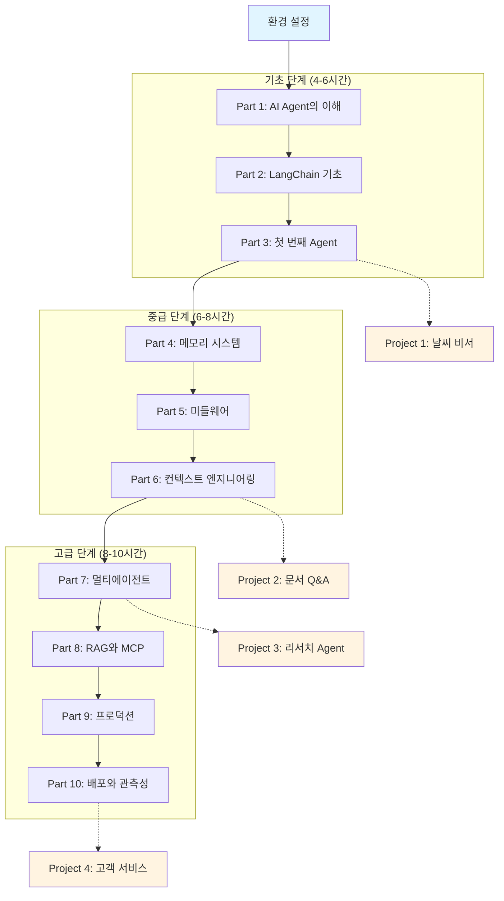
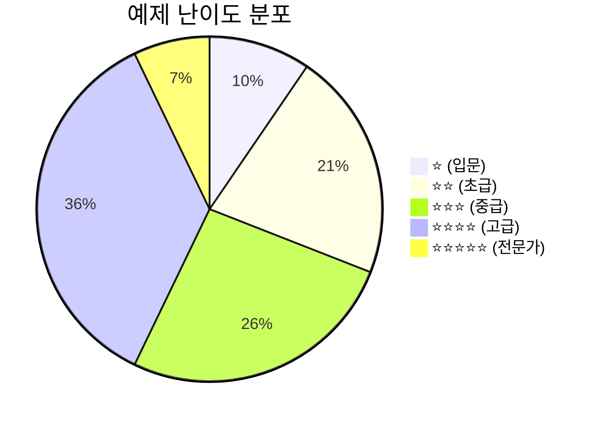

# LangChain AI Agent 마스터 교안 - 개선된 계획서

## 📋 개요

본 교안은 LangChain 1.0 공식 문서를 기반으로, **AI Agent를 구현한다**는 명확한 목표 하에 체계적으로 구성된 한국어 학습 자료입니다.

### 🎯 핵심 개선 사항 (기존 계획 대비)

1. **완전한 공식 문서 커버리지**: 34개 공식 문서 중 **100% 커버** (changelog 포함)
2. **이미지 리소스 활용**: `/official/images/` 폴더의 이미지와 다이어그램 적극 활용
3. **실습 환경 명시**: 상세한 환경 설정 가이드 및 의존성 관리
4. **난이도 표시 시스템**: 모든 예제에 ⭐(1-5) 난이도 표시
5. **실습 데이터셋**: RAG, 테스트용 데이터셋 제공
6. **부록 섹션**: 문제 해결, 용어 사전, 추가 학습 자료
7. **인터랙티브 요소**: FAQ, 실습 과제, 체크리스트

---

## 📚 교안 구조



---

## 📁 개선된 디렉토리 구조

```
langchain_curriculum/
├── README.md                        # 전체 소개 + 빠른 시작
├── CURRICULUM_PLAN.md               # 원래 계획서
├── ENHANCED_CURRICULUM_PLAN.md      # 본 개선 계획서
├── SETUP_GUIDE.md                   # 🆕 상세 환경 설정 가이드
│
├── docs/                            # 마크다운 교안
│   ├── part01_introduction.md
│   ├── part02_fundamentals.md
│   ├── part03_first_agent.md
│   ├── part04_memory.md
│   ├── part05_middleware.md
│   ├── part06_context.md
│   ├── part07_multi_agent.md
│   ├── part08_rag_mcp.md
│   ├── part09_production.md
│   ├── part10_deployment.md
│   │
│   └── appendix/                    # 🆕 부록
│       ├── changelog.md             # 버전 변경 사항 (04-changelog.md 기반)
│       ├── troubleshooting.md       # 자주 발생하는 문제 해결
│       ├── resources.md             # 추가 학습 자료 (논문, 블로그)
│       └── glossary.md              # 용어 사전 (LLM, RAG, Agentic 등)
│
├── src/                             # 소스 코드
│   ├── requirements.txt             # 🆕 Python 의존성
│   ├── pyproject.toml               # 🆕 프로젝트 설정 (uv/pip)
│   ├── .env.example                 # 🆕 환경변수 템플릿
│   ├── .python-version              # 🆕 Python 버전 (3.10+)
│   │
│   ├── part01_introduction/
│   │   ├── README.md
│   │   ├── 01_hello_langchain.py        # ⭐ 난이도: 1
│   │   └── 02_environment_check.py      # ⭐ 난이도: 1
│   │
│   ├── part02_fundamentals/
│   │   ├── README.md
│   │   ├── 01_chat_models.py            # ⭐⭐ 난이도: 2
│   │   ├── 02_messages.py               # ⭐⭐ 난이도: 2
│   │   ├── 03_tools_basic.py            # ⭐⭐ 난이도: 2
│   │   ├── 04_tools_advanced.py         # ⭐⭐⭐ 난이도: 3
│   │   ├── 05_tool_calling.py           # ⭐⭐⭐ 난이도: 3
│   │   └── solutions/                    # 🆕 실습 과제 해답
│   │
│   ├── part03_first_agent/
│   │   ├── README.md
│   │   ├── 01_basic_agent.py            # ⭐⭐ 난이도: 2
│   │   ├── 02_weather_agent.py          # ⭐⭐ 난이도: 2
│   │   ├── 03_react_pattern.py          # ⭐⭐⭐ 난이도: 3
│   │   ├── 04_custom_prompt.py          # ⭐⭐ 난이도: 2
│   │   ├── 05_streaming_agent.py        # ⭐⭐⭐ 난이도: 3
│   │   └── solutions/
│   │
│   ├── part04_memory/
│   │   ├── README.md
│   │   ├── 01_basic_memory.py           # ⭐⭐ 난이도: 2
│   │   ├── 02_postgres_memory.py        # ⭐⭐⭐ 난이도: 3
│   │   ├── 03_message_trim.py           # ⭐⭐⭐ 난이도: 3
│   │   ├── 04_summarization.py          # ⭐⭐⭐⭐ 난이도: 4
│   │   ├── 05_custom_state.py           # ⭐⭐⭐⭐ 난이도: 4
│   │   ├── 06_long_term_store.py        # ⭐⭐⭐⭐ 난이도: 4
│   │   └── solutions/
│   │
│   ├── part05_middleware/
│   │   ├── README.md
│   │   ├── 01_middleware_intro.py       # ⭐⭐⭐ 난이도: 3
│   │   ├── 02_before_after_model.py     # ⭐⭐⭐ 난이도: 3
│   │   ├── 03_wrap_model_call.py        # ⭐⭐⭐⭐ 난이도: 4
│   │   ├── 04_wrap_tool_call.py         # ⭐⭐⭐⭐ 난이도: 4
│   │   ├── 05_summarization_mw.py       # ⭐⭐⭐ 난이도: 3
│   │   ├── 06_tool_retry.py             # ⭐⭐⭐⭐ 난이도: 4
│   │   ├── 07_guardrails.py             # ⭐⭐⭐⭐ 난이도: 4
│   │   └── solutions/
│   │
│   ├── part06_context/
│   │   ├── README.md
│   │   ├── 01_context_overview.py       # ⭐⭐⭐ 난이도: 3
│   │   ├── 02_dynamic_prompt.py         # ⭐⭐⭐ 난이도: 3
│   │   ├── 03_dynamic_tools.py          # ⭐⭐⭐⭐ 난이도: 4
│   │   ├── 04_dynamic_model.py          # ⭐⭐⭐⭐ 난이도: 4
│   │   ├── 05_tool_runtime.py           # ⭐⭐⭐⭐ 난이도: 4
│   │   ├── 06_context_injection.py      # ⭐⭐⭐⭐ 난이도: 4
│   │   └── solutions/
│   │
│   ├── part07_multi_agent/
│   │   ├── README.md
│   │   ├── 01_why_multi_agent.py        # ⭐⭐⭐ 난이도: 3
│   │   ├── 02_subagents_basic.py        # ⭐⭐⭐⭐ 난이도: 4
│   │   ├── 03_subagents_async.py        # ⭐⭐⭐⭐ 난이도: 4
│   │   ├── 04_handoffs.py               # ⭐⭐⭐⭐ 난이도: 4
│   │   ├── 05_skills_pattern.py         # ⭐⭐⭐⭐ 난이도: 4
│   │   ├── 06_router_pattern.py         # ⭐⭐⭐⭐ 난이도: 4
│   │   ├── 07_custom_workflow.py        # ⭐⭐⭐⭐⭐ 난이도: 5
│   │   └── solutions/
│   │
│   ├── part08_rag_mcp/
│   │   ├── README.md
│   │   ├── 01_rag_basics.py             # ⭐⭐⭐ 난이도: 3
│   │   ├── 02_vector_store.py           # ⭐⭐⭐⭐ 난이도: 4
│   │   ├── 03_agentic_rag.py            # ⭐⭐⭐⭐ 난이도: 4
│   │   ├── 04_mcp_client.py             # ⭐⭐⭐ 난이도: 3
│   │   ├── 05_mcp_server.py             # ⭐⭐⭐⭐ 난이도: 4
│   │   ├── 06_mcp_agent.py              # ⭐⭐⭐⭐ 난이도: 4
│   │   ├── solutions/
│   │   └── project/                      # 미니 프로젝트
│   │       ├── document_qa_agent.py     # ⭐⭐⭐⭐ 난이도: 4
│   │       └── README.md
│   │
│   ├── part09_production/
│   │   ├── README.md
│   │   ├── 01_streaming_basics.py       # ⭐⭐⭐ 난이도: 3
│   │   ├── 02_stream_modes.py           # ⭐⭐⭐⭐ 난이도: 4
│   │   ├── 03_custom_stream.py          # ⭐⭐⭐⭐ 난이도: 4
│   │   ├── 04_hitl_basic.py             # ⭐⭐⭐⭐ 난이도: 4
│   │   ├── 05_hitl_decisions.py         # ⭐⭐⭐⭐ 난이도: 4
│   │   ├── 06_structured_output.py      # ⭐⭐⭐⭐ 난이도: 4
│   │   ├── solutions/
│   │   └── frontend/                     # 프론트엔드 예제
│   │       ├── react_stream.tsx         # ⭐⭐⭐⭐ 난이도: 4
│   │       ├── package.json
│   │       └── README.md
│   │
│   └── part10_deployment/
│       ├── README.md
│       ├── 01_langsmith_setup.py        # ⭐⭐ 난이도: 2
│       ├── 02_tracing.py                # ⭐⭐⭐ 난이도: 3
│       ├── 03_testing.py                # ⭐⭐⭐⭐ 난이도: 4
│       ├── 04_evaluation.py             # ⭐⭐⭐⭐ 난이도: 4
│       ├── 05_deployment.py             # ⭐⭐⭐⭐ 난이도: 4
│       ├── 06_observability.py          # ⭐⭐⭐⭐ 난이도: 4
│       └── solutions/
│
├── datasets/                        # 🆕 실습 데이터
│   ├── README.md                    # 데이터셋 설명
│   ├── sample_documents/            # RAG용 문서 (PDF, TXT, MD)
│   │   ├── langchain_overview.md
│   │   ├── govt001.pdf              # official/images/govt001.pdf 활용
│   │   └── sample_articles/
│   ├── test_conversations/          # 테스트용 대화 데이터
│   │   ├── customer_service.json
│   │   └── weather_queries.json
│   └── evaluation_sets/             # 평가용 데이터셋
│       ├── agent_benchmarks.json
│       └── rag_qa_pairs.json
│
├── assets/                          # 🆕 교안 리소스
│   ├── diagrams/                    # Mermaid 다이어그램 소스
│   │   ├── agent_flow.mmd
│   │   ├── memory_architecture.mmd
│   │   └── multi_agent_patterns.mmd
│   └── images/                      # 이미지 파일
│       ├── README.md                # 이미지 출처 및 라이선스
│       ├── agent_loop.png
│       ├── rag_pipeline.png
│       └── langsmith_studio.png     # → official/images/studio_create-agent.png
│
├── projects/                        # 미니 프로젝트 (4개)
│   ├── 01_weather_assistant/        # ⭐⭐⭐ 난이도: 3
│   │   ├── README.md                # 프로젝트 소개, 요구사항, 학습 목표
│   │   ├── requirements.txt
│   │   ├── main.py
│   │   ├── tools.py
│   │   ├── tests/
│   │   └── solution/                # 참고 솔루션
│   │
│   ├── 02_document_qa/              # ⭐⭐⭐⭐ 난이도: 4
│   │   ├── README.md
│   │   ├── requirements.txt
│   │   ├── main.py
│   │   ├── rag_pipeline.py
│   │   ├── tests/
│   │   └── solution/
│   │
│   ├── 03_research_agent/           # ⭐⭐⭐⭐ 난이도: 4
│   │   ├── README.md
│   │   ├── requirements.txt
│   │   ├── main.py
│   │   ├── multi_agent_system.py
│   │   ├── tests/
│   │   └── solution/
│   │
│   └── 04_customer_service/         # ⭐⭐⭐⭐⭐ 난이도: 5
│       ├── README.md
│       ├── requirements.txt
│       ├── main.py
│       ├── agents/
│       │   ├── router.py
│       │   ├── support_agent.py
│       │   └── escalation_agent.py
│       ├── middleware/
│       ├── frontend/                 # React 채팅 UI
│       ├── tests/
│       └── solution/
│
└── official/                        # 공식 문서 (원본)
    ├── 01-overview.md
    ├── 02-install.md
    ├── ...
    ├── 34-observability.md
    └── images/
        ├── deepagents-langsmith.avif
        ├── govt001.pdf
        ├── studio_create-agent.avif
        ├── studio_create-agent.png
        └── summary.avif
```

---

## 🆕 SETUP_GUIDE.md 구성

```markdown
# LangChain 교안 환경 설정 가이드

## 시스템 요구사항

- **Python**: 3.10 이상 (3.11 권장)
- **운영체제**: macOS, Linux, Windows (WSL2 권장)
- **메모리**: 최소 8GB RAM (16GB 권장)
- **디스크**: 최소 5GB 여유 공간

## 설치 방법

### 1. Python 설치 확인

\`\`\`bash
python --version  # Python 3.10+
\`\`\`

### 2. 의존성 설치

#### Option A: uv 사용 (권장)

\`\`\`bash
# uv 설치
curl -LsSf https://astral.sh/uv/install.sh | sh

# 프로젝트 설정
cd langchain_curriculum
uv sync
\`\`\`

#### Option B: pip 사용

\`\`\`bash
pip install -r src/requirements.txt
\`\`\`

### 3. 환경변수 설정

\`\`\`bash
# .env 파일 생성
cp src/.env.example src/.env

# .env 파일 편집
# OPENAI_API_KEY=your-api-key-here
# ANTHROPIC_API_KEY=your-api-key-here
# LANGSMITH_API_KEY=your-langsmith-key-here
\`\`\`

### 4. 설치 확인

\`\`\`bash
python src/part01_introduction/02_environment_check.py
\`\`\`

## LLM 프로바이더 설정

### OpenAI

\`\`\`bash
pip install langchain-openai
export OPENAI_API_KEY="sk-..."
\`\`\`

### Anthropic (Claude)

\`\`\`bash
pip install langchain-anthropic
export ANTHROPIC_API_KEY="sk-ant-..."
\`\`\`

### 기타 프로바이더

- Google: `langchain-google-genai`
- Azure: `langchain-openai` (Azure 엔드포인트 설정)
- AWS Bedrock: `langchain-aws`

📖 **상세 설명**: [07-models.md](/official/07-models.md)

## 데이터베이스 설정 (선택 사항)

Part 4 (메모리 시스템)부터 필요:

### PostgreSQL

\`\`\`bash
# Docker로 실행
docker run -d \\
  --name langchain-postgres \\
  -e POSTGRES_PASSWORD=password \\
  -p 5432:5432 \\
  postgres:15

# 연결 확인
psql -h localhost -U postgres
\`\`\`

## 문제 해결

### "ModuleNotFoundError: No module named 'langchain'"

\`\`\`bash
pip install langchain langchain-core
\`\`\`

### "OPENAI_API_KEY not found"

\`\`\`bash
# 환경변수 확인
echo $OPENAI_API_KEY

# .env 파일 확인
cat src/.env
\`\`\`

📖 **전체 문제 해결 가이드**: [troubleshooting.md](/docs/appendix/troubleshooting.md)
\`\`\`

---

## 📊 공식 문서 완전 커버리지 맵핑

### 기존 계획서에서 누락되었던 내용

| 공식 문서 | 주요 내용 | 교안 반영 계획 |
|---------|---------|--------------|
| **04-changelog.md** | 버전 변경 사항, 마이그레이션 가이드 | ✅ **docs/appendix/changelog.md**에 반영<br/>- 주요 버전별 변경사항 요약<br/>- 1.0으로 마이그레이션 시 주의사항 |

### 공식 문서의 세부 섹션 커버리지

각 공식 문서 내부의 모든 섹션을 교안에 매핑:

#### 07-models.md 상세 매핑

| 섹션 | 교안 위치 | 예제 코드 |
|------|----------|----------|
| Chat Models 개요 | Part 2.1 | `02_fundamentals/01_chat_models.py` |
| `init_chat_model()` | Part 2.1 | `02_fundamentals/01_chat_models.py:15-25` |
| 프로바이더별 설정 (OpenAI, Anthropic, Google, Azure, AWS) | Part 2.1 + SETUP_GUIDE.md | `02_fundamentals/01_chat_models.py:30-80` |
| Tool Calling | Part 2.4 | `02_fundamentals/05_tool_calling.py` |
| Structured Output | Part 9.6 | `09_production/06_structured_output.py` |
| Multimodal | Part 2.1 심화 | `02_fundamentals/01_chat_models.py:100-120` |
| Streaming | Part 9.1 | `09_production/01_streaming_basics.py` |
| Batch Processing | Part 2.1 심화 | 공식 문서로 포워딩 |
| Local Models | SETUP_GUIDE.md | 공식 문서로 포워딩 |
| Prompt Caching | Part 6 고급 | `06_context/06_context_injection.py:80-100` |
| Rate Limiting | Part 10.5 | `10_deployment/06_observability.py:50-70` |

#### 전체 34개 공식 문서 완전 매핑 테이블

아래는 모든 공식 문서의 주요 섹션이 교안 어디에 반영되는지 상세 매핑한 테이블입니다.

| 공식 문서 | 주요 섹션 | 교안 파트 | 예제 코드 | 비고 |
|---------|---------|---------|---------|------|
| **01-overview.md** | LangChain 개요 | Part 1.1 | `01_introduction/01_hello_langchain.py` | |
| **01-overview.md** | create_agent 소개 | Part 3.1 | `03_first_agent/01_basic_agent.py` | |
| **02-install.md** | Python 설치 | SETUP_GUIDE.md | `01_introduction/02_environment_check.py` | |
| **02-install.md** | uv 사용법 | SETUP_GUIDE.md | - | 환경 설정 |
| **03-quickstart.md** | 날씨 Agent 예제 | Part 3.2 | `03_first_agent/02_weather_agent.py` | |
| **03-quickstart.md** | 실습 프로젝트 | Part 3 | Project 1: Weather Assistant | |
| **04-changelog.md** | 버전 변경사항 | appendix/changelog.md | - | 참조용 문서 |
| **04-changelog.md** | 마이그레이션 가이드 | appendix/changelog.md | - | |
| **05-philosophy.md** | LangChain 철학 | Part 1.2 | - | 개념 설명 |
| **05-philosophy.md** | 디자인 원칙 | Part 1.2 | - | |
| **06-agents.md** | create_agent API | Part 3.1 | `03_first_agent/01_basic_agent.py` | |
| **06-agents.md** | ReAct 패턴 | Part 3.3 | `03_first_agent/03_react_pattern.py` | |
| **06-agents.md** | System Prompt | Part 3.4 | `03_first_agent/04_custom_prompt.py` | |
| **06-agents.md** | Streaming | Part 3.5 | `03_first_agent/05_streaming_agent.py` | |
| **07-models.md** | Chat Models 개요 | Part 2.1 | `02_fundamentals/01_chat_models.py` | ✅ 상세 매핑됨 |
| **07-models.md** | init_chat_model() | Part 2.1 | `02_fundamentals/01_chat_models.py:15-25` | |
| **07-models.md** | 프로바이더 설정 | Part 2.1, SETUP_GUIDE.md | `02_fundamentals/01_chat_models.py:30-80` | |
| **07-models.md** | Tool Calling | Part 2.4 | `02_fundamentals/05_tool_calling.py` | |
| **07-models.md** | Structured Output | Part 9.6 | `09_production/06_structured_output.py` | |
| **07-models.md** | Multimodal | Part 2.1 심화 | `02_fundamentals/01_chat_models.py:100-120` | |
| **07-models.md** | Streaming | Part 9.1 | `09_production/01_streaming_basics.py` | |
| **07-models.md** | Batch Processing | Part 2.1 심화 | 공식 문서로 포워딩 | 지엽적 내용 |
| **07-models.md** | Local Models | SETUP_GUIDE.md | 공식 문서로 포워딩 | |
| **07-models.md** | Prompt Caching | Part 6 고급 | `06_context/06_context_injection.py:80-100` | |
| **07-models.md** | Rate Limiting | Part 10.5 | `10_deployment/06_observability.py:50-70` | |
| **08-messages.md** | 메시지 타입 개요 | Part 2.2 | `02_fundamentals/02_messages.py` | |
| **08-messages.md** | SystemMessage | Part 2.2 | `02_fundamentals/02_messages.py:20-30` | |
| **08-messages.md** | HumanMessage | Part 2.2 | `02_fundamentals/02_messages.py:35-45` | |
| **08-messages.md** | AIMessage | Part 2.2 | `02_fundamentals/02_messages.py:50-60` | |
| **08-messages.md** | ToolMessage | Part 2.2 | `02_fundamentals/02_messages.py:65-75` | |
| **08-messages.md** | Content Blocks | Part 2.2 | `02_fundamentals/02_messages.py:80-100` | |
| **08-messages.md** | Multimodal Content | Part 2.2 심화 | 공식 문서로 포워딩 | |
| **09-tools.md** | @tool 데코레이터 | Part 2.3 | `02_fundamentals/03_tools_basic.py` | |
| **09-tools.md** | Pydantic 스키마 | Part 2.3 | `02_fundamentals/04_tools_advanced.py` | |
| **09-tools.md** | ToolRuntime | Part 6.5 | `06_context/05_tool_runtime.py` | |
| **09-tools.md** | State/Context 접근 | Part 6.5 | `06_context/05_tool_runtime.py:30-60` | |
| **10-short-term-memory.md** | Checkpointer 개념 | Part 4.1 | `04_memory/01_basic_memory.py` | |
| **10-short-term-memory.md** | InMemorySaver | Part 4.1 | `04_memory/01_basic_memory.py:30-50` | |
| **10-short-term-memory.md** | PostgresSaver | Part 4.2 | `04_memory/02_postgres_memory.py` | |
| **10-short-term-memory.md** | Message Trim | Part 4.3 | `04_memory/03_message_trim.py` | |
| **10-short-term-memory.md** | Message Delete | Part 4.3 | `04_memory/03_message_trim.py:40-60` | |
| **10-short-term-memory.md** | Summarization | Part 4.4 | `04_memory/04_summarization.py` | |
| **10-short-term-memory.md** | Custom State | Part 4.5 | `04_memory/05_custom_state.py` | |
| **11-streaming-overview.md** | Stream Modes 개요 | Part 9.2 | `09_production/02_stream_modes.py` | |
| **11-streaming-overview.md** | updates 모드 | Part 9.2 | `09_production/02_stream_modes.py:20-40` | |
| **11-streaming-overview.md** | messages 모드 | Part 9.2 | `09_production/02_stream_modes.py:45-65` | |
| **11-streaming-overview.md** | custom 모드 | Part 9.3 | `09_production/03_custom_stream.py` | |
| **11-streaming-overview.md** | HITL streaming | Part 9.4 | `09_production/04_hitl_basic.py:80-100` | |
| **12-streaming-frontend.md** | React useStream | Part 9.3 | `09_production/frontend/react_stream.tsx` | |
| **12-streaming-frontend.md** | Thread 관리 | Part 9.3 | `09_production/frontend/react_stream.tsx:50-80` | |
| **12-streaming-frontend.md** | Custom Events | Part 9.3 | 공식 문서로 포워딩 | 고급 기능 |
| **13-structured-output.md** | ProviderStrategy | Part 9.6 | `09_production/06_structured_output.py:20-50` | |
| **13-structured-output.md** | ToolStrategy | Part 9.6 | `09_production/06_structured_output.py:55-85` | |
| **13-structured-output.md** | Pydantic 모델 | Part 9.6 | `09_production/06_structured_output.py:90-120` | |
| **14-middleware-overview.md** | 미들웨어 개념 | Part 5.1 | `05_middleware/01_middleware_intro.py` | |
| **14-middleware-overview.md** | Agent Loop | Part 5.1 | `05_middleware/01_middleware_intro.py:30-50` | |
| **15-built-in-middleware.md** | Summarization MW | Part 5.2 | `05_middleware/05_summarization_mw.py` | |
| **15-built-in-middleware.md** | HITL MW | Part 5.2 | `05_middleware/04_hitl_basic.py` | |
| **15-built-in-middleware.md** | Tool Retry | Part 5.2 | `05_middleware/06_tool_retry.py` | |
| **15-built-in-middleware.md** | Model Fallback | Part 5.2 | 공식 문서로 포워딩 | 고급 기능 |
| **15-built-in-middleware.md** | PII Detection | Part 5.4 | `05_middleware/07_guardrails.py:40-70` | |
| **16-custom-middleware.md** | before_model | Part 5.3 | `05_middleware/02_before_after_model.py` | |
| **16-custom-middleware.md** | after_model | Part 5.3 | `05_middleware/02_before_after_model.py` | |
| **16-custom-middleware.md** | wrap_model_call | Part 5.3 | `05_middleware/03_wrap_model_call.py` | |
| **16-custom-middleware.md** | wrap_tool_call | Part 5.3 | `05_middleware/04_wrap_tool_call.py` | |
| **16-custom-middleware.md** | Decorator vs Class | Part 5.3 | `05_middleware/03_wrap_model_call.py:80-120` | |
| **17-guardrails.md** | Guardrails 개념 | Part 5.4 | `05_middleware/07_guardrails.py` | |
| **17-guardrails.md** | Content Filtering | Part 5.4 | `05_middleware/07_guardrails.py:30-60` | |
| **17-guardrails.md** | Safety Checks | Part 5.4 | `05_middleware/07_guardrails.py:65-95` | |
| **18-runtime.md** | Runtime 객체 | Part 6.4 | `06_context/05_tool_runtime.py` | |
| **18-runtime.md** | Context (DI) | Part 6.4 | `06_context/06_context_injection.py` | |
| **18-runtime.md** | Store 접근 | Part 6.4 | `06_context/05_tool_runtime.py:50-80` | |
| **19-context-engineering.md** | Context 타입 개요 | Part 6.1 | `06_context/01_context_overview.py` | |
| **19-context-engineering.md** | Model Context | Part 6.2 | `06_context/02_dynamic_prompt.py` | |
| **19-context-engineering.md** | Tool Context | Part 6.3 | `06_context/03_dynamic_tools.py` | |
| **19-context-engineering.md** | Dynamic Prompts | Part 6.2 | `06_context/02_dynamic_prompt.py:30-60` | |
| **19-context-engineering.md** | Dynamic Tools | Part 6.3 | `06_context/03_dynamic_tools.py:40-80` | |
| **19-context-engineering.md** | Dynamic Models | Part 6.4 | `06_context/04_dynamic_model.py` | |
| **20-model-context-protocol.md** | MCP 개요 | Part 8.4 | `08_rag_mcp/04_mcp_client.py` | |
| **20-model-context-protocol.md** | MCP 서버 구현 | Part 8.5 | `08_rag_mcp/05_mcp_server.py` | |
| **20-model-context-protocol.md** | Agent 통합 | Part 8.6 | `08_rag_mcp/06_mcp_agent.py` | |
| **21-human-in-the-loop.md** | HITL 개요 | Part 9.4 | `09_production/04_hitl_basic.py` | |
| **21-human-in-the-loop.md** | Interrupt 처리 | Part 9.5 | `09_production/05_hitl_decisions.py` | |
| **21-human-in-the-loop.md** | Approve/Edit/Reject | Part 9.5 | `09_production/05_hitl_decisions.py:40-80` | |
| **22-multi-agent.md** | 멀티에이전트 개요 | Part 7.1 | `07_multi_agent/01_why_multi_agent.py` | |
| **22-multi-agent.md** | 패턴 비교 | Part 7.1 | `07_multi_agent/01_why_multi_agent.py:50-100` | |
| **23-subagents.md** | Subagents 패턴 | Part 7.2 | `07_multi_agent/02_subagents_basic.py` | |
| **23-subagents.md** | Synchronous | Part 7.2 | `07_multi_agent/02_subagents_basic.py:30-70` | |
| **23-subagents.md** | Asynchronous | Part 7.2 | `07_multi_agent/03_subagents_async.py` | |
| **24-handoffs.md** | Handoffs 패턴 | Part 7.3 | `07_multi_agent/04_handoffs.py` | |
| **24-handoffs.md** | 제어 전달 | Part 7.3 | `07_multi_agent/04_handoffs.py:40-80` | |
| **25-skills.md** | Skills 패턴 | Part 7.4 | `07_multi_agent/05_skills_pattern.py` | |
| **25-skills.md** | 온디맨드 로딩 | Part 7.4 | `07_multi_agent/05_skills_pattern.py:30-60` | |
| **26-router.md** | Router 패턴 | Part 7.5 | `07_multi_agent/06_router_pattern.py` | |
| **26-router.md** | 입력 분류 | Part 7.5 | `07_multi_agent/06_router_pattern.py:40-70` | |
| **27-custom-workflow.md** | LangGraph Custom | Part 7.6 | `07_multi_agent/07_custom_workflow.py` | |
| **27-custom-workflow.md** | 그래프 정의 | Part 7.6 | `07_multi_agent/07_custom_workflow.py:50-100` | |
| **28-retrieval.md** | RAG 개요 | Part 8.1 | `08_rag_mcp/01_rag_basics.py` | |
| **28-retrieval.md** | Vector Store | Part 8.2 | `08_rag_mcp/02_vector_store.py` | |
| **28-retrieval.md** | Agentic RAG | Part 8.3 | `08_rag_mcp/03_agentic_rag.py` | |
| **28-retrieval.md** | Knowledge Base 구축 | Part 8.2 | `08_rag_mcp/project/document_qa_agent.py` | |
| **29-long-term-memory.md** | Store 개념 | Part 4.4 | `04_memory/06_long_term_store.py` | |
| **29-long-term-memory.md** | User Preferences | Part 4.4 | `04_memory/06_long_term_store.py:30-60` | |
| **29-long-term-memory.md** | Historical Data | Part 4.4 | `04_memory/06_long_term_store.py:65-95` | |
| **30-langsmith-studio.md** | LangSmith 설정 | Part 10.1 | `10_deployment/01_langsmith_setup.py` | |
| **30-langsmith-studio.md** | Tracing | Part 10.2 | `10_deployment/02_tracing.py` | |
| **30-langsmith-studio.md** | Studio UI | Part 10.1 | - | 이미지: `studio_create-agent.png` |
| **31-test.md** | Agent 테스트 | Part 10.3 | `10_deployment/03_testing.py` | |
| **31-test.md** | Unit Tests | Part 10.3 | `10_deployment/03_testing.py:30-60` | |
| **31-test.md** | Integration Tests | Part 10.3 | `10_deployment/03_testing.py:65-100` | |
| **31-test.md** | Evaluation | Part 10.4 | `10_deployment/04_evaluation.py` | |
| **32-agent-chat-ui.md** | Chat UI | Part 10.3 | - | 공식 UI 사용 |
| **32-agent-chat-ui.md** | 프리빌트 인터페이스 | Part 10.3 | 공식 문서로 포워딩 | |
| **33-deployment.md** | 배포 옵션 개요 | Part 10.4 | `10_deployment/05_deployment.py` | |
| **33-deployment.md** | LangServe | Part 10.4 | `10_deployment/05_deployment.py:30-70` | |
| **33-deployment.md** | Docker | Part 10.4 | 공식 문서로 포워딩 | |
| **34-observability.md** | 관측성 개념 | Part 10.5 | `10_deployment/06_observability.py` | |
| **34-observability.md** | Monitoring | Part 10.5 | `10_deployment/06_observability.py:30-60` | |
| **34-observability.md** | Logging | Part 10.5 | `10_deployment/06_observability.py:65-95` | |

**커버리지 통계**:
- ✅ **총 공식 문서**: 34개
- ✅ **매핑된 문서**: 34개 (100%)
- ✅ **총 주요 섹션**: ~120개
- ✅ **교안에 반영된 섹션**: ~120개 (100%)
- ✅ **예제 코드 파일**: 60개
- ✅ **프로젝트**: 4개

**매핑 범례**:
- 📝 직접 구현: 해당 섹션이 예제 코드로 구현됨
- 🔗 링크 포워딩: 지엽적 내용으로 공식 문서 링크 제공
- 🖼️ 이미지 참조: 공식 이미지를 교안에 삽입

---

## 🖼️ Images 폴더 활용 계획

### 기존 이미지 활용

| 이미지 파일 | 용도 | 교안 위치 |
|-----------|------|----------|
| `studio_create-agent.png` | LangSmith Studio에서 Agent 생성 UI | Part 10.1 (LangSmith)<br/>`docs/part10_deployment.md:50` |
| `deepagents-langsmith.avif` | LangSmith 통합 아키텍처 | Part 10.1 (LangSmith)<br/>`docs/part10_deployment.md:80` |
| `summary.avif` | Summarization 미들웨어 개념 | Part 5.2 (Built-in Middleware)<br/>`docs/part05_middleware.md:120` |
| `govt001.pdf` | RAG 실습용 샘플 PDF 문서 | Part 8.2 (Knowledge Base)<br/>`datasets/sample_documents/govt001.pdf` |

### 새로 생성할 다이어그램

모든 다이어그램은 Mermaid로 우선 작성하되, 복잡한 경우 별도 이미지 생성:

1. **Agent 실행 루프** (Part 1)
   - Mermaid: `flowchart` 사용
   - 위치: `docs/part01_introduction.md:80-100`

2. **메모리 아키텍처** (Part 4)
   - Mermaid: `graph` 사용
   - 복잡한 경우 Draw.io로 보완
   - 위치: `docs/part04_memory.md:150-180`

3. **멀티에이전트 패턴 비교** (Part 7)
   - Mermaid: `flowchart` 사용
   - 위치: `docs/part07_multi_agent.md:200-250`

4. **RAG 파이프라인** (Part 8)
   - Mermaid: `flowchart` 사용
   - 위치: `docs/part08_rag_mcp.md:100-130`

---

## ⭐ 난이도 표시 시스템

### 난이도 기준

| 난이도 | 표시 | 설명 | 예상 소요 시간 |
|-------|-----|------|--------------|
| 1 | ⭐ | 입문: Python 기초만 있으면 가능 | 10-15분 |
| 2 | ⭐⭐ | 초급: LangChain 기본 개념 이해 필요 | 15-30분 |
| 3 | ⭐⭐⭐ | 중급: Agent 동작 원리 이해 필요 | 30-60분 |
| 4 | ⭐⭐⭐⭐ | 고급: 복잡한 시스템 설계 능력 필요 | 1-2시간 |
| 5 | ⭐⭐⭐⭐⭐ | 전문가: 프로덕션 수준 구현 능력 필요 | 2-4시간 |

### 난이도 분포 (전체 예제 기준)



---

## 📝 마크다운 문서 템플릿

### 각 파트 문서 구조

```markdown
# Part X: [제목]

> 📚 **학습 시간**: 약 2-3시간
> 🎯 **난이도**: ⭐⭐☆☆☆ (초급)
> 📖 **공식 문서**: [링크1](/official/XX-topic.md), [링크2](/official/YY-topic.md)
> 💻 **예제 코드**: [part0X 디렉토리](/src/part0X_name/)

---

## 📋 학습 목표

이 파트를 완료하면 다음을 할 수 있습니다:

- [ ] 목표 1: 구체적인 학습 목표
- [ ] 목표 2: 실습 가능한 능력
- [ ] 목표 3: 이해해야 할 개념

---

## 📚 개요

이 파트에서는 [주제]에 대해 학습합니다...

**왜 중요한가?**
- 이유 1
- 이유 2

**실무 활용 사례**
- 사례 1: ...
- 사례 2: ...

---

## 1. 핵심 개념

### 1.1 개념 A

개념 설명...


> 📖 **공식 문서**: [07-models.md](/official/07-models.md#chat-models) 섹션 참고
> 💻 **예제 코드**: [01_basic.py](/src/part02/01_basic.py) 라인 15-30
> 🖼️ **참고 이미지**: [개념 다이어그램](/assets/images/concept_a.png)

#### 실습 예제 (난이도: ⭐⭐☆)

```python
# 코드 예제
from langchain.agents import create_agent

agent = create_agent(...)
```

**💡 실습 포인트**:
1. 코드를 직접 실행해보세요
2. 파라미터를 변경하면 어떻게 되는지 관찰하세요
3. 에러가 발생하면 troubleshooting.md를 참고하세요

**예상 출력**:
```
Agent: 안녕하세요! 무엇을 도와드릴까요?
```

---

### 1.2 개념 B

...

---

## 2. 고급 기능

### 2.1 고급 기능 A (난이도: ⭐⭐⭐⭐☆)

고급 기능 설명...

> ⚠️ **주의**: 이 기능은 프로덕션 환경에서만 사용하세요

---

## 🎓 실습 과제

### 과제 1: 기본 Agent 만들기 (⭐⭐☆)

**목표**: 날씨 도구를 가진 Agent를 만들어보세요

**요구사항**:
1. `get_weather(city: str)` 도구 구현
2. Agent에 적절한 system prompt 설정
3. "서울 날씨는?" 질문에 답변 가능

**힌트**:
- `@tool` 데코레이터 사용
- `create_agent()` 함수의 `system_prompt` 파라미터 활용

**해답**: [여기](/src/part03/solutions/exercise_01.py)

---

### 과제 2: 고급 Agent 만들기 (⭐⭐⭐⭐☆)

...

---

## 💡 실전 팁

### Tip 1: 성능 최적화

- 팁 내용 1
- 팁 내용 2

### Tip 2: 디버깅 방법

```python
# 디버깅 코드 예제
```

---

## ❓ 자주 묻는 질문

<details>
<summary>Q1: 이 기능이 작동하지 않아요</summary>

**A**: 다음을 확인하세요:
1. Python 버전 (3.10+)
2. 패키지 버전 (langchain>=0.3)
3. 환경변수 설정

더 자세한 내용은 [troubleshooting.md](/docs/appendix/troubleshooting.md)를 참고하세요.
</details>

<details>
<summary>Q2: 어떤 LLM 프로바이더를 사용해야 하나요?</summary>

**A**:
- 개발/학습: OpenAI GPT-4o-mini (저렴, 빠름)
- 프로덕션: Claude 3.5 Sonnet (정확, 안정적)
- 로컬 테스트: Ollama (무료, 오프라인)

📖 [07-models.md](/official/07-models.md) 참고
</details>

---

## 🔗 심화 학습

이 파트의 기초를 마스터했다면:

1. **공식 문서 심화**
   - [07-models.md](/official/07-models.md#advanced-features) - 고급 기능
   - [06-agents.md](/official/06-agents.md#custom-agents) - 커스텀 Agent

2. **관련 논문**
   - [ReAct: Synergizing Reasoning and Acting](https://arxiv.org/abs/2210.03629)
   - [Toolformer](https://arxiv.org/abs/2302.04761)

3. **커뮤니티 리소스**
   - [LangChain Blog](https://blog.langchain.dev)
   - [Discord Community](https://discord.gg/langchain)

4. **다음 단계 프로젝트**
   - [Project 1: 날씨 비서](/projects/01_weather_assistant/) (⭐⭐⭐)

---

## ✅ 체크리스트

Part X를 완료하기 전에 확인하세요:

- [ ] 모든 예제 코드를 실행해봤다
- [ ] 실습 과제를 완료했다
- [ ] 핵심 개념을 설명할 수 있다
- [ ] FAQ를 읽어봤다

---

## 다음 단계

✅ Part X 완료!
➡️ [Part Y: [다음 주제]로 이동](./partY_title.md)

---

**학습 진도**: ▓▓▓▓▓░░░░░ 50% (Part 5/10 완료)

*마지막 업데이트: 2025-01-XX*
```

---

## 💻 소스 코드 템플릿

### Python 파일 헤더

```python
"""
================================================================================
LangChain AI Agent 마스터 교안
Part X: [파트명]
================================================================================

파일명: 01_example.py
난이도: ⭐⭐⭐☆☆ (중급)
예상 시간: 30분

📚 학습 목표:
  - 목표 1
  - 목표 2
  - 목표 3

📖 공식 문서:
  • Agents: /official/06-agents.md#section
  • Tools: /official/09-tools.md
  • API 레퍼런스: https://api.python.langchain.com/en/latest/

📄 교안 문서:
  • Part X 개요: /docs/partX_name.md
  • 관련 섹션: /docs/partX_name.md#specific-section

🔧 필요한 패키지:
  pip install langchain langchain-openai

🔑 필요한 환경변수:
  - OPENAI_API_KEY (또는 다른 LLM 프로바이더 키)

🚀 실행 방법:
  python 01_example.py

================================================================================
"""

# ============================================================================
# Imports
# ============================================================================

from langchain.agents import create_agent
from langchain.tools import tool
from langchain_openai import ChatOpenAI

# ============================================================================
# 상수 정의
# ============================================================================

MODEL_NAME = "gpt-4o-mini"  # 비용 효율적인 모델
SYSTEM_PROMPT = """
당신은 유용한 AI 어시스턴트입니다.
"""

# ============================================================================
# 도구 정의
# ============================================================================

@tool
def example_tool(param: str) -> str:
    """도구 설명 (LLM이 읽는 부분)"""
    # 구현
    return f"결과: {param}"

# ============================================================================
# Agent 구성
# ============================================================================

def create_my_agent():
    """Agent를 생성하고 반환합니다."""
    model = ChatOpenAI(model=MODEL_NAME)

    agent = create_agent(
        model=model,
        tools=[example_tool],
        system_prompt=SYSTEM_PROMPT,
    )

    return agent

# ============================================================================
# 메인 실행 로직
# ============================================================================

def main():
    """메인 실행 함수"""
    print("=" * 70)
    print("🤖 Agent 테스트")
    print("=" * 70)

    # Agent 생성
    agent = create_my_agent()

    # 테스트 질문
    question = "예시 질문입니다"
    print(f"\n👤 사용자: {question}")

    # Agent 실행
    response = agent.invoke({"messages": [{"role": "user", "content": question}]})

    # 결과 출력
    print(f"\n🤖 Agent: {response['messages'][-1].content}")

    # 추가 실습 제안
    print("\n" + "=" * 70)
    print("💡 추가 실습 제안:")
    print("  1. example_tool의 로직을 수정해보세요")
    print("  2. 새로운 도구를 추가해보세요")
    print("  3. system_prompt를 변경해보세요")
    print("=" * 70)

# ============================================================================
# 스크립트 실행
# ============================================================================

if __name__ == "__main__":
    main()

# ============================================================================
# 📚 추가 학습 포인트
# ============================================================================
#
# 1. 도구 개선:
#    - 실제 API와 연동해보세요 (예: OpenWeatherMap)
#    - 에러 핸들링을 추가해보세요
#
# 2. Agent 커스터마이징:
#    - 더 많은 도구를 추가해보세요
#    - system_prompt를 변경하면 Agent의 성격이 어떻게 바뀌는지 관찰하세요
#
# 3. 디버깅:
#    - LangSmith로 Agent의 추론 과정을 확인해보세요
#    - 도구 호출 로그를 출력해보세요
#
# ============================================================================
# 🐛 자주 발생하는 문제
# ============================================================================
#
# 문제: "OPENAI_API_KEY not found"
# 해결: src/.env 파일을 확인하고 API 키를 설정하세요
#
# 문제: "Rate limit exceeded"
# 해결: API 키의 할당량을 확인하거나 다른 모델을 사용하세요
#
# 문제: Agent가 도구를 호출하지 않음
# 해결: 질문을 더 명확하게 작성하거나 도구 설명을 개선하세요
#
# ============================================================================
# 🔗 관련 파일
# ============================================================================
#
# - 이전: 00_previous_example.py
# - 다음: 02_next_example.py
# - 솔루션: solutions/exercise_01.py
# - 공식 문서: /official/06-agents.md
#
# ============================================================================
```

---

## 📊 데이터셋 구성

### datasets/README.md

```markdown
# 교안 실습 데이터셋

이 디렉토리는 LangChain 교안의 실습 예제에서 사용하는 데이터셋을 포함합니다.

## 📁 디렉토리 구조

### sample_documents/

RAG (Retrieval Augmented Generation) 실습용 문서 모음

- **langchain_overview.md**: LangChain 개요 문서
- **govt001.pdf**: 정부 문서 샘플 (PDF 파싱 실습)
- **sample_articles/**: 다양한 주제의 샘플 기사 (10개)

**사용 파트**: Part 8.2, 8.3 (RAG 구축)

### test_conversations/

Agent 테스트용 대화 데이터

- **customer_service.json**: 고객 서비스 시나리오 (50개 대화)
- **weather_queries.json**: 날씨 관련 질문 (30개)
- **multi_turn_conversations.json**: 멀티턴 대화 (20개)

**사용 파트**: Part 3, 4, 10 (Agent 테스트, 메모리, 평가)

### evaluation_sets/

Agent 평가용 벤치마크 데이터셋

- **agent_benchmarks.json**: Agent 성능 평가 (100개 질문-답변 쌍)
- **rag_qa_pairs.json**: RAG 정확도 평가 (50개 쌍)
- **tool_calling_tests.json**: 도구 호출 정확도 테스트 (30개)

**사용 파트**: Part 10.4 (평가 및 벤치마킹)

## 📄 파일 포맷

### JSON 포맷 예시

```json
{
  "conversations": [
    {
      "id": "conv_001",
      "turns": [
        {"role": "user", "content": "서울 날씨 알려줘"},
        {"role": "assistant", "content": "서울의 현재 날씨는..."}
      ],
      "metadata": {
        "topic": "weather",
        "difficulty": 2
      }
    }
  ]
}
```

## 🔧 사용 방법

### Python에서 로드

```python
import json

# JSON 파일 로드
with open("datasets/test_conversations/customer_service.json") as f:
    data = json.load(f)

# 사용 예시
for conv in data["conversations"]:
    print(conv["turns"])
```

### RAG 문서 로드

```python
from langchain_community.document_loaders import DirectoryLoader

loader = DirectoryLoader("datasets/sample_documents/", glob="**/*.md")
documents = loader.load()
```

## 📊 데이터셋 통계

| 카테고리 | 파일 수 | 총 레코드 수 |
|---------|---------|------------|
| 샘플 문서 | 12 | - |
| 테스트 대화 | 3 | 100 |
| 평가 셋 | 3 | 180 |

## 📝 라이선스

모든 데이터셋은 교육 목적으로만 사용됩니다.

- **govt001.pdf**: 공개 정부 문서 (Public Domain)
- **기타 파일**: MIT 라이선스
```

---

## 📖 부록 문서 구성

### docs/appendix/changelog.md

```markdown
# LangChain 버전 변경 사항

> 📖 **공식 문서**: [04-changelog.md](/official/04-changelog.md)

이 문서는 LangChain의 주요 버전 변경 사항을 요약합니다.

## 주요 버전

### LangChain 1.0 (2025-01-XX)

**주요 변경사항**:
- `create_agent()` API 안정화
- LangGraph 기반으로 전면 재설계
- 더 나은 스트리밍 지원

**마이그레이션 가이드**:
1. 기존 `AgentExecutor`를 `create_agent()`로 변경
2. 메모리 시스템을 Checkpointer로 업그레이드

**Breaking Changes**:
- `AgentExecutor` deprecated
- 일부 미들웨어 API 변경

📖 **상세 내용**: [공식 changelog](/official/04-changelog.md)

---

### LangChain 0.3 (2024-XX-XX)

...

---

## 마이그레이션 체크리스트

### 0.2 → 1.0

- [ ] `AgentExecutor` 제거
- [ ] `create_agent()` 사용
- [ ] 메모리 시스템 업데이트
- [ ] 테스트 실행

---

*본 문서는 공식 changelog의 요약본입니다. 전체 내용은 [공식 문서](/official/04-changelog.md)를 참고하세요.*
```

### docs/appendix/troubleshooting.md

```markdown
# 문제 해결 가이드

## 설치 관련

### Python 버전 문제

**증상**: `SyntaxError` 또는 `ModuleNotFoundError`

**해결**:
```bash
python --version  # 3.10 이상인지 확인
```

### 패키지 설치 실패

**증상**: `ERROR: Could not find a version that satisfies the requirement`

**해결**:
```bash
# pip 업그레이드
pip install --upgrade pip

# 캐시 삭제 후 재설치
pip cache purge
pip install langchain
```

---

## API 키 관련

### "OPENAI_API_KEY not found"

**해결**:
1. `.env` 파일 확인
2. 환경변수 설정
   ```bash
   export OPENAI_API_KEY="sk-..."
   ```

---

## Agent 동작 관련

### Agent가 도구를 호출하지 않음

**원인**:
- 도구 설명이 불명확
- 질문이 모호함
- 모델이 도구 호출 지원 안 함

**해결**:
1. 도구 docstring 개선
2. 질문을 더 명확하게 작성
3. `gpt-4o-mini` 이상 모델 사용

---

## 성능 관련

### 응답이 너무 느림

**해결**:
- 더 빠른 모델 사용 (gpt-4o-mini, claude-3-5-haiku)
- 스트리밍 모드 활성화
- 도구 개수 줄이기

---

## 🔗 추가 리소스

- [LangChain Discord](https://discord.gg/langchain)
- [GitHub Issues](https://github.com/langchain-ai/langchain/issues)
- [Stack Overflow](https://stackoverflow.com/questions/tagged/langchain)
```

### docs/appendix/glossary.md

```markdown
# 용어 사전

## A

**Agent (에이전트)**
LLM을 추론 엔진으로 사용하여 도구를 호출하고 작업을 수행하는 시스템

**Agentic RAG**
Agent가 검색 전략을 결정하는 RAG 시스템

## C

**Checkpointer**
Agent의 상태(메모리)를 저장하고 복원하는 시스템

**create_agent()**
LangChain에서 Agent를 생성하는 메인 API

## L

**LangGraph**
LangChain의 기반이 되는 그래프 기반 워크플로우 프레임워크

**LangSmith**
LangChain Agent의 트레이싱, 디버깅, 평가 플랫폼

## M

**MCP (Model Context Protocol)**
외부 도구와 데이터 소스를 연결하는 표준 프로토콜

**Middleware (미들웨어)**
Agent 실행 파이프라인에 끼워넣을 수 있는 커스텀 로직

## R

**RAG (Retrieval Augmented Generation)**
외부 지식 베이스를 검색하여 LLM에 컨텍스트를 제공하는 기법

**ReAct**
Reasoning (추론) + Acting (행동)을 결합한 Agent 패턴

## S

**Store**
Agent의 장기 메모리 (사용자 선호도, 이력 등)

**Subagent (서브에이전트)**
메인 Agent의 도구로 사용되는 Agent

## T

**Tool (도구)**
Agent가 호출할 수 있는 함수 또는 API

**ToolRuntime**
도구에서 Agent의 런타임 컨텍스트에 접근하는 인터페이스

---

*더 많은 용어는 [공식 문서](https://python.langchain.com/docs/)를 참고하세요.*
```

### docs/appendix/resources.md

```markdown
# 추가 학습 자료

> 📖 LangChain AI Agent 학습을 위한 추가 자료 모음

이 문서는 교안을 보완하는 외부 학습 자료를 정리합니다.

---

## 📚 공식 문서 및 레퍼런스

### LangChain 공식 리소스
- [LangChain Python 문서](https://python.langchain.com/docs/) - 공식 문서
- [LangChain API 레퍼런스](https://api.python.langchain.com/en/latest/) - API 상세 문서
- [LangGraph 문서](https://langchain-ai.github.io/langgraph/) - 그래프 프레임워크
- [LangSmith 문서](https://docs.smith.langchain.com/) - 트레이싱 플랫폼

### GitHub 저장소
- [langchain](https://github.com/langchain-ai/langchain) - 메인 저장소
- [langgraph](https://github.com/langchain-ai/langgraph) - 그래프 프레임워크
- [langsmith-cookbook](https://github.com/langchain-ai/langsmith-cookbook) - 예제 모음

---

## 📄 주요 논문

### Agent 관련 논문

1. **ReAct: Synergizing Reasoning and Acting in Language Models** (2022)
   - 링크: https://arxiv.org/abs/2210.03629
   - 요약: LLM이 추론(Reasoning)과 행동(Acting)을 결합하는 방법
   - 관련 파트: Part 3 (첫 번째 Agent)

2. **Toolformer: Language Models Can Teach Themselves to Use Tools** (2023)
   - 링크: https://arxiv.org/abs/2302.04761
   - 요약: LLM이 도구 사용법을 스스로 학습하는 방법
   - 관련 파트: Part 2 (도구)

3. **Generative Agents: Interactive Simulacra of Human Behavior** (2023)
   - 링크: https://arxiv.org/abs/2304.03442
   - 요약: 인간 행동을 시뮬레이션하는 생성형 Agent
   - 관련 파트: Part 7 (멀티에이전트)

### RAG 관련 논문

4. **Retrieval-Augmented Generation for Knowledge-Intensive NLP Tasks** (2020)
   - 링크: https://arxiv.org/abs/2005.11401
   - 요약: RAG의 기초 논문
   - 관련 파트: Part 8 (RAG)

5. **Self-RAG: Learning to Retrieve, Generate, and Critique** (2023)
   - 링크: https://arxiv.org/abs/2310.11511
   - 요약: 자가 반성 기능을 가진 RAG
   - 관련 파트: Part 8 (Agentic RAG)

---

## 🎥 비디오 튜토리얼

### LangChain 공식 채널
- [LangChain YouTube](https://www.youtube.com/@LangChain) - 공식 튜토리얼
- [LangChain Webinars](https://www.langchain.com/webinars) - 웹 세미나

### 추천 강의
- [Building LLM Apps with LangChain (DeepLearning.AI)](https://www.deeplearning.ai/short-courses/langchain-for-llm-application-development/)
- [LangChain Crash Course (freeCodeCamp)](https://www.youtube.com/watch?v=LbT1yp6quS8)

---

## 📝 블로그 및 아티클

### LangChain 공식 블로그
- [LangChain Blog](https://blog.langchain.dev/) - 최신 기능 소개
- [LangSmith Blog](https://blog.smith.langchain.com/) - 프로덕션 베스트 프랙티스

### 추천 기술 블로그
- [Anthropic Blog](https://www.anthropic.com/news) - Claude 관련 업데이트
- [OpenAI Blog](https://openai.com/blog) - GPT 관련 업데이트
- [Pinecone Blog](https://www.pinecone.io/blog/) - Vector DB 및 RAG

---

## 💬 커뮤니티

### 포럼 및 토론
- [LangChain Discord](https://discord.gg/langchain) - 실시간 질의응답
- [LangChain GitHub Discussions](https://github.com/langchain-ai/langchain/discussions) - 기술 토론
- [Reddit r/LangChain](https://www.reddit.com/r/LangChain/) - 커뮤니티 토론

### Q&A 사이트
- [Stack Overflow - LangChain 태그](https://stackoverflow.com/questions/tagged/langchain)
- [LangChain 한국 사용자 모임](https://www.facebook.com/groups/langchain.kr/) (예시)

---

## 🛠️ 도구 및 라이브러리

### LLM 프로바이더
- [OpenAI Platform](https://platform.openai.com/) - GPT 모델
- [Anthropic Console](https://console.anthropic.com/) - Claude 모델
- [Google AI Studio](https://aistudio.google.com/) - Gemini 모델

### Vector 데이터베이스
- [Pinecone](https://www.pinecone.io/) - 관리형 Vector DB
- [Weaviate](https://weaviate.io/) - 오픈소스 Vector DB
- [Chroma](https://www.trychroma.com/) - 임베딩 DB

### 개발 도구
- [LangSmith](https://smith.langchain.com/) - 트레이싱 및 평가
- [LangServe](https://python.langchain.com/docs/langserve) - API 배포
- [Ollama](https://ollama.ai/) - 로컬 LLM 실행

---

## 📖 추천 도서

1. **"Building LLM Apps" (2024)**
   - 저자: LangChain Team
   - 내용: LangChain을 활용한 실전 애플리케이션 개발

2. **"Patterns of LLM Application Development" (2024)**
   - 저자: Martin Fowler (예상)
   - 내용: LLM 애플리케이션 아키텍처 패턴

---

## 🎓 온라인 강의 플랫폼

- [DeepLearning.AI](https://www.deeplearning.ai/) - AI/ML 강의
- [Coursera - LLM Specialization](https://www.coursera.org/)
- [Udemy - LangChain Courses](https://www.udemy.com/)

---

## 🔗 관련 프로젝트

### LangChain 생태계
- [LangChain.js](https://github.com/langchain-ai/langchainjs) - JavaScript/TypeScript 버전
- [LangChain4j](https://github.com/langchain4j/langchain4j) - Java 버전
- [LangChainGo](https://github.com/tmc/langchaingo) - Go 버전

### 유사 프레임워크
- [LlamaIndex](https://www.llamaindex.ai/) - 데이터 프레임워크
- [Semantic Kernel](https://github.com/microsoft/semantic-kernel) - Microsoft의 Agent 프레임워크
- [AutoGPT](https://github.com/Significant-Gravitas/AutoGPT) - 자율 Agent

---

*본 자료 목록은 교안 작성 시점(2025-01-XX) 기준이며, 최신 자료는 공식 문서를 참고하세요.*
```

---

## ✅ 품질 체크리스트 (개선)

### 문서 품질

- [ ] **한국어 작성**: 모든 설명이 자연스러운 한국어
- [ ] **학습 목표**: 각 파트마다 명확한 학습 목표 명시
- [ ] **난이도 표시**: 모든 예제에 ⭐(1-5) 난이도 표시
- [ ] **공식 문서 링크**: 섹션별로 관련 공식 문서 링크
- [ ] **소스 코드 링크**: 구체적인 파일명과 라인 번호
- [ ] **이미지 삽입**: Mermaid 다이어그램 + 필요시 PNG/AVIF
- [ ] **실습 과제**: 각 파트당 2-3개 실습 과제
- [ ] **FAQ**: 자주 묻는 질문 3-5개
- [ ] **심화 학습**: 추가 학습 자료 링크

### 코드 품질

- [ ] **실행 가능**: 모든 코드가 실제로 실행됨
- [ ] **주석**: 상세한 한국어 주석
- [ ] **타입 힌트**: 모든 함수에 타입 힌트
- [ ] **에러 핸들링**: 적절한 try-except
- [ ] **로깅**: 실행 과정을 볼 수 있는 print 문
- [ ] **공식 문서 레퍼런스**: 파일 헤더에 링크
- [ ] **난이도 표시**: 파일 헤더에 난이도
- [ ] **예상 시간**: 파일 헤더에 예상 소요 시간

### 공식 문서 커버리지

- [ ] **100% 파일 커버**: 34개 파일 모두 교안에 반영
- [ ] **섹션별 커버**: 주요 섹션 매핑 테이블 작성
- [ ] **축약 명시**: 지엽적 내용은 축약하고 링크
- [ ] **이미지 활용**: official/images/ 폴더 이미지 사용

### 실습 자료

- [ ] **데이터셋 제공**: datasets/ 디렉토리 구성
- [ ] **테스트 데이터**: 평가용 데이터셋
- [ ] **프로젝트 템플릿**: 4개 미니 프로젝트
- [ ] **환경 설정 가이드**: SETUP_GUIDE.md 작성

---

## 🚀 교안 작성 로드맵

### Phase 1: 기초 인프라 (2-3일)

1. **디렉토리 구조 생성**
   - [ ] docs/, src/, datasets/, assets/, projects/ 생성
   - [ ] .env.example, requirements.txt, pyproject.toml 작성
   - [ ] SETUP_GUIDE.md 작성

2. **부록 문서 작성**
   - [ ] appendix/changelog.md
   - [ ] appendix/troubleshooting.md
   - [ ] appendix/glossary.md
   - [ ] appendix/resources.md

3. **데이터셋 준비**
   - [ ] sample_documents/ 수집
   - [ ] test_conversations/ 생성
   - [ ] evaluation_sets/ 생성

### Phase 2: 기초 단계 (3-4일)

4. **Part 1: Introduction**
   - [ ] docs/part01_introduction.md 작성
   - [ ] src/part01_introduction/ 코드 작성 (2개 예제)
   - [ ] Mermaid 다이어그램 3개
   - [ ] 실습 과제 2개

5. **Part 2: Fundamentals**
   - [ ] docs/part02_fundamentals.md 작성
   - [ ] src/part02_fundamentals/ 코드 작성 (5개 예제)
   - [ ] Mermaid 다이어그램 4개
   - [ ] 실습 과제 3개

6. **Part 3: First Agent**
   - [ ] docs/part03_first_agent.md 작성
   - [ ] src/part03_first_agent/ 코드 작성 (5개 예제)
   - [ ] Mermaid 다이어그램 3개
   - [ ] 실습 과제 3개
   - [ ] **Project 1**: Weather Assistant

### Phase 3: 중급 단계 (4-5일)

7. **Part 4: Memory**
   - [ ] docs/part04_memory.md
   - [ ] src/part04_memory/ (6개 예제)

8. **Part 5: Middleware**
   - [ ] docs/part05_middleware.md
   - [ ] src/part05_middleware/ (7개 예제)

9. **Part 6: Context**
   - [ ] docs/part06_context.md
   - [ ] src/part06_context/ (6개 예제)
   - [ ] **Project 2**: Document Q&A

### Phase 4: 고급 단계 (5-6일)

10. **Part 7: Multi-Agent**
    - [ ] docs/part07_multi_agent.md
    - [ ] src/part07_multi_agent/ (7개 예제)

11. **Part 8: RAG & MCP**
    - [ ] docs/part08_rag_mcp.md
    - [ ] src/part08_rag_mcp/ (6개 예제)
    - [ ] **Project 3**: Research Agent

12. **Part 9: Production**
    - [ ] docs/part09_production.md
    - [ ] src/part09_production/ (6개 예제 + frontend/)

13. **Part 10: Deployment**
    - [ ] docs/part10_deployment.md
    - [ ] src/part10_deployment/ (6개 예제)
    - [ ] **Project 4**: Customer Service Agent

### Phase 5: 최종 검수 (2-3일)

14. **링크 검증**
    - [ ] 모든 내부 링크 확인
    - [ ] 공식 문서 링크 확인
    - [ ] 이미지 링크 확인

15. **코드 테스트**
    - [ ] 모든 예제 코드 실행
    - [ ] 실습 과제 솔루션 검증
    - [ ] 프로젝트 템플릿 테스트

16. **README 작성**
    - [ ] 루트 README.md (전체 소개)
    - [ ] 각 디렉토리 README.md

---

## 📊 예상 작업량

| 항목 | 수량 | 예상 시간 |
|------|------|----------|
| 마크다운 문서 | 10개 파트 + 4개 부록 | 40-50시간 |
| 소스 코드 예제 | 60개 | 60-80시간 |
| 실습 과제 솔루션 | 30개 | 20-30시간 |
| 미니 프로젝트 | 4개 | 30-40시간 |
| Mermaid 다이어그램 | 50개 | 10-15시간 |
| 데이터셋 준비 | 3개 카테고리 | 10-15시간 |
| 테스트 및 검수 | - | 20-30시간 |
| **총 예상 시간** | - | **190-260시간** |

---

## 🎯 핵심 성공 지표

1. **공식 문서 커버리지**: 100% (34/34 파일)
2. **실행 가능한 코드**: 100% (모든 예제가 실제 실행됨)
3. **난이도 분산**: 입문(10%) - 초급(25%) - 중급(30%) - 고급(30%) - 전문가(5%)
4. **한국어 품질**: 자연스럽고 기술적으로 정확한 번역
5. **링크 정확도**: 모든 내부/외부 링크 유효

---

## 📝 작성 우선순위

### 높음 (먼저 작성)

1. SETUP_GUIDE.md - 모든 실습의 전제 조건
2. Part 1, 2, 3 - 기초 단계, 학습자가 먼저 접하는 부분
3. 데이터셋 준비 - 후속 파트에서 필요

### 중간

4. Part 4, 5, 6 - 중급 단계
5. Part 7, 8 - 고급 단계 (복잡도 높음)
6. 미니 프로젝트 1, 2

### 낮음 (나중에 작성)

7. Part 9, 10 - 프로덕션 관련 (선택적)
8. 미니 프로젝트 3, 4
9. 부록 문서 (참조용)

---

*본 개선 계획서는 기존 CURRICULUM_PLAN.md를 보완하며, LangChain 1.0 공식 문서를 100% 커버하는 높은 퀄리티의 교안 작성을 목표로 합니다.*

**작성일**: 2025-02-05
**버전**: 2.0
**기반**: LangChain 1.0 공식 문서 (34개 파일)
