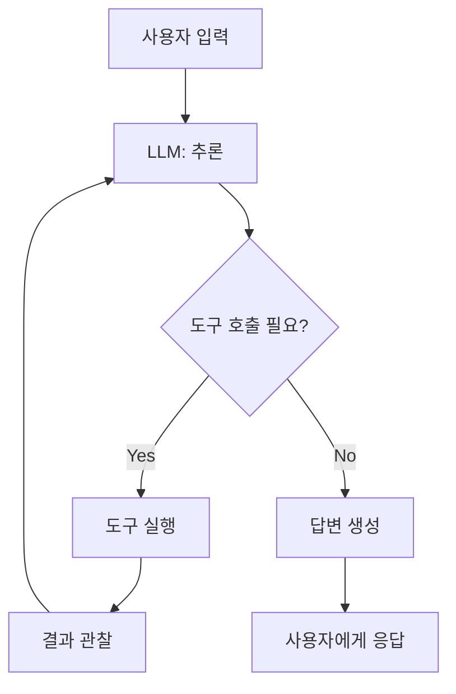
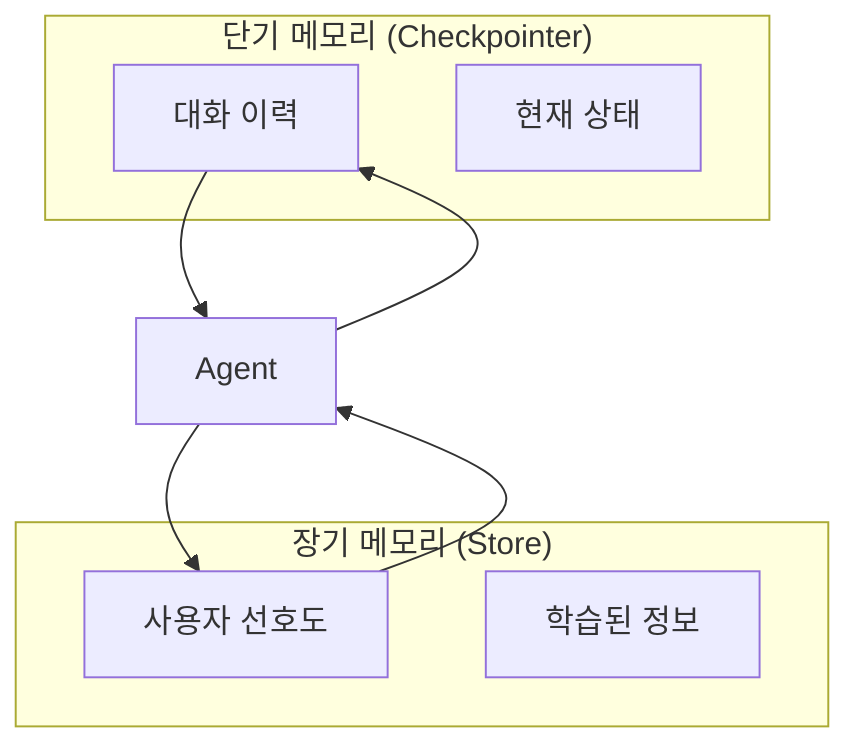
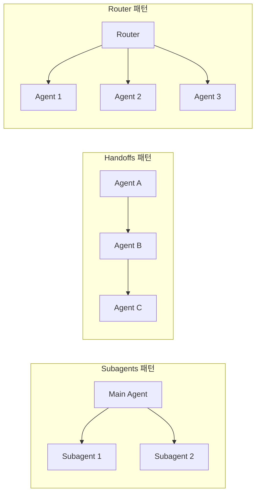
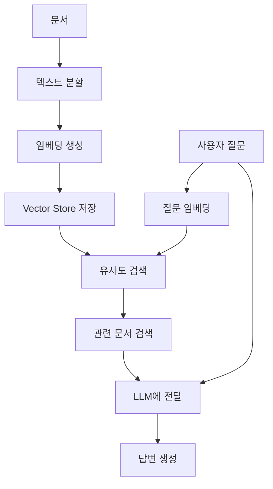
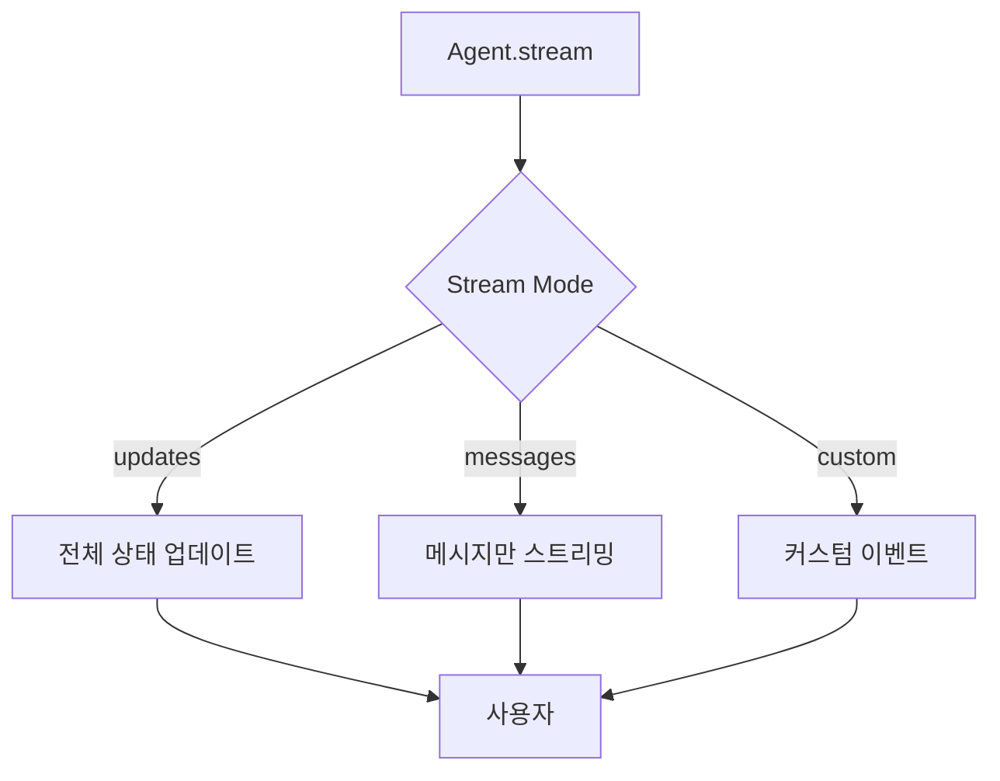
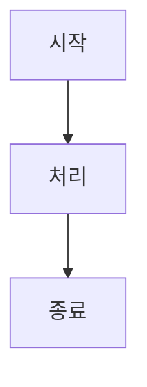
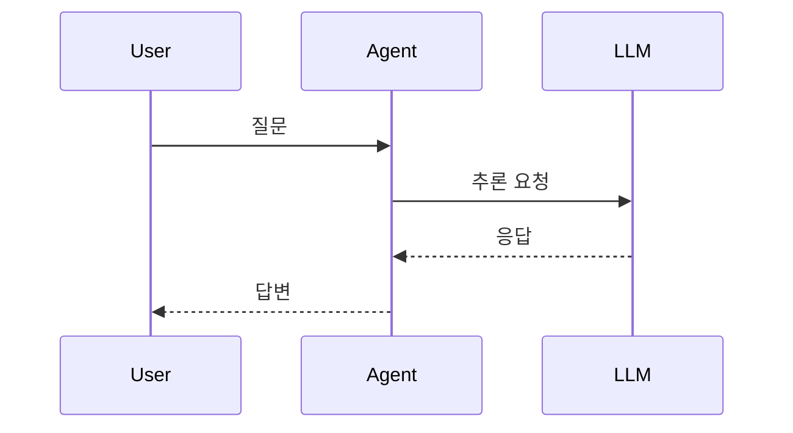
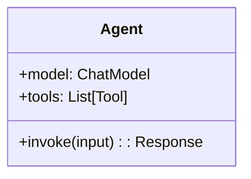
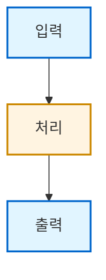

# 교안 리소스 (Assets)

> 🎨 LangChain AI Agent 교안에서 사용되는 이미지 및 다이어그램 모음

이 디렉토리는 교안 문서에서 참조하는 시각 자료를 포함합니다.

---

## 📋 목차

1. [디렉토리 구조](#-디렉토리-구조)
2. [Diagrams (다이어그램)](#-diagrams-다이어그램)
3. [Images (이미지)](#-images-이미지)
4. [사용 방법](#-사용-방법)
5. [라이선스](#-라이선스)

---

## 📁 디렉토리 구조

```
assets/
├── README.md (이 파일)
├── diagrams/              # Mermaid 다이어그램 소스 파일
│   ├── agent_flow.mmd
│   ├── memory_architecture.mmd
│   ├── multi_agent_patterns.mmd
│   ├── rag_pipeline.mmd
│   └── streaming_modes.mmd
│
└── images/                # 이미지 파일 (PNG, SVG, AVIF)
    ├── README.md         # 이미지 출처 및 라이선스
    ├── agent_loop.png
    ├── rag_pipeline.png
    ├── langsmith_studio.png
    └── ...
```

---

## 📊 Diagrams (다이어그램)

### 개요

`diagrams/` 디렉토리에는 Mermaid 형식의 다이어그램 소스 파일이 포함되어 있습니다.

**Mermaid란?**
- 텍스트 기반 다이어그램 도구
- Markdown에 직접 삽입 가능
- GitHub, GitLab 등에서 자동 렌더링

**참고**: https://mermaid.js.org/

---

### 다이어그램 목록

#### 1. `agent_flow.mmd` - Agent 실행 흐름

**용도**: Part 1.2 (Agent의 동작 원리)

**내용**: Agent가 사용자 입력을 받아 도구를 호출하고 답변을 생성하는 전체 흐름

**Mermaid 코드**:


**사용 예시**:
```markdown
## Agent 실행 흐름


```

---

#### 2. `memory_architecture.mmd` - 메모리 아키텍처

**용도**: Part 4.1 (메모리 시스템 개요)

**내용**: Checkpointer와 Store의 관계, 단기/장기 메모리 구조

**Mermaid 코드**:


---

#### 3. `multi_agent_patterns.mmd` - 멀티에이전트 패턴

**용도**: Part 7.1 (멀티에이전트 개요)

**내용**: Subagents, Handoffs, Router 등 주요 패턴 비교

**Mermaid 코드**:


---

#### 4. `rag_pipeline.mmd` - RAG 파이프라인

**용도**: Part 8.1 (RAG 기초)

**내용**: RAG의 전체 프로세스 (임베딩 → 검색 → 생성)

**Mermaid 코드**:


---

#### 5. `streaming_modes.mmd` - 스트리밍 모드

**용도**: Part 9.2 (Stream Modes)

**내용**: updates, messages, custom 모드의 차이

**Mermaid 코드**:


---

### 다이어그램 사용 방법

#### Markdown에 직접 삽입

```markdown
## Agent 동작 원리

\`\`\`mermaid
flowchart TD
    A[사용자 입력] --> B[LLM: 추론]
    B --> C{도구 호출 필요?}
    C -->|Yes| D[도구 실행]
    C -->|No| F[답변 생성]
\`\`\`
```

#### 이미지로 변환 (선택 사항)

Mermaid CLI를 사용하여 PNG/SVG로 변환:

```bash
# Mermaid CLI 설치
npm install -g @mermaid-js/mermaid-cli

# PNG로 변환
mmdc -i diagrams/agent_flow.mmd -o images/agent_flow.png

# SVG로 변환
mmdc -i diagrams/agent_flow.mmd -o images/agent_flow.svg
```

---

## 🖼️ Images (이미지)

### 개요

`images/` 디렉토리에는 교안에서 사용되는 이미지 파일이 포함되어 있습니다.

**형식**:
- PNG: 스크린샷, 다이어그램
- SVG: 벡터 그래픽
- AVIF: 고압축 이미지 (공식 문서에서 가져온 것)

---

### 이미지 목록

| 파일명 | 형식 | 크기 | 설명 | 사용 파트 | 출처 |
|--------|------|------|------|----------|------|
| `agent_loop.png` | PNG | ~50KB | Agent 실행 루프 다이어그램 | Part 1 | 자체 제작 |
| `rag_pipeline.png` | PNG | ~80KB | RAG 파이프라인 다이어그램 | Part 8 | 자체 제작 |
| `langsmith_studio.png` | PNG | ~200KB | LangSmith Studio 스크린샷 | Part 10.1 | official/images/ |
| `deepagents-langsmith.avif` | AVIF | ~100KB | LangSmith 통합 아키텍처 | Part 10.1 | official/images/ |
| `summary.avif` | AVIF | ~80KB | Summarization 미들웨어 개념 | Part 5.2 | official/images/ |

---

### 이미지 사용 방법

#### Markdown에서 참조

**절대 경로 (권장)**:
```markdown

```

**상대 경로**:
```markdown

```

**캡션 포함**:
```markdown
<figure>
  
  <figcaption>그림 1: Agent 실행 루프</figcaption>
</figure>
```

---

### 이미지 추가 방법

#### 1. 스크린샷 추가

```bash
# 이미지를 images/ 디렉토리에 복사
cp ~/Downloads/screenshot.png assets/images/my_screenshot.png
```

#### 2. Mermaid 다이어그램을 이미지로 변환

```bash
# Mermaid 파일을 PNG로 변환
mmdc -i diagrams/my_diagram.mmd -o images/my_diagram.png -w 800 -H 600
```

#### 3. 이미지 최적화 (선택 사항)

```bash
# ImageMagick으로 크기 조정
convert images/large_image.png -resize 800x600 images/optimized_image.png

# PNG 압축
pngquant images/*.png --ext .png --force
```

---

## 🔧 사용 방법

### 교안 문서에서 사용

#### 예시 1: Part 1에서 Agent Flow 사용

**파일**: `docs/part01_introduction.md`

```markdown
## 1.2 Agent의 동작 원리

Agent는 다음과 같은 루프로 작동합니다:

\`\`\`mermaid
flowchart TD
    A[사용자 입력] --> B[LLM: 추론]
    B --> C{도구 호출 필요?}
    C -->|Yes| D[도구 실행]
    C -->|No| F[답변 생성]
    D --> E[결과 관찰]
    E --> B
    F --> G[사용자에게 응답]
\`\`\`

**그림 1**: Agent 실행 흐름 (출처: [agent_flow.mmd](../../assets/diagrams/agent_flow.mmd))
```

#### 예시 2: Part 8에서 RAG Pipeline 이미지 사용

**파일**: `docs/part08_rag_mcp.md`

```markdown
## 8.1 RAG 파이프라인


**그림 8-1**: RAG 시스템의 전체 흐름
```

---

### 프레젠테이션에서 사용

다이어그램과 이미지는 슬라이드 프레젠테이션에도 활용할 수 있습니다:

1. PNG/SVG 이미지를 PowerPoint, Keynote 등에 삽입
2. Mermaid Live Editor (https://mermaid.live/)에서 편집 후 export

---

## 📝 새로운 다이어그램 작성 가이드

### Mermaid 기본 문법

#### Flowchart (흐름도)


#### Sequence Diagram (시퀀스 다이어그램)


#### Class Diagram (클래스 다이어그램)


### 스타일 가이드

#### 색상 팔레트
- **주요 노드**: `fill:#e1f5ff` (연한 파란색)
- **중요 노드**: `fill:#fff4e1` (연한 노랑)
- **경고/에러**: `fill:#ffe1e1` (연한 빨강)

#### 예시


---

## 📄 라이선스

### 자체 제작 자료

| 자료 | 라이선스 | 상업적 사용 |
|------|---------|-----------|
| 모든 .mmd 파일 | MIT | 허용 |
| 자체 제작 이미지 | MIT | 허용 |

**사용 조건**:
- 출처 표기 권장
- 수정 및 재배포 가능

---

### 공식 이미지 (official/images/에서 가져온 것)

| 이미지 | 출처 | 라이선스 | 용도 |
|--------|------|---------|------|
| `langsmith_studio.png` | LangChain 공식 | Fair Use | 교육용 |
| `deepagents-langsmith.avif` | LangChain 공식 | Fair Use | 교육용 |
| `summary.avif` | LangChain 공식 | Fair Use | 교육용 |

**주의**:
- 교육 목적으로만 사용
- 상업적 재배포 금지
- 공식 문서 링크 병기 권장

---

## 🔗 참고 자료

### Mermaid 문서
- **공식 문서**: https://mermaid.js.org/
- **Live Editor**: https://mermaid.live/
- **치트시트**: https://jojozhuang.github.io/tutorial/mermaid-cheat-sheet/

### 이미지 최적화 도구
- **ImageMagick**: https://imagemagick.org/
- **pngquant**: https://pngquant.org/
- **SVGO**: https://github.com/svg/svgo

---

## 📊 통계

### 현재 자료 현황

| 카테고리 | 개수 | 총 용량 |
|---------|------|---------|
| Mermaid 다이어그램 | 5개 | ~10KB |
| PNG 이미지 | 2개 | ~130KB |
| AVIF 이미지 | 2개 | ~180KB |
| **합계** | **9개** | **~320KB** |

---

## ❓ FAQ

<details>
<summary>Q1: Mermaid 다이어그램이 렌더링되지 않아요</summary>

**A**: GitHub, GitLab, VS Code Preview는 Mermaid를 자동 렌더링합니다. 다른 환경에서는:
1. [Mermaid Live Editor](https://mermaid.live/)에서 열기
2. PNG로 변환 후 사용
3. Mermaid 플러그인 설치
</details>

<details>
<summary>Q2: 이미지 크기를 조정하려면?</summary>

**A**: Markdown에서 HTML 사용:
```markdown

```
</details>

<details>
<summary>Q3: 새로운 다이어그램을 추가하려면?</summary>

**A**:
1. `diagrams/` 에 `.mmd` 파일 생성
2. Mermaid 문법으로 작성
3. (선택) PNG로 변환하여 `images/`에 저장
4. 교안 문서에서 참조
</details>

---

*마지막 업데이트: 2025-02-05*
*버전: 1.0*
