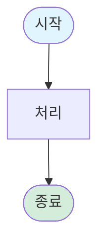

# LangChain 교안 이미지 리소스

## 📁 디렉토리 구조

```
assets/
├── diagrams/          # Mermaid 다이어그램 소스 (.mmd)
│   ├── agent_flow.mmd
│   ├── memory_architecture.mmd
│   ├── multi_agent_patterns.mmd
│   └── rag_pipeline.mmd
└── images/            # 이미지 파일
    └── README.md (this file)
```

## 🖼️ 이미지 사용 가이드

### Mermaid 다이어그램 렌더링

Mermaid 다이어그램은 다음 방법으로 렌더링할 수 있습니다:

#### 1. GitHub에서 자동 렌더링
GitHub Markdown은 Mermaid를 자동으로 렌더링합니다.

#### 2. VSCode에서 미리보기
**Mermaid Preview 확장** 설치:
```
code --install-extension bierner.markdown-mermaid
```

#### 3. 온라인 에디터
[Mermaid Live Editor](https://mermaid.live/)에서 .mmd 파일 내용을 복사하여 편집 및 내보내기

#### 4. CLI로 PNG/SVG 생성
```bash
npm install -g @mermaid-js/mermaid-cli

# PNG 생성
mmdc -i agent_flow.mmd -o agent_flow.png

# SVG 생성
mmdc -i agent_flow.mmd -o agent_flow.svg
```

## 📊 다이어그램 목록

### 1. agent_flow.mmd
**내용**: Agent의 기본 실행 흐름 (ReAct 루프)

**사용 위치**:
- [docs/part01_introduction.md](../../docs/part01_introduction.md)
- [docs/part03_first_agent.md](../../docs/part03_first_agent.md)

**주요 개념**:
- 사용자 입력 → Agent 추론 → 도구 호출 → 결과 반환 → 반복

---

### 2. memory_architecture.mmd
**내용**: LangChain 메모리 시스템 아키텍처

**사용 위치**:
- [docs/part04_memory.md](../../docs/part04_memory.md)

**주요 개념**:
- Checkpointer (단기 메모리): 대화 히스토리
- Store (장기 메모리): 사용자 데이터

---

### 3. multi_agent_patterns.mmd
**내용**: 멀티에이전트 협업 패턴 비교

**사용 위치**:
- [docs/part07_multi_agent.md](../../docs/part07_multi_agent.md)

**주요 패턴**:
- Subagents: 도구처럼 호출
- Handoffs: 제어 전달
- Router: 조건부 라우팅

---

### 4. rag_pipeline.mmd
**내용**: RAG 파이프라인 (Indexing + Retrieval + Generation)

**사용 위치**:
- [docs/part08_rag_mcp.md](../../docs/part08_rag_mcp.md)
- [projects/02_document_qa/README.md](../../projects/02_document_qa/README.md)

**주요 단계**:
1. 문서 로딩 → 청킹 → 임베딩 → Vector Store
2. 질문 → 검색 → 컨텍스트 → LLM → 답변

---

## 🎨 이미지 스타일 가이드

### 색상 팔레트
- **파란색** (#e1f5ff): 입력/시작
- **초록색** (#d4edda): 성공/완료
- **노란색** (#fff3cd): 처리/추론
- **빨간색** (#f8d7da): 중요/주의

### 폰트
- 한글: 나눔고딕, 맑은 고딕
- 영문: Arial, Helvetica

## 📄 라이선스

모든 다이어그램은 MIT 라이선스로 제공됩니다.

- **제작**: LangChain AI Agent 마스터 교안
- **형식**: Mermaid (.mmd)
- **사용**: 교육 목적 자유 사용 가능

## 🔗 참고 리소스

- [Mermaid 공식 문서](https://mermaid.js.org/)
- [Mermaid Cheat Sheet](https://jojozhuang.github.io/tutorial/mermaid-cheat-sheet/)
- [GitHub Mermaid Support](https://github.blog/2022-02-14-include-diagrams-markdown-files-mermaid/)

## ✨ 커스텀 다이어그램 추가

새로운 다이어그램을 추가하려면:

1. `/assets/diagrams/`에 `.mmd` 파일 생성
2. Mermaid 문법으로 다이어그램 작성
3. 이 README에 설명 추가
4. 교안 문서에서 링크

**템플릿**:


---

*마지막 업데이트: 2026-02-06*
