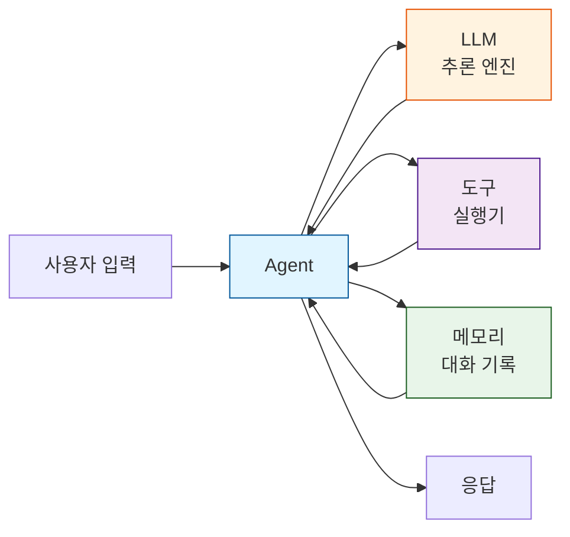
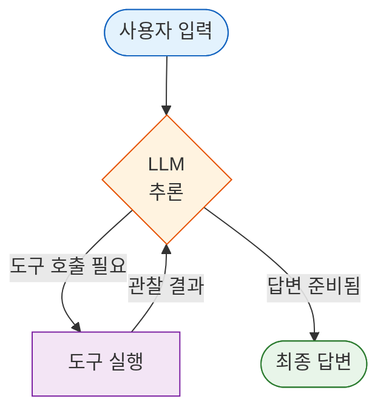
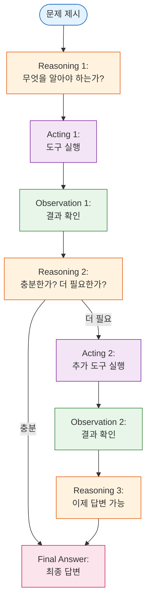

# Part 3: 첫 번째 Agent 만들기

> 📚 **학습 시간**: 약 3-4시간
> 🎯 **난이도**: ⭐⭐☆☆☆ (초급)
> 📖 **공식 문서**: [06-agents.md](../official/06-agents_ko.md), [03-quickstart.md](../official/03-quickstart_ko.md)
> 💻 **예제 코드**: [part03_first_agent 디렉토리](../src/part03_first_agent/)

---

## 📋 학습 목표

이 파트를 완료하면 다음을 할 수 있습니다:

- [ ] `create_agent()` API를 사용하여 기본 Agent를 만들 수 있다
- [ ] Agent의 동작 원리와 실행 루프를 이해한다
- [ ] 실전 날씨 Agent를 구현하고 실행할 수 있다
- [ ] ReAct 패턴(Reasoning + Acting)의 개념과 동작 방식을 이해한다
- [ ] System Prompt를 커스터마이징하여 Agent의 성격과 행동을 제어할 수 있다
- [ ] Streaming 모드로 Agent의 실시간 응답을 구현할 수 있다

---

## 📚 개요

이 파트에서는 **드디어 첫 번째 진짜 Agent**를 만들어봅니다! Part 1에서 LangChain의 개념을 배웠고, Part 2에서 Chat Models, Messages, Tools를 학습했습니다. 이제 이 모든 것을 결합하여 실제로 동작하는 Agent를 만들 차례입니다.

### 왜 중요한가?

- **실전 Agent 개발의 시작**: 단순한 Tool Calling을 넘어 자율적으로 의사결정하는 Agent를 만듭니다
- **ReAct 패턴 이해**: 현대 AI Agent의 핵심 패턴인 ReAct(Reasoning + Acting)를 실습으로 익힙니다
- **프로덕션 준비**: `create_agent()`는 LangChain의 프로덕션 레벨 Agent 구현입니다
- **확장 가능한 기반**: 이후 복잡한 Multi-Agent 시스템으로 확장할 수 있는 기초를 다집니다

### 실무 활용 사례

- **날씨 비서 Agent**: 사용자의 위치를 파악하고 날씨 정보를 제공하는 대화형 비서
- **고객 지원 Agent**: 고객 질문을 이해하고 FAQ를 검색하며 티켓을 생성하는 Agent
- **데이터 분석 Agent**: 사용자 요청에 따라 데이터베이스를 쿼리하고 결과를 시각화하는 Agent
- **리서치 Agent**: 여러 웹 소스를 검색하고 정보를 종합하여 리포트를 작성하는 Agent

### bind_tools() vs create_agent(): 무엇이 다른가?

Part 2에서 배운 `bind_tools()`와 `create_agent()`의 차이점을 명확히 이해하는 것이 중요합니다:

| 특징 | bind_tools() | create_agent() |
|------|-------------|----------------|
| **역할** | 모델에 도구 스키마만 제공 | 완전한 Agent 런타임 제공 |
| **실행 루프** | 수동으로 구현 필요 | 자동으로 처리 |
| **Tool 호출** | 한 번만 시도 | 목표 달성까지 반복 |
| **상태 관리** | 직접 관리 | 자동 관리 |
| **스트리밍** | 수동 구현 | 내장 지원 |
| **Human-in-the-loop** | 수동 구현 | 내장 지원 |
| **프로덕션 준비도** | 낮음 | 높음 |

```python
# bind_tools(): 한 번의 tool call
model_with_tools = model.bind_tools([get_weather])
response = model_with_tools.invoke("서울 날씨는?")
# → Tool call만 반환, 직접 실행하고 다시 모델에 전달해야 함

# create_agent(): 자동으로 반복 실행
agent = create_agent(model, tools=[get_weather])
response = agent.invoke({"messages": [{"role": "user", "content": "서울 날씨는?"}]})
# → 완전한 답변 반환, Tool 실행부터 최종 답변까지 자동 처리
```

**언제 무엇을 사용할까?**
- **bind_tools()**: Tool calling을 직접 제어하고 싶을 때, 커스텀 로직이 필요할 때
- **create_agent()**: 프로덕션 Agent를 빠르게 만들고 싶을 때 (대부분의 경우)

---

## 1. create_agent() 기본

### 1.1 Agent란? (간단한 복습)

**Agent**는 목표를 달성하기 위해 자율적으로 도구를 선택하고 실행하는 시스템입니다. Part 1에서 배운 내용을 다시 상기해보겠습니다.



**Agent의 핵심 특징**:
1. **자율성**: 어떤 도구를 사용할지 스스로 결정
2. **반복성**: 목표 달성까지 도구를 반복 실행
3. **추론**: 각 단계에서 무엇을 해야 할지 생각
4. **적응성**: 도구 실행 결과에 따라 전략 조정

> 📖 **공식 문서**: [06-agents.md](../official/06-agents_ko.md#agent) - Agent 개념 설명

### 1.2 create_agent() API

`create_agent()`는 LangChain에서 제공하는 프로덕션 레벨 Agent 구현입니다. 내부적으로 [LangGraph](https://docs.langchain.com/oss/python/langgraph/overview)를 사용하여 그래프 기반 Agent를 생성합니다.

#### 기본 시그니처

```python
from langchain.agents import create_agent

agent = create_agent(
    model,                    # 추론에 사용할 LLM (필수)
    tools=[],                # Agent가 사용할 도구 리스트 (필수)
    system_prompt=None,      # Agent의 역할과 지침 (선택)
    checkpointer=None,       # 상태 저장을 위한 체크포인터 (선택)
    state_schema=None,       # 커스텀 상태 스키마 (선택)
    response_format=None,    # 구조화된 응답 형식 (선택)
    middleware=[],           # 커스텀 미들웨어 (선택)
    context_schema=None,     # 런타임 컨텍스트 스키마 (선택)
)
```

#### 주요 파라미터 설명

1. **model** (필수)
   - LLM 인스턴스 또는 모델 식별자 문자열
   - 예: `"openai:gpt-4o-mini"`, `ChatOpenAI(model="gpt-4o")`

2. **tools** (필수)
   - Agent가 사용할 도구 리스트
   - 빈 리스트도 가능 (도구 없는 Agent)

3. **system_prompt** (선택)
   - Agent의 역할, 성격, 행동 지침
   - 문자열 또는 SystemMessage 객체

4. **checkpointer** (선택)
   - 대화 상태를 저장하기 위한 체크포인터
   - 멀티턴 대화에 필요

> 💻 **예제 코드**: [01_basic_agent.py](../src/part03_first_agent/01_basic_agent.py) 라인 77-112

### 1.3 Agent 실행 루프

Agent는 **목표 달성까지 반복 실행**하는 루프를 가지고 있습니다. 이 루프는 LangGraph가 자동으로 관리합니다.



> 📖 **공식 문서**: [06-agents.md](../official/06-agents_ko.md) 라인 9-26 - Agent 실행 흐름도

**실행 루프의 단계**:

1. **입력**: 사용자 메시지를 Agent에 전달
2. **추론**: LLM이 현재 상황을 분석하고 다음 액션 결정
3. **도구 호출**: 필요하면 도구를 호출 (병렬 실행 가능)
4. **관찰**: 도구 실행 결과를 LLM에 전달
5. **반복 또는 종료**:
   - 더 많은 정보가 필요하면 2번으로 돌아감
   - 충분한 정보가 모였으면 최종 답변 생성

**종료 조건**:
- LLM이 도구 호출 없이 최종 답변을 생성했을 때
- 최대 반복 횟수(iteration limit)에 도달했을 때 (기본: 25회)
- 사용자가 명시적으로 중단했을 때

### 1.4 첫 번째 Agent 만들기

가장 간단한 Agent를 만들어보겠습니다.

```python
from langchain.agents import create_agent
from langchain.tools import tool
from langchain_openai import ChatOpenAI

# 1. 도구 정의
@tool
def get_weather(city: str) -> str:
    """주어진 도시의 현재 날씨를 알려줍니다.

    Args:
        city: 도시 이름 (예: 서울, 부산, 뉴욕)
    """
    # 더미 데이터 (실제로는 API 호출)
    weather_data = {
        "서울": "맑음, 22°C",
        "부산": "흐림, 20°C",
        "뉴욕": "비, 15°C",
    }
    return weather_data.get(city, f"{city}의 날씨 정보를 찾을 수 없습니다")

# 2. LLM 초기화
model = ChatOpenAI(model="gpt-4o-mini", temperature=0)

# 3. Agent 생성
agent = create_agent(
    model=model,
    tools=[get_weather],
)

# 4. Agent 실행
result = agent.invoke({
    "messages": [{"role": "user", "content": "서울 날씨는?"}]
})

# 5. 결과 확인
print(result["messages"][-1].content)
# 출력: "서울의 현재 날씨는 맑고, 기온은 22도입니다."
```

**💡 코드 설명**:
1. `@tool` 데코레이터로 도구를 정의합니다 (Part 2에서 배운 내용)
2. LLM을 초기화합니다 (temperature=0으로 일관된 응답 보장)
3. `create_agent()`로 Agent를 생성합니다
4. `invoke()`로 Agent를 실행합니다 (메시지는 딕셔너리 형태)
5. 결과의 마지막 메시지가 Agent의 최종 답변입니다

**실행 과정 분석**:
```
[입력] 사용자: "서울 날씨는?"
   ↓
[추론] LLM: "날씨 정보가 필요하니 get_weather 도구를 사용해야겠다"
   ↓
[도구 호출] get_weather(city="서울")
   ↓
[관찰] 도구 결과: "맑음, 22°C"
   ↓
[추론] LLM: "이제 답변을 작성할 수 있다"
   ↓
[출력] Agent: "서울의 현재 날씨는 맑고, 기온은 22도입니다."
```

> 💻 **예제 코드**: [01_basic_agent.py](../src/part03_first_agent/01_basic_agent.py) 라인 77-112
>
> **💡 실습 포인트**:
> 1. 코드를 직접 실행하고 여러 도시로 테스트해보세요
> 2. `result["messages"]`를 출력하여 모든 중간 메시지를 확인해보세요
> 3. 도구 함수의 docstring을 수정하면 Agent의 행동이 어떻게 달라지는지 관찰하세요

---

## 2. 날씨 Agent 구현

이제 실전 수준의 날씨 Agent를 만들어보겠습니다. 이 Agent는 사용자의 위치를 파악하고, 날씨 정보를 제공하며, 재치있는 말투로 대화합니다.

### 2.1 요구사항 정의

**기능 요구사항**:
1. 사용자가 도시를 명시하지 않으면 위치를 확인해야 함
2. 날씨 정보를 명확하고 친절하게 제공
3. 재치있고 유머러스한 말투 사용 (날씨 관련 말장난)
4. 여러 도시의 날씨를 비교할 수 있어야 함

**기술 요구사항**:
1. 두 개의 도구: `get_weather_for_location`, `get_user_location`
2. 사용자별 컨텍스트 관리 (user_id로 위치 파악)
3. 명확한 System Prompt로 Agent 성격 정의
4. 구조화된 응답 형식 (ResponseFormat)

> 📖 **공식 문서**: [03-quickstart.md](../official/03-quickstart_ko.md) 라인 46-194 - 실전 날씨 Agent 예제

### 2.2 도구 작성

먼저 두 개의 도구를 작성합니다.

```python
from dataclasses import dataclass
from langchain.tools import tool, ToolRuntime

@tool
def get_weather_for_location(city: str) -> str:
    """주어진 도시의 날씨를 조회합니다.

    Args:
        city: 날씨를 조회할 도시 이름
    """
    # 실제로는 날씨 API 호출
    weather_data = {
        "서울": "맑음, 22°C, 습도 60%",
        "부산": "흐림, 20°C, 습도 70%",
        "뉴욕": "비, 15°C, 습도 85%",
        "파리": "맑음, 18°C, 습도 55%",
    }
    return weather_data.get(city, f"{city}의 날씨 정보를 찾을 수 없습니다")

# 컨텍스트 스키마 정의
@dataclass
class Context:
    """런타임 컨텍스트 스키마"""
    user_id: str

@tool
def get_user_location(runtime: ToolRuntime[Context]) -> str:
    """현재 사용자의 위치를 조회합니다.

    ToolRuntime을 통해 런타임 컨텍스트에 접근합니다.
    """
    user_id = runtime.context.user_id

    # 실제로는 DB나 IP 기반 위치 조회
    location_map = {
        "1": "서울",
        "2": "부산",
        "3": "뉴욕",
    }

    return location_map.get(user_id, "서울")  # 기본값: 서울

tools = [get_weather_for_location, get_user_location]
```

**💡 핵심 포인트**:
1. **get_weather_for_location**: 명시된 도시의 날씨 조회
2. **get_user_location**: 런타임 컨텍스트를 사용하여 사용자 위치 파악
3. **ToolRuntime[Context]**: 타입 힌트로 컨텍스트 구조 명시
4. **명확한 docstring**: LLM이 도구를 올바르게 사용하도록 안내

> 📖 **공식 문서**: [03-quickstart.md](../official/03-quickstart_ko.md) 라인 77-98 - 컨텍스트를 사용하는 도구

### 2.3 Agent 생성

이제 System Prompt와 함께 Agent를 생성합니다.

```python
from langchain.agents import create_agent
from langchain.chat_models import init_chat_model

# 1. System Prompt 정의
SYSTEM_PROMPT = """당신은 전문 날씨 예보관이며, 말장난을 좋아합니다.

사용 가능한 도구:
- get_weather_for_location: 특정 도시의 날씨 조회
- get_user_location: 사용자의 현재 위치 조회

사용자가 날씨를 물어보면 위치를 확인하세요.
사용자가 "여기", "현재" 같은 표현을 쓰면 get_user_location 도구를 사용하세요.

답변은 친근하고 재치있게, 날씨 관련 말장난을 섞어서 작성하세요."""

# 2. 모델 설정
model = init_chat_model(
    "claude-sonnet-4-5-20250929",
    temperature=0.5,  # 창의적인 말장난을 위해 약간의 randomness
    timeout=10,
    max_tokens=1000
)

# 3. Agent 생성
agent = create_agent(
    model=model,
    system_prompt=SYSTEM_PROMPT,
    tools=[get_weather_for_location, get_user_location],
    context_schema=Context,  # 컨텍스트 스키마 명시
)
```

**💡 System Prompt 작성 팁**:
1. **역할 명시**: "당신은 전문 날씨 예보관"
2. **성격 정의**: "말장난을 좋아합니다"
3. **도구 설명**: 각 도구의 용도 명확히 설명
4. **조건부 로직**: "~하면 ~하세요" 형태의 지침
5. **응답 스타일**: "친근하고 재치있게" 같은 톤 지정

> 📖 **공식 문서**: [03-quickstart.md](../official/03-quickstart_ko.md) 라인 57-69 - System Prompt 정의
> 📖 **공식 문서**: [06-agents.md](../official/06-agents_ko.md) 라인 242-283 - System Prompt 고급 기법

### 2.4 Agent 실행

구조화된 응답 형식과 함께 Agent를 실행합니다.

```python
from dataclasses import dataclass
from langchain.agents.structured_output import ToolStrategy

# 응답 형식 정의
@dataclass
class ResponseFormat:
    """날씨 Agent 응답 스키마"""
    punny_response: str  # 말장난이 섞인 답변 (필수)
    weather_conditions: str | None = None  # 날씨 상세 정보 (선택)

# Agent 생성 (응답 형식 추가)
agent = create_agent(
    model=model,
    system_prompt=SYSTEM_PROMPT,
    tools=[get_weather_for_location, get_user_location],
    context_schema=Context,
    response_format=ToolStrategy(ResponseFormat),  # 구조화된 응답
)

# 실행
config = {"configurable": {"thread_id": "1"}}  # 대화 스레드 ID

response = agent.invoke(
    {"messages": [{"role": "user", "content": "밖에 날씨 어때?"}]},
    config=config,
    context=Context(user_id="1")  # 사용자 ID 전달
)

# 구조화된 응답 출력
print(response['structured_response'])
# ResponseFormat(
#     punny_response="서울은 정말 '화창'한 날씨네요! 태양이 '빛-나'게 웃고 있답니다!",
#     weather_conditions="맑음, 22°C, 습도 60%"
# )
```

**실행 과정 분석**:
```
1. [입력] 사용자: "밖에 날씨 어때?"
2. [추론] Agent: "'밖'은 사용자의 현재 위치를 의미하는군. get_user_location을 호출해야겠다"
3. [도구 호출] get_user_location() → "서울"
4. [추론] Agent: "서울의 날씨 정보가 필요해. get_weather_for_location을 호출하자"
5. [도구 호출] get_weather_for_location(city="서울") → "맑음, 22°C, 습도 60%"
6. [추론] Agent: "이제 말장난을 섞어서 답변을 작성할 수 있다"
7. [출력] Agent: ResponseFormat(punny_response="...", weather_conditions="...")
```

> 💻 **예제 코드**: [02_weather_agent.py](../src/part03_first_agent/02_weather_agent.py)
> 📖 **공식 문서**: [03-quickstart.md](../official/03-quickstart_ko.md) 라인 149-192 - 전체 예제

### 2.5 결과 분석

날씨 Agent의 동작을 자세히 분석해보겠습니다.

```python
# 모든 메시지 출력 (디버깅)
for i, msg in enumerate(response["messages"]):
    print(f"\n--- Message {i+1}: {msg.__class__.__name__} ---")

    if hasattr(msg, "content") and msg.content:
        print(f"Content: {msg.content[:100]}...")

    if hasattr(msg, "tool_calls") and msg.tool_calls:
        print(f"Tool Calls: {msg.tool_calls}")
```

**출력 예시**:
```
--- Message 1: HumanMessage ---
Content: 밖에 날씨 어때?

--- Message 2: AIMessage ---
Tool Calls: [{'name': 'get_user_location', 'args': {}, 'id': 'call_abc123'}]

--- Message 3: ToolMessage ---
Content: 서울

--- Message 4: AIMessage ---
Tool Calls: [{'name': 'get_weather_for_location', 'args': {'city': '서울'}, 'id': 'call_def456'}]

--- Message 5: ToolMessage ---
Content: 맑음, 22°C, 습도 60%

--- Message 6: AIMessage ---
Content: 서울은 정말 '화창'한 날씨네요! 태양이 '빛-나'게 웃고 있답니다!
```

**분석**:
1. **Message 1-2**: 사용자 입력 → Agent가 위치 파악 필요성 인지
2. **Message 3**: 도구 실행 결과: "서울"
3. **Message 4**: 서울의 날씨 조회 결정
4. **Message 5**: 도구 실행 결과: 날씨 정보
5. **Message 6**: 최종 답변 생성 (말장난 포함)

**주요 특징**:
- **지능적인 의사결정**: "밖에"라는 모호한 표현을 이해하고 위치 도구 사용
- **순차적 도구 사용**: 위치 파악 → 날씨 조회 순서로 논리적 진행
- **컨텍스트 활용**: user_id를 사용하여 개인화된 위치 정보 제공
- **구조화된 출력**: ResponseFormat을 통해 일관된 형식의 응답

---

## 3. ReAct 패턴

### 3.1 ReAct란?

**ReAct**(Reasoning + Acting)는 AI Agent가 문제를 해결하는 핵심 패턴입니다. LLM이 추론(Reasoning)과 행동(Acting)을 번갈아가며 반복하여 목표를 달성합니다.



> 📖 **공식 문서**: [06-agents.md](../official/06-agents_ko.md) 라인 178-237 - ReAct 패턴 설명

**ReAct의 장점**:
1. **해석 가능성**: 각 단계의 추론 과정을 확인 가능
2. **유연성**: 예상치 못한 상황에 대응 가능
3. **효율성**: 필요한 만큼만 도구를 사용
4. **디버깅 용이**: 어느 단계에서 문제가 발생했는지 파악 가능

### 3.2 Reasoning (추론)

**Reasoning**은 Agent가 현재 상황을 분석하고 다음에 무엇을 해야 할지 결정하는 단계입니다.

**추론 과정**:
1. **상황 분석**: 현재까지의 대화와 관찰 결과 검토
2. **목표 확인**: 사용자가 원하는 것이 무엇인가?
3. **지식 평가**: 현재 알고 있는 정보만으로 답변 가능한가?
4. **전략 수립**: 더 알아야 한다면 어떤 도구를 사용할 것인가?

**예시**:
```
사용자: "서울과 부산 중 어디가 더 따뜻해?"

[Reasoning]
- 목표: 서울과 부산의 온도를 비교하여 답변
- 현재 지식: 없음 (실시간 날씨 정보 필요)
- 필요한 정보: 서울의 온도, 부산의 온도
- 전략: get_weather를 두 번 호출 (서울, 부산)
```

**좋은 추론의 특징**:
- **구체적**: "날씨 정보가 필요하다" (X) → "서울과 부산의 현재 기온이 필요하다" (O)
- **논리적**: 단계적으로 생각하여 올바른 도구 선택
- **효율적**: 불필요한 도구 호출 최소화

### 3.3 Acting (행동)

**Acting**은 추론 결과에 따라 실제로 도구를 실행하는 단계입니다.

**행동의 유형**:
1. **단일 도구 호출**: 한 번에 하나의 도구만 사용
2. **병렬 도구 호출**: 여러 도구를 동시에 실행 (독립적인 경우)
3. **순차 도구 호출**: 이전 도구의 결과가 다음 도구의 입력이 되는 경우

**예시 - 병렬 실행**:
```python
# Agent의 내부 동작
tool_calls = [
    {"name": "get_weather", "args": {"city": "서울"}},
    {"name": "get_weather", "args": {"city": "부산"}},
]
# → 두 호출은 독립적이므로 병렬 실행 가능
```

**예시 - 순차 실행**:
```python
# Agent의 내부 동작
# Step 1
tool_calls = [{"name": "get_user_location", "args": {}}]
# Result: "서울"

# Step 2 (Step 1 결과 사용)
tool_calls = [{"name": "get_weather", "args": {"city": "서울"}}]
# Result: "맑음, 22°C"
```

> 📖 **공식 문서**: [06-agents.md](../official/06-agents_ko.md) 라인 102-108 - 도구의 병렬 및 순차 실행

### 3.4 Observation (관찰)

**Observation**은 도구 실행 결과를 확인하고 이를 다음 추론에 활용하는 단계입니다.

**관찰 과정**:
1. **결과 수신**: 도구가 반환한 값 확인
2. **결과 해석**: 반환값이 의미하는 바 이해
3. **상태 업데이트**: 새로운 정보를 대화 컨텍스트에 추가
4. **다음 단계 결정**: 충분한가? 더 필요한가?

**예시**:
```
[Acting] get_weather(city="서울") 호출
[Observation] 결과: "맑음, 22°C, 습도 60%"

[Reasoning]
- 서울 날씨는 확인했음: 맑고 22도
- 부산 날씨도 필요함
- 아직 답변 불가, 추가 도구 호출 필요

[Acting] get_weather(city="부산") 호출
[Observation] 결과: "흐림, 20°C, 습도 70%"

[Reasoning]
- 서울: 22도, 부산: 20도
- 서울이 2도 더 따뜻함
- 이제 답변 가능

[Final Answer] "서울이 부산보다 2도 더 따뜻합니다. 서울은 맑고 22도, 부산은 흐리고 20도입니다."
```

**관찰의 중요성**:
- **적응성**: 예상과 다른 결과에도 대응 가능
- **정확성**: 실제 데이터를 기반으로 답변 생성
- **완전성**: 모든 필요한 정보가 수집됐는지 확인

### 3.5 ReAct 패턴 예제

실제 ReAct 패턴을 코드로 확인해보겠습니다.

```python
from langchain.agents import create_agent
from langchain.tools import tool
from langchain_openai import ChatOpenAI

# 도구 정의
@tool
def search_product(query: str) -> str:
    """제품을 검색합니다."""
    products = {
        "wireless headphones": "상위 5개 제품: WH-1000XM5, AirPods Max, ...",
        "laptop": "상위 5개 제품: MacBook Pro, Dell XPS, ...",
    }
    return products.get(query, f"'{query}'에 대한 검색 결과가 없습니다")

@tool
def check_inventory(product_id: str) -> str:
    """제품 재고를 확인합니다."""
    inventory = {
        "WH-1000XM5": "재고 10개",
        "AirPods Max": "품절",
        "MacBook Pro": "재고 5개",
    }
    return inventory.get(product_id, f"'{product_id}' 재고 정보가 없습니다")

# Agent 생성
model = ChatOpenAI(model="gpt-4o-mini", temperature=0)
agent = create_agent(model, tools=[search_product, check_inventory])

# ReAct 패턴 실행
print("=" * 70)
print("📌 ReAct 패턴 예제: 인기 무선 헤드폰 찾고 재고 확인")
print("=" * 70)

result = agent.invoke({
    "messages": [{
        "role": "user",
        "content": "지금 가장 인기있는 무선 헤드폰을 찾아서 재고가 있는지 확인해줘"
    }]
})

# ReAct 추론 과정 출력
print("\n🔍 ReAct 추론 과정:\n")
for i, msg in enumerate(result["messages"], 1):
    role = msg.__class__.__name__

    if role == "HumanMessage":
        print(f"📥 Step {i}: 사용자 입력")
        print(f"   '{msg.content}'\n")

    elif role == "AIMessage":
        if hasattr(msg, "tool_calls") and msg.tool_calls:
            print(f"🤔 Step {i}: Reasoning + Acting")
            print(f"   추론: 도구를 사용하여 정보 수집 필요")
            for tc in msg.tool_calls:
                print(f"   행동: {tc['name']}({tc['args']})")
            print()
        else:
            print(f"💡 Step {i}: Final Answer")
            print(f"   {msg.content}\n")

    elif role == "ToolMessage":
        print(f"👀 Step {i}: Observation")
        print(f"   관찰: {msg.content}\n")

print("=" * 70)
```

**예상 출력**:
```
======================================================================
📌 ReAct 패턴 예제: 인기 무선 헤드폰 찾고 재고 확인
======================================================================

🔍 ReAct 추론 과정:

📥 Step 1: 사용자 입력
   '지금 가장 인기있는 무선 헤드폰을 찾아서 재고가 있는지 확인해줘'

🤔 Step 2: Reasoning + Acting
   추론: 도구를 사용하여 정보 수집 필요
   행동: search_product({'query': 'wireless headphones'})

👀 Step 3: Observation
   관찰: 상위 5개 제품: WH-1000XM5, AirPods Max, ...

🤔 Step 4: Reasoning + Acting
   추론: 도구를 사용하여 정보 수집 필요
   행동: check_inventory({'product_id': 'WH-1000XM5'})

👀 Step 5: Observation
   관찰: 재고 10개

💡 Step 6: Final Answer
   현재 가장 인기있는 무선 헤드폰은 WH-1000XM5이며, 재고는 10개 있습니다.

======================================================================
```

> 💻 **예제 코드**: [03_react_pattern.py](../src/part03_first_agent/03_react_pattern.py)
> 📖 **공식 문서**: [06-agents.md](../official/06-agents_ko.md) 라인 178-237 - 실제 ReAct 예제

**ReAct 패턴의 실전 활용**:
1. **멀티스텝 검색**: 검색 → 필터링 → 상세 조회
2. **데이터 분석**: 데이터 조회 → 계산 → 시각화
3. **워크플로우 자동화**: 조건 확인 → 작업 실행 → 결과 검증
4. **대화형 문제 해결**: 정보 수집 → 분석 → 제안 → 피드백 → 개선

---

## 4. System Prompt 커스터마이징

### 4.1 System Prompt의 중요성

**System Prompt**는 Agent의 정체성, 행동 방식, 제약사항을 정의하는 핵심 요소입니다. 같은 도구를 사용하더라도 System Prompt에 따라 Agent의 성격과 응답 스타일이 완전히 달라집니다.

**System Prompt가 하는 일**:
1. **역할 정의**: "당신은 ~입니다"
2. **성격 부여**: "친근하게", "전문적으로", "재치있게"
3. **행동 지침**: "~할 때 ~하세요"
4. **제약 조건**: "~하지 마세요"
5. **출력 형식**: "답변은 ~한 형식으로"

**좋은 System Prompt의 효과**:
- 일관된 Agent 성격
- 예측 가능한 행동
- 사용자 경험 향상
- 브랜드 아이덴티티 반영

> 📖 **공식 문서**: [06-agents.md](../official/06-agents_ko.md) 라인 242-283 - System Prompt 상세 가이드

### 4.2 좋은 System Prompt 작성 팁

#### Tip 1: 명확하고 구체적으로

**나쁜 예**:
```python
system_prompt = "당신은 도움이 되는 비서입니다."
```
→ 너무 일반적이고, Agent가 무엇을 해야 할지 모호함

**좋은 예**:
```python
system_prompt = """당신은 IT 헬프데스크 비서입니다.

역할:
- 사용자의 기술 문제를 진단하고 해결책을 제시합니다
- 단계별 가이드를 제공합니다
- 전문 용어는 쉽게 풀어서 설명합니다

제약:
- 확실하지 않은 정보는 제공하지 않습니다
- 하드웨어 수리는 전문가에게 의뢰하도록 안내합니다"""
```
→ 역할, 행동 방식, 제약이 명확함

#### Tip 2: 도구 사용 지침 포함

```python
system_prompt = """당신은 여행 비서입니다.

사용 가능한 도구:
1. search_flights(출발지, 목적지, 날짜): 항공편 검색
2. check_weather(도시, 날짜): 날씨 확인
3. recommend_hotels(도시, 예산): 호텔 추천

도구 사용 시 유의사항:
- 항공편 검색 전에 사용자의 예산을 먼저 확인하세요
- 날씨는 출발 전날과 여행 기간의 날씨를 모두 확인하세요
- 호텔은 예산과 위치 선호도를 고려하여 추천하세요"""
```

#### Tip 3: 예시 포함 (Few-shot learning)

```python
system_prompt = """당신은 고객 지원 Agent입니다.

답변 예시:

사용자: "주문이 아직 안 왔어요"
Agent: "불편을 드려 죄송합니다. 주문 번호를 알려주시면 배송 상태를 확인해드리겠습니다."

사용자: "환불하고 싶어요"
Agent: "환불 도와드리겠습니다. 먼저 주문 번호와 환불 사유를 알려주시겠어요?"

위와 같이 항상 친절하고 해결책 중심으로 답변하세요."""
```

#### Tip 4: 응답 형식 명시

```python
system_prompt = """당신은 의료 상담 Agent입니다.

모든 답변은 다음 구조를 따르세요:

1. 증상 확인: 사용자가 설명한 증상을 요약합니다
2. 가능한 원인: 일반적인 원인 2-3가지를 설명합니다
3. 권장 조치: 집에서 할 수 있는 조치를 제안합니다
4. 병원 방문: 병원 방문이 필요한 경우를 명시합니다

주의: 확정 진단은 하지 않으며, 항상 전문의 상담을 권장합니다."""
```

#### Tip 5: 에러 처리 지침

```python
system_prompt = """당신은 데이터베이스 쿼리 Agent입니다.

에러 처리:
- 쿼리가 실패하면: "죄송합니다, 쿼리 실행 중 문제가 발생했습니다. 다시 시도할까요?"
- 결과가 없으면: "검색 조건과 일치하는 결과가 없습니다. 조건을 조정해보시겠어요?"
- 권한이 없으면: "해당 데이터에 접근 권한이 없습니다. 관리자에게 문의하세요."

절대 에러 메시지를 그대로 사용자에게 보여주지 마세요."""
```

> 💻 **예제 코드**: [04_custom_prompt.py](../src/part03_first_agent/04_custom_prompt.py)

### 4.3 역할(Role) 정의

역할에 따라 Agent의 성격과 전문성이 달라집니다.

#### 예시 1: 친근한 개인 비서

```python
system_prompt = """당신은 사용자의 친한 친구같은 개인 비서입니다.

성격:
- 따뜻하고 다정한 말투
- 이모티콘을 적절히 사용 (😊, 👍, ✨ 등)
- "~하시겠어요?" 보다 "~할까요?" 같은 친근한 표현 사용

예시:
"오늘 일정 알려줘" → "오늘 일정 확인해볼게요! ✨"
"""
```

#### 예시 2: 전문적인 비즈니스 어시스턴트

```python
system_prompt = """당신은 경영진을 보좌하는 전문 비즈니스 어시스턴트입니다.

성격:
- 간결하고 명확한 커뮤니케이션
- 데이터 기반 의사결정 지원
- 존댓말 사용, 격식있는 표현

예시:
"이번 분기 실적은?" → "Q3 실적 데이터를 조회하겠습니다."
"""
```

#### 예시 3: 교육용 튜터

```python
system_prompt = """당신은 인내심 많은 프로그래밍 튜터입니다.

교육 방식:
- 개념을 단계적으로 설명
- 비유와 예시를 많이 사용
- 학생이 스스로 답을 찾도록 힌트 제공
- 실수를 긍정적으로 바라보기

예시:
"for 루프가 뭐예요?" → "for 루프는 같은 작업을 여러 번 반복할 때 사용해요.
빵을 10개 만든다고 생각해볼까요? 똑같은 과정을 10번 반복하는 거예요."
"""
```

### 4.4 제약사항 명시

Agent가 하지 말아야 할 것을 명확히 지정합니다.

```python
system_prompt = """당신은 금융 상담 Agent입니다.

역할:
- 일반적인 금융 정보 제공
- 금융 상품 비교 도움
- 재무 계획 조언

제약사항 (절대 하지 말 것):
1. 특정 주식이나 코인을 매수/매도하라고 권유하지 않습니다
2. "이것을 사면 반드시 수익이 납니다" 같은 보장성 발언을 하지 않습니다
3. 불법적인 세금 회피 방법을 제안하지 않습니다
4. 사용자의 개인 재무 정보를 저장하거나 공유하지 않습니다
5. 전문 금융 자문사의 역할을 대체하려 하지 않습니다

위 제약을 위반하는 요청이 들어오면:
"죄송하지만, 그런 조언은 제공할 수 없습니다. 전문 금융 자문사와 상담하시는 것을 권장드립니다."
"""
```

### 4.5 예제: 다양한 페르소나

같은 도구, 다른 성격의 Agent를 만들어보겠습니다.

```python
from langchain.agents import create_agent
from langchain_openai import ChatOpenAI
from langchain.tools import tool

@tool
def get_weather(city: str) -> str:
    """도시의 날씨를 조회합니다."""
    return f"{city}: 맑음, 22°C"

model = ChatOpenAI(model="gpt-4o-mini", temperature=0.7)

# 페르소나 1: 기상 캐스터
forecaster_prompt = """당신은 TV 기상 캐스터입니다.
밝고 에너지 넘치는 톤으로 날씨를 전달하세요.
"좋은 아침입니다!", "활기찬 하루 되세요!" 같은 인사를 사용하세요."""

forecaster_agent = create_agent(
    model=model,
    tools=[get_weather],
    system_prompt=forecaster_prompt
)

# 페르소나 2: 과학자
scientist_prompt = """당신은 기상학자입니다.
날씨 데이터를 과학적이고 정확하게 설명하세요.
기압, 습도, 기상 현상의 원인을 설명하세요."""

scientist_agent = create_agent(
    model=model,
    tools=[get_weather],
    system_prompt=scientist_prompt
)

# 페르소나 3: 시인
poet_prompt = """당신은 날씨를 시적으로 표현하는 낭만적인 시인입니다.
날씨를 아름다운 문장과 비유로 묘사하세요.
자연과 계절의 아름다움을 강조하세요."""

poet_agent = create_agent(
    model=model,
    tools=[get_weather],
    system_prompt=poet_prompt
)

# 테스트
question = {"messages": [{"role": "user", "content": "서울 날씨 알려줘"}]}

print("🎤 기상 캐스터:")
print(forecaster_agent.invoke(question)["messages"][-1].content)

print("\n🔬 기상학자:")
print(scientist_agent.invoke(question)["messages"][-1].content)

print("\n📝 시인:")
print(poet_agent.invoke(question)["messages"][-1].content)
```

**예상 출력**:
```
🎤 기상 캐스터:
좋은 아침입니다! 서울의 날씨를 알려드릴게요! 오늘 서울은 화창한 맑은 날씨입니다!
기온은 22도로 야외 활동하기 딱 좋은 날씨네요! 활기찬 하루 되세요! 😊

🔬 기상학자:
서울의 현재 기상 상태는 청명(Clear)입니다. 기온은 섭씨 22도를 기록하고 있으며,
이는 평년 대비 정상 범위에 해당합니다. 고기압의 영향으로 구름이 적고 일조량이
풍부한 상태입니다.

📝 시인:
서울의 하늘은 오늘 맑은 수정처럼 투명하고, 따스한 22도의 봄기운이
도시를 감싸 안고 있습니다. 햇살은 금빛 실처럼 거리를 수놓고,
바람은 부드러운 속삭임으로 하루를 축복합니다.
```

> 💻 **예제 코드**: [04_custom_prompt.py](../src/part03_first_agent/04_custom_prompt.py) 라인 150-220

---

## 5. Streaming Agent

### 5.1 Streaming이란?

**Streaming**은 Agent의 응답을 전부 기다리지 않고 생성되는 대로 실시간으로 받는 방식입니다. 특히 복잡한 Agent는 여러 도구를 순차적으로 실행하므로 Streaming으로 중간 과정을 보여주는 것이 사용자 경험에 중요합니다.

**Streaming의 장점**:
1. **빠른 피드백**: 사용자가 바로 응답을 보기 시작함
2. **진행 상황 표시**: Agent가 멈춘 것이 아니라 작업 중임을 알 수 있음
3. **긴 응답 처리**: 긴 답변도 끊김 없이 표시
4. **사용자 경험 향상**: 대기 시간이 체감상 짧아짐

**Streaming vs Non-streaming**:
```
[Non-streaming]
사용자: "서울과 부산 날씨 비교해줘"
...5초 대기...
Agent: "서울은 맑고 22도, 부산은 흐리고 20도입니다. 서울이 더 따뜻합니다."

[Streaming]
사용자: "서울과 부산 날씨 비교해줘"
Agent: "날씨 정보를 확인하고 있습니다..."
Agent: [도구 호출] get_weather(서울)
Agent: [도구 결과] 서울: 맑음, 22도
Agent: [도구 호출] get_weather(부산)
Agent: [도구 결과] 부산: 흐림, 20도
Agent: "서울은 맑고 22도, 부산은 흐리고 20도입니다. 서울이 더 따뜻합니다."
```

> 📖 **공식 문서**: [06-agents.md](../official/06-agents_ko.md) 라인 461-476 - Streaming 가이드

### 5.2 stream() vs invoke()

`invoke()`와 `stream()`의 차이를 명확히 이해해야 합니다.

#### invoke(): 완료 후 반환

```python
result = agent.invoke({
    "messages": [{"role": "user", "content": "서울 날씨는?"}]
})
# → Agent가 모든 작업을 완료한 후 최종 결과만 반환
print(result["messages"][-1].content)
```

#### stream(): 실시간 반환

```python
for chunk in agent.stream({
    "messages": [{"role": "user", "content": "서울 날씨는?"}]
}):
    # → Agent가 작업하는 동안 중간 상태를 계속 반환
    print(chunk)
```

**비교표**:

| 특징 | invoke() | stream() |
|------|----------|----------|
| **반환 시점** | 완료 후 한 번 | 진행 중 여러 번 |
| **중간 상태** | 볼 수 없음 | 실시간 확인 가능 |
| **사용자 경험** | 대기 시간 김 | 즉각적인 피드백 |
| **구현 복잡도** | 간단 | 약간 복잡 |
| **사용 시나리오** | 배치 처리, API | 대화형 UI, 챗봇 |

### 5.3 Streaming 모드 (messages, updates, values)

`stream()` 메서드는 `stream_mode` 파라미터로 다양한 스트리밍 모드를 지원합니다.

#### 모드 1: "values" (기본)

전체 상태를 매번 반환합니다.

```python
for chunk in agent.stream(
    {"messages": [{"role": "user", "content": "서울 날씨는?"}]},
    stream_mode="values"  # 기본값
):
    # chunk는 매번 전체 상태 ({"messages": [...], ...})
    latest_message = chunk["messages"][-1]
    print(f"최신 메시지: {latest_message}")
```

**장점**: 전체 컨텍스트를 항상 확인 가능
**단점**: 중복 데이터가 많음 (모든 이전 메시지 포함)

#### 모드 2: "updates"

각 단계의 변경사항만 반환합니다.

```python
for chunk in agent.stream(
    {"messages": [{"role": "user", "content": "서울 날씨는?"}]},
    stream_mode="updates"
):
    # chunk는 이번 단계에서 추가된 내용만
    print(f"업데이트: {chunk}")
```

**장점**: 네트워크 대역폭 절약, 효율적
**단점**: 전체 컨텍스트를 직접 관리해야 함

#### 모드 3: "messages"

메시지만 반환합니다.

```python
for chunk in agent.stream(
    {"messages": [{"role": "user", "content": "서울 날씨는?"}]},
    stream_mode="messages"
):
    # chunk는 메시지 객체
    if hasattr(chunk, "content"):
        print(chunk.content, end="", flush=True)
```

**장점**: UI에 직접 표시하기 쉬움
**단점**: 메시지 외 상태는 볼 수 없음

> 📖 **공식 문서**: [스트리밍 개요](../official/11-streaming-overview_ko.md) - 상세한 스트리밍 가이드

### 5.4 실시간 응답 구현

실제 챗봇처럼 실시간으로 응답하는 Agent를 만들어보겠습니다.

```python
from langchain.agents import create_agent
from langchain_openai import ChatOpenAI
from langchain.tools import tool
import time

@tool
def get_weather(city: str) -> str:
    """도시의 날씨를 조회합니다."""
    time.sleep(1)  # API 호출 시뮬레이션
    return f"{city}: 맑음, 22°C, 습도 60%"

@tool
def get_forecast(city: str, days: int = 3) -> str:
    """며칠간의 날씨 예보를 조회합니다."""
    time.sleep(1.5)  # API 호출 시뮬레이션
    return f"{city}의 {days}일 예보: 맑음 → 흐림 → 비"

# Agent 생성
model = ChatOpenAI(model="gpt-4o-mini", temperature=0)
agent = create_agent(
    model=model,
    tools=[get_weather, get_forecast],
    system_prompt="당신은 친절한 날씨 안내 Agent입니다."
)

# 실시간 스트리밍
print("🤖 날씨 Agent (실시간 모드)\n")
print("👤 사용자: 서울의 현재 날씨와 3일 예보를 알려줘\n")
print("🤖 Agent: ", end="", flush=True)

for chunk in agent.stream(
    {"messages": [{"role": "user", "content": "서울의 현재 날씨와 3일 예보를 알려줘"}]},
    stream_mode="values"
):
    latest_message = chunk["messages"][-1]

    # 도구 호출 표시
    if hasattr(latest_message, "tool_calls") and latest_message.tool_calls:
        for tool_call in latest_message.tool_calls:
            print(f"\n   [도구 호출] {tool_call['name']}({tool_call['args']})", flush=True)

    # 도구 결과 표시
    elif latest_message.__class__.__name__ == "ToolMessage":
        print(f"\n   [도구 결과] {latest_message.content}", flush=True)

    # 최종 답변 표시 (스트리밍)
    elif hasattr(latest_message, "content") and latest_message.content:
        # 이미 출력한 내용은 제외하고 새로운 부분만 출력
        # (실제로는 토큰 단위 스트리밍을 위해 더 복잡한 로직 필요)
        if not hasattr(agent, "_last_content"):
            agent._last_content = ""

        new_content = latest_message.content[len(agent._last_content):]
        if new_content:
            print(new_content, end="", flush=True)
            agent._last_content = latest_message.content

print("\n")
```

**예상 출력**:
```
🤖 날씨 Agent (실시간 모드)

👤 사용자: 서울의 현재 날씨와 3일 예보를 알려줘

🤖 Agent:
   [도구 호출] get_weather({'city': '서울'})
   [도구 결과] 서울: 맑음, 22°C, 습도 60%
   [도구 호출] get_forecast({'city': '서울', 'days': 3})
   [도구 결과] 서울의 3일 예보: 맑음 → 흐림 → 비

서울의 현재 날씨는 맑고 기온은 22도, 습도는 60%입니다.
앞으로 3일간의 날씨는 오늘은 맑고, 내일은 흐리며, 모레는 비가 올 예정입니다.
```

#### 고급: 토큰 단위 스트리밍

더 부드러운 스트리밍을 위해 토큰 단위로 출력할 수 있습니다.

```python
async def stream_agent_response(agent, question):
    """토큰 단위로 Agent 응답을 스트리밍합니다."""
    print("🤖 Agent: ", end="", flush=True)

    async for event in agent.astream_events(
        {"messages": [{"role": "user", "content": question}]},
        version="v1"
    ):
        kind = event["event"]

        # 도구 호출 시작
        if kind == "on_chat_model_start":
            print("\n   [생각 중...]", end="", flush=True)

        # 도구 실행
        elif kind == "on_tool_start":
            tool_name = event["name"]
            print(f"\n   [도구 실행: {tool_name}]", end="", flush=True)

        # 최종 답변 토큰
        elif kind == "on_chat_model_stream":
            content = event["data"]["chunk"].content
            if content:
                print(content, end="", flush=True)

    print("\n")

# 사용
import asyncio
asyncio.run(stream_agent_response(agent, "서울 날씨는?"))
```

> 💻 **예제 코드**: [05_streaming_agent.py](../src/part03_first_agent/05_streaming_agent.py)
>
> **💡 실습 포인트**:
> 1. `stream_mode="values"`와 `stream_mode="updates"`의 차이를 직접 비교해보세요
> 2. `time.sleep()`을 조정하여 도구 호출 속도를 변경하고 스트리밍 효과를 확인하세요
> 3. 웹 UI(Streamlit 등)와 연동하여 실시간 챗봇을 만들어보세요

---

### 5.5 Content Blocks와 Reasoning Output

#### 5.5.1 Content Blocks 개요

**Content Blocks**는 AI 응답의 구조화된 표현입니다.

**지원하는 모델**:
- **Claude (Anthropic)**: Thinking blocks
- **GPT-4o (OpenAI)**: Reasoning tokens
- **Gemini 2.5 (Google)**: Thought blocks

#### 5.5.2 Reasoning Output이란?

일부 모델은 **최종 답변 전에 추론 과정**을 출력합니다. 이를 통해 모델의 사고 과정을 이해하고 디버깅할 수 있습니다.

**Claude Thinking Blocks 예제**:

```python
from langchain_anthropic import ChatAnthropic

model = ChatAnthropic(
    model="claude-opus-4-20250514",
    extended_thinking=True  # Thinking 활성화
)

response = model.invoke([
    {"role": "user", "content": "25 * 47은?"}
])

print(response.content)
# 출력:
# [ThinkingBlock(text="Let me calculate... 25 * 47 = 25 * (50 - 3) = 1250 - 75 = 1175")]
# [TextBlock(text="1,175입니다.")]
```

#### 5.5.3 Content Blocks 구조

**AIMessage.content vs AIMessage.content_blocks**:

```python
# .content: 단순 문자열 (하위 호환)
print(response.content)
# "1,175입니다."

# .content_blocks: 구조화된 리스트
for block in response.content_blocks:
    if block.type == "thinking":
        print(f"[추론]: {block.text}")
    elif block.type == "text":
        print(f"[답변]: {block.text}")
```

**출력**:
```
[추론]: Let me calculate... 25 * 47 = 25 * (50 - 3) = 1250 - 75 = 1175
[답변]: 1,175입니다.
```

#### 5.5.4 Thinking Blocks 활용 사례

**1. 디버깅 및 추적**:

Agent의 추론 과정을 로깅하여 문제를 진단할 수 있습니다.

```python
from langchain.middleware import after_model

@after_model
def log_thinking(request):
    """모델의 추론 과정을 로깅합니다."""
    for block in request.response.content_blocks:
        if block.type == "thinking":
            logger.info(f"Model reasoning: {block.text}")

agent = create_agent(
    model=model,
    tools=[...],
    middleware=[log_thinking]
)
```

**2. 추론 과정 사용자에게 표시**:

사용자에게 Agent가 어떻게 생각하는지 보여줄 수 있습니다.

```python
for chunk in agent.stream({"messages": [{"role": "user", "content": "서울 날씨는?"}]}):
    message = chunk["messages"][-1]

    if hasattr(message, "content_blocks"):
        for block in message.content_blocks:
            if block.type == "thinking":
                print(f"🤔 생각 중: {block.text}")
            elif block.type == "text":
                print(f"💬 답변: {block.text}")
```

**예상 출력**:
```
🤔 생각 중: 사용자가 서울 날씨를 물어봤으니 get_weather 도구를 호출해야겠다.
💬 답변: 서울의 날씨를 조회하겠습니다.
🤔 생각 중: 도구 결과를 받았으니 이를 자연스럽게 설명해주자.
💬 답변: 서울은 현재 맑고 22도입니다.
```

**3. Thinking 비용 최적화**:

Extended thinking은 비용이 높습니다:
- **Regular tokens**: $3 / 1M input
- **Thinking tokens**: $9 / 1M input (3배)

**권장 사항**:
- 복잡한 문제 (수학, 논리 퍼즐): `extended_thinking=True`
- 단순한 질문 (인사, 간단한 조회): `extended_thinking=False`

```python
# 상황별 모델 선택
def get_model(question_complexity: str):
    if question_complexity == "complex":
        return ChatAnthropic(
            model="claude-opus-4-20250514",
            extended_thinking=True
        )
    else:
        return ChatAnthropic(
            model="claude-sonnet-4-20250514",
            extended_thinking=False  # 기본값
        )
```

#### 5.5.5 Caching Thinking Blocks (Anthropic)

System message에 thinking 지침을 캐싱하면 비용을 절감할 수 있습니다.

```python
from anthropic.types import SystemMessage

system_msg = SystemMessage(
    content=[
        {
            "type": "text",
            "text": "You are a helpful math tutor. Always show your work."
        },
        {
            "type": "text",
            "text": "Think step by step before answering.",
            "cache_control": {"type": "ephemeral"}  # 캐싱
        }
    ]
)

model = ChatAnthropic(
    model="claude-opus-4-20250514",
    extended_thinking=True
)

agent = create_agent(
    model=model,
    system_prompt=system_msg,
    tools=[...]
)
```

**비용 절감**: 반복 요청 시 캐시 히트로 90% 비용 절감 가능

#### 5.5.6 모델별 Reasoning 지원

| 모델 | Reasoning 지원 | Block 타입 | 활성화 방법 |
|------|---------------|-----------|-----------|
| Claude Opus 4 | ✅ | `thinking` | `extended_thinking=True` |
| GPT-4o | ✅ | `reasoning` | (자동) |
| Gemini 2.5 | ✅ | `thought` | `think_mode=True` |
| GPT-4o-mini | ❌ | - | - |
| Claude Sonnet | ❌ | - | - |

**예제: GPT-4o Reasoning**:

```python
from langchain_openai import ChatOpenAI

model = ChatOpenAI(model="gpt-4o")
response = model.invoke([
    {"role": "user", "content": "3x + 5 = 20을 풀어줘"}
])

for block in response.content_blocks:
    if block.type == "reasoning":
        print(f"[추론]: {block.text}")
    elif block.type == "text":
        print(f"[답변]: {block.text}")
```

#### 5.5.7 주의사항

**1. Thinking은 근사치**:
- Thinking 블록은 실제 추론 과정의 **요약**입니다.
- 모델이 "생각하는 척" 하는 것이 아니라, 실제 내부 처리 과정을 사람이 이해할 수 있는 형태로 출력합니다.
- 하지만 100% 정확한 추론 과정은 아닙니다.

**2. 토큰 사용량 확인**:

Thinking 토큰은 별도로 계산됩니다.

```python
response = model.invoke([...])

print(response.usage_metadata)
# {
#   "input_tokens": 50,
#   "output_tokens": 120,
#   "thinking_tokens": 450,  # 추가 비용
#   "total_tokens": 620
# }
```

**3. Streaming 지원**:

Thinking도 실시간 스트리밍이 가능합니다.

```python
for chunk in agent.stream(input, stream_mode="messages"):
    for block in chunk.content_blocks:
        if block.type == "thinking":
            print(f"🤔 {block.text}", end="", flush=True)
```

이를 통해 UI에서 추론 과정을 실시간으로 표시할 수 있습니다.

**4. Content Blocks와 Tool Calls의 차이**:

- **Content Blocks**: 모델의 텍스트 응답 구조
  - `thinking`, `text`, `image` 등
- **Tool Calls**: Agent의 도구 호출
  - `tool_calls` 필드에 별도로 저장

```python
message = response.messages[-1]

# Content blocks
for block in message.content_blocks:
    print(f"Block: {block.type}")

# Tool calls (별개)
if hasattr(message, "tool_calls"):
    for tc in message.tool_calls:
        print(f"Tool: {tc['name']}")
```

#### 5.5.8 실전 예제: Thinking 기반 Agent

복잡한 문제를 단계별로 풀어주는 Agent:

```python
from langchain_anthropic import ChatAnthropic
from langchain.agents import create_agent
from langchain.tools import tool

@tool
def calculate(expression: str) -> float:
    """수식을 계산합니다."""
    return eval(expression)

model = ChatAnthropic(
    model="claude-opus-4-20250514",
    extended_thinking=True
)

agent = create_agent(
    model=model,
    tools=[calculate],
    system_prompt="당신은 수학 튜터입니다. 문제를 단계별로 풀이하세요."
)

# Streaming으로 추론 과정 표시
print("문제: (25 + 17) * 3 - 10은?\n")

for chunk in agent.stream(
    {"messages": [{"role": "user", "content": "(25 + 17) * 3 - 10을 계산해줘"}]},
    stream_mode="messages"
):
    message = chunk[-1]

    if hasattr(message, "content_blocks"):
        for block in message.content_blocks:
            if block.type == "thinking":
                print(f"💭 추론: {block.text}\n")
            elif block.type == "text":
                print(f"📝 설명: {block.text}\n")

    if hasattr(message, "tool_calls") and message.tool_calls:
        for tc in message.tool_calls:
            print(f"🔧 도구: {tc['name']}({tc['args']})\n")
```

**예상 출력**:
```
문제: (25 + 17) * 3 - 10은?

💭 추론: 먼저 괄호 안을 계산해야 한다. 25 + 17을 먼저 계산하자.

🔧 도구: calculate({'expression': '25 + 17'})

💭 추론: 42가 나왔다. 이제 42 * 3을 계산하자.

🔧 도구: calculate({'expression': '42 * 3'})

💭 추론: 126이 나왔다. 마지막으로 10을 빼자.

🔧 도구: calculate({'expression': '126 - 10'})

📝 설명: 계산 결과는 116입니다.

단계별 풀이:
1. (25 + 17) = 42
2. 42 * 3 = 126
3. 126 - 10 = 116
```

> 💡 **핵심 포인트**:
> - Content Blocks는 AI 응답의 구조화된 표현
> - Thinking blocks는 모델의 추론 과정을 보여줌
> - Extended thinking은 비용이 높으니 필요한 경우만 사용
> - Streaming과 결합하면 실시간 추론 과정 표시 가능

---

## 🎓 실습 과제

### 과제 1: 계산기 Agent 만들기 (⭐⭐☆)

**목표**: 수학 계산을 수행하는 Agent를 만들어보세요.

**요구사항**:
1. `add(a, b)`, `subtract(a, b)`, `multiply(a, b)`, `divide(a, b)` 도구 구현
2. "5 더하기 3을 한 다음, 그 결과에 2를 곱해줘" 같은 복잡한 계산 처리
3. System Prompt로 Agent를 "친절한 수학 선생님" 페르소나로 설정
4. 0으로 나누기 같은 에러를 적절히 처리

**힌트**:
- `@tool` 데코레이터 사용
- Agent는 자동으로 도구를 순차 실행합니다
- System Prompt에 "계산 과정을 단계별로 설명하세요" 추가

**시작 코드**:
```python
from langchain.agents import create_agent
from langchain.tools import tool
from langchain_openai import ChatOpenAI

@tool
def add(a: float, b: float) -> float:
    """두 숫자를 더합니다."""
    return a + b

# TODO: subtract, multiply, divide 도구 추가

# TODO: Agent 생성

# TODO: 테스트
```

**해답**: [solutions/exercise_01.py](../src/part03_first_agent/solutions/exercise_01.py)

---

### 과제 2: 여행 플래너 Agent (⭐⭐⭐☆)

**목표**: 사용자의 여행을 계획하는 Agent를 만들어보세요.

**요구사항**:
1. 다음 도구 구현:
   - `get_weather(city, date)`: 날씨 조회
   - `search_attractions(city)`: 관광지 검색
   - `estimate_budget(city, days)`: 예산 추정
2. System Prompt로 Agent를 "경험 많은 여행 가이드"로 설정
3. 사용자가 "파리 3일 여행 계획해줘"라고 하면:
   - 날씨 확인
   - 인기 관광지 추천
   - 예산 추정
   - 종합 여행 계획 제시
4. Streaming 모드로 실시간 계획 과정 표시

**힌트**:
- 도구는 더미 데이터를 반환해도 됩니다
- System Prompt에 "여행 계획은 1) 날씨, 2) 관광지, 3) 예산 순서로 확인하세요" 추가
- `stream_mode="values"` 사용

**해답**: [solutions/exercise_02.py](../src/part03_first_agent/solutions/exercise_02.py)

---

### 과제 3: 멀티 에이전트 대화 (⭐⭐⭐⭐☆)

**목표**: 서로 다른 성격의 두 Agent를 만들고 대화시켜보세요.

**요구사항**:
1. Agent A: 낙관적이고 긍정적인 성격
2. Agent B: 현실적이고 신중한 성격
3. 같은 질문("서울 날씨 좋은데 소풍 갈까?")을 두 Agent에게 물어보고 답변 비교
4. 두 Agent의 답변을 종합하여 최종 의사결정을 내리는 로직 구현

**힌트**:
- 같은 도구, 다른 System Prompt로 Agent 생성
- 각 Agent의 응답을 분석하여 최종 결정
- ReAct 패턴을 이해했는지 테스트하는 과제입니다

**해답**: [solutions/exercise_03.py](../src/part03_first_agent/solutions/exercise_03.py)

---

## 💡 실전 팁

### Tip 1: Agent 디버깅 방법

Agent가 예상대로 작동하지 않을 때:

```python
# 모든 메시지 출력하여 추론 과정 확인
result = agent.invoke({"messages": [{"role": "user", "content": "..."}]})

print("\n=== Agent 실행 과정 ===")
for i, msg in enumerate(result["messages"], 1):
    print(f"\n[{i}] {msg.__class__.__name__}")
    if hasattr(msg, "content"):
        print(f"Content: {msg.content}")
    if hasattr(msg, "tool_calls"):
        print(f"Tool Calls: {msg.tool_calls}")
```

**디버깅 체크리스트**:
- [ ] 도구의 docstring이 명확한가?
- [ ] 도구 파라미터의 타입 힌트가 정확한가?
- [ ] System Prompt에 도구 사용 지침이 있는가?
- [ ] LLM이 도구를 호출했는가? (tool_calls 확인)
- [ ] 도구가 올바른 값을 반환했는가? (ToolMessage 확인)

### Tip 2: 비용 최적화

LLM API 호출 비용을 절감하는 방법:

1. **적절한 모델 선택**:
   ```python
   # 간단한 작업: 저렴한 모델
   simple_agent = create_agent("openai:gpt-4o-mini", tools=tools)

   # 복잡한 작업: 강력한 모델
   complex_agent = create_agent("anthropic:claude-sonnet-4-5-20250929", tools=tools)
   ```

2. **System Prompt 최적화**:
   ```python
   # 나쁜 예: 불필요하게 긴 프롬프트
   bad_prompt = """
   당신은 최고의 전문가입니다. 당신은 모든 것을 알고 있습니다.
   당신은 항상 완벽한 답변을 제공합니다. (200줄 더...)
   """

   # 좋은 예: 간결하고 명확
   good_prompt = "당신은 날씨 정보를 제공하는 전문가입니다."
   ```

3. **불필요한 반복 방지**:
   ```python
   system_prompt = """
   도구 사용 원칙:
   - 이미 알고 있는 정보는 다시 조회하지 마세요
   - 여러 도시의 날씨를 한 번에 물어보면 병렬로 조회하세요
   """
   ```

### Tip 3: 도구 실행 타임아웃 설정

도구가 너무 오래 걸리면 Agent가 멈춥니다:

```python
import asyncio
from langchain.tools import tool

@tool
async def slow_search(query: str) -> str:
    """느린 검색 도구 (타임아웃 있음)"""
    try:
        # 5초 타임아웃
        result = await asyncio.wait_for(
            actual_search(query),
            timeout=5.0
        )
        return result
    except asyncio.TimeoutError:
        return "검색 시간 초과. 나중에 다시 시도해주세요."
```

### Tip 4: 도구 결과 캐싱

같은 정보를 반복 조회하지 않도록:

```python
from functools import lru_cache

@tool
@lru_cache(maxsize=100)
def get_weather_cached(city: str) -> str:
    """캐싱된 날씨 조회 (5분간 유효)"""
    # 실제 API 호출
    return f"{city}: 맑음, 22°C"

# 같은 도시를 여러 번 조회해도 API는 한 번만 호출됨
```

### Tip 5: 멀티모달 Agent

이미지, 파일 등을 처리하는 Agent:

```python
from langchain.tools import tool
import base64

@tool
def analyze_image(image_path: str) -> str:
    """이미지를 분석합니다."""
    with open(image_path, "rb") as f:
        image_data = base64.b64encode(f.read()).decode()

    # 멀티모달 모델에 전달
    # (실제 구현은 모델에 따라 다름)
    return "이미지 분석 결과: ..."

# 멀티모달 모델 사용
from langchain_openai import ChatOpenAI

model = ChatOpenAI(model="gpt-4o")  # 멀티모달 지원
agent = create_agent(model, tools=[analyze_image])
```

---

## ❓ 자주 묻는 질문

<details>
<summary>Q1: Agent가 도구를 사용하지 않고 환각(hallucination)으로 답변해요</summary>

**A**: 다음을 확인하세요:

1. **도구 docstring이 명확한가?**
   ```python
   # 나쁜 예
   @tool
   def get_data(x: str) -> str:
       """데이터를 가져옵니다."""  # 너무 모호
       pass

   # 좋은 예
   @tool
   def get_weather(city: str) -> str:
       """주어진 도시의 현재 날씨를 조회합니다.
       실시간 기온, 날씨 상태, 습도를 반환합니다."""
       pass
   ```

2. **System Prompt에 도구 사용 강제**
   ```python
   system_prompt = """
   중요: 날씨 정보를 물어보면 반드시 get_weather 도구를 사용하세요.
   절대 추측하거나 임의로 답변하지 마세요.
   """
   ```

3. **모델의 temperature를 낮추기**
   ```python
   model = ChatOpenAI(model="gpt-4o", temperature=0)  # 일관성 향상
   ```

4. **더 강력한 모델 사용**
   - GPT-4o-mini → GPT-4o
   - Claude Haiku → Claude Sonnet
</details>

<details>
<summary>Q2: Agent가 무한 루프에 빠져요</summary>

**A**: Agent가 계속 같은 도구를 반복 호출하는 경우:

1. **최대 반복 횟수 제한** (기본: 25회)
   ```python
   agent = create_agent(model, tools=tools)
   result = agent.invoke(
       {"messages": [...]},
       config={"recursion_limit": 10}  # 10회로 제한
   )
   ```

2. **도구가 명확한 종료 조건을 반환하도록**
   ```python
   @tool
   def search(query: str, max_results: int = 5) -> str:
       """검색합니다. 결과가 없으면 '검색 결과 없음'을 반환합니다."""
       results = do_search(query)
       if not results:
           return "검색 결과 없음. 다른 검색어를 시도하세요."
       return results[:max_results]
   ```

3. **System Prompt에 종료 조건 명시**
   ```python
   system_prompt = """
   도구 사용 규칙:
   - 같은 도구를 3번 이상 반복하지 마세요
   - 정보가 충분하면 바로 답변하세요
   """
   ```
</details>

<details>
<summary>Q3: 여러 Agent를 연결하여 사용할 수 있나요?</summary>

**A**: 네, 가능합니다! 여러 방법이 있습니다:

**방법 1: 한 Agent의 출력을 다른 Agent의 입력으로**
```python
# Agent 1: 정보 수집
collector = create_agent(model, tools=[search, database_query])
data = collector.invoke({"messages": [{"role": "user", "content": "데이터 수집"}]})

# Agent 2: 분석
analyzer = create_agent(model, tools=[analyze, visualize])
result = analyzer.invoke({
    "messages": [{"role": "user", "content": f"다음 데이터를 분석: {data}"}]
})
```

**방법 2: LangGraph로 멀티 에이전트 워크플로우 구성**
```python
from langgraph.graph import StateGraph

# 복잡한 멀티 에이전트 시스템 구축
# Part 7에서 자세히 다룹니다
```

더 자세한 내용은 [Part 7: Multi-Agent 시스템](./part07_multi_agent.md)을 참고하세요.
</details>

<details>
<summary>Q4: create_agent()와 LangGraph의 차이는 무엇인가요?</summary>

**A**: `create_agent()`는 내부적으로 LangGraph를 사용합니다.

| 특징 | create_agent() | LangGraph (직접 사용) |
|------|----------------|----------------------|
| **난이도** | 쉬움 | 중급~고급 |
| **유연성** | 제한적 | 매우 높음 |
| **사용 사례** | 일반적인 Agent | 복잡한 워크플로우 |
| **커스터마이징** | System Prompt, Middleware | 완전 제어 |

**언제 무엇을 사용할까?**
- **create_agent()**: 대부분의 경우 (80%)
- **LangGraph**: 복잡한 제어 흐름, 멀티 에이전트, 조건부 라우팅 등

LangGraph는 [Part 5: 미들웨어 & 고급 패턴](./part05_middleware.md)에서 자세히 다룹니다.
</details>

<details>
<summary>Q5: 프로덕션 환경에서 Agent를 배포하려면?</summary>

**A**: 프로덕션 배포 시 고려사항:

1. **에러 처리**
   ```python
   try:
       result = agent.invoke({"messages": [...]})
   except Exception as e:
       logger.error(f"Agent 실행 실패: {e}")
       # 폴백 응답
       return {"error": "일시적인 오류입니다. 다시 시도해주세요."}
   ```

2. **Rate Limiting**
   ```python
   from ratelimit import limits, sleep_and_retry

   @sleep_and_retry
   @limits(calls=10, period=60)  # 분당 10회
   def invoke_agent(query):
       return agent.invoke({"messages": [{"role": "user", "content": query}]})
   ```

3. **로깅 및 모니터링**
   ```python
   # LangSmith 연동
   import os
   os.environ["LANGCHAIN_TRACING_V2"] = "true"
   os.environ["LANGCHAIN_API_KEY"] = "your-api-key"
   ```

4. **체크포인터 사용 (대화 기록 저장)**
   ```python
   from langgraph.checkpoint.postgres import PostgresSaver

   checkpointer = PostgresSaver(connection_string="postgresql://...")
   agent = create_agent(model, tools=tools, checkpointer=checkpointer)
   ```

더 자세한 내용은 [Part 10: 배포 & 운영](./part10_deployment.md)을 참고하세요.
</details>

---

## 🔗 심화 학습

이 파트의 기초를 마스터했다면:

1. **공식 문서 심화**
   - [06-agents.md](../official/06-agents_ko.md#고급-개념) - Structured Output, Memory, Middleware
   - [스트리밍 개요](../official/11-streaming-overview_ko.md) - 고급 스트리밍 기법
   - [미들웨어 개요](../official/14-middleware-overview_ko.md) - 커스텀 미들웨어 작성

2. **관련 논문**
   - [ReAct: Synergizing Reasoning and Acting in Language Models](https://arxiv.org/abs/2210.03629) - ReAct 패턴의 원조 논문
   - [Toolformer: Language Models Can Teach Themselves to Use Tools](https://arxiv.org/abs/2302.04761) - Tool Learning
   - [Chain-of-Thought Prompting Elicits Reasoning in Large Language Models](https://arxiv.org/abs/2201.11903) - 추론 능력 향상

3. **실전 예제**
   - [LangChain Cookbook](https://github.com/langchain-ai/langchain/tree/master/cookbook) - 다양한 Agent 예제
   - [LangChain Templates](https://github.com/langchain-ai/langchain/tree/master/templates) - 프로덕션 템플릿

4. **다음 단계 프로젝트**
   - 날씨 비서 Agent 구현 (이 파트의 내용을 기반으로 확장)
   - 문서 QA Agent 구현 (Part 8: RAG & MCP에서 학습)

---

## ✅ 체크리스트

Part 3를 완료하기 전에 확인하세요:

- [ ] `create_agent()`로 기본 Agent를 만들 수 있다
- [ ] Agent의 실행 루프와 종료 조건을 이해한다
- [ ] 실전 날씨 Agent를 구현하고 실행했다
- [ ] ReAct 패턴(Reasoning → Acting → Observation)을 설명할 수 있다
- [ ] System Prompt를 작성하여 Agent의 성격을 정의할 수 있다
- [ ] 같은 도구로 다른 페르소나의 Agent를 만들 수 있다
- [ ] `stream()` 메서드로 실시간 응답을 구현할 수 있다
- [ ] `bind_tools()`와 `create_agent()`의 차이를 설명할 수 있다
- [ ] 모든 예제 코드를 실행하고 수정해봤다
- [ ] 최소 1개 이상의 실습 과제를 완료했다

---

## 다음 단계

✅ Part 3 완료!
➡️ [Part 4: Memory & Context Management로 이동](./part04_memory.md)

**Part 4 미리보기**:
- 대화 기록 관리 (Short-term Memory)
- 체크포인터로 상태 저장
- 멀티턴 대화 구현
- 컨텍스트 윈도우 관리
- 대화 요약 (Summarization)

**프로젝트로 넘어가기**:
지금 배운 내용을 바로 적용하고 싶다면:
- 이 파트에서 배운 날씨 Agent를 완전한 프로젝트로 확장해보세요

---

**학습 진도**: ▓▓▓░░░░░░░ 30% (Part 3/10 완료)

*마지막 업데이트: 2026-02-18*
