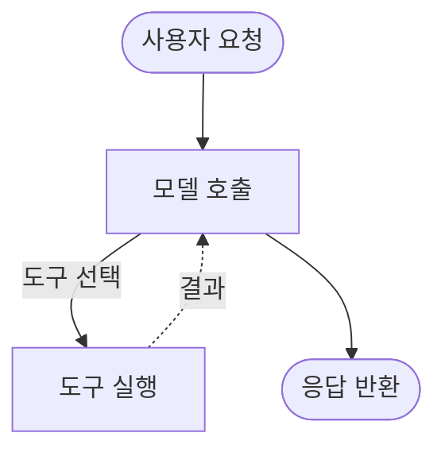
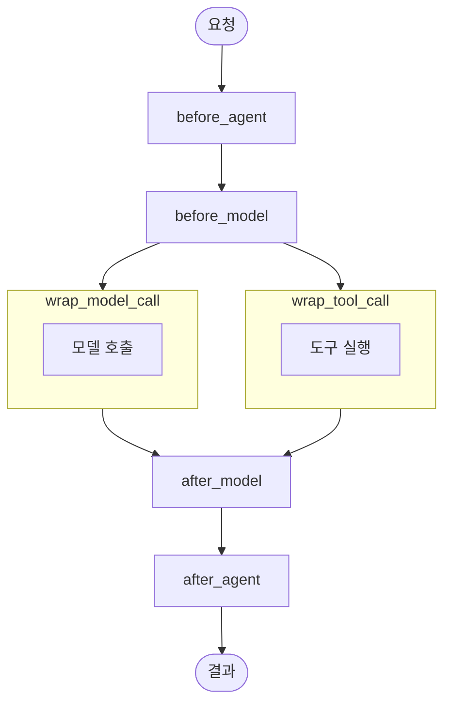
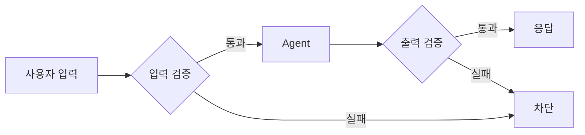

# Part 5: 미들웨어 (Middleware)

> 📚 **학습 시간**: 약 3-4시간
> 🎯 **난이도**: ⭐⭐⭐⭐☆ (고급)
> 📖 **공식 문서**: [14-middleware-overview.md](../official/14-middleware-overview_ko.md), [15-built-in-middleware.md](../official/15-built-in-middleware_ko.md), [16-custom-middleware.md](../official/16-custom-middleware_ko.md), [17-guardrails.md](../official/17-guardrails_ko.md)
> 💻 **예제 코드**: [part05_middleware 디렉토리](../src/part05_middleware/)

---

## 📋 학습 목표

이 파트를 완료하면 다음을 할 수 있습니다:

- [ ] 미들웨어의 개념과 Agent 실행 파이프라인을 이해한다
- [ ] 내장 미들웨어를 사용하여 일반적인 문제를 해결할 수 있다
- [ ] 커스텀 미들웨어를 작성하여 Agent 동작을 제어할 수 있다
- [ ] Guardrails를 구현하여 안전한 Agent를 만들 수 있다

---

## 📚 개요

이 파트에서는 **미들웨어(Middleware)**를 학습합니다. 미들웨어는 Agent 실행 파이프라인의 각 단계에 끼워넣을 수 있는 커스텀 로직으로, Agent 동작을 세밀하게 제어할 수 있습니다.

### 왜 중요한가?

- **관측성(Observability)**: 로깅, 분석, 디버깅을 통해 Agent 동작 추적
- **제어(Control)**: 프롬프트 변환, 도구 선택, 출력 포맷팅
- **안정성(Reliability)**: 재시도, 폴백, 조기 종료 로직
- **안전성(Safety)**: Rate Limit, Guardrails, PII 탐지

### 실무 활용 사례

- **자동 요약**: 대화가 길어지면 자동으로 요약하여 토큰 절약
- **승인 워크플로우**: 민감한 작업은 사람의 승인을 받도록 설정
- **도구 재시도**: 실패한 도구 호출을 자동으로 재시도
- **콘텐츠 필터링**: 부적절한 입출력을 차단

---

## 1. 미들웨어 개념

### 1.1 Agent 실행 루프

Agent의 핵심 실행 루프는 다음과 같습니다:



> 📖 **공식 문서**: [14-middleware-overview.md](../official/14-middleware-overview_ko.md#agent-루프)

### 1.2 미들웨어 훅(Hooks)

미들웨어는 실행 루프의 각 단계에 훅을 제공합니다:



> 💻 **예제 코드**: [01_middleware_intro.py](../src/part05_middleware/01_middleware_intro.py)

#### 훅 종류

**노드 스타일 훅** (Node-style Hooks):
- `before_agent`: Agent 시작 전 (요청당 1회)
- `before_model`: 각 모델 호출 전
- `after_model`: 각 모델 응답 후
- `after_agent`: Agent 완료 후 (요청당 1회)

**랩 스타일 훅** (Wrap-style Hooks):
- `wrap_model_call`: 각 모델 호출을 감싸기
- `wrap_tool_call`: 각 도구 호출을 감싸기

### 1.3 미들웨어 실행 순서

여러 미들웨어를 사용할 때 실행 순서를 이해하는 것이 중요합니다.

#### 기본 실행 순서

미들웨어는 **등록된 순서대로** 실행됩니다:

```python
agent = create_agent(
    model="gpt-4o-mini",
    tools=[...],
    middleware=[
        middleware_A,  # 1번
        middleware_B,  # 2번
        middleware_C,  # 3번
    ]
)
```

**Before hooks**: A → B → C 순서로 실행
**After hooks**: C → B → A 순서로 실행 (역순)

#### Wrap-style Hooks의 Nesting

Wrap-style hooks는 **함수 호출처럼 중첩**됩니다:

```python
# 등록 순서
middleware = [
    wrap_middleware_A,  # 외부
    wrap_middleware_B,  # 중간
    wrap_middleware_C,  # 내부
]

# 실제 실행 순서
A_start → B_start → C_start → [모델 호출] → C_end → B_end → A_end
```

**시각화**:

```
┌─ A (start) ─────────────────────────┐
│ ┌─ B (start) ───────────────────┐   │
│ │ ┌─ C (start) ─────────┐       │   │
│ │ │   [모델/도구 호출]   │       │   │
│ │ └─ C (end) ──────────┘       │   │
│ └─ B (end) ───────────────────┘   │
└─ A (end) ─────────────────────────┘
```

**예제**:

```python
from langchain.agents import create_agent
from langchain.agents.middleware import wrap_model_call

# 로깅 미들웨어
@wrap_model_call
def log_wrapper_outer(handler, request):
    print("🔵 Outer: Start")
    result = handler(request)
    print("🔵 Outer: End")
    return result

@wrap_model_call
def log_wrapper_inner(handler, request):
    print("  🟢 Inner: Start")
    result = handler(request)
    print("  🟢 Inner: End")
    return result

agent = create_agent(
    model="gpt-4o-mini",
    tools=[],
    middleware=[
        log_wrapper_outer,  # 외부
        log_wrapper_inner,  # 내부
    ]
)

# 출력:
# 🔵 Outer: Start
#   🟢 Inner: Start
#   [모델 호출]
#   🟢 Inner: End
# 🔵 Outer: End
```

#### Before/After/Wrap 혼합 사용

서로 다른 타입의 훅을 함께 사용할 수 있습니다:

```python
from langchain.agents.middleware import before_model, after_model, wrap_model_call

@before_model
def add_context(request):
    print("1. Before hook")
    return {"custom_field": "value"}

@wrap_model_call
def wrap_logging(handler, request):
    print("2. Wrap start")
    result = handler(request)
    print("4. Wrap end")
    return result

@after_model
def log_result(request):
    print("3. After hook")

agent = create_agent(
    model="gpt-4o-mini",
    middleware=[
        add_context,
        wrap_logging,
        log_result,
    ]
)

# 실행 순서:
# 1. Before hook
# 2. Wrap start
# [모델 호출]
# 3. After hook
# 4. Wrap end
```

**실행 흐름 정리**:

1. 모든 `before_*` hooks (등록 순서대로)
2. 모든 `wrap_*` hooks의 시작 부분 (등록 순서대로)
3. **모델/도구 호출**
4. 모든 `after_*` hooks (역순)
5. 모든 `wrap_*` hooks의 종료 부분 (역순)

#### Early Exit with jump_to

미들웨어에서 **실행 흐름을 변경**할 수 있습니다:

```python
from langchain.agents.middleware import before_model
from langgraph.types import Command

@before_model
def check_permission(request, state_schema, can_jump_to):
    """권한이 없으면 종료 노드로 이동"""
    user_role = request.context.get("role", "user")

    if user_role != "admin":
        # Agent 실행 중단하고 특정 노드로 이동
        return Command(
            goto="unauthorized_node"
        )

    # 정상 진행
    return None

# Node-style hook 파라미터:
# - request: Request 객체
# - state_schema: State 타입 정보
# - can_jump_to: 이동 가능한 노드 목록
```

**jump_to 사용 시나리오**:
- 권한 검증 실패 → 에러 노드로 이동
- 캐시 히트 → 응답 노드로 바로 이동
- 조건부 분기 → 특정 노드로 라우팅

#### 실행 순서 디버깅

미들웨어 실행 순서를 확인하려면 로깅을 추가하세요:

```python
from langchain.agents.middleware import before_model, after_model
import logging

logger = logging.getLogger(__name__)

@before_model
def debug_before(request):
    logger.info(f"BEFORE: {request.run_id}")

@after_model
def debug_after(request):
    logger.info(f"AFTER: {request.run_id}")

# 로깅 설정
logging.basicConfig(level=logging.INFO)
```

#### 주의사항

**1. 순서가 중요한 미들웨어**:

```python
# ❌ 잘못된 순서
middleware = [
    SummarizationMiddleware(...),  # 먼저 요약
    HumanInTheLoopMiddleware(...), # 나중에 승인
]
# 문제: 요약된 후 승인 요청 → 원본 확인 불가

# ✅ 올바른 순서
middleware = [
    HumanInTheLoopMiddleware(...), # 먼저 승인
    SummarizationMiddleware(...),  # 나중에 요약
]
# 올바름: 승인 후 요약 → 원본 확인 가능
```

**2. Wrap과 Before/After의 타이밍 차이**:

- **Before/After**: 모든 before → 모델 → 모든 after
- **Wrap**: 중첩 구조로 각각 before/after 동작

**3. State 수정은 Before hooks에서만**:

```python
# ✅ Before hook에서 State 수정
@before_model
def modify_state(request):
    return {"custom_field": "value"}

# ❌ After hook에서는 State 수정 불가 (읽기만 가능)
@after_model
def read_only(request):
    value = request.state["custom_field"]  # ✅ 읽기 가능
    # return {"new_field": "value"}  # ❌ 무시됨
```

> 💡 **핵심 포인트**:
> - 미들웨어는 등록 순서대로 실행 (Before: 순서, After: 역순)
> - Wrap-style은 함수 호출처럼 중첩
> - Before/After/Wrap은 혼합 사용 가능
> - jump_to로 실행 흐름 변경 가능
> - 순서가 중요한 미들웨어는 신중히 배치

---

## 2. 내장 미들웨어 (Built-in Middleware)

### 2.1 Summarization Middleware

대화 이력이 토큰 한계에 도달하면 자동으로 요약합니다.

```python
from langchain.agents import create_agent
from langchain.agents.middleware import SummarizationMiddleware

agent = create_agent(
    model="gpt-4o-mini",
    tools=[...],
    middleware=[
        SummarizationMiddleware(
            model="gpt-4o-mini",
            trigger=("tokens", 4000),  # 4000 토큰 도달 시
            keep=("messages", 20),      # 최근 20개 메시지 유지
        ),
    ],
)
```

> 📖 **공식 문서**: [15-built-in-middleware.md](../official/15-built-in-middleware_ko.md#요약)
> 💻 **예제 코드**: [05_summarization_mw.py](../src/part05_middleware/05_summarization_mw.py)

**설정 옵션:**

| 파라미터 | 설명 | 예시 |
|---------|------|------|
| `model` | 요약에 사용할 모델 | `"gpt-4o-mini"` |
| `trigger` | 요약 트리거 조건 | `("tokens", 4000)` |
| `keep` | 유지할 컨텍스트 크기 | `("messages", 20)` |
| `token_counter` | 토큰 카운터 함수 | 커스텀 함수 |
| `summary_prompt` | 요약 프롬프트 템플릿 | 커스텀 템플릿 |

### 2.2 Human-in-the-Loop Middleware

도구 호출 전에 사람의 승인을 받습니다.

```python
from langchain.agents.middleware import HumanInTheLoopMiddleware

agent = create_agent(
    model="gpt-4o-mini",
    tools=[send_email, delete_database],
    middleware=[
        HumanInTheLoopMiddleware(
            # 모든 도구 호출에 승인 필요
        ),
    ],
)
```

> 📖 **공식 문서**: [15-built-in-middleware.md](../official/15-built-in-middleware_ko.md#human-in-the-loop)
> 📖 **관련 문서**: [21-human-in-the-loop.md](../official/21-human-in-the-loop_ko.md)

### 2.3 Tool Retry Middleware

실패한 도구 호출을 자동으로 재시도합니다.

```python
from langchain.agents.middleware import ToolRetryMiddleware

agent = create_agent(
    model="gpt-4o-mini",
    tools=[api_call_tool],
    middleware=[
        ToolRetryMiddleware(
            max_retries=3,
            backoff_factor=2.0,  # 지수 백오프
        ),
    ],
)
```

> 📖 **공식 문서**: [15-built-in-middleware.md](../official/15-built-in-middleware_ko.md#tool-재시도)
> 💻 **예제 코드**: [06_tool_retry.py](../src/part05_middleware/06_tool_retry.py)

### 2.4 Model Fallback Middleware (모델 대체)

**용도**: 기본 모델 실패 시 자동으로 대체 모델 사용

**사용 시나리오:**
- 프로덕션 안정성 향상 (모델 다운타임 대응)
- 비용 최적화 (저렴한 모델 → 비싼 모델 순서)
- API 할당량 초과 시 대체 제공자 사용

**기본 사용법:**

```python
from langchain.agents import create_agent
from langchain.agents.middleware import ModelFallbackMiddleware

agent = create_agent(
    model="gpt-4o",
    tools=[search_web, calculator],
    middleware=[
        ModelFallbackMiddleware(
            fallback_models=["gpt-4o-mini", "claude-sonnet-4-5-20250929"],
            max_retries=2
        )
    ]
)

# gpt-4o 실패 시 자동으로 gpt-4o-mini 시도,
# 그것도 실패하면 claude-sonnet-4-5-20250929 시도
```

**주요 파라미터:**
- `fallback_models`: 대체 모델 리스트 (순서대로 시도)
- `max_retries`: 각 모델당 최대 재시도 횟수
- `retry_delay`: 재시도 간 대기 시간 (초)

**예제: 비용 기반 Fallback**

```python
# 전략: 저렴한 모델부터 시도
ModelFallbackMiddleware(
    fallback_models=[
        "gpt-4o-mini",                  # 첫 시도 (가장 저렴)
        "gpt-4o",                       # 두 번째 (중간 가격)
        "claude-sonnet-4-5-20250929"    # 최후 (가장 비싸지만 강력)
    ]
)
```

**주의사항:**
- 각 모델의 API 키가 설정되어 있어야 함
- 모델 간 응답 포맷이 다를 수 있음

> 📖 **공식 문서**: [15-built-in-middleware.md](../official/15-built-in-middleware_ko.md#모델-폴백)

---

### 2.5 Model Call Limit Middleware (모델 호출 제한)

**용도**: 모델 호출 횟수 제한으로 비용 제어

**사용 시나리오:**
- 무한 루프 방지
- 예산 초과 방지
- 개발/테스트 환경에서 비용 통제

**기본 사용법:**

```python
from langchain.agents.middleware import ModelCallLimitMiddleware

agent = create_agent(
    model="gpt-4o",
    tools=[complex_tool],
    middleware=[
        ModelCallLimitMiddleware(
            limit=10,  # 턴당 최대 10회 호출
            scope="per_turn"
        )
    ]
)
```

**주요 파라미터:**
- `limit`: 최대 호출 횟수
- `scope`: `"per_turn"` (턴당) 또는 `"per_thread"` (스레드 전체)
- `error_message`: 제한 초과 시 메시지

**예제: 스레드 전체 제한**

```python
# 전체 대화에서 최대 100회만 모델 호출
ModelCallLimitMiddleware(
    limit=100,
    scope="per_thread",
    error_message="모델 호출 제한에 도달했습니다. 새 대화를 시작하세요."
)
```

**실전 활용:**

```python
# 개발 환경: 엄격한 제한
dev_middleware = ModelCallLimitMiddleware(limit=5, scope="per_turn")

# 프로덕션: 느슨한 제한
prod_middleware = ModelCallLimitMiddleware(limit=50, scope="per_thread")

# 환경별 사용
import os
middleware = dev_middleware if os.getenv("ENV") == "dev" else prod_middleware
```

**주의사항:**
- 제한 초과 시 Exception 발생
- 복잡한 작업에는 충분한 제한 설정 필요

---

### 2.6 Tool Call Limit Middleware (도구 호출 제한)

**용도**: 특정 도구의 호출 횟수 제한

**사용 시나리오:**
- 비싼 API 호출 제한 (예: 웹 검색)
- 외부 리소스 보호 (예: 데이터베이스 쿼리)
- 특정 도구의 남용 방지

**기본 사용법:**

```python
from langchain.agents.middleware import ToolCallLimitMiddleware

agent = create_agent(
    model="gpt-4o",
    tools=[search_web, send_email, calculator],
    middleware=[
        ToolCallLimitMiddleware(
            limits={
                "search_web": 3,      # 웹 검색은 최대 3회
                "send_email": 1       # 이메일은 최대 1회
                # calculator는 제한 없음
            },
            scope="per_turn"
        )
    ]
)
```

**주요 파라미터:**
- `limits`: 도구별 제한 (dict)
- `scope`: `"per_turn"` 또는 `"per_thread"`
- `default_limit`: 명시되지 않은 도구의 기본 제한

**예제: 비용 민감 도구 보호**

```python
ToolCallLimitMiddleware(
    limits={
        "gpt4_vision_analyze": 1,     # 비싼 vision API
        "external_api_call": 5,       # 외부 API
        "database_query": 10          # DB 부하 제어
    },
    scope="per_turn",
    default_limit=20  # 기타 도구는 20회
)
```

**주의사항:**
- 도구 이름은 `@tool` 데코레이터의 함수 이름과 일치해야 함
- 제한 초과 시 에러 메시지 Agent에 전달

---

### 2.7 To-Do List Middleware (작업 계획)

**용도**: Agent에 작업 계획 및 추적 기능 제공

**사용 시나리오:**
- 복잡한 멀티스텝 작업
- 작업 진행 상황 추적
- 완료된 항목 체크

**기본 사용법:**

```python
from langchain.agents.middleware import ToDoListMiddleware

agent = create_agent(
    model="gpt-4o",
    tools=[search_web, analyze_data, create_report],
    middleware=[
        ToDoListMiddleware(
            enable_auto_planning=True,
            max_items=10
        )
    ]
)
```

**주요 파라미터:**
- `enable_auto_planning`: 자동으로 TODO 리스트 생성
- `max_items`: 최대 항목 수
- `persist`: TODO 리스트를 State에 저장

**예제: 리서치 Agent**

```python
# Agent는 자동으로 다음과 같은 TODO 생성:
# [ ] 1. 주제에 대한 웹 검색
# [ ] 2. 검색 결과 분석
# [ ] 3. 핵심 정보 추출
# [ ] 4. 보고서 작성
# [✓] 5. 최종 검토

agent = create_agent(
    model="gpt-4o",
    tools=[search, analyze, report],
    middleware=[ToDoListMiddleware(enable_auto_planning=True)]
)

result = agent.invoke({
    "messages": [{"role": "user", "content": "AI 최신 트렌드 보고서 작성"}]
})
```

**주의사항:**
- Model이 TODO 형식을 이해해야 함 (GPT-4 이상 권장)
- 너무 많은 항목은 컨텍스트 오버헤드 증가

---

### 2.8 LLM Tool Selector Middleware (도구 선택)

**용도**: LLM으로 관련 도구를 미리 선택하여 효율성 향상

**사용 시나리오:**
- 도구가 매우 많을 때 (20개 이상)
- 도구 설명이 길어서 토큰 낭비
- 컨텍스트 윈도우 절약

**기본 사용법:**

```python
from langchain.agents.middleware import LLMToolSelectorMiddleware

# 50개의 도구가 있다고 가정
all_tools = [tool1, tool2, ..., tool50]

agent = create_agent(
    model="gpt-4o",
    tools=all_tools,
    middleware=[
        LLMToolSelectorMiddleware(
            selector_model="gpt-4o-mini",  # 저렴한 모델로 선택
            max_tools=5,                    # 최대 5개만 선택
            cache_selections=True           # 선택 결과 캐싱
        )
    ]
)
```

**작동 방식:**

1. 사용자 질문 분석
2. 저렴한 모델(gpt-4o-mini)로 관련 도구 5개 선택
3. 선택된 5개만 메인 모델(gpt-4o)에 전달
4. 토큰 사용량 90% 절감!

**주요 파라미터:**
- `selector_model`: 도구 선택용 모델 (저렴한 모델 권장)
- `max_tools`: 최대 선택 개수
- `cache_selections`: 유사 질문에 대한 캐싱

**예제: 대규모 도구 세트**

```python
# 100개 도구 중 관련된 것만 선택
LLMToolSelectorMiddleware(
    selector_model="gpt-4o-mini",
    max_tools=3,
    selection_prompt="사용자 질문과 가장 관련 높은 도구 3개만 선택하세요."
)
```

**주의사항:**
- 도구 설명(docstring)이 명확해야 선택 정확도 높음
- 2단계 모델 호출이므로 지연 시간 약간 증가

---

### 2.9 Model Retry Middleware (모델 재시도)

**용도**: 모델 호출 실패 시 자동 재시도

**사용 시나리오:**
- 네트워크 불안정
- API Rate Limit 일시적 초과
- 타임아웃 오류

**기본 사용법:**

```python
from langchain.agents.middleware import ModelRetryMiddleware

agent = create_agent(
    model="gpt-4o",
    tools=[search_web],
    middleware=[
        ModelRetryMiddleware(
            max_retries=3,
            backoff_factor=2.0,  # 지수 백오프
            retry_on_errors=["RateLimitError", "TimeoutError"]
        )
    ]
)
```

**주요 파라미터:**
- `max_retries`: 최대 재시도 횟수
- `backoff_factor`: 백오프 계수 (대기 시간 = factor^retry)
- `retry_on_errors`: 재시도할 에러 타입 리스트

**재시도 타이밍:**

```python
# backoff_factor=2.0인 경우:
# 1st retry: 2초 대기 (2^1)
# 2nd retry: 4초 대기 (2^2)
# 3rd retry: 8초 대기 (2^3)
```

**예제: 프로덕션 설정**

```python
ModelRetryMiddleware(
    max_retries=5,
    backoff_factor=1.5,
    retry_on_errors=[
        "RateLimitError",
        "ServiceUnavailableError",
        "TimeoutError"
    ],
    jitter=True  # 랜덤 지터 추가 (동시 재시도 분산)
)
```

**주의사항:**
- 너무 많은 재시도는 전체 지연 시간 증가
- 멱등성이 없는 도구는 주의 (중복 실행 가능)

---

### 2.10 LLM Tool Emulator Middleware (도구 에뮬레이션)

**용도**: 실제 도구 대신 LLM으로 결과 시뮬레이션 (테스트용)

**사용 시나리오:**
- 개발 중 외부 API 없이 테스트
- 비용 절감 (실제 API 호출 대신 시뮬레이션)
- 데모/프로토타입

**기본 사용법:**

```python
from langchain.agents.middleware import LLMToolEmulatorMiddleware

agent = create_agent(
    model="gpt-4o",
    tools=[send_email, charge_credit_card, delete_database],
    middleware=[
        LLMToolEmulatorMiddleware(
            emulator_model="gpt-4o-mini",
            emulate_tools=["send_email", "charge_credit_card"],  # 위험한 도구만
            enable_warnings=True
        )
    ]
)

# 실제로 이메일을 보내지 않고 "이메일 전송 완료" 같은 응답 생성
```

**주요 파라미터:**
- `emulator_model`: 에뮬레이션용 모델
- `emulate_tools`: 에뮬레이트할 도구 리스트
- `enable_warnings`: 에뮬레이션 중임을 로그에 표시

**예제: 개발 환경 안전 모드**

```python
import os

if os.getenv("ENV") == "development":
    middleware = [
        LLMToolEmulatorMiddleware(
            emulator_model="gpt-4o-mini",
            emulate_tools=["*"],  # 모든 도구 에뮬레이트
            enable_warnings=True
        )
    ]
else:
    middleware = []  # 프로덕션에서는 실제 실행

agent = create_agent(model="gpt-4o", tools=[...], middleware=middleware)
```

**주의사항:**
- **절대 프로덕션에서 사용 금지**
- 에뮬레이션 결과는 실제와 다를 수 있음
- 테스트 목적으로만 사용

---

### 2.11 Context Editing Middleware (컨텍스트 편집)

**용도**: 대화 컨텍스트 관리 (오래된 도구 결과 제거)

**사용 시나리오:**
- 장시간 대화에서 불필요한 tool result 제거
- 컨텍스트 윈도우 절약
- 관련 없는 이전 도구 결과 정리

**기본 사용법:**

```python
from langchain.agents.middleware import ContextEditingMiddleware

agent = create_agent(
    model="gpt-4o",
    tools=[search_web, calculate],
    middleware=[
        ContextEditingMiddleware(
            clear_tool_results_older_than=5,  # 5턴 이전 tool result 제거
            keep_recent=3                     # 최근 3개는 유지
        )
    ]
)
```

**주요 파라미터:**
- `clear_tool_results_older_than`: N턴 이전 결과 제거
- `keep_recent`: 최근 N개는 항상 유지
- `remove_empty_tool_calls`: 빈 도구 호출 제거

**예제: 긴 대화 최적화**

```python
# 전략: 최근 10턴의 도구 결과만 유지, 나머지 제거
ContextEditingMiddleware(
    clear_tool_results_older_than=10,
    keep_recent=5,  # 안전을 위해 최근 5개는 항상 보존
    remove_empty_tool_calls=True
)
```

**작동 원리:**

```python
# Before Context Editing:
# Turn 1: [user, assistant, tool_call, tool_result]  <- 20턴 전
# Turn 2: [user, assistant, tool_call, tool_result]  <- 19턴 전
# ...
# Turn 20: [user, assistant, tool_call, tool_result] <- 현재

# After Context Editing (clear_older_than=10):
# Turn 1-10: [user, assistant] only (tool_result 제거)
# Turn 11-20: [user, assistant, tool_call, tool_result] (유지)
```

**주의사항:**
- 제거된 결과를 Agent가 참조하면 혼란 가능
- 중요한 작업은 keep_recent에 포함되도록 설정

---

### 2.12 Shell Tool Middleware (셸 도구)

**용도**: Agent에게 지속적인 셸 세션 제공

**사용 시나리오:**
- 파일 시스템 작업
- 스크립트 실행
- 시스템 명령 실행

**기본 사용법:**

```python
from langchain.agents.middleware import ShellToolMiddleware

agent = create_agent(
    model="gpt-4o",
    tools=[],  # Shell이 도구로 자동 추가됨
    middleware=[
        ShellToolMiddleware(
            allowed_commands=["ls", "cat", "grep", "find"],
            timeout=30,
            working_directory="/app/data"
        )
    ]
)
```

**주요 파라미터:**
- `allowed_commands`: 허용된 명령어 리스트 (보안)
- `timeout`: 명령 실행 제한 시간
- `working_directory`: 작업 디렉토리

**예제: 데이터 분석 Agent**

```python
ShellToolMiddleware(
    allowed_commands=[
        "ls", "cat", "head", "tail",
        "grep", "wc", "sort", "uniq",
        "python"  # Python 스크립트 실행
    ],
    timeout=60,
    env_vars={"PYTHONPATH": "/app/lib"}
)
```

**보안 주의사항:**
- ⚠️ **매우 위험** - 잘못된 명령은 시스템 손상 가능
- `allowed_commands`를 엄격히 제한
- 프로덕션 환경에서는 샌드박스 필수
- 사용자 입력을 셸 명령에 직접 넣지 말 것

---

### 2.13 File Search Middleware (파일 검색)

**용도**: Agent에게 Glob/Grep 파일 검색 도구 제공

**사용 시나리오:**
- 코드베이스 탐색
- 로그 파일 분석
- 문서 검색

**기본 사용법:**

```python
from langchain.agents.middleware import FileSearchMiddleware

agent = create_agent(
    model="gpt-4o",
    tools=[],  # glob_search, grep_search 자동 추가
    middleware=[
        FileSearchMiddleware(
            root_directory="/app/src",
            max_results=100,
            allowed_extensions=[".py", ".md", ".txt"]
        )
    ]
)
```

**주요 파라미터:**
- `root_directory`: 검색 루트 디렉토리
- `max_results`: 최대 결과 수
- `allowed_extensions`: 허용된 파일 확장자

**제공되는 도구:**

1. **glob_search**: 파일 이름 패턴 검색
   ```python
   # Agent가 호출 예:
   glob_search(pattern="**/*.py")
   ```

2. **grep_search**: 파일 내용 검색
   ```python
   # Agent가 호출 예:
   grep_search(pattern="def calculate", file_pattern="**/*.py")
   ```

**예제: 코드 리뷰 Agent**

```python
FileSearchMiddleware(
    root_directory="/project",
    max_results=50,
    allowed_extensions=[".py", ".js", ".ts", ".jsx", ".tsx"],
    ignore_patterns=["node_modules", "__pycache__", ".git"]
)
```

**주의사항:**
- 대규모 디렉토리는 검색 느림
- `max_results`로 성능 제어
- 민감한 파일은 `ignore_patterns`로 제외

---

### 2.14 PII Detection Middleware (개인정보 탐지) - 확장

**용도**: 개인정보 자동 탐지 및 처리

**(Section 2에 이미 간단히 언급되어 있다면 여기서 확장)**

**사용 시나리오:**
- GDPR 준수
- 개인정보 보호
- 로깅/분석에서 민감 정보 제거

**기본 사용법:**

```python
from langchain.agents.middleware import PIIDetectionMiddleware

agent = create_agent(
    model="gpt-4o",
    tools=[search_web],
    middleware=[
        PIIDetectionMiddleware(
            detectors=["email", "phone", "ssn", "credit_card"],
            strategy="redact",  # 또는 "block", "mask", "hash"
            apply_to=["input", "output", "tool_results"]
        )
    ]
)
```

**주요 전략:**

- `block`: PII 감지 시 실행 중단
- `redact`: PII 제거 (예: `[REDACTED]`)
- `mask`: PII 마스킹 (예: `***-**-1234`)
- `hash`: PII 해싱 (예: `hash_ab1234cd`)

**커스텀 Detector:**

```python
import re

def custom_korean_id_detector(text):
    """한국 주민번호 탐지"""
    pattern = r"\d{6}-\d{7}"
    matches = []
    for match in re.finditer(pattern, text):
        matches.append({
            "text": match.group(),
            "start": match.start(),
            "end": match.end(),
            "type": "korean_id"
        })
    return matches

PIIDetectionMiddleware(
    detectors=["email", "phone", custom_korean_id_detector],
    strategy="redact"
)
```

**예제: GDPR 준수 Agent**

```python
PIIDetectionMiddleware(
    detectors=[
        "email",
        "phone",
        "address",
        "credit_card",
        "ssn",
        custom_korean_id_detector,
        custom_passport_detector
    ],
    strategy="redact",
    apply_to=["input", "output", "tool_results", "logs"],
    audit_log_path="/var/log/pii_detections.log"  # 감지 로그 저장
)
```

**주의사항:**
- False positive 가능 (일반 숫자를 전화번호로 오인)
- 모든 PII 패턴을 탐지하기 어려움
- 추가 법적 검토 필요

---

## 3. 커스텀 미들웨어 (Custom Middleware)

### 3.1 before_model / after_model 훅

모델 호출 전후에 실행되는 훅입니다.

#### 데코레이터 방식

```python
from langchain.agents.middleware import before_model, after_model, AgentState
from langgraph.runtime import Runtime
from typing import Any

@before_model
def log_before_model(state: AgentState, runtime: Runtime) -> dict[str, Any] | None:
    print(f"모델 호출 전: {len(state['messages'])}개 메시지")
    return None  # 상태 변경 없음

@after_model
def log_after_model(state: AgentState, runtime: Runtime) -> dict[str, Any] | None:
    print(f"모델 응답: {state['messages'][-1].content[:50]}...")
    return None
```

> 📖 **공식 문서**: [16-custom-middleware.md](../official/16-custom-middleware_ko.md#노드-스타일-훅)
> 💻 **예제 코드**: [02_before_after_model.py](../src/part05_middleware/02_before_after_model.py)

#### 클래스 방식

```python
from langchain.agents.middleware import AgentMiddleware, AgentState
from langgraph.runtime import Runtime
from typing import Any

class LoggingMiddleware(AgentMiddleware):
    def before_model(self, state: AgentState, runtime: Runtime) -> dict[str, Any] | None:
        print(f"모델 호출 전: {len(state['messages'])}개 메시지")
        return None

    def after_model(self, state: AgentState, runtime: Runtime) -> dict[str, Any] | None:
        print(f"모델 응답: {state['messages'][-1].content[:50]}...")
        return None
```

**💡 언제 클래스 방식을 사용하나?**
- 여러 훅이 필요한 경우
- 설정 가능한 파라미터가 필요한 경우
- 재사용 가능한 미들웨어를 만드는 경우

### 3.2 wrap_model_call 훅

모델 호출을 감싸서 제어합니다.

```python
from langchain.agents.middleware import wrap_model_call, ModelRequest, ModelResponse
from typing import Callable

@wrap_model_call
def retry_model_call(
    request: ModelRequest,
    handler: Callable[[ModelRequest], ModelResponse],
) -> ModelResponse:
    for attempt in range(3):
        try:
            return handler(request)
        except Exception as e:
            if attempt == 2:
                raise
            print(f"재시도 {attempt + 1}/3: {e}")
```

> 💻 **예제 코드**: [03_wrap_model_call.py](../src/part05_middleware/03_wrap_model_call.py)

**wrap_model_call의 강력함:**
- **재시도 로직**: 실패 시 재시도
- **캐싱**: 동일한 요청 결과 캐싱
- **변환**: 요청/응답 변환
- **단락(Short-circuit)**: 조건에 따라 모델 호출 생략

### 3.3 wrap_tool_call 훅

도구 호출을 감싸서 제어합니다.

```python
from langchain.agents.middleware import wrap_tool_call, ToolRequest, ToolResponse
from typing import Callable
import time

@wrap_tool_call
def log_tool_execution(
    request: ToolRequest,
    handler: Callable[[ToolRequest], ToolResponse],
) -> ToolResponse:
    start_time = time.time()
    print(f"도구 실행: {request.tool_name}")

    result = handler(request)

    duration = time.time() - start_time
    print(f"도구 완료: {request.tool_name} ({duration:.2f}초)")

    return result
```

> 💻 **예제 코드**: [04_wrap_tool_call.py](../src/part05_middleware/04_wrap_tool_call.py)

---

## 4. Guardrails (안전장치)

### 4.1 Guardrails 개념

Guardrails는 Agent의 입출력을 검증하고 필터링하여 안전하고 신뢰할 수 있는 동작을 보장합니다.



> 📖 **공식 문서**: [17-guardrails.md](../official/17-guardrails_ko.md)
> 💻 **예제 코드**: [07_guardrails.py](../src/part05_middleware/07_guardrails.py)

### 4.2 콘텐츠 필터링

```python
from langchain.agents.middleware import before_model, AgentState
from langgraph.runtime import Runtime
from typing import Any

BLOCKED_KEYWORDS = ["해킹", "불법", "위험한"]

@before_model(can_jump_to=["end"])
def content_filter(state: AgentState, runtime: Runtime) -> dict[str, Any] | None:
    last_message = state["messages"][-1].content.lower()

    for keyword in BLOCKED_KEYWORDS:
        if keyword in last_message:
            return {
                "messages": [{"role": "assistant", "content": "부적절한 요청입니다."}],
                "jump_to": "end"
            }

    return None
```

### 4.3 PII Detection

개인정보(PII)를 자동으로 탐지하고 제거합니다.

```python
from langchain.agents.middleware import PIIDetectionMiddleware

agent = create_agent(
    model="gpt-4o-mini",
    tools=[...],
    middleware=[
        PIIDetectionMiddleware(
            redact=True,  # PII 자동 제거
            pii_types=["email", "phone", "ssn"],
        ),
    ],
)
```

> 📖 **공식 문서**: [15-built-in-middleware.md](../official/15-built-in-middleware_ko.md#pii-감지)

### 4.4 Rate Limiting

API 호출 횟수를 제한합니다.

```python
from langchain.agents.middleware import before_model, AgentState
from langgraph.runtime import Runtime
from typing import Any
import time

class RateLimitMiddleware(AgentMiddleware):
    def __init__(self, max_calls: int = 10, window_seconds: int = 60):
        super().__init__()
        self.max_calls = max_calls
        self.window_seconds = window_seconds
        self.call_times = []

    def before_model(self, state: AgentState, runtime: Runtime) -> dict[str, Any] | None:
        now = time.time()

        # 윈도우 내의 호출만 유지
        self.call_times = [t for t in self.call_times if now - t < self.window_seconds]

        if len(self.call_times) >= self.max_calls:
            return {
                "messages": [{"role": "assistant", "content": "요청이 너무 많습니다. 잠시 후 다시 시도하세요."}],
                "jump_to": "end"
            }

        self.call_times.append(now)
        return None
```

---

## 5. 미들웨어 조합 패턴

### 5.1 미들웨어 순서

미들웨어는 리스트 순서대로 실행됩니다:

```python
agent = create_agent(
    model="gpt-4o-mini",
    tools=[...],
    middleware=[
        LoggingMiddleware(),           # 1. 로깅
        RateLimitMiddleware(),         # 2. Rate Limit
        ContentFilterMiddleware(),     # 3. 콘텐츠 필터
        SummarizationMiddleware(...),  # 4. 요약
    ],
)
```

**실행 순서:**
- `before_agent`: 1 → 2 → 3 → 4
- `before_model`: 1 → 2 → 3 → 4
- `wrap_model_call`: 1 → 2 → 3 → 4 → **모델 호출** → 4 → 3 → 2 → 1
- `after_model`: 4 → 3 → 2 → 1
- `after_agent`: 4 → 3 → 2 → 1

### 5.2 프로덕션 미들웨어 스택

실무에서 사용하는 일반적인 미들웨어 조합:

```python
from langchain.agents import create_agent
from langchain.agents.middleware import (
    SummarizationMiddleware,
    ToolRetryMiddleware,
    ModelCallLimitMiddleware,
)

agent = create_agent(
    model="gpt-4o-mini",
    tools=[...],
    middleware=[
        # 1. 관측성 (Observability)
        LoggingMiddleware(),
        MetricsMiddleware(),

        # 2. 안전성 (Safety)
        ContentFilterMiddleware(),
        PIIDetectionMiddleware(),
        RateLimitMiddleware(),

        # 3. 안정성 (Reliability)
        ToolRetryMiddleware(max_retries=3),
        ModelCallLimitMiddleware(max_calls=10),

        # 4. 최적화 (Optimization)
        SummarizationMiddleware(
            model="gpt-4o-mini",
            trigger=("tokens", 4000),
            keep=("messages", 20),
        ),
    ],
)
```

---

## 6. 고급 패턴

### 6.1 조건부 실행

특정 조건에서만 미들웨어를 실행합니다:

```python
@before_model
def conditional_middleware(state: AgentState, runtime: Runtime) -> dict[str, Any] | None:
    # thread_id로 사용자 구분
    user_id = runtime.config.get("configurable", {}).get("thread_id")

    if user_id == "premium_user":
        # 프리미엄 사용자는 특별 처리
        return {"special_mode": True}

    return None
```

### 6.2 상태 수정

미들웨어에서 Agent 상태를 수정할 수 있습니다:

```python
@before_model
def inject_context(state: AgentState, runtime: Runtime) -> dict[str, Any] | None:
    # 시스템 메시지 추가
    return {
        "messages": [
            {"role": "system", "content": "현재 시간을 항상 응답에 포함하세요."}
        ] + state["messages"]
    }
```

### 6.3 Early Exit (조기 종료)

특정 조건에서 Agent 실행을 조기 종료합니다:

```python
@before_model(can_jump_to=["end"])
def early_exit(state: AgentState, runtime: Runtime) -> dict[str, Any] | None:
    if len(state["messages"]) > 50:
        return {
            "messages": [{"role": "assistant", "content": "대화가 너무 길어졌습니다."}],
            "jump_to": "end"
        }

    return None
```

---

## 🎓 실습 과제

### 과제 1: 비용 추적 미들웨어 (⭐⭐☆☆☆)

**목표**: 모델 호출 비용을 추적하고 리포트 생성

**요구사항**:
1. 토큰 사용량 추적 (입력/출력)
2. 모델별 비용 계산
3. 누적 통계 및 리포트

**힌트**:
- `tiktoken`으로 토큰 수 계산
- 모델별 가격 정보 관리 (GPT-4o, GPT-4o-mini 등)
- `before_call`/`after_call` 패턴으로 측정

**해답**: [solutions/exercise_01.py](../src/part05_middleware/solutions/exercise_01.py)

---

### 과제 2: 캐싱 미들웨어 (⭐⭐⭐☆☆)

**목표**: 동일한 요청에 대해 모델 호출을 캐싱

**요구사항**:
1. 동일 질문에 대한 캐시 저장
2. 캐시 히트 시 LLM 호출 없이 즉시 응답
3. 캐시 만료 시간 및 최대 크기 관리

**힌트**:
- `hashlib`로 요청 해싱
- LRU 캐시 알고리즘 구현
- TTL 기반 만료 처리

**해답**: [solutions/exercise_02.py](../src/part05_middleware/solutions/exercise_02.py)

---

### 과제 3: 종합 모니터링 시스템 (⭐⭐⭐⭐☆)

**목표**: 로깅, 성능, 에러를 통합 모니터링하는 시스템 구축

**요구사항**:
1. 로깅, 성능, 에러를 통합 모니터링
2. 여러 Middleware 체이닝
3. 대시보드급 리포트 생성

**힌트**:
- 로깅/성능/에러 추적을 각각 별도 클래스로 구현
- `MonitoringSystem`으로 통합
- health check 및 리포트 내보내기

**해답**: [solutions/exercise_03.py](../src/part05_middleware/solutions/exercise_03.py)

---

## 💡 실전 팁

### Tip 1: 미들웨어 디버깅

미들웨어가 예상대로 동작하지 않을 때:

```python
@before_model
def debug_middleware(state: AgentState, runtime: Runtime) -> dict[str, Any] | None:
    import json
    print("=" * 50)
    print("State:", json.dumps({
        "messages": [m.model_dump() for m in state["messages"]],
    }, indent=2))
    print("Runtime config:", runtime.config)
    print("=" * 50)
    return None
```

### Tip 2: 미들웨어 재사용

공통 미들웨어는 별도 모듈로 분리:

```python
# common_middleware.py
from langchain.agents.middleware import AgentMiddleware

class StandardMiddleware(AgentMiddleware):
    """프로덕션 표준 미들웨어"""
    # ... 구현 ...

# main.py
from common_middleware import StandardMiddleware

agent = create_agent(
    model="gpt-4o-mini",
    tools=[...],
    middleware=[StandardMiddleware()],
)
```

### Tip 3: 성능 최적화

미들웨어는 모든 호출마다 실행되므로 성능 고려:

```python
# ❌ 나쁜 예: 매번 DB 조회
@before_model
def bad_middleware(state, runtime):
    user = db.query(user_id)  # 매번 DB 조회!
    return None

# ✅ 좋은 예: 캐싱
@before_model
def good_middleware(state, runtime):
    user = user_cache.get(user_id, lambda: db.query(user_id))
    return None
```

---

## ❓ 자주 묻는 질문

<details>
<summary>Q1: 미들웨어와 도구(Tool)의 차이는 무엇인가요?</summary>

**A**:
- **도구**: Agent가 *선택*하여 호출하는 기능 (선택적)
- **미들웨어**: Agent 실행 파이프라인에 *자동으로* 끼워지는 로직 (항상 실행)

예시:
- 도구: `get_weather()` - Agent가 날씨가 필요할 때만 호출
- 미들웨어: `LoggingMiddleware` - 모든 요청에서 자동 실행

</details>

<details>
<summary>Q2: 여러 미들웨어의 실행 순서는 어떻게 되나요?</summary>

**A**: 미들웨어는 리스트 순서대로 실행됩니다:

```python
middleware=[A, B, C]

# 실행 순서:
before_agent: A → B → C
before_model: A → B → C
wrap_model_call: A → B → C → [모델] → C → B → A
after_model: C → B → A
after_agent: C → B → A
```

wrap 스타일 훅은 "양파 껍질" 처럼 동작합니다.

</details>

<details>
<summary>Q3: 미들웨어에서 Agent를 멈출 수 있나요?</summary>

**A**: 네, `jump_to="end"`를 반환하면 됩니다:

```python
@before_model(can_jump_to=["end"])
def stop_agent(state, runtime):
    if some_condition:
        return {
            "messages": [{"role": "assistant", "content": "중단됨"}],
            "jump_to": "end"
        }
    return None
```

</details>

<details>
<summary>Q4: 미들웨어가 성능에 영향을 주나요?</summary>

**A**: 네, 미들웨어는 모든 호출마다 실행되므로:

- **가벼운 로직** 사용 (무거운 연산 피하기)
- **캐싱** 활용
- **조건부 실행** 고려
- **프로파일링**으로 병목 지점 확인

</details>

---

## 🔗 심화 학습

이 파트의 기초를 마스터했다면:

1. **공식 문서 심화**
   - [14-middleware-overview.md](../official/14-middleware-overview_ko.md) - 미들웨어 개념
   - [15-built-in-middleware.md](../official/15-built-in-middleware_ko.md) - 내장 미들웨어
   - [16-custom-middleware.md](../official/16-custom-middleware_ko.md) - 커스텀 미들웨어
   - [17-guardrails.md](../official/17-guardrails_ko.md) - Guardrails

2. **관련 파트**
   - [Part 6: Context Engineering](./part06_context.md) - Runtime과 Context
   - [Part 9: Production](./part09_production.md) - HITL 상세
   - [Part 10: Deployment](./part10_deployment.md) - 관측성

3. **API 레퍼런스**
   - [Middleware API](https://reference.langchain.com/python/langchain/middleware/) - 전체 API 문서

4. **다음 단계**
   - 실무 프로젝트에 로깅 미들웨어 추가
   - Guardrails로 안전한 Agent 구축
   - 비용 추적 시스템 구현

---

## ✅ 체크리스트

Part 5를 완료하기 전에 확인하세요:

- [ ] 미들웨어의 4가지 훅을 설명할 수 있다
- [ ] `before_model`과 `wrap_model_call`의 차이를 이해한다
- [ ] 내장 미들웨어를 사용할 수 있다
- [ ] 커스텀 미들웨어를 작성할 수 있다
- [ ] Guardrails를 구현할 수 있다
- [ ] 모든 예제 코드를 실행해봤다
- [ ] 실습 과제를 완료했다

---

## 다음 단계

✅ Part 5 완료!
➡️ [Part 6: Context Engineering으로 이동](./part06_context.md)

**학습 진도**: ▓▓▓▓▓░░░░░ 50% (Part 5/10 완료)

---

*마지막 업데이트: 2026-02-18*
