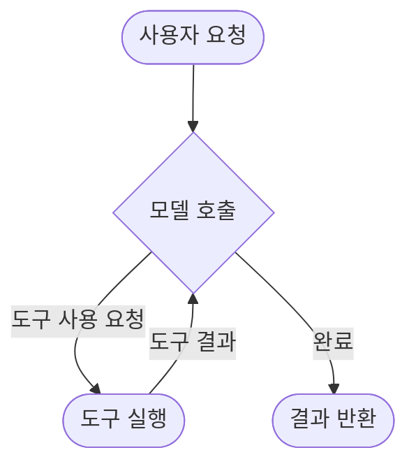
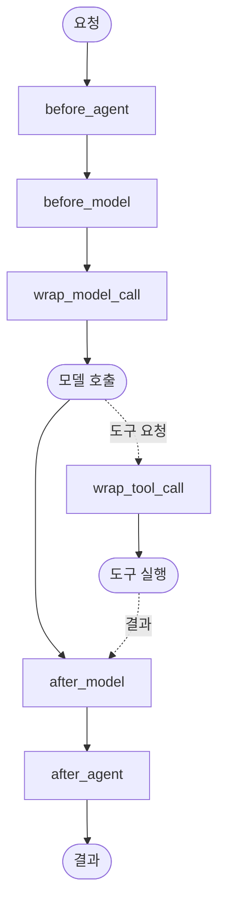

# Part 6: Context Engineering (컨텍스트 엔지니어링)

> 📚 **학습 시간**: 약 3-4시간
> 🎯 **난이도**: ⭐⭐⭐⭐☆ (고급)
> 📖 **공식 문서**: [18-runtime.md](../official/18-runtime_ko.md), [19-context-engineering.md](../official/19-context-engineering_ko.md)
> 💻 **예제 코드**: [part06_context 디렉토리](../src/part06_context/)

---

## 📋 학습 목표

이 파트를 완료하면 다음을 할 수 있습니다:

- [ ] Runtime 객체와 Context의 개념을 이해한다
- [ ] 동적으로 프롬프트를 변경할 수 있다
- [ ] 동적으로 도구를 추가/제거할 수 있다
- [ ] 동적으로 모델을 전환할 수 있다
- [ ] ToolRuntime으로 런타임 정보에 접근할 수 있다
- [ ] Context 스키마를 정의하고 활용할 수 있다

---

## 📚 개요

**Context Engineering**은 Agent 실행 중에 프롬프트, 도구, 모델 등을 동적으로 조정하는 기법입니다. 이는 LLM 애플리케이션의 신뢰성을 높이는 가장 중요한 기술 중 하나입니다.

### 왜 Context Engineering이 중요한가?

Agent가 실패하는 이유는 크게 두 가지입니다:

1. **모델의 능력 부족**: 사용하는 LLM이 작업을 수행하기에 충분히 강력하지 않음
2. **올바른 컨텍스트 부족**: LLM에게 적절한 정보가 전달되지 않음 ⭐ (가장 흔한 원인)

대부분의 경우, Agent 실패의 주요 원인은 "올바른 컨텍스트 부족"입니다. Context Engineering은 바로 이 문제를 해결합니다.

### Context Engineering이란?

**적절한 정보와 도구를 올바른 형식으로 LLM에 제공하여 작업을 성공적으로 완료하도록 하는 것**이 Context Engineering의 핵심입니다.

### 실전 활용 사례

**1. 개인화된 서비스**
```python
# 사용자별로 다른 프롬프트와 응답 스타일 제공
if user_tier == "premium":
    prompt = "당신은 전문가 수준의 상세한 분석을 제공합니다."
else:
    prompt = "당신은 간단하고 명확한 답변을 제공합니다."
```

**2. 비용 최적화**
```python
# 간단한 질문은 저렴한 모델, 복잡한 질문은 고급 모델 사용
if is_simple_query(message):
    model = "gpt-4o-mini"  # 저렴함
else:
    model = "claude-sonnet-4-5-20250929"  # 강력함
```

**3. 보안 및 권한 관리**
```python
# 사용자 권한에 따라 도구 접근 제어
if user_role == "admin":
    tools = [read_tool, write_tool, delete_tool]
elif user_role == "editor":
    tools = [read_tool, write_tool]
else:
    tools = [read_tool]  # viewer
```

**4. 시간/상황별 최적화**
```python
# 피크 시간에는 빠른 모델, 한산한 시간에는 고품질 모델
if is_peak_hours():
    model = "gpt-4o-mini"  # 빠름
else:
    model = "claude-sonnet-4-5-20250929"  # 고품질
```

### Agent Loop의 이해



Agent는 다음 두 단계를 반복합니다:

1. **모델 호출**: LLM이 프롬프트와 도구를 보고 응답 또는 도구 사용 요청
2. **도구 실행**: 요청된 도구를 실행하고 결과를 모델에게 반환

### Context의 세 가지 유형

Context Engineering은 세 가지 유형의 컨텍스트를 제어합니다:

| 유형 | 제어 대상 | 지속성 |
|------|-----------|--------|
| **Model Context** | 모델 호출에 들어가는 것 (프롬프트, 메시지, 도구, 응답 형식) | 일시적 (Transient) |
| **Tool Context** | 도구가 접근하고 생성하는 것 (State, Store, Runtime Context) | 지속적 (Persistent) |
| **Life-cycle Context** | 모델과 도구 호출 사이에 발생하는 것 (요약, 가드레일, 로깅) | 지속적 (Persistent) |

**일시적 vs 지속적:**
- **일시적(Transient)**: 한 번의 모델 호출에만 영향. State에 저장되지 않음
- **지속적(Persistent)**: State에 저장되어 이후 모든 턴에 영향

### 데이터 소스의 이해

Agent는 세 가지 데이터 소스에 접근합니다:

| 데이터 소스 | 다른 이름 | 범위 | 예시 |
|------------|----------|------|------|
| **Runtime Context** | 정적 구성 | 대화 범위 | 사용자 ID, API 키, DB 연결, 권한 |
| **State** | 단기 메모리 | 대화 범위 | 현재 메시지, 업로드된 파일, 인증 상태 |
| **Store** | 장기 메모리 | 대화 간 | 사용자 선호도, 추출된 인사이트, 과거 데이터 |

---

## 1. Runtime과 Context

### 1.1 Runtime 객체 상세

**Runtime**은 LangGraph가 제공하는 객체로, Agent 실행에 필요한 모든 컨텍스트 정보를 담고 있습니다.

```python
from langgraph.runtime import Runtime
from dataclasses import dataclass

@dataclass
class Context:
    user_id: str
    api_key: str

# Runtime 객체는 다음을 포함:
# - context: 정적 설정 (사용자 ID, DB 연결 등)
# - store: 장기 메모리 (BaseStore 인스턴스)
# - config: 실행 설정
# - stream: 스트리밍 출력
```

**Runtime이 제공하는 주요 정보:**

1. **Context**: 대화 세션에 고정된 정적 정보
2. **Store**: 장기 메모리 저장소
3. **Config**: 실행 설정 (thread_id 등)
4. **Stream Writer**: 커스텀 스트리밍

### 1.2 Context vs State 상세 비교

많은 개발자가 Context와 State를 헷갈려합니다. 이 둘의 차이를 정확히 이해하는 것이 **멀티턴 대화 구현의 핵심**입니다.

> 📖 **공식 문서**: [18-runtime.md](../official/18-runtime_ko.md)

#### 핵심 차이점

**1. 전달 시점 (When)**

- **Context**: `invoke()` 호출 시 매번 전달
  ```python
  agent.invoke(input, context=Context(user_id="123"))
  ```

- **State**: 실행 중 middleware에서 수정
  ```python
  @before_model
  def add_state(request):
      return {"custom_field": "value"}
  ```

**2. 불변성 (Immutability)**

- **Context**: 불변 - 실행 중 수정 불가
  ```python
  # ❌ 동작하지 않음
  @before_model
  def modify_context(request):
      request.context.user_id = "456"  # 무시됨
  ```

- **State**: 가변 - middleware가 수정 가능
  ```python
  # ✅ 동작함
  @before_model
  def modify_state(request):
      return {"counter": request.state.get("counter", 0) + 1}
  ```

**3. 지속성 (Persistence)**

- **Context**: Checkpointer에 저장되지 않음
  - 다음 turn에서 사용 불가
  - 매번 새로 전달 필요

- **State**: Checkpointer에 저장됨
  - 다음 turn에서 자동 로드
  - 대화 히스토리처럼 유지

**4. 사용 목적 (Purpose)**

- **Context**: 요청별 메타데이터
  - 사용자 ID, 세션 정보
  - 인증 토큰
  - Feature flags
  - 지역/언어 설정

- **State**: 대화 상태
  - 메시지 히스토리
  - Agent 추론 결과
  - 중간 계산 결과
  - 작업 진행 상태

#### 실전 예제: 멀티유저 챗봇

**상황**: 여러 사용자가 각자의 대화를 이어가는 챗봇

```python
from typing import TypedDict, Annotated
from langchain.agents import create_agent
from langgraph.checkpoint.memory import InMemorySaver
from langchain_core.messages import add_messages

# Context: 사용자 정보 (매번 전달)
class UserContext(TypedDict):
    user_id: str
    role: str  # "admin" | "user"
    language: str

# State: 대화 상태 (자동 저장)
class ConversationState(TypedDict):
    messages: Annotated[list, add_messages]
    conversation_count: int
    last_topic: str

agent = create_agent(
    model="gpt-4o-mini",
    tools=[search_web],
    context_schema=UserContext,
    state_schema=ConversationState,
    checkpointer=InMemorySaver()
)

# 첫 번째 turn
result1 = agent.invoke(
    {"messages": [{"role": "user", "content": "안녕"}]},
    config={"configurable": {"thread_id": "thread-1"}},
    context={"user_id": "user-123", "role": "admin", "language": "ko"}
)

# 두 번째 turn (같은 thread)
result2 = agent.invoke(
    {"messages": [{"role": "user", "content": "아까 무슨 얘기했지?"}]},
    config={"configurable": {"thread_id": "thread-1"}},
    context={"user_id": "user-123", "role": "admin", "language": "ko"}  # 다시 전달!
)
# State는 자동 로드되지만, Context는 매번 전달해야 함
```

**왜 Context를 매번 전달해야 하나?**

Context는 Checkpointer에 저장되지 않으므로:
```python
# ❌ 잘못된 사용
result = agent.invoke(
    {"messages": [{"role": "user", "content": "내 권한은?"}]},
    config={"configurable": {"thread_id": "thread-1"}}
    # context 전달 안함 → runtime.context는 비어있음!
)

# ✅ 올바른 사용
result = agent.invoke(
    {"messages": [{"role": "user", "content": "내 권한은?"}]},
    config={"configurable": {"thread_id": "thread-1"}},
    context={"user_id": "user-123", "role": "admin", "language": "ko"}
)
```

#### 선택 가이드

| 질문 | Context | State |
|------|---------|-------|
| 다음 turn에서도 필요? | ❌ | ✅ |
| Middleware에서 수정? | ❌ | ✅ |
| 사용자별로 다름? | ✅ | △ |
| Checkpointer 저장? | ❌ | ✅ |
| 요청마다 전달? | ✅ | ❌ |

**일반 원칙:**
- 사용자 메타데이터 (ID, 권한 등) → **Context**
- 대화 상태 (메시지, 결과 등) → **State**
- 확실하지 않으면 → **State** (저장되는 것이 안전)

#### 잘못된 사용 예시

**안티패턴 1: Context에 대화 저장**
```python
# ❌ 잘못됨 - Context는 저장 안됨
class WrongContext(TypedDict):
    user_id: str
    chat_history: list  # Context에 넣으면 안됨!

# ✅ 올바름 - State에 저장
class CorrectState(TypedDict):
    messages: Annotated[list, add_messages]
```

**안티패턴 2: State에 사용자 ID 저장**
```python
# △ 가능하지만 비효율적
class IneffectiveState(TypedDict):
    messages: list
    user_id: str  # 매 turn마다 Checkpointer에 저장됨

# ✅ 더 효율적 - Context 사용
# State는 변하는 것만, Context는 고정된 메타데이터
```

#### Middleware에서의 차이

**Context 접근 (읽기 전용):**
```python
from langchain.agents.middleware import before_model

@before_model
def use_context(request):
    user_id = request.context["user_id"]
    role = request.context["role"]

    # Context 기반 로직
    if role == "admin":
        return {"admin_mode": True}
```

**State 수정 (읽기/쓰기):**
```python
@before_model
def use_state(request):
    # State 읽기
    count = request.state.get("counter", 0)

    # State 수정 (return으로)
    return {"counter": count + 1}
```

### 1.3 RunnableConfig 접근

Runtime의 `config` 속성을 통해 실행 설정에 접근할 수 있습니다:

```python
from langchain.agents.middleware import before_model
from langchain.agents import AgentState
from langgraph.runtime import Runtime

@before_model
def access_config(state: AgentState, runtime: Runtime) -> dict | None:
    # Thread ID 접근
    thread_id = runtime.config.get("configurable", {}).get("thread_id")

    # Checkpoint ID 접근
    checkpoint_id = runtime.config.get("configurable", {}).get("checkpoint_id")

    print(f"현재 스레드: {thread_id}")
    return None
```

### 1.4 Runtime 접근 방법

Runtime은 두 곳에서 접근할 수 있습니다:

**1. Middleware에서 (before_model, after_model 등)**
```python
@before_model
def my_middleware(state: AgentState, runtime: Runtime) -> dict | None:
    user_id = runtime.context.user_id
    return None
```

**2. Tool에서 (ToolRuntime)**
```python
from langchain.tools import tool, ToolRuntime

@tool
def my_tool(query: str, runtime: ToolRuntime) -> str:
    user_id = runtime.context.user_id
    return f"Processing for {user_id}"
```

> 💻 **예제 코드**: [01_context_overview.py](../src/part06_context/01_context_overview.py)

---

## 2. 동적 프롬프트 (Dynamic Prompts)

동적 프롬프트는 사용자, 시간, 상황에 따라 시스템 메시지를 실시간으로 변경하는 기법입니다.

### 2.1 왜 동적 프롬프트가 필요한가?

**정적 프롬프트의 한계:**
```python
# 모든 사용자에게 같은 프롬프트
agent = create_agent(
    model="gpt-4o-mini",
    system_prompt="당신은 도움이 되는 비서입니다."
)
```

**동적 프롬프트의 장점:**
```python
# 사용자별로 다른 프롬프트
@dynamic_prompt
def personalized_prompt(request: ModelRequest) -> str:
    user_tier = request.runtime.context.user_tier

    if user_tier == "premium":
        return "당신은 전문가 수준의 상세한 분석을 제공하는 프리미엄 어시스턴트입니다."
    else:
        return "당신은 간단하고 명확한 답변을 제공하는 친절한 도우미입니다."
```

### 2.2 before_model로 프롬프트 수정

`before_model` 훅을 사용하면 모델 호출 직전에 메시지를 수정할 수 있습니다:

```python
from langchain.agents.middleware import before_model

@before_model
def inject_prompt(state: AgentState, runtime: Runtime) -> dict | None:
    # 사용자 정보 가져오기
    user_name = runtime.context.user_name

    # 시스템 메시지 생성
    system_msg = f"당신은 {user_name}님을 위한 개인 비서입니다."

    # 메시지 앞에 시스템 메시지 추가
    return {
        "messages": [
            {"role": "system", "content": system_msg}
        ] + state["messages"]
    }
```

### 2.3 사용자별 맞춤 프롬프트

```python
@dynamic_prompt
def user_specific_prompt(request: ModelRequest) -> str:
    user_role = request.runtime.context.user_role

    prompts = {
        "admin": "당신은 관리자용 기술 도우미입니다. 시스템 세부사항을 제공하세요.",
        "developer": "당신은 개발자용 코딩 도우미입니다. 코드 예제를 포함하세요.",
        "manager": "당신은 관리자용 비즈니스 도우미입니다. 요약을 제공하세요.",
        "user": "당신은 일반 사용자용 친절한 도우미입니다."
    }

    return prompts.get(user_role, prompts["user"])
```

### 2.4 시간/상황별 프롬프트

```python
import datetime

@before_model
def time_based_prompt(state: AgentState, runtime: Runtime) -> dict | None:
    now = datetime.datetime.now()
    hour = now.hour

    if 6 <= hour < 12:
        greeting = "좋은 아침입니다!"
        tone = "활기찬"
    elif 12 <= hour < 18:
        greeting = "좋은 오후입니다!"
        tone = "전문적인"
    else:
        greeting = "좋은 저녁입니다!"
        tone = "편안한"

    prompt = f"{greeting} {tone} 톤으로 응답하세요."

    return {
        "messages": [
            {"role": "system", "content": prompt}
        ] + state["messages"]
    }
```

### 2.5 이전 대화 기반 프롬프트 조정

```python
@before_model
def conversation_aware_prompt(state: AgentState, runtime: Runtime) -> dict | None:
    message_count = len(state["messages"])

    if message_count > 20:
        # 긴 대화 → 간결한 응답 요청
        prompt = "이 대화가 길어졌습니다. 매우 간결하게 답변하세요."
    elif message_count > 10:
        # 중간 대화 → 요약 제공
        prompt = "대화 맥락을 유지하며 요약된 답변을 제공하세요."
    else:
        # 짧은 대화 → 상세한 설명
        prompt = "상세하고 친절하게 설명하세요."

    return {
        "messages": [
            {"role": "system", "content": prompt}
        ] + state["messages"]
    }
```

> 💻 **예제 코드**: [02_dynamic_prompt.py](../src/part06_context/02_dynamic_prompt.py)

---

## 3. 동적 도구 (Dynamic Tools)

동적 도구는 실행 중에 사용 가능한 도구를 추가하거나 제거하는 기법입니다.

### 3.1 도구 동적 추가/제거

**왜 동적 도구가 필요한가?**

- 너무 많은 도구 → 모델이 혼란스러워함 (성능 저하)
- 너무 적은 도구 → 작업을 완료할 수 없음
- 상황별 도구 선택 → 최적의 성능

```python
from langchain.agents.middleware import wrap_model_call

@wrap_model_call
def dynamic_tools(
    request: ModelRequest,
    handler: Callable[[ModelRequest], ModelResponse]
) -> ModelResponse:
    # State 기반 도구 필터링
    is_authenticated = request.state.get("authenticated", False)

    if is_authenticated:
        # 인증된 사용자: 모든 도구 사용 가능
        pass
    else:
        # 미인증 사용자: 공개 도구만
        tools = [t for t in request.tools if t.name.startswith("public_")]
        request = request.override(tools=tools)

    return handler(request)
```

### 3.2 권한 기반 도구 필터링

```python
@dataclass
class Context:
    user_role: str

@wrap_model_call
def permission_based_tools(
    request: ModelRequest,
    handler: Callable[[ModelRequest], ModelResponse]
) -> ModelResponse:
    role = request.runtime.context.user_role

    # 역할별 허용 도구
    role_tools = {
        "admin": ["read", "write", "delete", "admin"],
        "editor": ["read", "write"],
        "viewer": ["read"]
    }

    allowed = role_tools.get(role, ["read"])

    # 허용된 도구만 필터링
    tools = [t for t in request.tools if any(a in t.name for a in allowed)]
    request = request.override(tools=tools)

    return handler(request)
```

### 3.3 상황별 도구 선택

```python
@wrap_model_call
def context_based_tools(
    request: ModelRequest,
    handler: Callable[[ModelRequest], ModelResponse]
) -> ModelResponse:
    # 대화 길이에 따라 도구 선택
    message_count = len(request.messages)

    if message_count < 5:
        # 초기 대화: 기본 도구만
        tools = [t for t in request.tools if t.name in ["search", "help"]]
    else:
        # 진행된 대화: 고급 도구 활성화
        tools = request.tools

    request = request.override(tools=tools)
    return handler(request)
```

### 3.4 도구 조합 전략

```python
@wrap_model_call
def smart_tool_selection(
    request: ModelRequest,
    handler: Callable[[ModelRequest], ModelResponse]
) -> ModelResponse:
    # 최근 메시지에서 의도 파악
    last_message = request.messages[-1].content.lower()

    # 의도별 도구 조합
    if "검색" in last_message or "찾" in last_message:
        # 검색 관련 도구만
        tools = [t for t in request.tools if "search" in t.name]
    elif "계산" in last_message or "분석" in last_message:
        # 분석 도구만
        tools = [t for t in request.tools if "calc" in t.name or "analyze" in t.name]
    else:
        # 모든 도구
        tools = request.tools

    request = request.override(tools=tools)
    return handler(request)
```

> 💻 **예제 코드**: [03_dynamic_tools.py](../src/part06_context/03_dynamic_tools.py)

---

## 4. 동적 모델 (Dynamic Models)

동적 모델은 작업의 복잡도나 비용 예산에 따라 사용할 LLM을 실시간으로 전환하는 기법입니다.

### 4.1 모델 동적 전환

```python
from langchain.chat_models import init_chat_model

# 모델 미리 초기화
efficient_model = init_chat_model("gpt-4o-mini")
standard_model = init_chat_model("gpt-4o")
powerful_model = init_chat_model("claude-sonnet-4-5-20250929")

@wrap_model_call
def select_model(
    request: ModelRequest,
    handler: Callable[[ModelRequest], ModelResponse]
) -> ModelResponse:
    # 메시지 길이로 복잡도 추정
    message_count = len(request.messages)

    if message_count > 20:
        # 긴 대화 → 강력한 모델
        model = powerful_model
    elif message_count > 10:
        # 중간 대화 → 표준 모델
        model = standard_model
    else:
        # 짧은 대화 → 효율적 모델
        model = efficient_model

    request = request.override(model=model)
    return handler(request)
```

### 4.2 비용 최적화 전략

```python
@dataclass
class Context:
    daily_budget: float
    spent_today: float

@wrap_model_call
def budget_aware_model(
    request: ModelRequest,
    handler: Callable[[ModelRequest], ModelResponse]
) -> ModelResponse:
    budget = request.runtime.context.daily_budget
    spent = request.runtime.context.spent_today
    remaining = budget - spent

    if remaining < 0.1:
        # 예산 거의 소진 → 가장 저렴한 모델
        model = init_chat_model("gpt-4o-mini")
    elif remaining < 1.0:
        # 예산 적음 → 표준 모델
        model = init_chat_model("gpt-4o")
    else:
        # 예산 충분 → 고급 모델
        model = init_chat_model("claude-sonnet-4-5-20250929")

    request = request.override(model=model)
    return handler(request)
```

### 4.3 성능/정확도 트레이드오프

```python
@wrap_model_call
def quality_based_model(
    request: ModelRequest,
    handler: Callable[[ModelRequest], ModelResponse]
) -> ModelResponse:
    # 질문 복잡도 분석
    last_message = request.messages[-1].content

    # 간단한 휴리스틱
    is_complex = (
        len(last_message) > 200 or
        "분석" in last_message or
        "상세" in last_message or
        "전문" in last_message
    )

    if is_complex:
        # 복잡한 질문 → 고성능 모델
        model = init_chat_model("claude-sonnet-4-5-20250929")
    else:
        # 간단한 질문 → 빠르고 저렴한 모델
        model = init_chat_model("gpt-4o-mini")

    request = request.override(model=model)
    return handler(request)
```

### 4.4 Fallback 모델

```python
@wrap_model_call
def model_with_fallback(
    request: ModelRequest,
    handler: Callable[[ModelRequest], ModelResponse]
) -> ModelResponse:
    # 1차 시도: 고급 모델
    request = request.override(model=init_chat_model("claude-sonnet-4-5-20250929"))

    try:
        response = handler(request)
        return response
    except Exception as e:
        print(f"주 모델 실패: {e}")

        # 2차 시도: 대체 모델
        request = request.override(model=init_chat_model("gpt-4o"))
        try:
            response = handler(request)
            return response
        except Exception as e2:
            print(f"대체 모델 실패: {e2}")

            # 3차 시도: 최후 모델
            request = request.override(model=init_chat_model("gpt-4o-mini"))
            return handler(request)
```

> 💻 **예제 코드**: [04_dynamic_model.py](../src/part06_context/04_dynamic_model.py)

---

## 5. ToolRuntime

ToolRuntime은 도구에서 Runtime 정보에 접근할 수 있게 해주는 특별한 파라미터입니다.

### 5.1 ToolRuntime 파라미터

```python
from langchain.tools import tool, ToolRuntime
from dataclasses import dataclass

@dataclass
class Context:
    user_id: str
    api_key: str

@tool
def advanced_search(
    query: str,
    runtime: ToolRuntime[Context]  # ToolRuntime 파라미터
) -> str:
    """고급 검색 도구"""
    # Context 접근
    user_id = runtime.context.user_id
    api_key = runtime.context.api_key

    # 실제 검색 수행
    results = perform_search(query, api_key)

    return f"User {user_id}: {len(results)} results found"
```

### 5.2 State 접근

도구에서 현재 State를 읽을 수 있습니다:

```python
@tool
def check_status(
    runtime: ToolRuntime
) -> str:
    """현재 상태 확인"""
    # State에서 정보 읽기
    current_state = runtime.state
    message_count = len(current_state.get("messages", []))
    is_authenticated = current_state.get("authenticated", False)

    return f"메시지: {message_count}개, 인증: {is_authenticated}"
```

### 5.3 Store 접근

도구에서 장기 메모리(Store)에 접근할 수 있습니다:

```python
@dataclass
class Context:
    user_id: str

@tool
def get_preferences(
    runtime: ToolRuntime[Context]
) -> str:
    """사용자 선호도 가져오기"""
    user_id = runtime.context.user_id

    # Store에서 읽기
    store = runtime.store
    prefs = store.get(("preferences",), user_id)

    if prefs:
        return f"선호도: {prefs.value}"
    else:
        return "선호도 없음"

@tool
def save_preference(
    key: str,
    value: str,
    runtime: ToolRuntime[Context]
) -> str:
    """사용자 선호도 저장"""
    user_id = runtime.context.user_id

    # Store에 쓰기
    store = runtime.store
    existing = store.get(("preferences",), user_id)

    prefs = existing.value if existing else {}
    prefs[key] = value

    store.put(("preferences",), user_id, prefs)

    return f"저장됨: {key} = {value}"
```

### 5.4 Config 접근

```python
@tool
def get_thread_info(
    runtime: ToolRuntime
) -> str:
    """현재 스레드 정보 가져오기"""
    # Config에서 thread_id 접근
    thread_id = runtime.config.get("configurable", {}).get("thread_id")

    return f"현재 스레드: {thread_id}"
```

### 5.5 Tool에서 Thread ID 활용

```python
@tool
def save_note(
    note: str,
    runtime: ToolRuntime
) -> str:
    """스레드별 노트 저장"""
    thread_id = runtime.config.get("configurable", {}).get("thread_id")

    # Store에 스레드별로 저장
    store = runtime.store
    store.put(("notes", thread_id), "latest", {"content": note})

    return f"노트 저장됨 (스레드: {thread_id})"
```

> 💻 **예제 코드**: [05_tool_runtime.py](../src/part06_context/05_tool_runtime.py)

---

## 6. Context Injection (컨텍스트 주입)

Context Injection은 실시간 정보를 Agent에게 주입하는 기법입니다.

### 6.1 Context 스키마 정의

먼저 Context의 구조를 정의합니다:

```python
from dataclasses import dataclass

@dataclass
class AppContext:
    """애플리케이션 컨텍스트"""
    user_id: str
    user_name: str
    user_tier: str  # "free", "premium", "enterprise"
    organization_id: str
    permissions: list[str]
    environment: str  # "dev", "staging", "prod"
```

### 6.2 Agent 생성시 Context 전달

```python
from langchain.agents import create_agent

agent = create_agent(
    model="gpt-4o-mini",
    tools=[...],
    context_schema=AppContext  # Context 스키마 지정
)

# Invoke 시 Context 전달
response = agent.invoke(
    {"messages": [{"role": "user", "content": "안녕하세요"}]},
    context=AppContext(
        user_id="user_123",
        user_name="김철수",
        user_tier="premium",
        organization_id="org_456",
        permissions=["read", "write"],
        environment="production"
    )
)
```

### 6.3 Tool에서 Context 사용

```python
@tool
def personalized_greeting(
    runtime: ToolRuntime[AppContext]
) -> str:
    """개인화된 인사"""
    ctx = runtime.context

    greeting = f"안녕하세요, {ctx.user_name}님!"

    if ctx.user_tier == "premium":
        greeting += " 프리미엄 회원이시군요. 최상의 서비스를 제공하겠습니다."

    return greeting
```

### 6.4 실전 패턴: 멀티테넌트 시스템

```python
@dataclass
class TenantContext:
    """멀티테넌트 컨텍스트"""
    tenant_id: str
    tenant_name: str
    subscription_tier: str
    feature_flags: dict[str, bool]
    rate_limit: int
    db_connection: str

@tool
def query_data(
    query: str,
    runtime: ToolRuntime[TenantContext]
) -> str:
    """테넌트별 데이터 조회"""
    ctx = runtime.context

    # 테넌트별 DB 연결
    db = connect_to_database(ctx.db_connection)

    # 테넌트 ID로 필터링
    results = db.query(
        f"SELECT * FROM data WHERE tenant_id = ? AND {query}",
        ctx.tenant_id
    )

    # Rate limit 체크
    if len(results) > ctx.rate_limit:
        results = results[:ctx.rate_limit]
        return f"결과 {ctx.rate_limit}개 (제한됨)"

    return f"결과 {len(results)}개"

@wrap_model_call
def tenant_aware_tools(
    request: ModelRequest,
    handler: Callable[[ModelRequest], ModelResponse]
) -> ModelResponse:
    """테넌트 구독에 따른 도구 필터링"""
    ctx = request.runtime.context

    # Feature flag 체크
    if not ctx.feature_flags.get("advanced_search", False):
        # Advanced search 비활성화
        tools = [t for t in request.tools if t.name != "advanced_search"]
        request = request.override(tools=tools)

    return handler(request)
```

### 6.5 실시간 정보 주입

```python
@before_model
def inject_realtime_context(state: AgentState, runtime: Runtime) -> dict | None:
    """실시간 컨텍스트 주입"""
    import datetime

    # 현재 시간
    now = datetime.datetime.now()

    # 실시간 정보 생성
    context_info = f"""
현재 시간: {now.strftime('%Y-%m-%d %H:%M:%S')}
요일: {now.strftime('%A')}
시간대: {"업무 시간" if 9 <= now.hour < 18 else "업무 외 시간"}
    """.strip()

    # 시스템 메시지로 주입
    return {
        "messages": [
            {"role": "system", "content": context_info}
        ] + state["messages"]
    }
```

> 💻 **예제 코드**: [06_context_injection.py](../src/part06_context/06_context_injection.py)

---

## 🎓 실습 과제

### 과제 1: 시간대별 Agent (⭐⭐☆☆☆)

**목표**: 현재 시간에 따라 다른 도구를 제공하고, 시간대별로 Agent 동작을 변경하는 Agent 구현

**요구사항**:
1. 현재 시간에 따라 다른 도구 제공 (오전/오후/저녁/밤)
2. 시간대별 Agent 동작 변경 (아침 브리핑, 오후 업무, 저녁 휴식, 밤 수면 등)
3. Context로 시간 정보 전달하여 state_modifier로 시스템 프롬프트 조정

**힌트**:
```python
from datetime import datetime, time
from langgraph.prebuilt import create_react_agent

def get_time_period(hour: int) -> str:
    if 6 <= hour < 12:
        return "morning"
    elif 12 <= hour < 18:
        return "afternoon"
    elif 18 <= hour < 22:
        return "evening"
    else:
        return "night"

# 시간대별 도구 매핑
# TODO: 시간대에 맞는 도구 선택 및 state_modifier 구현
```

**예상 시간**: 15분

> **해답**: [solutions/exercise_01.py](../src/part06_context/solutions/exercise_01.py)

---

### 과제 2: 권한 기반 Agent (⭐⭐⭐☆☆)

**목표**: 사용자 권한 레벨에 따라 접근 가능한 도구를 제한하는 RBAC Agent 구현

**요구사항**:
1. 사용자 권한 레벨에 따라 도구 제한 (Admin/Manager/User/Guest)
2. Admin: 모든 도구 사용 가능 (시스템 관리, 사용자 관리, 데이터 수정, 조회)
3. Manager: 사용자 관리 + 데이터 수정 + 조회
4. User: 데이터 조회 + 기본 작업
5. Guest: 공개 정보 조회만 가능
6. 권한 없는 작업 시도 시 적절한 안내 메시지 제공

**힌트**:
```python
from enum import Enum

class PermissionLevel(str, Enum):
    ADMIN = "admin"
    MANAGER = "manager"
    USER = "user"
    GUEST = "guest"

# 권한별 도구 매핑
# TODO: PermissionLevel에 따라 create_react_agent에 다른 도구 세트 제공
```

**예상 시간**: 25분

> **해답**: [solutions/exercise_02.py](../src/part06_context/solutions/exercise_02.py)

---

### 과제 3: 적응형 Agent (⭐⭐⭐⭐☆)

**목표**: 작업 복잡도에 따라 모델을 자동으로 선택하여 비용 효율성과 성능의 균형을 맞추는 적응형 Agent 구현

**요구사항**:
1. 작업 복잡도에 따라 모델 자동 선택 (키워드/길이 기반 분석)
2. 간단한 작업은 gpt-4o-mini, 복잡한 작업은 gpt-4o 사용
3. 비용 효율성과 성능의 균형을 위한 통계 추적 (AdaptiveStats)
4. 도구 호출이 필요한 경우 도구 실행 후 최종 응답 생성

**힌트**:
```python
from langgraph.graph import StateGraph, MessagesState, START, END

class ComplexityAnalyzer:
    SIMPLE_KEYWORDS = ["안녕", "hello", "간단", ...]
    COMPLEX_KEYWORDS = ["설명", "분석", "비교", ...]

    @classmethod
    def analyze(cls, text: str) -> str:
        # TODO: 키워드 매칭 + 길이 기반 복잡도 분석
        pass

# StateGraph로 analyze -> select_model -> agent -> tool -> final_response 흐름 구현
```

**예상 시간**: 30분

> **해답**: [solutions/exercise_03.py](../src/part06_context/solutions/exercise_03.py)

---

## 💡 실전 팁

### Tip 1: 보안 최우선

권한 검증은 항상 서버 사이드에서 수행하세요. 클라이언트에서 전달된 권한 정보를 그대로 신뢰하지 마세요.

```python
# ❌ 나쁜 예: 클라이언트가 전달한 권한 정보 신뢰
context = Context(permissions=user_input["permissions"])  # 위험!

# ✅ 좋은 예: 서버에서 권한 검증
user = get_user_from_db(user_id)
context = Context(permissions=user.permissions)  # 안전
```

### Tip 2: 성능 최적화

동적 로직은 최소화하고 캐싱을 활용하세요.

```python
# ❌ 나쁜 예: 매번 DB 조회
@before_model
def slow_middleware(state, runtime):
    prefs = db.query("SELECT * FROM prefs WHERE user_id = ?", user_id)
    # ...

# ✅ 좋은 예: 캐싱 활용
@lru_cache(maxsize=1000)
def get_user_prefs(user_id: str):
    return db.query("SELECT * FROM prefs WHERE user_id = ?", user_id)

@before_model
def fast_middleware(state, runtime):
    prefs = get_user_prefs(runtime.context.user_id)
    # ...
```

### Tip 3: 로깅과 모니터링

어떤 컨텍스트가 적용되었는지 항상 로깅하세요.

```python
@wrap_model_call
def logged_model_selection(request, handler):
    selected_model = select_model_by_complexity(request)

    # 로깅
    logger.info(f"User: {request.runtime.context.user_id}, "
                f"Model: {selected_model.model_name}, "
                f"Message count: {len(request.messages)}")

    request = request.override(model=selected_model)
    return handler(request)
```

### Tip 4: Fallback 전략

항상 fallback을 준비하세요.

```python
@wrap_model_call
def safe_dynamic_tools(request, handler):
    try:
        # 동적 도구 선택 시도
        tools = select_tools_dynamically(request)
        request = request.override(tools=tools)
    except Exception as e:
        # Fallback: 기본 도구 사용
        logger.error(f"도구 선택 실패: {e}")
        # request.tools를 그대로 사용

    return handler(request)
```

### Tip 5: 테스트 가능하게 설계

Context를 사용하면 테스트가 쉬워집니다.

```python
# 테스트에서 쉽게 다른 컨텍스트 주입 가능
def test_admin_features():
    agent = create_agent(
        model="gpt-4o-mini",
        tools=[...],
        context_schema=Context
    )

    response = agent.invoke(
        {"messages": [...]},
        context=Context(user_role="admin")  # 테스트용 컨텍스트
    )

    assert "admin" in response
```

---

## ❓ FAQ

### Q1: Context와 State의 차이가 여전히 헷갈립니다.

**A**: 간단하게 기억하세요:
- **Context**: 대화 시작할 때 정하고 변경 안 됨 (예: 사용자 ID)
- **State**: 대화 중에 계속 변함 (예: 메시지 목록)

```python
# Context: 고정됨
context = Context(user_id="user_123")

# State: 변경됨
state["messages"].append(new_message)
```

### Q2: 동적 프롬프트와 동적 도구 중 무엇을 먼저 적용해야 하나요?

**A**: 상황에 따라 다르지만, 일반적으로 이 순서를 권장합니다:

1. **동적 프롬프트**: 가장 기본적이고 효과적
2. **동적 도구**: 권한과 성능에 영향
3. **동적 모델**: 비용 최적화가 필요할 때

### Q3: ToolRuntime을 사용하면 모든 도구에 runtime 파라미터를 추가해야 하나요?

**A**: 아니요. 필요한 도구에만 추가하세요.

```python
# Runtime이 필요 없는 도구
@tool
def simple_tool(text: str) -> str:
    return text.upper()

# Runtime이 필요한 도구
@tool
def user_specific_tool(text: str, runtime: ToolRuntime) -> str:
    user_id = runtime.context.user_id
    return f"{user_id}: {text}"
```

### Q4: wrap_model_call vs before_model의 차이는?

**A**:
- **wrap_model_call**: 일시적(Transient) 변경. State 수정 안 함
- **before_model**: 지속적(Persistent) 변경. State에 저장됨

```python
# wrap_model_call: 이번 호출에만 영향
@wrap_model_call
def temp_change(request, handler):
    request = request.override(...)  # State 변경 안 됨
    return handler(request)

# before_model: 이후 모든 호출에 영향
@before_model
def persistent_change(state, runtime):
    return {"messages": [...]}  # State 변경됨
```

### Q5: 프로덕션에서 얼마나 많은 동적 로직을 사용해야 하나요?

**A**: 필요한 만큼만 사용하세요. 다음 원칙을 따르세요:

1. **간단하게 시작**: 정적 설정으로 시작
2. **문제가 생기면 추가**: 비용, 성능, 보안 문제가 있을 때만 동적 로직 추가
3. **측정하고 개선**: 모니터링하며 점진적으로 최적화

---

## 📖 심화 학습

### Middleware의 실행 순서



### 고급 패턴: A/B 테스팅

```python
import hashlib

@dynamic_prompt
def ab_test_prompt(request: ModelRequest) -> str:
    """사용자 ID 기반 A/B 테스팅"""
    user_id = request.runtime.context.user_id

    # 사용자 ID를 해시하여 50/50 분할
    hash_value = int(hashlib.md5(user_id.encode()).hexdigest(), 16)
    variant = "A" if hash_value % 2 == 0 else "B"

    prompts = {
        "A": "당신은 간결한 답변을 제공하는 도우미입니다.",
        "B": "당신은 상세한 설명을 제공하는 도우미입니다."
    }

    # 로깅 (분석용)
    logger.info(f"User {user_id}: Variant {variant}")

    return prompts[variant]
```

### 고급 패턴: 점진적 기능 롤아웃

```python
@dataclass
class Context:
    user_id: str
    rollout_percentage: float  # 0.0 ~ 1.0

@wrap_model_call
def gradual_rollout(request, handler):
    """점진적 기능 롤아웃"""
    user_id = request.runtime.context.user_id
    rollout = request.runtime.context.rollout_percentage

    # 사용자 ID 해시
    hash_value = int(hashlib.md5(user_id.encode()).hexdigest(), 16)
    user_bucket = (hash_value % 100) / 100.0

    # 롤아웃 비율에 포함되는지 확인
    if user_bucket < rollout:
        # 새 기능 활성화
        new_tool = get_new_experimental_tool()
        tools = request.tools + [new_tool]
        request = request.override(tools=tools)

    return handler(request)
```

---

## ✅ 체크리스트

학습을 완료했다면 다음을 확인하세요:

- [ ] Runtime 객체가 무엇인지 설명할 수 있다
- [ ] Context와 State의 차이를 이해한다
- [ ] before_model로 동적 프롬프트를 구현할 수 있다
- [ ] wrap_model_call로 도구를 동적으로 필터링할 수 있다
- [ ] 상황에 따라 모델을 동적으로 전환할 수 있다
- [ ] ToolRuntime으로 도구에서 컨텍스트에 접근할 수 있다
- [ ] Context 스키마를 정의하고 사용할 수 있다
- [ ] 권한 기반 도구 필터링을 구현할 수 있다
- [ ] 비용 최적화를 위한 모델 전환을 구현할 수 있다
- [ ] Transient vs Persistent 변경의 차이를 이해한다

---

## 다음 단계

축하합니다! Part 6를 완료했습니다! 이제 Context Engineering을 활용하여 상황에 맞게 동적으로 조정되는 똑똑한 Agent를 만들 수 있습니다.

**다음 학습 내용**:

✅ Part 6 완료!
➡️ [Part 7: Multi-Agent로 이동](./part07_multi_agent.md)

**학습 진도**: ▓▓▓▓▓▓░░░░ 60% (Part 6/10 완료)

---

## ❓ 자주 묻는 질문

<details>
<summary><strong>Q1: Context와 State의 차이가 뭔가요?</strong></summary>

**A**:
- **Context**: `@dataclass`로 정의하며 Agent 실행 시 외부에서 주입. 읽기 전용 의존성 주입
- **State**: Checkpointer에 저장되는 대화 상태. Agent 실행 중 변경 가능

Context는 "환경 설정", State는 "대화 기록"으로 이해하면 됩니다.
</details>

<details>
<summary><strong>Q2: Dynamic Prompt vs System Prompt, 어떤 걸 써야 하나요?</strong></summary>

**A**:
- **System Prompt**: 고정된 지침. 모든 대화에 동일하게 적용
- **Dynamic Prompt**: 상황(사용자, 시간, 권한 등)에 따라 변경

대부분은 System Prompt로 충분합니다. 사용자별 다른 동작이 필요하면 Dynamic Prompt를 사용하세요.
</details>

<details>
<summary><strong>Q3: ToolRuntime으로 어떤 것들에 접근할 수 있나요?</strong></summary>

**A**:
- `runtime.context` - 주입된 Context 객체
- `runtime.store` - InMemoryStore (장기 메모리)
- `runtime.config` - 설정 정보 (thread_id 등)

도구 함수에서 `ToolRuntime`을 타입 힌트로 선언하면 자동 주입됩니다.
</details>

<details>
<summary><strong>Q4: 모델을 동적으로 전환하면 비용이 절감되나요?</strong></summary>

**A**:
네, 효과적입니다. 간단한 질문은 GPT-4o-mini, 복잡한 분석은 Claude 3.5 Sonnet을 사용하고, 예산 소진 시 자동으로 저렴한 모델로 전환하면 30-50% 비용 절감이 가능합니다.
</details>

---

## 🔗 심화 학습

1. **공식 문서 심화**
   - [18-runtime.md](../official/18-runtime_ko.md) - Runtime 객체 상세
   - [19-context-engineering.md](../official/19-context-engineering_ko.md) - Context 고급 패턴
   - [14-middleware-overview.md](../official/14-middleware-overview_ko.md) - 미들웨어와 Context 연계

2. **고급 패턴**
   - A/B 테스트를 위한 Context 활용
   - Feature Flag 기반 도구 활성화
   - 멀티테넌트 Agent 아키텍처

3. **커뮤니티 리소스**
   - [LangChain Blog - Context Engineering](https://blog.langchain.com)
   - [LangChain Discord](https://discord.gg/langchain)

---

## 📚 참고 자료

**공식 문서**:
- [Runtime](../official/18-runtime_ko.md)
- [Context Engineering](../official/19-context-engineering_ko.md)
- [Middleware](../official/14-middleware-overview_ko.md)

**예제 코드**:
- [01_context_overview.py](../src/part06_context/01_context_overview.py)
- [02_dynamic_prompt.py](../src/part06_context/02_dynamic_prompt.py)
- [03_dynamic_tools.py](../src/part06_context/03_dynamic_tools.py)
- [04_dynamic_model.py](../src/part06_context/04_dynamic_model.py)
- [05_tool_runtime.py](../src/part06_context/05_tool_runtime.py)
- [06_context_injection.py](../src/part06_context/06_context_injection.py)

---

*마지막 업데이트: 2026-02-18*
