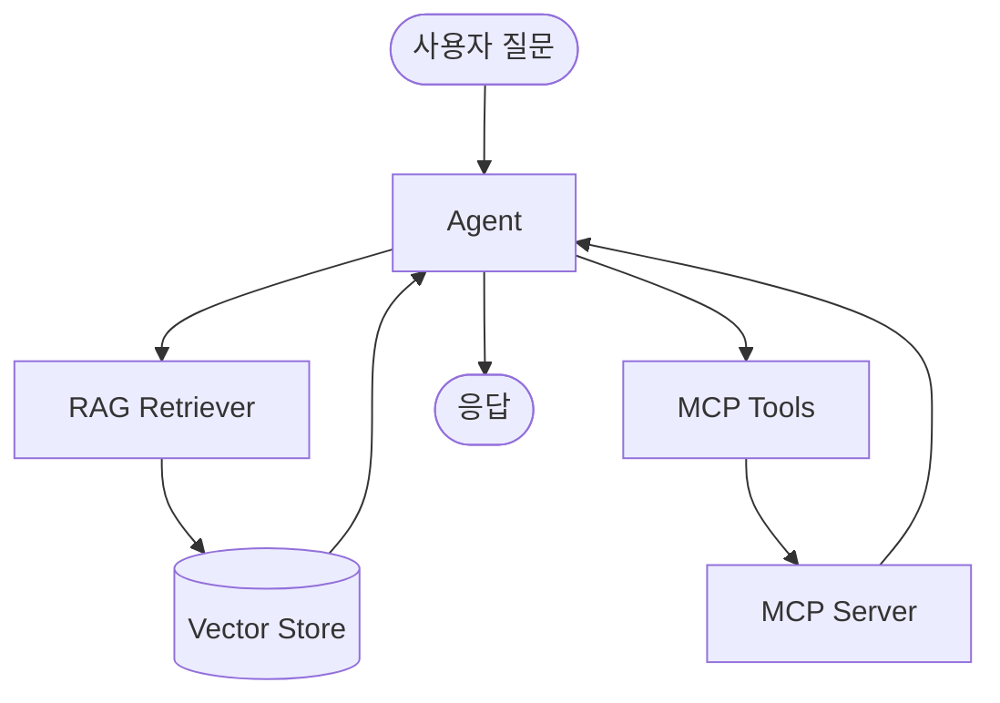
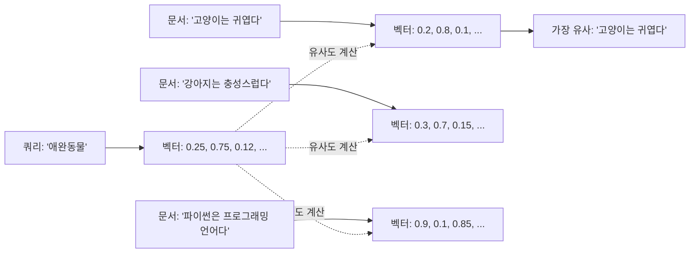
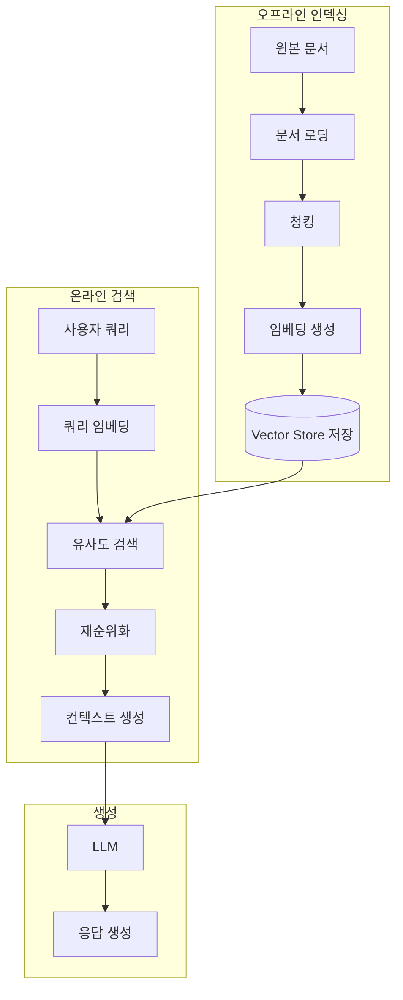
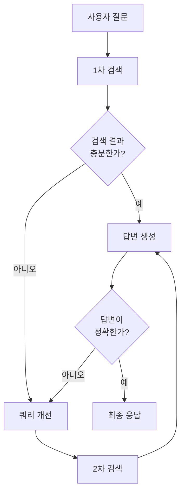
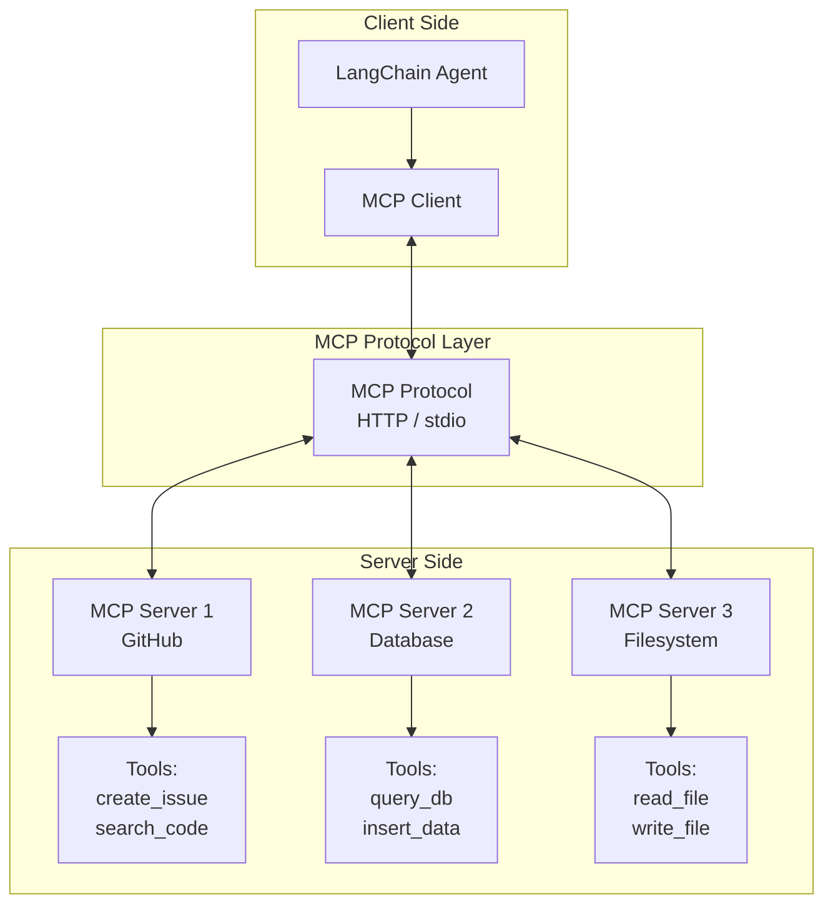

# Part 8: RAG와 MCP (Retrieval Augmented Generation & Model Context Protocol)

> 📚 **학습 시간**: 약 4-5시간
> 🎯 **난이도**: ⭐⭐⭐⭐☆ (고급)
> 📖 **공식 문서**: [28-retrieval.md](../official/28-retrieval_ko.md), [20-model-context-protocol.md](../official/20-model-context-protocol_ko.md)
> 💻 **예제 코드**: [part08_rag_mcp 디렉토리](../src/part08_rag_mcp/)

---

## 📋 학습 목표

이 파트를 완료하면 다음을 할 수 있습니다:

- [ ] RAG (Retrieval Augmented Generation)의 개념과 필요성을 이해한다
- [ ] Vector Store를 구축하고 문서를 임베딩할 수 있다
- [ ] 기본 RAG 시스템을 구현할 수 있다
- [ ] Agentic RAG 패턴을 이해하고 구현할 수 있다
- [ ] MCP (Model Context Protocol)의 개념과 아키텍처를 이해한다
- [ ] MCP 서버를 구현하고 도구를 제공할 수 있다
- [ ] MCP 클라이언트를 통해 외부 도구에 접근할 수 있다
- [ ] Agent와 MCP를 통합하여 확장 가능한 시스템을 구축할 수 있다

---

## 📚 개요

**RAG (Retrieval Augmented Generation)**와 **MCP (Model Context Protocol)**는 LLM의 핵심 제약사항을 해결하는 두 가지 중요한 기술입니다.

### LLM의 핵심 제약사항

LLM은 강력하지만 두 가지 근본적인 한계가 있습니다:

1. **유한한 컨텍스트 윈도우**: 한 번에 처리할 수 있는 텍스트 양이 제한됨
2. **정적인 지식**: 학습 데이터가 특정 시점에 고정되어 최신 정보 부족

### RAG와 MCP의 역할

**RAG**는 외부 지식 베이스에서 관련 정보를 검색하여 LLM에 제공함으로써 이 두 가지 문제를 모두 해결합니다:
- 필요한 정보만 검색하여 컨텍스트 윈도우 효율적 사용
- 실시간으로 최신 정보 검색 가능

**MCP**는 외부 도구와 데이터 소스를 표준화된 방식으로 연결하여 Agent의 능력을 확장합니다:
- 다양한 도구를 일관된 인터페이스로 제공
- 서버-클라이언트 구조로 확장 가능한 시스템 구축

### 실전 활용 사례

**1. 기업 문서 Q&A 시스템**
```python
# 수천 개의 내부 문서를 검색하여 정확한 답변 제공
vectorstore = FAISS.from_documents(company_docs, embeddings)
retriever = vectorstore.as_retriever(search_kwargs={"k": 5})

@tool
def search_company_docs(query: str) -> str:
    """회사 문서에서 정보 검색"""
    docs = retriever.invoke(query)
    return "\n".join([d.page_content for d in docs])
```

**2. 최신 정보 기반 뉴스 봇**
```python
# 실시간 웹 검색과 RAG를 결합하여 최신 뉴스 제공
@tool
def search_recent_news(topic: str) -> str:
    """최신 뉴스 검색 및 요약"""
    # 1. 웹에서 최신 기사 검색
    # 2. Vector Store에 임시 저장
    # 3. 유사도 기반 검색
    # 4. LLM이 요약
```

**3. MCP 기반 개발 도우미**
```python
# 여러 MCP 서버를 통해 다양한 도구 제공
client = MultiServerMCPClient({
    "github": {...},      # GitHub API 접근
    "database": {...},    # DB 쿼리 실행
    "filesystem": {...},  # 파일 시스템 작업
})

tools = await client.get_tools()
agent = create_agent("gpt-4o-mini", tools)
```

**4. 고객 지원 챗봇**
```python
# FAQ, 제품 매뉴얼, 과거 티켓을 RAG로 검색
# MCP로 CRM 시스템 연동하여 고객 정보 조회
```

### RAG vs MCP 비교

| 측면 | RAG | MCP |
|------|-----|-----|
| **목적** | 외부 지식 검색 | 외부 도구 연결 |
| **핵심 개념** | Vector Store, Embedding | 서버-클라이언트, Protocol |
| **주요 작업** | 문서 검색, 유사도 계산 | Tool/Resource 제공 |
| **사용 시점** | 지식이 필요할 때 | 작업 실행이 필요할 때 |
| **확장성** | 문서 추가로 확장 | 서버 추가로 확장 |

### 통합 아키텍처

RAG와 MCP는 함께 사용될 때 가장 강력합니다:



---

## 1. RAG 기초

### 1.1 RAG란 무엇인가?

**Retrieval Augmented Generation (RAG)**는 LLM의 생성 능력과 외부 지식 검색을 결합한 기법입니다.

#### RAG가 없을 때의 문제

```python
# ❌ RAG 없이 - LLM의 내재된 지식에만 의존
agent = create_agent("gpt-4o-mini", tools=[])
response = agent.invoke({
    "messages": [{"role": "user", "content": "2024년 우리 회사의 Q3 매출은?"}]
})
# 결과: "죄송하지만 그 정보를 모릅니다" 또는 잘못된 추측
```

#### RAG를 사용할 때

```python
# ✅ RAG 사용 - 실제 문서에서 검색하여 정확한 답변
from langchain_community.vectorstores import FAISS
from langchain_openai import OpenAIEmbeddings

# 회사 문서를 Vector Store에 저장
company_docs = ["2024 Q3 매출: $5.2M", "2024 Q2 매출: $4.8M", ...]
vectorstore = FAISS.from_texts(company_docs, OpenAIEmbeddings())

@tool
def search_financials(query: str) -> str:
    """재무 정보 검색"""
    docs = vectorstore.similarity_search(query, k=3)
    return "\n".join([d.page_content for d in docs])

agent = create_agent("gpt-4o-mini", tools=[search_financials])
response = agent.invoke({
    "messages": [{"role": "user", "content": "2024년 우리 회사의 Q3 매출은?"}]
})
# 결과: "2024년 Q3 매출은 $5.2M입니다."
```

### 1.2 Vector Database의 이해

Vector Database는 텍스트를 고차원 벡터로 변환하여 저장하고, 유사도 기반 검색을 가능하게 합니다.

#### 작동 원리



#### 주요 Vector Store 비교

| Vector Store | 타입 | 특징 | 사용 사례 |
|--------------|------|------|-----------|
| **FAISS** | 로컬 인메모리 | 빠름, 무료, 로컬 실행 | 프로토타입, 소규모 데이터 |
| **Chroma** | 로컬/서버 | 사용 쉬움, 메타데이터 필터링 | 중소규모 애플리케이션 |
| **Pinecone** | 클라우드 | 확장성, 관리형 서비스 | 대규모 프로덕션 |
| **Weaviate** | 클라우드/온프레미스 | 고급 기능, GraphQL | 복잡한 검색 요구사항 |
| **Qdrant** | 로컬/클라우드 | 빠름, 필터링 강력 | 고성능 검색 |

### 1.3 Embedding의 이해

Embedding은 텍스트를 숫자 벡터로 변환하는 과정입니다. 의미적으로 유사한 텍스트는 벡터 공간에서 가까운 위치에 매핑됩니다.

#### Embedding 모델 선택

```python
# OpenAI Embeddings (권장)
from langchain_openai import OpenAIEmbeddings
embeddings = OpenAIEmbeddings(model="text-embedding-3-small")

# Cohere Embeddings (다국어 지원 강함)
from langchain_cohere import CohereEmbeddings
embeddings = CohereEmbeddings(model="embed-multilingual-v3.0")

# HuggingFace Embeddings (무료, 로컬)
from langchain_huggingface import HuggingFaceEmbeddings
embeddings = HuggingFaceEmbeddings(model_name="sentence-transformers/all-MiniLM-L6-v2")
```

#### Embedding 품질 비교

| 모델 | 차원 | 성능 | 비용 | 특징 |
|------|------|------|------|------|
| text-embedding-3-small | 1536 | 우수 | 낮음 | 범용, 빠름 |
| text-embedding-3-large | 3072 | 최고 | 중간 | 최고 품질 |
| embed-multilingual-v3.0 | 1024 | 우수 | 중간 | 100+ 언어 |
| all-MiniLM-L6-v2 | 384 | 양호 | 무료 | 로컬, 빠름 |

### 1.4 Retrieval 과정 상세

RAG의 전체 파이프라인을 단계별로 살펴봅시다.



#### 1단계: 문서 로딩

```python
from langchain_community.document_loaders import (
    TextLoader,
    PDFLoader,
    WebBaseLoader,
    CSVLoader
)

# 텍스트 파일
loader = TextLoader("./docs/company_policy.txt")
docs = loader.load()

# PDF 파일
loader = PDFLoader("./docs/manual.pdf")
docs = loader.load()

# 웹 페이지
loader = WebBaseLoader("https://example.com/docs")
docs = loader.load()

# CSV 파일
loader = CSVLoader("./data/products.csv")
docs = loader.load()
```

#### 2단계: 텍스트 청킹 (Text Splitting)

청킹은 긴 문서를 작은 조각으로 나누는 과정입니다. 적절한 청킹은 RAG 품질에 큰 영향을 미칩니다.

```python
from langchain.text_splitter import (
    RecursiveCharacterTextSplitter,
    CharacterTextSplitter,
    TokenTextSplitter
)

# RecursiveCharacterTextSplitter (권장)
# - 문단, 문장, 단어 순으로 재귀적 분할
splitter = RecursiveCharacterTextSplitter(
    chunk_size=1000,      # 청크 크기
    chunk_overlap=200,    # 청크 간 겹침
    length_function=len,
)
chunks = splitter.split_documents(docs)

# TokenTextSplitter
# - 토큰 기반 분할 (LLM 컨텍스트 윈도우 고려)
splitter = TokenTextSplitter(
    chunk_size=512,
    chunk_overlap=50
)
chunks = splitter.split_documents(docs)
```

**청킹 전략 가이드:**

| Chunk Size | Overlap | 사용 사례 |
|------------|---------|-----------|
| 500-1000 | 100-200 | 일반적인 문서 |
| 200-500 | 50-100 | 짧은 단락, FAQ |
| 1000-2000 | 200-400 | 긴 기술 문서 |
| 100-300 | 20-50 | 코드 스니펫 |

#### 3단계: 임베딩 및 저장

```python
from langchain_openai import OpenAIEmbeddings
from langchain_community.vectorstores import FAISS

# 임베딩 모델 초기화
embeddings = OpenAIEmbeddings(model="text-embedding-3-small")

# Vector Store 생성 및 저장
vectorstore = FAISS.from_documents(
    documents=chunks,
    embedding=embeddings
)

# 디스크에 저장 (선택사항)
vectorstore.save_local("./vectorstore")

# 나중에 로드
vectorstore = FAISS.load_local(
    "./vectorstore",
    embeddings,
    allow_dangerous_deserialization=True
)
```

#### 4단계: 검색 및 활용

```python
# 1. 유사도 검색
results = vectorstore.similarity_search(
    "회사의 휴가 정책은?",
    k=3  # 상위 3개 결과
)

# 2. 유사도 점수와 함께 검색
results = vectorstore.similarity_search_with_score(
    "회사의 휴가 정책은?",
    k=3
)
for doc, score in results:
    print(f"Score: {score:.4f}")
    print(f"Content: {doc.page_content[:100]}...")

# 3. MMR (Maximum Marginal Relevance) 검색
# - 다양성을 고려한 검색
results = vectorstore.max_marginal_relevance_search(
    "회사의 휴가 정책은?",
    k=3,
    fetch_k=10,  # 먼저 10개 가져온 후 3개 선택
    lambda_mult=0.5  # 0=다양성 중시, 1=유사도 중시
)
```

> 💻 **예제 코드**: [01_rag_basics.py](../src/part08_rag_mcp/01_rag_basics.py)

---

## 2. Vector Store 구축

### 2.1 Chroma 사용법

Chroma는 사용하기 쉬운 오픈소스 Vector Database입니다.

```python
from langchain_community.vectorstores import Chroma
from langchain_openai import OpenAIEmbeddings

# 기본 사용
embeddings = OpenAIEmbeddings()
vectorstore = Chroma.from_texts(
    texts=["문서1", "문서2", "문서3"],
    embedding=embeddings,
    persist_directory="./chroma_db"  # 영구 저장
)

# 메타데이터와 함께 저장
vectorstore = Chroma.from_texts(
    texts=["문서1", "문서2"],
    embedding=embeddings,
    metadatas=[
        {"source": "doc1.pdf", "page": 1},
        {"source": "doc2.pdf", "page": 5}
    ]
)

# 메타데이터 필터링 검색
results = vectorstore.similarity_search(
    "검색 쿼리",
    k=3,
    filter={"source": "doc1.pdf"}  # doc1.pdf에서만 검색
)
```

### 2.2 FAISS 사용법

FAISS (Facebook AI Similarity Search)는 빠른 유사도 검색에 최적화된 라이브러리입니다.

```python
from langchain_community.vectorstores import FAISS
from langchain_openai import OpenAIEmbeddings

# 기본 사용
embeddings = OpenAIEmbeddings()
vectorstore = FAISS.from_texts(
    texts=["문서1", "문서2", "문서3"],
    embedding=embeddings
)

# 저장 및 로드
vectorstore.save_local("./faiss_index")
loaded_vectorstore = FAISS.load_local(
    "./faiss_index",
    embeddings,
    allow_dangerous_deserialization=True
)

# 벡터스토어 병합
vectorstore1 = FAISS.from_texts(["doc1"], embeddings)
vectorstore2 = FAISS.from_texts(["doc2"], embeddings)
vectorstore1.merge_from(vectorstore2)  # 병합
```

### 2.3 문서 로딩 및 청킹 전략

효과적인 RAG를 위한 문서 처리 베스트 프랙티스입니다.

#### 다양한 Document Loader

```python
# 1. 디렉토리 전체 로드
from langchain_community.document_loaders import DirectoryLoader

loader = DirectoryLoader(
    "./docs",
    glob="**/*.pdf",  # PDF 파일만
    loader_cls=PDFLoader
)
docs = loader.load()

# 2. GitHub 저장소 로드
from langchain_community.document_loaders import GitHubLoader

loader = GitHubLoader(
    repo="langchain-ai/langchain",
    branch="main",
    file_filter=lambda file_path: file_path.endswith(".md")
)
docs = loader.load()

# 3. Notion 페이지 로드
from langchain_community.document_loaders import NotionDirectoryLoader

loader = NotionDirectoryLoader("./notion_export")
docs = loader.load()

# 4. Google Drive 로드
from langchain_community.document_loaders import GoogleDriveLoader

loader = GoogleDriveLoader(
    folder_id="your_folder_id",
    token_path="token.json",
    recursive=True
)
docs = loader.load()
```

#### 고급 청킹 전략

```python
from langchain.text_splitter import (
    RecursiveCharacterTextSplitter,
    MarkdownHeaderTextSplitter,
    Language,
    RecursiveCharacterTextSplitter
)

# 1. 마크다운 헤더 기반 분할
markdown_splitter = MarkdownHeaderTextSplitter(
    headers_to_split_on=[
        ("#", "Header 1"),
        ("##", "Header 2"),
        ("###", "Header 3"),
    ]
)
md_docs = markdown_splitter.split_text(markdown_text)

# 2. 코드 분할 (언어별)
python_splitter = RecursiveCharacterTextSplitter.from_language(
    language=Language.PYTHON,
    chunk_size=500,
    chunk_overlap=50
)
python_docs = python_splitter.split_documents(code_docs)

# 3. 시맨틱 청킹 (문장 의미 기반)
from langchain_experimental.text_splitter import SemanticChunker

semantic_chunker = SemanticChunker(
    embeddings=OpenAIEmbeddings(),
    breakpoint_threshold_type="percentile"  # 의미 변화 감지
)
semantic_docs = semantic_chunker.split_documents(docs)
```

### 2.4 Embedding 생성 및 최적화

#### Embedding 배치 처리

```python
from langchain_openai import OpenAIEmbeddings

embeddings = OpenAIEmbeddings(
    model="text-embedding-3-small",
    chunk_size=1000  # API 호출당 문서 수
)

# 대량 문서 효율적 처리
texts = [f"문서 {i}" for i in range(10000)]
vectorstore = FAISS.from_texts(
    texts=texts,
    embedding=embeddings
)
```

#### Embedding 캐싱

```python
from langchain.embeddings import CacheBackedEmbeddings
from langchain.storage import LocalFileStore

# 파일 시스템 캐시
cache_dir = LocalFileStore("./embedding_cache")
cached_embeddings = CacheBackedEmbeddings.from_bytes_store(
    underlying_embeddings=OpenAIEmbeddings(),
    document_embedding_cache=cache_dir,
    namespace="openai-embeddings"
)

# 같은 텍스트는 캐시에서 가져옴 (API 호출 절약)
vectorstore = FAISS.from_texts(texts, cached_embeddings)
```

### 2.5 검색 전략 및 유사도

#### 다양한 검색 방법

```python
# 1. 기본 유사도 검색 (코사인 유사도)
results = vectorstore.similarity_search("쿼리", k=5)

# 2. 유사도 점수 임계값
results = vectorstore.similarity_search_with_relevance_scores(
    "쿼리",
    k=5,
    score_threshold=0.7  # 0.7 이상만 반환
)

# 3. MMR (다양성 고려)
results = vectorstore.max_marginal_relevance_search(
    "쿼리",
    k=5,
    fetch_k=20,
    lambda_mult=0.5
)

# 4. 메타데이터 필터링
results = vectorstore.similarity_search(
    "쿼리",
    k=5,
    filter={"department": "engineering", "year": 2024}
)
```

#### Retriever로 변환

```python
# Vector Store를 Retriever로 변환
retriever = vectorstore.as_retriever(
    search_type="similarity",
    search_kwargs={"k": 5}
)

# MMR Retriever
mmr_retriever = vectorstore.as_retriever(
    search_type="mmr",
    search_kwargs={"k": 5, "fetch_k": 20, "lambda_mult": 0.5}
)

# 유사도 임계값 Retriever
threshold_retriever = vectorstore.as_retriever(
    search_type="similarity_score_threshold",
    search_kwargs={"score_threshold": 0.7, "k": 5}
)

# Retriever 사용
docs = retriever.invoke("쿼리")
```

> 💻 **예제 코드**: [02_vector_store.py](../src/part08_rag_mcp/02_vector_store.py)

---

## 3. Agentic RAG

Agentic RAG는 Agent가 검색 전략을 스스로 결정하는 고급 RAG 패턴입니다.

### 3.1 Self-RAG (자기 검증 RAG)

Self-RAG는 Agent가 검색 결과를 스스로 평가하고 필요시 재검색하는 패턴입니다.



#### Self-RAG 구현

```python
from langchain.agents import create_agent
from langchain.tools import tool

# 검색 도구
@tool
def search_docs(query: str) -> str:
    """문서에서 정보 검색"""
    docs = vectorstore.similarity_search(query, k=5)
    return "\n".join([d.page_content for d in docs])

# 검색 결과 평가 도구
@tool
def evaluate_relevance(query: str, context: str) -> str:
    """검색 결과의 관련성 평가"""
    # LLM을 사용하여 관련성 평가
    prompt = f"""
    질문: {query}
    검색 결과: {context}

    이 검색 결과가 질문에 답하기에 충분한가요?
    충분하면 'SUFFICIENT', 부족하면 'INSUFFICIENT'를 반환하세요.
    """
    # ... LLM 호출 로직
    return "SUFFICIENT" or "INSUFFICIENT"

# Self-RAG Agent
agent = create_agent(
    model="gpt-4o-mini",
    tools=[search_docs, evaluate_relevance],
    system_prompt="""
    당신은 검색 결과를 평가하고 필요시 재검색하는 전문가입니다.

    작업 순서:
    1. search_docs로 문서 검색
    2. evaluate_relevance로 검색 결과 평가
    3. 충분하지 않으면 쿼리를 개선하여 재검색
    4. 충분한 정보가 모이면 답변 생성
    """
)
```

### 3.2 Corrective RAG (교정 RAG)

Corrective RAG는 검색 결과의 품질을 개선하기 위해 여러 전략을 사용합니다.

```python
# 1. 쿼리 재작성
@tool
def rewrite_query(original_query: str, feedback: str) -> str:
    """검색 쿼리를 개선하여 재작성"""
    prompt = f"""
    원래 질문: {original_query}
    이전 검색 피드백: {feedback}

    더 나은 검색 결과를 얻기 위해 질문을 재작성하세요.
    """
    # LLM으로 쿼리 재작성
    return improved_query

# 2. 다중 쿼리 생성
@tool
def generate_multiple_queries(query: str) -> list[str]:
    """하나의 질문을 여러 관점의 쿼리로 변환"""
    prompt = f"""
    질문: {query}

    이 질문에 답하기 위해 필요한 3가지 다른 검색 쿼리를 생성하세요.
    """
    # LLM으로 다중 쿼리 생성
    return [query1, query2, query3]

# 3. 하이브리드 검색
@tool
def hybrid_search(query: str) -> str:
    """벡터 검색과 키워드 검색을 결합"""
    # 벡터 검색
    vector_results = vectorstore.similarity_search(query, k=5)

    # 키워드 검색 (BM25)
    from langchain.retrievers import BM25Retriever
    bm25_retriever = BM25Retriever.from_documents(documents)
    keyword_results = bm25_retriever.invoke(query)

    # 결과 병합 및 재순위화
    combined = merge_and_rerank(vector_results, keyword_results)
    return combined
```

### 3.3 Agent와 Retriever 통합

Retriever를 Agent의 도구로 통합하는 여러 방법:

#### 방법 1: Tool로 래핑

```python
from langchain.agents import create_agent
from langchain.tools import tool

@tool
def search_knowledge_base(query: str) -> str:
    """회사 지식 베이스 검색"""
    retriever = vectorstore.as_retriever(search_kwargs={"k": 5})
    docs = retriever.invoke(query)
    return "\n\n".join([f"문서 {i+1}:\n{d.page_content}" for i, d in enumerate(docs)])

agent = create_agent(
    model="gpt-4o-mini",
    tools=[search_knowledge_base]
)
```

#### 방법 2: create_retriever_tool 사용

```python
from langchain.tools.retriever import create_retriever_tool

retriever = vectorstore.as_retriever()

retriever_tool = create_retriever_tool(
    retriever=retriever,
    name="search_company_docs",
    description="회사 내부 문서를 검색합니다. 정책, 프로세스, 가이드라인을 찾을 때 사용하세요."
)

agent = create_agent(
    model="gpt-4o-mini",
    tools=[retriever_tool]
)
```

#### 방법 3: 여러 Retriever 통합

```python
# 각 도메인별 Retriever
hr_retriever = hr_vectorstore.as_retriever()
tech_retriever = tech_vectorstore.as_retriever()
finance_retriever = finance_vectorstore.as_retriever()

# 각각 도구로 변환
hr_tool = create_retriever_tool(
    hr_retriever,
    "search_hr_docs",
    "인사 관련 문서 검색 (휴가, 복지, 채용 등)"
)

tech_tool = create_retriever_tool(
    tech_retriever,
    "search_tech_docs",
    "기술 문서 검색 (아키텍처, API, 개발 가이드 등)"
)

finance_tool = create_retriever_tool(
    finance_retriever,
    "search_finance_docs",
    "재무 문서 검색 (예산, 비용, 보고서 등)"
)

# Agent가 적절한 Retriever 선택
agent = create_agent(
    model="gpt-4o-mini",
    tools=[hr_tool, tech_tool, finance_tool],
    system_prompt="질문의 도메인에 맞는 검색 도구를 선택하세요."
)
```

### 3.4 Query Planning (쿼리 계획)

복잡한 질문을 여러 단계의 검색으로 분해하여 처리합니다.

```python
@tool
def plan_search_strategy(question: str) -> str:
    """복잡한 질문을 검색 단계로 분해"""
    prompt = f"""
    질문: {question}

    이 질문에 답하기 위한 검색 계획을 세우세요:
    1. 어떤 정보가 필요한가?
    2. 어떤 순서로 검색해야 하는가?
    3. 각 단계에서 어떤 쿼리를 사용할 것인가?

    JSON 형식으로 계획을 반환하세요.
    """
    # LLM으로 계획 생성
    return plan_json

# 예시 질문: "우리 회사의 2024년 Q3 매출과 작년 같은 기간을 비교하면?"
# 계획:
# 1. "2024년 Q3 매출" 검색
# 2. "2023년 Q3 매출" 검색
# 3. 두 결과를 비교하여 답변
```

#### 단계별 실행 Agent

```python
@tool
def execute_search_plan(plan: str) -> str:
    """검색 계획을 단계별로 실행"""
    import json
    steps = json.loads(plan)

    results = []
    for step in steps["steps"]:
        query = step["query"]
        docs = vectorstore.similarity_search(query, k=3)
        results.append({
            "step": step["step"],
            "query": query,
            "results": [d.page_content for d in docs]
        })

    return json.dumps(results, ensure_ascii=False)

agent = create_agent(
    model="gpt-4o-mini",
    tools=[plan_search_strategy, execute_search_plan, search_docs],
    system_prompt="""
    복잡한 질문은 다음 순서로 처리하세요:
    1. plan_search_strategy로 검색 계획 수립
    2. execute_search_plan으로 계획 실행
    3. 결과를 종합하여 답변
    """
)
```

> 💻 **예제 코드**: [03_agentic_rag.py](../src/part08_rag_mcp/03_agentic_rag.py)

---

## 4. MCP 기초

### 4.1 Model Context Protocol이란?

**Model Context Protocol (MCP)**는 LLM 애플리케이션이 외부 도구와 데이터 소스를 표준화된 방식으로 연결하기 위한 오픈 프로토콜입니다.

#### MCP가 해결하는 문제

**MCP 이전:**
```python
# 각 외부 서비스마다 다른 연결 방식
github_client = GitHubAPI(token=github_token)
database_client = DBClient(connection_string=db_url)
filesystem_client = FileSystem(root_path=root)

# 각각 다른 인터페이스
github_data = github_client.get_repos()
db_data = database_client.query("SELECT * FROM users")
files = filesystem_client.list_files()
```

**MCP 사용:**
```python
# 통일된 MCP 인터페이스
client = MultiServerMCPClient({
    "github": {"transport": "http", "url": "http://localhost:8001/mcp"},
    "database": {"transport": "http", "url": "http://localhost:8002/mcp"},
    "filesystem": {"transport": "stdio", "command": "python", "args": ["fs_server.py"]}
})

# 모든 도구를 동일한 방식으로 사용
tools = await client.get_tools()
agent = create_agent("gpt-4o-mini", tools)
```

#### MCP의 핵심 개념

| 개념 | 설명 | 예시 |
|------|------|------|
| **Server** | 도구와 리소스를 제공하는 프로세스 | GitHub API 서버, DB 쿼리 서버 |
| **Client** | 서버에 연결하여 도구를 사용 | LangChain Agent |
| **Transport** | 서버-클라이언트 통신 방식 | HTTP, stdio |
| **Tool** | 실행 가능한 함수 | 파일 읽기, DB 쿼리 |
| **Resource** | 읽기 가능한 데이터 | 파일 내용, API 응답 |
| **Prompt** | 재사용 가능한 프롬프트 템플릿 | 코드 리뷰, 요약 |

### 4.2 MCP 아키텍처



### 4.3 서버/클라이언트 구조

#### 서버의 역할

MCP 서버는 다음을 제공합니다:

1. **Tools**: 실행 가능한 함수
2. **Resources**: 읽기 가능한 데이터
3. **Prompts**: 재사용 가능한 템플릿

```python
# MCP 서버 예시 (FastMCP 사용)
from fastmcp import FastMCP

mcp = FastMCP("MyServer")

# Tool 제공
@mcp.tool()
def calculate(a: int, b: int, operation: str) -> int:
    """간단한 계산기"""
    if operation == "add":
        return a + b
    elif operation == "multiply":
        return a * b
    return 0

# Resource 제공
@mcp.resource("config://app")
async def get_config():
    """애플리케이션 설정 반환"""
    return {"version": "1.0", "mode": "production"}

# Prompt 제공
@mcp.prompt()
def code_review_prompt(language: str):
    """코드 리뷰 프롬프트"""
    return f"다음 {language} 코드를 리뷰하세요..."

if __name__ == "__main__":
    mcp.run(transport="http")  # HTTP 서버로 실행
```

#### 클라이언트의 역할

MCP 클라이언트는 서버에 연결하여:

1. 사용 가능한 도구 목록 가져오기
2. 도구 실행 요청
3. 리소스 읽기
4. 프롬프트 로드

```python
from langchain_mcp_adapters.client import MultiServerMCPClient

# 여러 MCP 서버에 연결
client = MultiServerMCPClient({
    "math": {
        "transport": "stdio",
        "command": "python",
        "args": ["math_server.py"]
    },
    "weather": {
        "transport": "http",
        "url": "http://localhost:8000/mcp"
    }
})

# 모든 서버의 도구 가져오기
tools = await client.get_tools()

# Agent에서 사용
agent = create_agent("gpt-4o-mini", tools)
```

#### Transport 방식 비교

| Transport | 설명 | 장점 | 단점 | 사용 사례 |
|-----------|------|------|------|-----------|
| **stdio** | 표준 입출력 | 간단, 로컬 | 원격 불가 | 로컬 도구 |
| **HTTP** | HTTP 요청 | 원격 가능, 확장성 | 설정 복잡 | 클라우드 서비스 |
| **SSE** | Server-Sent Events | 스트리밍 | 단방향 | 실시간 업데이트 |

> 💻 **예제 코드**: [04_mcp_client.py](../src/part08_rag_mcp/04_mcp_client.py)

---

## 5. MCP 서버 구현

### 5.1 MCP 서버 만들기 (FastMCP)

FastMCP를 사용하면 MCP 서버를 쉽게 만들 수 있습니다.

#### 기본 서버 구조

```python
from fastmcp import FastMCP

# 서버 초기화
mcp = FastMCP("MyServer", description="나만의 MCP 서버")

# Tool 정의
@mcp.tool()
def greet(name: str) -> str:
    """사용자에게 인사"""
    return f"안녕하세요, {name}님!"

@mcp.tool()
async def async_operation(data: str) -> str:
    """비동기 작업 예시"""
    await asyncio.sleep(1)
    return f"처리 완료: {data}"

# 서버 실행
if __name__ == "__main__":
    mcp.run(transport="stdio")
```

#### Transport 선택

```python
# stdio transport (로컬)
mcp.run(transport="stdio")

# HTTP transport (원격)
mcp.run(transport="http", port=8000)

# Streamable HTTP transport (스트리밍)
mcp.run(transport="streamable-http", port=8000)
```

### 5.2 Tool 제공하기

Tool은 Agent가 호출할 수 있는 함수입니다.

#### 기본 Tool

```python
@mcp.tool()
def add_numbers(a: int, b: int) -> int:
    """두 숫자를 더합니다"""
    return a + b

@mcp.tool()
def search_database(query: str, limit: int = 10) -> list[dict]:
    """데이터베이스 검색"""
    # 실제 DB 검색 로직
    results = db.query(query).limit(limit).all()
    return [{"id": r.id, "name": r.name} for r in results]
```

#### Tool 타입 힌팅

```python
from typing import Literal
from pydantic import BaseModel, Field

class SearchParams(BaseModel):
    query: str = Field(description="검색 쿼리")
    category: Literal["tech", "hr", "finance"] = Field(description="검색 카테고리")
    limit: int = Field(default=10, ge=1, le=100, description="결과 개수")

@mcp.tool()
def advanced_search(params: SearchParams) -> list[dict]:
    """고급 검색 (타입 안전)"""
    results = db.search(
        query=params.query,
        category=params.category,
        limit=params.limit
    )
    return results
```

#### 에러 처리

```python
@mcp.tool()
def safe_divide(a: float, b: float) -> float:
    """안전한 나눗셈"""
    if b == 0:
        raise ValueError("0으로 나눌 수 없습니다")
    return a / b

@mcp.tool()
async def fetch_with_retry(url: str, max_retries: int = 3) -> str:
    """재시도 로직이 있는 HTTP 요청"""
    for attempt in range(max_retries):
        try:
            response = await httpx.get(url, timeout=10.0)
            response.raise_for_status()
            return response.text
        except httpx.HTTPError as e:
            if attempt == max_retries - 1:
                raise
            await asyncio.sleep(2 ** attempt)  # 지수 백오프
```

### 5.3 Resource 제공하기

Resource는 읽기 가능한 데이터를 제공합니다.

```python
# 정적 리소스
@mcp.resource("config://database")
def get_db_config():
    """데이터베이스 설정"""
    return {
        "host": "localhost",
        "port": 5432,
        "database": "myapp"
    }

# 동적 리소스
@mcp.resource("file://{path}")
async def read_file(path: str) -> str:
    """파일 읽기"""
    async with aiofiles.open(path, 'r') as f:
        content = await f.read()
    return content

# 리소스 목록
@mcp.resource("list://files")
def list_files() -> list[str]:
    """사용 가능한 파일 목록"""
    import os
    return os.listdir("./data")
```

### 5.4 서버 실행 및 테스트

#### 서버 실행

```bash
# stdio transport
python my_mcp_server.py

# HTTP transport
python my_mcp_server.py --transport http --port 8000
```

#### 서버 테스트 (클라이언트에서)

```python
from langchain_mcp_adapters.client import MultiServerMCPClient

# stdio 서버 연결
client = MultiServerMCPClient({
    "test": {
        "transport": "stdio",
        "command": "python",
        "args": ["my_mcp_server.py"]
    }
})

# 도구 목록 확인
tools = await client.get_tools()
for tool in tools:
    print(f"Tool: {tool.name}")
    print(f"Description: {tool.description}")
    print(f"Parameters: {tool.args}")

# 도구 직접 호출 (Agent 없이 테스트)
async with client.session("test") as session:
    from langchain_mcp_adapters.tools import load_mcp_tools
    tools = await load_mcp_tools(session)

    # Tool 찾기
    add_tool = next(t for t in tools if t.name == "add_numbers")

    # 실행
    result = await add_tool.ainvoke({"a": 5, "b": 3})
    print(f"Result: {result}")
```

### 5.5 실전 MCP 서버 예시

#### 파일 시스템 서버

```python
from fastmcp import FastMCP
import os
import aiofiles

mcp = FastMCP("FileSystem")

@mcp.tool()
async def read_file(path: str) -> str:
    """파일 읽기"""
    async with aiofiles.open(path, 'r') as f:
        return await f.read()

@mcp.tool()
async def write_file(path: str, content: str) -> str:
    """파일 쓰기"""
    async with aiofiles.open(path, 'w') as f:
        await f.write(content)
    return f"파일 저장 완료: {path}"

@mcp.tool()
def list_directory(path: str = ".") -> list[str]:
    """디렉토리 목록"""
    return os.listdir(path)

@mcp.tool()
def file_info(path: str) -> dict:
    """파일 정보"""
    stat = os.stat(path)
    return {
        "size": stat.st_size,
        "created": stat.st_ctime,
        "modified": stat.st_mtime,
        "is_file": os.path.isfile(path),
        "is_directory": os.path.isdir(path)
    }

if __name__ == "__main__":
    mcp.run(transport="stdio")
```

#### 데이터베이스 서버

```python
from fastmcp import FastMCP
import sqlite3
from typing import List, Dict, Any

mcp = FastMCP("Database")

# DB 연결 (전역)
conn = sqlite3.connect("app.db")
conn.row_factory = sqlite3.Row

@mcp.tool()
def query_database(sql: str, params: List[Any] = None) -> List[Dict]:
    """SQL 쿼리 실행 (SELECT)"""
    if not sql.strip().upper().startswith("SELECT"):
        raise ValueError("SELECT 쿼리만 허용됩니다")

    cursor = conn.cursor()
    cursor.execute(sql, params or [])
    rows = cursor.fetchall()
    return [dict(row) for row in rows]

@mcp.tool()
def insert_data(table: str, data: Dict[str, Any]) -> int:
    """데이터 삽입"""
    columns = ", ".join(data.keys())
    placeholders = ", ".join(["?" for _ in data])
    sql = f"INSERT INTO {table} ({columns}) VALUES ({placeholders})"

    cursor = conn.cursor()
    cursor.execute(sql, list(data.values()))
    conn.commit()
    return cursor.lastrowid

@mcp.tool()
def get_table_schema(table: str) -> List[Dict]:
    """테이블 스키마 조회"""
    cursor = conn.cursor()
    cursor.execute(f"PRAGMA table_info({table})")
    return [dict(row) for row in cursor.fetchall()]

if __name__ == "__main__":
    mcp.run(transport="http", port=8001)
```

> 💻 **예제 코드**: [05_mcp_server.py](../src/part08_rag_mcp/05_mcp_server.py)

---

## 6. Agent MCP 통합

### 6.1 Agent에서 MCP 사용

MCP 도구를 Agent에 통합하는 전체 프로세스입니다.

#### 기본 통합

```python
from langchain_mcp_adapters.client import MultiServerMCPClient
from langchain.agents import create_agent

# MCP 클라이언트 초기화
client = MultiServerMCPClient({
    "filesystem": {
        "transport": "stdio",
        "command": "python",
        "args": ["filesystem_server.py"]
    },
    "database": {
        "transport": "http",
        "url": "http://localhost:8001/mcp"
    }
})

# 도구 가져오기
tools = await client.get_tools()

# Agent 생성
agent = create_agent(
    model="gpt-4o-mini",
    tools=tools,
    system_prompt="당신은 파일 시스템과 데이터베이스에 접근할 수 있는 도우미입니다."
)

# Agent 실행
response = await agent.ainvoke({
    "messages": [{"role": "user", "content": "데이터베이스의 users 테이블에서 모든 사용자를 조회하고 결과를 result.txt 파일에 저장해주세요."}]
})
```

### 6.2 여러 MCP 서버 사용

여러 MCP 서버를 동시에 사용하여 Agent의 능력을 확장합니다.

```python
client = MultiServerMCPClient({
    # 파일 시스템
    "filesystem": {
        "transport": "stdio",
        "command": "python",
        "args": ["servers/filesystem.py"]
    },

    # 데이터베이스
    "database": {
        "transport": "http",
        "url": "http://localhost:8001/mcp"
    },

    # GitHub API
    "github": {
        "transport": "http",
        "url": "http://localhost:8002/mcp",
        "headers": {
            "Authorization": f"Bearer {github_token}"
        }
    },

    # Slack API
    "slack": {
        "transport": "http",
        "url": "http://localhost:8003/mcp",
        "headers": {
            "Authorization": f"Bearer {slack_token}"
        }
    }
})

# 모든 서버의 도구 가져오기
tools = await client.get_tools()

# Agent가 필요에 따라 적절한 도구 선택
agent = create_agent(
    model="gpt-4o-mini",
    tools=tools,
    system_prompt="""
    당신은 다양한 시스템에 접근할 수 있는 통합 어시스턴트입니다.

    사용 가능한 시스템:
    - 파일 시스템: 파일 읽기/쓰기
    - 데이터베이스: 데이터 조회/삽입
    - GitHub: 이슈 생성, 코드 검색
    - Slack: 메시지 전송, 채널 정보

    사용자 요청에 가장 적합한 도구를 선택하여 사용하세요.
    """
)
```

### 6.3 MCP Tool 동적 로딩

실행 중에 MCP 도구를 동적으로 로드하고 제거합니다.

```python
from langchain_mcp_adapters.client import MultiServerMCPClient
from langchain_mcp_adapters.tools import load_mcp_tools

# 세션 기반 도구 로딩
async def create_agent_with_mcp(server_configs: dict):
    """설정에 따라 동적으로 Agent 생성"""
    client = MultiServerMCPClient(server_configs)

    async with client.session("server_name") as session:
        # 특정 서버의 도구만 로드
        tools = await load_mcp_tools(session)

        agent = create_agent(
            model="gpt-4o-mini",
            tools=tools
        )

        return agent

# 조건부 도구 로딩
async def load_tools_by_permission(user_role: str):
    """사용자 권한에 따라 도구 로드"""
    base_config = {
        "readonly": {
            "transport": "stdio",
            "command": "python",
            "args": ["readonly_server.py"]
        }
    }

    if user_role == "admin":
        base_config["admin"] = {
            "transport": "stdio",
            "command": "python",
            "args": ["admin_server.py"]
        }

    client = MultiServerMCPClient(base_config)
    tools = await client.get_tools()
    return tools
```

### 6.4 Error Handling 및 재시도

MCP 도구 호출 시 에러를 처리하고 재시도합니다.

```python
from langchain_mcp_adapters.interceptors import MCPToolCallRequest

# 재시도 인터셉터
async def retry_interceptor(
    request: MCPToolCallRequest,
    handler,
    max_retries: int = 3
):
    """실패한 도구 호출을 재시도"""
    last_error = None

    for attempt in range(max_retries):
        try:
            return await handler(request)
        except Exception as e:
            last_error = e
            if attempt < max_retries - 1:
                print(f"도구 '{request.name}' 실패, 재시도 중... ({attempt + 1}/{max_retries})")
                await asyncio.sleep(2 ** attempt)  # 지수 백오프

    raise last_error

# 로깅 인터셉터
async def logging_interceptor(
    request: MCPToolCallRequest,
    handler
):
    """도구 호출을 로깅"""
    print(f"[MCP] 도구 호출: {request.name}")
    print(f"[MCP] 인자: {request.args}")

    try:
        result = await handler(request)
        print(f"[MCP] 결과: {str(result)[:100]}...")
        return result
    except Exception as e:
        print(f"[MCP] 에러: {str(e)}")
        raise

# 인터셉터 적용
client = MultiServerMCPClient(
    server_configs,
    tool_interceptors=[logging_interceptor, retry_interceptor]
)
```

### 6.5 실전 패턴: RAG + MCP 통합

RAG와 MCP를 함께 사용하는 실전 패턴입니다.

```python
from langchain_community.vectorstores import FAISS
from langchain_openai import OpenAIEmbeddings
from langchain_mcp_adapters.client import MultiServerMCPClient
from langchain.agents import create_agent
from langchain.tools import tool

# 1. RAG 설정
vectorstore = FAISS.from_texts(
    ["문서1", "문서2", "문서3"],
    OpenAIEmbeddings()
)

@tool
def search_knowledge_base(query: str) -> str:
    """내부 지식 베이스 검색"""
    docs = vectorstore.similarity_search(query, k=3)
    return "\n".join([d.page_content for d in docs])

# 2. MCP 설정
mcp_client = MultiServerMCPClient({
    "database": {
        "transport": "http",
        "url": "http://localhost:8001/mcp"
    },
    "api": {
        "transport": "http",
        "url": "http://localhost:8002/mcp"
    }
})

mcp_tools = await mcp_client.get_tools()

# 3. RAG + MCP 도구 통합
all_tools = [search_knowledge_base] + mcp_tools

# 4. 통합 Agent
agent = create_agent(
    model="gpt-4o-mini",
    tools=all_tools,
    system_prompt="""
    당신은 내부 지식 베이스와 외부 시스템에 모두 접근할 수 있는 전문가입니다.

    작업 순서:
    1. 먼저 search_knowledge_base로 내부 문서 검색
    2. 충분하지 않으면 database 도구로 실시간 데이터 조회
    3. 필요시 api 도구로 외부 데이터 가져오기
    4. 모든 정보를 종합하여 정확한 답변 제공
    """
)

# 5. 실행
response = await agent.ainvoke({
    "messages": [{"role": "user", "content": "최신 사용자 통계와 관련 정책을 알려주세요."}]
})

# Agent 동작:
# 1. search_knowledge_base("사용자 정책") → 내부 문서 검색
# 2. query_database("SELECT COUNT(*) FROM users WHERE created_at > ...") → 실시간 통계
# 3. 두 정보를 결합하여 답변
```

> 💻 **예제 코드**: [06_mcp_agent.py](../src/part08_rag_mcp/06_mcp_agent.py)

---

## 🎓 실습 과제

### 과제 1: 기술 문서 Q&A (Vector Store RAG) (⭐⭐⭐)

**목표**: 문서를 Vector Store에 저장하고 질문에 답변하는 기본 RAG 시스템 구현

**요구사항**:
1. 문서를 Vector Store에 저장
2. 유사도 검색으로 관련 문서 찾기
3. 검색된 문서를 바탕으로 답변 생성

**힌트**:
```python
from langchain_community.vectorstores import FAISS
from langchain_openai import OpenAIEmbeddings
from langchain_core.documents import Document
from langchain.text_splitter import RecursiveCharacterTextSplitter

# 문서 준비
docs = [Document(page_content="..."), ...]

# 청킹
splitter = RecursiveCharacterTextSplitter(chunk_size=500, chunk_overlap=50)
chunks = splitter.split_documents(docs)

# Vector Store
vectorstore = FAISS.from_documents(chunks, OpenAIEmbeddings())

# 유사도 검색
results = vectorstore.similarity_search("쿼리", k=3)
```

**평가 기준**:
- [ ] 문서 로드 및 청킹 올바르게 구현
- [ ] Vector Store 정상 작동
- [ ] 검색 품질 (관련 문서 정확히 찾기)
- [ ] Context 기반 답변 생성 품질

**해답**: [solutions/exercise_01.py](../src/part08_rag_mcp/solutions/exercise_01.py)

---

### 과제 2: 스마트 검색 Agent (Agentic RAG) (⭐⭐⭐⭐)

**목표**: Agent가 필요시 문서를 검색하고 자율적으로 정보를 탐색하는 Agentic RAG 시스템 구현

**요구사항**:
1. Agent가 필요시 문서 검색
2. 검색 도구와 LLM 통합
3. 자율적인 정보 탐색

**힌트**:
```python
from langchain_core.tools import tool
from langgraph.prebuilt import create_react_agent

@tool
def search_documentation(query: str) -> str:
    """문서 검색"""
    vectorstore = get_vectorstore()
    results = vectorstore.similarity_search(query, k=2)
    return "\n\n".join([doc.page_content for doc in results])

@tool
def get_example_code(topic: str) -> str:
    """예제 코드 제공"""
    # 주제별 예제 코드 반환

# Agent에 도구 제공
model = ChatOpenAI(model="gpt-4o-mini")
agent = create_react_agent(model, [search_documentation, get_example_code])
```

**평가 기준**:
- [ ] Agent가 필요 여부를 판단하여 검색
- [ ] 검색 도구와 LLM의 자연스러운 통합
- [ ] 복잡한 질문에 대한 자율적 정보 탐색
- [ ] 검색 결과 기반의 정확한 답변

**해답**: [solutions/exercise_02.py](../src/part08_rag_mcp/solutions/exercise_02.py)

---

### 과제 3: MCP 기반 통합 시스템 (⭐⭐⭐⭐)

**목표**: MCP 패턴을 이해하고 외부 도구를 통합하는 Agent 시스템 구축

**요구사항**:
1. MCP(Model Context Protocol) 개념 이해
2. 외부 도구 통합 시뮬레이션 (파일시스템, DB, API 등)
3. 통합 Agent 시스템 구축

**힌트**:
```python
from langchain_core.tools import tool
from langgraph.prebuilt import create_react_agent

# MCP 도구 시뮬레이션
@tool
def filesystem_read(path: str) -> str:
    """파일 시스템에서 파일을 읽습니다"""
    # ...

@tool
def database_query(sql: str) -> str:
    """데이터베이스 쿼리를 실행합니다"""
    # ...

@tool
def api_call(endpoint: str, method: str = "GET") -> str:
    """외부 API를 호출합니다"""
    # ...

# 통합 Agent
model = ChatOpenAI(model="gpt-4o-mini")
agent = create_react_agent(model, [filesystem_read, database_query, api_call])
```

**평가 기준**:
- [ ] 다양한 외부 도구 시뮬레이션 구현
- [ ] Agent가 적절한 도구를 선택하여 사용
- [ ] 여러 도구를 조합한 복잡한 작업 수행
- [ ] 에러 처리 구현

**해답**: [solutions/exercise_03.py](../src/part08_rag_mcp/solutions/exercise_03.py)

---

## 💡 실전 팁

### 팁 1: 청킹 전략 최적화

```python
# ❌ 나쁜 예: 너무 작은 청크
splitter = RecursiveCharacterTextSplitter(chunk_size=100)
# 문제: 문맥 손실, 검색 품질 저하

# ✅ 좋은 예: 적절한 크기와 겹침
splitter = RecursiveCharacterTextSplitter(
    chunk_size=1000,     # 한 문단 정도
    chunk_overlap=200    # 문맥 유지
)
```

**최적 청크 크기 찾기**:
1. 문서 타입에 따라 조정 (FAQ: 200-500, 기술 문서: 1000-2000)
2. 실험적으로 테스트하여 검색 품질 측정
3. LLM의 컨텍스트 윈도우 고려

### 팁 2: Hybrid 검색 사용

```python
# 벡터 검색 + 키워드 검색 결합
from langchain.retrievers import BM25Retriever, EnsembleRetriever

# 벡터 검색
vector_retriever = vectorstore.as_retriever(search_kwargs={"k": 5})

# 키워드 검색
bm25_retriever = BM25Retriever.from_documents(documents)
bm25_retriever.k = 5

# 앙상블
ensemble_retriever = EnsembleRetriever(
    retrievers=[vector_retriever, bm25_retriever],
    weights=[0.5, 0.5]  # 동일 가중치
)
```

### 팁 3: MCP 서버 재사용

```python
# 여러 Agent에서 동일한 MCP 서버 재사용
class MCPManager:
    def __init__(self):
        self.client = MultiServerMCPClient({...})
        self._tools_cache = None

    async def get_tools(self):
        if not self._tools_cache:
            self._tools_cache = await self.client.get_tools()
        return self._tools_cache

# 전역 매니저
mcp_manager = MCPManager()

# Agent 1
agent1 = create_agent("gpt-4o-mini", await mcp_manager.get_tools())

# Agent 2 (같은 도구 재사용)
agent2 = create_agent("gpt-4o-mini", await mcp_manager.get_tools())
```

### 팁 4: Embedding 비용 절감

```python
# 캐싱으로 중복 임베딩 방지
from langchain.embeddings import CacheBackedEmbeddings
from langchain.storage import LocalFileStore

cache = LocalFileStore("./embedding_cache")
embeddings = CacheBackedEmbeddings.from_bytes_store(
    underlying_embeddings=OpenAIEmbeddings(),
    document_embedding_cache=cache
)

# 같은 텍스트는 캐시에서 로드 (API 비용 0)
```

### 팁 5: 메타데이터 활용

```python
# 메타데이터로 검색 정확도 향상
documents = [
    Document(
        page_content="...",
        metadata={
            "source": "manual.pdf",
            "page": 5,
            "section": "authentication",
            "date": "2024-01-01",
            "author": "John Doe"
        }
    )
]

# 필터링 검색
results = vectorstore.similarity_search(
    "로그인 방법",
    filter={"section": "authentication"}  # 인증 섹션만 검색
)
```

---

## ❓ 자주 묻는 질문

<details>
<summary><strong>Q1: RAG vs Fine-tuning 언제 사용하나요?</strong></summary>

- **RAG 사용**: 데이터가 자주 변경되거나, 최신 정보 필요, 출처 추적 필요
- **Fine-tuning 사용**: 특정 스타일/톤 학습, 도메인 특화 언어, 고정된 지식

대부분의 경우 RAG가 더 적합합니다. 비용이 낮고 업데이트가 쉽기 때문입니다.

</details>

<details>
<summary><strong>Q2: Vector Store 어떤 것을 선택하나요?</strong></summary>

- **프로토타입/개발**: FAISS (무료, 빠름)
- **중소규모 프로덕션**: Chroma (관리 쉬움)
- **대규모 프로덕션**: Pinecone, Weaviate (확장성)
- **온프레미스 필요**: Qdrant, Weaviate

</details>

<details>
<summary><strong>Q3: MCP vs 일반 API 호출의 차이는?</strong></summary>

**MCP 장점**:
- 표준화된 인터페이스
- 도구 메타데이터 자동 제공
- 여러 서버 통합 관리
- 버전 관리 및 스키마 검증

**일반 API**:
- 더 간단한 구현
- 외부 의존성 없음

복잡한 시스템은 MCP, 간단한 통합은 일반 API 권장

</details>

<details>
<summary><strong>Q4: 청킹 크기를 어떻게 결정하나요?</strong></summary>

1. **문서 타입 고려**:
   - FAQ, 짧은 답변: 200-500
   - 일반 문서: 1000-1500
   - 긴 기술 문서: 1500-2000

2. **실험적 접근**:
   ```python
   for chunk_size in [500, 1000, 1500, 2000]:
       # 검색 품질 측정
       # 최적 크기 선택
   ```

3. **LLM 컨텍스트 고려**: 검색 결과 k개 x 청크 크기가 컨텍스트 윈도우를 넘지 않게

</details>

<details>
<summary><strong>Q5: RAG 검색 품질이 낮을 때 어떻게 하나요?</strong></summary>

1. **청킹 전략 개선**: 크기, 겹침 조정
2. **Hybrid 검색 사용**: 벡터 + 키워드
3. **쿼리 개선**: Agentic RAG로 쿼리 재작성
4. **Embedding 모델 변경**: 더 강력한 모델 시도
5. **메타데이터 필터링**: 검색 범위 좁히기
6. **재순위화(Reranking)**: 검색 후 결과 재정렬

</details>

---

## ✅ 체크리스트

이 파트를 완료했다면 다음을 할 수 있어야 합니다:

### RAG
- [ ] RAG의 개념과 작동 원리를 설명할 수 있다
- [ ] 문서를 로드하고 적절하게 청킹할 수 있다
- [ ] Vector Store를 구축하고 검색할 수 있다
- [ ] Retriever를 Agent의 도구로 통합할 수 있다
- [ ] Agentic RAG 패턴을 구현할 수 있다

### MCP
- [ ] MCP의 개념과 아키텍처를 이해한다
- [ ] FastMCP로 MCP 서버를 구현할 수 있다
- [ ] Tool, Resource, Prompt를 제공할 수 있다
- [ ] MCP 클라이언트로 서버에 연결할 수 있다
- [ ] Agent와 MCP를 통합할 수 있다

### 통합
- [ ] RAG와 MCP를 함께 사용하는 시스템을 설계할 수 있다
- [ ] 여러 MCP 서버를 관리할 수 있다
- [ ] 에러 처리 및 재시도 로직을 구현할 수 있다

---

## 🔗 다음 단계

✅ Part 8 완료!
➡️ [Part 9: Production으로 이동](./part09_production.md)

**학습 진도**: ▓▓▓▓▓▓▓▓░░ 80% (Part 8/10 완료)

---

## 🔗 심화 학습

### 공식 문서
- [LangChain Retrieval 가이드](https://docs.langchain.com/oss/python/langchain/rag)
- [Model Context Protocol 공식 사이트](https://modelcontextprotocol.io/)
- [FastMCP 문서](https://github.com/jlowin/fastmcp)

### 고급 주제
- **RAG 최적화**: Reranking, Query Expansion, Hybrid Search
- **MCP 고급**: Interceptors, Callbacks, Stateful Sessions
- **프로덕션**: 캐싱, 모니터링, 에러 복구

### 실전 예제
- 기업 문서 Q&A 시스템
- 코드베이스 검색 및 분석
- 고객 지원 챗봇
- 통합 개발 환경 Agent

---

*마지막 업데이트: 2026-02-18*
