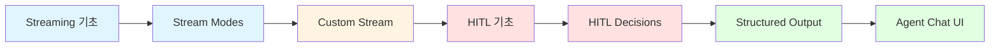
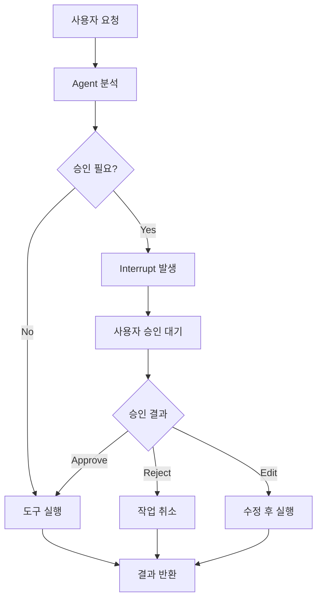
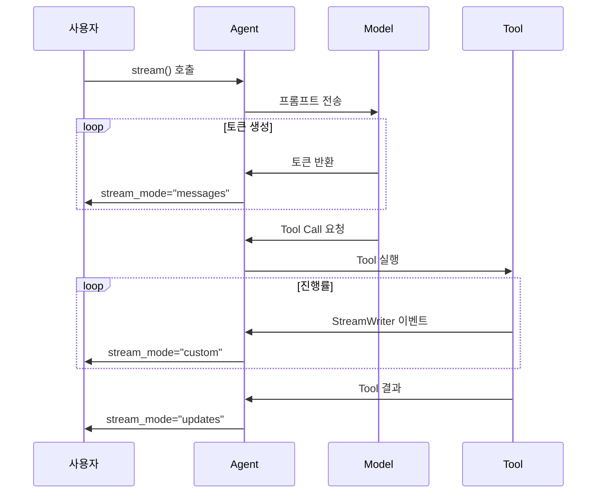
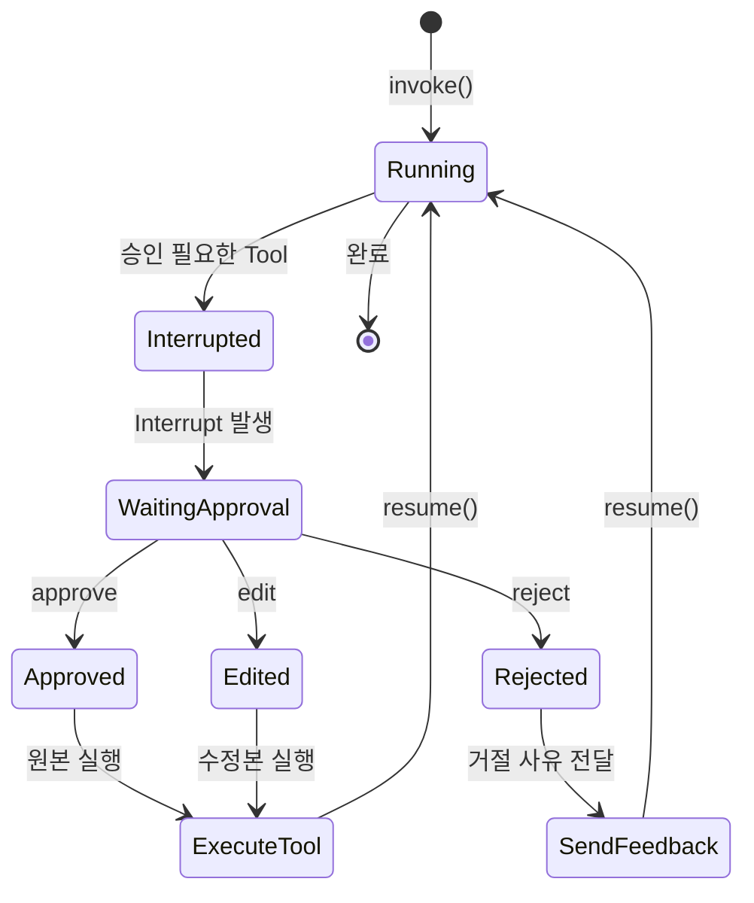
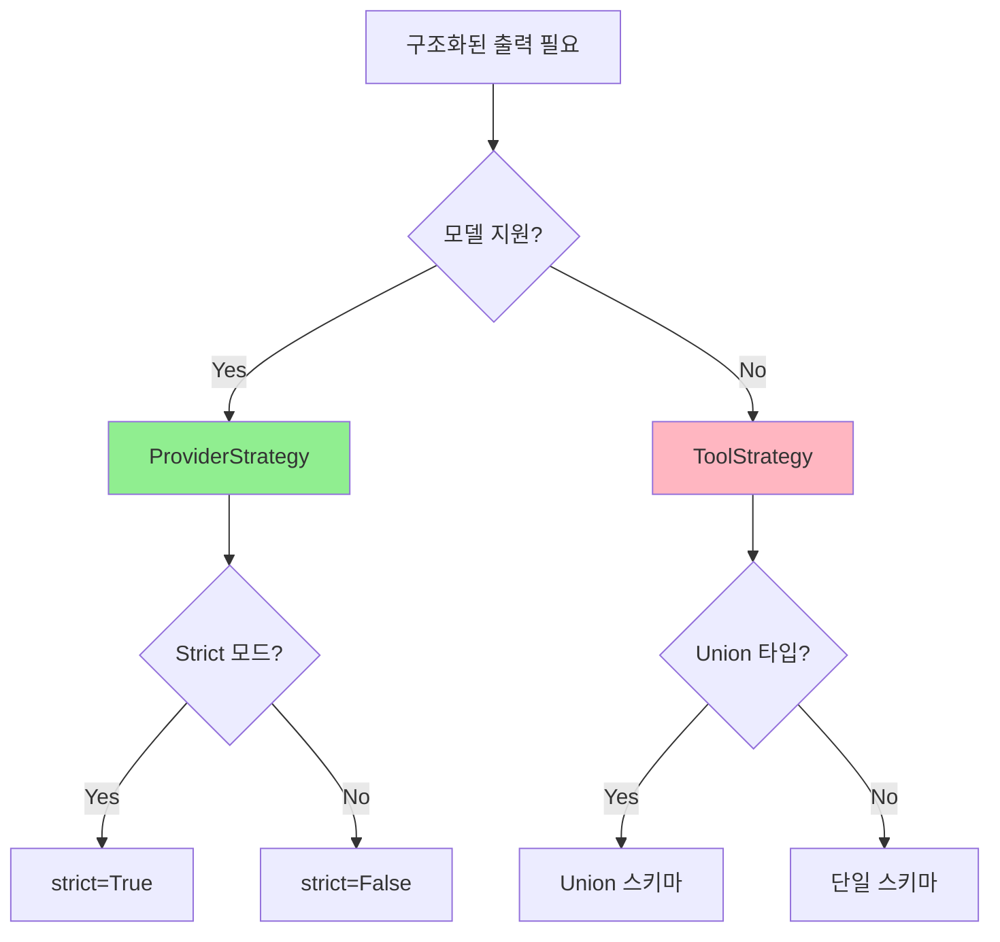

# Part 9: Production (프로덕션)

> 📚 **학습 시간**: 약 3-4시간
> 🎯 **난이도**: ⭐⭐⭐⭐☆ (고급)
> 📖 **공식 문서**: [11-streaming-overview.md](../official/11-streaming-overview_ko.md), [12-streaming-frontend.md](../official/12-streaming-frontend_ko.md), [13-structured-output.md](../official/13-structured-output_ko.md), [21-human-in-the-loop.md](../official/21-human-in-the-loop_ko.md), [32-agent-chat-ui.md](../official/32-agent-chat-ui_ko.md)
> 💻 **예제 코드**: [part09_production 디렉토리](../src/part09_production/)

---

## 📋 학습 목표

이 파트를 완료하면 다음을 할 수 있습니다:

- [ ] stream()과 invoke()의 차이를 이해하고 적절히 사용한다
- [ ] values, updates, messages, custom 스트림 모드를 활용한다
- [ ] StreamWriter로 커스텀 이벤트를 발행한다
- [ ] Human-in-the-Loop 패턴을 구현한다
- [ ] Interrupt와 Resume 메커니즘을 이해한다
- [ ] Pydantic 모델로 타입 안전한 구조화된 출력을 생성한다
- [ ] Agent Chat UI로 프로덕션 인터페이스를 구축한다

---

## 📚 개요

**프로덕션 환경**에서 Agent를 운영하려면 단순히 작동하는 것을 넘어서 **실시간 응답**, **사용자 승인**, **타입 안전성**이 필요합니다. Part 9에서는 이러한 프로덕션 요구사항을 충족하는 세 가지 핵심 기술을 다룹니다.

### 왜 프로덕션 기능이 중요한가?

Agent를 실제 서비스에 배포할 때 직면하는 문제들:

**1. 느린 응답 시간**
```python
# 문제: 사용자가 30초 동안 빈 화면만 본다
response = agent.invoke({"messages": [...]})  # ⏳ 30초 대기
print(response)  # 결과만 출력

# 해결: 실시간 스트리밍으로 즉각적인 피드백
for chunk in agent.stream({"messages": [...]}, stream_mode="messages"):
    token, metadata = chunk
    print(token.content, end="", flush=True)  # ✨ 즉시 출력
```

**2. 위험한 작업의 자동 실행**
```python
# 문제: Agent가 사용자 확인 없이 파일을 삭제
@tool
def delete_file(path: str):
    os.remove(path)  # ⚠️ 위험!

# 해결: Human-in-the-Loop로 사용자 승인 필요
middleware = [
    HumanInTheLoopMiddleware(
        interrupt_on={"delete_file": True}  # 🛡️ 승인 필요
    )
]
```

**3. 예측 불가능한 출력 형식**
```python
# 문제: 파싱 오류 발생
response = agent.invoke(...)  # 출력: "The rating is 5 stars!"
rating = int(response)  # ❌ ValueError!

# 해결: 구조화된 출력으로 타입 안전성 보장
class Rating(BaseModel):
    score: int = Field(ge=1, le=5)

agent = create_agent(response_format=Rating)
result = agent.invoke(...)
print(result["structured_response"].score)  # ✅ 타입 안전
```

### 실전 활용 사례

**스트리밍**
- 챗봇: 사용자에게 즉각적인 피드백 제공
- 긴 작업: 진행률 표시로 사용자 경험 개선
- 멀티플 Agent: 각 Agent의 응답을 실시간으로 표시

**Human-in-the-Loop**
- 이메일 발송: 사용자가 내용을 확인 후 발송
- 데이터 삭제: 중요한 작업은 승인 필요
- 결제 처리: 금액과 수신자 확인 필수

**구조화된 출력**
- 폼 자동 완성: 이름, 이메일, 전화번호 등 필드별 추출
- 데이터 검증: Pydantic으로 자동 검증
- API 통합: 정형화된 JSON으로 시스템 간 연동

### Part 9 학습 로드맵



**학습 순서:**
1. **Streaming 기초** (25분): stream() vs invoke() 비교
2. **Stream Modes** (30분): 4가지 스트림 모드 마스터
3. **Custom Stream** (30분): 커스텀 이벤트와 진행률 표시
4. **HITL 기초** (30분): Interrupt와 Resume 메커니즘
5. **HITL Decisions** (30분): Approve, Edit, Reject 패턴
6. **Structured Output** (30분): Pydantic으로 타입 안전성 확보
7. **Agent Chat UI** (20분): 프로덕션 UI 구축

---

## Section 1: Streaming 기초 (스트리밍 기초)

### 1.1 stream() vs invoke()

**invoke()**: 모든 작업이 완료된 후 최종 결과만 반환
```python
# 전통적인 방식
result = agent.invoke({"messages": [...]})
# ⏳ 30초 대기 후...
print(result["messages"][-1].content)  # 한번에 출력
```

**stream()**: 실행 중 중간 결과를 실시간으로 반환
```python
# 스트리밍 방식
for chunk in agent.stream({"messages": [...]}, stream_mode="messages"):
    token, metadata = chunk
    print(token.content, end="", flush=True)  # ✨ 즉시 출력
```

**비교표:**

| 특성 | invoke() | stream() |
|------|----------|----------|
| **반환 타입** | 최종 결과 (dict) | Generator (중간 결과들) |
| **응답 시간** | 느림 (모든 처리 완료 후) | 빠름 (즉시 시작) |
| **사용자 경험** | 대기 필요 | 실시간 피드백 |
| **메모리 사용** | 높음 (전체 보관) | 낮음 (스트리밍) |
| **사용 사례** | 배치 처리, 스크립트 | 챗봇, 대화형 UI |

### 1.2 Stream Modes 개요

LangChain은 4가지 주요 스트림 모드를 제공합니다:

**1. updates 모드**: Agent의 각 단계 후 State 업데이트
```python
for chunk in agent.stream(input, stream_mode="updates"):
    for node_name, data in chunk.items():
        print(f"노드: {node_name}")
        print(f"데이터: {data}")
```

**2. messages 모드**: LLM 토큰 스트리밍
```python
for token, metadata in agent.stream(input, stream_mode="messages"):
    print(token.content, end="")  # 토큰별 출력
```

**3. custom 모드**: 사용자 정의 이벤트
```python
# Tool에서 커스텀 이벤트 발행
writer = get_stream_writer()
writer("작업 진행 중: 50%")

# 수신
for chunk in agent.stream(input, stream_mode="custom"):
    print(chunk)  # "작업 진행 중: 50%"
```

**4. 복합 모드**: 여러 모드 동시 사용
```python
for mode, chunk in agent.stream(
    input,
    stream_mode=["updates", "messages", "custom"]
):
    if mode == "updates":
        # State 업데이트 처리
    elif mode == "messages":
        # 토큰 출력
    elif mode == "custom":
        # 커스텀 이벤트 처리
```

### 1.3 실시간 응답 구현

**기본 토큰 스트리밍:**
```python
from langchain.agents import create_agent

agent = create_agent(model="gpt-4o-mini", tools=[])

print("AI: ", end="", flush=True)
for token, metadata in agent.stream(
    {"messages": [{"role": "user", "content": "안녕하세요"}]},
    stream_mode="messages"
):
    if token.content:
        print(token.content, end="", flush=True)
print()  # 줄바꿈
```

**진행률 표시:**
```python
from langgraph.config import get_stream_writer

@tool
def long_task(query: str) -> str:
    """시간이 오래 걸리는 작업"""
    writer = get_stream_writer()
    for i in range(1, 11):
        time.sleep(0.5)
        writer({"progress": i * 10, "status": f"{i*10}% 완료"})
    return "작업 완료"

# 진행률 수신
for event in agent.stream(input, stream_mode="custom"):
    if "progress" in event:
        print(f"진행률: {event['progress']}%")
```

### 1.4 스트리밍 Best Practices

**1. 항상 flush=True 사용**
```python
# ❌ 잘못된 예: 버퍼링으로 즉시 출력 안됨
print(token.content, end="")

# ✅ 올바른 예: 즉시 출력
print(token.content, end="", flush=True)
```

**2. 에러 핸들링**
```python
try:
    for chunk in agent.stream(input, stream_mode="messages"):
        print(chunk[0].content, end="", flush=True)
except Exception as e:
    print(f"\n오류 발생: {e}")
```

**3. 타임아웃 설정**
```python
import signal

def timeout_handler(signum, frame):
    raise TimeoutError("스트림 타임아웃")

signal.signal(signal.SIGALRM, timeout_handler)
signal.alarm(30)  # 30초 타임아웃

try:
    for chunk in agent.stream(input, stream_mode="messages"):
        print(chunk[0].content, end="", flush=True)
finally:
    signal.alarm(0)  # 타이머 해제
```

---

## Section 2: Stream Modes 상세 (스트림 모드 상세)

### 2.1 updates 모드

**updates 모드**는 각 노드가 **변경한 부분만** 반환합니다.

**특징:**
- 효율적 (변경된 부분만 전송)
- 노드별 출력 구분 가능
- 병렬 실행 시 유용

**사용 예시:**
```python
for chunk in agent.stream(input, stream_mode="updates"):
    for node_name, update in chunk.items():
        print(f"노드: {node_name}")
        print(f"업데이트: {update}")
```

**출력 예시:**
```
노드: model
업데이트: {'messages': [AIMessage(tool_calls=[...])]}

노드: tools
업데이트: {'messages': [ToolMessage(content='맑음')]}

노드: model
업데이트: {'messages': [AIMessage('날씨는 맑습니다')]}
```

### 2.2 messages 모드

**messages 모드**는 LLM이 생성하는 **토큰을 실시간**으로 스트리밍합니다.

**특징:**
- 토큰별 스트리밍
- 메타데이터 포함 (노드 이름, 실행 ID 등)
- 채팅 UI에 최적화

**기본 사용:**
```python
for token, metadata in agent.stream(input, stream_mode="messages"):
    print(f"노드: {metadata.get('langgraph_node', 'unknown')}")
    print(f"토큰: {token.content}")
```

**Tool Call 스트리밍:**
```python
for token, metadata in agent.stream(input, stream_mode="messages"):
    if token.content:
        # 일반 텍스트
        print(token.content, end="", flush=True)
    elif token.tool_call_chunks:
        # Tool Call 청크
        for chunk in token.tool_call_chunks:
            print(f"\n도구 호출: {chunk}")
```

### 2.3 custom 모드

**custom 모드**는 사용자가 정의한 **커스텀 이벤트**를 스트리밍합니다.

**StreamWriter 사용:**
```python
from langgraph.config import get_stream_writer

@tool
def process_data(query: str) -> str:
    """데이터 처리 도구"""
    writer = get_stream_writer()

    # 시작 이벤트
    writer({"event": "start", "query": query})

    # 진행 이벤트
    for i in range(5):
        time.sleep(1)
        writer({
            "event": "progress",
            "step": i + 1,
            "total": 5,
            "message": f"단계 {i+1}/5 처리 중"
        })

    # 완료 이벤트
    writer({"event": "complete", "result": "완료"})

    return "처리 완료"
```

**이벤트 수신:**
```python
for event in agent.stream(input, stream_mode="custom"):
    if event.get("event") == "start":
        print(f"작업 시작: {event['query']}")
    elif event.get("event") == "progress":
        print(f"진행률: {event['step']}/{event['total']} - {event['message']}")
    elif event.get("event") == "complete":
        print(f"작업 완료: {event['result']}")
```

### 2.4 복합 모드 (Multiple Stream Modes)

여러 스트림 모드를 동시에 사용할 수 있습니다.

**기본 사용:**
```python
for mode, chunk in agent.stream(
    input,
    stream_mode=["updates", "messages", "custom"]
):
    if mode == "updates":
        print(f"State 업데이트: {chunk}")
    elif mode == "messages":
        token, metadata = chunk
        print(f"토큰: {token.content}")
    elif mode == "custom":
        print(f"커스텀 이벤트: {chunk}")
```

---

## Section 3: Custom Streaming (커스텀 스트리밍)

### 3.1 StreamWriter 사용법

**get_stream_writer()**: Tool이나 노드 내에서 커스텀 이벤트를 발행하는 함수를 가져옵니다.

**기본 구조:**
```python
from langgraph.config import get_stream_writer

@tool
def my_tool(query: str) -> str:
    """커스텀 이벤트를 발행하는 도구"""
    writer = get_stream_writer()

    # 이벤트 발행
    writer("간단한 메시지")
    writer({"key": "value", "data": 123})

    return "작업 완료"
```

**주의사항:**
- StreamWriter는 LangGraph 실행 컨텍스트 내에서만 작동
- Tool을 단독으로 호출하면 Writer가 없어서 에러 발생
- 테스트 시 Agent 내에서 실행 필요

### 3.2 Custom Events 패턴

**1. 상태 업데이트 패턴**
```python
@tool
def fetch_data(url: str) -> str:
    """데이터 가져오기"""
    writer = get_stream_writer()

    writer({"status": "connecting", "url": url})
    response = requests.get(url)

    writer({"status": "downloading", "size": len(response.content)})
    data = response.json()

    writer({"status": "complete", "records": len(data)})

    return f"{len(data)}개 레코드 가져옴"
```

**2. 진행률 추적 패턴**
```python
@tool
def batch_process(items: list[str]) -> str:
    """배치 처리"""
    writer = get_stream_writer()
    total = len(items)

    for i, item in enumerate(items):
        process_item(item)
        progress = int((i + 1) / total * 100)
        writer({
            "progress": progress,
            "current": i + 1,
            "total": total
        })

    return f"{total}개 항목 처리 완료"
```

### 3.3 타이핑 효과 (Typing Effect)

**기본 타이핑 효과:**
```python
import time

for token, _ in agent.stream(input, stream_mode="messages"):
    if token.content:
        for char in token.content:
            print(char, end="", flush=True)
            time.sleep(0.03)  # 30ms 딜레이
```

---

## Section 4: HITL 기초 (Human-in-the-Loop 기초)

### 4.1 Human-in-the-Loop 개념

**HITL (Human-in-the-Loop)**은 Agent가 중요한 작업을 실행하기 전에 **사람의 승인을 받는** 패턴입니다.

**왜 필요한가?**

1. **안전성**: 위험한 작업 방지 (파일 삭제, 결제 등)
2. **정확성**: 중요한 결정에 사람의 판단 추가
3. **신뢰성**: 사용자가 Agent 행동을 제어 가능

**작동 원리:**



### 4.2 Interrupt 설정

**HumanInTheLoopMiddleware** 사용:

```python
from langchain.agents.middleware import HumanInTheLoopMiddleware
from langgraph.checkpoint.memory import InMemorySaver

# 승인이 필요한 도구 설정
middleware = [
    HumanInTheLoopMiddleware(
        interrupt_on={
            "delete_file": True,      # 모든 결정 허용
            "send_email": True,       # 모든 결정 허용
            "get_weather": False,     # 자동 승인
        }
    )
]

# Checkpointer 필수!
agent = create_agent(
    model="gpt-4o-mini",
    tools=[delete_file, send_email, get_weather],
    middleware=middleware,
    checkpointer=InMemorySaver()  # ⚠️ 필수
)
```

### 4.3 Interrupt와 Resume

**Interrupt 발생:**

```python
config = {"configurable": {"thread_id": "session-123"}}

result = agent.invoke(
    {"messages": [{"role": "user", "content": "파일을 삭제해줘"}]},
    config=config
)

# Interrupt 확인
if "__interrupt__" in result:
    interrupts = result["__interrupt__"]
    for interrupt in interrupts:
        print(interrupt.value)
```

**Resume with Decision:**

```python
from langgraph.types import Command

# 승인
agent.invoke(
    Command(resume={"decisions": [{"type": "approve"}]}),
    config=config  # 같은 thread_id 사용
)

# 거절
agent.invoke(
    Command(resume={"decisions": [{"type": "reject", "message": "위험한 파일입니다"}]}),
    config=config
)

# 수정
agent.invoke(
    Command(resume={"decisions": [{
        "type": "edit",
        "edited_action": {
            "name": "delete_file",
            "args": {"path": "/safe/file.txt"}  # 경로 변경
        }
    }]}),
    config=config
)
```

---

## Section 5: HITL Decisions (HITL 결정 패턴)

### 5.1 Approve Pattern (승인 패턴)

**자동 승인:**

```python
# 단순 승인
decisions = {"decisions": [{"type": "approve"}]}
agent.invoke(Command(resume=decisions), config=config)
```

**조건부 승인:**

```python
def auto_approve(interrupt):
    """특정 조건에서만 자동 승인"""
    requests = interrupt.value["action_requests"]

    decisions = []
    for request in requests:
        if request["name"] == "send_email":
            to_address = request["arguments"]["to"]
            if to_address.endswith("@safe-domain.com"):
                decisions.append({"type": "approve"})
            else:
                decisions.append({
                    "type": "reject",
                    "message": "안전하지 않은 도메인입니다"
                })
        else:
            decisions.append({"type": "approve"})

    return {"decisions": decisions}
```

### 5.2 Edit Pattern (수정 패턴)

**인자 수정:**

```python
def edit_email(interrupt):
    """이메일 내용 수정"""
    requests = interrupt.value["action_requests"]

    decisions = []
    for request in requests:
        if request["name"] == "send_email":
            new_subject = input("새 제목: ") or request['arguments']['subject']
            new_body = input("새 내용: ") or request['arguments']['body']

            decisions.append({
                "type": "edit",
                "edited_action": {
                    "name": "send_email",
                    "args": {
                        "to": request['arguments']['to'],
                        "subject": new_subject,
                        "body": new_body
                    }
                }
            })

    return {"decisions": decisions}
```

### 5.3 Reject Pattern (거절 패턴)

**조건부 거절:**

```python
def reject_dangerous(interrupt):
    """위험한 작업 거절"""
    requests = interrupt.value["action_requests"]
    dangerous_paths = ["/system", "/etc", "/bin"]

    decisions = []
    for request in requests:
        if request["name"] == "delete_file":
            path = request['arguments']['path']
            is_dangerous = any(path.startswith(dp) for dp in dangerous_paths)

            if is_dangerous:
                decisions.append({
                    "type": "reject",
                    "message": f"시스템 파일은 삭제할 수 없습니다: {path}"
                })
            else:
                decisions.append({"type": "approve"})

    return {"decisions": decisions}
```

---

## Section 6: Structured Output (구조화된 출력)

### 6.1 Pydantic Models

**Pydantic**은 Python의 타입 안전 데이터 검증 라이브러리입니다.

**기본 모델:**

```python
from pydantic import BaseModel, Field

class ContactInfo(BaseModel):
    """연락처 정보"""
    name: str = Field(description="이름")
    email: str = Field(description="이메일 주소")
    phone: str = Field(description="전화번호")

# 사용
agent = create_agent(
    model="gpt-4o-mini",
    response_format=ContactInfo
)

result = agent.invoke({
    "messages": [{"role": "user", "content": "홍길동, hong@example.com, 010-1234-5678"}]
})

contact = result["structured_response"]
print(contact.name)   # "홍길동"
```

**검증 규칙:**

```python
class Product(BaseModel):
    """제품 정보"""
    name: str = Field(description="제품명", min_length=1, max_length=100)
    price: float = Field(description="가격", ge=0)  # 0 이상
    rating: int = Field(description="평점", ge=1, le=5)  # 1~5
```

### 6.2 ProviderStrategy

**ProviderStrategy**는 모델 제공자의 **네이티브 구조화 출력**을 사용합니다.

```python
from langchain.agents.structured_output import ProviderStrategy

class Review(BaseModel):
    rating: int = Field(ge=1, le=5)
    comment: str

agent = create_agent(
    model="gpt-4o-mini",
    response_format=ProviderStrategy(schema=Review, strict=True)
)
```

### 6.3 ToolStrategy

**ToolStrategy**는 Tool Calling을 이용한 구조화된 출력 방식입니다.

```python
from langchain.agents.structured_output import ToolStrategy

class Article(BaseModel):
    title: str
    summary: str
    tags: list[str]

agent = create_agent(
    model="gpt-4o-mini",
    response_format=ToolStrategy(
        schema=Article,
        handle_errors=True
    )
)
```

---

## Section 7: Agent Chat UI (에이전트 채팅 UI)

### 7.1 Agent Chat UI 개요

**Agent Chat UI**는 LangChain Agent와 상호작용할 수 있는 **Next.js 기반 대화형 인터페이스**입니다.

> 📖 **공식 문서**: [32-agent-chat-ui.md](../official/32-agent-chat-ui_ko.md)

**주요 기능:**

1. **실시간 채팅**: `create_agent`로 생성한 Agent와 즉시 대화
2. **도구 시각화**: Tool Call을 자동으로 감지하고 렌더링
3. **Time-travel 디버깅**: 대화 히스토리에서 원하는 시점으로 이동
4. **State Forking**: 대화의 특정 지점에서 분기 생성
5. **Interrupt 처리**: Human-in-the-Loop 자동 지원

**왜 사용하는가?**

프로덕션 환경에서 Agent를 테스트하고 시연할 때:
- 백엔드 개발자가 프론트엔드 구현 없이 Agent를 시각화
- PM/디자이너에게 Agent 동작을 시연
- QA 팀이 다양한 시나리오 테스트
- 사용자 피드백을 빠르게 수집

### 7.2 빠른 시작

**호스팅 버전 사용** (가장 빠름):

1. https://agentchat.vercel.app 방문
2. Agent 서버 URL 입력 (예: `http://localhost:2024`)
3. Graph ID 입력 (`langgraph.json`의 `graphs` 참조)
4. 채팅 시작!

**로컬 개발 환경 설정**:

```bash
# npx로 새 프로젝트 생성
npx create-agent-chat-app --project-name my-chat-ui
cd my-chat-ui

# 의존성 설치
pnpm install

# 개발 서버 시작
pnpm dev
```

**또는 저장소 클론**:

```bash
git clone https://github.com/langchain-ai/agent-chat-ui.git
cd agent-chat-ui
pnpm install
pnpm dev
```

### 7.3 Agent 연결

Agent Chat UI는 **로컬** 및 **배포된** Agent 모두 연결할 수 있습니다.

**설정 항목:**

1. **Graph ID**: Agent 이름 (`langgraph.json`의 `graphs`에서 확인)
2. **Deployment URL**:
   - 로컬: `http://localhost:2024`
   - 배포: LangSmith 배포 URL
3. **LangSmith API Key** (선택): 배포된 Agent 사용 시 필요

**Agent 준비**:

```python
# agent.py
from langchain.agents import create_agent, tool
from langchain_openai import ChatOpenAI

@tool
def get_weather(city: str) -> str:
    """주어진 도시의 날씨를 조회합니다."""
    return f"{city}의 날씨는 맑고 22도입니다."

agent = create_agent(
    model=ChatOpenAI(model="gpt-4o-mini"),
    tools=[get_weather],
    system_prompt="당신은 친절한 날씨 도우미입니다."
)
```

**로컬 서버 실행**:

```bash
# LangGraph CLI로 서버 실행
langgraph dev
# 기본 포트: http://localhost:2024
```

**Agent Chat UI에서 연결**:
- Graph ID: `agent`
- Deployment URL: `http://localhost:2024`
- LangSmith API Key: (로컬 서버는 불필요)

### 7.4 Tool Call 시각화

Agent Chat UI는 Tool Call을 자동으로 감지하고 렌더링합니다.

**자동 렌더링:**
- Tool 이름과 인자 표시
- 실행 중 로딩 인디케이터
- 결과 자동 표시
- 에러 처리 및 표시

**커스텀 렌더링**:

메시지 표시를 커스터마이징하려면 공식 문서의 [Hiding Messages in the Chat](https://github.com/langchain-ai/agent-chat-ui#hiding-messages-in-the-chat) 섹션을 참조하세요.

### 7.5 실전 활용

**시나리오 1: 빠른 프로토타입 시연**

```python
# 1. Agent 개발
agent = create_agent(
    model="gpt-4o-mini",
    tools=[search_web, analyze_data, send_email],
    system_prompt="데이터 분석 도우미"
)

# 2. 로컬 서버 실행
# $ langgraph dev

# 3. Agent Chat UI로 시연
# https://agentchat.vercel.app 에서 localhost:2024 연결
```

**시나리오 2: HITL 테스트**

```python
# Human-in-the-Loop Agent
middleware = [
    HumanInTheLoopMiddleware(
        interrupt_on={"delete_file": True, "send_email": True}
    )
]

agent = create_agent(
    model="gpt-4o-mini",
    tools=[delete_file, send_email],
    middleware=middleware,
    checkpointer=InMemorySaver()
)

# Agent Chat UI에서 Interrupt 자동 처리
# 승인/거절 UI가 자동으로 표시됨
```

**시나리오 3: 프로덕션 배포**

```bash
# 1. LangSmith에 배포
langgraph deploy

# 2. 배포 URL 획득
# 예: https://my-agent.us.langgraph.app

# 3. Agent Chat UI 설정
# Deployment URL: https://my-agent.us.langgraph.app
# LangSmith API Key: 필요
```

### 7.6 고급 기능

**Time-travel 디버깅:**
- 대화의 특정 시점으로 되돌아가기
- 다른 응답 생성 및 비교
- 분기별 대화 히스토리 관리

**Generative UI:**
- Agent가 동적으로 UI 컴포넌트 생성
- 자세한 내용은 [Implement generative user interfaces](https://docs.langchain.com/oss/python/langgraph/overview) 참조

---

---

---

## 실전 팁

### 팁 1: 스트리밍 성능 최적화

```python
# ✅ 효율적
for token, _ in agent.stream(input, stream_mode="messages"):
    print(token.content, end="", flush=True)  # 즉시 출력
```

### 팁 2: Interrupt 타임아웃 설정

```python
import time

TIMEOUT = 300  # 5분
start_time = time.time()

while "__interrupt__" in result:
    if time.time() - start_time > TIMEOUT:
        agent.invoke(
            Command(resume={"decisions": [{"type": "reject", "message": "타임아웃"}]}),
            config=config
        )
        break
```

### 팁 3: Pydantic 모델 재사용

```python
class BaseContact(BaseModel):
    """공통 연락처 필드"""
    name: str
    email: str

class PersonalContact(BaseContact):
    phone: str

class BusinessContact(BaseContact):
    company: str
```

### 팁 4: 커스텀 이벤트 필터링

```python
def filter_events(agent_stream, event_type: str):
    """특정 타입의 이벤트만 필터링"""
    for event in agent_stream:
        if isinstance(event, dict) and event.get("type") == event_type:
            yield event
```

### 팁 5: Structured Output 디버깅

```python
from pydantic import ValidationError

try:
    result = agent.invoke(input)
    output = result["structured_response"]
except ValidationError as e:
    for error in e.errors():
        print(f"필드: {error['loc']}, 메시지: {error['msg']}")
```

---

## ❓ 자주 묻는 질문

<details>
<summary><strong>Q1: stream()을 사용하면 항상 빠른가요?</strong></summary>

아닙니다. 스트리밍은 **첫 토큰 응답 시간**을 단축하지만 **전체 처리 시간**은 동일하거나 약간 느릴 수 있습니다.

</details>

<details>
<summary><strong>Q2: Checkpointer 없이 HITL 사용할 수 있나요?</strong></summary>

불가능합니다. Interrupt는 State를 저장하고 복원해야 하므로 Checkpointer가 필수입니다.

</details>

<details>
<summary><strong>Q3: ProviderStrategy vs ToolStrategy 언제 써야 하나요?</strong></summary>

자동 선택이 최선입니다. 직접 지정하면:
- **ProviderStrategy**: 신뢰성이 중요하고 지원 모델 사용 시
- **ToolStrategy**: Union 타입이나 복잡한 에러 핸들링 필요 시

</details>

<details>
<summary><strong>Q4: 여러 도구를 동시에 Interrupt할 수 있나요?</strong></summary>

가능합니다. 각 도구에 대한 결정을 순서대로 제공하면 됩니다.

</details>

<details>
<summary><strong>Q5: Pydantic 모델을 JSON으로 변환하려면?</strong></summary>

`.model_dump()` 메서드를 사용합니다.

```python
user_dict = user.model_dump()
user_json = user.model_dump_json()
```

</details>

---

## 다이어그램

### 스트리밍 처리 흐름



### HITL 승인 프로세스



### Structured Output 전략 선택



---

## 🎓 실습 과제

### 과제 1: 진행 상황 표시 Agent (Custom Streaming)

**난이도**: ★★★☆☆

`stream()` API를 사용하여 Agent 실행 과정을 실시간 스트리밍하고 각 단계별 진행 상황을 표시하는 Agent를 구현하세요.

**요구사항**:
- Agent 실행 과정을 실시간 스트리밍
- 각 단계별 진행 상황 표시
- 사용자 경험 개선 (토큰/청크 단위 스트리밍)

> **힌트**: [`src/part09_production/01_streaming_basics.py`](../src/part09_production/01_streaming_basics.py)를 참고하세요.

> **해답**: [solutions/exercise_01.py](../src/part09_production/solutions/exercise_01.py)

### 과제 2: 승인 기반 작업 Agent (HITL)

**난이도**: ★★★★☆

위험한 작업(데이터 삭제, 대량 이메일 발송, 설정 변경 등)에 대해 사람의 승인을 받는 Human-in-the-Loop 워크플로우를 구현하세요.

**요구사항**:
- 중요한 작업은 사용자 승인 필요
- Interrupt를 통한 작업 중단
- 승인 후 재개 기능 (상태 저장 및 재개)

> **힌트**: [`src/part09_production/04_hitl_basic.py`](../src/part09_production/04_hitl_basic.py)를 참고하세요.

> **해답**: [solutions/exercise_02.py](../src/part09_production/solutions/exercise_02.py)

### 과제 3: API 통합 Agent (Structured Output)

**난이도**: ★★★☆☆

Pydantic 모델을 활용하여 LLM 출력을 타입 안전하게 파싱하고, API 스펙을 준수하는 구조화된 응답을 생성하는 시스템을 구현하세요.

**요구사항**:
- `with_structured_output()` 메서드 활용
- 구조화된 응답 생성 (JSON, Pydantic)
- 타입 안전성 확보 및 유효성 검증

> **힌트**: [`src/part09_production/06_structured_output.py`](../src/part09_production/06_structured_output.py)를 참고하세요.

> **해답**: [solutions/exercise_03.py](../src/part09_production/solutions/exercise_03.py)

---

## 🔗 심화 학습

### 공식 문서
- [LangGraph Streaming 가이드](https://docs.langchain.com/oss/python/langchain/streaming/overview)
- [Human-in-the-Loop 패턴](https://docs.langchain.com/oss/python/langchain/human-in-the-loop)
- [Structured Output 가이드](https://docs.langchain.com/oss/python/langchain/structured-output)

### 고급 주제
- **스트리밍 최적화**: 대용량 응답 처리, 백프레셔 관리
- **HITL 고급 패턴**: 다중 승인자, 에스컬레이션, 타임아웃
- **출력 검증**: 커스텀 Validator, Retry 전략

### 커뮤니티 리소스
- [LangGraph Discussions](https://github.com/langchain-ai/langgraph/discussions)
- [LangChain Blog - Production Patterns](https://blog.langchain.com/)

---

## ✅ 체크리스트

이 파트를 완료했다면 다음을 할 수 있어야 합니다:

### Streaming
- [ ] `stream()` API로 실시간 토큰 스트리밍을 구현할 수 있다
- [ ] 다양한 `stream_mode`의 차이를 설명할 수 있다
- [ ] `StreamWriter`로 커스텀 이벤트를 전송할 수 있다

### Human-in-the-Loop
- [ ] `interrupt()` 함수로 실행을 일시 중지할 수 있다
- [ ] approve/edit/reject 패턴을 구현할 수 있다
- [ ] `Command(resume=...)`으로 실행을 재개할 수 있다

### Structured Output
- [ ] `with_structured_output()`으로 타입 안전한 출력을 구현할 수 있다
- [ ] Union 타입으로 다중 출력 형식을 처리할 수 있다
- [ ] ProviderStrategy와 ToolStrategy 차이를 이해한다

---

## 다음 단계

Part 9 완료! ➡ [Part 10: Deployment로 이동](./part10_deployment.md)

**추천 프로젝트**: Customer Service Agent에 스트리밍과 HITL 적용
- `projects/04_customer_service/` 참고

**학습 진도**: ▓▓▓▓▓▓▓▓▓░ 90% (Part 9/10 완료)

---

*마지막 업데이트: 2026-02-18*
