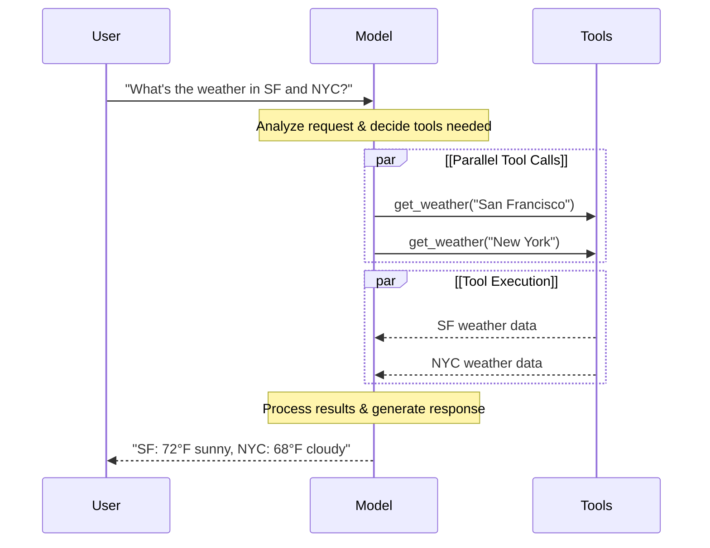

# 모델

LLM은 인간처럼 텍스트를 해석하고 생성할 수 있는 강력한 AI 도구입니다. 각 작업에 특화된 학습 없이도 콘텐츠 작성, 언어 번역, 요약 및 질문 답변 등 다양한 작업을 수행할 수 있습니다.

텍스트 생성 외에도 많은 모델은 다음을 지원합니다:
- [Tool 호출](https://docs.langchain.com/oss/python/langchain/models#tool-calling) - 외부 도구(데이터베이스 쿼리 또는 API 호출 등)를 호출하고 결과를 응답에 사용합니다.
- [구조화된 출력](https://docs.langchain.com/oss/python/langchain/models#structured-output) - 모델의 응답이 정의된 형식을 따르도록 제한됩니다.
- [멀티모달](https://docs.langchain.com/oss/python/langchain/models#multimodal) - 텍스트, 이미지, 오디오 및 비디오와 같은 텍스트 이외의 데이터를 처리하고 반환합니다.
- [추론](https://docs.langchain.com/oss/python/langchain/models#reasoning) - 모델이 다단계 추론을 수행하여 결론에 도달합니다.

모델은 Agent의 추론 엔진입니다. 모델은 Agent의 의사 결정 프로세스를 주도하며, 어떤 Tool을 호출할지, 결과를 어떻게 해석할지, 언제 최종 답변을 제공할지를 결정합니다.

선택한 모델의 품질과 기능은 Agent의 기본 신뢰성과 성능에 직접적으로 영향을 미칩니다. 서로 다른 모델은 다양한 작업에서 탁월합니다. 일부는 복잡한 지침 따르기에 더 나으며, 다른 일부는 구조화된 추론에 탁월하고, 더 많은 정보를 처리하기 위해 더 큰 컨텍스트 윈도우를 지원하기도 합니다.

LangChain의 표준 모델 인터페이스는 많은 다양한 제공자 통합에 접근하게 하므로, 사용 사례에 가장 적합한 모델을 찾기 위해 모델 간에 쉽게 실험하고 전환할 수 있습니다.

제공자별 통합 정보 및 기능에 대해서는 [제공자의 Chat 모델 페이지](https://docs.langchain.com/oss/python/integrations/chat)를 참조하세요.

## 기본 사용법

모델은 두 가지 방식으로 활용할 수 있습니다:

1. [Agent](https://docs.langchain.com/oss/python/langchain/agents#model)와 함께 - Agent 생성 시 모델을 동적으로 지정할 수 있습니다.
2. 독립 실행형 - 모델을 직접 호출할 수 있습니다(Agent 루프 외부에서). 텍스트 생성, 분류 또는 추출 같은 작업을 Agent 프레임워크 필요 없이 수행할 수 있습니다.

동일한 모델 인터페이스가 두 컨텍스트에서 작동하므로, 필요에 따라 간단하게 시작하여 더 복잡한 Agent 기반 워크플로우로 확장할 수 있는 유연성을 제공합니다.

### 모델 초기화

LangChain에서 독립 실행형 모델을 시작하는 가장 쉬운 방법은 선택한 Chat 모델 제공자에서 모델을 초기화하기 위해 `init_chat_model`을 사용하는 것입니다(아래 예시):

#### OpenAI

👉 [OpenAI Chat 모델 통합 문서 읽기](https://docs.langchain.com/oss/python/integrations/chat/openai)

```bash
pip install -U "langchain[openai]"
```

**init_chat_model**

```python
import os
from langchain.chat_models import init_chat_model

os.environ["OPENAI_API_KEY"] = "sk-..."

model = init_chat_model("gpt-4.1")
```

**모델 클래스**

```python
import os
from langchain_openai import ChatOpenAI

os.environ["OPENAI_API_KEY"] = "sk-..."

model = ChatOpenAI(model="gpt-4.1")
```

#### Anthropic

👉 [Anthropic Chat 모델 통합 문서 읽기](https://docs.langchain.com/oss/python/integrations/chat/anthropic)

```bash
pip install -U "langchain[anthropic]"
```

**init_chat_model**

```python
import os
from langchain.chat_models import init_chat_model

os.environ["ANTHROPIC_API_KEY"] = "sk-..."

model = init_chat_model("claude-sonnet-4-5-20250929")
```

**모델 클래스**

```python
import os
from langchain_anthropic import ChatAnthropic

os.environ["ANTHROPIC_API_KEY"] = "sk-..."

model = ChatAnthropic(model = "claude-sonnet-4-5-20250929")
```

#### Azure

👉 [Azure Chat 모델 통합 문서 읽기](https://docs.langchain.com/oss/python/integrations/chat/azure_chat_openai)

```bash
pip install -U "langchain[openai]"
```

**init_chat_model**

```python
import os
from langchain.chat_models import init_chat_model

os.environ["AZURE_OPENAI_API_KEY"] = "..."
os.environ["AZURE_OPENAI_ENDPOINT"] = "..."
os.environ["OPENAI_API_VERSION"] = "2025-03-01-preview"

model = init_chat_model(
    "azure_openai:gpt-4.1",
    azure_deployment=os.environ["AZURE_OPENAI_DEPLOYMENT_NAME"],
)
```

**모델 클래스**

```python
import os
from langchain_openai import AzureChatOpenAI

os.environ["AZURE_OPENAI_API_KEY"] = "..."
os.environ["AZURE_OPENAI_ENDPOINT"] = "..."
os.environ["OPENAI_API_VERSION"] = "2025-03-01-preview"

model = AzureChatOpenAI(
    model="gpt-4.1",
    azure_deployment=os.environ["AZURE_OPENAI_DEPLOYMENT_NAME"]
)
```

#### Google Gemini

👉 [Google GenAI Chat 모델 통합 문서 읽기](https://docs.langchain.com/oss/python/integrations/chat/google_generative_ai)

```bash
pip install -U "langchain[google-genai]"
```

**init_chat_model**

```python
import os
from langchain.chat_models import init_chat_model

os.environ["GOOGLE_API_KEY"] = "..."

model = init_chat_model("google_genai:gemini-2.5-flash-lite")
```

**모델 클래스**

```python
import os
from langchain_google_genai import ChatGoogleGenerativeAI

os.environ["GOOGLE_API_KEY"] = "..."

model = ChatGoogleGenerativeAI(model="gemini-2.5-flash-lite")
```

#### AWS Bedrock

👉 [AWS Bedrock Chat 모델 통합 문서 읽기](https://docs.langchain.com/oss/python/integrations/chat/bedrock)

```bash
pip install -U "langchain[aws]"
```

**init_chat_model**

```python
from langchain.chat_models import init_chat_model

# 이곳의 단계에 따라 자격 증명을 구성하세요:
# https://docs.aws.amazon.com/bedrock/latest/userguide/getting-started.html

model = init_chat_model(
    "anthropic.claude-3-5-sonnet-20240620-v1:0",
    model_provider="bedrock_converse",
)
```

**모델 클래스**

```python
from langchain_aws import ChatBedrock

model = ChatBedrock(
    model="anthropic.claude-3-5-sonnet-20240620-v1:0"
)
```

#### HuggingFace

👉 [HuggingFace Chat 모델 통합 문서 읽기](https://docs.langchain.com/oss/python/integrations/chat/huggingface)

```bash
pip install -U "langchain[huggingface]"
```

**init_chat_model**

```python
import os
from langchain.chat_models import init_chat_model

os.environ["HUGGINGFACEHUB_API_TOKEN"] = "hf_..."

model = init_chat_model(
    "microsoft/Phi-3-mini-4k-instruct",
    model_provider="huggingface",
    temperature=0.7,
    max_tokens=1024,
)
```

**모델 클래스**

```python
import os
from langchain_huggingface import ChatHuggingFace, HuggingFaceEndpoint

os.environ["HUGGINGFACEHUB_API_TOKEN"] = "hf_..."

llm = HuggingFaceEndpoint(
    repo_id="microsoft/Phi-3-mini-4k-instruct",
    temperature=0.7,
    max_length=1024,
)
model = ChatHuggingFace(llm=llm)
```

```python
response = model.invoke("Why do parrots talk?")
```

자세한 내용은 `init_chat_model`을 참조하세요. 모델 매개변수를 전달하는 방법에 대한 정보도 포함되어 있습니다.

### 지원되는 모델

LangChain은 OpenAI, Anthropic, Google, Azure, AWS Bedrock 등을 포함한 모든 주요 모델 제공자를 지원합니다. 각 제공자는 다양한 기능을 가진 다양한 모델을 제공합니다. LangChain에서 지원되는 모델의 전체 목록은 [통합 페이지](https://docs.langchain.com/oss/python/integrations/providers/overview)를 참조하세요.

### 주요 메서드

<table style="width: 100%; border-spacing: 0 10px; border-collapse: separate;">
  <tr>
    <td style="border: 1px solid #e0e0e0; border-radius: 10px; padding: 15px;">
        <a href="https://docs.langchain.com/oss/python/langchain/models#invoke" style="text-decoration: none; color: inherit; display: block;">
            <div style="font-weight: bold; font-size: 1.1em; margin-bottom: 5px;">Invoke</div>
            <div style="color: #555;">모델은 메시지를 입력받아 완전한 응답을 생성한 후 메시지를 출력합니다.</div>
        </a>
    </td>
  </tr>
  <tr>
    <td style="border: 1px solid #e0e0e0; border-radius: 10px; padding: 15px;">
        <a href="https://docs.langchain.com/oss/python/langchain/models#stream" style="text-decoration: none; color: inherit; display: block;">
            <div style="font-weight: bold; font-size: 1.1em; margin-bottom: 5px;">Stream</div>
            <div style="color: #555;">모델을 호출하되, 생성되는 동안 실시간으로 출력을 스트리밍합니다.</div>
        </a>
    </td>
  </tr>
  <tr>
    <td style="border: 1px solid #e0e0e0; border-radius: 10px; padding: 15px;">
        <a href="https://docs.langchain.com/oss/python/langchain/models#batch" style="text-decoration: none; color: inherit; display: block;">
            <div style="font-weight: bold; font-size: 1.1em; margin-bottom: 5px;">Batch</div>
            <div style="color: #555;">여러 요청을 모델로 일괄 처리하여 더 효율적인 처리를 합니다.</div>
        </a>
    </td>
  </tr>
</table>

> Chat 모델 외에도 LangChain은 임베딩 모델 및 벡터 저장소와 같은 인접한 기타 기술을 지원합니다. 자세한 내용은 [통합 페이지](https://docs.langchain.com/oss/python/integrations/providers/overview)를 참조하세요.

## 매개변수

Chat 모델은 동작을 구성하는 데 사용할 수 있는 매개변수를 사용합니다. 지원되는 매개변수의 전체 집합은 모델과 제공자에 따라 다르지만, 표준 매개변수는 다음과 같습니다:

<div style="margin-bottom: 20px;">
  <div style="display: flex; align-items: center; gap: 10px; margin-bottom: 10px;">
    <code style="color: #00766c; font-weight: bold; font-size: 1.1em;">model</code>
    <span style="background-color: #fca5a533; color: #b91c1c; padding: 2px 8px; border-radius: 4px; font-size: 0.9em; font-family: monospace;">필수</span>
    <span style="background-color: #f3f4f6; color: #1f2937; padding: 2px 8px; border-radius: 4px; font-size: 0.9em; font-family: monospace;">문자열</span>
  </div>
  <p style="margin-top: 0; color: #374151;">제공자와 함께 사용하려는 특정 모델의 이름 또는 식별자입니다. ':' 형식을 사용하여 모델과 제공자를 하나의 인수로 지정할 수도 있습니다. 예를 들어, 'openai:o1'입니다.</p>
</div>

<div style="margin-bottom: 20px;">
  <div style="display: flex; align-items: center; gap: 10px; margin-bottom: 10px;">
    <code style="color: #00766c; font-weight: bold; font-size: 1.1em;">api_key</code>
    <span style="background-color: #f3f4f6; color: #1f2937; padding: 2px 8px; border-radius: 4px; font-size: 0.9em; font-family: monospace;">문자열</span>
  </div>
  <p style="margin-top: 0; color: #374151;">모델의 제공자로 인증하기 위해 필요한 키입니다. 이는 일반적으로 모델에 대한 접근이 승인되었을 때 발급됩니다. 흔히 <a href="https://docs.langchain.com/oss/python/langchain/models/messages#environment-variables">환경 변수</a>를 설정하여 접근됩니다.</p>
</div>

<div style="margin-bottom: 20px;">
  <div style="display: flex; align-items: center; gap: 10px; margin-bottom: 10px;">
    <code style="color: #00766c; font-weight: bold; font-size: 1.1em;">temperature</code>
    <span style="background-color: #f3f4f6; color: #1f2937; padding: 2px 8px; border-radius: 4px; font-size: 0.9em; font-family: monospace;">숫자</span>
  </div>
  <p style="margin-top: 0; color: #374151;">모델 출력의 임의성을 제어합니다. 높은 숫자일수록 응답이 더 창의적이며, 낮은 숫자일수록 더 결정론적입니다.</p>
</div>

<div style="margin-bottom: 20px;">
  <div style="display: flex; align-items: center; gap: 10px; margin-bottom: 10px;">
    <code style="color: #00766c; font-weight: bold; font-size: 1.1em;">max_tokens</code>
    <span style="background-color: #f3f4f6; color: #1f2937; padding: 2px 8px; border-radius: 4px; font-size: 0.9em; font-family: monospace;">숫자</span>
  </div>
  <p style="margin-top: 0; color: #374151;">응답의 총 <a href="https://docs.langchain.com/oss/python/langchain/models/messages#tokens">토큰</a> 수를 제한하며, 출력의 길이를 효과적으로 제어합니다.</p>
</div>

<div style="margin-bottom: 20px;">
  <div style="display: flex; align-items: center; gap: 10px; margin-bottom: 10px;">
    <code style="color: #00766c; font-weight: bold; font-size: 1.1em;">timeout</code>
    <span style="background-color: #f3f4f6; color: #1f2937; padding: 2px 8px; border-radius: 4px; font-size: 0.9em; font-family: monospace;">숫자</span>
  </div>
  <p style="margin-top: 0; color: #374151;">모델로부터 응답을 기다릴 수 있는 최대 시간(초)으로, 이 시간이 지나면 요청이 취소됩니다.</p>
</div>

<div style="margin-bottom: 20px;">
  <div style="display: flex; align-items: center; gap: 10px; margin-bottom: 10px;">
    <code style="color: #00766c; font-weight: bold; font-size: 1.1em;">max_retries</code>
    <span style="background-color: #f3f4f6; color: #1f2937; padding: 2px 8px; border-radius: 4px; font-size: 0.9em; font-family: monospace;">숫자</span>
  </div>
  <p style="margin-top: 0; color: #374151;">네트워크 타임아웃이나 속도 제한 같은 문제로 인해 요청이 실패할 때 시스템이 요청을 다시 보내려고 시도할 최대 횟수입니다.</p>
</div>

`init_chat_model`을 사용할 때, 이러한 매개변수를 인라인 `**kwargs`로 전달합니다:

#### 모델 매개변수를 사용하여 초기화

```python
model = init_chat_model(
    "claude-sonnet-4-5-20250929",
    # 모델로 전달되는 Kwargs:
    temperature=0.7,
    timeout=30,
    max_tokens=1000,
)
```

> 각 Chat 모델 통합은 제공자별 기능을 제어하는 데 사용되는 추가 매개변수를 가질 수 있습니다.
> 예를 들어, `ChatOpenAI`는 OpenAI Responses API 또는 Completions API 중 어느 것을 사용할지 나타내기 위해 `use_responses_api`를 가집니다.
> 주어진 Chat 모델이 지원하는 모든 매개변수를 찾으려면 [Chat 모델 통합](https://docs.langchain.com/oss/python/integrations/chat) 페이지로 이동하세요.

## 호출

Chat 모델은 출력을 생성하기 위해 호출되어야 합니다. 각각 다양한 사용 사례에 적합한 세 가지 기본 호출 메서드가 있습니다.

### Invoke

모델을 호출하는 가장 간단한 방법은 단일 메시지 또는 메시지 목록과 함께 `invoke()`를 사용하는 것입니다.

#### 단일 메시지

```python
response = model.invoke("Why do parrots have colorful feathers?")
print(response)
```

Chat 모델에 메시지 목록을 제공하여 대화 기록을 나타낼 수 있습니다. 각 메시지에는 모델이 대화에서 메시지를 보낸 사람을 나타내는 역할이 있습니다.

메시지의 역할, 유형 및 내용에 대한 자세한 내용은 [메시지 가이드](https://docs.langchain.com/oss/python/langchain/models/messages)를 참조하세요.

#### 딕셔너리 형식

```python
conversation = [
    {"role": "system", "content": "You are a helpful assistant that translates English to French."},
    {"role": "user", "content": "Translate: I love programming."},
    {"role": "assistant", "content": "J'adore la programmation."},
    {"role": "user", "content": "Translate: I love building applications."}
]

response = model.invoke(conversation)
print(response)  # AIMessage("J'adore créer des applications.")
```

#### 메시지 객체

```python
from langchain.messages import HumanMessage, AIMessage, SystemMessage

conversation = [
    SystemMessage("You are a helpful assistant that translates English to French."),
    HumanMessage("Translate: I love programming."),
    AIMessage("J'adore la programmation."),
    HumanMessage("Translate: I love building applications.")
]

response = model.invoke(conversation)
print(response)  # AIMessage("J'adore créer des applications.")
```

> 호출의 반환 타입이 문자열인 경우, LLM이 아닌 Chat 모델을 사용 중인지 확인하세요. 레거시 텍스트 완성 LLM은 문자열을 직접 반환합니다. LangChain Chat 모델은 "Chat"으로 시작하며, 예: [`ChatOpenAI`](https://docs.langchain.com/oss/integrations/chat/openai)

### Stream

대부분의 모델은 생성되는 동안 출력 콘텐츠를 스트리밍할 수 있습니다. 출력을 점진적으로 표시하면 특히 더 긴 응답의 경우 사용자 환경이 상당히 개선됩니다.

`stream()`을 호출하면 생성되는 동안 출력 청크를 생성하는 반복자가 반환됩니다. 루프를 사용하여 각 청크를 실시간으로 처리할 수 있습니다:

#### 기본 텍스트 스트리밍

```python
for chunk in model.stream("Why do parrots have colorful feathers?"):
    print(chunk.text, end="|", flush=True)
```

#### Tool 호출, 추론 및 기타 콘텐츠 스트리밍

```python
for chunk in model.stream("What color is the sky?"):
    for block in chunk.content_blocks:
        if block["type"] == "reasoning" and (reasoning := block.get("reasoning")):
            print(f"Reasoning: {reasoning}")
        elif block["type"] == "tool_call_chunk":
            print(f"Tool call chunk: {block}")
        elif block["type"] == "text":
            print(block["text"])
        else:
            ...
```

`invoke()`와 다르게, 완전한 응답을 생성한 후 단일 `AIMessage`를 반환하는 것과 달리, `stream()`은 여러 `AIMessageChunk` 객체를 반환하며, 각각은 출력 텍스트의 일부를 포함합니다. 중요하게, 스트림의 각 청크는 합산을 통해 완전한 메시지로 수집되도록 설계되었습니다:

#### AIMessage 구성

```python
full = None  # None | AIMessageChunk
for chunk in model.stream("What color is the sky?"):
    full = chunk if full is None else full + chunk
    print(full.text)

# The
# The sky
# The sky is
# The sky is typically
# The sky is typically blue
# ...

print(full.content_blocks)
# [{"type": "text", "text": "The sky is typically blue..."}]
```

결과 메시지는 `invoke()`로 생성된 메시지와 동일하게 처리할 수 있습니다. 예를 들어, 메시지 기록에 집계되고 대화 컨텍스트로 모델에 다시 전달될 수 있습니다.

> 스트리밍은 프로그램의 모든 단계가 청크 스트림을 처리하는 방법을 알고 있을 때만 작동합니다. 예를 들어, 스트리밍 기능이 없는 응용 프로그램은 처리 전에 전체 출력을 메모리에 저장해야 합니다.

<details>
<summary>고급 스트리밍 주제</summary>

<details>
<summary>스트리밍 이벤트</summary>

LangChain Chat 모델은 또한 `astream_events()`를 사용하여 의미론적 이벤트를 스트리밍할 수 있습니다. 이렇게 하면 이벤트 유형 및 기타 메타데이터를 기반으로 필터링이 간단해지며, 백그라운드에서 완전한 메시지가 집계됩니다. 아래 예시를 참조하세요.

```python
async for event in model.astream_events("Hello"):

    if event["event"] == "on_chat_model_start":
        print(f"Input: {event['data']['input']}")

    elif event["event"] == "on_chat_model_stream":
        print(f"Token: {event['data']['chunk'].text}")

    elif event["event"] == "on_chat_model_end":
        print(f"Full message: {event['data']['output'].text}")

    else:
        pass
```

**출력 예시:**
```text
Input: Hello
Token: Hi
Token:  there
Token: !
Token:  How
Token:  can
Token:  I
...
Full message: Hi there! How can I help today?
```

이벤트 유형 및 기타 세부 정보는 `astream_events()` 참조를 참조하세요.

</details>

<details>
<summary>"자동 스트리밍" Chat 모델</summary>

LangChain은 명시적으로 스트리밍 메서드를 호출하지 않아도 특정 경우에 스트리밍 모드를 자동으로 활성화하여 Chat 모델로부터의 스트리밍을 단순화합니다. 이는 특히 비스트리밍 `invoke` 메서드를 사용하지만 여전히 Chat 모델의 중간 결과를 포함하여 전체 응용 프로그램을 스트리밍하려고 할 때 유용합니다.

예를 들어 **LangGraph Agent**에서는 노드 내에서 `model.invoke()`를 호출할 수 있지만, LangChain은 스트리밍 모드에서 실행 중이면 자동으로 스트리밍으로 위임할 것입니다.

**작동 방식**

Chat 모델을 `invoke()`할 때, LangChain은 전체 응용 프로그램을 스트리밍하려고 시도 중인 것을 감지하면 자동으로 내부 스트리밍 모드로 전환합니다. 호출의 결과는 invoke를 사용 중인 코드 관점에서는 동일합니다. 그러나 Chat 모델을 스트리밍하는 동안 LangChain은 LangChain의 콜백 시스템에서 `on_llm_new_token` 이벤트를 호출하는 것을 처리할 것입니다.

콜백 이벤트는 LangGraph `stream()` 및 `astream_events()`가 Chat 모델의 출력을 실시간으로 표시하도록 합니다.

</details>

</details>

### Batch

모델로 보내는 독립적인 요청 컬렉션을 일괄 처리하면 처리가 병렬로 수행될 수 있으므로 성능이 크게 향상되고 비용이 감소할 수 있습니다:

#### 일괄 처리

```python
responses = model.batch([
    "Why do parrots have colorful feathers?",
    "How do airplanes fly?",
    "What is quantum computing?"
])
for response in responses:
    print(response)
```

> 이 섹션은 Chat 모델 메서드 `batch()`에 대해 설명하며, 클라이언트 측에서 모델 호출을 병렬화합니다.
>
> OpenAI 또는 Anthropic과 같은 추론 제공자가 지원하는 Batch API와는 별개입니다.

기본적으로 `batch()`는 전체 Batch의 최종 출력만 반환합니다. 각 개별 입력이 생성을 완료하면 출력을 받으려면 `batch_as_completed()`로 결과를 스트리밍할 수 있습니다:

#### Batch 응답을 완료 시 생성

```python
for response in model.batch_as_completed([
    "Why do parrots have colorful feathers?",
    "How do airplanes fly?",
    "What is quantum computing?"
]):
    print(response)
```

> `batch_as_completed()`를 사용할 때, 결과가 순서를 벗어날 수 있습니다. 각각은 필요에 따라 원래 순서를 재구성하기 위해 매칭할 입력 인덱스를 포함합니다.

> 많은 수의 입력을 `batch()` 또는 `batch_as_completed()`를 사용하여 처리할 때, 병렬 호출의 최대 수를 제어하려고 할 수 있습니다. 이는 `RunnableConfig` 딕셔너리에서 `max_concurrency` 속성을 설정하여 수행할 수 있습니다.
>
> #### 최대 동시성을 사용한 Batch
>
> ```python
> model.batch(
>     list_of_inputs,
>     config={
>         'max_concurrency': 5,  # 5개의 병렬 호출로 제한
>     }
> )
> ```
>
> 지원되는 모든 속성의 전체 목록은 [RunnableConfig 참조](https://api.python.langchain.com/en/latest/runnables/langchain_core.runnables.config.RunnableConfig.html)를 참조하세요.

일괄 처리에 대한 자세한 내용은 [참조](https://python.langchain.com/docs/how_to/#batch)를 참조하세요.

## Tool 호출

모델은 데이터베이스에서 데이터를 가져오기, 웹 검색 또는 코드 실행과 같은 작업을 수행하는 Tool을 호출할 수 있습니다. Tool은 다음으로 구성됩니다:

1. Tool의 이름, 설명 및/또는 인수 정의(종종 JSON 스키마)를 포함하는 스키마
2. 실행할 함수 또는 코루틴입니다.

> "함수 호출"이라는 용어를 들을 수 있습니다. 우리는 이를 "Tool 호출"과 상호 교환적으로 사용합니다.

사용자와 모델 간의 기본 Tool 호출 플로우는 다음과 같습니다:



정의한 Tool을 모델이 사용할 수 있도록 하려면 `bind_tools`를 사용하여 바인드해야 합니다. 후속 호출에서 모델은 필요에 따라 바인드된 Tool 중 하나를 호출하도록 선택할 수 있습니다.

일부 모델 제공자는 모델 또는 호출 매개변수(예: `ChatOpenAI`, `ChatAnthropic`)를 통해 활성화할 수 있는 기본 제공 Tool을 제공합니다. 자세한 내용은 각 제공자 참조를 확인하세요.

> Tool 생성에 대한 자세한 내용 및 기타 옵션은 [Tool 가이드](https://python.langchain.com/docs/how_to/tool_calling/)를 참조하세요.

### 사용자 Tool 바인딩

```python
from langchain.tools import tool

@tool
def get_weather(location: str) -> str:
    """Get the weather at a location."""
    return f"It's sunny in {location}."


model_with_tools = model.bind_tools([get_weather])

response = model_with_tools.invoke("What's the weather like in Boston?")
for tool_call in response.tool_calls:
    # View tool calls made by the model
    print(f"Tool: {tool_call['name']}")
    print(f"Args: {tool_call['args']}")
```

사용자 정의 Tool을 바인딩할 때, 모델의 응답에는 Tool을 실행하기 위한 요청이 포함됩니다. Agent와 별도로 모델을 사용할 때는 요청된 Tool을 실행하고 결과를 모델로 반환하여 후속 추론에 사용하는 것이 당신의 책임입니다. Agent를 사용할 때, Agent 루프는 Tool 실행 루프를 당신을 위해 처리합니다.

아래에 Tool 호출을 사용할 수 있는 몇 가지 일반적인 방법을 보여줍니다.

<details>
<summary>Tool 실행 루프</summary>

모델이 Tool 호출을 반환할 때, Tool을 실행하고 결과를 모델로 다시 전달해야 합니다. 이것은 모델이 Tool 결과를 사용하여 최종 응답을 생성할 수 있는 대화 루프를 만듭니다. LangChain은 이 조정을 당신을 위해 처리하는 **Agent** 추상화를 포함합니다.

다음은 이를 수행하는 간단한 예시입니다:

```python
# Tool을 모델에 바인드(잠재적으로 여러 개)
model_with_tools = model.bind_tools([get_weather])

# 단계 1: 모델이 Tool 호출 생성
messages = [{"role": "user", "content": "What's the weather in Boston?"}]
ai_msg = model_with_tools.invoke(messages)
messages.append(ai_msg)

# 단계 2: Tool을 실행하고 결과 수집
for tool_call in ai_msg.tool_calls:
    # 생성된 인수로 Tool 실행
    tool_result = get_weather.invoke(tool_call)
    messages.append(tool_result)

# 단계 3: 결과를 모델로 다시 전달하여 최종 응답 얻기
final_response = model_with_tools.invoke(messages)
print(final_response.text)
# "The current weather in Boston is 72°F and sunny."
```
Tool에서 반환된 각 `ToolMessage`에는 원본 Tool 호출과 일치하는 `tool_call_id`가 포함되어 있어서, 모델이 결과를 요청과 연결하도록 돕습니다.

</details>

<details>
<summary>Tool 호출 강제하기</summary>

기본적으로 모델은 사용자 입력에 따라 바인드된 Tool 중 어느 것을 사용할지 선택할 자유가 있습니다. 그러나 Tool 사용을 강제하거나, 모델이 특정 Tool 또는 주어진 목록의 **어떤** Tool을 사용하도록 보장하려고 할 수 있습니다:

**탭: 어떤 Tool의 사용 강제**
```python
model_with_tools = model.bind_tools([tool_1], tool_choice="any")
```

**탭: 특정 Tool의 사용 강제**
```python
model_with_tools = model.bind_tools([tool_1], tool_choice="tool_1")
```

</details>

<details>
<summary>병렬 Tool 호출</summary>

많은 모델이 적절할 때 여러 Tool을 병렬로 호출하는 것을 지원합니다. 이렇게 하면 모델이 다양한 소스에서 정보를 동시에 수집할 수 있습니다.

```python
model_with_tools = model.bind_tools([get_weather])

response = model_with_tools.invoke(
    "What's the weather in Boston and Tokyo?"
)


# 모델은 여러 Tool 호출을 생성할 수 있습니다
print(response.tool_calls)
# [
#   {'name': 'get_weather', 'args': {'location': 'Boston'}, 'id': 'call_1'},
#   {'name': 'get_weather', 'args': {'location': 'Tokyo'}, 'id': 'call_2'},
# ]


# 모든 Tool 실행(비동기로 병렬로 수행 가능)
results = []
for tool_call in response.tool_calls:
    if tool_call['name'] == 'get_weather':
        result = get_weather.invoke(tool_call)
    ...
    results.append(result)
```

모델은 요청된 작업의 독립성에 따라 병렬 실행이 적절한 시기를 지능적으로 결정합니다.

> [!TIP]
> Tool 호출을 지원하는 대부분의 모델은 기본적으로 병렬 Tool 호출을 활성화합니다. 일부(OpenAI 및 Anthropic 포함)는 이 기능을 비활성화하도록 허용합니다. 이를 수행하려면 `parallel_tool_calls=False`를 설정하세요:
>
> ```python
> model.bind_tools([get_weather], parallel_tool_calls=False)
> ```

</details>

<details>
<summary>Tool 호출 스트리밍</summary>

응답을 스트리밍할 때, Tool 호출은 ToolCallChunk를 통해 점진적으로 구축됩니다. 이렇게 하면 완전한 응답을 기다리지 않고 Tool 호출이 생성되는 동안 볼 수 있습니다.

```python
for chunk in model_with_tools.stream(
    "What's the weather in Boston and Tokyo?"
):
    # Tool 호출 청크가 점진적으로 도착합니다
    for tool_chunk in chunk.tool_call_chunks:
        if name := tool_chunk.get("name"):
            print(f"Tool: {name}")
        if id_ := tool_chunk.get("id"):
            print(f"ID: {id_}")
        if args := tool_chunk.get("args"):
            print(f"Args: {args}")

# 출력:
# Tool: get_weather
# ID: call_SvMlU1TVIZugrFLckFE2ceRE
# Args: {"lo
# Args: catio
# Args: n": "B
# Args: osto
# Args: n"}
# Tool: get_weather
# ID: call_QMZdy6qInx13oWKE7KhuhOLR
# Args: {"lo
# Args: catio
# Args: n": "T
# Args: okyo
# Args: "}
```

청크를 누적하여 완전한 Tool 호출을 구축할 수 있습니다:

**Tool 호출 누적**

```python
gathered = None
for chunk in model_with_tools.stream("What's the weather in Boston?"):
    gathered = chunk if gathered is None else gathered + chunk
    print(gathered.tool_calls)
```

</details>

## 구조화된 출력

모델은 주어진 스키마와 일치하는 형식으로 응답을 제공하도록 요청받을 수 있습니다. 이는 출력을 쉽게 구문 분석하고 후속 처리에 사용할 수 있도록 하는 데 유용합니다. LangChain은 구조화된 출력을 적용하기 위한 여러 스키마 유형 및 메서드를 지원합니다.

구조화된 출력에 대해 알아보려면 [구조화된 출력](https://python.langchain.com/docs/how_to/structured_output/)을 참조하세요.

#### Pydantic

Pydantic 모델은 필드 유효성 검사, 설명 및 중첩 구조로 가장 풍부한 기능 집합을 제공합니다.

```python
from pydantic import BaseModel, Field

class Movie(BaseModel):
    """A movie with details."""
    title: str = Field(..., description="The title of the movie")
    year: int = Field(..., description="The year the movie was released")
    director: str = Field(..., description="The director of the movie")
    rating: float = Field(..., description="The movie's rating out of 10")

model_with_structure = model.with_structured_output(Movie)
response = model_with_structure.invoke("Provide details about the movie Inception")
print(response)  # Movie(title="Inception", year=2010, director="Christopher Nolan", rating=8.8)
```

#### TypedDict

Python의 TypedDict는 런타임 유효성 검사가 필요하지 않을 때 Pydantic 모델에 더 간단한 대안을 제공합니다.

```python
from typing_extensions import TypedDict, Annotated

class MovieDict(TypedDict):
    """A movie with details."""
    title: Annotated[str, "The title of the movie"]
    year: Annotated[int, "The year the movie was released"]
    director: Annotated[str, "The director of the movie"]
    rating: Annotated[float, "The movie's rating out of 10"]

model_with_structure = model.with_structured_output(MovieDict)
response = model_with_structure.invoke("Provide details about the movie Inception")
print(response)  # {'title': 'Inception', 'year': 2010, 'director': 'Christopher Nolan', 'rating': 8.8}
```

#### JSON 스키마

최대 제어 및 상호 운용성을 위해 JSON 스키마를 제공합니다.

```python
import json

json_schema = {
  "title": "Movie",
  "description": "A movie with details",
  "type": "object",
  "properties": {
    "title": { "type": "string", "description": "The title of the movie" },
    "year": { "type": "integer", "description": "The year the movie was released" },
    "director": { "type": "string", "description": "The director of the movie" },
    "rating": { "type": "number", "description": "The movie's rating out of 10" }
  },
  "required": ["title", "year", "director", "rating"]
}

model_with_structure = model.with_structured_output(
  json_schema,
  method="json_schema",
)
response = model_with_structure.invoke("Provide details about the movie Inception")
print(response)  # {'title': 'Inception', 'year': 2010, ...}
```

> [!INFO]
> **구조화된 출력을 위한 주요 고려 사항**
>
> *   **메서드 매개변수**: 일부 제공자는 구조화된 출력에 대해 다양한 메서드를 지원합니다:
>     *   `'json_schema'` : 제공자가 제공하는 전용 구조화된 출력 기능을 사용합니다.
>     *   `'function_calling'` : 주어진 스키마를 따르는 [Tool 호출](https://docs.langchain.com/oss/python/langchain/models#tool-calling)을 강제하여 구조화된 출력을 도출합니다.
>     *   `'json_mode'` : 일부 제공자가 제공하는 `'json_schema'`의 선구자입니다. 유효한 JSON을 생성하지만 스키마는 프롬프트에 설명되어야 합니다.
> *   **Raw 포함**: `include_raw=True`로 설정하면 파싱된 출력과 원본 `AIMessage`를 모두 얻을 수 있습니다.
> *   **유효성 검사**: Pydantic 모델은 자동 유효성 검사를 제공합니다. `TypedDict` 및 JSON 스키마는 수동 유효성 검사가 필요합니다.
>
> [제공자의 통합 페이지](https://docs.langchain.com/oss/python/integrations/providers/overview)에서 지원되는 메서드 및 구성 옵션을 참조하세요.

<details>
<summary>예시: 파싱된 구조와 함께 메시지 출력</summary>

원본 AIMessage 객체를 파싱된 표현과 함께 반환하면 토큰 수와 같은 응답 메타데이터에 접근하는 것이 유용할 수 있습니다. 이를 수행하려면 with_structured_output을 호출할 때 `include_raw=True`를 설정하세요:

```python
from pydantic import BaseModel, Field

class Movie(BaseModel):
    """A movie with details."""
    title: str = Field(..., description="The title of the movie")
    year: int = Field(..., description="The year the movie was released")
    director: str = Field(..., description="The director of the movie")
    rating: float = Field(..., description="The movie's rating out of 10")

model_with_structure = model.with_structured_output(Movie, include_raw=True)
response = model_with_structure.invoke("Provide details about the movie Inception")
response
# {
#     "raw": AIMessage(...),
#     "parsed": Movie(title=..., year=..., ...),
#     "parsing_error": None,
# }
```

</details>

<details>
<summary>예시: 중첩 구조</summary>

스키마는 중첩될 수 있습니다:

**탭: Pydantic**
```python
from pydantic import BaseModel, Field

class Actor(BaseModel):
    name: str
    role: str

class MovieDetails(BaseModel):
    title: str
    year: int
    cast: list[Actor]
    genres: list[str]
    budget: float | None = Field(None, description="Budget in millions USD")

model_with_structure = model.with_structured_output(MovieDetails)
```

**탭: TypedDict**
```python
from typing_extensions import Annotated, TypedDict

class Actor(TypedDict):
    name: str
    role: str

class MovieDetails(TypedDict):
    title: str
    year: int
    cast: list[Actor]
    genres: list[str]
    budget: Annotated[float | None, ..., "Budget in millions USD"]

model_with_structure = model.with_structured_output(MovieDetails)
```

</details>

## 고급 주제

### 모델 프로필

> 모델 프로필은 `langchain>=1.1`이 필요합니다.

LangChain Chat 모델은 `.profile` 속성을 통해 지원되는 기능과 능력의 딕셔너리를 노출할 수 있습니다:

```python
model.profile
# {
#   "max_input_tokens": 400000,
#   "image_inputs": True,
#   "reasoning_output": True,
#   "tool_calling": True,
#   ...
# }
```

[API 참조](https://api.python.langchain.com/en/latest/chat_models/langchain_core.chat_models.base.BaseChatModel.html#langchain_core.chat_models.base.BaseChatModel.profile)에서 필드의 전체 집합을 참조하세요.

모델 프로필 데이터의 대부분은 모델 기능 데이터를 제공하는 오픈 소스 이니셔티브인 [models.dev](https://models.dev/) 프로젝트로 구동됩니다. 이러한 데이터는 LangChain 사용 목적을 위해 추가 필드로 보강됩니다. 이러한 보강은 업스트림 프로젝트가 진화함에 따라 정렬됩니다.

모델 프로필 데이터는 응용 프로그램이 모델 기능을 동적으로 처리할 수 있게 합니다. 예를 들어:
1. 요약 Middleware는 모델의 컨텍스트 윈도우 크기에 따라 요약을 트리거할 수 있습니다.
2. `create_agent`의 구조화된 출력 전략은 자동으로 추론될 수 있습니다(예: 기본 구조화된 출력 기능 지원을 확인하여).
3. 모델 입력은 지원되는 양식 및 최대 입력 토큰에 따라 게이트할 수 있습니다.

<details>
<summary>프로필 데이터 업데이트 또는 덮어쓰기</summary>

모델 프로필 데이터가 누락되었거나 오래되었거나 부정확한 경우 변경할 수 있습니다.

**옵션 1(빠른 수정)**

모든 유효한 프로필로 Chat 모델을 인스턴스화할 수 있습니다:

```python
custom_profile = {
    "max_input_tokens": 100_000,
    "tool_calling": True,
    "structured_output": True,
    # ...
}
model = init_chat_model("...", profile=custom_profile)
```
프로필은 또한 일반 딕셔너리이며 제자리에서 업데이트될 수 있습니다. 모델 인스턴스가 공유되는 경우, 공유 상태를 변경하지 않기 위해 model_copy 사용을 고려하세요.

```python
new_profile = model.profile | {"key": "value"}
model.model_copy(update={"profile": new_profile})
```

**옵션 2(업스트림에서 데이터 수정)**
데이터의 기본 소스는 **models.dev** 프로젝트입니다. 이 데이터는 추가 필드와 LangChain **통합 패키지**의 재정의와 병합되며 이러한 패키지와 함께 제공됩니다.

모델 프로필 데이터는 다음 프로세스를 통해 업데이트될 수 있습니다:
1. (필요한 경우) **models.dev** GitHub **리포지토리**에 대한 끌어오기 요청을 통해 소스 데이터를 업데이트합니다.
2. (필요한 경우) LangChain **통합 패키지**에 대한 끌어오기 요청을 통해 `langchain_<package>/data/profile_augmentations.toml`의 추가 필드와 재정의를 업데이트합니다.
3. `langchain-model-profiles` CLI 도구를 사용하여 **models.dev**에서 최신 데이터를 가져오고, 보강을 병합하고 프로필 데이터를 업데이트합니다:

```bash
pip install langchain-model-profiles
langchain-profiles refresh --provider <provider> --data-dir <data_dir>
```

이 명령:
- models.dev에서 <provider>에 대한 최신 데이터를 다운로드합니다
- <data_dir>의 profile_augmentations.toml에서 보강을 병합합니다
- 병합된 프로필을 <data_dir>의 profiles.py에 작성합니다

예: LangChain 모놀리식 리포에서 libs/partners/anthropic:

```bash
uv run --with langchain-model-profiles --provider anthropic --data-dir langchain_anthropic/data
```

</details>

> 모델 프로필은 베타 기능입니다. 프로필 형식은 변경될 수 있습니다.

### 멀티모달

특정 모델은 이미지, 오디오 및 비디오와 같은 비텍스트 데이터를 처리하고 반환할 수 있습니다. 콘텐츠 블록을 제공하여 비텍스트 데이터를 모델로 전달할 수 있습니다.

> 기본 멀티모달 기능이 있는 모든 LangChain Chat 모델은 다음을 지원합니다:
> - 교차 제공자 표준 형식의 데이터(우리의 [메시지 가이드](https://docs.langchain.com/oss/python/langchain/models/messages) 참조)
> - OpenAI Chat 완료 형식
> - 해당 특정 제공자에 기본이 되는 모든 형식(예: Anthropic 모델은 Anthropic 기본 형식을 수용합니다)

메시지 가이드의 [멀티모달 섹션](https://docs.langchain.com/oss/python/langchain/models/messages#multimodal)에서 자세한 내용을 참조하세요.

일부 모델은 응답의 일부로 멀티모달 데이터를 반환할 수 있습니다. 호출되도록 한 경우, 결과 `AIMessage`는 멀티모달 유형의 콘텐츠 블록을 가질 것입니다.

#### 멀티모달 출력

```python
response = model.invoke("Create a picture of a cat")
print(response.content_blocks)
# [
#     {"type": "text", "text": "Here's a picture of a cat"},
#     {"type": "image", "base64": "...", "mime_type": "image/jpeg"},
# ]
```

특정 제공자에 대한 사용 가능한 Tool 및 사용 세부 정보는 [통합 페이지](https://docs.langchain.com/oss/python/integrations/providers/overview)를 참조하세요.

### 추론

많은 모델이 복잡한 문제를 더 작고 관리 가능한 단계로 분해하기 위해 다단계 추론을 수행할 수 있습니다.

모델에 의해 지원되는 경우, 이 추론 프로세스를 표시하여 모델이 최종 답변에 도달한 방법을 더 잘 이해할 수 있습니다.

#### 추론 출력 스트리밍

```python
for chunk in model.stream("Why do parrots have colorful feathers?"):
    reasoning_steps = [r for r in chunk.content_blocks if r["type"] == "reasoning"]
    print(reasoning_steps if reasoning_steps else chunk.text)
```

#### 완전한 추론 출력

```python
response = model.invoke("Why do parrots have colorful feathers?")
reasoning_steps = [b for b in response.content_blocks if b["type"] == "reasoning"]
print(" ".join(step["reasoning"] for step in reasoning_steps))
```

모델에 따라, 때때로 추론에 투입해야 할 노력의 수준을 지정할 수 있습니다. 유사하게, 모델이 추론을 완전히 비활성화하도록 요청할 수 있습니다. 이는 범주형 추론 "계층"(예: `'low'` 또는 `'high'`) 또는 정수 토큰 예산의 형태를 취할 수 있습니다.

자세한 내용은 respective Chat 모델의 [통합 페이지](https://docs.langchain.com/oss/python/integrations/providers/overview) 또는 참조를 참조하세요.

### 로컬 모델

LangChain은 자신의 하드웨어에서 모델을 로컬로 실행하는 것을 지원합니다. 이는 데이터 프라이버시가 중요한 시나리오, 사용자 정의 모델을 호출하려고 할 때, 또는 클라우드 기반 모델을 사용할 때 발생하는 비용을 피하려고 할 때 유용합니다.

[Ollama](https://docs.langchain.com/oss/python/integrations/chat/ollama)는 Chat 및 임베딩 모델을 로컬로 실행하는 가장 쉬운 방법 중 하나입니다.

### 프롬프트 캐싱

많은 제공자는 반복 처리의 동일한 토큰에서 지연 시간과 비용을 줄이기 위해 프롬프트 캐싱 기능을 제공합니다. 이러한 기능은 암묵적이거나 명시적입니다:

- **암묵적 프롬프트 캐싱**: 제공자는 요청이 캐시에 도달하면 자동으로 비용 절감을 전달합니다. 예: OpenAI 및 Gemini.
- **명시적 캐싱**: 제공자는 더 큰 제어 또는 비용 절감을 보장하기 위해 캐시 포인트를 수동으로 나타내도록 허용합니다. 예:
    - `ChatOpenAI` (via `prompt_cache_key`)
    - Anthropic의 `AnthropicPromptCachingMiddleware`
    - Gemini.
    - AWS Bedrock

> 프롬프트 캐싱은 종종 최소 입력 토큰 임계값 위에서만 engaged됩니다. 자세한 내용은 제공자 페이지를 참조하세요.

캐시 사용은 모델 응답의 사용량 메타데이터에 반영됩니다.

### 서버 측 Tool 사용

일부 제공자는 서버 측 Tool 호출 루프를 지원합니다: 모델은 웹 검색, 코드 인터프리터 및 기타 Tool과 상호 작용하고 단일 대화 턴에서 결과를 분석할 수 있습니다.

모델이 Tool을 서버 측에서 호출하면, 응답 메시지의 콘텐츠에는 Tool의 호출 및 결과를 나타내는 콘텐츠가 포함됩니다. 응답의 콘텐츠 블록에 접근하면 제공자에 구애받지 않는 형식으로 서버 측 Tool 호출 및 결과가 반환됩니다:

#### 서버 측 Tool 사용으로 호출

```python
from langchain.chat_models import init_chat_model

model = init_chat_model("gpt-4.1-mini")

tool = {"type": "web_search"}
model_with_tools = model.bind_tools([tool])

response = model_with_tools.invoke("What was a positive news story from today?")
print(response.content_blocks)
```

**결과**

```python
[
    {
        "type": "server_tool_call",
        "name": "web_search",
        "args": {
            "query": "positive news stories today",
            "type": "search"
        },
        "id": "ws_abc123"
    },
    {
        "type": "server_tool_result",
        "tool_call_id": "ws_abc123",
        "status": "success"
    },
    {
        "type": "text",
        "text": "Here are some positive news stories from today...",
        "annotations": [
            {
                "end_index": 410,
                "start_index": 337,
                "title": "article title",
                "type": "citation",
                "url": "..."
            }
        ]
    }
]
```

이것은 단일 대화 턴을 나타냅니다. 클라이언트 측 Tool 호출과 같이 전달되어야 하는 연관된 `ToolMessage` 객체가 없습니다.

주어진 제공자에 대한 통합 페이지에서 사용 가능한 Tool 및 사용 세부 정보를 참조하세요.

### 속도 제한

많은 Chat 모델 제공자는 주어진 시간 기간 내에 수행할 수 있는 호출 수에 제한을 부과합니다. 속도 제한에 도달하면, 일반적으로 제공자로부터 속도 제한 오류 응답을 받을 것이며, 더 많은 요청을 하기 전에 기다려야 합니다.

속도 제한을 관리하는 것을 돕기 위해, Chat 모델 통합은 초기화 중에 제공할 수 있는 `rate_limiter` 매개변수를 수용합니다. 이는 요청이 수행되는 속도를 제어합니다.

<details>
<summary>속도 제한기를 초기화하고 사용</summary>

LangChain에는 (선택 사항) 기본 제공 `InMemoryRateLimiter`가 함께 제공됩니다. 이 제한기는 스레드 안전하며 동일한 프로세스의 여러 스레드에 의해 공유될 수 있습니다.

```python
from langchain_core.rate_limiters import InMemoryRateLimiter

rate_limiter = InMemoryRateLimiter(
    requests_per_second=0.1,  # 1 request every 10s
    check_every_n_seconds=0.1,  # Check every 100ms whether allowed to make a request
    max_bucket_size=10,  # Controls the maximum burst size.
)

model = init_chat_model(
    model="gpt-5",
    model_provider="openai",
    rate_limiter=rate_limiter
)
```

> [!WARNING]
> 제공된 속도 제한기는 단위 시간 당 요청 수를 제한할 수만 있습니다. 요청의 크기에 따라 제한해야 하는 경우 도움이 되지 않습니다.

</details>

### Base URL 또는 프록시

많은 Chat 모델 통합의 경우, API 요청에 대해 기본 URL을 구성할 수 있으며, 이를 통해 OpenAI 호환 API를 가진 모델 제공자를 사용하거나 프록시 서버를 사용할 수 있습니다.

<details>
<summary>Base URL</summary>

많은 모델 제공자가 OpenAI 호환 API를 제공합니다(예: Together AI, vLLM). 적절한 `base_url` 매개변수를 지정하여 이러한 제공자와 `init_chat_model`을 사용할 수 있습니다:

```python
model = init_chat_model(
    model="MODEL_NAME",
    model_provider="openai",
    base_url="BASE_URL",
    api_key="YOUR_API_KEY",
)
```
> *참고: 직접 Chat 모델 클래스 인스턴스화를 사용할 때, 매개변수 이름은 제공자마다 다를 수 있습니다. 세부 사항은 respective 참조를 확인하세요.*

</details>

<details>
<summary>프록시 구성</summary>

HTTP 프록시가 필요한 배포의 경우, 일부 모델 통합은 프록시 구성을 지원합니다:

```python
from langchain_openai import ChatOpenAI

model = ChatOpenAI(
    model="gpt-4o",
    openai_proxy="http://proxy.example.com:8080"
)
```
> *참고: 프록시 지원은 통합에 따라 다릅니다. 프록시 구성 옵션은 특정 모델 제공자의 참조를 확인하세요.*

</details>

### 로그 확률

특정 모델은 모델 초기화 시 `logprobs` 매개변수를 설정하여 주어진 토큰의 가능성을 나타내는 토큰 수준의 로그 확률을 반환하도록 구성할 수 있습니다:

```python
model = init_chat_model(
    model="gpt-4o",
    model_provider="openai"
).bind(logprobs=True)

response = model.invoke("Why do parrots talk?")
print(response.response_metadata["logprobs"])
```

### 토큰 사용량

많은 모델 제공자가 호출 응답의 일부로 토큰 사용량 정보를 반환합니다. 사용 가능할 때, 이 정보는 해당 모델에서 생성된 `AIMessage` 객체에 포함됩니다. 자세한 내용은 [메시지 가이드](https://docs.langchain.com/oss/python/langchain/models/messages)를 참조하세요.

> OpenAI 및 Azure OpenAI Chat 완료와 같은 일부 제공자 API는 스트리밍 컨텍스트에서 토큰 사용량 데이터를 받으려는 사용자 옵트인이 필요합니다. 자세한 내용은 통합 가이드의 스트리밍 사용량 메타데이터 섹션을 참조하세요.

아래와 같이 콜백 또는 컨텍스트 매니저를 사용하여 응용 프로그램의 모델 전체에서 집계된 토큰 수를 추적할 수 있습니다:

**탭: 콜백 핸들러**

```python
from langchain.chat_models import init_chat_model
from langchain_core.callbacks import UsageMetadataCallbackHandler

model_1 = init_chat_model(model="gpt-4o-mini")
model_2 = init_chat_model(model="claude-haiku-4-5-20251001")

callback = UsageMetadataCallbackHandler()
result_1 = model_1.invoke("Hello", config={"callbacks": [callback]})
result_2 = model_2.invoke("Hello", config={"callbacks": [callback]})
print(callback.usage_metadata)
```

**탭: 컨텍스트 매니저**

```python
from langchain.chat_models import init_chat_model
from langchain_core.callbacks import get_usage_metadata_callback

model_1 = init_chat_model(model="gpt-4o-mini")
model_2 = init_chat_model(model="claude-haiku-4-5-20251001")

with get_usage_metadata_callback() as cb:
    model_1.invoke("Hello")
    model_2.invoke("Hello")
    print(cb.usage_metadata)
```

```text
{
    'gpt-4o-mini-2024-07-18': {
        'input_tokens': 8,
        'output_tokens': 10,
        'total_tokens': 18,
        'input_token_details': {'audio': 0, 'cache_read': 0},
        'output_token_details': {'audio': 0, 'reasoning': 0}
    },
    'claude-haiku-4-5-20251001': {
        'input_tokens': 8,
        'output_tokens': 21,
        'total_tokens': 29,
        'input_token_details': {'cache_read': 0, 'cache_creation': 0}
    }
}
```

### 호출 구성

모델을 호출할 때, `config` 매개변수를 통해 `RunnableConfig` 딕셔너리를 사용하여 추가 구성을 전달할 수 있습니다. 이는 실행 동작, 콜백 및 메타데이터 추적에 대한 런타임 제어를 제공합니다.

일반적인 구성 옵션은 다음과 같습니다:

#### 구성으로 호출

```python
response = model.invoke(
    "Tell me a joke",
    config={
        "run_name": "joke_generation",      # Custom name for this run
        "tags": ["humor", "demo"],          # Tags for categorization
        "metadata": {"user_id": "123"},     # Custom metadata
        "callbacks": [my_callback_handler], # Callback handlers
    }
)
```

이러한 구성 값은 다음과 같은 경우에 특히 유용합니다:
- LangSmith 추적으로 디버깅합니다
- 사용자 정의 로깅 또는 모니터링을 구현합니다
- 생산의 리소스 사용을 제어합니다
- 복잡한 파이프라인 전체에서 호출을 추적합니다

<details>
<summary>주요 구성 속성</summary>

*   **run_name** (*문자열*): 로그 및 추적에서 이 특정 호출을 식별합니다. 하위 호출에 의해 상속되지 않습니다.
*   **tags** (*문자열[]*): 디버깅 도구에서 필터링 및 정리하기 위해 모든 하위 호출에 의해 상속되는 레이블입니다.
*   **metadata** (*객체*): 모든 하위 호출에 의해 상속되는 추적 추가 컨텍스트를 위한 사용자 정의 키-값 쌍입니다.
*   **max_concurrency** (*숫자*): `batch()` 또는 `batch_as_completed()`를 사용할 때 병렬 호출의 최대 수를 제어합니다.
*   **callbacks** (*배열*): 실행 중 이벤트를 모니터링하고 응답하기 위한 핸들러입니다.
*   **recursion_limit** (*숫자*): 복잡한 파이프라인의 무한 루프를 방지하기 위한 체인의 최대 재귀 깊이입니다.

</details>

> 지원되는 모든 속성에 대해서는 전체 [RunnableConfig 참조](https://api.python.langchain.com/en/latest/runnables/langchain_core.runnables.config.RunnableConfig.html)를 참조하세요.

### 구성 가능한 모델

`configurable_fields`를 지정하여 런타임 구성 가능 모델을 만들 수도 있습니다. 모델 값을 지정하지 않으면, `'model'` 및 `'model_provider'`가 기본적으로 구성 가능합니다.

```python
from langchain.chat_models import init_chat_model

configurable_model = init_chat_model(temperature=0)

configurable_model.invoke(
    "what's your name",
    config={"configurable": {"model": "gpt-5-nano"}},  # Run with GPT-5-Nano
)
configurable_model.invoke(
    "what's your name",
    config={"configurable": {"model": "claude-sonnet-4-5-20250929"}},  # Run with Claude
)
```

<details>
<summary>기본값이 있는 구성 가능한 모델</summary>

우리는 기본 모델 값으로 구성 가능한 모델을 만들고, 구성 가능한 매개변수를 지정하고, 구성 가능한 매개변수에 접두사를 추가할 수 있습니다:

```python
first_model = init_chat_model(
        model="gpt-4.1-mini",
        temperature=0,
        configurable_fields=("model", "model_provider", "temperature", "max_tokens"),
        config_prefix="first",
)

first_model.invoke(
    "what's your name",
    config={
        "configurable": {
            "first_model": "claude-sonnet-4-5-20250929",
            "first_temperature": 0.5,
            "first_max_tokens": 100,
        }
    },
)
```

configurable_fields 및 config_prefix에 대한 자세한 내용은 init_chat_model 참조를 참조하세요.

</details>

<details>
<summary>구성 가능한 모델을 선언적으로 사용</summary>

bind_tools, with_structured_output, with_configurable 등과 같은 선언적 작업을 구성 가능한 모델에서 호출하고 동일한 방식으로 구성 가능한 모델을 체인화할 수 있습니다. 우리가 정기적으로 인스턴스화된 Chat 모델 객체를 사용할 것입니다.

```python
from pydantic import BaseModel, Field


class GetWeather(BaseModel):
    """Get the current weather in a given location"""

        location: str = Field(..., description="The city and state, e.g. San Francisco, CA")


class GetPopulation(BaseModel):
    """Get the current population in a given location"""

        location: str = Field(..., description="The city and state, e.g. San Francisco, CA")


model = init_chat_model(temperature=0)
model_with_tools = model.bind_tools([GetWeather, GetPopulation])

model_with_tools.invoke(
    "what's bigger in 2024 LA or NYC", config={"configurable": {"model": "gpt-4.1-mini"}}
).tool_calls
```
```
[
    {
        'name': 'GetPopulation',
        'args': {'location': 'Los Angeles, CA'},
        'id': 'call_Ga9m8FAArIyEjItHmztPYA22',
        'type': 'tool_call'
    },
    {
        'name': 'GetPopulation',
        'args': {'location': 'New York, NY'},
        'id': 'call_jh2dEvBaAHRaw5JUDthOs7rt',
        'type': 'tool_call'
    }
]
```
```python
model_with_tools.invoke(
    "what's bigger in 2024 LA or NYC",
    config={"configurable": {"model": "claude-sonnet-4-5-20250929"}},
).tool_calls
```
```
[
    {
        'name': 'GetPopulation',
        'args': {'location': 'Los Angeles, CA'},
        'id': 'toolu_01JMufPf4F4t2zLj7miFeqXp',
        'type': 'tool_call'
    },
    {
        'name': 'GetPopulation',
        'args': {'location': 'New York City, NY'},
        'id': 'toolu_01RQBHcE8kEEbYTuuS8WqY1u',
        'type': 'tool_call'
    }
]
```

</details>
