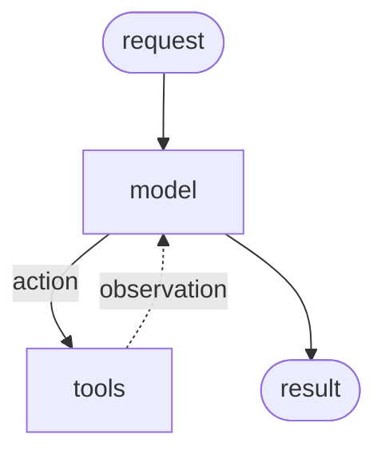
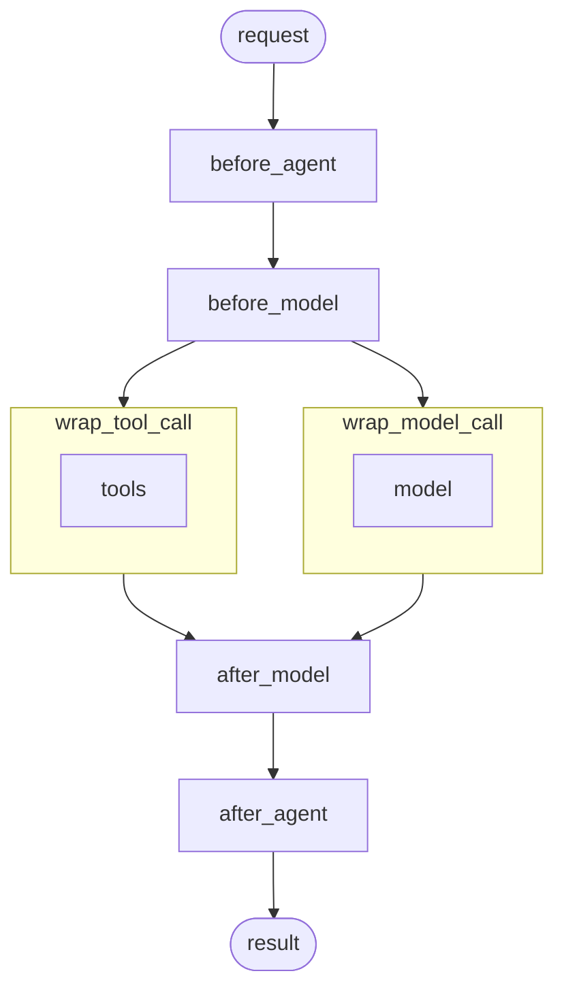

# Middleware

## 개요

Agent 실행을 모든 단계에서 제어하고 사용자 정의합니다.

Middleware는 Agent 내부에서 일어나는 일을 더 긴밀하게 제어하는 방법을 제공합니다. Middleware는 다음에 유용합니다:

- 로깅, 분석 및 디버깅으로 Agent 동작을 추적합니다.
- 프롬프트, [Tool 선택](/oss/python/langchain/middleware/built-in#llm-tool-selector) 및 출력 형식을 변환합니다.
- [재시도](/oss/python/langchain/middleware/built-in#tool-retry), [폴백](/oss/python/langchain/middleware/built-in#model-fallback) 및 조기 종료 논리를 추가합니다.
- [요청률 제한](/oss/python/langchain/middleware/built-in#model-call-limit), 가드레일 및 [PII 탐지](/oss/python/langchain/middleware/built-in#pii-detection)를 적용합니다.

`create_agent`에 Middleware를 전달하여 추가합니다:

```python
from langchain.agents import create_agent
from langchain.agents.middleware import SummarizationMiddleware, HumanInTheLoopMiddleware

agent = create_agent(
    model="gpt-4.1",
    tools=[...],
    middleware=[
        SummarizationMiddleware(...),
        HumanInTheLoopMiddleware(...)
    ],
)
```

---

## Agent 루프

핵심 Agent 루프는 모델을 호출하고, Tool을 실행할 선택을 하게 한 다음, Tool을 더 이상 호출하지 않을 때 완료하는 것을 포함합니다:



Middleware는 각 단계 전후에 후크를 노출합니다:



---

## 추가 리소스

| | |
|:--|:--|
| 📦 **[기본 제공 Middleware](/oss/python/langchain/middleware/built-in)** | 🛠️ **[사용자 정의 Middleware](/oss/python/langchain/middleware/custom)** |
| 일반적인 사용 사례를 위한 기본 제공 Middleware를 살펴봅니다. | 후크와 데코레이터를 사용하여 고유한 Middleware를 구축합니다. |
| 📖 **[Middleware API 참조](https://reference.langchain.com/python/langchain/middleware/)** ↗ | 🧪 **[Agent 테스트](/oss/python/langchain/test)** |
| Middleware에 대한 완전한 API 참조. | LangSmith를 사용하여 Agent를 테스트합니다. |
