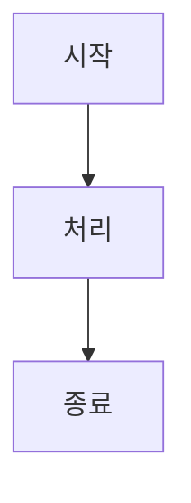

# 기여 가이드 (Contributing Guide)

이 문서는 LangGraph 교안 프로젝트에 기여하기 위한 가이드라인을 제공합니다.

## 📋 코드 스타일 가이드

### Python 코드 규칙

#### 1. 파일 구조

모든 Python 파일은 다음 구조를 따릅니다:

```python
"""
[Chapter N] 챕터 제목

📝 설명:
    이 챕터에서 다루는 내용에 대한 간단한 설명

🎯 학습 목표:
    - 목표 1
    - 목표 2
    - 목표 3

📚 관련 문서:
    - docs/PartX/XX-document.md
    - 공식 문서 링크

💻 실행 방법:
    python -m src.partX_name.XX_filename

📦 필요한 패키지:
    - langgraph>=0.2.0
    - 기타 패키지
"""

# imports
# ...

# =============================================================================
# 1. 섹션 제목
# =============================================================================

def example_function():
    """함수 설명"""
    pass
```

#### 2. 네이밍 컨벤션

- **파일명**: `XX_snake_case.py` (XX는 챕터 번호)
- **함수명**: `snake_case`
- **클래스명**: `PascalCase`
- **상수**: `UPPER_SNAKE_CASE`
- **State 클래스**: `DescriptiveState` (예: `ChatState`, `AgentState`)

#### 3. 타입 힌트

모든 함수와 클래스에 타입 힌트를 사용합니다:

```python
from typing import TypedDict, Annotated, List, Optional

class ExampleState(TypedDict):
    """State 설명"""
    field1: str
    field2: Annotated[List[str], operator.add]
    field3: Optional[int]

def process(state: ExampleState) -> ExampleState:
    """함수 설명"""
    return {"field1": "updated"}
```

#### 4. Docstring

Google 스타일 docstring을 사용합니다:

```python
def example_function(param1: str, param2: int) -> dict:
    """함수에 대한 간단한 설명.

    더 자세한 설명이 필요한 경우 여기에 작성합니다.

    Args:
        param1: 첫 번째 매개변수 설명
        param2: 두 번째 매개변수 설명

    Returns:
        반환값에 대한 설명

    Raises:
        ValueError: 에러 발생 조건

    Example:
        >>> result = example_function("hello", 42)
        >>> print(result)
        {'status': 'ok'}
    """
    pass
```

### 마크다운 문서 규칙

#### 1. 문서 구조

```markdown
# Chapter N: 챕터 제목

> 📌 **학습 목표**: 이 장을 마치면 ...

## 개요

챕터 개요 설명

## 핵심 개념

### 소제목 1

내용...

### 소제목 2

내용...

## 실습

### 단계 1: ...

```python
# 코드 예제
```

## 요약

- 포인트 1
- 포인트 2

## 다음 단계

👉 [다음 챕터](./next-chapter.md)

---

## 📚 참고 자료

### 공식 문서
- [링크](URL)

### 실습 코드
- [소스 코드](../../src/...)
```

#### 2. 다이어그램

Mermaid를 사용하여 다이어그램을 작성합니다:

```markdown

```

#### 3. 코드 블록

- 언어 지정 필수: ` ```python `, ` ```bash ` 등
- 긴 코드는 파일 링크 제공
- 중요한 부분에 주석 추가

## 🔧 개발 환경 설정

### 필수 요구사항

- Python 3.10+
- pip 또는 uv

### 설치

```bash
# 저장소 클론
git clone <repository-url>
cd langgraph-tutorial

# 가상환경 생성 및 활성화
python -m venv .venv
source .venv/bin/activate  # Windows: .venv\Scripts\activate

# 의존성 설치
pip install -r requirements.txt

# 환경 변수 설정
cp .env.example .env
# .env 파일을 열어 API 키 입력
```

### 코드 실행

```bash
# 특정 챕터 실행
python -m src.part1_foundation.01_hello_langgraph

# 예제 프로젝트 실행
python -m examples.01_simple_chatbot.main
```

## ✅ 테스트

### 테스트 실행

```bash
# 전체 테스트
pytest tests/

# 특정 파트 테스트
pytest tests/test_part1.py

# 상세 출력
pytest tests/ -v
```

### 테스트 작성 가이드

```python
# tests/test_partX.py

import pytest
from src.partX_name.XX_filename import function_to_test

class TestChapterXX:
    """Chapter XX 테스트"""

    def test_basic_functionality(self):
        """기본 기능 테스트"""
        result = function_to_test(input_data)
        assert result == expected_output

    def test_edge_case(self):
        """엣지 케이스 테스트"""
        with pytest.raises(ValueError):
            function_to_test(invalid_input)
```

## 📝 Pull Request 가이드

### PR 체크리스트

- [ ] 코드가 스타일 가이드를 따름
- [ ] 모든 테스트 통과
- [ ] 새 기능에 대한 테스트 추가
- [ ] 문서 업데이트 (필요한 경우)
- [ ] 커밋 메시지가 명확함

### 커밋 메시지 형식

```
타입: 간단한 설명

- 상세 변경사항 1
- 상세 변경사항 2
```

타입:
- `feat`: 새 기능
- `fix`: 버그 수정
- `docs`: 문서 변경
- `style`: 코드 포맷팅
- `refactor`: 리팩토링
- `test`: 테스트 추가/수정
- `chore`: 기타 변경

## 🐛 이슈 리포팅

### 버그 리포트

```markdown
**설명**
버그에 대한 명확한 설명

**재현 단계**
1. '...'로 이동
2. '...'를 클릭
3. 에러 발생

**예상 동작**
예상했던 동작

**실제 동작**
실제로 발생한 동작

**환경**
- Python 버전:
- LangGraph 버전:
- OS:
```

### 기능 제안

```markdown
**기능 설명**
제안하는 기능에 대한 설명

**사용 사례**
이 기능이 필요한 상황

**대안**
고려한 대안들
```

## 📞 문의

질문이나 제안이 있으시면 이슈를 생성해 주세요.
