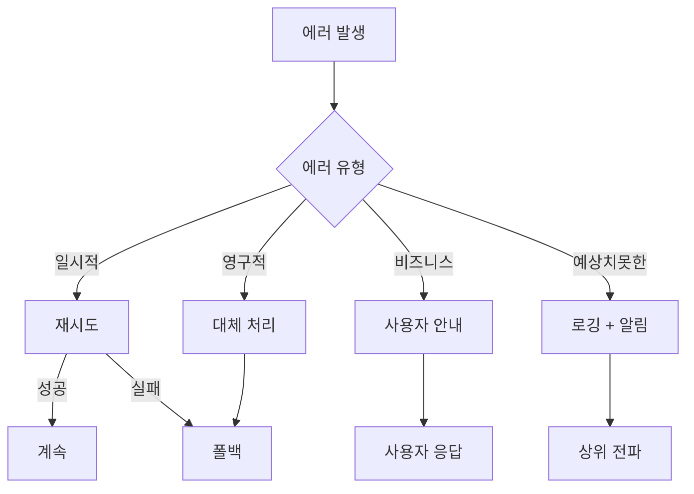

# Appendix B: 문제 해결 및 에러 핸들링

> 📌 LangGraph 개발 중 자주 발생하는 문제와 해결 방법을 정리한 가이드입니다.

## 에러 핸들링 전략

### 에러 분류



### 1. 일시적 에러 (Transient Errors)

**특징:** 재시도하면 성공할 수 있는 에러

```python
from tenacity import retry, stop_after_attempt, wait_exponential

@retry(
    stop=stop_after_attempt(3),
    wait=wait_exponential(multiplier=1, min=1, max=10)
)
def call_external_api(data):
    """재시도 로직이 포함된 외부 API 호출"""
    response = requests.post(API_URL, json=data)
    response.raise_for_status()
    return response.json()
```

**대표 사례:**
- 네트워크 타임아웃
- API Rate Limit
- 일시적 서버 오류 (503)

### 2. 영구적 에러 (Permanent Errors)

**특징:** 재시도해도 해결되지 않는 에러

```python
def handle_permanent_error(state):
    """영구 에러 처리"""
    try:
        result = risky_operation()
    except InvalidDataError as e:
        # 폴백 값 반환
        return {"result": None, "error": str(e), "fallback_used": True}
    except AuthenticationError as e:
        # 에러 상태로 종료
        return {"error": f"인증 실패: {e}", "completed": True}
```

**대표 사례:**
- 잘못된 입력 데이터
- 인증/권한 오류
- 리소스 없음 (404)

### 3. 비즈니스 에러 (Business Errors)

**특징:** 비즈니스 규칙 위반

```python
def validate_order(state):
    """주문 검증"""
    order = state["order"]

    if order["amount"] > state["user"]["credit_limit"]:
        return {
            "error": "신용 한도를 초과했습니다.",
            "error_code": "CREDIT_LIMIT_EXCEEDED",
            "suggested_action": "결제 금액을 줄이거나 다른 결제 수단을 선택하세요."
        }

    return {"validated": True}
```

### 4. 예상치 못한 에러 (Unexpected Errors)

```python
import logging
import traceback

logger = logging.getLogger(__name__)

def safe_node(state):
    """예상치 못한 에러 처리"""
    try:
        return process(state)
    except Exception as e:
        logger.exception(f"예상치 못한 에러: {e}")
        # 디버그 정보 저장
        return {
            "error": str(e),
            "error_type": type(e).__name__,
            "traceback": traceback.format_exc(),
            "state_snapshot": dict(state)
        }
```

---

## 자주 발생하는 문제

### 문제 1: Checkpointer 없이 interrupt 사용

**증상:**
```
ValueError: Interrupt is not supported without a checkpointer
```

**해결:**
```python
# ❌ 잘못된 코드
app = graph.compile()

# ✅ 올바른 코드
from langgraph.checkpoint.memory import MemorySaver
checkpointer = MemorySaver()
app = graph.compile(checkpointer=checkpointer)
```

### 문제 2: State 업데이트가 반영되지 않음

**증상:** 노드에서 반환한 값이 State에 저장되지 않음

**원인 및 해결:**

```python
# ❌ 잘못된 코드 - 전체 State 반환
def bad_node(state: MyState) -> MyState:
    state["count"] = state["count"] + 1
    return state  # 전체 반환하면 다른 필드 덮어씀

# ✅ 올바른 코드 - 변경된 필드만 반환
def good_node(state: MyState) -> MyState:
    return {"count": state["count"] + 1}
```

### 문제 3: 메시지가 계속 누적됨

**증상:** 대화가 길어지면서 토큰 제한 초과

**해결:**
```python
from langchain_core.messages import trim_messages, RemoveMessage

def manage_messages(state):
    """메시지 관리"""
    messages = state["messages"]

    # 방법 1: 최근 N개만 유지
    if len(messages) > 20:
        return {
            "messages": [
                RemoveMessage(id=m.id) for m in messages[:-10]
            ]
        }

    return {}
```

### 문제 4: 조건부 에지가 예상대로 동작하지 않음

**증상:** 라우터 함수가 예상과 다른 경로 반환

**디버깅:**
```python
def debug_router(state):
    """디버깅용 라우터"""
    # 상태 출력
    print(f"Router state: {state}")

    # 조건 확인
    condition = state.get("condition")
    print(f"Condition value: {condition}, type: {type(condition)}")

    if condition == "yes":  # 문자열 vs 불리언 확인
        return "path_a"
    return "path_b"
```

### 문제 5: 비동기 컨텍스트에서 동기 호출

**증상:**
```
RuntimeError: This event loop is already running
```

**해결:**
```python
# ❌ 잘못된 코드
async def handler():
    result = app.invoke(input)  # 동기 호출

# ✅ 올바른 코드
async def handler():
    result = await app.ainvoke(input)  # 비동기 호출
```

### 문제 6: 그래프 무한 루프

**증상:** 그래프가 종료되지 않고 계속 실행

**해결:**
```python
# 루프 카운터 추가
def loop_node(state):
    loop_count = state.get("loop_count", 0)

    if loop_count >= 10:  # 최대 반복 제한
        return {"should_end": True, "loop_count": loop_count}

    return {"loop_count": loop_count + 1}

def route_loop(state):
    if state.get("should_end"):
        return END
    return "loop_node"
```

### 문제 7: 서브그래프 상태 접근

**증상:** 부모 그래프에서 서브그래프 상태에 접근 불가

**해결:**
```python
# 서브그래프 결과를 부모 상태로 매핑
def after_subgraph(state):
    """서브그래프 결과 처리"""
    # 서브그래프의 output_key에서 결과 추출
    sub_result = state.get("subgraph_result")
    return {"processed_result": transform(sub_result)}
```

---

## 디버깅 도구

### 1. 그래프 시각화

```python
from IPython.display import display, Image

# Mermaid 다이어그램
print(app.get_graph().draw_mermaid())

# PNG 이미지 (graphviz 필요)
display(Image(app.get_graph().draw_mermaid_png()))
```

### 2. 상태 추적

```python
# 실행 중 상태 출력
for chunk in app.stream(input, config, stream_mode="updates"):
    for node, update in chunk.items():
        print(f"[{node}] {update}")

# 히스토리 조회
for snapshot in app.get_state_history(config):
    print(f"Checkpoint: {snapshot.config}")
    print(f"Values: {snapshot.values}")
    print(f"Next: {snapshot.next}")
    print("---")
```

### 3. LangSmith 트레이싱

```python
import os

os.environ["LANGCHAIN_TRACING_V2"] = "true"
os.environ["LANGCHAIN_PROJECT"] = "my-debug-project"
os.environ["LANGCHAIN_API_KEY"] = "your-api-key"

# 이제 모든 실행이 LangSmith에 기록됨
result = app.invoke(input, config)
```

### 4. 로깅 설정

```python
import logging

# LangGraph 로거 설정
logging.getLogger("langgraph").setLevel(logging.DEBUG)

# 커스텀 포매터
formatter = logging.Formatter(
    '%(asctime)s - %(name)s - %(levelname)s - %(message)s'
)
handler = logging.StreamHandler()
handler.setFormatter(formatter)

logger = logging.getLogger("langgraph")
logger.addHandler(handler)
```

---

## 테스트 전략

### 단위 테스트

```python
import pytest
from unittest.mock import Mock, patch

def test_node_function():
    """노드 함수 단위 테스트"""
    state = {"input": "test", "count": 0}
    result = my_node(state)

    assert result["count"] == 1
    assert "processed" in result


@patch("my_module.external_api")
def test_node_with_mock(mock_api):
    """외부 의존성 모킹"""
    mock_api.return_value = {"status": "success"}

    state = {"query": "test"}
    result = api_node(state)

    assert result["api_result"]["status"] == "success"
    mock_api.assert_called_once_with("test")
```

### 통합 테스트

```python
def test_full_workflow():
    """전체 워크플로우 테스트"""
    app = create_graph()
    config = {"configurable": {"thread_id": "test-1"}}

    result = app.invoke(
        {"input": "test data"},
        config=config
    )

    assert result["completed"] == True
    assert "error" not in result


def test_interrupt_resume():
    """Interrupt/Resume 테스트"""
    app = create_graph()
    config = {"configurable": {"thread_id": "test-2"}}

    # 첫 실행 (interrupt에서 멈춤)
    app.invoke({"input": "test"}, config)

    state = app.get_state(config)
    assert state.next  # 중단됨

    # 재개
    result = app.invoke(Command(resume="yes"), config)
    assert result["completed"] == True
```

---

## 성능 최적화

### 1. 병렬 처리

```python
import asyncio

async def parallel_nodes():
    """병렬 노드 실행"""
    tasks = [
        asyncio.create_task(node_a(state)),
        asyncio.create_task(node_b(state)),
        asyncio.create_task(node_c(state)),
    ]
    results = await asyncio.gather(*tasks)
    return results
```

### 2. 캐싱

```python
from functools import lru_cache

@lru_cache(maxsize=100)
def expensive_computation(input_hash: str) -> str:
    """비용이 높은 계산 캐싱"""
    return compute(input_hash)

def cached_node(state):
    # 입력을 해시화하여 캐시 키로 사용
    input_hash = hash(frozenset(state["input"].items()))
    result = expensive_computation(input_hash)
    return {"result": result}
```

### 3. 배치 처리

```python
def batch_process(state):
    """배치 처리"""
    items = state["items"]
    batch_size = 10

    results = []
    for i in range(0, len(items), batch_size):
        batch = items[i:i+batch_size]
        batch_result = process_batch(batch)
        results.extend(batch_result)

    return {"results": results}
```

---

## 관련 리소스

- [LangGraph GitHub Issues](https://github.com/langchain-ai/langgraph/issues)
- [LangChain Discord](https://discord.gg/langchain)
- [Stack Overflow - LangGraph 태그](https://stackoverflow.com/questions/tagged/langgraph)
