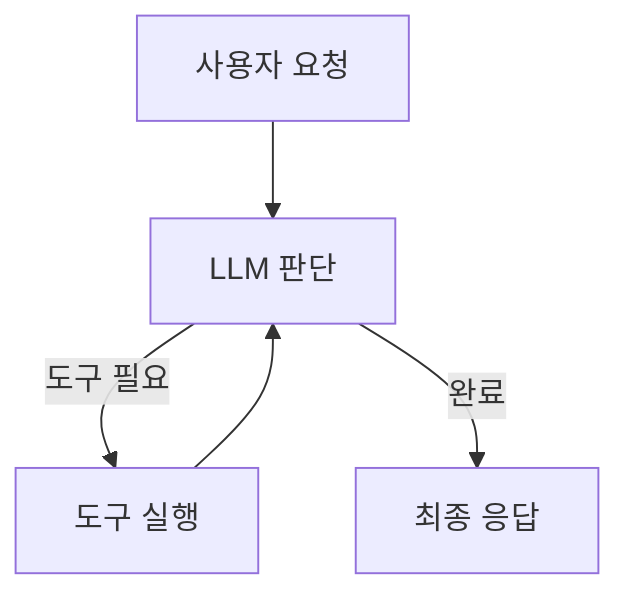
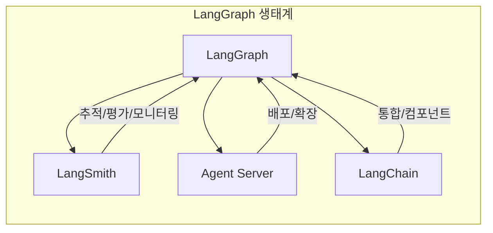
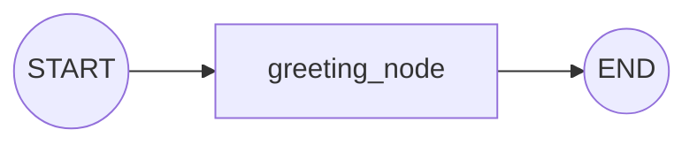

# Chapter 1: LangGraph 소개

> 📌 **학습 목표**: 이 장을 마치면 LangGraph가 무엇인지 이해하고, 개발 환경을 설정하며, 첫 번째 그래프를 실행할 수 있습니다.

## 개요

LangGraph는 LLM(대규모 언어 모델)을 활용한 **상태 유지(stateful)** 및 **다중 액터(multi-actor)** 애플리케이션을 구축하기 위한 라이브러리입니다. 특히 AI Agent와 Multi-Agent 워크플로우를 만드는 데 최적화되어 있습니다.

기존 LLM 프레임워크와 비교했을 때, LangGraph는 세 가지 핵심 이점을 제공합니다:

- **순환(Cycles)**: 에이전트가 LLM을 반복 호출하며 다음 행동을 결정하는 순환 구조 지원
- **제어 가능성(Controllability)**: Human-in-the-Loop과 에이전트 상태에 대한 세밀한 제어
- **영속성(Persistence)**: 에이전트 상태를 저장하고 언제든 복원 가능

## 핵심 개념

### LangGraph가 필요한 이유

일반적인 LLM 호출은 단발성입니다. 질문을 하면 답변을 받고 끝납니다. 하지만 복잡한 작업을 수행하는 AI Agent는 다릅니다:



이런 **순환 구조**가 AI Agent의 핵심입니다. LangGraph는 이를 자연스럽게 구현할 수 있게 해줍니다.

### LangGraph의 핵심 이점

| 기능 | 설명 |
|------|------|
| **내구성 있는 실행** | 실패해도 중단된 지점부터 재개 가능 |
| **Human-in-the-Loop** | 언제든 에이전트 상태를 검사하고 수정 가능 |
| **종합적인 메모리** | 단기 작업 메모리와 세션 간 장기 메모리 지원 |
| **LangSmith 디버깅** | 실행 경로 추적, 상태 전환 캡처, 런타임 메트릭 제공 |
| **프로덕션 배포** | 상태 유지 워크플로우를 위한 확장 가능한 인프라 |

### LangGraph 생태계

LangGraph는 독립적으로 사용할 수 있지만, LangChain 제품군과 원활하게 통합됩니다:



- **LangSmith**: 요청 추적, 출력 평가, 배포 모니터링을 한 곳에서 관리
- **Agent Server**: 장기 실행 상태 유지 워크플로우를 위한 배포 플랫폼
- **LangChain**: LLM 애플리케이션 개발을 간소화하는 통합 및 컴포넌트 제공

## 실습: 개발 환경 설정

### 단계 1: LangGraph 설치

터미널에서 다음 명령어를 실행합니다:

```bash
# LangGraph 기본 패키지 설치
pip install -U langgraph

# LangChain 설치 (LLM 통합을 위해)
pip install -U langchain

# Anthropic Claude 사용을 위한 패키지
pip install -U langchain-anthropic

# 환경 변수 관리
pip install python-dotenv
```

또는 uv를 사용하는 경우:

```bash
uv add langgraph langchain langchain-anthropic python-dotenv
```

### 단계 2: 환경 변수 설정

프로젝트 루트에 `.env` 파일을 생성합니다:

```bash
# .env
ANTHROPIC_API_KEY=your-api-key-here

# 선택사항: LangSmith 추적
# LANGCHAIN_TRACING_V2=true
# LANGCHAIN_API_KEY=your-langsmith-key-here
```

### 단계 3: 첫 번째 그래프 실행

이제 가장 간단한 LangGraph 프로그램을 만들어 봅시다:

```python
# 📁 src/part1_foundation/01_hello_langgraph.py (핵심 부분)
from langgraph.graph import StateGraph, START, END
from typing import TypedDict


# 1. 상태 정의
class State(TypedDict):
    message: str


# 2. 노드 함수 정의
def greeting_node(state: State) -> State:
    """인사 메시지를 생성합니다"""
    return {"message": f"안녕하세요! 입력: {state['message']}"}


# 3. 그래프 구성
graph = StateGraph(State)
graph.add_node("greeting", greeting_node)
graph.add_edge(START, "greeting")
graph.add_edge("greeting", END)

# 4. 컴파일 및 실행
app = graph.compile()
result = app.invoke({"message": "LangGraph"})
print(result)  # {'message': '안녕하세요! 입력: LangGraph'}
```

> 💡 **전체 코드**: [src/part1_foundation/01_hello_langgraph.py](../../src/part1_foundation/01_hello_langgraph.py)

### 그래프 구조 이해하기

위 코드에서 만든 그래프의 구조입니다:



- **START**: 그래프의 시작점 (특수 노드)
- **greeting**: 우리가 정의한 노드
- **END**: 그래프의 종료점 (특수 노드)

## 심화 학습

### LLM을 사용하는 그래프

실제 AI 애플리케이션에서는 LLM을 호출합니다. 다음은 Claude를 사용하는 예제입니다:

```python
# 📁 src/part1_foundation/01_hello_langgraph.py (LLM 버전)
from dotenv import load_dotenv
from langgraph.graph import StateGraph, START, END
from langchain_anthropic import ChatAnthropic
from typing import TypedDict

load_dotenv()


class State(TypedDict):
    question: str
    answer: str


# LLM 초기화
llm = ChatAnthropic(model="claude-sonnet-4-5-20250929", temperature=0)


def ask_llm(state: State) -> State:
    """LLM에게 질문합니다"""
    response = llm.invoke(state["question"])
    return {"answer": response.content}


# 그래프 구성
graph = StateGraph(State)
graph.add_node("llm", ask_llm)
graph.add_edge(START, "llm")
graph.add_edge("llm", END)

app = graph.compile()
result = app.invoke({"question": "LangGraph란 무엇인가요?", "answer": ""})
print(result["answer"])
```

### 그래프 시각화

LangGraph는 그래프를 시각화하는 기능을 제공합니다:

```python
from IPython.display import Image, display

# Mermaid PNG로 시각화 (graphviz 필요)
try:
    display(Image(app.get_graph().draw_mermaid_png()))
except Exception:
    # graphviz가 없는 경우 ASCII로 출력
    print(app.get_graph().draw_ascii())
```

## 요약

- LangGraph는 **상태 유지** LLM 애플리케이션과 **AI Agent** 구축을 위한 라이브러리입니다
- 핵심 이점: **순환 구조**, **세밀한 제어**, **상태 영속성**
- 그래프는 **State(상태)**, **Node(노드)**, **Edge(엣지)**로 구성됩니다
- `StateGraph`로 그래프를 정의하고, `compile()`로 컴파일하여 `invoke()`로 실행합니다

## 다음 단계

다음 장에서는 LangGraph의 **핵심 개념**을 더 깊이 이해합니다. Graph 구조, Message Passing, Super-step 개념을 학습합니다.

👉 [Chapter 2: 핵심 개념 이해](./02-core-concepts.md)

---

## 📚 참고 자료

### 공식 문서
- [LangGraph Overview (공식 온라인)](https://docs.langchain.com/oss/python/langgraph/overview) - LangChain 공식 문서
- [Installation (공식 온라인)](https://docs.langchain.com/oss/python/langgraph/install) - 설치 가이드
- [Overview (로컬 문서)](../../official_docs/01-overview.md) - 로컬 참조용
- [Install (로컬 문서)](../../official_docs/02-install.md) - 로컬 참조용

### 실습 코드
- [전체 소스](../../src/part1_foundation/01_hello_langgraph.py) - 실행 가능한 전체 코드
- [유틸리티 함수](../../src/utils/) - 공통 헬퍼 함수

### 관련 챕터
- [다음: Chapter 2 - 핵심 개념 이해](./02-core-concepts.md)
