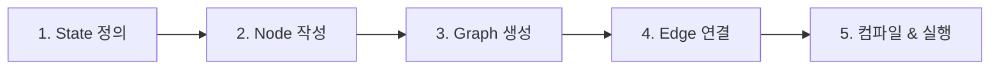
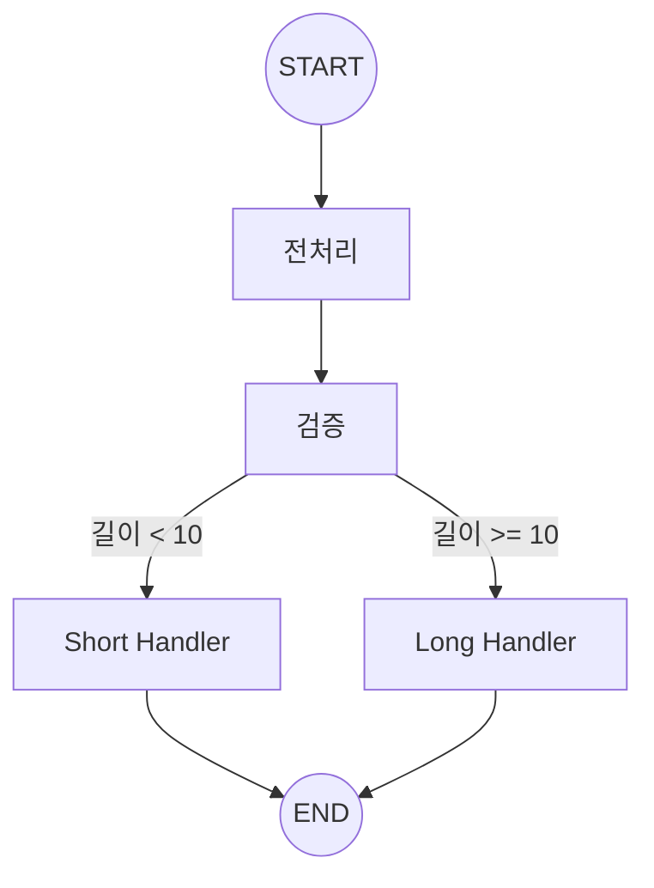

# Chapter 3: 첫 번째 그래프 만들기

> 📌 **학습 목표**: 이 장을 마치면 StateGraph를 생성하고, Node와 Edge를 추가하며, 그래프를 컴파일하고 실행할 수 있습니다.

## 개요

이번 장에서는 LangGraph의 핵심인 **그래프 구성**을 실습합니다. 단순한 순차 그래프부터 조건부 라우팅이 있는 복잡한 그래프까지 단계별로 만들어봅니다.

## 핵심 개념

### 그래프 구성의 5단계



## 실습: 단계별 그래프 만들기

### 단계 1: State 정의

먼저 그래프에서 공유할 상태를 정의합니다.

```python
# 📁 src/part1_foundation/03_reducers.py
from typing import TypedDict, Annotated
from operator import add

class WorkflowState(TypedDict):
    """워크플로우 상태"""
    input: str           # 원본 입력
    current: str         # 현재 처리 중인 값
    steps: Annotated[list[str], add]  # 처리 단계 기록 (누적)
```

### 단계 2: Node 함수 작성

각 처리 단계를 함수로 작성합니다.

```python
def preprocess(state: WorkflowState) -> dict:
    """전처리: 공백 제거 및 소문자 변환"""
    processed = state["input"].strip().lower()
    return {
        "current": processed,
        "steps": [f"전처리: '{state['input']}' -> '{processed}'"]
    }

def validate(state: WorkflowState) -> dict:
    """검증: 빈 문자열 체크"""
    is_valid = len(state["current"]) > 0
    status = "유효" if is_valid else "무효"
    return {
        "steps": [f"검증: {status}"]
    }

def format_output(state: WorkflowState) -> dict:
    """출력 포맷팅"""
    formatted = f"[결과] {state['current'].upper()}"
    return {
        "current": formatted,
        "steps": [f"포맷팅: '{formatted}'"]
    }
```

### 단계 3: StateGraph 생성

```python
from langgraph.graph import StateGraph, START, END

# StateGraph 인스턴스 생성
graph = StateGraph(WorkflowState)
```

### 단계 4: Node 추가

```python
# 노드 추가 - (노드 이름, 노드 함수)
graph.add_node("preprocess", preprocess)
graph.add_node("validate", validate)
graph.add_node("format", format_output)
```

### 단계 5: Edge 연결

#### 일반 엣지 (순차 실행)

```python
# START -> preprocess -> validate -> format -> END
graph.add_edge(START, "preprocess")
graph.add_edge("preprocess", "validate")
graph.add_edge("validate", "format")
graph.add_edge("format", END)
```

### 단계 6: 컴파일 및 실행

```python
# 그래프 컴파일 (필수!)
app = graph.compile()

# 실행
result = app.invoke({
    "input": "  Hello World  ",
    "current": "",
    "steps": []
})

print(result)
# {
#     'input': '  Hello World  ',
#     'current': '[결과] HELLO WORLD',
#     'steps': [
#         "전처리: '  Hello World  ' -> 'hello world'",
#         '검증: 유효',
#         "포맷팅: '[결과] HELLO WORLD'"
#     ]
# }
```

> 💡 **전체 코드**: [src/part1_foundation/03_reducers.py](../../src/part1_foundation/03_reducers.py)

## 심화: 조건부 엣지

실제 워크플로우에서는 조건에 따라 다른 경로로 분기해야 할 때가 많습니다.

### 조건부 라우팅 함수

```python
from typing import Literal

def route_by_length(state: WorkflowState) -> Literal["short", "long"]:
    """길이에 따라 라우팅"""
    if len(state["current"]) < 10:
        return "short"
    return "long"
```

### 조건부 엣지 추가

```python
# 조건부 엣지: validate 이후 길이에 따라 분기
graph.add_conditional_edges(
    "validate",           # 출발 노드
    route_by_length,      # 라우팅 함수
    {                     # 매핑: 반환값 -> 노드 이름
        "short": "short_handler",
        "long": "long_handler"
    }
)
```

### 완전한 조건부 그래프 예제



```python
from langgraph.graph import StateGraph, START, END
from typing import TypedDict, Annotated, Literal
from operator import add

class State(TypedDict):
    text: str
    length: int
    result: str

def preprocess(state: State) -> dict:
    text = state["text"].strip()
    return {"text": text, "length": len(text)}

def route(state: State) -> Literal["short", "long"]:
    return "short" if state["length"] < 10 else "long"

def short_handler(state: State) -> dict:
    return {"result": f"짧은 텍스트: {state['text']}"}

def long_handler(state: State) -> dict:
    return {"result": f"긴 텍스트: {state['text'][:10]}..."}

# 그래프 구성
graph = StateGraph(State)
graph.add_node("preprocess", preprocess)
graph.add_node("short", short_handler)
graph.add_node("long", long_handler)

graph.add_edge(START, "preprocess")
graph.add_conditional_edges("preprocess", route)
graph.add_edge("short", END)
graph.add_edge("long", END)

app = graph.compile()

# 테스트
print(app.invoke({"text": "Hi", "length": 0, "result": ""}))
# {'text': 'Hi', 'length': 2, 'result': '짧은 텍스트: Hi'}

print(app.invoke({"text": "Hello LangGraph World!", "length": 0, "result": ""}))
# {'text': 'Hello LangGraph World!', 'length': 22, 'result': '긴 텍스트: Hello Lang...'}
```

## 그래프 시각화

LangGraph는 그래프 구조를 시각화하는 여러 방법을 제공합니다.

### ASCII 시각화

```python
print(app.get_graph().draw_ascii())
```

출력:
```
        +-----------+
        | __start__ |
        +-----------+
              *
              *
              *
       +------------+
       | preprocess |
       +------------+
          *      *
         *        *
        *          *
  +-------+    +------+
  | short |    | long |
  +-------+    +------+
          *      *
           *    *
            *  *
       +---------+
       | __end__ |
       +---------+
```

### Mermaid 다이어그램

```python
print(app.get_graph().draw_mermaid())
```

### PNG 이미지 (Jupyter 환경)

```python
from IPython.display import Image, display

# graphviz 필요
display(Image(app.get_graph().draw_mermaid_png()))
```

## Reducer 함수 심화

Reducer는 상태 업데이트 시 값을 어떻게 합칠지 결정합니다.

### 기본 동작 (덮어쓰기)

```python
class State(TypedDict):
    value: str  # Reducer 없음 = 덮어쓰기

# 노드 A가 {"value": "A"} 반환
# 노드 B가 {"value": "B"} 반환
# 최종: {"value": "B"}  # 마지막 값으로 덮어쓰기
```

### operator.add (리스트 누적)

```python
from typing import Annotated
from operator import add

class State(TypedDict):
    items: Annotated[list[str], add]

# 노드 A가 {"items": ["A"]} 반환
# 노드 B가 {"items": ["B"]} 반환
# 최종: {"items": ["A", "B"]}  # 리스트 합침
```

### 커스텀 Reducer

```python
def max_reducer(current: int, update: int) -> int:
    """최대값 유지"""
    return max(current, update)

class State(TypedDict):
    max_score: Annotated[int, max_reducer]
```

## 요약

- **StateGraph**: 그래프 정의의 시작점, State 타입을 전달
- **add_node()**: 노드(함수) 추가
- **add_edge()**: 일반 엣지 추가 (A → B)
- **add_conditional_edges()**: 조건부 엣지 추가 (A → B 또는 C)
- **compile()**: 그래프를 실행 가능한 형태로 변환 (필수)
- **invoke()**: 그래프 실행
- **Reducer**: 상태 업데이트 방식 정의 (덮어쓰기, 누적 등)

## 다음 단계

다음 장에서는 State 관리를 더 깊이 학습합니다. add_messages reducer, MessagesState, 그리고 다중 스키마에 대해 알아봅니다.

👉 [Chapter 4: State 관리 심화](./04-state-management.md)

---

## 📚 참고 자료

### 공식 문서
- [Quickstart (공식 온라인)](https://docs.langchain.com/oss/python/langgraph/quickstart) - 빠른 시작 가이드
- [Graph API (공식 온라인)](https://docs.langchain.com/oss/python/langgraph/graph-api) - Graph API 상세
- [Quickstart (로컬 문서)](../../official_docs/03-quickstart.md) - 로컬 참조용
- [Graph API (로컬 문서)](../../official_docs/22-graph-api.md) - 로컬 참조용

### 실습 코드
- [전체 소스](../../src/part1_foundation/03_reducers.py) - 실행 가능한 전체 코드
- [유틸리티 함수](../../src/utils/) - 공통 헬퍼 함수

### 관련 챕터
- [이전: Chapter 2 - 핵심 개념 이해](./02-core-concepts.md)
- [다음: Chapter 4 - State 관리 심화](./04-state-management.md)
