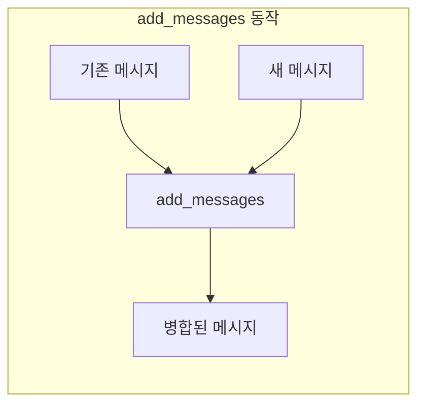

# Chapter 4: State 관리 심화

> 📌 **학습 목표**: 이 장을 마치면 TypedDict, Pydantic, dataclass의 차이를 이해하고, add_messages reducer와 MessagesState를 활용할 수 있습니다.

## 개요

이번 장에서는 LangGraph의 State 관리를 심도 있게 학습합니다. 특히 LLM 애플리케이션에서 핵심인 **메시지 관리**와 **다중 스키마** 패턴을 다룹니다.

## 핵심 개념

### State 정의 방법 비교

LangGraph에서 State를 정의하는 세 가지 방법이 있습니다:

| 방법 | 장점 | 단점 | 추천 상황 |
|------|------|------|----------|
| **TypedDict** | 간단, 빠름, 추가 의존성 없음 | 런타임 검증 없음 | 대부분의 경우 |
| **Pydantic** | 런타임 검증, 자동 변환 | 상대적으로 느림 | 데이터 검증 필요시 |
| **dataclass** | 기본값 지원, 간결함 | 불변성 관리 어려움 | 기본값 필요시 |

### add_messages Reducer

LLM 대화에서 가장 중요한 것은 **메시지 히스토리 관리**입니다. `add_messages` reducer는 이를 위해 특별히 설계되었습니다.



**특징:**
- 새 메시지를 기존 목록에 추가
- 같은 ID의 메시지는 업데이트 (덮어쓰기)
- LangChain 메시지 객체로 자동 역직렬화

### MessagesState

`MessagesState`는 메시지 기반 애플리케이션을 위한 **편의 클래스**입니다:

```python
from langgraph.graph import MessagesState

# 이것은...
class MyState(MessagesState):
    extra_field: str

# 이것과 동일합니다
from typing import Annotated
from langchain_core.messages import AnyMessage
from langgraph.graph.message import add_messages

class MyState(TypedDict):
    messages: Annotated[list[AnyMessage], add_messages]
    extra_field: str
```

## 실습: 메시지 기반 그래프

### 단계 1: MessagesState 사용

```python
# 📁 src/part1_foundation/04_messages_state.py
from langgraph.graph import StateGraph, MessagesState, START, END
from langchain_core.messages import HumanMessage, AIMessage, SystemMessage


class ChatState(MessagesState):
    """채팅 상태 - MessagesState 상속"""
    user_name: str  # 추가 필드


def greeting_node(state: ChatState) -> dict:
    """인사 노드"""
    user_name = state.get("user_name", "사용자")
    return {
        "messages": [AIMessage(content=f"안녕하세요, {user_name}님!")]
    }


def process_node(state: ChatState) -> dict:
    """처리 노드"""
    last_message = state["messages"][-1]
    response = f"'{last_message.content}'에 대한 응답입니다."
    return {
        "messages": [AIMessage(content=response)]
    }


# 그래프 구성
graph = StateGraph(ChatState)
graph.add_node("greeting", greeting_node)
graph.add_node("process", process_node)
graph.add_edge(START, "greeting")
graph.add_edge("greeting", "process")
graph.add_edge("process", END)

app = graph.compile()

# 실행
result = app.invoke({
    "messages": [HumanMessage(content="LangGraph에 대해 알려주세요")],
    "user_name": "태영"
})

for msg in result["messages"]:
    print(f"{msg.type}: {msg.content}")
```

> 💡 **전체 코드**: [src/part1_foundation/04_messages_state.py](../../src/part1_foundation/04_messages_state.py)

### 단계 2: add_messages 동작 이해

```python
from langgraph.graph.message import add_messages
from langchain_core.messages import HumanMessage, AIMessage

# 기존 메시지
existing = [
    HumanMessage(content="안녕", id="msg1"),
    AIMessage(content="안녕하세요!", id="msg2")
]

# 새 메시지 추가
new_messages = [AIMessage(content="무엇을 도와드릴까요?", id="msg3")]

# add_messages 적용
result = add_messages(existing, new_messages)
# 결과: 3개의 메시지 (기존 2개 + 새로운 1개)

# 같은 ID로 업데이트
update = [AIMessage(content="수정된 인사", id="msg2")]  # msg2 ID 동일
result = add_messages(existing, update)
# 결과: msg2의 content가 "수정된 인사"로 변경됨
```

### 단계 3: 메시지 삭제 (RemoveMessage)

특정 메시지를 삭제해야 할 때 `RemoveMessage`를 사용합니다:

```python
from langchain_core.messages import RemoveMessage

def cleanup_node(state: ChatState) -> dict:
    """오래된 메시지 정리"""
    # 처음 2개 메시지 삭제
    messages_to_remove = [
        RemoveMessage(id=msg.id)
        for msg in state["messages"][:2]
    ]
    return {"messages": messages_to_remove}
```

## 심화: 다중 스키마

복잡한 그래프에서는 입력, 출력, 내부 상태를 분리해야 할 때가 있습니다.

### Input/Output 스키마 분리

```python
from typing import TypedDict

class InputState(TypedDict):
    """입력 스키마 - 외부에서 받는 데이터만"""
    user_query: str


class OutputState(TypedDict):
    """출력 스키마 - 외부에 반환하는 데이터만"""
    final_answer: str


class InternalState(TypedDict):
    """내부 스키마 - 모든 필드 포함"""
    user_query: str
    intermediate_result: str  # 내부에서만 사용
    final_answer: str


def process_query(state: InputState) -> dict:
    """입력 처리"""
    return {
        "intermediate_result": f"처리 중: {state['user_query']}"
    }


def generate_answer(state: InternalState) -> dict:
    """답변 생성"""
    return {
        "final_answer": f"답변: {state['intermediate_result']}"
    }


# 그래프 생성 - 스키마 분리
graph = StateGraph(
    InternalState,
    input=InputState,
    output=OutputState
)

graph.add_node("process", process_query)
graph.add_node("generate", generate_answer)
graph.add_edge(START, "process")
graph.add_edge("process", "generate")
graph.add_edge("generate", END)

app = graph.compile()

# 입력: InputState만 필요
result = app.invoke({"user_query": "LangGraph란?"})

# 출력: OutputState만 반환
print(result)  # {'final_answer': '답변: 처리 중: LangGraph란?'}
```

### Private State (내부 통신용)

노드 간에만 공유하고 외부에 노출하지 않을 데이터:

```python
class PrivateState(TypedDict):
    """Private 상태 - 내부 노드 간 통신용"""
    _cache: dict  # 언더스코어로 private 표시
    _debug_info: str


def node_with_private(state) -> dict:
    # Private 상태에 쓰기 가능
    return {
        "_cache": {"key": "value"},
        "_debug_info": "노드 A 완료"
    }
```

## Pydantic 모델 사용

데이터 검증이 필요한 경우 Pydantic을 사용합니다:

```python
from pydantic import BaseModel, Field
from typing import List

class Message(BaseModel):
    role: str = Field(..., pattern="^(user|assistant|system)$")
    content: str = Field(..., min_length=1)


class ValidatedState(BaseModel):
    """Pydantic으로 검증되는 상태"""
    messages: List[Message] = []
    temperature: float = Field(default=0.7, ge=0.0, le=2.0)


# StateGraph에서 사용
graph = StateGraph(ValidatedState)
```

**주의**: Pydantic은 TypedDict보다 느리므로 검증이 꼭 필요한 경우에만 사용하세요.

## dataclass 사용

기본값이 필요한 경우 dataclass를 사용합니다:

```python
from dataclasses import dataclass, field
from typing import List

@dataclass
class ConfigState:
    """dataclass로 정의된 상태 - 기본값 지원"""
    query: str = ""
    max_results: int = 10
    filters: List[str] = field(default_factory=list)


# 기본값이 자동으로 적용됨
graph = StateGraph(ConfigState)
app = graph.compile()

# 일부 필드만 전달해도 OK
result = app.invoke({"query": "test"})
# max_results=10, filters=[] 가 기본값으로 설정됨
```

## 요약

- **TypedDict**: 가장 빠르고 간단한 방법, 대부분의 경우 권장
- **Pydantic**: 런타임 데이터 검증이 필요할 때
- **dataclass**: 기본값이 필요할 때
- **add_messages**: 메시지 목록을 자동으로 관리하는 특수 reducer
- **MessagesState**: 메시지 기반 앱을 위한 편의 클래스
- **다중 스키마**: Input/Output/Private를 분리하여 깔끔한 인터페이스 제공

## 다음 단계

Part 1 기초 과정을 완료했습니다! 다음 Part 2에서는 실제 **워크플로우 패턴**을 학습합니다. Prompt Chaining, Routing, 병렬 실행 등을 다룹니다.

👉 [Part 2 - Chapter 5: 워크플로우 패턴 개요](../Part2-Workflows/05-workflow-patterns.md)

---

## 📚 참고 자료

### 공식 문서
- [Graph API - State (공식 온라인)](https://docs.langchain.com/oss/python/langgraph/graph-api#state) - State 상세
- [Use Graph API (공식 온라인)](https://docs.langchain.com/oss/python/langgraph/use-graph-api) - 실전 가이드
- [Graph API (로컬 문서)](../../official_docs/22-graph-api.md) - 로컬 참조용
- [Use Graph API (로컬 문서)](../../official_docs/23-use-graph-api.md) - 로컬 참조용

### 실습 코드
- [전체 소스](../../src/part1_foundation/04_messages_state.py) - 실행 가능한 전체 코드
- [유틸리티 함수](../../src/utils/) - 공통 헬퍼 함수

### 관련 챕터
- [이전: Chapter 3 - 첫 번째 그래프 만들기](./03-first-graph.md)
- [다음: Part 2 - Chapter 5 - 워크플로우 패턴 개요](../Part2-Workflows/05-workflow-patterns.md)
