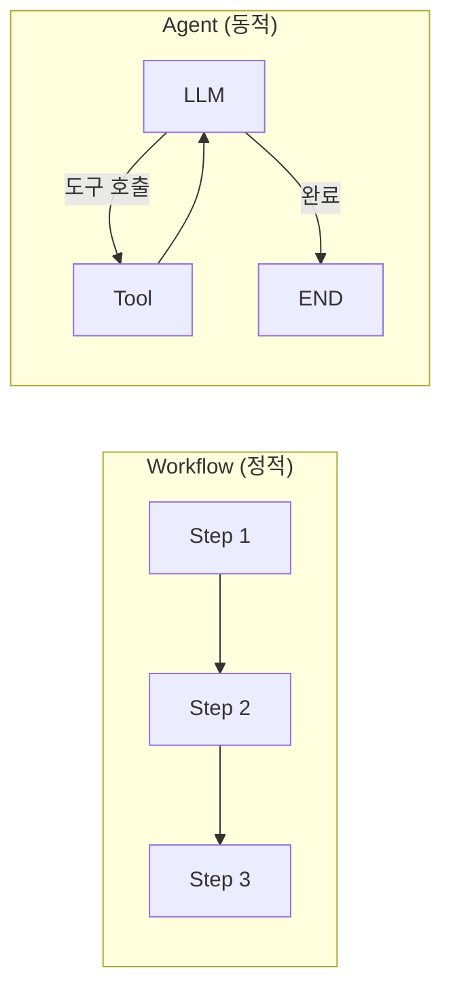
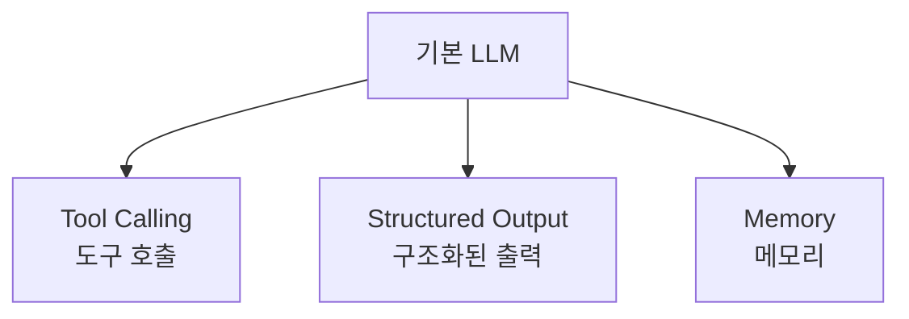
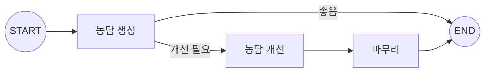

# Chapter 5: 워크플로우 패턴 개요

> 📌 **학습 목표**: 이 장을 마치면 Workflow와 Agent의 차이를 이해하고, LLM 증강 기법과 Prompt Chaining 패턴을 구현할 수 있습니다.

## 개요

LangGraph로 구축할 수 있는 시스템은 크게 **Workflow**와 **Agent** 두 가지로 나눌 수 있습니다:

- **Workflow(워크플로우)**: 미리 정해진 코드 경로를 따르며, 특정 순서대로 작동
- **Agent(에이전트)**: 동적으로 자신의 프로세스와 도구 사용을 결정



## 핵심 개념

### Workflow vs Agent

| 특성 | Workflow | Agent |
|------|----------|-------|
| **실행 경로** | 미리 정의됨 | 동적으로 결정 |
| **제어** | 개발자가 제어 | LLM이 제어 |
| **예측 가능성** | 높음 | 낮음 |
| **유연성** | 낮음 | 높음 |
| **사용 사례** | ETL, 문서 처리, 검증 | 대화형 어시스턴트, 자동화 |

### LLM 증강 (Augmentation)

LLM의 능력을 확장하는 방법들:



#### 1. Tool Calling (도구 호출)

```python
from langchain.tools import tool

@tool
def multiply(a: int, b: int) -> int:
    """두 숫자를 곱합니다."""
    return a * b

# LLM에 도구 바인딩
llm_with_tools = llm.bind_tools([multiply])
```

#### 2. Structured Output (구조화된 출력)

```python
from pydantic import BaseModel, Field

class SearchQuery(BaseModel):
    query: str = Field(description="검색 쿼리")
    category: str = Field(description="검색 카테고리")

# 구조화된 출력 설정
structured_llm = llm.with_structured_output(SearchQuery)
```

## 실습: Prompt Chaining

**Prompt Chaining**은 각 LLM 호출이 이전 호출의 출력을 처리하는 패턴입니다. 작업을 더 작은 검증 가능한 단계로 분해할 때 유용합니다.

### 예제: 농담 생성 파이프라인



### 단계 1: State 정의

```python
# 📁 src/part2_workflows/05_prompt_chaining.py
from typing import TypedDict
from langgraph.graph import StateGraph, START, END


class JokeState(TypedDict):
    """농담 생성 워크플로우 상태"""
    topic: str           # 주제
    joke: str            # 초기 농담
    improved_joke: str   # 개선된 농담
    final_joke: str      # 최종 농담
```

### 단계 2: Node 함수 작성

```python
def generate_joke(state: JokeState) -> dict:
    """첫 번째 LLM 호출: 초기 농담 생성"""
    response = llm.invoke(f"{state['topic']}에 대한 짧은 농담을 만들어줘")
    return {"joke": response.content}


def check_quality(state: JokeState) -> str:
    """게이트 함수: 농담 품질 확인"""
    # 간단한 체크 - 질문이나 느낌표가 있는지
    if "?" in state["joke"] or "!" in state["joke"]:
        return "pass"
    return "improve"


def improve_joke(state: JokeState) -> dict:
    """두 번째 LLM 호출: 농담 개선"""
    response = llm.invoke(
        f"이 농담을 말장난을 추가해서 더 재미있게 만들어줘: {state['joke']}"
    )
    return {"improved_joke": response.content}


def polish_joke(state: JokeState) -> dict:
    """세 번째 LLM 호출: 최종 마무리"""
    joke_to_polish = state.get("improved_joke") or state["joke"]
    response = llm.invoke(
        f"이 농담에 반전을 추가해줘: {joke_to_polish}"
    )
    return {"final_joke": response.content}
```

### 단계 3: 그래프 구성

```python
# 그래프 생성
workflow = StateGraph(JokeState)

# 노드 추가
workflow.add_node("generate", generate_joke)
workflow.add_node("improve", improve_joke)
workflow.add_node("polish", polish_joke)

# 엣지 연결
workflow.add_edge(START, "generate")

# 조건부 엣지: 품질에 따라 분기
workflow.add_conditional_edges(
    "generate",
    check_quality,
    {
        "pass": END,           # 품질 통과 -> 종료
        "improve": "improve"   # 개선 필요 -> improve 노드로
    }
)

workflow.add_edge("improve", "polish")
workflow.add_edge("polish", END)

# 컴파일
app = workflow.compile()
```

### 단계 4: 실행

```python
# 실행
result = app.invoke({"topic": "프로그래머"})

print(f"주제: {result['topic']}")
print(f"\n초기 농담: {result['joke']}")

if result.get('improved_joke'):
    print(f"\n개선된 농담: {result['improved_joke']}")
    print(f"\n최종 농담: {result['final_joke']}")
else:
    print("\n(품질 통과 - 개선 불필요)")
```

> 💡 **전체 코드**: [src/part2_workflows/05_prompt_chaining.py](../../src/part2_workflows/05_prompt_chaining.py)

## 심화: LLM 없이 실행

개발 중에는 비용 절감을 위해 LLM 없이 그래프 로직만 테스트할 수 있습니다:

```python
def generate_joke_mock(state: JokeState) -> dict:
    """Mock: 농담 생성"""
    return {"joke": f"[MOCK] {state['topic']}에 대한 농담입니다!"}


def improve_joke_mock(state: JokeState) -> dict:
    """Mock: 농담 개선"""
    return {"improved_joke": f"[IMPROVED] {state['joke']}"}


# Mock 노드로 테스트
test_graph = StateGraph(JokeState)
test_graph.add_node("generate", generate_joke_mock)
test_graph.add_node("improve", improve_joke_mock)
# ... 나머지 구성 동일
```

## Prompt Chaining 사용 사례

| 사용 사례 | 설명 |
|----------|------|
| **문서 번역** | 번역 → 검토 → 수정 |
| **콘텐츠 생성** | 초안 → 개선 → 마무리 |
| **코드 생성** | 생성 → 검증 → 리팩토링 |
| **데이터 처리** | 추출 → 변환 → 검증 |

## 요약

- **Workflow**: 정적 실행 경로, 예측 가능, 검증 작업에 적합
- **Agent**: 동적 실행, LLM이 제어, 복잡한 대화형 작업에 적합
- **LLM 증강**: Tool Calling, Structured Output으로 LLM 능력 확장
- **Prompt Chaining**: 순차적 LLM 호출로 작업을 단계별로 처리
- **조건부 라우팅**: 중간 결과에 따라 다음 단계 결정

## 다음 단계

다음 장에서는 **조건부 라우팅**을 더 깊이 학습합니다. Structured Output을 활용한 라우팅과 Command 객체를 다룹니다.

👉 [Chapter 6: 조건부 라우팅](./06-conditional-routing.md)

---

## 📚 참고 자료

### 공식 문서
- [Workflows and Agents (공식 온라인)](https://docs.langchain.com/oss/python/langgraph/workflows-agents) - 워크플로우와 에이전트 가이드
- [Workflows and Agents (로컬 문서)](../../official_docs/07-workflows-agents.md) - 로컬 참조용

### 실습 코드
- [전체 소스](../../src/part2_workflows/05_prompt_chaining.py) - 실행 가능한 전체 코드
- [유틸리티 함수](../../src/utils/) - 공통 헬퍼 함수

### 관련 챕터
- [이전: Chapter 4 - State 관리 심화](../Part1-Foundation/04-state-management.md)
- [다음: Chapter 6 - 조건부 라우팅](./06-conditional-routing.md)
