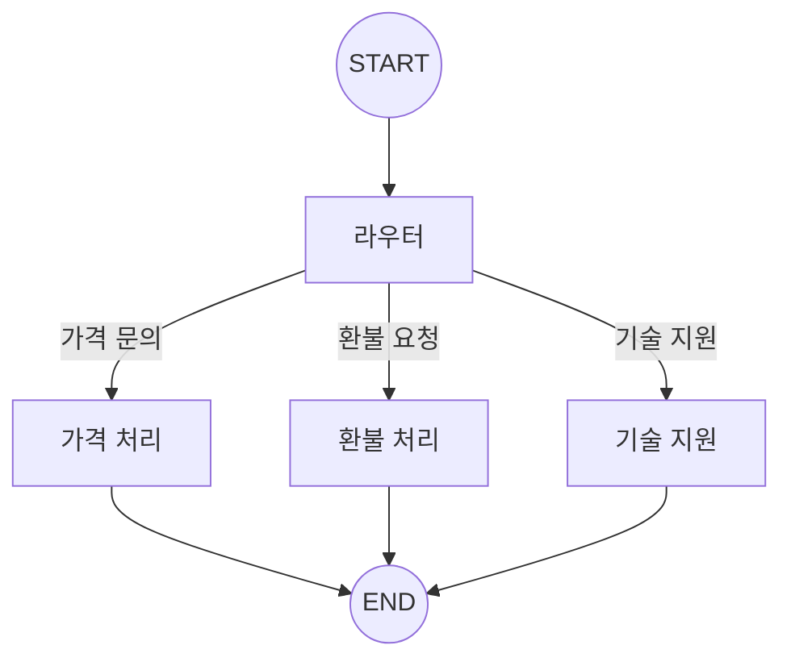

# Chapter 6: 조건부 라우팅

> 📌 **학습 목표**: 이 장을 마치면 조건부 엣지를 활용한 라우팅, Structured Output 기반 라우팅, Command 객체를 사용한 제어 흐름을 구현할 수 있습니다.

## 개요

**조건부 라우팅(Routing)**은 입력을 처리한 후 상황에 맞는 작업으로 연결하는 패턴입니다. 복잡한 작업을 특화된 흐름으로 분리할 수 있어, 효율적이고 정확한 처리가 가능합니다.



## 핵심 개념

### 라우팅 방법 3가지

1. **함수 기반 라우팅**: 직접 작성한 조건 함수
2. **Structured Output 라우팅**: LLM이 구조화된 출력으로 경로 결정
3. **Command 객체 라우팅**: 상태 업데이트와 라우팅을 동시에 처리

## 실습 1: 함수 기반 라우팅

가장 기본적인 방법으로, 상태를 검사하여 다음 노드를 결정합니다.

```python
# 📁 src/part2_workflows/06_routing.py
from typing import TypedDict, Literal
from langgraph.graph import StateGraph, START, END


class QueryState(TypedDict):
    query: str
    category: str
    response: str


def classify_query(state: QueryState) -> dict:
    """쿼리 분류"""
    query = state["query"].lower()

    if "가격" in query or "비용" in query:
        category = "pricing"
    elif "환불" in query or "반품" in query:
        category = "refund"
    elif "오류" in query or "버그" in query:
        category = "technical"
    else:
        category = "general"

    return {"category": category}


def route_by_category(state: QueryState) -> Literal["pricing", "refund", "technical", "general"]:
    """카테고리에 따라 라우팅"""
    return state["category"]


def handle_pricing(state: QueryState) -> dict:
    return {"response": f"💰 가격 관련 답변: {state['query']}에 대한 가격 정보입니다."}


def handle_refund(state: QueryState) -> dict:
    return {"response": f"🔄 환불 관련 답변: {state['query']}에 대한 환불 절차입니다."}


def handle_technical(state: QueryState) -> dict:
    return {"response": f"🔧 기술 지원 답변: {state['query']}에 대한 해결책입니다."}


def handle_general(state: QueryState) -> dict:
    return {"response": f"📋 일반 답변: {state['query']}에 대한 정보입니다."}


# 그래프 구성
graph = StateGraph(QueryState)

graph.add_node("classify", classify_query)
graph.add_node("pricing", handle_pricing)
graph.add_node("refund", handle_refund)
graph.add_node("technical", handle_technical)
graph.add_node("general", handle_general)

graph.add_edge(START, "classify")
graph.add_conditional_edges("classify", route_by_category)
graph.add_edge("pricing", END)
graph.add_edge("refund", END)
graph.add_edge("technical", END)
graph.add_edge("general", END)

app = graph.compile()
```

> 💡 **전체 코드**: [src/part2_workflows/06_routing.py](../../src/part2_workflows/06_routing.py)

## 실습 2: Structured Output 라우팅

LLM의 구조화된 출력을 사용하여 더 정교한 라우팅을 수행합니다.

```python
from pydantic import BaseModel, Field
from langchain_anthropic import ChatAnthropic


class RouteDecision(BaseModel):
    """라우팅 결정을 위한 스키마"""
    next_step: Literal["poem", "story", "joke"] = Field(
        description="다음 실행할 단계"
    )
    reasoning: str = Field(
        description="이 결정을 내린 이유"
    )


llm = ChatAnthropic(model="claude-sonnet-4-5-20250929")
router_llm = llm.with_structured_output(RouteDecision)


def llm_router(state: QueryState) -> dict:
    """LLM을 사용한 라우팅"""
    decision = router_llm.invoke(
        f"사용자 요청을 분석하고 적절한 처리 방법을 선택하세요: {state['query']}"
    )
    return {"category": decision.next_step}
```

## 실습 3: Command 객체 라우팅

**Command** 객체를 사용하면 상태 업데이트와 라우팅을 하나의 반환값으로 처리할 수 있습니다.

```python
from langgraph.types import Command


def process_with_command(state: QueryState) -> Command[Literal["handler_a", "handler_b"]]:
    """Command를 사용한 라우팅"""

    # 분석 수행
    is_urgent = "긴급" in state["query"]

    # 상태 업데이트와 라우팅을 동시에
    if is_urgent:
        return Command(
            update={"category": "urgent", "priority": "high"},
            goto="handler_a"
        )
    else:
        return Command(
            update={"category": "normal", "priority": "low"},
            goto="handler_b"
        )
```

### Command의 장점

1. **결합성**: 상태 업데이트 + 라우팅을 한 번에
2. **타입 안전성**: `Command[Literal[...]]`로 가능한 경로 명시
3. **명확성**: 노드의 역할과 전환이 명확하게 드러남

## 고급 패턴: 다중 라우팅

여러 조건을 조합한 복잡한 라우팅:

```python
from typing import List


def multi_route(state: QueryState) -> List[str]:
    """여러 노드로 동시에 라우팅 (병렬 실행)"""
    routes = []

    if "분석" in state["query"]:
        routes.append("analyzer")
    if "저장" in state["query"]:
        routes.append("saver")
    if "알림" in state["query"]:
        routes.append("notifier")

    return routes if routes else ["default"]


# 조건부 엣지에서 리스트 반환 시 병렬 실행
graph.add_conditional_edges("processor", multi_route)
```

## 에러 핸들링과 폴백

라우팅 실패 시 폴백 처리:

```python
def safe_router(state: QueryState) -> str:
    """안전한 라우팅 - 폴백 포함"""
    try:
        category = determine_category(state["query"])
        if category in ["pricing", "refund", "technical"]:
            return category
        return "general"  # 알 수 없는 카테고리는 general로
    except Exception:
        return "error_handler"  # 오류 시 에러 핸들러로


graph.add_conditional_edges(
    "classify",
    safe_router,
    {
        "pricing": "pricing",
        "refund": "refund",
        "technical": "technical",
        "general": "general",
        "error_handler": "error_handler"
    }
)
```

## 요약

- **함수 기반 라우팅**: 간단한 조건 분기에 적합
- **Structured Output 라우팅**: LLM의 판단이 필요한 복잡한 분류
- **Command 객체**: 상태 업데이트와 라우팅을 동시에 처리
- **다중 라우팅**: 리스트 반환으로 병렬 실행 트리거
- **폴백 처리**: 예외 상황에 대한 안전한 처리

## 다음 단계

다음 장에서는 **병렬 실행**을 학습합니다. Fan-out/Fan-in 패턴과 Send API를 다룹니다.

👉 [Chapter 7: 병렬 실행](./07-parallel-execution.md)

---

## 📚 참고 자료

### 공식 문서
- [Workflows and Agents - Routing (공식 온라인)](https://docs.langchain.com/oss/python/langgraph/workflows-agents#routing) - 라우팅 가이드
- [Graph API - Conditional Edges (공식 온라인)](https://docs.langchain.com/oss/python/langgraph/graph-api#conditional-edges) - 조건부 엣지

### 실습 코드
- [전체 소스](../../src/part2_workflows/06_routing.py) - 실행 가능한 전체 코드

### 관련 챕터
- [이전: Chapter 5 - 워크플로우 패턴 개요](./05-workflow-patterns.md)
- [다음: Chapter 7 - 병렬 실행](./07-parallel-execution.md)
