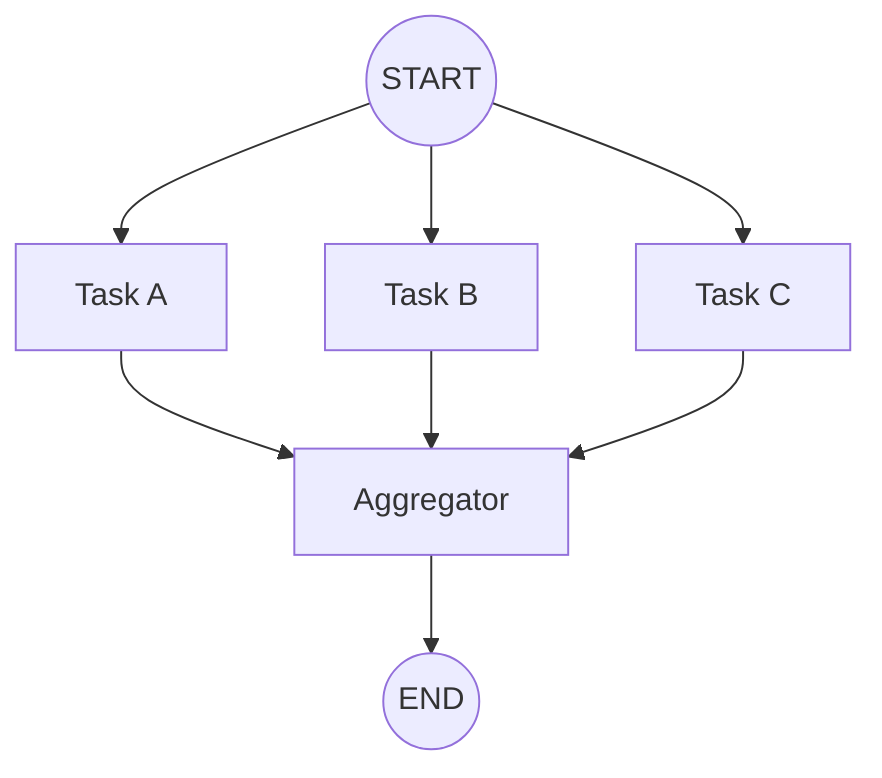

# Chapter 7: 병렬 실행

> 📌 **학습 목표**: 이 장을 마치면 병렬 노드 실행 원리를 이해하고, Fan-out/Fan-in 패턴과 Send API를 활용할 수 있습니다.

## 개요

**병렬 실행(Parallelization)**은 여러 LLM 호출이 동시에 작업을 수행하는 패턴입니다. 독립적인 서브태스크를 동시에 실행하거나, 같은 태스크를 여러 번 실행하여 다양한 출력을 비교할 때 사용합니다.



## 핵심 개념

### 병렬 실행이 유용한 경우

| 사용 사례 | 설명 |
|----------|------|
| **속도 향상** | 독립적인 서브태스크를 동시에 실행 |
| **신뢰도 향상** | 같은 태스크를 여러 번 실행하여 결과 비교 |
| **다중 관점** | 다양한 전문가 관점에서 분석 |

### Fan-out / Fan-in 패턴

- **Fan-out**: 하나의 노드에서 여러 노드로 분기
- **Fan-in**: 여러 노드의 결과를 하나로 수집

## 실습 1: 기본 병렬 실행

여러 노드가 동시에 실행되고 결과가 집계되는 패턴입니다.

```python
# 📁 src/part2_workflows/07_parallelization.py
from typing import TypedDict, Annotated
from operator import add
from langgraph.graph import StateGraph, START, END


class ParallelState(TypedDict):
    topic: str
    joke: str
    story: str
    poem: str
    combined: str


def generate_joke(state: ParallelState) -> dict:
    """농담 생성"""
    return {"joke": f"[농담] {state['topic']}에 대한 재미있는 이야기..."}


def generate_story(state: ParallelState) -> dict:
    """스토리 생성"""
    return {"story": f"[스토리] {state['topic']}에 대한 짧은 이야기..."}


def generate_poem(state: ParallelState) -> dict:
    """시 생성"""
    return {"poem": f"[시] {state['topic']}에 대한 아름다운 시..."}


def aggregate(state: ParallelState) -> dict:
    """결과 집계"""
    combined = f"""
=== {state['topic']}에 대한 창작물 ===

📖 스토리:
{state['story']}

😄 농담:
{state['joke']}

🎭 시:
{state['poem']}
"""
    return {"combined": combined}


# 그래프 구성
graph = StateGraph(ParallelState)

graph.add_node("joke", generate_joke)
graph.add_node("story", generate_story)
graph.add_node("poem", generate_poem)
graph.add_node("aggregate", aggregate)

# Fan-out: START에서 세 노드로 동시에
graph.add_edge(START, "joke")
graph.add_edge(START, "story")
graph.add_edge(START, "poem")

# Fan-in: 세 노드에서 aggregate로
graph.add_edge("joke", "aggregate")
graph.add_edge("story", "aggregate")
graph.add_edge("poem", "aggregate")

graph.add_edge("aggregate", END)

app = graph.compile()

# 실행
result = app.invoke({"topic": "고양이"})
print(result["combined"])
```

> 💡 **전체 코드**: [src/part2_workflows/07_parallelization.py](../../src/part2_workflows/07_parallelization.py)

## 실습 2: Send API를 사용한 동적 병렬 실행

**Send API**는 런타임에 동적으로 병렬 작업을 생성할 때 사용합니다. 작업 수가 미리 정해지지 않은 경우에 유용합니다.

```python
from langgraph.types import Send
from langgraph.constants import START


class DynamicState(TypedDict):
    items: list[str]
    results: Annotated[list[str], add]


def orchestrator(state: DynamicState) -> list[Send]:
    """동적으로 워커 생성"""
    # 각 아이템에 대해 워커 노드로 Send
    return [
        Send("worker", {"item": item, "results": []})
        for item in state["items"]
    ]


def worker(state: dict) -> dict:
    """개별 아이템 처리"""
    item = state["item"]
    result = f"처리됨: {item.upper()}"
    return {"results": [result]}


# 그래프 구성
graph = StateGraph(DynamicState)

graph.add_node("orchestrator", orchestrator)
graph.add_node("worker", worker)

graph.add_edge(START, "orchestrator")
graph.add_conditional_edges("orchestrator", lambda _: [])  # Send가 라우팅 처리
graph.add_edge("worker", END)

app = graph.compile()

# 동적 아이템 수로 실행
result = app.invoke({
    "items": ["apple", "banana", "cherry", "date"],
    "results": []
})
print(result["results"])
# ['처리됨: APPLE', '처리됨: BANANA', '처리됨: CHERRY', '처리됨: DATE']
```

### Send API 상세

```python
from langgraph.types import Send

# Send(노드_이름, 해당_노드에_전달할_상태)
Send("worker", {"item": "data", "config": {...}})
```

**특징:**
- 런타임에 동적으로 노드 호출 생성
- 각 Send는 독립적인 상태를 가짐
- 모든 Send가 완료될 때까지 다음 단계로 진행하지 않음

## 실습 3: 결과 집계 패턴

병렬 작업의 결과를 효과적으로 집계하는 방법들:

### Reducer를 사용한 자동 집계

```python
class AggregateState(TypedDict):
    items: list[str]
    # Annotated + add로 자동 리스트 병합
    results: Annotated[list[dict], add]
    # 최종 집계 결과
    summary: str


def worker_a(state: AggregateState) -> dict:
    return {"results": [{"source": "A", "score": 85}]}


def worker_b(state: AggregateState) -> dict:
    return {"results": [{"source": "B", "score": 92}]}


def summarize(state: AggregateState) -> dict:
    """집계된 결과를 요약"""
    total_score = sum(r["score"] for r in state["results"])
    avg_score = total_score / len(state["results"])
    return {
        "summary": f"평균 점수: {avg_score:.1f} (총 {len(state['results'])}개 결과)"
    }
```

### 커스텀 집계 로직

```python
def voting_reducer(current: dict, new: dict) -> dict:
    """투표 기반 집계"""
    for key, value in new.items():
        current[key] = current.get(key, 0) + value
    return current


class VotingState(TypedDict):
    votes: Annotated[dict, voting_reducer]
```

## 병렬 실행 시 주의사항

### 1. 상태 충돌 방지

```python
# ❌ 나쁜 예: 같은 키를 덮어쓰기
def worker_bad(state) -> dict:
    return {"result": "my result"}  # 충돌!

# ✅ 좋은 예: Reducer 사용
class State(TypedDict):
    results: Annotated[list, add]

def worker_good(state) -> dict:
    return {"results": ["my result"]}  # 리스트로 누적
```

### 2. 에러 핸들링

```python
def safe_worker(state: dict) -> dict:
    """에러 처리가 포함된 워커"""
    try:
        result = process_item(state["item"])
        return {"results": [{"success": True, "data": result}]}
    except Exception as e:
        return {"results": [{"success": False, "error": str(e)}]}
```

### 3. 타임아웃 고려

긴 작업의 경우 타임아웃을 설정하세요. LangGraph의 기본 설정을 사용하거나 개별 노드에서 처리합니다.

## 요약

- **병렬 실행**: 독립적인 작업을 동시에 수행하여 속도/신뢰도 향상
- **Fan-out/Fan-in**: 분기와 집계 패턴
- **Send API**: 런타임에 동적으로 병렬 작업 생성
- **Reducer**: 병렬 결과를 자동으로 집계
- **주의사항**: 상태 충돌 방지, 에러 핸들링, 타임아웃

## 다음 단계

다음 장에서는 **Orchestrator-Worker 패턴**을 학습합니다. 복잡한 작업을 동적으로 분배하고 관리하는 방법을 다룹니다.

👉 [Chapter 8: Orchestrator-Worker 패턴](./08-orchestrator-worker.md)

---

## 📚 참고 자료

### 공식 문서
- [Workflows and Agents - Parallelization (공식 온라인)](https://docs.langchain.com/oss/python/langgraph/workflows-agents#parallelization) - 병렬화 가이드
- [Graph API - Send (공식 온라인)](https://docs.langchain.com/oss/python/langgraph/graph-api#send) - Send API

### 실습 코드
- [전체 소스](../../src/part2_workflows/07_parallelization.py) - 실행 가능한 전체 코드

### 관련 챕터
- [이전: Chapter 6 - 조건부 라우팅](./06-conditional-routing.md)
- [다음: Chapter 8 - Orchestrator-Worker 패턴](./08-orchestrator-worker.md)
