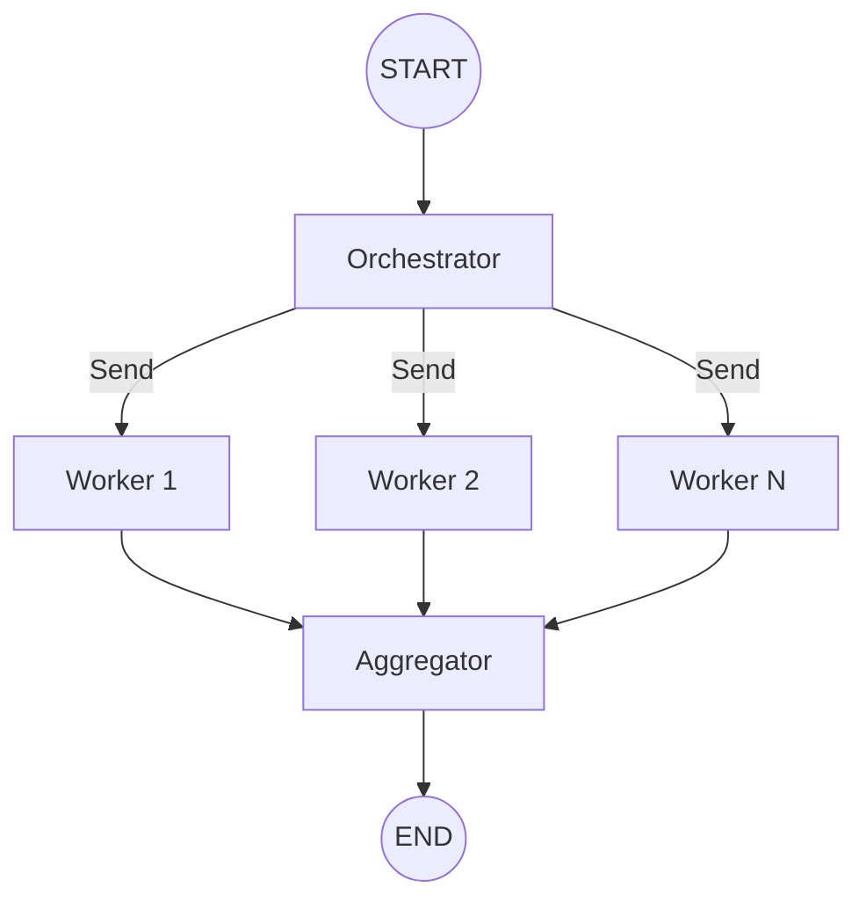
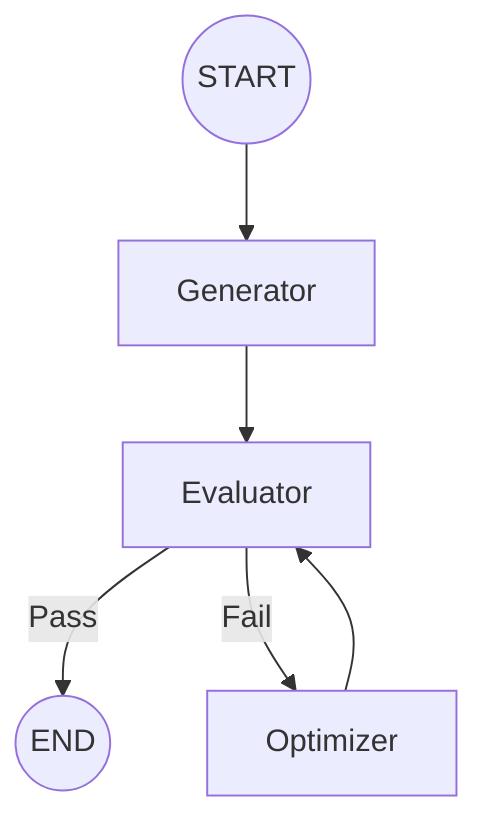

# Chapter 8: Orchestrator-Worker 패턴

> 📌 **학습 목표**: 이 장을 마치면 Orchestrator-Worker 아키텍처와 Evaluator-Optimizer 패턴을 구현할 수 있습니다.

## 개요

**Orchestrator-Worker 패턴**은 중앙 조정자(Orchestrator)가 작업을 분배하고, 여러 워커(Worker)가 이를 병렬로 처리하는 아키텍처입니다. 복잡한 작업을 동적으로 분해하고 관리할 때 사용합니다.



## 핵심 개념

### Orchestrator-Worker vs 단순 병렬

| 특성 | 단순 병렬 | Orchestrator-Worker |
|------|----------|---------------------|
| **워커 수** | 정적 (코드에 고정) | 동적 (런타임에 결정) |
| **작업 분배** | 수동 | Orchestrator가 자동 분배 |
| **복잡도** | 낮음 | 중간~높음 |
| **유연성** | 낮음 | 높음 |

## 실습 1: Orchestrator-Worker 구현

문서를 여러 섹션으로 나누어 병렬 처리하는 예제입니다.

```python
# 📁 src/part2_workflows/08_orchestrator_worker.py
from typing import TypedDict, Annotated, List
from operator import add
from langgraph.graph import StateGraph, START, END
from langgraph.types import Send


class OrchestratorState(TypedDict):
    """Orchestrator 상태"""
    document: str
    sections: List[str]
    processed: Annotated[List[dict], add]
    summary: str


class WorkerState(TypedDict):
    """Worker 상태"""
    section: str
    section_index: int
    processed: List[dict]


def orchestrator(state: OrchestratorState) -> List[Send]:
    """
    문서를 섹션으로 분할하고 워커에 분배

    Returns:
        각 섹션을 처리할 Send 객체 리스트
    """
    # 문서를 섹션으로 분할 (실제로는 LLM 사용)
    sections = state["document"].split("\n\n")

    # 각 섹션에 대해 워커 생성
    return [
        Send("worker", {
            "section": section,
            "section_index": i,
            "processed": []
        })
        for i, section in enumerate(sections)
        if section.strip()
    ]


def worker(state: WorkerState) -> dict:
    """
    개별 섹션 처리

    Args:
        state: 워커 상태 (섹션 정보 포함)

    Returns:
        처리된 섹션 결과
    """
    section = state["section"]

    # 섹션 분석 (실제로는 LLM 사용)
    word_count = len(section.split())
    sentiment = "positive" if "good" in section.lower() else "neutral"

    return {
        "processed": [{
            "index": state["section_index"],
            "word_count": word_count,
            "sentiment": sentiment,
            "summary": section[:50] + "..."
        }]
    }


def aggregator(state: OrchestratorState) -> dict:
    """
    모든 워커 결과를 집계

    Args:
        state: 집계된 상태

    Returns:
        최종 요약
    """
    # 결과를 인덱스 순으로 정렬
    sorted_results = sorted(state["processed"], key=lambda x: x["index"])

    total_words = sum(r["word_count"] for r in sorted_results)
    sentiments = [r["sentiment"] for r in sorted_results]

    summary = f"""
📊 문서 분석 결과:
- 총 섹션 수: {len(sorted_results)}
- 총 단어 수: {total_words}
- 감정 분포: {dict((s, sentiments.count(s)) for s in set(sentiments))}
"""
    return {"summary": summary}


# 그래프 구성
graph = StateGraph(OrchestratorState)

graph.add_node("orchestrator", orchestrator)
graph.add_node("worker", worker)
graph.add_node("aggregator", aggregator)

graph.add_edge(START, "orchestrator")
graph.add_conditional_edges("orchestrator", lambda x: [])  # Send가 라우팅
graph.add_edge("worker", "aggregator")
graph.add_edge("aggregator", END)

app = graph.compile()
```

> 💡 **전체 코드**: [src/part2_workflows/08_orchestrator_worker.py](../../src/part2_workflows/08_orchestrator_worker.py)

## 실습 2: Evaluator-Optimizer 패턴

**Evaluator-Optimizer**는 결과를 평가하고, 기준에 미달하면 다시 최적화하는 피드백 루프 패턴입니다.



```python
# 📁 src/part2_workflows/09_evaluator_optimizer.py
from typing import TypedDict, Literal
from langgraph.graph import StateGraph, START, END


class OptimizerState(TypedDict):
    """최적화 워크플로우 상태"""
    task: str
    result: str
    score: int
    iteration: int
    feedback: str


def generator(state: OptimizerState) -> dict:
    """초기 결과 생성"""
    # 실제로는 LLM 사용
    return {
        "result": f"[v1] {state['task']}에 대한 초기 결과",
        "iteration": 1
    }


def evaluator(state: OptimizerState) -> dict:
    """결과 평가"""
    # 실제로는 LLM 또는 평가 로직 사용
    # 예시: 길이 기반 점수
    score = min(len(state["result"]) * 2, 100)

    feedback = ""
    if score < 70:
        feedback = "더 상세한 설명이 필요합니다."
    elif score < 90:
        feedback = "좋지만 예시를 추가하면 더 좋겠습니다."

    return {"score": score, "feedback": feedback}


def route_by_score(state: OptimizerState) -> Literal["optimize", "end"]:
    """점수에 따라 라우팅"""
    # 90점 이상이거나 3회 이상 반복하면 종료
    if state["score"] >= 90 or state["iteration"] >= 3:
        return "end"
    return "optimize"


def optimizer(state: OptimizerState) -> dict:
    """피드백 기반 최적화"""
    # 실제로는 LLM 사용
    current = state["result"]
    feedback = state["feedback"]
    iteration = state["iteration"]

    optimized = f"[v{iteration + 1}] {current} + 피드백 반영: {feedback}"

    return {
        "result": optimized,
        "iteration": iteration + 1
    }


# 그래프 구성
graph = StateGraph(OptimizerState)

graph.add_node("generator", generator)
graph.add_node("evaluator", evaluator)
graph.add_node("optimizer", optimizer)

graph.add_edge(START, "generator")
graph.add_edge("generator", "evaluator")
graph.add_conditional_edges(
    "evaluator",
    route_by_score,
    {"optimize": "optimizer", "end": END}
)
graph.add_edge("optimizer", "evaluator")

app = graph.compile()

# 실행
result = app.invoke({
    "task": "LangGraph 설명",
    "result": "",
    "score": 0,
    "iteration": 0,
    "feedback": ""
})

print(f"최종 점수: {result['score']}")
print(f"반복 횟수: {result['iteration']}")
print(f"최종 결과: {result['result']}")
```

> 💡 **전체 코드**: [src/part2_workflows/09_evaluator_optimizer.py](../../src/part2_workflows/09_evaluator_optimizer.py)

## 고급 패턴: LLM 기반 Orchestrator

실제 프로덕션에서는 Orchestrator가 LLM을 사용하여 동적으로 작업을 분해합니다:

```python
from pydantic import BaseModel, Field
from typing import List


class TaskPlan(BaseModel):
    """작업 계획 스키마"""
    subtasks: List[str] = Field(description="분해된 서브태스크 목록")
    reasoning: str = Field(description="이렇게 분해한 이유")


llm_planner = llm.with_structured_output(TaskPlan)


def llm_orchestrator(state: OrchestratorState) -> List[Send]:
    """LLM을 사용한 동적 작업 분해"""
    plan = llm_planner.invoke(
        f"다음 작업을 병렬로 처리할 수 있는 서브태스크로 분해하세요: {state['task']}"
    )

    return [
        Send("worker", {"subtask": subtask, "index": i, "results": []})
        for i, subtask in enumerate(plan.subtasks)
    ]
```

## 에러 핸들링

Orchestrator-Worker 패턴에서의 에러 처리:

```python
def resilient_worker(state: WorkerState) -> dict:
    """탄력적인 워커 - 에러 복구 포함"""
    max_retries = 3

    for attempt in range(max_retries):
        try:
            result = process_section(state["section"])
            return {"processed": [{"success": True, "data": result}]}
        except Exception as e:
            if attempt == max_retries - 1:
                return {
                    "processed": [{
                        "success": False,
                        "error": str(e),
                        "section": state["section_index"]
                    }]
                }
            # 재시도 전 잠시 대기 (실제로는 exponential backoff)
            continue
```

## 요약

- **Orchestrator-Worker**: 중앙 조정자가 작업을 동적으로 분배하고 워커가 병렬 처리
- **Send API**: 런타임에 동적으로 워커 생성
- **Evaluator-Optimizer**: 평가 → 최적화 피드백 루프
- **LLM Orchestrator**: LLM이 작업을 지능적으로 분해
- **에러 핸들링**: 재시도, 폴백, 부분 실패 처리

## Part 2 완료!

축하합니다! Part 2 워크플로우 패턴을 모두 학습했습니다. 다음 Part 3에서는 **AI Agent**를 구현합니다.

👉 [Part 3 - Chapter 9: 도구와 에이전트](../Part3-Agent/09-tools-and-agents.md)

---

## 📚 참고 자료

### 공식 문서
- [Workflows and Agents - Orchestrator-Worker (공식 온라인)](https://docs.langchain.com/oss/python/langgraph/workflows-agents#orchestrator-worker) - 패턴 가이드
- [Workflows and Agents - Evaluator-Optimizer (공식 온라인)](https://docs.langchain.com/oss/python/langgraph/workflows-agents#evaluator-optimizer) - 평가자-최적화 패턴

### 실습 코드
- [Orchestrator-Worker 소스](../../src/part2_workflows/08_orchestrator_worker.py)
- [Evaluator-Optimizer 소스](../../src/part2_workflows/09_evaluator_optimizer.py)

### 관련 챕터
- [이전: Chapter 7 - 병렬 실행](./07-parallel-execution.md)
- [다음: Part 3 - Chapter 9 - 도구와 에이전트](../Part3-Agent/09-tools-and-agents.md)
