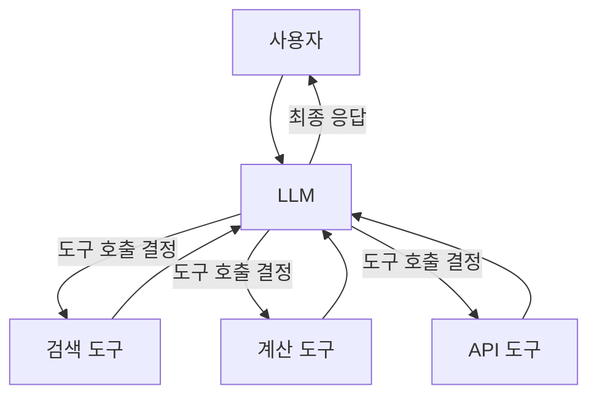

# Chapter 9: 도구와 에이전트

> 📌 **학습 목표**: 이 장을 마치면 Tool을 정의하고, LLM에 바인딩하며, Tool 호출을 처리하는 Agent를 구현할 수 있습니다.

## 개요

**도구(Tool)**는 AI Agent가 외부 세계와 상호작용하는 수단입니다. LLM 자체로는 정보 조회, 계산, API 호출 등을 수행할 수 없지만, 도구를 통해 이러한 기능을 확장할 수 있습니다.



## 핵심 개념

### Tool이란?

Tool은 LLM이 호출할 수 있는 함수입니다. LLM은 사용자 요청을 분석하여:
1. 어떤 도구를 사용할지 결정
2. 도구에 전달할 인자 생성
3. 도구 실행 결과를 받아 응답 생성

### Tool Calling의 흐름

1. **바인딩**: LLM에 사용 가능한 도구 정보 전달
2. **판단**: LLM이 도구 호출 필요 여부 결정
3. **실행**: 도구 함수 실제 실행
4. **응답**: 결과를 LLM에 전달하여 최종 응답 생성

## 실습 1: 기본 Tool 정의

### @tool 데코레이터 사용

```python
# 📁 src/part3_agent/09_tool_calling.py
from langchain_core.tools import tool


@tool
def search(query: str) -> str:
    """웹에서 정보를 검색합니다.

    Args:
        query: 검색할 쿼리 문자열

    Returns:
        검색 결과 문자열
    """
    # 실제로는 검색 API를 호출
    return f"'{query}'에 대한 검색 결과: AI는 인공지능의 약자입니다."


@tool
def calculator(expression: str) -> str:
    """수학 표현식을 계산합니다.

    Args:
        expression: 계산할 수학 표현식 (예: "2 + 3 * 4")

    Returns:
        계산 결과
    """
    try:
        result = eval(expression)  # 주의: 실제 프로덕션에서는 안전한 파서 사용
        return f"계산 결과: {result}"
    except Exception as e:
        return f"계산 오류: {e}"


# 도구 목록
tools = [search, calculator]
```

### Tool의 구조

```python
# Tool 속성 확인
print(f"도구 이름: {search.name}")
print(f"도구 설명: {search.description}")
print(f"입력 스키마: {search.args_schema.schema()}")
```

## 실습 2: LLM에 Tool 바인딩

```python
from langchain_anthropic import ChatAnthropic

# LLM 초기화
llm = ChatAnthropic(model="claude-sonnet-4-5-20250929", temperature=0)

# 도구 바인딩
llm_with_tools = llm.bind_tools(tools)

# 도구 호출 테스트
response = llm_with_tools.invoke("2 더하기 3은 뭐야?")
print(response.tool_calls)
# [{'name': 'calculator', 'args': {'expression': '2 + 3'}, 'id': '...'}]
```

### Tool Call 구조

```python
# response.tool_calls는 리스트
for tool_call in response.tool_calls:
    print(f"도구: {tool_call['name']}")
    print(f"인자: {tool_call['args']}")
    print(f"ID: {tool_call['id']}")
```

## 실습 3: ToolNode로 도구 실행

LangGraph는 `ToolNode`를 제공하여 도구 실행을 쉽게 처리합니다.

```python
from typing import Annotated
from typing_extensions import TypedDict
from langgraph.graph import StateGraph, START, END
from langgraph.graph.message import add_messages
from langgraph.prebuilt import ToolNode


class AgentState(TypedDict):
    messages: Annotated[list, add_messages]


# ToolNode 생성 - 도구 목록 전달
tool_node = ToolNode(tools)


def call_model(state: AgentState):
    """LLM 호출"""
    messages = state["messages"]
    response = llm_with_tools.invoke(messages)
    return {"messages": [response]}


def should_continue(state: AgentState) -> str:
    """도구 호출 여부에 따라 라우팅"""
    messages = state["messages"]
    last_message = messages[-1]

    # 도구 호출이 있으면 tools 노드로
    if last_message.tool_calls:
        return "tools"
    # 없으면 종료
    return "end"


# 그래프 구성
graph = StateGraph(AgentState)

graph.add_node("agent", call_model)
graph.add_node("tools", tool_node)

graph.add_edge(START, "agent")
graph.add_conditional_edges(
    "agent",
    should_continue,
    {
        "tools": "tools",
        "end": END
    }
)
graph.add_edge("tools", "agent")

app = graph.compile()
```

> 💡 **전체 코드**: [src/part3_agent/09_tool_calling.py](../../src/part3_agent/09_tool_calling.py)

## 실습 4: Pydantic을 사용한 Tool 정의

더 복잡한 입력 스키마가 필요할 때 Pydantic을 사용합니다.

```python
from pydantic import BaseModel, Field
from langchain_core.tools import StructuredTool


class WeatherInput(BaseModel):
    """날씨 조회 입력"""
    city: str = Field(description="도시 이름")
    unit: str = Field(default="celsius", description="온도 단위 (celsius 또는 fahrenheit)")


def get_weather(city: str, unit: str = "celsius") -> str:
    """특정 도시의 날씨를 조회합니다."""
    # 실제로는 날씨 API 호출
    return f"{city}의 현재 기온: 20도 ({unit})"


weather_tool = StructuredTool.from_function(
    func=get_weather,
    name="get_weather",
    description="특정 도시의 현재 날씨를 조회합니다",
    args_schema=WeatherInput
)
```

## 실습 5: 다양한 Tool 유형

### 비동기 Tool

```python
import asyncio
from langchain_core.tools import tool


@tool
async def async_search(query: str) -> str:
    """비동기로 검색을 수행합니다."""
    await asyncio.sleep(1)  # 비동기 작업 시뮬레이션
    return f"비동기 검색 결과: {query}"
```

### 에러 처리가 있는 Tool

```python
@tool
def divide(a: float, b: float) -> str:
    """두 숫자를 나눕니다.

    Args:
        a: 피제수
        b: 제수 (0이 아니어야 함)
    """
    if b == 0:
        raise ValueError("0으로 나눌 수 없습니다")
    return str(a / b)
```

### 복잡한 반환값을 가진 Tool

```python
from typing import List, Dict


@tool
def search_products(
    keyword: str,
    max_price: float = 100000,
    category: str = None
) -> List[Dict]:
    """상품을 검색합니다.

    Args:
        keyword: 검색 키워드
        max_price: 최대 가격
        category: 카테고리 필터

    Returns:
        검색된 상품 목록
    """
    # 실제로는 DB 또는 API 조회
    return [
        {"name": "상품 A", "price": 10000},
        {"name": "상품 B", "price": 20000}
    ]
```

## 고급 패턴: Tool 실행 결과 처리

### ToolMessage 직접 생성

```python
from langchain_core.messages import ToolMessage


def custom_tool_node(state: AgentState):
    """커스텀 도구 실행 노드"""
    messages = state["messages"]
    last_message = messages[-1]

    tool_results = []
    for tool_call in last_message.tool_calls:
        # 도구 찾기
        tool_fn = next(
            (t for t in tools if t.name == tool_call["name"]),
            None
        )

        if tool_fn:
            # 도구 실행
            result = tool_fn.invoke(tool_call["args"])
        else:
            result = f"알 수 없는 도구: {tool_call['name']}"

        # ToolMessage 생성
        tool_results.append(
            ToolMessage(
                content=str(result),
                tool_call_id=tool_call["id"]
            )
        )

    return {"messages": tool_results}
```

### 도구 실행 실패 처리

```python
def safe_tool_node(state: AgentState):
    """에러 처리가 있는 도구 노드"""
    messages = state["messages"]
    last_message = messages[-1]

    tool_results = []
    for tool_call in last_message.tool_calls:
        try:
            tool_fn = next(t for t in tools if t.name == tool_call["name"])
            result = tool_fn.invoke(tool_call["args"])
        except StopIteration:
            result = f"오류: 알 수 없는 도구 '{tool_call['name']}'"
        except Exception as e:
            result = f"도구 실행 오류: {str(e)}"

        tool_results.append(
            ToolMessage(
                content=str(result),
                tool_call_id=tool_call["id"]
            )
        )

    return {"messages": tool_results}
```

## 요약

- **Tool 정의**: `@tool` 데코레이터로 간단히 정의, Pydantic으로 복잡한 스키마 지원
- **Tool 바인딩**: `llm.bind_tools(tools)`로 LLM에 도구 정보 전달
- **ToolNode**: LangGraph의 내장 도구 실행 노드
- **Tool Call 처리**: `response.tool_calls`에서 호출 정보 추출
- **ToolMessage**: 도구 실행 결과를 LLM에 전달하는 메시지 타입

## 다음 단계

다음 장에서는 도구를 활용한 **ReAct Agent**를 구현합니다. 완전한 Agent 루프와 조건부 실행을 학습합니다.

👉 [Chapter 10: ReAct Agent 구현](./10-react-agent.md)

---

## 📚 참고 자료

### 공식 문서
- [Workflows and Agents (공식 온라인)](https://docs.langchain.com/oss/python/langgraph/workflows-agents) - 에이전트 가이드
- [ToolNode (공식 온라인)](https://docs.langchain.com/oss/python/langgraph/prebuilt#toolnode) - ToolNode 레퍼런스

### 실습 코드
- [전체 소스](../../src/part3_agent/09_tool_calling.py) - 실행 가능한 전체 코드

### 관련 챕터
- [이전: Chapter 8 - Orchestrator-Worker 패턴](../Part2-Workflows/08-orchestrator-worker.md)
- [다음: Chapter 10 - ReAct Agent 구현](./10-react-agent.md)
