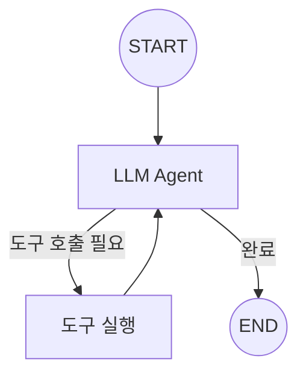

# Chapter 10: ReAct Agent 구현

> 📌 **학습 목표**: 이 장을 마치면 ReAct 패턴을 이해하고, 완전한 Agent 루프를 구현할 수 있습니다.

## 개요

**ReAct (Reasoning + Acting)**는 LLM이 추론과 행동을 번갈아 수행하는 Agent 패턴입니다. LLM이 상황을 분석하고, 필요한 도구를 호출하며, 결과를 바탕으로 다음 행동을 결정합니다.



## 핵심 개념

### ReAct 패턴의 작동 방식

1. **Reasoning (추론)**: LLM이 현재 상황을 분석하고 다음 행동을 계획
2. **Acting (행동)**: 계획에 따라 도구 호출 또는 최종 응답 생성
3. **Observation (관찰)**: 도구 실행 결과를 받아 다음 추론에 활용

### Agent 루프의 구성요소

| 구성요소 | 역할 |
|---------|------|
| **LLM 노드** | 추론 및 도구 호출 결정 |
| **Tool 노드** | 도구 실행 |
| **조건부 엣지** | 루프 계속 또는 종료 판단 |

## 실습 1: 기본 ReAct Agent

```python
# 📁 src/part3_agent/10_react_agent.py
from typing import Annotated
from typing_extensions import TypedDict
from dotenv import load_dotenv

from langchain_anthropic import ChatAnthropic
from langchain_core.tools import tool
from langgraph.graph import StateGraph, START, END
from langgraph.graph.message import add_messages
from langgraph.prebuilt import ToolNode


load_dotenv()


# ============================================================
# 1. State 정의
# ============================================================

class AgentState(TypedDict):
    """ReAct Agent의 상태"""
    messages: Annotated[list, add_messages]


# ============================================================
# 2. 도구 정의
# ============================================================

@tool
def search(query: str) -> str:
    """웹에서 정보를 검색합니다."""
    # 실제로는 검색 API 호출
    if "날씨" in query:
        return "서울의 현재 날씨: 맑음, 기온 22도"
    elif "뉴스" in query:
        return "오늘의 주요 뉴스: AI 기술 발전 가속화"
    return f"'{query}'에 대한 검색 결과입니다."


@tool
def calculator(expression: str) -> str:
    """수학 계산을 수행합니다."""
    try:
        result = eval(expression)
        return f"계산 결과: {result}"
    except Exception as e:
        return f"계산 오류: {e}"


tools = [search, calculator]


# ============================================================
# 3. LLM 및 노드 설정
# ============================================================

llm = ChatAnthropic(model="claude-sonnet-4-5-20250929", temperature=0)
llm_with_tools = llm.bind_tools(tools)


def agent_node(state: AgentState):
    """LLM Agent 노드 - 추론 및 도구 호출 결정"""
    response = llm_with_tools.invoke(state["messages"])
    return {"messages": [response]}


def should_continue(state: AgentState) -> str:
    """
    조건부 엣지: 루프 계속 여부 결정

    - 도구 호출이 있으면 "tools"로 이동
    - 없으면 "end"로 종료
    """
    last_message = state["messages"][-1]

    if last_message.tool_calls:
        return "tools"
    return "end"


# ============================================================
# 4. 그래프 구성
# ============================================================

def create_react_agent():
    """ReAct Agent 그래프 생성"""
    graph = StateGraph(AgentState)

    # 노드 추가
    graph.add_node("agent", agent_node)
    graph.add_node("tools", ToolNode(tools))

    # 엣지 추가
    graph.add_edge(START, "agent")
    graph.add_conditional_edges(
        "agent",
        should_continue,
        {
            "tools": "tools",
            "end": END
        }
    )
    graph.add_edge("tools", "agent")  # 도구 실행 후 다시 agent로

    return graph.compile()
```

> 💡 **전체 코드**: [src/part3_agent/10_react_agent.py](../../src/part3_agent/10_react_agent.py)

## 실습 2: Agent 실행 및 결과 확인

```python
from langchain_core.messages import HumanMessage


def run_agent():
    """Agent 실행"""
    app = create_react_agent()

    # 단일 쿼리 실행
    result = app.invoke({
        "messages": [HumanMessage(content="서울 날씨 알려줘")]
    })

    # 최종 응답 출력
    print(result["messages"][-1].content)


def run_agent_with_stream():
    """스트리밍으로 Agent 실행 과정 확인"""
    app = create_react_agent()

    for event in app.stream({
        "messages": [HumanMessage(content="15와 27을 더한 값에 3을 곱해줘")]
    }):
        for node_name, output in event.items():
            print(f"\n=== {node_name} ===")
            if "messages" in output:
                for msg in output["messages"]:
                    print(f"  {type(msg).__name__}: {msg.content[:100]}...")
```

## 실습 3: 시스템 프롬프트가 있는 Agent

```python
from langchain_core.messages import SystemMessage


def create_agent_with_system_prompt():
    """시스템 프롬프트가 있는 Agent"""

    system_prompt = """당신은 유능한 AI 어시스턴트입니다.

사용 가능한 도구:
- search: 웹 검색
- calculator: 수학 계산

다음 규칙을 따르세요:
1. 사용자 질문을 정확히 이해하세요
2. 필요한 경우에만 도구를 사용하세요
3. 친절하고 명확하게 답변하세요"""

    def agent_with_system(state: AgentState):
        messages = state["messages"]

        # 시스템 메시지가 없으면 추가
        if not messages or not isinstance(messages[0], SystemMessage):
            messages = [SystemMessage(content=system_prompt)] + messages

        response = llm_with_tools.invoke(messages)
        return {"messages": [response]}

    graph = StateGraph(AgentState)

    graph.add_node("agent", agent_with_system)
    graph.add_node("tools", ToolNode(tools))

    graph.add_edge(START, "agent")
    graph.add_conditional_edges("agent", should_continue, {"tools": "tools", "end": END})
    graph.add_edge("tools", "agent")

    return graph.compile()
```

## 실습 4: 최대 반복 횟수 제한

무한 루프를 방지하기 위해 최대 반복 횟수를 제한합니다.

```python
class AgentStateWithCount(TypedDict):
    """반복 횟수를 추적하는 State"""
    messages: Annotated[list, add_messages]
    iteration_count: int


def should_continue_with_limit(state: AgentStateWithCount) -> str:
    """최대 반복 횟수를 확인하는 조건 함수"""
    MAX_ITERATIONS = 10

    # 반복 횟수 초과 확인
    if state.get("iteration_count", 0) >= MAX_ITERATIONS:
        return "end"

    last_message = state["messages"][-1]
    if last_message.tool_calls:
        return "tools"
    return "end"


def agent_node_with_count(state: AgentStateWithCount):
    """반복 횟수를 증가시키는 Agent 노드"""
    response = llm_with_tools.invoke(state["messages"])
    return {
        "messages": [response],
        "iteration_count": state.get("iteration_count", 0) + 1
    }
```

## 실습 5: Prebuilt ReAct Agent 사용

LangGraph는 사전 구축된 ReAct Agent를 제공합니다.

```python
from langgraph.prebuilt import create_react_agent


def use_prebuilt_agent():
    """Prebuilt ReAct Agent 사용"""

    # 간단하게 ReAct Agent 생성
    agent = create_react_agent(llm, tools)

    # 실행
    result = agent.invoke({
        "messages": [HumanMessage(content="서울 날씨 알려줘")]
    })

    return result["messages"][-1].content


def use_prebuilt_with_system_prompt():
    """시스템 프롬프트와 함께 사용"""

    system_prompt = "당신은 친절한 AI 어시스턴트입니다."

    agent = create_react_agent(
        llm,
        tools,
        state_modifier=system_prompt  # 시스템 프롬프트 추가
    )

    return agent
```

## 고급 패턴: 병렬 도구 실행

여러 도구를 병렬로 실행하는 패턴입니다.

```python
import asyncio


async def parallel_tool_node(state: AgentState):
    """병렬로 도구 실행"""
    last_message = state["messages"][-1]

    # 모든 도구 호출을 비동기로 실행
    async def execute_tool(tool_call):
        tool_fn = next(t for t in tools if t.name == tool_call["name"])
        return await asyncio.to_thread(tool_fn.invoke, tool_call["args"])

    # 병렬 실행
    tasks = [execute_tool(tc) for tc in last_message.tool_calls]
    results = await asyncio.gather(*tasks)

    # ToolMessage 생성
    from langchain_core.messages import ToolMessage

    tool_messages = [
        ToolMessage(content=str(result), tool_call_id=tc["id"])
        for result, tc in zip(results, last_message.tool_calls)
    ]

    return {"messages": tool_messages}
```

## 고급 패턴: 도구 승인이 있는 Agent

사용자 승인 후 도구를 실행하는 패턴입니다.

```python
class AgentStateWithApproval(TypedDict):
    """승인 상태를 포함하는 State"""
    messages: Annotated[list, add_messages]
    pending_tool_calls: list
    approved: bool


def agent_node_approval(state: AgentStateWithApproval):
    """승인이 필요한 Agent 노드"""
    response = llm_with_tools.invoke(state["messages"])

    if response.tool_calls:
        # 도구 호출이 있으면 승인 대기 상태로
        return {
            "messages": [response],
            "pending_tool_calls": response.tool_calls,
            "approved": False
        }

    return {"messages": [response]}


def should_continue_approval(state: AgentStateWithApproval) -> str:
    """승인 여부에 따른 라우팅"""
    if state.get("pending_tool_calls") and not state.get("approved"):
        return "wait_approval"
    elif state.get("approved"):
        return "tools"

    last_message = state["messages"][-1]
    if hasattr(last_message, "tool_calls") and last_message.tool_calls:
        return "check_approval"

    return "end"
```

## 요약

- **ReAct 패턴**: 추론(Reasoning) + 행동(Acting)의 반복적 루프
- **Agent 루프**: LLM → 도구 → LLM → ... → 종료
- **should_continue**: 도구 호출 여부를 판단하는 조건 함수
- **create_react_agent**: LangGraph가 제공하는 사전 구축된 Agent
- **반복 제한**: 무한 루프 방지를 위한 최대 반복 횟수 설정

## 다음 단계

다음 장에서는 여러 Agent가 협력하는 **Multi-Agent 시스템**을 학습합니다.

👉 [Chapter 11: Multi-Agent 시스템](./11-multi-agent.md)

---

## 📚 참고 자료

### 공식 문서
- [ReAct Agent (공식 온라인)](https://docs.langchain.com/oss/python/langgraph/quickstart) - ReAct 튜토리얼
- [Prebuilt Agent (공식 온라인)](https://docs.langchain.com/oss/python/langgraph/prebuilt) - Prebuilt 컴포넌트

### 실습 코드
- [전체 소스](../../src/part3_agent/10_react_agent.py) - 실행 가능한 전체 코드

### 관련 챕터
- [이전: Chapter 9 - 도구와 에이전트](./09-tools-and-agents.md)
- [다음: Chapter 11 - Multi-Agent 시스템](./11-multi-agent.md)
