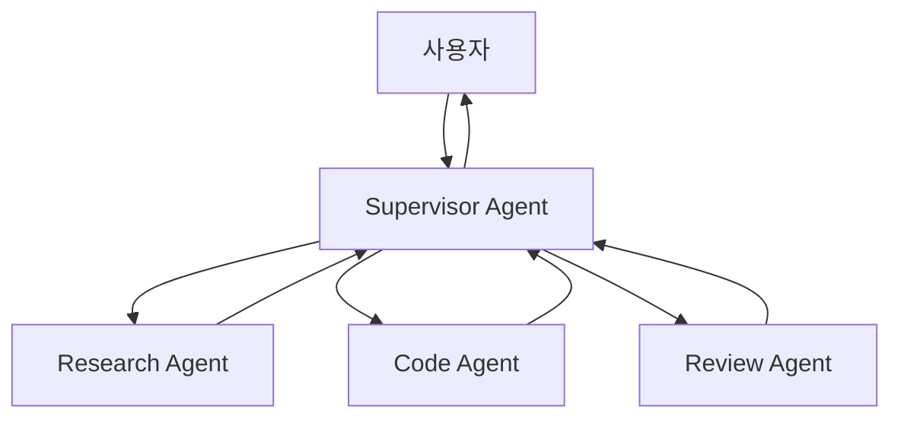

# Chapter 11: Multi-Agent 시스템

> 📌 **학습 목표**: 이 장을 마치면 여러 Agent가 협력하는 Multi-Agent 시스템을 설계하고 구현할 수 있습니다.

## 개요

**Multi-Agent 시스템**은 여러 전문화된 Agent가 협력하여 복잡한 작업을 수행하는 아키텍처입니다. 각 Agent는 특정 역할을 담당하며, 서로 통신하고 작업을 분담합니다.



## 핵심 개념

### Multi-Agent 아키텍처 유형

| 아키텍처 | 특징 | 사용 사례 |
|---------|------|----------|
| **Supervisor** | 중앙 조율자가 Agent 할당 | 작업 분배가 필요한 경우 |
| **Handoff** | Agent 간 직접 전달 | 순차적 처리가 필요한 경우 |
| **Hierarchical** | 계층적 Agent 구조 | 복잡한 조직 구조 |
| **Network** | Agent 간 자유로운 통신 | 협업이 필요한 경우 |

### Agent 간 통신

1. **상태 공유**: 공통 State를 통한 데이터 전달
2. **메시지 전달**: 메시지를 통한 직접 통신
3. **Handoff**: 한 Agent에서 다른 Agent로 제어권 이전

## 실습 1: Supervisor 패턴

```python
# 📁 src/part3_agent/11_multi_agent.py
from typing import TypedDict, Annotated, Literal
from dotenv import load_dotenv
from operator import add

from langchain_anthropic import ChatAnthropic
from langchain_core.messages import HumanMessage, SystemMessage
from langgraph.graph import StateGraph, START, END
from langgraph.graph.message import add_messages

load_dotenv()


# ============================================================
# 1. State 정의
# ============================================================

class MultiAgentState(TypedDict):
    """Multi-Agent State"""
    messages: Annotated[list, add_messages]
    next_agent: str
    task_results: Annotated[list, add]


# ============================================================
# 2. Supervisor Agent
# ============================================================

llm = ChatAnthropic(model="claude-sonnet-4-5-20250929", temperature=0)

SUPERVISOR_PROMPT = """당신은 팀 관리자입니다. 사용자의 요청을 분석하고 적절한 전문가에게 작업을 할당합니다.

사용 가능한 전문가:
- researcher: 정보 조사 및 분석
- coder: 코드 작성 및 기술 구현
- reviewer: 결과 검토 및 품질 확인

다음 형식으로 응답하세요:
ASSIGN: [전문가 이름]
REASON: [할당 이유]

모든 작업이 완료되면:
ASSIGN: FINISH
REASON: [완료 사유]"""


def supervisor_agent(state: MultiAgentState):
    """Supervisor: 작업 할당 및 조율"""
    messages = [SystemMessage(content=SUPERVISOR_PROMPT)] + state["messages"]

    response = llm.invoke(messages)
    content = response.content

    # 다음 Agent 결정
    if "ASSIGN: researcher" in content:
        next_agent = "researcher"
    elif "ASSIGN: coder" in content:
        next_agent = "coder"
    elif "ASSIGN: reviewer" in content:
        next_agent = "reviewer"
    else:
        next_agent = "FINISH"

    return {
        "messages": [response],
        "next_agent": next_agent
    }


def route_by_supervisor(state: MultiAgentState) -> str:
    """Supervisor의 결정에 따라 라우팅"""
    next_agent = state["next_agent"]
    if next_agent == "FINISH":
        return "end"
    return next_agent


# ============================================================
# 3. Worker Agents
# ============================================================

def researcher_agent(state: MultiAgentState):
    """Researcher: 정보 조사"""
    messages = [
        SystemMessage(content="당신은 정보 조사 전문가입니다. 주어진 주제에 대해 조사하고 결과를 보고하세요."),
        HumanMessage(content=f"다음 대화의 맥락에서 조사를 수행하세요:\n{state['messages'][-2].content if len(state['messages']) > 1 else ''}")
    ]

    response = llm.invoke(messages)

    return {
        "messages": [response],
        "task_results": [f"[Research] {response.content[:200]}..."]
    }


def coder_agent(state: MultiAgentState):
    """Coder: 코드 작성"""
    messages = [
        SystemMessage(content="당신은 소프트웨어 개발자입니다. 요청에 따라 코드를 작성하세요."),
        HumanMessage(content=f"다음 요청에 대한 코드를 작성하세요:\n{state['messages'][-2].content if len(state['messages']) > 1 else ''}")
    ]

    response = llm.invoke(messages)

    return {
        "messages": [response],
        "task_results": [f"[Code] {response.content[:200]}..."]
    }


def reviewer_agent(state: MultiAgentState):
    """Reviewer: 결과 검토"""
    task_results = state.get("task_results", [])
    results_text = "\n".join(task_results)

    messages = [
        SystemMessage(content="당신은 품질 검토 전문가입니다. 작업 결과를 검토하고 피드백을 제공하세요."),
        HumanMessage(content=f"다음 작업 결과를 검토하세요:\n{results_text}")
    ]

    response = llm.invoke(messages)

    return {
        "messages": [response],
        "task_results": [f"[Review] {response.content[:200]}..."]
    }


# ============================================================
# 4. 그래프 구성
# ============================================================

def create_supervisor_agent():
    """Supervisor 패턴 Multi-Agent 그래프 생성"""
    graph = StateGraph(MultiAgentState)

    # 노드 추가
    graph.add_node("supervisor", supervisor_agent)
    graph.add_node("researcher", researcher_agent)
    graph.add_node("coder", coder_agent)
    graph.add_node("reviewer", reviewer_agent)

    # 엣지 추가
    graph.add_edge(START, "supervisor")

    graph.add_conditional_edges(
        "supervisor",
        route_by_supervisor,
        {
            "researcher": "researcher",
            "coder": "coder",
            "reviewer": "reviewer",
            "end": END
        }
    )

    # Worker → Supervisor로 복귀
    graph.add_edge("researcher", "supervisor")
    graph.add_edge("coder", "supervisor")
    graph.add_edge("reviewer", "supervisor")

    return graph.compile()
```

> 💡 **전체 코드**: [src/part3_agent/11_multi_agent.py](../../src/part3_agent/11_multi_agent.py)

## 실습 2: Handoff 패턴

Agent 간 직접 제어권을 전달하는 패턴입니다.

```python
from langgraph.types import Command


class HandoffState(TypedDict):
    """Handoff State"""
    messages: Annotated[list, add_messages]
    current_agent: str


def sales_agent(state: HandoffState) -> Command:
    """Sales Agent: 판매 관련 처리"""
    messages = [
        SystemMessage(content="당신은 판매 담당자입니다. 제품 문의에 응답하세요."),
        *state["messages"]
    ]

    response = llm.invoke(messages)

    # 기술 지원이 필요하면 Handoff
    if "기술" in response.content or "설치" in response.content:
        return Command(
            update={"messages": [response], "current_agent": "tech_support"},
            goto="tech_support"
        )

    # 완료
    return Command(
        update={"messages": [response]},
        goto="end"
    )


def tech_support_agent(state: HandoffState) -> Command:
    """Tech Support Agent: 기술 지원"""
    messages = [
        SystemMessage(content="당신은 기술 지원 전문가입니다. 기술적인 질문에 답변하세요."),
        *state["messages"]
    ]

    response = llm.invoke(messages)

    # 판매 관련이면 다시 Sales로
    if "가격" in response.content or "구매" in response.content:
        return Command(
            update={"messages": [response], "current_agent": "sales"},
            goto="sales"
        )

    return Command(
        update={"messages": [response]},
        goto="end"
    )


def create_handoff_agent():
    """Handoff 패턴 그래프 생성"""
    graph = StateGraph(HandoffState)

    graph.add_node("sales", sales_agent)
    graph.add_node("tech_support", tech_support_agent)
    graph.add_node("end", lambda s: s)  # 종료 노드

    graph.add_edge(START, "sales")
    graph.add_edge("end", END)

    return graph.compile()
```

## 실습 3: 계층적 Multi-Agent

복잡한 작업을 계층적으로 분해하는 패턴입니다.

```python
class HierarchicalState(TypedDict):
    """계층적 Agent State"""
    messages: Annotated[list, add_messages]
    level: int
    sub_tasks: list
    completed_tasks: Annotated[list, add]


def top_manager(state: HierarchicalState):
    """최상위 관리자: 작업 분해"""
    messages = [
        SystemMessage(content="당신은 프로젝트 관리자입니다. 작업을 하위 작업으로 분해하세요."),
        *state["messages"]
    ]

    response = llm.invoke(messages)

    # 하위 작업 추출 (간단한 파싱)
    sub_tasks = ["설계", "구현", "테스트"]  # 실제로는 LLM 응답에서 파싱

    return {
        "messages": [response],
        "level": 1,
        "sub_tasks": sub_tasks
    }


def team_lead(state: HierarchicalState):
    """팀 리더: 하위 작업 처리"""
    current_task = state["sub_tasks"][0] if state["sub_tasks"] else "완료"

    messages = [
        SystemMessage(content=f"당신은 {current_task} 팀 리더입니다. 작업을 수행하세요."),
        *state["messages"]
    ]

    response = llm.invoke(messages)

    remaining_tasks = state["sub_tasks"][1:] if state["sub_tasks"] else []

    return {
        "messages": [response],
        "sub_tasks": remaining_tasks,
        "completed_tasks": [f"완료: {current_task}"]
    }


def should_continue_hierarchy(state: HierarchicalState) -> str:
    """계층적 라우팅"""
    if state["sub_tasks"]:
        return "team_lead"
    return "end"
```

## 실습 4: Structured Output을 활용한 Supervisor

더 정확한 Agent 선택을 위해 Structured Output을 사용합니다.

```python
from pydantic import BaseModel, Field


class SupervisorDecision(BaseModel):
    """Supervisor의 결정을 위한 스키마"""
    next_agent: Literal["researcher", "coder", "reviewer", "FINISH"] = Field(
        description="다음에 호출할 Agent"
    )
    reason: str = Field(
        description="이 결정을 내린 이유"
    )
    instructions: str = Field(
        description="해당 Agent에게 전달할 지시사항"
    )


supervisor_llm = llm.with_structured_output(SupervisorDecision)


def structured_supervisor(state: MultiAgentState):
    """Structured Output을 사용하는 Supervisor"""
    messages = [
        SystemMessage(content="사용자 요청을 분석하고 적절한 Agent를 선택하세요."),
        *state["messages"]
    ]

    decision = supervisor_llm.invoke(messages)

    return {
        "next_agent": decision.next_agent,
        "messages": [HumanMessage(content=decision.instructions)]
    }
```

## 고급 패턴: Agent 간 공유 도구

여러 Agent가 같은 도구를 공유하는 패턴입니다.

```python
from langchain_core.tools import tool


# 공유 도구
@tool
def database_query(query: str) -> str:
    """데이터베이스 쿼리를 실행합니다."""
    return f"DB 쿼리 결과: {query}"


@tool
def send_notification(message: str) -> str:
    """알림을 전송합니다."""
    return f"알림 전송됨: {message}"


shared_tools = [database_query, send_notification]


def create_agent_with_shared_tools(name: str, system_prompt: str):
    """공유 도구를 가진 Agent 생성"""
    llm_with_tools = llm.bind_tools(shared_tools)

    def agent_fn(state: MultiAgentState):
        messages = [SystemMessage(content=system_prompt)] + state["messages"]
        response = llm_with_tools.invoke(messages)
        return {"messages": [response]}

    return agent_fn
```

## 요약

- **Supervisor 패턴**: 중앙 조율자가 Agent 할당 결정
- **Handoff 패턴**: Agent 간 직접 제어권 전달 (Command 사용)
- **계층적 패턴**: 복잡한 작업을 계층적으로 분해
- **Structured Output**: 정확한 Agent 선택을 위한 스키마 정의
- **공유 도구**: 여러 Agent가 같은 도구를 활용

## 다음 단계

다음 장에서는 **서브그래프**를 활용하여 복잡한 Agent를 모듈화하는 방법을 학습합니다.

👉 [Chapter 12: 서브그래프 활용](./12-subgraphs.md)

---

## 📚 참고 자료

### 공식 문서
- [Multi-Agent Systems (공식 온라인)](https://docs.langchain.com/oss/python/langgraph/workflows-agents#multi-agent) - 멀티 에이전트 가이드
- [Handoff Pattern (공식 온라인)](https://docs.langchain.com/oss/python/langgraph/workflows-agents#handoff) - Handoff 패턴

### 실습 코드
- [전체 소스](../../src/part3_agent/11_multi_agent.py) - 실행 가능한 전체 코드

### 관련 챕터
- [이전: Chapter 10 - ReAct Agent 구현](./10-react-agent.md)
- [다음: Chapter 12 - 서브그래프 활용](./12-subgraphs.md)
