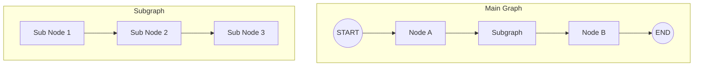

# Chapter 12: 서브그래프 활용

> 📌 **학습 목표**: 이 장을 마치면 서브그래프를 사용하여 복잡한 Agent를 모듈화하고, 상태 공유/분리 전략을 구현할 수 있습니다.

## 개요

**서브그래프(Subgraph)**는 그래프 안에 다른 그래프를 포함시키는 기능입니다. 복잡한 워크플로우를 모듈화하고, 재사용 가능한 컴포넌트를 만들 수 있습니다.



## 핵심 개념

### 서브그래프 사용 이유

| 이점 | 설명 |
|-----|------|
| **모듈화** | 복잡한 로직을 독립적인 단위로 분리 |
| **재사용** | 동일한 서브그래프를 여러 곳에서 활용 |
| **캡슐화** | 내부 상태를 외부로부터 숨김 |
| **테스트** | 서브그래프 단위로 독립적 테스트 가능 |

### 상태 공유 전략

1. **전체 공유**: 부모와 자식이 동일한 상태 사용
2. **부분 공유**: 특정 키만 공유
3. **완전 분리**: 입력/출력만 전달

## 실습 1: 기본 서브그래프

```python
# 📁 src/part3_agent/12_subgraph_agent.py
from typing import TypedDict, Annotated
from dotenv import load_dotenv

from langchain_anthropic import ChatAnthropic
from langgraph.graph import StateGraph, START, END
from langgraph.graph.message import add_messages

load_dotenv()


# ============================================================
# 1. 서브그래프 State 정의
# ============================================================

class SubState(TypedDict):
    """서브그래프 State"""
    input_data: str
    processed_data: str


class MainState(TypedDict):
    """메인 그래프 State"""
    messages: Annotated[list, add_messages]
    sub_result: str


# ============================================================
# 2. 서브그래프 정의
# ============================================================

def sub_process_1(state: SubState) -> SubState:
    """서브 프로세스 1: 데이터 전처리"""
    data = state["input_data"]
    processed = data.upper()  # 대문자 변환
    return {"processed_data": f"[Step1] {processed}"}


def sub_process_2(state: SubState) -> SubState:
    """서브 프로세스 2: 추가 처리"""
    data = state["processed_data"]
    return {"processed_data": f"{data} -> [Step2] Processed"}


def create_subgraph():
    """서브그래프 생성"""
    graph = StateGraph(SubState)

    graph.add_node("process_1", sub_process_1)
    graph.add_node("process_2", sub_process_2)

    graph.add_edge(START, "process_1")
    graph.add_edge("process_1", "process_2")
    graph.add_edge("process_2", END)

    return graph.compile()


# ============================================================
# 3. 메인 그래프에서 서브그래프 호출
# ============================================================

subgraph = create_subgraph()


def call_subgraph(state: MainState) -> MainState:
    """노드에서 서브그래프 호출"""
    # 마지막 메시지 추출
    last_message = state["messages"][-1].content if state["messages"] else ""

    # 서브그래프 실행
    sub_result = subgraph.invoke({
        "input_data": last_message,
        "processed_data": ""
    })

    return {"sub_result": sub_result["processed_data"]}


def create_main_graph():
    """메인 그래프 생성"""
    graph = StateGraph(MainState)

    graph.add_node("subgraph_call", call_subgraph)

    graph.add_edge(START, "subgraph_call")
    graph.add_edge("subgraph_call", END)

    return graph.compile()
```

> 💡 **전체 코드**: [src/part3_agent/12_subgraph_agent.py](../../src/part3_agent/12_subgraph_agent.py)

## 실습 2: 그래프를 노드로 추가

`add_node`에 컴파일된 그래프를 직접 전달할 수 있습니다.

```python
class SharedState(TypedDict):
    """부모-자식 공유 State"""
    value: str
    count: int


def parent_node(state: SharedState) -> SharedState:
    """부모 노드"""
    return {"value": f"Parent: {state['value']}", "count": state["count"] + 1}


def create_child_graph():
    """자식 그래프 생성"""
    def child_process(state: SharedState) -> SharedState:
        return {"value": f"Child: {state['value']}", "count": state["count"] + 10}

    graph = StateGraph(SharedState)
    graph.add_node("child_process", child_process)
    graph.add_edge(START, "child_process")
    graph.add_edge("child_process", END)

    return graph.compile()


def create_parent_graph():
    """부모 그래프 생성 - 자식 그래프를 노드로 추가"""
    child_graph = create_child_graph()

    graph = StateGraph(SharedState)

    graph.add_node("parent_node", parent_node)
    graph.add_node("child_graph", child_graph)  # 그래프를 노드로 추가

    graph.add_edge(START, "parent_node")
    graph.add_edge("parent_node", "child_graph")
    graph.add_edge("child_graph", END)

    return graph.compile()


# 실행
app = create_parent_graph()
result = app.invoke({"value": "hello", "count": 0})
# {'value': 'Child: Parent: hello', 'count': 11}
```

## 실습 3: 상태 변환 (State Transformation)

서브그래프가 다른 State 스키마를 사용할 때 변환이 필요합니다.

```python
class ParentState(TypedDict):
    """부모 State"""
    user_query: str
    final_result: str


class ChildState(TypedDict):
    """자식 State - 다른 스키마"""
    input_text: str
    output_text: str


def create_child_with_different_state():
    """다른 State를 사용하는 자식 그래프"""
    def process(state: ChildState) -> ChildState:
        return {"output_text": f"Processed: {state['input_text']}"}

    graph = StateGraph(ChildState)
    graph.add_node("process", process)
    graph.add_edge(START, "process")
    graph.add_edge("process", END)

    return graph.compile()


child_graph = create_child_with_different_state()


def call_child_with_transform(state: ParentState) -> ParentState:
    """상태 변환을 통한 자식 그래프 호출"""
    # 부모 -> 자식 State 변환
    child_input = {
        "input_text": state["user_query"],
        "output_text": ""
    }

    # 자식 그래프 실행
    child_result = child_graph.invoke(child_input)

    # 자식 -> 부모 State 변환
    return {"final_result": child_result["output_text"]}
```

## 실습 4: 서브그래프와 Checkpointer

서브그래프에서도 Checkpointer를 사용할 수 있습니다.

```python
from langgraph.checkpoint.memory import MemorySaver


def create_subgraph_with_checkpointer():
    """Checkpointer가 있는 서브그래프"""
    graph = StateGraph(SubState)

    graph.add_node("process_1", sub_process_1)
    graph.add_node("process_2", sub_process_2)

    graph.add_edge(START, "process_1")
    graph.add_edge("process_1", "process_2")
    graph.add_edge("process_2", END)

    # 서브그래프용 Checkpointer
    checkpointer = MemorySaver()
    return graph.compile(checkpointer=checkpointer)


def create_main_with_checkpointer():
    """Checkpointer가 있는 메인 그래프"""
    subgraph = create_subgraph_with_checkpointer()

    graph = StateGraph(MainState)

    def call_sub(state: MainState):
        result = subgraph.invoke(
            {"input_data": state["messages"][-1].content, "processed_data": ""},
            config={"configurable": {"thread_id": "sub-thread"}}
        )
        return {"sub_result": result["processed_data"]}

    graph.add_node("call_subgraph", call_sub)
    graph.add_edge(START, "call_subgraph")
    graph.add_edge("call_subgraph", END)

    main_checkpointer = MemorySaver()
    return graph.compile(checkpointer=main_checkpointer)
```

## 실습 5: 서브그래프 스트리밍

서브그래프 실행 과정을 스트리밍으로 모니터링합니다.

```python
def stream_subgraph():
    """서브그래프 스트리밍"""
    app = create_parent_graph()

    # subgraphs=True로 서브그래프 이벤트도 포함
    for event in app.stream(
        {"value": "test", "count": 0},
        stream_mode="values",
        subgraphs=True
    ):
        print(f"Event: {event}")


def stream_subgraph_updates():
    """서브그래프 업데이트 스트리밍"""
    app = create_parent_graph()

    for namespace, chunk in app.stream(
        {"value": "test", "count": 0},
        stream_mode="updates",
        subgraphs=True
    ):
        print(f"Namespace: {namespace}")
        print(f"Update: {chunk}")
```

## 고급 패턴: 동적 서브그래프 선택

런타임에 서브그래프를 선택하는 패턴입니다.

```python
def create_dynamic_subgraph_router():
    """동적 서브그래프 라우터"""

    # 여러 서브그래프 정의
    simple_subgraph = create_simple_subgraph()
    complex_subgraph = create_complex_subgraph()

    class RouterState(TypedDict):
        query: str
        complexity: str
        result: str

    def analyze_complexity(state: RouterState) -> RouterState:
        """쿼리 복잡도 분석"""
        query = state["query"]
        complexity = "complex" if len(query) > 50 else "simple"
        return {"complexity": complexity}

    def route_to_subgraph(state: RouterState) -> str:
        """복잡도에 따라 서브그래프 선택"""
        return state["complexity"]

    def call_simple(state: RouterState) -> RouterState:
        result = simple_subgraph.invoke({"input": state["query"]})
        return {"result": result["output"]}

    def call_complex(state: RouterState) -> RouterState:
        result = complex_subgraph.invoke({"input": state["query"]})
        return {"result": result["output"]}

    graph = StateGraph(RouterState)

    graph.add_node("analyze", analyze_complexity)
    graph.add_node("simple", call_simple)
    graph.add_node("complex", call_complex)

    graph.add_edge(START, "analyze")
    graph.add_conditional_edges(
        "analyze",
        route_to_subgraph,
        {
            "simple": "simple",
            "complex": "complex"
        }
    )
    graph.add_edge("simple", END)
    graph.add_edge("complex", END)

    return graph.compile()
```

## 고급 패턴: 재귀적 서브그래프

서브그래프가 자기 자신을 호출하는 패턴입니다.

```python
class RecursiveState(TypedDict):
    """재귀적 State"""
    task: str
    depth: int
    max_depth: int
    results: list


def create_recursive_subgraph():
    """재귀적 서브그래프"""

    def process_task(state: RecursiveState) -> RecursiveState:
        task = state["task"]
        depth = state["depth"]

        # 결과 추가
        result = f"[Depth {depth}] {task}"
        results = state["results"] + [result]

        return {"results": results}

    def should_recurse(state: RecursiveState) -> str:
        if state["depth"] < state["max_depth"]:
            return "recurse"
        return "end"

    def recurse(state: RecursiveState) -> RecursiveState:
        # 재귀적으로 자신을 호출
        sub_result = app.invoke({
            "task": f"sub-{state['task']}",
            "depth": state["depth"] + 1,
            "max_depth": state["max_depth"],
            "results": state["results"]
        })
        return {"results": sub_result["results"]}

    graph = StateGraph(RecursiveState)

    graph.add_node("process", process_task)
    graph.add_node("recurse", recurse)

    graph.add_edge(START, "process")
    graph.add_conditional_edges(
        "process",
        should_recurse,
        {
            "recurse": "recurse",
            "end": END
        }
    )
    graph.add_edge("recurse", END)

    app = graph.compile()
    return app
```

## 요약

- **서브그래프**: 그래프 안에 다른 그래프를 포함
- **노드에서 호출**: 노드 함수 내에서 `subgraph.invoke()` 사용
- **그래프를 노드로**: `add_node`에 컴파일된 그래프 직접 전달
- **상태 변환**: 다른 State 스키마 간 변환 처리
- **스트리밍**: `subgraphs=True`로 서브그래프 이벤트 포함

## 다음 단계

Part 3을 마쳤습니다! 다음 Part에서는 **프로덕션 기능**을 학습합니다. Persistence, Memory, Human-in-the-Loop 등을 다룹니다.

👉 [Chapter 13: 영속성 (Persistence)](../Part4-Production/13-persistence.md)

---

## 📚 참고 자료

### 공식 문서
- [Subgraphs (공식 온라인)](https://docs.langchain.com/oss/python/langgraph/subgraphs) - 서브그래프 가이드
- [Use Subgraphs (공식 온라인)](https://docs.langchain.com/oss/python/langgraph/how-to/use-subgraphs) - 서브그래프 활용법

### 실습 코드
- [전체 소스](../../src/part3_agent/12_subgraph_agent.py) - 실행 가능한 전체 코드

### 관련 챕터
- [이전: Chapter 11 - Multi-Agent 시스템](./11-multi-agent.md)
- [다음: Chapter 13 - 영속성](../Part4-Production/13-persistence.md)
