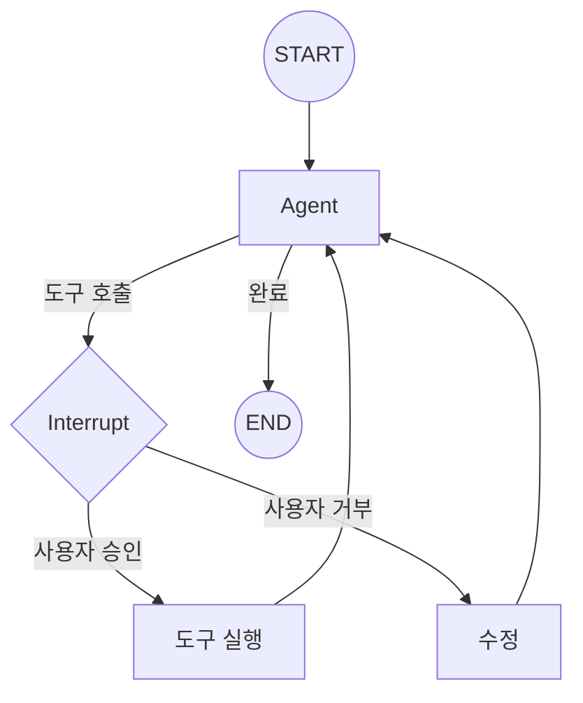

# Chapter 15: Human-in-the-Loop

> 📌 **학습 목표**: 이 장을 마치면 중단점(Interrupt)을 사용하여 사용자 승인, 검토, 수정을 구현할 수 있습니다.

## 개요

**Human-in-the-Loop (HITL)**은 AI가 자율적으로 작업하다가 사람의 개입이 필요한 시점에 일시 중단하고, 승인이나 피드백을 받은 후 계속 진행하는 패턴입니다.



## 핵심 개념

### Interrupt 사용 사례

| 사용 사례 | 설명 |
|----------|------|
| **도구 승인** | 위험한 도구 실행 전 사용자 확인 |
| **입력 요청** | 추가 정보가 필요할 때 |
| **검토** | 중간 결과를 사용자가 검토 |
| **수정** | 잘못된 작업을 사용자가 수정 |

### Interrupt 메커니즘

1. **interrupt_before**: 특정 노드 실행 **전**에 중단
2. **interrupt_after**: 특정 노드 실행 **후**에 중단
3. **interrupt()**: 노드 내에서 동적으로 중단

## 실습 1: interrupt_before

```python
# 📁 src/part4_production/16_interrupts.py
from typing import Annotated
from langgraph.graph import StateGraph, START, END, MessagesState
from langgraph.checkpoint.memory import MemorySaver
from langchain_core.tools import tool


@tool
def dangerous_action(command: str) -> str:
    """위험한 작업을 수행합니다."""
    return f"실행됨: {command}"


def agent_node(state: MessagesState) -> MessagesState:
    """Agent 노드"""
    return {"messages": ["Agent가 작업을 준비했습니다."]}


def tool_node(state: MessagesState) -> MessagesState:
    """도구 실행 노드"""
    return {"messages": ["도구가 실행되었습니다."]}


# 그래프 생성
graph = StateGraph(MessagesState)
graph.add_node("agent", agent_node)
graph.add_node("tools", tool_node)
graph.add_edge(START, "agent")
graph.add_edge("agent", "tools")
graph.add_edge("tools", END)

# interrupt_before로 tools 노드 전에 중단
checkpointer = MemorySaver()
app = graph.compile(
    checkpointer=checkpointer,
    interrupt_before=["tools"]  # tools 노드 실행 전 중단
)

# 실행 - tools 전에 중단됨
config = {"configurable": {"thread_id": "approval-thread"}}
result = app.invoke({"messages": ["작업 시작"]}, config=config)

# 중단된 상태 확인
state = app.get_state(config)
print(f"다음 노드: {state.next}")  # ('tools',)

# 사용자 승인 후 계속 실행
# None을 전달하면 현재 상태에서 계속
result = app.invoke(None, config=config)
```

> 💡 **전체 코드**: [src/part4_production/16_interrupts.py](../../src/part4_production/16_interrupts.py)

## 실습 2: interrupt_after

```python
# 노드 실행 후에 중단
app = graph.compile(
    checkpointer=checkpointer,
    interrupt_after=["agent"]  # agent 노드 실행 후 중단
)

# Agent 실행 후 중단됨
result = app.invoke({"messages": ["확인 요청"]}, config=config)

# 중간 결과 확인
state = app.get_state(config)
print(f"Agent 출력: {state.values['messages']}")

# 승인 후 계속
result = app.invoke(None, config=config)
```

## 실습 3: 동적 Interrupt

노드 내에서 조건부로 중단합니다.

```python
from langgraph.types import interrupt


def conditional_action(state: MessagesState) -> MessagesState:
    """조건부로 중단하는 노드"""
    message = state["messages"][-1]

    # 위험한 키워드가 있으면 중단
    if "delete" in message.lower() or "삭제" in message:
        # 사용자에게 승인 요청
        response = interrupt(
            value={
                "question": "정말로 삭제하시겠습니까?",
                "options": ["yes", "no"]
            }
        )

        if response == "no":
            return {"messages": ["작업이 취소되었습니다."]}

    return {"messages": ["작업이 완료되었습니다."]}
```

### Interrupt 응답 처리

```python
from langgraph.types import Command


# 실행 - 중단됨
result = app.invoke({"messages": ["파일을 삭제해주세요"]}, config=config)

# 중단 상태 확인
state = app.get_state(config)
# state.tasks에서 interrupt 정보 확인

# 사용자 응답과 함께 재개
result = app.invoke(
    Command(resume="yes"),  # interrupt에 대한 응답
    config=config
)
```

## 실습 4: 상태 수정 후 재개

중단 시점에서 상태를 수정하고 재개합니다.

```python
# 중단된 상태에서 상태 수정
app.update_state(
    config,
    {"messages": ["수정된 메시지로 대체"]},
    as_node="agent"
)

# 수정된 상태에서 계속 실행
result = app.invoke(None, config=config)
```

## 실습 5: 도구 호출 승인 패턴

```python
from langgraph.prebuilt import create_react_agent, ToolNode


@tool
def send_email(to: str, subject: str, body: str) -> str:
    """이메일을 전송합니다."""
    return f"이메일 전송됨: {to}"


@tool
def delete_file(path: str) -> str:
    """파일을 삭제합니다."""
    return f"삭제됨: {path}"


# 위험한 도구 목록
dangerous_tools = ["delete_file", "send_email"]


def human_approval_node(state: MessagesState) -> MessagesState:
    """도구 호출 전 승인 요청"""
    last_message = state["messages"][-1]

    if hasattr(last_message, "tool_calls"):
        for tool_call in last_message.tool_calls:
            if tool_call["name"] in dangerous_tools:
                # 승인 요청
                response = interrupt({
                    "tool": tool_call["name"],
                    "args": tool_call["args"],
                    "message": f"'{tool_call['name']}' 도구를 실행하시겠습니까?"
                })

                if response != "approved":
                    # 거부된 경우 도구 호출 취소
                    return {"messages": ["사용자가 작업을 거부했습니다."]}

    return state  # 승인된 경우 그대로 진행
```

## 고급 패턴: 다중 사용자 승인

여러 사용자의 승인이 필요한 패턴입니다.

```python
class ApprovalState(TypedDict):
    messages: Annotated[list, add_messages]
    approvals: dict  # {"user1": True, "user2": None}
    required_approvers: list


def check_approvals(state: ApprovalState) -> str:
    """승인 상태 확인"""
    approvals = state["approvals"]
    required = state["required_approvers"]

    # 모든 필수 승인자가 승인했는지 확인
    all_approved = all(
        approvals.get(user) == True
        for user in required
    )

    if all_approved:
        return "execute"

    # 아직 대기 중인 승인자가 있으면 중단
    pending = [u for u in required if approvals.get(u) is None]
    if pending:
        return "wait_approval"

    # 거부된 경우
    return "rejected"


def wait_for_approval(state: ApprovalState) -> ApprovalState:
    """승인 대기"""
    pending = [
        u for u in state["required_approvers"]
        if state["approvals"].get(u) is None
    ]

    response = interrupt({
        "pending_approvers": pending,
        "message": f"다음 사용자의 승인이 필요합니다: {pending}"
    })

    # 응답에서 승인 정보 추출
    return {"approvals": {**state["approvals"], **response}}
```

## 요약

- **interrupt_before**: 특정 노드 실행 전 중단
- **interrupt_after**: 특정 노드 실행 후 중단
- **interrupt()**: 노드 내에서 동적 중단
- **Command(resume=...)**: 중단된 곳에서 응답과 함께 재개
- **update_state()**: 중단 시점에서 상태 수정

## 다음 단계

다음 장에서는 **스트리밍**을 학습합니다. 실시간 출력과 진행 상황 모니터링을 다룹니다.

👉 [Chapter 16: 스트리밍](./16-streaming.md)

---

## 📚 참고 자료

### 공식 문서
- [Human-in-the-Loop (공식 온라인)](https://docs.langchain.com/oss/python/langgraph/human-in-the-loop) - HITL 가이드
- [Interrupts (공식 온라인)](https://docs.langchain.com/oss/python/langgraph/interrupts) - Interrupt 레퍼런스

### 실습 코드
- [전체 소스](../../src/part4_production/16_interrupts.py) - 실행 가능한 전체 코드

### 관련 챕터
- [이전: Chapter 14 - 메모리 시스템](./14-memory.md)
- [다음: Chapter 16 - 스트리밍](./16-streaming.md)
