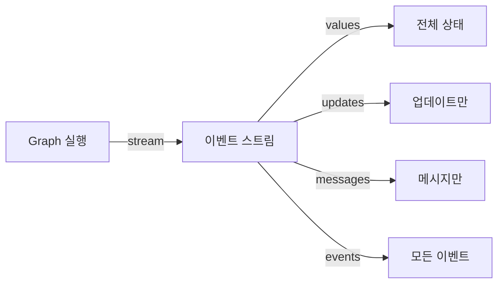

# Chapter 16: 스트리밍

> 📌 **학습 목표**: 이 장을 마치면 다양한 스트리밍 모드를 활용하여 실시간 출력과 진행 상황 모니터링을 구현할 수 있습니다.

## 개요

**스트리밍**은 그래프 실행 결과를 실시간으로 받아볼 수 있게 합니다. 사용자에게 진행 상황을 보여주거나, LLM 토큰을 실시간으로 출력할 때 필수입니다.



## 핵심 개념

### 스트리밍 모드

| 모드 | 설명 | 출력 |
|-----|------|------|
| **values** | 각 단계의 전체 상태 | `{"messages": [...]}` |
| **updates** | 각 노드의 업데이트만 | `{"node": {"key": "value"}}` |
| **messages** | 메시지 관련만 | `(message, metadata)` |
| **events** | 모든 내부 이벤트 | 상세 이벤트 정보 |

## 실습 1: 기본 스트리밍

```python
# 📁 src/part4_production/15_streaming.py
from langgraph.graph import StateGraph, START, END, MessagesState
from langchain_core.messages import HumanMessage


def node_a(state: MessagesState) -> MessagesState:
    return {"messages": ["Node A 완료"]}


def node_b(state: MessagesState) -> MessagesState:
    return {"messages": ["Node B 완료"]}


graph = StateGraph(MessagesState)
graph.add_node("a", node_a)
graph.add_node("b", node_b)
graph.add_edge(START, "a")
graph.add_edge("a", "b")
graph.add_edge("b", END)

app = graph.compile()

# values 모드 (기본) - 각 단계의 전체 상태
print("=== values 모드 ===")
for chunk in app.stream({"messages": [HumanMessage(content="시작")]}):
    print(chunk)

# updates 모드 - 노드별 업데이트만
print("\n=== updates 모드 ===")
for chunk in app.stream(
    {"messages": [HumanMessage(content="시작")]},
    stream_mode="updates"
):
    for node, update in chunk.items():
        print(f"[{node}] {update}")
```

> 💡 **전체 코드**: [src/part4_production/15_streaming.py](../../src/part4_production/15_streaming.py)

## 실습 2: LLM 토큰 스트리밍

```python
from langchain_anthropic import ChatAnthropic
from langchain_core.messages import AIMessageChunk


llm = ChatAnthropic(model="claude-sonnet-4-5-20250929", streaming=True)


def llm_node(state: MessagesState) -> MessagesState:
    response = llm.invoke(state["messages"])
    return {"messages": [response]}


# events 모드로 LLM 토큰까지 스트리밍
for event in app.stream(
    {"messages": [HumanMessage(content="짧은 이야기를 해주세요")]},
    stream_mode="events"
):
    # LLM 토큰 이벤트 처리
    if event["event"] == "on_chat_model_stream":
        chunk = event["data"]["chunk"]
        if isinstance(chunk, AIMessageChunk) and chunk.content:
            print(chunk.content, end="", flush=True)
```

## 실습 3: messages 모드

메시지 관련 이벤트만 받습니다.

```python
# messages 모드 - AI 메시지와 도구 호출만
for message, metadata in app.stream(
    {"messages": [HumanMessage(content="검색해줘")]},
    stream_mode="messages"
):
    print(f"[{metadata.get('langgraph_node')}] {message}")
```

### 메시지 필터링

```python
from langchain_core.messages import AIMessage, ToolMessage


for message, metadata in app.stream(..., stream_mode="messages"):
    if isinstance(message, AIMessage):
        if message.tool_calls:
            print(f"도구 호출: {message.tool_calls}")
        else:
            print(f"응답: {message.content}")
    elif isinstance(message, ToolMessage):
        print(f"도구 결과: {message.content}")
```

## 실습 4: 서브그래프 스트리밍

```python
# subgraphs=True로 서브그래프 이벤트 포함
for namespace, chunk in app.stream(
    {"messages": [HumanMessage(content="시작")]},
    stream_mode="updates",
    subgraphs=True  # 서브그래프 이벤트 포함
):
    # namespace는 서브그래프 경로를 나타냄
    # () - 루트 그래프
    # ("subgraph_name",) - 첫 번째 레벨 서브그래프
    print(f"Namespace: {namespace}")
    print(f"Update: {chunk}")
```

## 실습 5: 비동기 스트리밍

```python
import asyncio


async def stream_async():
    """비동기 스트리밍"""
    async for chunk in app.astream(
        {"messages": [HumanMessage(content="비동기 시작")]},
        stream_mode="updates"
    ):
        print(chunk)


# 이벤트 스트리밍
async def stream_events_async():
    """비동기 이벤트 스트리밍"""
    async for event in app.astream_events(
        {"messages": [HumanMessage(content="이벤트 스트리밍")]},
        version="v2"
    ):
        kind = event["event"]
        if kind == "on_chat_model_stream":
            content = event["data"]["chunk"].content
            if content:
                print(content, end="", flush=True)


asyncio.run(stream_async())
```

## 실습 6: 스트리밍 모드 조합

여러 모드를 동시에 사용할 수 있습니다.

```python
# 여러 모드 동시 사용
for chunk in app.stream(
    {"messages": [HumanMessage(content="복합 스트리밍")]},
    stream_mode=["values", "updates", "messages"]
):
    mode, data = chunk
    print(f"[{mode}] {data}")
```

## 고급 패턴: 진행률 표시

```python
from typing import TypedDict


class ProgressState(TypedDict):
    messages: list
    current_step: int
    total_steps: int
    progress: float


def update_progress(state: ProgressState) -> ProgressState:
    """진행률 업데이트"""
    current = state["current_step"] + 1
    total = state["total_steps"]
    progress = current / total * 100

    return {
        "current_step": current,
        "progress": progress,
        "messages": [f"진행 중: {progress:.1f}%"]
    }


# 클라이언트에서 진행률 표시
for chunk in app.stream(initial_state, stream_mode="updates"):
    if "progress" in chunk.get("update_progress", {}):
        progress = chunk["update_progress"]["progress"]
        print(f"\r진행률: {progress:.1f}%", end="", flush=True)
```

## 고급 패턴: 실시간 UI 업데이트

```python
import json


async def stream_to_websocket(websocket, input_data):
    """WebSocket으로 스트리밍"""
    async for event in app.astream_events(input_data, version="v2"):
        # 이벤트 유형에 따라 다른 메시지 전송
        if event["event"] == "on_chain_start":
            await websocket.send(json.dumps({
                "type": "start",
                "node": event["name"]
            }))
        elif event["event"] == "on_chat_model_stream":
            content = event["data"]["chunk"].content
            if content:
                await websocket.send(json.dumps({
                    "type": "token",
                    "content": content
                }))
        elif event["event"] == "on_chain_end":
            await websocket.send(json.dumps({
                "type": "end",
                "node": event["name"]
            }))
```

## 요약

- **values**: 각 단계의 전체 상태
- **updates**: 노드별 업데이트만 (`{node: update}`)
- **messages**: AI 메시지와 도구 관련만
- **events**: 모든 내부 이벤트 (토큰 스트리밍 포함)
- **subgraphs=True**: 서브그래프 이벤트 포함

## 다음 단계

다음 장에서는 **Time Travel**을 학습합니다. 상태 히스토리 탐색과 복원을 다룹니다.

👉 [Chapter 17: Time Travel](./17-time-travel.md)

---

## 📚 참고 자료

### 공식 문서
- [Streaming (공식 온라인)](https://docs.langchain.com/oss/python/langgraph/streaming) - 스트리밍 가이드
- [astream_events (공식 온라인)](https://docs.langchain.com/oss/python/langgraph/streaming#events) - 이벤트 스트리밍

### 실습 코드
- [전체 소스](../../src/part4_production/15_streaming.py) - 실행 가능한 전체 코드

### 관련 챕터
- [이전: Chapter 15 - Human-in-the-Loop](./15-human-in-the-loop.md)
- [다음: Chapter 17 - Time Travel](./17-time-travel.md)
