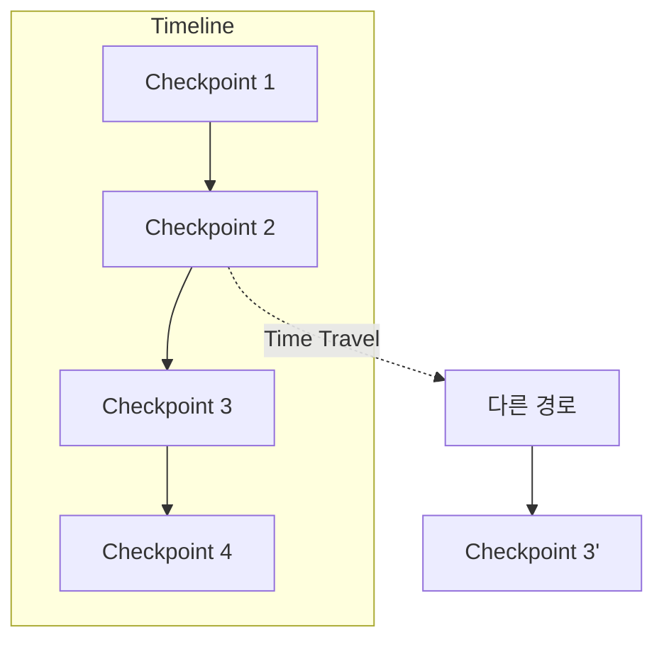

# Chapter 17: Time Travel

> 📌 **학습 목표**: 이 장을 마치면 상태 히스토리를 탐색하고, 특정 시점으로 복원하여 다시 실행할 수 있습니다.

## 개요

**Time Travel**은 그래프 실행의 과거 상태를 탐색하고, 특정 시점으로 되돌아가 다른 경로로 실행하는 기능입니다. 디버깅과 실험에 매우 유용합니다.



## 핵심 개념

### Time Travel 작업

| 작업 | 설명 | 메서드 |
|-----|------|-------|
| **히스토리 조회** | 모든 체크포인트 확인 | `get_state_history()` |
| **특정 시점 조회** | 특정 체크포인트 상태 | `get_state(config)` |
| **되감기** | 이전 체크포인트로 이동 | 해당 config로 invoke |
| **재실행** | 수정 후 다시 실행 | `update_state()` + invoke |

## 실습 1: 히스토리 탐색

```python
# 📁 src/part4_production/17_time_travel.py
from langgraph.graph import StateGraph, START, END, MessagesState
from langgraph.checkpoint.memory import MemorySaver
from langchain_core.messages import HumanMessage


def echo(state: MessagesState) -> MessagesState:
    msg = state["messages"][-1]
    return {"messages": [f"Echo: {msg.content}"]}


graph = StateGraph(MessagesState)
graph.add_node("echo", echo)
graph.add_edge(START, "echo")
graph.add_edge("echo", END)

checkpointer = MemorySaver()
app = graph.compile(checkpointer=checkpointer)

# 여러 번 실행
config = {"configurable": {"thread_id": "time-travel-demo"}}

app.invoke({"messages": [HumanMessage(content="메시지 1")]}, config=config)
app.invoke({"messages": [HumanMessage(content="메시지 2")]}, config=config)
app.invoke({"messages": [HumanMessage(content="메시지 3")]}, config=config)

# 전체 히스토리 조회
print("=== 히스토리 ===")
for i, state in enumerate(app.get_state_history(config)):
    step = state.metadata.get("step", "?")
    msg_count = len(state.values.get("messages", []))
    print(f"[{i}] Step {step}: {msg_count}개 메시지")
    print(f"    checkpoint_id: {state.config['configurable']['checkpoint_id']}")
```

> 💡 **전체 코드**: [src/part4_production/17_time_travel.py](../../src/part4_production/17_time_travel.py)

## 실습 2: 특정 시점으로 이동

```python
# 히스토리에서 특정 시점 선택
history = list(app.get_state_history(config))

# 두 번째 체크포인트로 이동 (index는 최신이 0)
target_state = history[2]  # 메시지 2 시점
target_config = target_state.config

print(f"선택한 시점: {target_state.values['messages']}")

# 해당 시점의 상태 조회
past_state = app.get_state(target_config)
print(f"과거 상태: {past_state.values}")
```

## 실습 3: 과거에서 분기하여 재실행

```python
# 특정 시점에서 다른 메시지로 계속
history = list(app.get_state_history(config))
branch_point = history[2]  # 분기할 시점

# 새 thread_id로 분기 (Fork)
forked_config = {
    "configurable": {
        "thread_id": "forked-timeline",
        "checkpoint_id": branch_point.config["configurable"]["checkpoint_id"]
    }
}

# 분기된 타임라인에서 다른 메시지 실행
result = app.invoke(
    {"messages": [HumanMessage(content="분기된 메시지")]},
    config=forked_config
)

print("=== 원본 타임라인 ===")
for state in app.get_state_history(config):
    print(f"  {len(state.values.get('messages', []))}개 메시지")

print("\n=== 분기된 타임라인 ===")
for state in app.get_state_history(forked_config):
    print(f"  {len(state.values.get('messages', []))}개 메시지")
```

## 실습 4: 상태 수정 후 재실행

```python
# 현재 상태 확인
current = app.get_state(config)
print(f"현재 메시지: {current.values['messages']}")

# 상태 수정
app.update_state(
    config,
    {"messages": [HumanMessage(content="수정된 메시지")]},
    as_node="echo"
)

# 수정된 상태 확인
modified = app.get_state(config)
print(f"수정된 메시지: {modified.values['messages']}")

# 수정된 지점에서 계속 실행
result = app.invoke(None, config=config)
```

## 실습 5: 체크포인트 비교

```python
def compare_checkpoints(config, idx1, idx2):
    """두 체크포인트 비교"""
    history = list(app.get_state_history(config))

    state1 = history[idx1]
    state2 = history[idx2]

    print(f"=== Checkpoint {idx1} vs {idx2} ===")

    # 메시지 비교
    msgs1 = state1.values.get("messages", [])
    msgs2 = state2.values.get("messages", [])

    print(f"메시지 수: {len(msgs1)} vs {len(msgs2)}")

    # 메타데이터 비교
    step1 = state1.metadata.get("step", 0)
    step2 = state2.metadata.get("step", 0)
    print(f"Step: {step1} vs {step2}")

    # 차이점 찾기
    if len(msgs1) > len(msgs2):
        print(f"추가된 메시지: {msgs1[len(msgs2):]}")


compare_checkpoints(config, 0, 2)
```

## 고급 패턴: 재생 (Replay)

특정 시점부터 실행을 재생합니다.

```python
def replay_from_checkpoint(config, checkpoint_idx):
    """특정 체크포인트부터 재생"""
    history = list(app.get_state_history(config))
    start_state = history[checkpoint_idx]

    print(f"=== Checkpoint {checkpoint_idx}부터 재생 ===")
    print(f"시작 상태: {start_state.values}")

    # 해당 시점에서 재시작
    result = app.invoke(None, config=start_state.config)
    print(f"재생 결과: {result}")


replay_from_checkpoint(config, 2)
```

## 고급 패턴: 상태 복원 도우미

```python
class TimeTravel:
    """Time Travel 도우미 클래스"""

    def __init__(self, app, config):
        self.app = app
        self.config = config

    @property
    def history(self):
        """히스토리 목록"""
        return list(self.app.get_state_history(self.config))

    def get_checkpoint(self, idx):
        """특정 인덱스의 체크포인트"""
        return self.history[idx]

    def jump_to(self, idx):
        """특정 인덱스로 이동"""
        target = self.get_checkpoint(idx)
        return self.app.get_state(target.config)

    def fork_from(self, idx, new_thread_id):
        """특정 인덱스에서 분기"""
        target = self.get_checkpoint(idx)
        return {
            "configurable": {
                "thread_id": new_thread_id,
                "checkpoint_id": target.config["configurable"]["checkpoint_id"]
            }
        }

    def print_timeline(self):
        """타임라인 출력"""
        for i, state in enumerate(self.history):
            step = state.metadata.get("step", "?")
            msgs = len(state.values.get("messages", []))
            current = " <- current" if i == 0 else ""
            print(f"[{i}] Step {step}: {msgs} msgs{current}")


# 사용 예
tt = TimeTravel(app, config)
tt.print_timeline()

# 3번 체크포인트에서 분기
forked = tt.fork_from(3, "forked-thread")
```

## 디버깅 활용

```python
def debug_execution(app, config):
    """실행 과정 디버깅"""
    history = list(app.get_state_history(config))

    print("=== 실행 추적 ===")
    for i, state in enumerate(reversed(history)):
        step = state.metadata.get("step", 0)
        node = state.metadata.get("writes", {})

        print(f"\n--- Step {step} ---")
        print(f"실행된 노드: {list(node.keys())}")
        print(f"다음 노드: {state.next}")

        # 상태 변화 추적
        if i > 0:
            prev_state = history[-(i)]
            curr_msgs = len(state.values.get("messages", []))
            prev_msgs = len(prev_state.values.get("messages", []))
            if curr_msgs != prev_msgs:
                print(f"메시지 변화: {prev_msgs} -> {curr_msgs}")


debug_execution(app, config)
```

## 요약

- **get_state_history()**: 전체 체크포인트 히스토리 조회
- **checkpoint_id**: 특정 시점을 식별하는 고유 ID
- **Fork**: 특정 시점에서 새 타임라인으로 분기
- **update_state()**: 과거 상태 수정 후 재실행
- **Replay**: 특정 시점부터 실행 재생

## 다음 단계

Part 4를 마쳤습니다! 다음 Part에서는 **고급 주제**를 다룹니다. Functional API, Durable Execution 등을 학습합니다.

👉 [Part 5: 고급 주제](../Part5-Advanced/18-functional-api.md)

---

## 📚 참고 자료

### 공식 문서
- [Time Travel (공식 온라인)](https://docs.langchain.com/oss/python/langgraph/time-travel) - Time Travel 가이드
- [State Management (공식 온라인)](https://docs.langchain.com/oss/python/langgraph/state) - 상태 관리

### 실습 코드
- [전체 소스](../../src/part4_production/17_time_travel.py) - 실행 가능한 전체 코드

### 관련 챕터
- [이전: Chapter 16 - 스트리밍](./16-streaming.md)
- [다음: Part 5 - 고급 주제](../Part5-Advanced/18-functional-api.md)
