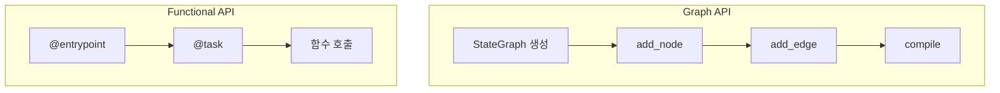

# Chapter 18: Functional API

> 📌 **학습 목표**: 이 장을 마치면 Functional API를 사용하여 더 선언적이고 간결한 방식으로 워크플로우를 구현할 수 있습니다.

## 개요

**Functional API**는 LangGraph의 대안적인 워크플로우 정의 방식입니다. Graph API가 명시적으로 노드와 에지를 정의하는 반면, Functional API는 Python 함수와 데코레이터를 사용하여 더 간결하게 워크플로우를 표현합니다.



## 핵심 개념

### Graph API vs Functional API

| 특성 | Graph API | Functional API |
|-----|-----------|----------------|
| **정의 방식** | 명시적 노드/에지 | 데코레이터 기반 |
| **제어 흐름** | 그래프 구조 | Python 제어문 |
| **유연성** | 복잡한 그래프 | 동적 워크플로우 |
| **가독성** | 시각적 명확성 | 코드 간결성 |
| **사용 사례** | 정적 워크플로우 | 동적 워크플로우 |

### 주요 구성요소

1. **@entrypoint**: 워크플로우 진입점 정의
2. **@task**: 개별 작업 단위 정의
3. **interrupt()**: 사용자 개입 지점

## 실습 1: 기본 Functional API

```python
# 📁 src/part5_advanced/18_functional_api.py
from langgraph.func import entrypoint, task
from langgraph.checkpoint.memory import MemorySaver


@task
def step_a(input_text: str) -> str:
    """첫 번째 작업"""
    return f"Step A 처리: {input_text}"


@task
def step_b(text: str) -> str:
    """두 번째 작업"""
    return f"Step B 처리: {text}"


@entrypoint(checkpointer=MemorySaver())
def my_workflow(input_text: str) -> str:
    """워크플로우 정의"""
    result_a = step_a(input_text).result()
    result_b = step_b(result_a).result()
    return result_b


# 실행
result = my_workflow.invoke(
    "Hello",
    config={"configurable": {"thread_id": "demo"}}
)
print(result)  # "Step B 처리: Step A 처리: Hello"
```

> 💡 **전체 코드**: [src/part5_advanced/18_functional_api.py](../../src/part5_advanced/18_functional_api.py)

## 실습 2: 조건부 로직

Functional API에서는 Python의 조건문을 직접 사용합니다.

```python
@task
def classify(text: str) -> str:
    """텍스트 분류"""
    if "긴급" in text:
        return "urgent"
    return "normal"


@task
def handle_urgent(text: str) -> str:
    """긴급 처리"""
    return f"🚨 긴급 처리: {text}"


@task
def handle_normal(text: str) -> str:
    """일반 처리"""
    return f"📋 일반 처리: {text}"


@entrypoint(checkpointer=MemorySaver())
def conditional_workflow(text: str) -> str:
    """조건부 워크플로우"""
    category = classify(text).result()

    # Python 조건문 직접 사용
    if category == "urgent":
        return handle_urgent(text).result()
    else:
        return handle_normal(text).result()
```

## 실습 3: 반복 처리

```python
from typing import List


@task
def process_item(item: str) -> str:
    """개별 아이템 처리"""
    return f"처리됨: {item}"


@entrypoint(checkpointer=MemorySaver())
def loop_workflow(items: List[str]) -> List[str]:
    """반복 워크플로우"""
    results = []

    # Python 반복문 직접 사용
    for item in items:
        result = process_item(item).result()
        results.append(result)

    return results


# 실행
result = loop_workflow.invoke(
    ["A", "B", "C"],
    config={"configurable": {"thread_id": "loop"}}
)
# ["처리됨: A", "처리됨: B", "처리됨: C"]
```

## 실습 4: 병렬 처리

```python
@task
def fetch_data_a() -> dict:
    """데이터 A 조회"""
    return {"source": "A", "value": 100}


@task
def fetch_data_b() -> dict:
    """데이터 B 조회"""
    return {"source": "B", "value": 200}


@entrypoint(checkpointer=MemorySaver())
def parallel_workflow() -> dict:
    """병렬 처리 워크플로우"""
    # 동시에 작업 시작
    future_a = fetch_data_a()
    future_b = fetch_data_b()

    # 결과 수집
    result_a = future_a.result()
    result_b = future_b.result()

    return {
        "total": result_a["value"] + result_b["value"],
        "sources": [result_a["source"], result_b["source"]]
    }
```

## 실습 5: Human-in-the-Loop

```python
from langgraph.types import interrupt


@task
def analyze(data: str) -> dict:
    """데이터 분석"""
    return {"data": data, "risk": "high"}


@task
def execute(data: str) -> str:
    """실행"""
    return f"실행 완료: {data}"


@entrypoint(checkpointer=MemorySaver())
def approval_workflow(data: str) -> str:
    """승인 워크플로우"""
    analysis = analyze(data).result()

    # 고위험인 경우 승인 요청
    if analysis["risk"] == "high":
        response = interrupt({
            "message": "고위험 작업입니다. 승인하시겠습니까?",
            "analysis": analysis
        })

        if response != "approved":
            return "작업이 취소되었습니다."

    return execute(data).result()
```

## 실습 6: 상태 관리

```python
from langgraph.func import entrypoint, task
from langgraph.checkpoint.memory import MemorySaver


@entrypoint(checkpointer=MemorySaver())
def stateful_workflow(input_data: dict) -> dict:
    """상태를 관리하는 워크플로우"""
    # 이전 상태 가져오기 (첫 실행 시 None)
    previous = entrypoint.get_state()

    # 상태 업데이트
    count = (previous.get("count", 0) if previous else 0) + 1

    # 새 상태 저장
    entrypoint.set_state({"count": count, "last_input": input_data})

    return {"processed": True, "total_count": count}


# 여러 번 호출
config = {"configurable": {"thread_id": "stateful"}}
result1 = stateful_workflow.invoke({"item": "A"}, config)  # count: 1
result2 = stateful_workflow.invoke({"item": "B"}, config)  # count: 2
```

## Graph API vs Functional API 선택 가이드

### Functional API 선택 시

- 동적 워크플로우 (런타임에 경로 결정)
- 복잡한 조건/반복 로직
- Python 개발자 친화적 코드
- 빠른 프로토타이핑

### Graph API 선택 시

- 시각화가 중요한 경우
- 명확한 그래프 구조
- 복잡한 에지 조건
- 팀 협업 (구조 명확성)

## 요약

- **@entrypoint**: 워크플로우 진입점
- **@task**: 개별 작업 단위
- **Python 제어문**: 조건/반복을 직접 표현
- **interrupt()**: 사용자 개입 지점
- **병렬 처리**: Future 패턴 활용

## 다음 단계

다음 장에서는 **Durable Execution**을 학습합니다. 장기 실행 워크플로우의 안정성을 보장하는 방법을 다룹니다.

👉 [Chapter 19: Durable Execution](./19-durable-execution.md)

---

## 📚 참고 자료

### 공식 문서
- [Functional API (공식 온라인)](https://langchain-ai.github.io/langgraph/concepts/functional_api/) - Functional API 가이드
- [Choosing APIs (공식 온라인)](https://langchain-ai.github.io/langgraph/concepts/choosing_apis/) - API 선택 가이드

### 실습 코드
- [전체 소스](../../src/part5_advanced/18_functional_api.py) - 실행 가능한 전체 코드

### 관련 챕터
- [이전: Chapter 17 - Time Travel](../Part4-Production/17-time-travel.md)
- [다음: Chapter 19 - Durable Execution](./19-durable-execution.md)
