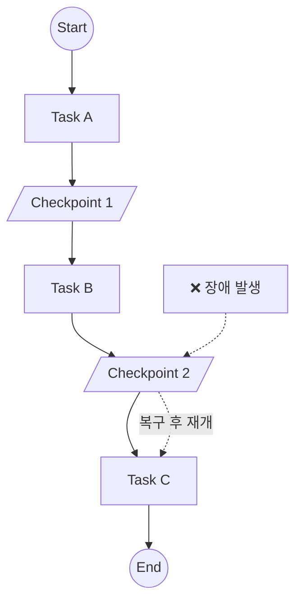

# Chapter 19: Durable Execution

> 📌 **학습 목표**: 이 장을 마치면 장기 실행 워크플로우에서 장애 복구와 상태 지속성을 보장하는 Durable Execution 패턴을 구현할 수 있습니다.

## 개요

**Durable Execution**은 워크플로우가 중단되더라도 마지막 성공 지점부터 재개할 수 있는 실행 패턴입니다. 네트워크 오류, 서버 재시작, 타임아웃 등의 상황에서도 작업을 안전하게 완료할 수 있습니다.



## 핵심 개념

### Durable Execution의 필요성

| 상황 | 문제 | Durable Execution 해결책 |
|-----|------|------------------------|
| 서버 재시작 | 진행 상태 손실 | Checkpoint에서 복구 |
| 네트워크 오류 | 중복 실행 위험 | 멱등성 보장 |
| 장시간 작업 | 타임아웃 | 중간 저장점 |
| 외부 API 실패 | 전체 실패 | 부분 재시도 |

### 구현 요소

1. **Checkpointer**: 상태 지속성 제공
2. **Task Idempotency**: 멱등한 작업 설계
3. **Error Recovery**: 에러 복구 전략
4. **Retry Logic**: 재시도 로직

## 실습 1: 기본 Durable Execution

```python
# 📁 src/part5_advanced/19_durable_execution.py
from langgraph.graph import StateGraph, START, END
from langgraph.checkpoint.sqlite import SqliteSaver
from typing import TypedDict
import time


class WorkflowState(TypedDict):
    task_id: str
    progress: int
    results: list
    completed: bool


def create_durable_workflow():
    """Durable Execution 워크플로우"""

    def task_a(state: WorkflowState) -> WorkflowState:
        """장시간 작업 A"""
        print(f"Task A 실행 (progress: {state['progress']})")
        time.sleep(1)  # 시뮬레이션
        return {
            "progress": 33,
            "results": state.get("results", []) + ["A 완료"]
        }

    def task_b(state: WorkflowState) -> WorkflowState:
        """장시간 작업 B"""
        print(f"Task B 실행 (progress: {state['progress']})")
        time.sleep(1)
        return {
            "progress": 66,
            "results": state.get("results", []) + ["B 완료"]
        }

    def task_c(state: WorkflowState) -> WorkflowState:
        """장시간 작업 C"""
        print(f"Task C 실행 (progress: {state['progress']})")
        time.sleep(1)
        return {
            "progress": 100,
            "results": state.get("results", []) + ["C 완료"],
            "completed": True
        }

    graph = StateGraph(WorkflowState)
    graph.add_node("task_a", task_a)
    graph.add_node("task_b", task_b)
    graph.add_node("task_c", task_c)

    graph.add_edge(START, "task_a")
    graph.add_edge("task_a", "task_b")
    graph.add_edge("task_b", "task_c")
    graph.add_edge("task_c", END)

    # SQLite로 상태 지속성 보장
    checkpointer = SqliteSaver.from_conn_string("workflow.db")
    return graph.compile(checkpointer=checkpointer)
```

> 💡 **전체 코드**: [src/part5_advanced/19_durable_execution.py](../../src/part5_advanced/19_durable_execution.py)

## 실습 2: 재시도 로직 구현

```python
import random
from tenacity import retry, stop_after_attempt, wait_exponential


@retry(
    stop=stop_after_attempt(3),
    wait=wait_exponential(multiplier=1, min=1, max=10)
)
def unreliable_api_call(data: str) -> dict:
    """불안정한 외부 API 호출"""
    if random.random() < 0.3:
        raise ConnectionError("API 일시적 오류")
    return {"status": "success", "data": data}


def task_with_retry(state: WorkflowState) -> WorkflowState:
    """재시도 로직이 포함된 작업"""
    try:
        result = unreliable_api_call(state["task_id"])
        return {
            "results": state.get("results", []) + [result]
        }
    except Exception as e:
        # 최종 실패 시 에러 상태 기록
        return {
            "results": state.get("results", []) + [{"error": str(e)}]
        }
```

## 실습 3: 멱등성 보장

```python
from datetime import datetime
import hashlib


class IdempotentState(TypedDict):
    request_id: str
    processed_ids: list
    results: list


def create_idempotent_workflow():
    """멱등성이 보장된 워크플로우"""

    def process_task(state: IdempotentState) -> IdempotentState:
        """멱등한 작업 처리"""
        request_id = state["request_id"]
        processed = state.get("processed_ids", [])

        # 이미 처리된 요청인지 확인
        if request_id in processed:
            print(f"이미 처리된 요청: {request_id}")
            return {}  # 상태 변경 없음

        # 새 요청 처리
        result = f"처리됨: {request_id} at {datetime.now()}"

        return {
            "processed_ids": processed + [request_id],
            "results": state.get("results", []) + [result]
        }

    graph = StateGraph(IdempotentState)
    graph.add_node("process", process_task)
    graph.add_edge(START, "process")
    graph.add_edge("process", END)

    checkpointer = SqliteSaver.from_conn_string("idempotent.db")
    return graph.compile(checkpointer=checkpointer)
```

## 실습 4: 장애 복구

```python
from langgraph.checkpoint.sqlite import SqliteSaver


def recover_workflow(thread_id: str):
    """중단된 워크플로우 복구"""
    checkpointer = SqliteSaver.from_conn_string("workflow.db")
    app = create_durable_workflow()

    config = {"configurable": {"thread_id": thread_id}}

    # 현재 상태 확인
    state = app.get_state(config)

    if state.values:
        print(f"복구된 상태: progress={state.values.get('progress')}%")
        print(f"다음 노드: {state.next}")

        if state.next:
            # 중단된 지점부터 재개
            result = app.invoke(None, config=config)
            return result
        else:
            print("이미 완료된 워크플로우입니다.")
            return state.values
    else:
        print("복구할 상태가 없습니다.")
        return None


# 사용 예시
# 1. 워크플로우 시작
config = {"configurable": {"thread_id": "job_123"}}
app = create_durable_workflow()
result = app.invoke({"task_id": "job_123", "progress": 0, "results": [], "completed": False}, config)

# 2. 장애 발생 후 복구
recovered = recover_workflow("job_123")
```

## 실습 5: 타임아웃 처리

```python
import asyncio
from typing import Optional


class TimeoutState(TypedDict):
    task_id: str
    timeout_seconds: int
    result: Optional[str]
    timed_out: bool


async def task_with_timeout(state: TimeoutState) -> TimeoutState:
    """타임아웃이 있는 작업"""
    timeout = state.get("timeout_seconds", 30)

    async def long_running_task():
        await asyncio.sleep(5)  # 시뮬레이션
        return "완료"

    try:
        result = await asyncio.wait_for(
            long_running_task(),
            timeout=timeout
        )
        return {"result": result, "timed_out": False}
    except asyncio.TimeoutError:
        return {"result": None, "timed_out": True}
```

## 실습 6: 분산 락을 사용한 동시성 제어

```python
import threading
from contextlib import contextmanager


class DistributedLock:
    """간단한 분산 락 구현 (실제로는 Redis 등 사용)"""
    _locks = {}
    _lock = threading.Lock()

    @classmethod
    @contextmanager
    def acquire(cls, key: str, timeout: float = 30.0):
        """락 획득"""
        with cls._lock:
            if key not in cls._locks:
                cls._locks[key] = threading.Lock()

        lock = cls._locks[key]
        acquired = lock.acquire(timeout=timeout)

        if not acquired:
            raise TimeoutError(f"락 획득 실패: {key}")

        try:
            yield
        finally:
            lock.release()


def task_with_lock(state: WorkflowState) -> WorkflowState:
    """락을 사용하는 작업"""
    task_id = state["task_id"]

    with DistributedLock.acquire(f"task_{task_id}"):
        # 동시 실행 방지가 필요한 작업
        result = perform_critical_operation(state)

    return result
```

## 고급 패턴: Saga 패턴

```python
class SagaState(TypedDict):
    """Saga 패턴 State"""
    steps_completed: list
    compensations: list
    final_result: str


def create_saga_workflow():
    """Saga 패턴 워크플로우 - 보상 트랜잭션 지원"""

    def step_1(state: SagaState) -> SagaState:
        """Step 1 실행"""
        # 실행
        result = "Step 1 완료"
        # 보상 액션 등록
        compensation = {"step": 1, "action": "rollback_step_1"}

        return {
            "steps_completed": state.get("steps_completed", []) + [result],
            "compensations": [compensation] + state.get("compensations", [])
        }

    def step_2(state: SagaState) -> SagaState:
        """Step 2 실행 (실패 시뮬레이션 가능)"""
        import random

        if random.random() < 0.3:
            # 실패 시 보상 실행
            raise Exception("Step 2 실패!")

        return {
            "steps_completed": state.get("steps_completed", []) + ["Step 2 완료"],
            "compensations": [{"step": 2, "action": "rollback_step_2"}] + state.get("compensations", [])
        }

    def compensate(state: SagaState) -> SagaState:
        """보상 트랜잭션 실행"""
        compensations = state.get("compensations", [])

        for comp in compensations:
            print(f"보상 실행: {comp['action']}")

        return {
            "final_result": "롤백 완료",
            "compensations": []
        }

    def finalize(state: SagaState) -> SagaState:
        """최종화"""
        return {"final_result": "성공적으로 완료"}

    # 그래프 구성은 에러 핸들링 포함
    graph = StateGraph(SagaState)
    graph.add_node("step_1", step_1)
    graph.add_node("step_2", step_2)
    graph.add_node("compensate", compensate)
    graph.add_node("finalize", finalize)

    # 에지 설정 (실제로는 에러 핸들링 로직 추가)
    graph.add_edge(START, "step_1")
    graph.add_edge("step_1", "step_2")
    graph.add_edge("step_2", "finalize")
    graph.add_edge("finalize", END)

    checkpointer = SqliteSaver.from_conn_string("saga.db")
    return graph.compile(checkpointer=checkpointer)
```

## 요약

- **Checkpointer**: 상태 지속성의 핵심
- **멱등성**: 중복 실행에도 동일한 결과
- **재시도**: 일시적 오류 극복
- **타임아웃**: 무한 대기 방지
- **Saga 패턴**: 분산 트랜잭션 관리

## 다음 단계

다음 장에서는 **배포 준비**를 학습합니다. 프로덕션 환경에 LangGraph 애플리케이션을 배포하는 방법을 다룹니다.

👉 [Chapter 20: 배포 준비](./20-deployment.md)

---

## 📚 참고 자료

### 공식 문서
- [Durable Execution (공식 온라인)](https://langchain-ai.github.io/langgraph/concepts/durable_execution/) - Durable Execution 가이드
- [Checkpointing (공식 온라인)](https://langchain-ai.github.io/langgraph/concepts/persistence/) - 지속성 가이드

### 실습 코드
- [전체 소스](../../src/part5_advanced/19_durable_execution.py) - 실행 가능한 전체 코드

### 관련 챕터
- [이전: Chapter 18 - Functional API](./18-functional-api.md)
- [다음: Chapter 20 - 배포 준비](./20-deployment.md)
