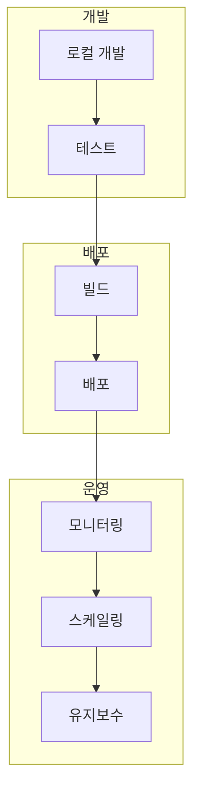

# Chapter 20: 배포 준비

> 📌 **학습 목표**: 이 장을 마치면 LangGraph 애플리케이션을 프로덕션 환경에 배포하기 위한 구조, 설정, 모니터링을 구현할 수 있습니다.

## 개요

**배포 준비**는 개발된 LangGraph 애플리케이션을 프로덕션 환경에서 안정적으로 운영하기 위한 모든 준비 과정입니다. 애플리케이션 구조, 환경 설정, 모니터링, 스케일링 등을 다룹니다.



## 핵심 개념

### 프로덕션 체크리스트

| 항목 | 설명 | 중요도 |
|-----|------|--------|
| **에러 핸들링** | 예외 처리 및 복구 | 필수 |
| **로깅** | 구조화된 로깅 | 필수 |
| **모니터링** | 메트릭 수집 | 필수 |
| **보안** | 인증/인가 | 필수 |
| **스케일링** | 수평/수직 확장 | 권장 |
| **백업** | 상태 백업 | 권장 |

## 실습 1: 프로젝트 구조

```
# 📁 권장 프로젝트 구조
my_langgraph_app/
├── src/
│   ├── __init__.py
│   ├── app.py              # 애플리케이션 진입점
│   ├── graphs/
│   │   ├── __init__.py
│   │   └── main_graph.py   # 그래프 정의
│   ├── nodes/
│   │   ├── __init__.py
│   │   └── processors.py   # 노드 함수들
│   ├── state/
│   │   ├── __init__.py
│   │   └── schemas.py      # State 정의
│   └── tools/
│       ├── __init__.py
│       └── external.py     # 외부 도구 연동
├── config/
│   ├── settings.py         # 설정 관리
│   └── logging.yaml        # 로깅 설정
├── tests/
│   ├── __init__.py
│   └── test_graphs.py
├── Dockerfile
├── docker-compose.yml
├── requirements.txt
└── .env.example
```

```python
# 📁 src/part5_advanced/20_deployment_ready.py
# config/settings.py
from pydantic_settings import BaseSettings
from typing import Optional


class Settings(BaseSettings):
    """애플리케이션 설정"""
    # 환경
    environment: str = "development"
    debug: bool = False

    # LLM 설정
    anthropic_api_key: str
    model_name: str = "claude-sonnet-4-5-20250929"

    # 데이터베이스
    database_url: str = "sqlite:///langgraph.db"

    # Redis (캐싱/큐)
    redis_url: Optional[str] = None

    # 관측성
    langsmith_api_key: Optional[str] = None
    langsmith_project: str = "langgraph-production"

    class Config:
        env_file = ".env"


settings = Settings()
```

> 💡 **전체 코드**: [src/part5_advanced/20_deployment_ready.py](../../src/part5_advanced/20_deployment_ready.py)

## 실습 2: 로깅 설정

```python
# config/logging.yaml
import logging
import logging.config
import yaml


LOGGING_CONFIG = """
version: 1
disable_existing_loggers: false

formatters:
  standard:
    format: '%(asctime)s - %(name)s - %(levelname)s - %(message)s'
  json:
    class: pythonjsonlogger.jsonlogger.JsonFormatter
    format: '%(asctime)s %(name)s %(levelname)s %(message)s'

handlers:
  console:
    class: logging.StreamHandler
    level: DEBUG
    formatter: standard
    stream: ext://sys.stdout
  file:
    class: logging.handlers.RotatingFileHandler
    level: INFO
    formatter: json
    filename: logs/app.log
    maxBytes: 10485760  # 10MB
    backupCount: 5

loggers:
  langgraph:
    level: INFO
    handlers: [console, file]
    propagate: false

  app:
    level: DEBUG
    handlers: [console, file]
    propagate: false

root:
  level: WARNING
  handlers: [console]
"""


def setup_logging():
    """로깅 설정 초기화"""
    config = yaml.safe_load(LOGGING_CONFIG)
    logging.config.dictConfig(config)


# 사용
setup_logging()
logger = logging.getLogger("app")
logger.info("애플리케이션 시작")
```

## 실습 3: 에러 핸들링

```python
from typing import TypedDict, Optional
from langgraph.graph import StateGraph, START, END
import logging


logger = logging.getLogger("app")


class RobustState(TypedDict):
    """견고한 State"""
    input: str
    result: Optional[str]
    error: Optional[str]
    retry_count: int


def create_robust_graph():
    """견고한 에러 핸들링이 포함된 그래프"""

    def process_with_retry(state: RobustState) -> RobustState:
        """재시도 로직이 포함된 처리"""
        max_retries = 3
        retry_count = state.get("retry_count", 0)

        try:
            # 비즈니스 로직
            result = perform_operation(state["input"])
            logger.info(f"처리 성공: {state['input']}")
            return {"result": result, "error": None}

        except TransientError as e:
            # 일시적 오류 - 재시도 가능
            if retry_count < max_retries:
                logger.warning(f"일시적 오류, 재시도 {retry_count + 1}/{max_retries}")
                return {"retry_count": retry_count + 1}
            else:
                logger.error(f"최대 재시도 초과: {e}")
                return {"error": str(e)}

        except PermanentError as e:
            # 영구 오류 - 재시도 불가
            logger.error(f"영구 오류: {e}")
            return {"error": str(e)}

        except Exception as e:
            # 예상치 못한 오류
            logger.exception(f"예상치 못한 오류: {e}")
            return {"error": f"알 수 없는 오류: {str(e)}"}

    def route_after_process(state: RobustState) -> str:
        """처리 후 라우팅"""
        if state.get("error"):
            return "handle_error"
        elif state.get("retry_count", 0) > 0 and not state.get("result"):
            return "process"  # 재시도
        return "finalize"

    def handle_error(state: RobustState) -> RobustState:
        """에러 처리"""
        # 알림, 로깅, 폴백 등
        return {"result": f"에러 발생: {state['error']}"}

    def finalize(state: RobustState) -> RobustState:
        """완료 처리"""
        return {"result": f"완료: {state['result']}"}

    graph = StateGraph(RobustState)
    graph.add_node("process", process_with_retry)
    graph.add_node("handle_error", handle_error)
    graph.add_node("finalize", finalize)

    graph.add_edge(START, "process")
    graph.add_conditional_edges("process", route_after_process)
    graph.add_edge("handle_error", END)
    graph.add_edge("finalize", END)

    return graph.compile()
```

## 실습 4: 모니터링 및 메트릭

```python
from dataclasses import dataclass
from datetime import datetime
from typing import Dict, Any
import time


@dataclass
class Metrics:
    """메트릭 수집"""
    request_count: int = 0
    success_count: int = 0
    error_count: int = 0
    total_duration_ms: float = 0.0

    def record_request(self, success: bool, duration_ms: float):
        """요청 기록"""
        self.request_count += 1
        self.total_duration_ms += duration_ms
        if success:
            self.success_count += 1
        else:
            self.error_count += 1

    @property
    def avg_duration_ms(self) -> float:
        """평균 응답 시간"""
        if self.request_count == 0:
            return 0.0
        return self.total_duration_ms / self.request_count

    @property
    def success_rate(self) -> float:
        """성공률"""
        if self.request_count == 0:
            return 0.0
        return self.success_count / self.request_count * 100

    def to_dict(self) -> Dict[str, Any]:
        """딕셔너리 변환"""
        return {
            "request_count": self.request_count,
            "success_count": self.success_count,
            "error_count": self.error_count,
            "avg_duration_ms": round(self.avg_duration_ms, 2),
            "success_rate": round(self.success_rate, 2)
        }


# 전역 메트릭 인스턴스
metrics = Metrics()


def with_metrics(func):
    """메트릭 수집 데코레이터"""
    def wrapper(*args, **kwargs):
        start = time.time()
        success = True
        try:
            result = func(*args, **kwargs)
            return result
        except Exception as e:
            success = False
            raise
        finally:
            duration_ms = (time.time() - start) * 1000
            metrics.record_request(success, duration_ms)
    return wrapper


# 사용
@with_metrics
def process_request(data: dict):
    """요청 처리"""
    # 비즈니스 로직
    pass
```

## 실습 5: LangSmith 통합

```python
import os
from langsmith import Client


def setup_langsmith():
    """LangSmith 관측성 설정"""
    os.environ["LANGCHAIN_TRACING_V2"] = "true"
    os.environ["LANGCHAIN_PROJECT"] = settings.langsmith_project
    os.environ["LANGCHAIN_API_KEY"] = settings.langsmith_api_key


# LangSmith 클라이언트
client = Client()


def get_recent_runs(limit: int = 10):
    """최근 실행 조회"""
    runs = client.list_runs(
        project_name=settings.langsmith_project,
        limit=limit
    )
    return list(runs)


def analyze_performance():
    """성능 분석"""
    runs = get_recent_runs(100)

    total_latency = 0
    error_count = 0

    for run in runs:
        if run.end_time and run.start_time:
            latency = (run.end_time - run.start_time).total_seconds()
            total_latency += latency
        if run.error:
            error_count += 1

    avg_latency = total_latency / len(runs) if runs else 0
    error_rate = error_count / len(runs) * 100 if runs else 0

    return {
        "avg_latency_seconds": round(avg_latency, 3),
        "error_rate_percent": round(error_rate, 2),
        "total_runs": len(runs)
    }
```

## 실습 6: Docker 배포

```dockerfile
# Dockerfile
FROM python:3.11-slim

WORKDIR /app

# 의존성 설치
COPY requirements.txt .
RUN pip install --no-cache-dir -r requirements.txt

# 소스 복사
COPY src/ ./src/
COPY config/ ./config/

# 환경 변수
ENV PYTHONPATH=/app
ENV ENVIRONMENT=production

# 로그 디렉토리
RUN mkdir -p /app/logs

# 비root 사용자
RUN useradd -m appuser && chown -R appuser:appuser /app
USER appuser

# 실행
CMD ["python", "-m", "src.app"]
```

```yaml
# docker-compose.yml
version: '3.8'

services:
  app:
    build: .
    ports:
      - "8000:8000"
    environment:
      - ANTHROPIC_API_KEY=${ANTHROPIC_API_KEY}
      - DATABASE_URL=postgresql://postgres:postgres@db:5432/langgraph
      - REDIS_URL=redis://redis:6379
    depends_on:
      - db
      - redis
    volumes:
      - ./logs:/app/logs
    restart: unless-stopped

  db:
    image: postgres:15
    environment:
      - POSTGRES_USER=postgres
      - POSTGRES_PASSWORD=postgres
      - POSTGRES_DB=langgraph
    volumes:
      - postgres_data:/var/lib/postgresql/data
    restart: unless-stopped

  redis:
    image: redis:7-alpine
    restart: unless-stopped

volumes:
  postgres_data:
```

## 실습 7: 헬스 체크 API

```python
from fastapi import FastAPI, HTTPException
from datetime import datetime


app = FastAPI()


@app.get("/health")
async def health_check():
    """기본 헬스 체크"""
    return {
        "status": "healthy",
        "timestamp": datetime.now().isoformat()
    }


@app.get("/health/detailed")
async def detailed_health_check():
    """상세 헬스 체크"""
    checks = {}

    # 데이터베이스 체크
    try:
        # db.execute("SELECT 1")
        checks["database"] = "healthy"
    except Exception as e:
        checks["database"] = f"unhealthy: {str(e)}"

    # Redis 체크
    try:
        # redis.ping()
        checks["redis"] = "healthy"
    except Exception as e:
        checks["redis"] = f"unhealthy: {str(e)}"

    # LLM API 체크
    try:
        # llm.invoke("test")
        checks["llm_api"] = "healthy"
    except Exception as e:
        checks["llm_api"] = f"unhealthy: {str(e)}"

    # 전체 상태 결정
    all_healthy = all(v == "healthy" for v in checks.values())

    response = {
        "status": "healthy" if all_healthy else "degraded",
        "checks": checks,
        "metrics": metrics.to_dict(),
        "timestamp": datetime.now().isoformat()
    }

    if not all_healthy:
        raise HTTPException(status_code=503, detail=response)

    return response


@app.get("/metrics")
async def get_metrics():
    """메트릭 엔드포인트"""
    return metrics.to_dict()
```

## 배포 체크리스트

```markdown
## 프로덕션 배포 전 체크리스트

### 필수
- [ ] 환경 변수 설정 (.env)
- [ ] API 키 보안 (시크릿 관리)
- [ ] 에러 핸들링 구현
- [ ] 로깅 설정
- [ ] 헬스 체크 엔드포인트
- [ ] 데이터베이스 연결 설정

### 권장
- [ ] LangSmith 통합
- [ ] 메트릭 수집
- [ ] 알림 설정 (Slack, PagerDuty 등)
- [ ] 백업 정책
- [ ] 스케일링 설정
- [ ] CI/CD 파이프라인

### 문서
- [ ] API 문서
- [ ] 운영 가이드
- [ ] 장애 대응 매뉴얼
```

## 요약

- **프로젝트 구조**: 모듈화된 디렉토리 구성
- **설정 관리**: 환경별 설정 분리
- **로깅**: 구조화된 로깅 시스템
- **에러 핸들링**: 재시도, 폴백, 복구
- **모니터링**: 메트릭 수집 및 관측성
- **배포**: Docker 컨테이너화

## 마무리

이것으로 LangGraph 튜토리얼의 모든 핵심 내용을 다루었습니다. 부록에서는 API 레퍼런스, 문제 해결, 모범 사례를 추가로 제공합니다.

👉 [Appendix A: API 레퍼런스](../Appendix/A-api-reference.md)

---

## 📚 참고 자료

### 공식 문서
- [Application Structure (공식 온라인)](https://langchain-ai.github.io/langgraph/concepts/application_structure/) - 애플리케이션 구조
- [LangGraph Cloud (공식 온라인)](https://langchain-ai.github.io/langgraph/concepts/langgraph_cloud/) - 클라우드 배포

### 실습 코드
- [전체 소스](../../src/part5_advanced/20_deployment_ready.py) - 실행 가능한 전체 코드

### 관련 챕터
- [이전: Chapter 19 - Durable Execution](./19-durable-execution.md)
- [다음: Appendix A - API 레퍼런스](../Appendix/A-api-reference.md)
