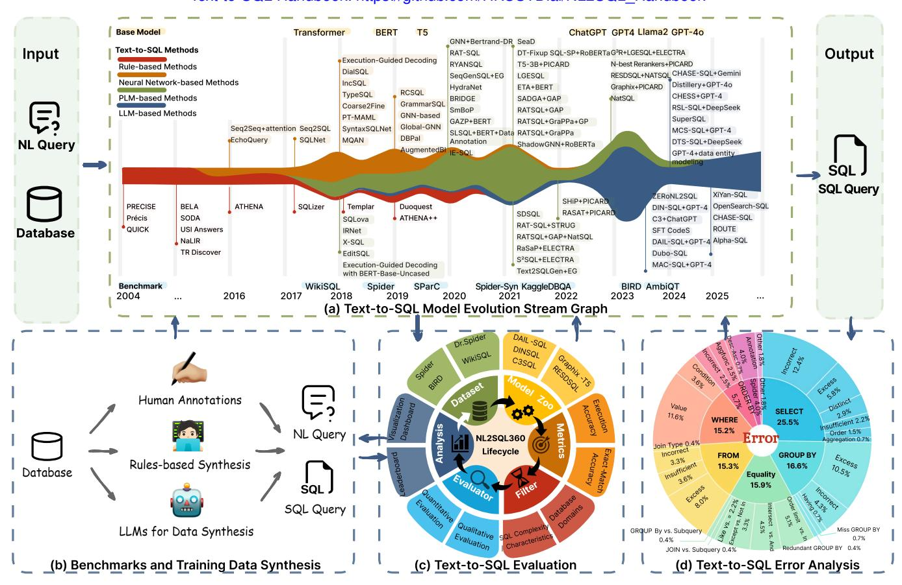
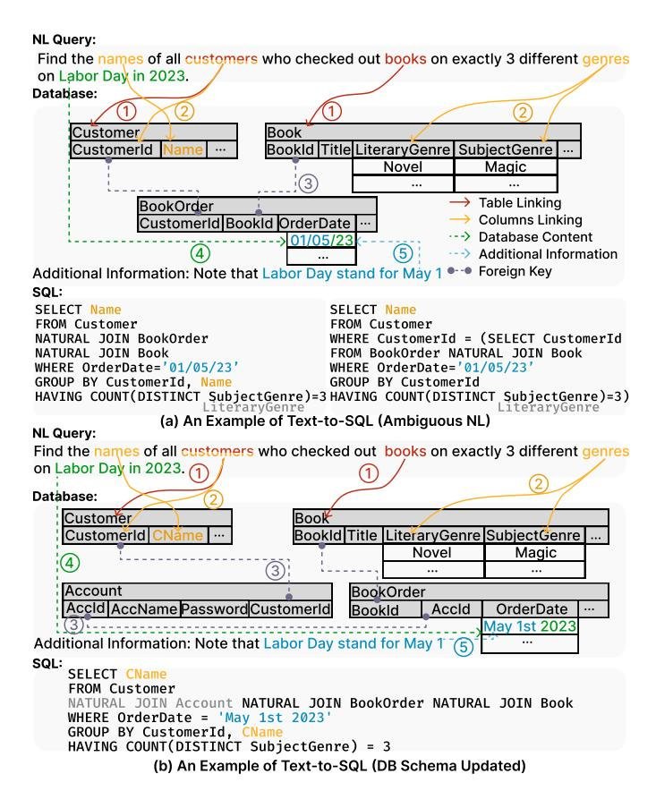
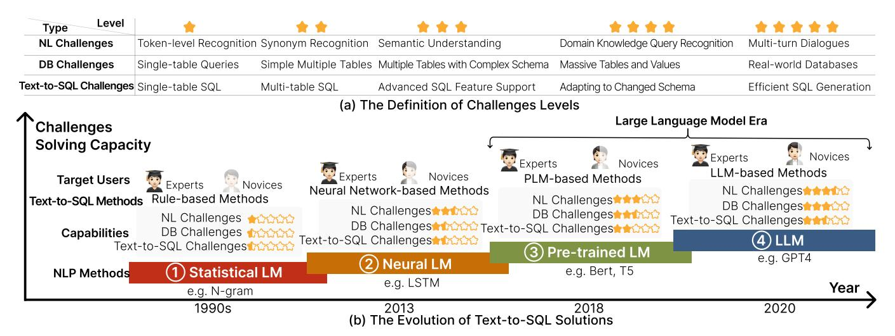
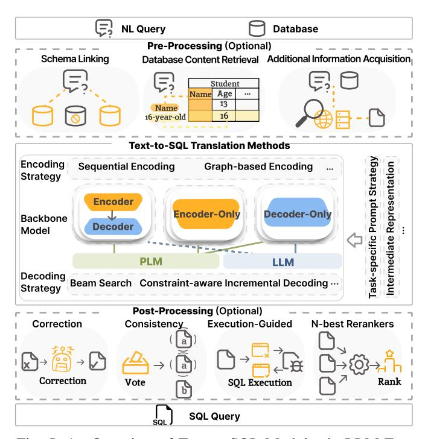
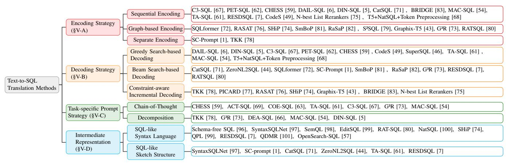
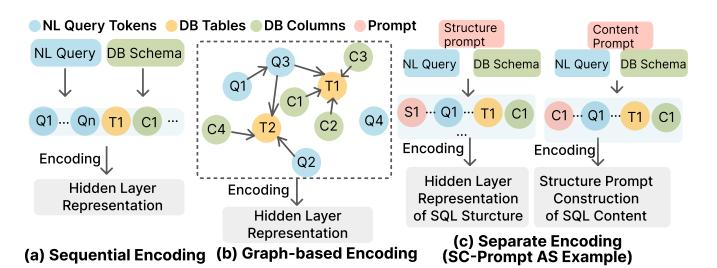
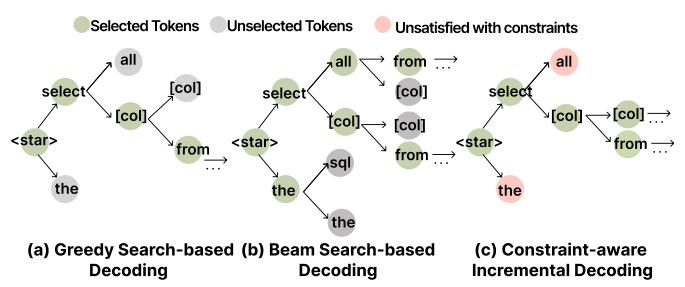
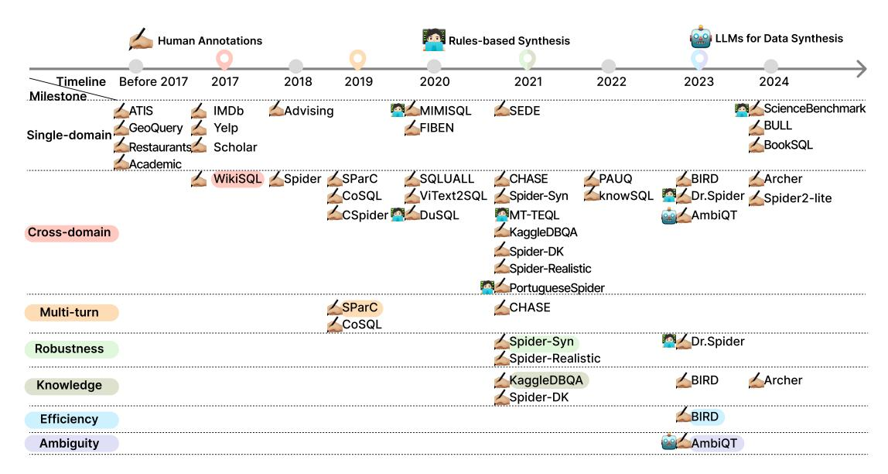
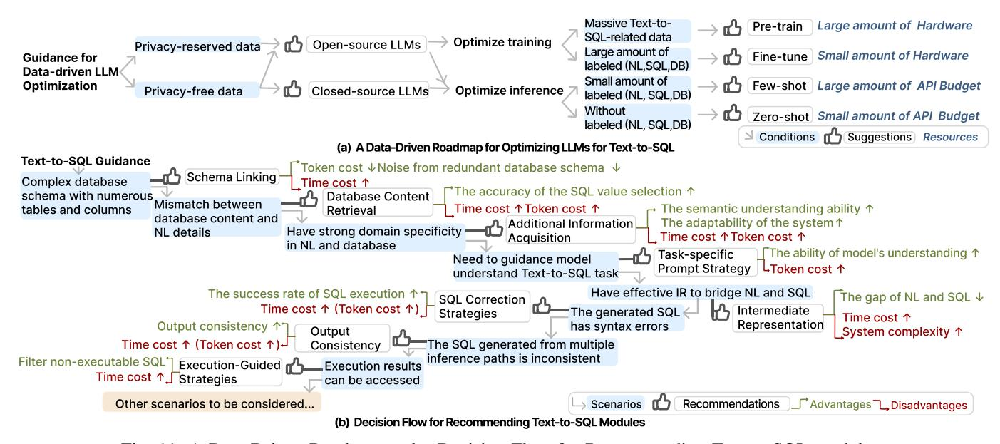

# A Survey of Text-to-SQL in the Era of LLMs: Where are we, and where are we going?

Xinyu Liu, Shuyu Shen, Boyan Li, Peixian Ma, Runzhi Jiang, Yuxin Zhang, Ju Fan, Guoliang Li, *Fellow, IEEE*, Nan Tang, and Yuyu Luo\*

Text-to-SQL Handbook: https://github.com/HKUSTDial/NL2SQL Handbook

<span id="page-0-0"></span>

Fig. 1: An Overview of the Survey: The Lifecycle of the Text-to-SQL Task.

Abstract—Translating users' natural language queries (NL) into SQL queries (i.e., Text-to-SQL, a.k.a. NL2SQL) can significantly reduce barriers to accessing relational databases and support various commercial applications. The performance of Text-to-SQL has been greatly enhanced with the emergence of Large Language Models (LLMs). In this survey, we provide a comprehensive review of Text-to-SQL techniques powered by LLMs, covering its entire lifecycle from the following four aspects: (1) Model: Text-to-SQL translation techniques that tackle not only NL ambiguity and under-specification, but also properly map NL with database schema and instances; (2) Data: From the collection of training data, data synthesis due to training data scarcity, to Text-to-SQL benchmarks; (3) Evaluation: Evaluating Text-to-SQL methods from multiple angles using different metrics and granularities; and (4) Error Analysis: analyzing

Xinyu Liu, Shuyu Shen, Boyan Li, Peixian Ma, Runzhi Jiang, Nan Tang and Yuyu Luo are with The Hong Kong University of Science and Technology (Guangzhou), China. E-mail: {xliu371, sshen190, bli303, rjiang073, pma929}@connect.hkust-gz.edu.cn, {yuyuluo, nantang}@hkust-gz.edu.cn.

Yuxin Zhang and Ju Fan are with Renmin University of China, Beijing, China. E-mail: {zhangyuxin159, fanj}@ruc.edu.cn. Guoliang Li is with Tsinghua University, Beijing, China. E-mail: liguoliang@tsinghua.edu.cn.

\*Corresponding Author: Yuyu Luo (yuyuluo@hkust-gz.edu.cn).

Text-to-SQL errors to find the root cause and guiding Text-to-SQL models to evolve. Moreover, we offer a rule of thumb for developing Text-to-SQL solutions. Finally, we discuss the research challenges and open problems of Text-to-SQL in the LLMs era.

Index Terms—Natural Language to SQL, Database Interface, Large Language Models, Text-to-SQL.

#### I. INTRODUCTION

ATURAL Language to SQL (i.e., Text-to-SQL), which converts a natural language query (NL) into an SQL query, is a key technique toward lowering the barrier to accessing relational databases [1]–[7]. This technique supports various applications such as business intelligence and natural language interfaces for databases, making it a key step toward democratizing data science [8]–[18]. Recent advancements in language models have significantly extended the frontiers of research and application in Text-to-SQL. Concurrently, the trend among database vendors to offer Text-to-SQL solutions has evolved from a mere notion to a necessary strategy [19],

[\[20\]](#page-18-2). Therefore, we need to understand the fundamentals, techniques, and challenges regarding Text-to-SQL.

In this survey, we systematically review recent Text-to-SQL techniques through a new framework, as shown in Figure [1.](#page-0-0)

- Text-to-SQL with Language Models. We will first review existing Text-to-SQL solutions from the perspective of language models, categorizing them into four major categories (see Figure [1\(](#page-0-0)a)). We will then focus on the recent advances in Pre-trained Language Models (PLMs) and Large Language Models (LLMs) for Text-to-SQL.
- Benchmarks and Training Data Synthesis. Undoubtedly, the performance of PLM- and LLM-based Text-to-SQL models is highly dependent on the amount and quality of the training data. Therefore, we will first summarize the characteristics of existing benchmarks and analyze their statistical information (*e.g.,* database complexity) in detail. We will then discuss methods for collecting and synthesizing high-quality training data, emphasizing this as a research opportunity (see Figure [1\(](#page-0-0)b)).
- Evaluation. Comprehensively evaluating Text-to-SQL models is crucial for optimizing and selecting models for different usage scenarios. We will discuss the multi-angle evaluation and scenario-based evaluation for the Text-to-SQL task (see Figure [1\(](#page-0-0)c)). For example, we can assess the Text-to-SQL model in specific contexts by filtering benchmarks based on SQL characteristics, NL variants, database domains, and so on.
- Text-to-SQL Error Analysis. Error analysis is essential in Text-to-SQL research for identifying limitations and improving the model robustness. We review existing error taxonomies, analyze their limitations, and propose principles for designing comprehensive taxonomies for Textto-SQL output errors. Using these principles, we create a two-level error taxonomy and utilize it to summarize and analyze Text-to-SQL output errors (see Figure [1\(](#page-0-0)d)).

In addition to the above, we will provide practical guidance for developing Text-to-SQL solutions, including a roadmap for optimizing LLMs for Text-to-SQL tasks and a decision flow for selecting Text-to-SQL modules tailored to various Text-to-SQL scenarios. Finally, we will discuss key open problems in the field, such as open Text-to-SQL tasks, cost-effective Textto-SQL with LLMs, and trustworthy Text-to-SQL solutions.

Differences from Existing Surveys. Our survey distinguishes itself from existing Text-to-SQL surveys [\[21\]](#page-18-3)–[\[28\]](#page-18-4) and tutorials [\[29\]](#page-18-5)–[\[31\]](#page-18-6) in five aspects.

- We systematically review *the entire lifecycle of Textto-SQL problem*, as shown in Figure [1.](#page-0-0) This lifecycle includes various Text-to-SQL translation methodologies powered by language models (Figure [1\(](#page-0-0)a)), training data collection and synthesis methods (Figure [1\(](#page-0-0)b)), multiangle and scenarios-based evaluations (Figure [1\(](#page-0-0)c)), and Text-to-SQL error analysis techniques (Figure [1\(](#page-0-0)d)).
- We provide a more detailed and comprehensive summary of the inherent challenges in Text-to-SQL. Additionally, we analyze the technical challenges when developing a robust Text-to-SQL solution for real-world scenarios, which are often overlooked in other surveys.

- We particularly focus on recent advances in *LLM-based* Text-to-SQL methods, summarizing key modules and comparing different strategies within this scope. We are the first survey to provide a modular summary of methods and provide detailed analyses for each key module (*e.g.,* database content retrieval).
- We highlight the importance of *evaluating Text-to-SQL methods in a multi-angle way*, analyze the Text-to-SQL error patterns, and provide a two-level error taxonomy.
- We provide practitioners with a roadmap for optimizing LLMs to Text-to-SQL and a decision flow for selecting the suitable Text-to-SQL modules for various scenarios.

# Contributions. We make the following contributions.

- *Text-to-SQL with Language Models.* We comprehensively review existing Text-to-SQL techniques from a lifecycle perspective (Figure [1\)](#page-0-0). We introduce the Text-to-SQL task definition, discuss challenges (Figure [2\)](#page-2-0), provide a taxonomy of Text-to-SQL solutions based on language models (Figure [3\)](#page-3-0), and summarize the key modules of language model-powered Text-to-SQL solutions (Figure [5](#page-5-0) and Table [I\)](#page-6-0). Next, we elaborate on each module of language model-powered Text-to-SQL methods, including the pre-processing strategies (Section [IV\)](#page-5-1), Text-to-SQL translation methods (Section [V\)](#page-8-0), and post-processing techniques (Section [VI\)](#page-11-0).
- *Benchmarks and Training Data Synthesis.* We summarize existing Text-to-SQL benchmarks based on their characteristics (Figure [10\)](#page-12-0). We analyze each benchmark in depth and discuss its pros and cons (Table [II\)](#page-13-0). (Section [VII\)](#page-12-1)
- *Evaluation and Errors Analysis.* We highlight the importance of evaluation in developing practical Text-to-SQL solutions. We review widely used evaluation metrics and toolkits for assessing Text-to-SQL solutions. We provide a taxonomy to summarize typical errors produced by Text-to-SQL methods. (Section [VIII\)](#page-14-0)
- *Practical Guidance for Developing Text-to-SQL Solutions.* We provide a roadmap for optimizing existing LLMs to Text-to-SQL tasks (Figure [11\(](#page-16-0)a)). In addition, we design a decision flow to guide the selection of appropriate modules for different scenarios (Figure [11\(](#page-16-0)b)).
- *Open Problems in Text-to-SQL.* We analyze the limitations of LLM-based methods and discuss new research opportunities, including the open-world Text-to-SQL problem and cost-effective solutions (Section [X\)](#page-16-1).
- *Text-to-SQL Handbook.* We maintain an online handbook [\(https://github.com/HKUSTDial/NL2SQL](https://github.com/HKUSTDial/NL2SQL_Handbook) Handbook) to help readers stay current with Text-to-SQL advancements.

# II. TEXT-TO-SQL PROBLEM AND BACKGROUND

In this section, we first formalize the definition of the Textto-SQL task (Section [II-A\)](#page-2-1). We then introduce the workflow of how humans perform the Text-to-SQL task (Section [II-B\)](#page-2-2) and discuss the key challenges (Section [II-C\)](#page-2-3). Finally, we describe the evolution of Text-to-SQL solutions based on the development of language models (Section [II-D\)](#page-4-0).

<span id="page-2-0"></span>

Fig. 2: Examples of the Text-to-SQL Task and Its Challenges.

#### <span id="page-2-1"></span>A. Problem Formulation

**Definition 1** (Natural Language to SQL (Text-to-SQL)). Natural Language to SQL (Text-to-SQL), also known as NL2SQL, is the task of converting natural language queries (NL) into corresponding SQL queries (SQL) that can be executed on a relational database (DB). Specifically, given an NL and a DB, the goal of Text-to-SQL is to generate an SQL that accurately reflects the user's intent and returns the appropriate results when executed on the database.

<u>Discussion.</u> In some cases, the corresponding SQL query to an NL may be multiple due to the ambiguity or underspecification of the NL, or ambiguity in the database schema. In addition, even when the NL, database schema and database content are clear and specific, there may still be multiple equivalent SQL queries that can satisfy the given NL question.

## <span id="page-2-2"></span>B. Text-to-SOL Human Workflow

When professional users (e.g., DBAs) perform the Text-to-SQL task, they first interpret the NL question, examine the database schema and contents, and then construct the corresponding SQL based on their SQL expertise. Below, we outline this process in detail, as illustrated in Figure 2(a).

Step-1: Understanding Natural Language Query: Given the NL query "Find the names of all customers who checked out books on exactly 3 different genres on Labor Day in 2023", the DBA's first task is to grasp the user's intent and identify key components. Key elements include: 1) Entities

or Attributes: "names", "customers", "books", and "genres"; 2) Temporal Context: "Labor Day in 2023"; and 3) Specific Conditions: "exactly 3 different genres". Then, the DBA may further understand the overall purpose of the NL query. In this case, the DBA should retrieve a list of customer names based on specific borrowing behavior on a particular date.

3

Step-2: Finding Relevant Tables, Columns, and Cell Values: Next, the DBA examines the database schema and contents to identify the relevant tables, columns, and cell values for constructing the SQL. For example, the DBA may determine that the "Customer" and "Book" tables are relevant based on their understanding of the NL (see Figure 2(a)-①). The DBA then decides which columns should be mentioned. For example, the keyword "genres" can refer to either "LiteraryGenre" or "SubjectGenre" (see Figure 2(a)-②). Furthermore, the DBA should interpret "Labor Day in 2023" based on the context. In the US, "Labor Day in 2023" refers to "September 4th, 2023", while in China, it refers to "May 1st, 2023". This judgment relies on domain knowledge or available additional information (see Figure 2(a)-⑤).

Note that Step-2 aligns with the concepts of *schema linking*, *database content retrieval*, and *additional information acquisition* in recent Text-to-SQL solutions powered by language models (please refer to Figure 5 for more details).

Step-3: Writing SQL based on NL and DB Understanding: Finally, the DBA writes the corresponding SQL based on the insights gained in Steps-1 and -2. This process, known as "Text-to-SQL Translation", relies heavily on the DBA's SQL expertise. However, this process can be very challenging due to the ambiguity of the NL or the complexity of the database. For example, as shown in Figure 2(a), despite understanding the need to link the Customer and Book tables, one must be familiar with the usage and norms of employing either a

natural join or a subquery. In addition, there may be multiple

possible SQL queries because "genres" can refer to either

<u>Takeways.</u> From the above steps, we intuitively identify three <u>inherent</u> challenges in the Text-to-SQL task: the uncertainty of the natural language, the complexity of the database, and the translation from the "free-form" natural language queries to the "constrained and formal" SQL queries.

# <span id="page-2-3"></span>C. Text-to-SQL Task Challenges

"LiteraryGenre" or "SubjectGenre".

In this section, we will first discuss the fundamental challenges of the Text-to-SQL task. We will then analyze the *technical* challenges, *i.e.*, the challenges we face when developing a strong Text-to-SQL solution in real-world scenarios.

**C1:** Uncertain Natural Language Query. Natural language queries often contain uncertainties due to ambiguity and underspecification [32]. In Text-to-SQL tasks, the challenges related to NL can be summarized as follows:

- <u>Lexical Ambiguity</u>: This occurs when a single word has multiple meanings. For example, the word "bat" can refer to an *animal*, or a *baseball bat*, or the action of *swinging*.
- Syntactic Ambiguity: This occurs when a sentence can be parsed in multiple ways. For example, in the sentence

<span id="page-3-0"></span>

Fig. 3: The Evolution of Text-to-SQL Solutions from the Perspective of Language Models.

- "Mary saw the man with the telescope", the phrase "with the telescope" can mean either that Mary used a telescope to see the man or that the man had a telescope.
- <u>Under-specification</u>: This occurs when linguistic expressions lack sufficient detail to convey specific intentions or meanings clearly. For example, "Labor Day in 2023" refers to September 4th in the US but May 1st in China.
- **C2:** Complex Database and Dirty Content. The Text-to-SQL task requires a deep understanding of the database schema, including table names, columns, relationships, and data attributes. The complexity of modern schemas and large data volumes make this task especially challenging.
  - Complex Relationships Among Tables: Databases often contain hundreds of tables with complex interrelationships. Text-to-SQL solutions must accurately comprehend and leverage these relationships when generating SQL.
  - Ambiguity in Attributes and Values: Ambiguous values and attributes in a database can complicate Text-to-SQL systems' ability to identify the correct context.
  - Domain-Specific Schema Designs: Different domains often have unique database designs and schema patterns.
     The variations in schema design across domains make it difficult to develop a one-size-fits-all Text-to-SQL model.
  - Large and Dirty Database Values: Efficiently handling
    vast data volumes in large databases is critical, as processing all data as input is impractical. Additionally, dirty
    data, such as missing values, duplicates, or inconsistencies, can lead to erroneous query results (e.g., affecting
    WHERE clauses) if not properly managed.
- **C3: Text-to-SQL Translation.** The Text-to-SQL task differs from the compilation of a high-level programming language to a low-level machine language, as it usually has a *one-to-many* mapping between the input NL, DB and output SQL. Specifically, the Text-to-SQL task faces several unique challenges:
  - Free-form NL vs. Constrained and Formal SQL: Natural language is flexible, while SQL queries must adhere to strict syntax. Translating NL into SQL requires precision to ensure the generated queries are executable.

- Multiple Possible SQL Queries: A single NL query can correspond to multiple SQL queries that fulfill the query intent, leading to ambiguity in determining appropriate SQL translation (see the example in Figure 2(a)).
- Database Schema Dependency: The Text-to-SQL translation is highly dependent on the underlying database schema. As shown in Figure 2 (a) and (b), the same NL may produce different SQL queries based on schema variations. This requires Text-to-SQL models to bridge gaps between training data and real-world schema differences.

Beyond the intrinsic challenges, developers must also overcome several technical obstacles to build reliable and efficient Text-to-SQL systems, as discussed below.

- **C4:** Technical Challenges in Developing Text-to-SQL Solutions. Developing robust Text-to-SQL solutions requires addressing several key technical challenges, including:
  - <u>Cost-effective Solution</u>: Deploying Text-to-SQL models, particularly those using large language models, demands significant resources, such as hardware and/or API costs. Achieving an optimal balance between model performance and cost efficiency remains a crucial challenge.
  - <u>Model Efficiency</u>: A trade-off often exists between model size and performance, with larger models generally yielding better results. Optimizing efficiency without compromising accuracy is essential, especially in interactive querying scenarios requiring low latency.
  - <u>SQL Efficiency</u>: The SQL generated by Text-to-SQL models must be both correct and optimized for performance. This includes optimizing join operations, index usage, and query structures. Efficient queries reduce database load, improving system responsiveness and throughput.
  - Insufficient and Noisy Training Data: High-quality Text-to-SQL training data is challenging to obtain. Public datasets are often limited and may include noisy annotations, affecting model performance [33], [34]. Annotation requires database expertise, increasing costs, and the complexity of Text-to-SQL tasks often leads to errors.
  - Trustworthiness and Reliability: Text-to-SQL models

<span id="page-4-1"></span>Fig. 4: The Categorization of PLM and LLM in Text-to-SQL.

must be trustworthy and reliable, consistently producing accurate results across diverse datasets and scenarios. Trustworthiness requires transparency, allowing users to understand and verify the generated SQL.

# <span id="page-4-0"></span>*D. Challenges Solving with Large Language Models*

*Difficulty Levels.* We categorize the difficulty of Text-to-SQL into five levels, each addressing specific hurdles, as shown in Figure [3\(](#page-3-0)a). The first three levels cover challenges that have been or are currently being addressed, highlighting the gradual progress in Text-to-SQL capabilities. The fourth level includes challenges that are the focus of current LLM-based solutions, while the fifth level represents future challenges, showing our vision for Text-to-SQL advancements over the next five years.

*The Evolution of Text-to-SQL Solutions.* The development of Text-to-SQL solutions, illustrated in Figure [3\(](#page-3-0)b), progresses through four distinct stages: the rule-based stage, the neural network-based stage, the PLM-based stage, and the LLMbased stage. At each stage, we analyze shifts in target users, *i.e.,* from experts to broader user groups, and the extent to which various Text-to-SQL challenges are addressed.

- *1) Rule-based Stage:* In the early stages, statistical language models (*e.g.,* semantic parsers) were used to interpret NL queries and convert them into SQL queries using predefined rules [\[32\]](#page-18-7), [\[35\]](#page-18-10)–[\[37\]](#page-18-11). However, rule-based Text-to-SQL methods face challenges in adaptability, scalability, and generalization. At this stage, natural language understanding was limited to the token level, with research primarily focused on single-table SQL queries (see Figure [3\(](#page-3-0)b)-①).
- *2) Neural Network-based Stage:* To alleviate the limitations of rule-based methods, researchers explored neural networks for the Text-to-SQL task. This led to the development of models based on sequence-to-sequence architectures and graph neural networks [\[38\]](#page-18-12)–[\[40\]](#page-18-13), which enhanced the handling of synonyms and intent understanding. Thus, research advanced from single-table scenarios to more complex multi-table scenarios (see Figure [3\(](#page-3-0)b)-②). However, the generalization ability of these methods is still limited by model size and the availability of sufficient training data.
- *3) PLM-based Stage:* The introduction of PLMs like BERT [\[41\]](#page-18-14) and T5 [\[42\]](#page-18-15) in 2018 led to significant advancements in Text-to-SQL methods based on PLMs [\[7\]](#page-17-1), [\[43\]](#page-18-16), [\[44\]](#page-18-17), achieving competitive performance on various benchmarks (see Figure [3\(](#page-3-0)b)-③). At this stage, PLM-based Text-to-SQL models trained on large corpora have greatly enhanced natural language understanding, resolving approximately 80% of cases in the Spider dataset [\[45\]](#page-18-18). However, accuracy drops to about

50% on the extra hard cases of Spider [\[46\]](#page-18-19). In addition, these models still face challenges in handling complex schemas.

*Remark: PLMs vs. LLMs Figure [4](#page-4-1) shows the key differences between LLMs and PLMs. LLMs are a subset of PLMs, distinguished by their advanced language understanding and emergent capabilities [\[47\]](#page-18-20), [\[48\]](#page-18-21). The emergent abilities allow LLMs to perform Text-to-SQL tasks directly using prompts. In contrast, PLMs generally require additional pre-training or fine-tuning for acceptable Text-to-SQL performance.*

*4) LLM-based Stage:* LLMs demonstrate unique emergent capabilities that surpass traditional PLMs in NLP tasks, marking a new paradigm for Text-to-SQL solutions. These LLMbased Text-to-SQL methods have become the most representative solutions in the current Text-to-SQL landscape [\[5\]](#page-17-3), [\[6\]](#page-17-4), [\[49\]](#page-18-22), [\[50\]](#page-18-23). Current research focuses on optimizing prompt design [\[6\]](#page-17-4) and fine-tuning LLMs [\[49\]](#page-18-22). For example, DAIL-SQL [\[6\]](#page-17-4) utilizes the GPT-4 with effective prompt engineering techniques, achieving strong results on the Spider dataset [\[45\]](#page-18-18). Meanwhile, CodeS [\[49\]](#page-18-22) builds an LLM specifically for Textto-SQL tasks by pretraining StarCoder [\[51\]](#page-18-24) on a large Textto-SQL-related corpus, showing solid performance on benchmarks like BIRD [\[52\]](#page-18-25). At this stage, LLMs' emergent capabilities have significantly improved natural language understanding, shifting the task's focus toward database-specific challenges. New benchmarks like BIRD [\[52\]](#page-18-25) and BULL [\[50\]](#page-18-23) emphasize handling massive tables and domain-specific solutions (see Figure [3\(](#page-3-0)b)-④).

Text-to-SQL Solutions in LLMs Era. Broadly speaking, there are two major approaches to leverage the capabilities of LLMs for Text-to-SQL: 1) in-context learning, and 2) pretrain/fine-tune LLMs specialized for Text-to-SQL.

*In-Context Learning for Text-to-SQL.* For in-context learning methods, the goal is to optimize the prompt function P to guide the LLMs, which can be formulated as follows:

$$\mathcal{F}_{\mathsf{LLM}}(P \mid \mathsf{NL}, \mathsf{DB}, \mathsf{K}) \to \mathsf{SQL},$$

where K denotes additional information or domain-specific knowledge related to NL or DB. P is a *prompt function* that transforms the input (NL, DB, K) into a suitable *textual prompt* for the LLMs. A well-designed P can effectively guide the LLMs to perform the Text-to-SQL task more accurately.

Employing in-context learning strategies for Text-to-SQL treats LLMs as *off-the-shelf* tools, without modifying their parameters. However, if users have sufficient training data or hardware resources, calibrating the LLMs' parameters can enhance performance and accuracy, allowing the model to be more closely tailored to the specific Text-to-SQL task.

*Pre-train and Fine-tune LLMs for Text-to-SQL.* Fully optimizing the parameters of LLMs for Text-to-SQL involves two key stages, pre-train and fine-tune, formulated as follows:

$$LLM^* = \mathcal{F}_{fine-tune}\left(\mathcal{F}_{pre-train}(LLM, \mathcal{D}_p), \mathcal{D}_f\right)$$

During pre-train, the LLM is trained on a large-scale and diverse dataset D<sup>p</sup> that includes a broad range of linguistic patterns and domain-general knowledge, enabling the model to develop robust understanding capabilities.

<span id="page-5-0"></span>

Fig. 5: An Overview of Text-to-SQL Modules in LLM Era.

In the subsequent fine-tune stage, the pre-trained model is further adjusted on a more specialized dataset D<sup>f</sup> , which is closely aligned with the Text-to-SQL task. This targeted training refines the model's capabilities, enabling it to more effectively interpret and generate SQL based on NL queries.

# III. LANGUAGE MODEL-POWERED TEXT-TO-SQL OVERVIEW

While Text-to-SQL was initially designed as an end-toend task, recent advances, particularly in the LLM era, have shifted towards a modular design. As shown in Figure [5,](#page-5-0) modern PLM- and LLM-based solutions typically decompose the task into three stages: Pre-Processing, Translation, and Post-Processing. Each stage contains specialized modules such as schema linking, intermediate representation, and executionguided correction. This design reflects the increasing complexity of Text-to-SQL and aligns with the rising trend of multiagent or multi-module collaboration. Table [I](#page-6-0) further compares the key design choices across recent solutions.

Pre-Processing Methods. Pre-processing enhances inputs and plays a significant role in improving Text-to-SQL parsing [\[53\]](#page-18-26).

- Schema Linking: This module identifies the most relevant tables and columns for Text-to-SQL (Section [IV-A\)](#page-7-0).
- Database Content Retrieval: This key module accesses the appropriate database contents or cell values needed for formulating SQL (Section [IV-B\)](#page-7-1).
- Additional Information Acquisition: This key module enriches the contextual backdrop by integrating domainspecific knowledge (Section [IV-C\)](#page-8-1).

Translation Methods. This is the core of Text-to-SQL solution, responsible for converting input NL queries into SQL.

- Encoding Strategy: This crucial module transforms the input NL and database schema into an internal representation, capturing both the semantic and structural information of the input data (Section [V-A\)](#page-8-2).
- Decoding Strategy: This key module transforms the internal representation into SQL queries (Section [V-B\)](#page-9-0).
- Task-specific Prompt Strategy: This module provides tailored guidance for the Text-to-SQL model, optimizing the Text-to-SQL translation workflow (Section [V-C\)](#page-10-0).
- Intermediate Representation: This module serves as a bridge between NL and SQL translation, providing a structured approach to abstract, align, and optimize NL understanding, simplify complex reasoning, and guide the generation of accurate SQL queries (Section [V-D\)](#page-10-1).

Post-Processing Methods. Post-processing is a crucial step to refine the generated SQL queries for better accuracy.

- SQL Correction Strategy: This aims to identify and correct syntax errors in generated SQL (Section [VI-A\)](#page-11-1).
- Output Consistency: This module ensures the uniformity of SQL by sampling multiple reasoning results and selecting the most consistent result (Section [VI-B\)](#page-11-2).
- Execution-Guided Strategy: It uses the execution results of SQL to guide subsequent refinements (Section [VI-C\)](#page-12-2).
- N-best Rankers Strategy: It aims to rerank the top-k results generated by the Text-to-SQL model to enhance query accuracy (Section [VI-D\)](#page-12-3).

# *Multi-agent Collaboration for Text-to-SQL in LLM Era.*

Building upon modular design principles, recent research has further introduced multi-agent architectures to tackle the Textto-SQL task. In contrast to traditional monolithic systems, multi-agent frameworks assign specialized responsibilities to distinct agents, each dedicated to handling a specific subtask. This design facilitates enhanced division of labor and more effective coordination among components. For example, MAC-SQL [\[54\]](#page-18-27) adopts a three-agent architecture, with separate agents for schema linking, query decomposition and generation, and execution-guided refinement. Similarly, CHASE-SQL [\[55\]](#page-18-28) employs a divide-and-conquer approach, selecting relevant database content during preprocessing, generating SQL queries through multiple chain-of-thought pathways, and iteratively refining outputs through selfcorrection and ranking. Pushing the boundary further, Alpha-SQL [\[56\]](#page-18-29) proposes a planning-centric autonomous agent framework that leverages LLMs in combination with Monte Carlo Tree Search (MCTS). This agent dynamically selects and activates the appropriate modules, such as schema linking and SQL generation, based on contextual reasoning and execution-based feedback. Alpha-SQL's strategy-driven exploration and adaptive control offer robust generalization, avoiding the rigidity of pipeline-based approaches.

# <span id="page-5-1"></span>IV. PRE-PROCESSING STRATEGIES FOR TEXT-TO-SQL

The pre-processing step is crucial in the Text-to-SQL translation process, as it identifies relevant tables and columns (*i.e.,* Schema Linking) and retrieves necessary database contents or cell values (*i.e.,* DB Content Retrieval) to support SQL query

TABLE I: Comparisons of Existing Text-to-SQL Solutions.

<span id="page-6-0"></span>

| Methods                               |      |            |         | Dro Dro   |                        |                 | E                    |                                 |                 |                              |            |                 |           |           |
|---------------------------------------|------|------------|---------|-----------|------------------------|-----------------|----------------------|---------------------------------|-----------------|------------------------------|------------|-----------------|-----------|-----------|
|                                       |      | Finefuning |         | DI LALIA  | Pre-Processing         |                 |                      | Text-to-SQL Translation Methods | n Methods       |                              |            | Post-Processing | essing    |           |
|                                       |      |            |         | =         | Additional Information | Backbone        | Encoding             | Intermediate                    | Task-specific   | Decoding                     | Correction | Consistency     | Execution | N-best    |
|                                       |      |            | Linking | Retrieval | Acquisition            | Model           | Strategy             | Representation                  | Prompt Strategy | Strategy                     |            |                 | -Guided   | Rerankers |
| OpenSearch-SQL [5/]                   | 2025 |            | /       | ,         | /                      | Decoder-Only    | Sequential Encoding  | Syntax Language                 | COT             | Greedy Search                | 1          | 1               | /         | -         |
| CHASE-SQL [55]                        | 2025 |            | 1       | 1         | /                      | Decoder-Only    | Sequential Encoding  | -                               | Multi-COT       | Greedy Search                | 1          | /               | 1         | -         |
| ROUTE [58]                            | 2025 | ^          | 1       | ,         | ,                      | Decoder-Only    | Sequential Encoding  |                                 | 1               | Greedy Search                | /          | ,               | /         | -         |
| Alpha-SQL [56]                        | 2025 |            | `       | `         | `                      | Decoder-Only    | Sequential Encoding  | 1                               | COT             | Greedy Search                | `          | `               | `         |           |
| CHESS [59]                            | 2024 |            | `       | `         | `                      | Decoder-Only    | Sequential Encoding  | ,                               | COT             | Greedy Search                | `          | `               | `         |           |
| CodeS [49]                            | 2024 |            | `       | `         | 1                      | Decoder-Only    | Sequential Encoding  | 1                               | 1               | Greedy Search                |            |                 | `         |           |
| SFT CodeS [49]                        | 2024 | `          | `       | `         | `                      | Decoder-Only    | Sequential Encoding  | ,                               |                 | Greedy Search                | ,          | ,               | `         |           |
| FinSQL [50]                           | 2024 | `          | `       |           | `                      | Decoder-Only    | Sequential Encoding  | 1                               | 1               | Greedy Search                | `          | `               |           |           |
| DTS-SQL [60]                          | 2024 | `          | `       |           |                        | Decoder-Only    | Sequential Encoding  | ,                               | ,               | Greedy Search                |            |                 | ,         |           |
| TA-SQL [61]                           | 2024 |            | `       |           |                        | Decoder-Only    | Sequential Encoding  | Sketch Structure                | COT             | Greedy Search                |            |                 |           |           |
| SuperSQL [46]                         | 2024 | ,          | `       | `         | `>                     | Decoder-Only    | Sequential Encoding  |                                 | 1               | Greedy Search                | ,          | `               | ,         | ,         |
| ZeroNL2SQL [44]                       | 2024 | `          |         |           |                        | Encoder-Decoder | Sequential Encoding  | Sketch Structure                | Decomposition   | Beam Search                  | `          |                 | `         |           |
| PET-SQL [62]                          | 2024 | `          | `       |           | `                      | Decoder-Only    | Sequential Encoding  | ,                               | ,               | Greedy Search                |            | `               | ,         |           |
| CoE-SQL [63]                          | 2024 |            |         |           | `                      | Decoder-Only    | Sequential Encoding  |                                 | CoT             | Greedy Search                | `          |                 |           |           |
| PURPLE [64]                           | 2024 | ,          | `       | ,         | `                      | Decoder-Only    | Sequential Encoding  |                                 | 1               | Greedy Search                | `          | `               | `         | ,         |
| MetaSQL [65]                          | 2024 |            | `       |           | `                      | Decoder-Only    | Sequential Encoding  |                                 | Decomposition   | Greedy Search                |            |                 |           | 1         |
| DEA-SQL [66]                          | 2024 | ,          | `       | ,         | `                      | Decoder-Only    | Sequential Encoding  |                                 | Decomposition   | Greedy Search                | `          | ,               | ,         | ,         |
| DIN-SQL [5]                           | 2023 |            | `       |           | `                      | Decoder-Only    | Sequential Encoding  | Syntax Language                 | Decomposition   | Greedy Search                | `          |                 |           |           |
| DAIL-SQL [6]                          | 2023 |            |         |           | ,                      | Decoder-Only    | Sequential Encoding  |                                 |                 | Greedy Search                |            | ,               |           |           |
| C3-SQL [67]                           | 2023 |            | 1       |           |                        | Decoder-Only    | Sequential Encoding  |                                 | COT             | Greedy Search                |            | /               |           | -         |
| RESDSQL [7]                           | 2023 | `^         | 1       | ,         |                        | Encoder-Decoder | Sequential Encoding  | Syntax Language                 | Decomposition   | Beam Search                  |            |                 |           |           |
| T5-3B+NatSQL+Token Preprocessing [68] | 2023 | 1          | 1       | 1         |                        | Encoder-Decoder | Sequential Encoding  | Syntax Language                 | -               | Greedy Search                |            |                 |           |           |
| ACT-SQL [69]                          | 2023 |            | 1       |           | ,                      | Decoder-Only    | Sequential Encoding  |                                 | CoT             | Greedy Search                |            |                 | -         |           |
| ODIS [70]                             | 2023 |            | -       |           | ,                      | Decoder-Only    | Sequential Encoding  | -                               | -               | Greedy Search                | -          | -               | -         | -         |
| MAC-SQL [54]                          | 2023 |            | 1       | -         | -                      | Decoder-Only    | Sequential Encoding  | -                               | Decomposition   | Greedy Search                | 1          | -               | 1         | -         |
| SC-Prompt [1]                         | 2023 | 1          | -       |           |                        | Encoder-Decoder | Separate Encoding    | Sketch Structure                | -               | Beam Search                  | 1          | -               | -         | -         |
| CatSQL [71]                           | 2023 | 1          | -       | -         | -                      | Encoder-Only    | Sequential Encoding  | Sketch Structure                | -               | Beam Search                  | 1          | -               | -         | -         |
| SQLFormer [72]                        | 2023 | ^          | ,       |           | -                      | Encoder-Decoder | Graph-based Encoding |                                 | -               | Beam Search                  |            | -               | -         | -         |
| G³R [73]                              | 2023 | ,          | ,       | ,         | -                      | Encoder-Only    | Graph-based Encoding |                                 | COT             | Beam Search                  |            |                 |           | 1         |
| Graphix-T5 [43]                       | 2022 | 1          | /       | ,         | -                      | Encoder-Decoder | Graph-based Encoding |                                 | -               | Constraint-aware Incremental |            | -               | -         | -         |
| SHiP [74]                             | 2022 | 1          | -       | ,         | -                      | Encoder-Decoder | Graph-based Encoding | -                               | -               | Constraint-aware Incremental |            | -               | -         | -         |
| N-best List Rerankers [75]            | 2022 | 1          | /       | ,         | -                      | Encoder-Decoder | Sequential Encoding  |                                 | -               | Constraint-aware Incremental |            | -               | -         | 1         |
| RASAT [76]                            | 2022 | ,          |         | ,         | -                      | Encoder-Decoder | Graph-based Encoding |                                 | -               | Constraint-aware Incremental |            |                 |           | -         |
| PICARD [77]                           | 2022 | 1          |         | /         | -                      | Encoder-Decoder | Sequential Encoding  | -                               | -               | Constraint-aware Incremental |            | -               | -         | -         |
| TKK [78]                              | 2022 | 1          | -       | 1         | -                      | Encoder-Decoder | Separate Encoding    | Sketch Structure                | Decomposition   | Constraint-aware Incremental | -          | -               | -         | -         |
| S <sub>2</sub> SOL [79]               | 2022 | `          | `       | `         |                        | Encoder-Only    | Graph-based Encoding |                                 |                 | Greedy Search                |            |                 |           |           |
| RAT-SQL [80]                          | 2021 | 1          | 1       | 1         | -                      | Encoder-Only    | Graph-based Encoding | Syntax Language                 | -               | Beam Search                  | -          | -               | -         | -         |
| SmBoP [81]                            | 2021 | `          |         | ,         |                        | Encoder-Only    | Graph-based Encoding |                                 | 1               | Beam Search                  |            |                 |           |           |
| RaSaP [82]                            | 2021 | ,          | ,       | ,         |                        | Encoder-Only    | Graph-based Encoding | ,                               | -               | Beam Search                  |            | -               |           | -         |
| BRIDGE [83]                           | 2020 | `          | ,       | `         |                        | Encoder-Only    | Sequential Encoding  |                                 |                 | Constraint-aware Incremental |            |                 |           | ,         |

generation. What's more, it enriches context by incorporating domain-specific knowledge (*i.e.,* Additional Information Acquisition), which can improve the understanding of the query context and correct errors to prevent their propagation.

# <span id="page-7-0"></span>*A. Schema Linking*

Schema linking aims to identify the tables and columns relevant to the given NL query, ensuring accurate mapping and processing of key information within the limited input. This step is essential for improving the performance of the Text-to-SQL task. In the LLM era, schema linking has become even more critical due to the input length limitations of LLMs.

We categorize existing schema linking strategies into three groups based on their characteristics: *1) string matching-based schema linking*, *2) neural network-based schema linking*, and *3) in-context learning for schema linking*.

*1) String Matching-based Schema Linking:* Early research [\[39\]](#page-18-57), [\[84\]](#page-18-58), [\[85\]](#page-18-59) primarily focused on string matching techniques for schema linking. These methods use similarity measures between the NL queries and DB schemas to identify relevant mappings. IRNet [\[84\]](#page-18-58) adopts *exact matching*, identifying links when candidates are identical or one is a substring of the other. While effective for simple cases, it may yield false positives due to shared words. To handle spelling variations, ValueNet [\[86\]](#page-18-60) applies *approximate matching* via the Damerau–Levenshtein distance [\[87\]](#page-18-61).

However, these methods struggle with handling synonyms and are not robust enough to manage vocabulary variations, limiting their effectiveness in complex Text-to-SQL tasks.

*2) Neural Network-based Schema Linking:* To alleviate the above limitations, researchers have employed deep neural networks to align database schemas with natural language queries [\[7\]](#page-17-1), [\[53\]](#page-18-26). These methods can better parse complex semantic relationships between NL queries and database schema.

DAE [\[88\]](#page-18-62) frames schema linking as a sequential tagging problem, using a two-stage anonymization model to capture semantic relationships between schema and NL. SLSQL [\[53\]](#page-18-26) annotates schema linking information in the Spider dataset [\[45\]](#page-18-18), enabling a systematic, data-driven study. RESDSQL [\[7\]](#page-17-1) introduces a ranking-enhanced encoding framework for schema linking, using a cross-encoder to prioritize tables and columns based on classification probabilities. Fin-SQL [\[50\]](#page-18-23) uses a parallel cross-encoder to retrieve relevant schema elements, significantly reducing linking time.

However, neural network-based methods often struggle to generalize across databases with diverse schemas or domains, especially when training data is scarce.

*3) In-Context Learning for Schema Linking:* With the advancement of LLMs like GPT-4, research is exploring how to leverage their strong reasoning capabilities for schema linking, *i.e.,* directly identifying and linking relevant database schema components from the NL query. A key technique is In-Context Learning (ICL) technique [\[89\]](#page-19-0), which utilizes LLMs' ability to understand complex language patterns and relationships within data schemas, enabling a more dynamic and flexible schema linking process [\[5\]](#page-17-3), [\[54\]](#page-18-27), [\[59\]](#page-18-32), [\[67\]](#page-18-40), [\[90\]](#page-19-1).

C3-SQL [\[67\]](#page-18-40) employs zero-shot prompts with GPT-3.5 using self-consistency for table and column linking. For table linking, tables are ranked by relevance and listed; for column linking, columns are ranked within relevant tables and outputted as a dictionary, prioritizing matches with question terms or foreign keys. MAC-SQL [\[54\]](#page-18-27) proposes a multi-agent collaborative framework for Text-to-SQL, where the *Selector* agent handles schema linking, activated only when the database schema prompt exceeds a specified length. CHESS [\[59\]](#page-18-32) utilizes GPT-4 to extract keywords from both NL and evidence (additional information from BIRD [\[52\]](#page-18-25)), implementing a three-stage schema pruning protocol with different prompts.

Employing ICL for schema linking has shown promising performance. However, LLMs have inherent limitations in the amount of context they can process, meaning complex schemas with many tables and columns may exceed this limit.

# <span id="page-7-1"></span>*B. Database Content Retrieval*

Database content retrieval focuses on efficiently extracting cell values for specific SQL clauses such as WHERE. We categorize existing database content retrieval strategies into three groups based on their characteristics: *1) String Matchingbased Methods*, *2) Neural Network-based Methods*, and *3) Index Strategy for Database Content Retrieval*.

*1) String Matching-based Methods:* String matching-based methods identify and compare cell values related to the NL query through string matching [\[7\]](#page-17-1), [\[43\]](#page-18-16), [\[77\]](#page-18-50), [\[83\]](#page-18-56), [\[84\]](#page-18-58), [\[86\]](#page-18-60).

IRNet [\[84\]](#page-18-58) uses n-grams, treating text between quotes as cell values. BRIDGE [\[83\]](#page-18-56) advances this with an anchor text matching technique that automatically extracts cell values from the NL. Using heuristics, it calculates the maximum sequence match to define matching boundaries, excluding irrelevant substrings, and adjusts thresholds for accuracy.

However, while string matching methods are effective, they struggle with synonyms and can be computationally expensive when handling large databases.

*2) Neural Network-based Methods:* These methods aim to capture complex data and semantic features through layers of nonlinear transformations, helping to resolve synonym issues.

TABERT [\[91\]](#page-19-2) uses a method called *database content snapshots* to encode relevant database content for the NL query, employing attention mechanisms to manage information across cell value representations in different rows. Another approach leverages graph relationships to represent database content. IRNet [\[84\]](#page-18-58) uses the knowledge graph ConceptNet [\[92\]](#page-19-3) to find and link relevant cell values, assigning types based on exact or partial matches. RAT-SQL [\[80\]](#page-18-53) further enhances structural reasoning by modeling the relationship between cell values and the NL query, identifying column-value relationships where the query value is part of the column's candidate cell value.

While these methods capture semantic features, they may struggle with ambiguous or context-dependent NL, leading to inaccurate cell value retrieval. Moreover, the training of neural networks demands substantial computational resources.

*3) Index Strategy for Database Content Retrieval:* Efficiently retrieving relevant cell values is crucial for the performance of Text-to-SQL systems, especially with large datasets. Indexing is a key method for improving retrieval efficiency by enabling faster access to relevant cell values [\[49\]](#page-18-22), [\[59\]](#page-18-32).

<span id="page-8-3"></span>

Fig. 6: A Taxonomy of Text-to-SQL Translation Methods based on their Design Choices.

CHESS [\[59\]](#page-18-32) uses Locality-sensitive Hashing [\[93\]](#page-19-10) for approximate nearest neighbor searches, indexing unique cell values to quickly find the top matches related to the NL query. This approach speeds up the process of comparing edit distances and semantic embeddings. CodeS [\[49\]](#page-18-22) employs a coarse-to-fine matching strategy. It uses BM25 [\[94\]](#page-19-11) to build an index for coarse-grained searches, identifying candidate values, which are then refined by applying the Longest Common Substring algorithm [\[95\]](#page-19-12) to assess similarity with the NL, thereby pinpointing the most relevant cell values.

While indexing significantly improves retrieval efficiency, building indexes is time-consuming, and frequent changes to database content require continuous updates, adding overhead.

# <span id="page-8-1"></span>*C. Additional Information Acquisition*

Additional information, such as domain knowledge, plays a crucial role in enhancing Text-to-SQL models' understanding of NL queries, schema linking, and overall Text-to-SQL translation. This information can provide demonstration examples, domain knowledge, formulaic evidence, and format information for the Text-to-SQL backbone model or specific modules, thereby enhancing the quality of generated results. We categorize existing strategies into the following two groups: *1) Sample-based Methods*, and *2) Retrieval-based Methods*.

- *1) Sample-based Methods:* With advancements in LLMs and in-context learning techniques, researchers often incorporate additional information into the textual inputs (*i.e.,* prompts) alongside demonstration examples [\[49\]](#page-18-22), [\[59\]](#page-18-32), [\[70\]](#page-18-43). DIN-SQL [\[5\]](#page-17-3) integrates additional information through fewshot learning across multiple stages. This helps DIN-SQL to handle challenges like complex schema links, multiple table joins, and nested queries. In practice, real-world databases often contain rich cross-domain knowledge that can serve as external evidence to support query generation. For example, BIRD [\[52\]](#page-18-25) contains domain knowledge which is crucial for various Text-to-SQL works [\[6\]](#page-17-4), [\[59\]](#page-18-32). Recent works [\[49\]](#page-18-22), [\[70\]](#page-18-43) also encode schema metadata (e.g., data types) into natural language to enhance context understanding.
- *2) Retrieval-based Methods:* Extracting relevant knowledge and few-shot examples from extensive domain knowledge bases can increase token usage, impacting efficiency and computational cost [\[5\]](#page-17-3), [\[6\]](#page-17-4). To enhance accuracy and efficiency, some researchers employ similarity-based retrieval

methods. For example, PET-SQL [\[62\]](#page-18-35) builds a pool of question frames and question-SQL pairs, selecting the k most similar examples to the target query, which are then used in prompts.

When databases lack text-based additional information, researchers devise methods to retrieve and convert external knowledge into natural language. For example, RE-GROUP [\[102\]](#page-19-13) creates a formulaic knowledge base across domains (e.g., finance, transportation) and uses Dense Passage Retriever [\[103\]](#page-19-14) to compute similarity scores, integrating related entities with NL and schema through an Erasing-Then-Awakening model [\[104\]](#page-19-15). ReBoost [\[105\]](#page-19-16) uses a two-phase Explain-Squeeze Schema Linking strategy, first presenting a generalized schema to LLMs, then applying targeted prompts to improve query-to-entity mapping accuracy.

Retrieval-based methods improve the effectiveness of acquiring additional information but increase computing costs. Moreover, current research mostly relies on domain-specific text, with limited use of structured knowledge. Thus, integrating diverse information sources could further enhance Text-to-SQL performance, especially for domain-specific databases.

# V. TEXT-TO-SQL TRANSLATION METHODS

<span id="page-8-0"></span>In this section, we elaborate on Text-to-SQL translation methods using language models. As shown in Figure [6,](#page-8-3) we will detail their encoding (Section [V-A\)](#page-8-2), decoding (Section [V-B\)](#page-9-0), and task-specific prompt strategies (Section [V-C\)](#page-10-0). Moreover, we will discuss how the intermediate representation can benefit the Text-to-SQL translation process (Section [V-D\)](#page-10-1).

# <span id="page-8-2"></span>*A. Encoding Strategy*

In the Text-to-SQL task, encoding refers to transforming NL and database schema into a structured format suitable for language model processing. This step is essential for converting unstructured data into a form usable for SQL generation, capturing the NL's semantics and the schema's structure to help the model map user intent to appropriate SQL. As shown in Figure [7,](#page-9-1) primary encoding strategies include *1) Sequential Encoding*, *2) Graph-based Encoding*, and *3) Separate Encoding*.

*1) Sequential Encoding Strategy:* Sequential encoding is a strategy in Text-to-SQL models where both the NL and the database schema are treated as token sequences. As shown in

<span id="page-9-1"></span>

Fig. 7: An Overview of the Encoding Strategies.

Figure 7(a), the model processes the entire input as a linear token sequence using standard Transformer-based architectures.

Models like T5 [42] are used to encode NL and database schema sequentially in works [68], [77]. BRIDGE [83] improves the alignment between the NL and database schema by representing both as a tagged sequence and inserting matched database cell values (called anchor texts) next to corresponding fields. RESDSQL [7] uses a ranking-enhanced encoder to sort and filter schema items, prioritizing the most relevant ones and reducing schema linking complexity. Although LLM-based Text-to-SQL systems often do not explicitly define an input encoding strategy, they typically implicitly adopt a sequential form by concatenating queries and schema components. These models leverage self-attention to model dependencies across the entire sequence.

While this allows for flexible contextualization, such approaches may struggle to capture complex relational structures, limiting their performance on deeply nested SQL queries.

2) Graph-based Encoding Strategy: Graph-based encoding in Text-to-SQL models represents both NL and database schema as interconnected graphs, leveraging the relational structure of databases and inter-dependencies in the input data, as shown in Figure 7(b). Unlike sequential encoding, this approach preserves the schema's topology, offering richer context for each element and enhancing the model's ability to produce accurate SQL queries [43], [72], [74], [76], [79]–[81].

RAT-SQL [80] introduces a relation-aware self-attention mechanism, explicitly using relational information in a graph structure to jointly encode the question and schema, enhancing the model's understanding of structural information. S<sup>2</sup>SQL [79] injects syntactic structure information at the encoding stage using the ELECTRA [106] model, enhancing semantic understanding. G<sup>3</sup>R [73] uses the LGESQL [107] encoder and Graph Attention Network (GAT) [108] to capture multi-source heterogeneous information. Graphix-T5 [43] adds graph-aware layers, incorporating structural information directly into the encoding process, significantly improving SQL query generation across multiple benchmarks.

However, this strategy typically involves more intricate graph construction and processing algorithms. It also tends to rely on large-scale training data to achieve optimal performance, which limits its applicability in low-resource scenarios.

3) Separate Encoding Strategy: The separate encoding strategy in Text-to-SQL refers to independently encoding different parts of the input (typically NL and the DB schema) rather than combining them into a single sequence. This

<span id="page-9-2"></span>

Fig. 8: An Overview of the Decoding Strategies.

strategy has evolved significantly over time and can be broadly categorized into traditional and modern forms.

In traditional separate encoding, early models like SQL-Net [109] and Seq2SQL [110], processed the NL and database schema separately due to format mismatches. However, this lack of interaction between the two components hindered effective schema linking, leading to limited performance and making this approach less common in recent research. Modern separate encoding strategies, as illustrated in Figure 7(c), focus on modular representation learning by decomposing the Text-to-SQL task into subtasks and encoding different aspects separately. TKK [78] employs task decomposition and multi-task learning strategies by breaking down the complex Text-to-SQL task into subtasks and progressively integrating knowledge. Similarly, SC-Prompt [1] divides text encoding into two stages: structure and content, each encoded separately.

While separate encoding may increase computational overhead due to multiple processing steps, it allows for more refined understanding of different aspects of queries. This modularity provides the model with greater flexibility to handle various query tasks, thereby enhancing overall performance.

# <span id="page-9-0"></span>B. Decoding Strategy

Decoding is a crucial step in Text-to-SQL translation, transforming encoder-generated representations into SQL. An effective decoding strategy ensures that the generated SQL queries are not only syntactically correct but also semantically aligned with the NL queries, while optimizing SQL execution efficiency. Figure 8 introduces several key decoding strategies.

1) Greedy Search-based Decoding Strategy: The greedy search-based decoding strategy is a simple and efficient method that selects the token with the highest probability at each decoding step. As illustrated in Figure 8(a), it constructs the output sequence by making a series of locally optimal choices, without considering future possibilities.

Since GPT models (*e.g.*, GPT-4) default to greedy search-based decoding, many Text-to-SQL solutions using GPT fall into this category. DTS-SQL [60], based on DeepSeek [111], uses the same approach. Early models like SQLNet [109] and Seq2SQL [110] also rely on greedy search for SQL generation.

Despite its efficiency, greedy search has notable limitations. By focusing only on immediate token probabilities, it fails to account for long-term dependencies or global sequence coherence. As a result, errors made early in the decoding process may propagate and lead to suboptimal or incorrect SQL queries, particularly for complex or multi-step questions.

*2) Beam Search-based Decoding Strategy:* Beam search is a widely used decoding strategy that explores a broader search space compared to greedy decoding, often leading to higherquality results. Instead of selecting only the top token at each step, it retains a fixed number of top-ranked partial sequences (known as beams) and expands each by considering the top-k most probable next tokens, as illustrated in Figure [8\(](#page-9-2)b).

Given its advantages, several Text-to-SQL models employ beam search [\[7\]](#page-17-1), [\[71\]](#page-18-44), [\[82\]](#page-18-55). RAT-SQL [\[80\]](#page-18-53) combines relationaware graph structure encoding with beam search to generate multiple SQL candidates, reranking them based on graph structure information. Unlike RAT-SQL, EditSQL [\[99\]](#page-19-7) uses beam search alongside dialogue history to generate and refine candidate SQL queries. SmBoP [\[81\]](#page-18-54) employs a semiautoregressive bottom-up decoding approach, improving efficiency by parallelizing sub-tree construction and scoring, with logarithmic time complexity. ZeroNL2SQL [\[44\]](#page-18-17) retains the top-k hypotheses during the SQL sketch generation stage, which are then refined for query and predicate calibration.

Compared to greedy decoding, beam search improves the ability to generate syntactically and semantically valid SQL queries, especially in complex scenarios, by considering multiple hypotheses at each step. However, this benefit comes at the cost of increased computational complexity and memory usage, potentially slowing down the decoding process.

*3) Constraint-aware Incremental Decoding Strategy:* Constraint-aware incremental decoding strategies aim to ensure the structural and syntactic validity of SQL queries by applying explicit constraints during the decoding process. As shown in Figure [8\(](#page-9-2)c), these strategies incrementally generate SQL while enforcing SQL grammar constraints at each step.

A representative implementation is PICARD [\[77\]](#page-18-50) (Parsing Incrementally for Constrained Auto-Regressive Decoding), which integrates SQL grammar constraints into the decoding loop. It verifies the syntactic validity of the partially generated query at every step, ensuring that each token adheres to the SQL grammar. This significantly reduces the generation of invalid or incomplete queries. Many models [\[43\]](#page-18-16), [\[74\]](#page-18-47)–[\[78\]](#page-18-51) have adopted this paradigm to improve performance.

In addition to grammar-level constraints, some models incorporate schema-level constraints during decoding. BRIDGE [\[83\]](#page-18-56) introduces Schema-Consistency Guided Decoding, which enforces alignment between the generated SQL query and the underlying database schema by verifying their consistency and adjusting the decoding path accordingly.

While this strategy introduces additional computational overhead due to per-token constraint evaluation, it offers strong guarantees of syntactic correctness and is particularly effective for generating structurally complex SQL queries.

# <span id="page-10-0"></span>*C. Task-specific Prompt Strategy*

In the era of LLMs, prompt engineering has become a powerful method for harnessing LLM capabilities across diverse tasks. In Text-to-SQL, task-specific prompts are crafted to guide LLMs in optimizing Text-to-SQL translation, enhancing the accuracy of translating complex NL queries into precise SQL queries. Broadly speaking, there are two main types of task-specific prompt strategies: *1) Chain-of-Thought prompting*, and *2) Decomposition Strategy*.

*1) Chain-of-Thought (CoT) Prompting:* The CoT prompting [\[112\]](#page-19-23), known for its effectiveness, showcases the LLM's reasoning process, improving both the accuracy and interpretability of the generated results. In Text-to-SQL, CoT enhances model performance and ensures that the generated SQL statements are more aligned with human expectations [\[113\]](#page-19-24).

CHESS [\[59\]](#page-18-32) transforms NL into SQL statements through a streamlined pipeline that utilizes LLMs and CoT. This process includes entity and context retrieval, schema selection, SQL generation, and revision. In addition, the integration of CoT with other techniques can enhance the performance of Text-to-SQL models. These techniques include in-context learning [\[63\]](#page-18-36), [\[69\]](#page-18-42), logical synthesis [\[61\]](#page-18-34), calibration with hints [\[67\]](#page-18-40), [\[73\]](#page-18-46) and multi-agent system [\[54\]](#page-18-27). Specifically, incontext learning and logical synthesis enrich CoT by embedding a deeper linguistic understanding, enabling precise semantic mapping to SQL constructs [\[63\]](#page-18-36), [\[69\]](#page-18-42). Calibration with hints fine-tunes model responses, aligning them closely with NL nuances for accurate intent translation [\[67\]](#page-18-40), [\[73\]](#page-18-46). Furthermore, integrating the multi-agent framework with CoT fosters a collaborative approach, with specialized agents handling tasks like schema linking and SQL generation, which speeds up reasoning and enhances adaptability [\[54\]](#page-18-27).

Overall, these techniques create a more robust Text-to-SQL framework, offering better precision and reliability in translating complex NL queries into accurate SQL statements. However, CoT prompting may introduce longer reasoning chains and latency, and its effectiveness can be sensitive to prompt design and task complexity.

*2) Decomposition Strategy:* The decomposition strategy divides the Text-to-SQL task into sequential subtasks, allowing each sub-module to concentrate on a specific generation step, thereby enhancing accuracy, quality, and interpretability.

Different approaches vary in subtask decomposition granularity [\[54\]](#page-18-27), [\[60\]](#page-18-33), [\[66\]](#page-18-39), [\[73\]](#page-18-46), [\[78\]](#page-18-51). TKK [\[78\]](#page-18-51) applies finergrained decomposition by breaking down Text-to-SQL parsing into subtasks like mapping NL to SELECT, FROM, and WHERE clauses. This approach helps the model concentrate on each clause, enhancing understanding of the problem, schema, and SQL alignment. Similar strategies are used in G<sup>3</sup>R [\[73\]](#page-18-46) and DEA-SQL [\[66\]](#page-18-39). Moreover, decomposition also reduces model complexity. For example, MAC-SQL [\[54\]](#page-18-27) introduces a Decomposer agent to split the user's query into subproblems, making SQL generation for each part more manageable.

In general, the decomposition strategy divides the Text-to-SQL translation task into multiple subtasks, enabling each submodule to focus on enhancing its specific output. However, this approach also raises computational costs, making model training and deployment more complex and resource-intensive.

# <span id="page-10-1"></span>*D. Intermediate Representation for Text-to-SQL Translation*

The Text-to-SQL is challenging due to the complexity and ambiguity of NL queries, coupled with the syntax-constrained nature of SQL. To simplify this process, researchers have developed a *grammar-free* intermediate representation (IR) to

#### <span id="page-11-3"></span>**Intermediate Representation:**

```
SELECT film.title
WHERE count(film_actor.*)>5

(a) SQL-like Syntax Language (e.g. NATSQL)

SELECT [column]
```

Fig. 9: An Example of the Intermediate Representation.

bridge the "free-form" NL question and the "constrained and formal" SQL. This IR provides a structured yet flexible format, capturing the essential components and relationships within an NL query without the strict syntax requirements of SQL. Figure 9 shows two types of IR strategies, discussed below.

1) SQL-like syntax language: As shown in Figure 9(a), SOL-like syntax language is a simplified SOL-like structure. Early approaches used information retrieval techniques to map the original question and schema data into this syntax [96], [114]. Subsequent research efforts have focused on consolidating or eliminating partial clauses or operations in SQL queries to simplify SQL-like syntax language [97], [98]. SyntaxSQLNet [97] simplifies the syntax language by removing parts of the FROM and JOIN clauses. SemQL [98] removes the entire FROM, JOIN, ON, and GROUP BY clauses, and further merges the WHERE and HAVING conditions into a unified filtering representation. Recent research has focused on simplifying syntax languages to improve parsing efficiency [115]. NatSQL [100], a widely used SQL-like syntax language, eliminates uncommon SQL operators and keywords, streamlining schema linking by minimizing necessary schema items. Combined with PLMs, NatSQL has achieved strong results on various benchmarks [7], [68].

SQL-like syntax languages have demonstrated potential in bridging user queries and databases. However, previous studies face challenges due to high complexity and limited coverage of database structures [100]. As databases grow in size and domain specificity, maintaining the simplicity of SQL-like syntax languages becomes increasingly difficult. Moreover, some of these languages require manual construction and adjustments, raising deployment costs and complexity.

2) SQL-like sketch structure: Leveraging the structural characteristics of SQL, researchers have developed SQL-like sketches that mirror SQL structure for parsing, enabling diverse NL queries to be mapped into a specific sketch space, as shown in Figure 9(b). This approach reduces parsing complexity.

Early works applied fixed sketch rules and neural networks to map the NL into SQL-like sketch structure [97], [116]. SyntaxSQLNet [97] uses a syntax tree and a corresponding decoder, dividing the decoding into nine sub-modules that separately predict operators, keywords, and entities before combining them to generate the final SQL. In recent years, the development of language models has allowed researchers to design more elaborate SQL-like sketch structures for parsing [1], [44], [61], [71]. CatSQL [71] constructs a more general template sketch with slots serving as initial place-

holders. Its base model focuses on the parsing of NL to fill these placeholders, consequently decreasing the computational cost. Moreover, several recent works cover both SQL-like syntax language and SQL-like sketch transition methods. For instance, RESDSQL [7] introduces a rank-enhanced encoding and skeleton-aware decoding framework. During the decoding phase, its decoder initially generates the SQL skeleton and then transforms it into the actual SQL query. When combined with NatSQL, RESDSQL demonstrates the ability further to enhance the quality of SQL query generation.

In general, SQL-like sketch structure can be more easily combined with other strategies, such as decomposition strategy or SQL-like syntax language strategy. In addition, it can more fully utilize the comprehension and cloze capabilities of existing LLMs and reduce the dependence on professionals.

## <span id="page-11-0"></span>VI. Post-Processing Strategies for Text-to-SQL

After the Text-to-SQL model generates the SQL, postprocessing can refine it to better meet user expectations. This step involves leveraging additional information or models to enhance the SQL, with a focus on SQL correction, ensuring output consistency, and execution-guided checking.

#### <span id="page-11-1"></span>A. SQL Correction Strategies

The SQL generated by Text-to-SQL models may contain syntax errors. DIN-SQL [5] introduces a self-correction module that operates in a zero-shot setting, where the model receives only the faulty SQL and attempts to correct it. Two prompts are used: a general prompt for CodeX, which directly asks for error identification and correction, and a mild prompt for GPT-4, which seeks potential issues without presuming errors. To handle errors in predicate predictions, such as incorrect columns or values, ZeroNL2SQL [44] employs a multi-level matching approach. This method incrementally expands matching across columns, tables, and databases, allowing matched values to be returned to the LLMs to generate SQL queries consistent with the database content.

While these methods focus on fixing syntax errors, they often overlook semantic errors [33], such as incorrect table joins, misaligned conditions, or inaccurate aggregations, which are essential for improving accuracy.

# <span id="page-11-2"></span>B. Output Consistency

To enhance output consistency, self-consistency [117] has been introduced, based on the idea that complex reasoning tasks may have multiple valid paths to a single correct answer. This approach samples various reasoning paths and selects the most consistent answer to improve output quality.

DAIL-SQL [6] integrates self-consistency, achieving a 0.4% performance improvement over configurations without it. To reduce LLM randomness, FinSQL [50] generates n candidate SQL queries in parallel, clusters them based on keyword consistency, and selects a query from the largest cluster. The self-consistency strategy enhances LLM output diversity by increasing the temperature and selecting the final result through majority voting. However, recent studies [118] indicate that

<span id="page-12-0"></span>

Fig. 10: Timeline for Text-to-SQL Benchmarks.

relying on a single model may still yield limited diversity. To overcome this limitation, PET-SQL [\[62\]](#page-18-35) introduces a crossconsistency strategy, in which multiple LLMs generate SQL at lower temperatures and vote based on execution results.

While these methods improve accuracy by enforcing consistency across multiple executions, they significantly increase inference cost and time.

# <span id="page-12-2"></span>*C. Execution-Guided Strategies*

In Text-to-SQL tasks, the execution result of an SQL query provides critical feedback on Text-to-SQL translation accuracy. For example, errors or NULL values in execution results can signal potential issues with the SQL query.

To reflect human behavior in writing complex SQL queries, CHESS [\[59\]](#page-18-32) provides LLMs with the database schema, question, candidate SQL queries, and their execution results. CHESS starts with a draft query and refines it based on execution feedback, adjusting for syntax errors as needed. CodeS [\[49\]](#page-18-22), on the other hand, generates a complete SQL statements through beam search, producing four SQL candidates and selecting the first executable one as the final result.

Execution-Guided Strategies refine SQL based on execution results, ensuring the query retrieves data correctly. However, this approach can significantly increase SQL generation time, especially with large databases.

# <span id="page-12-3"></span>*D. N-best Rerankers Strategies*

In Text-to-SQL tasks, especially in cross-domain scenarios, generated SQL queries can vary subtly in structure and semantics. N-best reranking reorders the top-N model outputs, often leveraging a larger model or additional knowledge sources. For example, fine-tuning a BERT-based reranker, as demonstrated by Bertrand-dr on the Spider dataset [\[119\]](#page-19-30), has effectively improved the performance of several Text-to-SQL models.

However, the effectiveness of Bertrand-dr's reranking can be unstable and sensitive to threshold settings, sometimes even yielding negative effects. To address these limitations, G <sup>3</sup>R [\[73\]](#page-18-46) introduces a feature-enhanced reranker using PLMbased hybrid prompt tuning, which bridges domain gaps without extra parameters. Contrastive learning then sharpens distinctions between candidate queries [\[120\]](#page-19-31). Similarly, ReF-SQL [\[121\]](#page-19-32) retrieves the most relevant results from the retriever and generator modules to improve final answer quality.

While N-best reranking is widely used in PLM-based methods to refine SQL candidates, it is less common in LLM-based methods, which typically have stronger inference capabilities.

# VII. TEXT-TO-SQL BENCHMARKS

<span id="page-12-1"></span>In this section, we will first elaborate on the different types of Text-to-SQL datasets, highlighting their characteristics, as shown in Figure [10](#page-12-0) (Section [VII-A\)](#page-12-4). We will then perform an in-depth analysis of existing datasets (Section [VII-B\)](#page-13-1).

# <span id="page-12-4"></span>*A. An Overview of Text-to-SQL Benchmarks*

With advancements in Text-to-SQL, various datasets have emerged to address the evolving challenges, as shown in Figure [10.](#page-12-0) These range from single-domain databases with simple queries to cross-domain, multi-turn, multilingual, and domainspecific scenarios, reflecting the progress and the emergence of new challenges for Text-to-SQL solutions.

Single-Domain Text-to-SQL Datasets. Early Text-to-SQL datasets focused on specific domains with relatively simple SQL queries, such as ATIS [\[122\]](#page-19-33) for flight information and GeoQuery [\[123\]](#page-19-34) for U.S. geographical facts. Recently, larger single-domain datasets [\[50\]](#page-18-23), [\[131\]](#page-19-35), [\[133\]](#page-19-36), [\[142\]](#page-19-37), [\[147\]](#page-19-38), [\[148\]](#page-19-39) have been introduced, featuring more complex databases and SQL queries tailored to specific scenarios. This shift reflects an increased emphasis on assessing Text-to-SQL systems' performance and practical utility within particular domains.

Cross-Domain Text-to-SQL Datasets. After the development of early single-domain datasets, the Text-to-SQL field shifted

<span id="page-13-0"></span>

|                        | Red         | undancy Mea      | asure                   |        | ]        | OB Complex       | xity              |                   |        | Query   | y Comp | lexity         |              |
|------------------------|-------------|------------------|-------------------------|--------|----------|------------------|-------------------|-------------------|--------|---------|--------|----------------|--------------|
| Dataset                | #-Questions | #-Unique<br>SQLs | #-Questions<br>/ #-SQLs | #-DBs  | #-Tables | #-Tables<br>/ DB | #-Cols<br>/ Table | #-Records<br>/ DB | Tables | Selects | Agg    | Scalar<br>Func | Math<br>Comp |
| ATIS [122]             | 5280        | 947              | 5.6                     | 1      | 25       | 25               | 5.24              | 162243            | 8.39   | 1.79    | 0.22   | 0              | 0            |
| GeoQuery [123]         | 877         | 246              | 3.6                     | 1      | 7        | 7                | 4.14              | 937               | 2.22   | 2.19    | 0.92   | 0              | 0.01         |
| Restaurants [124]      | 378         | 23               | 16.4                    | 1      | 3        | 3                | 4.00              | 19295             | 2.43   | 1.17    | 0.35   | 0              | 0            |
| Academic [114]         | 196         | 185              | 1.1                     | 1      | 17       | 17               | 3.12              | 58249674          | 3.48   | 1.04    | 0.54   | 0              | 0            |
| IMDb [125]             | 131         | 89               | 1.5                     | 1      | 17       | 17               | 3.94              | 40147386          | 2.91   | 1.01    | 0.30   | 0              | 0            |
| Yelp [125]             | 128         | 110              | 1.2                     | 1      | 8        | 8                | 5                 | 4823945           | 2.41   | 1       | 0.45   | 0              | 0            |
| Scholar [126]          | 817         | 193              | 4.2                     | 1      | 10       | 10               | 2.50              | 147416275         | 3.38   | 1.02    | 0.68   | 0              | 0.02         |
| WikiSQL [110]          | 80654       | 80257            | 1                       | 26531  | 26531    | 1                | 6.34              | 17                | 1      | 1       | 0.28   | 0              | 0            |
| Advising [127]         | 4387        | 205              | 21.4                    | 1      | 15       | 15               | 7.40              | 332596            | 3.41   | 1.21    | 0.40   | 0              | 0.11         |
| Spider [45]            | 11840       | 6448             | 1.8                     | 206    | 1056     | 5.13             | 5.01              | 8980              | 1.83   | 1.17    | 0.54   | 0              | 0            |
| SParC [128]            | 10228       | 8981             | 1.1                     | 166    | 876      | 5.28             | 5.14              | 9665              | 1.58   | 1.10    | 0.44   | 0              | 0            |
| CoSQL [129]            | 8350        | 8007             | 1                       | 166    | 876      | 5.28             | 5.14              | 9665              | 1.54   | 1.11    | 0.42   | 0              | 0            |
| CSpider [130]          | 11840       | 6408             | 1.8                     | 206    | 1056     | 5.13             | 5.01              | 8980              | 1.83   | 1.17    | 0.54   | 0              | 0            |
| MIMICSOL [131]         | 20000       | 10000            | 2                       | -      | -        | -                | -                 | -                 | 1.74   | 1       | 0.84   | 0              | 0            |
| SQUALL [132]           | 11276       | 8296             | 1.4                     | 2108   | 4028     | 1.91             | 9.18              | 71                | 1.22   | 1.29    | 0.40   | 0.03           | 0.16         |
| FIBEN [133]            | 300         | 233              | 1.3                     | 1      | 152      | 152              | 2.46              | 11668125          | 5.59   | 1.56    | 0.97   | 0              | 0.04         |
| ViText2SQL [134]       | 9693        | 5223             | 1.9                     | 166    | 876      | 5.28             | 5.14              | 9665              | 1.17   | 1.12    | 0.54   | 0              | 0            |
| DuSQL [135]            | 25003       | 20308            | 1.2                     | 208    | 840      | 4.04             | 5.29              | 20                | 1.49   | 1.25    | 0.73   | 0              | 0.30         |
| PortugueseSpider [136] | 9693        | 5275             | 1.8                     | 166    | 876      | 5.28             | 5.14              | 9665              | 1.85   | 1.17    | 0.54   | 0              | 0            |
| CHASE [137]            | 15408       | 13900            | 1.1                     | 350    | 1609     | 4.60             | 5.19              | 4594              | 1.81   | 1.16    | 0.31   | 0              | 0            |
| Spider-Syn [138]       | 1034        | 550              | 1.9                     | 166    | 876      | 5.28             | 5.14              | 9665              | 1.68   | 1.17    | 0.59   | 0              | 0            |
| Spider-DK [139]        | 535         | 283              | 1.9                     | 169    | 887      | 5.25             | 5.14              | 9494              | 1.71   | 1.16    | 0.54   | 0              | 0            |
| Spider-Realistic [140] | 508         | 290              | 1.8                     | 166    | 876      | 5.28             | 5.14              | 9665              | 1.79   | 1.21    | 0.50   | 0              | 0            |
| KaggleDBQA [141]       | 272         | 249              | 1.1                     | 8      | 17       | 2.12             | 10.53             | 595075            | 1.25   | 1.05    | 0.69   | 0              | 0.04         |
| SEDE [142]             | 12023       | 11421            | 1.1                     | ĭ      | 29       | 29               | 7.28              | -                 | 1.90   | 1.29    | 0.94   | 0.49           | 0.49         |
| MT-TEOL [143]          | 489076      | 4525             | 108.1                   | 489076 | 3279004  | 6.70             | 5.51              | _                 | 1.69   | 1.15    | 0.53   | 0              | 0            |
| PAUO [144]             | 9876        | 5497             | 1.8                     | 166    | 876      | 5.28             | 5.14              | 9693              | 1.82   | 1.17    | 0.53   | 0              | 0            |
| knowSQL [102]          | 28468       | -                | -                       | 488    | -        | -                | -                 | -                 | -      | -       | -      | -              | -            |
| Dr.Spider [145]        | 15269       | 3847             | 4                       | 549    | 2197     | 4                | 5.54              | 28460             | 1.81   | 1.19    | 0.52   | 0              | 0            |
| BIRD [52]              | 10962       | 10840            | 1                       | 80     | 611      | 7.64             | 7.14              | 4585335           | 2.07   | 1.09    | 0.61   | 0.20           | 0.27         |
| AmbiQT [146]           | 3046        | 3128             | 1                       | 166    | 876      | 5.28             | 5.14              | 9665              | 1.85   | 1.17    | 0.51   | 0.20           | 0.01         |
| ScienceBenchmark [147] | 5031        | 3654             | 1.4                     | -      | -        | -                | -                 | - 500             | 1.45   | 1       | 0.24   | 0              | 0.07         |
| BULL [50]              | 7932        | 5864             | 1.4                     | 3      | 78       | 26               | 14.96             | 85631             | 1.22   | 1       | 0.18   | 0.42           | 0.05         |
| BookSQL [148]          | 78433       | 39530            | 2                       | 1      | 7        | 7                | 8.86              | 1012948           | 1.25   | 1.12    | 0.78   | 0.39           | 0.22         |
| Archer [149]           | 518         | 260              | 2                       | 10     | 68       | 6.8              | 6.81              | 31365.3           | 3.89   | 3.07    | 1.77   | 0.1            | 3.55         |
| Spider2-Lite [150]     | 527         | 527              | 1                       | 264    | 6259     | 23.71            | 35.61             | -                 | 6.53   | 5.10    | 3.57   | 1.60           | 2.94         |

TABLE II: Statistics of Text-to-SQL Benchmarks.

toward cross-domain datasets to test systems' generalization across diverse SQL queries and databases. WikiSQL [110] was the first cross-domain dataset, drawing tables from Wikipedia across various domains. Subsequently, Spider [45] was introduced, containing more complex relational databases with multiple tables. Recently, BIRD [52] has further advanced complexity by including SQL functions and operations absent in Spider, providing a greater challenge for Text-to-SQL.

Multi-Turn Text-to-SQL Datasets. With advancements in Text-to-SQL, multi-turn datasets have been developed to support interactive dialogues. SParC [128] is a cross-domain and multi-turn dataset with about 4.3K NL questions, totaling over 12K (NL, SQL) pairs, each NL question requiring contextual understanding across turns. CoSQL [129], collected using a Wizard-of-Oz setup, includes over 30K turns and introduces additional challenges like unanswerable questions, further testing context comprehension.

**Text-to-SQL Datasets with Robustness Testing.** In real-world applications, Text-to-SQL systems must handle diverse user groups and databases, emphasizing robustness. Spider-Syn [138] simulates user unfamiliarity with schemas by using synonyms in NL questions, while Dr.Spider [145] applies 17 types of perturbations to databases, NL questions, and SQL queries for comprehensive robustness evaluation.

**Text-to-SQL Datasets with SQL Efficiency Testing.** Real-world databases often hold vast amounts of data, and a single NL may correspond to multiple SQL queries with different execution efficiencies. BIRD [52] introduces a metric for evaluating SQL execution efficiency called the Valid Efficiency

Score (VES), which will be further discussed in Section VIII.

Knowledge-Augmented Text-to-SQL Datasets. Domain-specific knowledge is essential for Text-to-SQL systems to perform well in real-world applications. KaggleDBQA [141] includes database documents, such as column and table descriptions. Similarly, Spider-DK [139] expands the Spider development set by adding five types of domain knowledge to NL questions, testing systems' ability to use this information.

**Text-to-SQL Datasets with Ambiguous Questions.** In real-world Text-to-SQL tasks, ambiguities often arise, such as semantic ambiguities in NL and overlapping database schemas, making ambiguity-focused evaluation increasingly important. AmbiQT [146] is the first dataset designed to assess ambiguity coverage, comprising four ambiguity types. Each NL question maps to two valid SQL queries, reflecting specific ambiguities.

**Synthetic Text-to-SQL Datasets.** MIMICSQL [131] employs a template-based approach to generate initial template questions and corresponding SQL queries, though manual refinement is required to make questions more natural. ScienceBenchmark [147] also uses templates for initial SQL generation but leverages GPT-3 for SQL-to-NL translation.

## <span id="page-13-1"></span>B. In-depth Analysis of Existing Text-to-SQL Datasets

To analyze and compare Text-to-SQL datasets complexity, we use the NL2SQL360 [46] system for statistical evaluation, as shown in Table II, We measure the *Redundancy*, including the number of NL questions, SQL queries, and their ratio. DB Complexity covers the total databases, total tables, average tables per database, average columns per table, and average

records per database. Query Complexity measures the average number of tables, SELECT keywords, aggregate functions, scalar functions, and mathematical computations in each SQL query. For datasets without public dev/test splits, such as CHASE [137], only statistics for public splits are reported. For datasets without publicly available data, like knowSQL [102], values in Table II are marked with "—".

From the Redundancy Measure perspective, we observe a trend from early datasets to recent ones where datasets have grown in size. Specifically, MT-TEQL [143] stands out with the highest number of NL questions and the largest ratio of NL questions to SQL queries due to its automated transformation of NL questions, generating a large volume of variants.

In terms of Database Complexity, the number of databases and tables within each dataset aligns with its intended task. Single-domain datasets, such as BookSQL [148], generally contain fewer databases, while those aimed at robustness evaluation, like Dr.Spider [145] and MT-TEQL [143], include a larger number of databases.

Regarding Query Complexity, datasets like FIBEN [133] and SEDE [142] feature SQL queries with multiple tables and aggregate functions, mirroring complexities in the real-world financial domains and Stack Exchange sites. Recent datasets also emphasize Scalar Functions and Mathematical Computations, adding structural challenges.

<u>Discussion</u>. Despite the increasing number of datasets proposed by the Text-to-SQL community, a gap in SQL complexity remains compared to real-world scenarios. Current datasets typically feature fewer SELECT keywords, indicating a lack of nested queries and complex set operations. Additionally, challenges involving Scalar Functions and Mathematical Computations require further focus. We encourage the community to propose datasets addressing these complexities.

## VIII. EVALUATION AND ERROR ANALYSIS

<span id="page-14-0"></span>In this section, we introduce key evaluation metrics for Text-to-SQL solutions (Section VIII-A), review toolkits for low-cost and comprehensive evaluation (Section VIII-B), and provide an error taxonomy for analyzing SQL errors in the Text-to-SQL process (Section VIII-C).

#### <span id="page-14-1"></span>A. Evaluation Metrics

Evaluation metrics are crucial for measuring Text-to-SQL performance. We define N as the dataset size,  $Q_i$  as the NL question of the i-th example,  $V_i$  as the execution result set of the ground-truth SQL query  $Y_i$  and  $\hat{V}_i$  as the execution result set of the SQL query  $\hat{Y}_i$  generated by the Text-to-SQL solution. Execution Accuracy (EX) [45]. This metric evaluates the performance of the Text-to-SQL system by comparing whether the execution result sets of the ground-truth SQL queries and the predicted SQL queries are identical. It can be computed by:  $EX = \frac{\sum_{i=1}^{N} \mathbb{I}(V_i = \hat{V}_i)}{N}$ , where  $\mathbb{I}(\cdot)$  is an indicator function that equals 1 if the condition inside is satisfied, and 0 otherwise. Note that false negatives could occur because different SQL queries corresponding to semantically different NL queries may produce identical execution result sets.

String-Match Accuracy (SM) [110]. This metric, also called Logical Form Accuracy, simply compares whether the ground-truth SQL query and the predicted SQL query are identical as strings. It may penalize SQL queries that produce the correct execution result sets but do not have the exact string match with the ground-truth SQL queries. It can be computed as follows:  $SM = \frac{(\sum_{i=1}^{N} \mathbb{1}(Y_i = \hat{Y}_i))}{N}$ .

Component-Match Accuracy (CM) [45]. This metric evaluates the detailed performance of the Text-to-SQL system by measuring the exact matching of different SQL components such as SELECT, WHERE and others between the ground-truth SQL query and the predicted SQL query. For a specific SQL component C. The computation can be formalized as follows:

$$CM^{C} = \frac{\sum_{i=1}^{N} \mathbb{1}(Y_{i}^{C} = \hat{Y}_{i}^{C})}{N},$$

where  $Y_i^C$  is the component of SQL query  $Y_i$ . To correctly determine if an SQL component matches, some SQL components (e.g., WHERE) do not consider order constraints.

Exact-Match Accuracy (EM) [45]. This metric is based on the Component-Match Accuracy (CM) and measures whether all SQL components  $\mathbb{C} = \{C_k\}$  of the predicted SQL query match the ground-truth SQL query. It can be computed as follows:

$$EM = \frac{\sum_{i=1}^{N} \mathbb{1}(\bigwedge_{C_k \in \mathbb{C}} Y_i^{C_k} = \hat{Y}_i^{C_k})}{N}.$$

<u>Valid Efficiency Score (VES) [52].</u> This metric measures the execution efficiency of valid SQL queries. It considers both the accuracy and efficiency of SQL execution, which can be computed as follows:

$$VES = \frac{\sum_{i=1}^{N} \mathbb{1}(V_i = \hat{V}_i) \cdot \mathbf{R}(Y_i, \hat{Y}_i)}{N}, \ \mathbf{R}(Y_i, \hat{Y}_i) = \sqrt{\frac{\mathbf{E}(Y_i)}{\mathbf{E}(\hat{Y}_i)}},$$

where  $\mathbf{R}(\cdot)$  measures the relative execution efficiency of the predicted SQL query compared to the ground-truth SQL query, eliminating uncertainties due to machine status.  $\mathbf{E}(\cdot)$  measures the efficiency of specific SQL query, which can refer to execution time, memory usage and more.

Query Variance Testing (QVT) [46]. This metric measures the robustness of a Text-to-SQL system in handling variations in NL queries. For a given SQL query  $Y_i$ , there are often multiple corresponding NL queries, represented as pairs  $\{(Q_1, Y_i), (Q_2, Y_i), \ldots, (Q_m, Y_i)\}$ . The QVT metric is calculated as:

$$QVT = \frac{1}{N} \sum_{i=1}^{N} \left( \frac{\sum_{j=1}^{m_i} \mathbb{1} \left( \mathcal{F}(Q_{ij}) = Y_i \right)}{m_i} \right),$$

where  $m_i$  is the number of different NL variations for the SQL query  $Y_i$ , and  $\mathcal{F}(Q_{ij})$  is the predicted SQL query for the j-th NL variation of  $Y_i$ .

## <span id="page-14-2"></span>B. Text-to-SQL Evaluation Toolkits

Recent Text-to-SQL solutions have achieved remarkable performance on various Text-to-SQL benchmarks. However, in real-world applications, variations in NL query styles, database schemas, and SQL query characteristics across domains make

it difficult to fully assess system robustness using standard benchmark metrics alone. To address this, recent toolkits [\[46\]](#page-18-19), [\[143\]](#page-19-56) have been developed to provide a more comprehensive evaluation of Text-to-SQL systems in practical scenarios.

MT-TEQL [\[143\]](#page-19-56) is a unified framework for evaluating the performance of Text-to-SQL systems in handling realworld variations in NL queries and database schemas. It is based on a metamorphic testing approach, implementing semantic-preserving transformations of NL queries and database schemas to generate their variants without manual efforts automatically. It includes four types of transformations for NL queries (e.g. *Prefix Insertion*) and eight types of transformations for database schemas: (e.g. *Table Shuffle*).

NL2SQL360 [\[46\]](#page-18-19) is a multi-angle evaluation framework offering fine-grained assessments of Text-to-SQL systems across diverse scenarios (Figure [1\(](#page-0-0)c)). Unlike MT-TEQL, it emphasizes varied SQL query characteristics in different applications, such as aggregate functions, nested queries, or top-k queries typical of the Business Intelligence scenario. Comprising six core components, *Dataset*, *Model Zoo*, *Metrics*, *Dataset Filter*, *Evaluator*, and *Analysis*, NL2SQL360 provides a unified, model-agnostic interface for systematic evaluations. Users can apply both public and private datasets, customize metrics for specific scenarios, and analyze performance on subsets with scenario-specific SQL characteristics, offering valuable insights into Text-to-SQL system effectiveness across applications.

# <span id="page-15-0"></span>*C. A Taxonomy for Text-to-SQL Errors Analysis*

Error analysis involves examining model errors to identify limitations and guide corrective actions for improved performance. In this section, we first review the existing Text-to-SQL error taxonomies. We then propose design principles and introduce a two-level Text-to-SQL errors taxonomy.

Existing Taxonomies for Text-to-SQL Errors Analysis. Recent Text-to-SQL research [\[5\]](#page-17-3), [\[33\]](#page-18-8), [\[59\]](#page-18-32), [\[151\]](#page-19-62)–[\[153\]](#page-19-63) has increasingly incorporated error analysis, proposing various error taxonomies. Ning et al. [\[152\]](#page-19-64) introduced a detailed error taxonomy based on two dimensions: (1) *Syntactic dimension* identifies specific SQL parts where errors occur, organized by keywords such as WHERE and JOIN. (2) *Semantic dimension* indicates misinterpretations of the natural language description, such as errors in understanding table names. SQL-PaLM [\[153\]](#page-19-63) categorizes errors into five types: (1) *Schema Linking*, irrelevant or missing table/column selection; (2) *Database Content*, misinterpreting data values; (3) *Knowledge Evidence*, failing to utilize external hints; (4) *Reasoning*, lacking intermediate logical steps; and (5) *Syntax*, invalid SQL format. NL2SQL-BUGs [\[33\]](#page-18-8) focuses on the analysis of semantic errors, organizing them into 9 main categories and 31 subcategories. It further proposes a new benchmark for evaluating models' error detection capabilities, advancing automated error analysis in Text-to-SQL.

Taxonomy Principles for Text-to-SQL Errors Analysis. Current error taxonomies in Text-to-SQL are often specific to particular datasets, limiting their general applicability. To address these issues, a standardized and effective taxonomy is essential. We propose the following principles [\[154\]](#page-19-65) to guide the development of a Text-to-SQL error taxonomy:

- *Comprehensiveness*: The taxonomy should cover all possible error types in the Text-to-SQL translation process.
- *Mutual Exclusivity*: Each error type should be clearly distinct to avoid classification ambiguity.
- *Extensibility*: The taxonomy should be adaptable to include emerging error types as Text-to-SQL evolves.
- *Practicality*: It should be practical, enabling users to diagnose and address errors in real-world scenarios.

Our Taxonomy for Text-to-SQL Errors Analysis. Following these principles, we developed a two-level Text-to-SQL error analysis taxonomy:

- *Error Localization*: The first level identifies specific SQL components where errors occur, such as the SELECT or WHERE clause. Pinpointing error locations enables targeted adjustments and enhances correction efficiency.
- *Cause of Error*: The second level focuses on the underlying reasons for the error. For instance, errors in the WHERE clause values may indicate the model's limitations in database content retrieval or interpretation.

# *Discuss the Application of the Two-level Error Taxonomy.*

We collected and classified errors from DIN-SQL [\[5\]](#page-17-3) on the Spider [\[45\]](#page-18-18) using our proposed taxonomy. As shown in Figure [1\(](#page-0-0)d), only *1.8%* of the errors fall into the Others category, suggesting our taxonomy is practical and effective.

Nonetheless, we recognize that developing a complete and universally applicable Text-to-SQL error taxonomy is inherently iterative. We encourage continued efforts from the community to refine and expand this taxonomy over time.

# IX. PRACTICAL GUIDANCE FOR TEXT-TO-SQL

In this section, we provide practical guidance for developing Text-to-SQL solutions, considering key factors and scenarios.

# *A. Data-Driven Roadmap for Text-to-SQL*

In Figure [11\(](#page-16-0)a), we outline a strategic roadmap designed to optimize LLMs for Text-to-SQL task, based on data privacy and data volume. Data privacy affects the choice of opensource and closed-source LLMs, while data volume affects the strategies for optimization for training and inference.

*Condition 1: Data Privacy.* For privacy-sensitive data, opensource LLMs are preferable, as closed-source models typically use external APIs, potentially exposing data to external servers. Open-source models allow full control over local training and inference, providing stronger data privacy protection. *Condition 2: Data Volume.* For open-source LLMs, optimization is possible in both training and inference phases, while closed-source LLMs allow only inference-stage optimization due to limited access. With extensive Text-to-SQL data, pretraining enhances performance; fine-tuning is suitable for datasets with hundreds to thousands of (NL, SQL) pairs. In low-data scenarios, few-shot learning is recommended, while zero-shot methods are essential when labeled data is unavailable. Hardware resources and API costs are also important considerations in selecting the best optimization strategy.

<span id="page-16-0"></span>

Fig. 11: A Data-Driven Roadmap and a Decision Flow for Recommending Text-to-SQL modules.

#### B. Decision Flow of Selecting Text-to-SQL Modules

In Figure 11(b), we present recommendations for choosing Text-to-SQL modules based on specific scenarios, highlighting both benefits and trade-offs. Below, we outline two examples. <u>Scenario 1:</u> Complex Database Schema with Numerous Tables and Columns. In this case, using Schema Linking strategies is advisable. This reduces token costs and minimizes noise from irrelevant schema elements, enhancing efficiency. However, it also incurs additional time costs.

<u>Scenario 2:</u> Execution Results Can be Accessed. Here, Execution-Guided Strategies are recommended, as they improve system performance by filtering out non-executable SQL queries. The downside is the increased time required for query execution, which can be substantial with large databases.

In summary, while each module offers unique advantages for specific Text-to-SQL scenarios, it is essential to balance these benefits with the potential drawbacks in system design.

## X. LIMITATIONS AND OPEN PROBLEMS

<span id="page-16-1"></span>We analyze the limitations of LLM-based methods and propose corresponding open problems, highlighting unresolved challenges and suggesting directions for future research.

Limitations of Current LLM-based Solutions. Although recent LLM-based Text-to-SQL methods have made significant progress, they still face several challenges when dealing with complex queries in real-world scenarios. First, existing methods are typically trained and executed on a single, fixed database, which limits their ability to handle open environments that require cross-database queries and multi-source data aggregation. Second, although LLMs have strong natural language understanding capabilities, they incur high token consumption during inference, leading to high costs and low efficiency. In addition, most Text-to-SQL methods lack interpretability and debugging mechanisms, making it difficult for users to understand how the model generates SQL or to detect

and fix potential semantic errors. Finally, current methods show limited adaptability to new domains and rely heavily on high-quality training data; how to automatically generate targeted training samples based on model feedback remains an open problem. These limitations reveal shortcomings in cross-database scalability, inference efficiency, system reliability, and data adaptability, highlighting the need for more efficient, trustworthy, and scalable Text-to-SQL solutions.

Open-Domain Text-to-SQL Problem. In real-world scenarios like government open data platforms, citizens may ask questions that require querying multiple databases and aggregating results. For example, answering "What is the average processing time for tax returns in the last five years?" requires retrieving tables from multiple databases (e.g., tax records, processing logs, and statistical reports) and generating multiple SQL queries over them. Unlike traditional Text-to-SQL, where a single target database is specified by the user, Open Text-to-SQL may need to generate multiple SQL queries that access different databases for a single NL.

Thus, the Open Text-to-SQL problem introduces unique challenges, including: (1) database retrieval: accurately identifying and retrieving relevant databases from a vast array of data sources; (2) handling heterogeneous schemas: integrating data with varied structures and terminologies, requiring advanced schema matching and linking techniques; (3) answer aggregation: inferring final answers from multiple SQL queries across databases, which demands methods to plan query order, resolve conflicts, and ensure consistency; (4) domain adaptation: generalizing models across domains to address differences in terminology and structure; (5) scalability and efficiency: managing large data volumes while maintaining performance; and (6) evaluating and benchmarking: developing metrics and datasets that accurately reflect real-world complexity for Open Text-to-SQL solutions.

**Develop Cost-effective Text-to-SQL Methods.** LLM-based

<span id="page-17-5"></span>TABLE III: Resource Consumption Statistics on the Spider.

| Method             | Base Model | API Tokens/SQL | Latency/SQL (s) |
|--------------------|------------|----------------|-----------------|
| RESDSQL [7]        | PLM        | -              | 1.91            |
| RESDSQL+NatSQL [7] | PLM        | -              | 1.97            |
| ZeroNet [44]       | PLM+LLM    | 377            | 3.72            |
| DIN-SQL [5]        | LLM        | 3579           | 10.34           |

Text-to-SQL methods show great potential but are limited by high token consumption, leading to increased costs and slower inference times. In contrast, PLM-based Text-to-SQL methods excel at handling complex SQL queries and accurately interpreting database schemas. A promising approach is to combine the strengths of both, developing modular Text-to-SQL solutions or using a multi-agent framework to integrate LLMs and PLMs for the Text-to-SQL task (as shown in Table [III\)](#page-17-5). In parallel, efforts have aimed to improve LLMbased efficiency. EllieSQL [\[155\]](#page-19-66) employs complexity-aware routing to enhance cost-efficiency by assigning queries to suitable LLM-based generators.

Make Text-to-SQL Solutions Trustworthy. Ensuring Textto-SQL solutions are trustworthy is essential for generating accurate and reliable SQL, mitigating risk, and reducing the need for manual intervention. Topics include the following:

*Interpreting Text-to-SQL Solutions.* Understanding the reasoning behind a Text-to-SQL model's performance enhances confidence in its reliability. Explainable AI techniques [\[156\]](#page-19-67), [\[157\]](#page-19-68), such as surrogate models [\[158\]](#page-19-69) and saliency maps [\[159\]](#page-19-70), aim to reveal model decisions. However, their effectiveness in Text-to-SQL contexts, especially with combined LLMs and PLMs, remains an open question. In addition, multi-agent LLM frameworks [\[160\]](#page-19-71) improve reliability by splitting Textto-SQL into specialized sub-tasks. Although this approach improves robustness, coordinating agents to ensure consistent and optimized performance remains a major challenge.

*Text-to-SQL Debugging Tools.* Inspired by compiler design, a debugger for Text-to-SQL could improve accuracy and reliability by measuring semantic and syntactic errors in generated SQL queries. Such tools would detect potential errors, enable users to examine the SQL generation process and identify mismatches [\[33\]](#page-18-8), [\[34\]](#page-18-9). However, achieving this goal presents significant challenges. Traditional code compilers primarily capture syntactic errors, while Text-to-SQL debugging must also address semantic errors, *i.e.,* ensuring that the generated SQL query accurately reflects the intent of the NL query.

*Interactive Text-to-SQL Tools.* These tools are essential for empowering professional users (*e.g.,* DBAs) to create complex SQL queries that span multiple databases, often exceeding 50 lines of code. A key feature is the model's ability to decompose complex queries into manageable sub-queries, reducing cognitive load and enabling DBAs to focus on each part before reassembling them. Supporting both bottom-up and topdown workflows, such tools enable users to iteratively refine outputs, align SQL generation with intent, and integrate model assistance with domain expertise.

Adaptive Training Data Synthesis. Learning-based Text-to-SQL models often fail to generalize to unseen domains, partly due to limited training data coverage, quality, and diversity. Therefore, an interesting research problem is to automatically and incrementally generate (NL, SQL) pairs based on the model performance. Specifically, by incorporating insights from evaluation metrics and evaluation results, we can identify specific weaknesses of the model. Using this information, we can synthesize training data that continually evolves with the help of LLMs to cover a broader range of domains.

# XI. CONCLUSION

In this paper, we comprehensively review Text-to-SQL techniques from a lifecycle perspective in the LLM era. We formally define the Text-to-SQL task, discuss key challenges, and propose a taxonomy based on underlying language models. We summarize key modules of language model-driven methods, including pre-processing, translation, and post-processing strategies. Furthermore, we analyze benchmarks and evaluation metrics, highlighting their characteristics and common errors. We also offer a practical roadmap for adapting LLMs to Text-to-SQL tasks and maintain an online handbook with the latest advancements, discussing ongoing challenges and open problems.

# ACKNOWLEDGMENTS

This paper was supported by the National Key R&D Program of China (2023YFB4503600); the NSF of China (62402409, 62525202, 62232009, 62436010, and 62441230); the Guangdong Basic and Applied Basic Research Foundation (2023A1515110545); the Guangzhou Basic and Applied Basic Research Foundation (2025A04J3935); the Guangzhou-HKUST(GZ) Joint Funding Program (2025A03J3714); and the Guangdong provincial project (2023CX10X008).

# REFERENCES

- <span id="page-17-0"></span>[1] Z. Gu, J. Fan, N. Tang, and et al., "Few-shot text-to-sql translation using structure and content prompt learning," *SIGMOD*, 2023.
- [2] Z. Chen, S. Chen, M. White, R. J. Mooney, and et al., "Text-to-sql error correction with language models of code," in *ACL*, 2023.
- [3] L. Wang and et al., "Proton: Probing schema linking information from pre-trained language models for text-to-sql parsing," in *KDD*, 2022.
- [4] A. Liu, X. Hu, L. Lin, and L. Wen, "Semantic enhanced text-to-sql parsing via iteratively learning schema linking graph," in *KDD*, 2022.
- <span id="page-17-3"></span>[5] M. Pourreza and D. Rafiei, "Din-sql: Decomposed in-context learning of text-to-sql with self-correction," *NeurIPS*, 2024.
- <span id="page-17-4"></span>[6] D. Gao, H. Wang, Y. Li, and et al., "Text-to-sql empowered by large language models: A benchmark evaluation," *Proc. VLDB Endow.*, 2024.
- <span id="page-17-1"></span>[7] H. Li, J. Zhang, C. Li, and H. Chen, "Resdsql: Decoupling schema linking and skeleton parsing for text-to-sql," in *AAAI*, 2023.
- <span id="page-17-2"></span>[8] N. Tang, C. Yang, J. Fan, and et al., "Verifai: Verified generative AI," in *CIDR*. www.cidrdb.org, 2024.
- [9] Y. Zhu, S. Du, B. Li, and et al., "Are large language models good statisticians?" *CoRR*, 2024.
- [10] Y. Xie, Y. Luo, G. Li, and N. Tang, "Haichart: Human and AI paired visualization system," *Proc. VLDB Endow.*, 2023.
- [11] L. Shen, E. Shen, Y. Luo, and et al., "Towards natural language interfaces for data visualization: A survey," *IEEE TVCG.*, 2023.
- [12] Y. Luo, X. Qin, C. Chai, and et al., "Steerable self-driving data visualization," *IEEE Trans. Knowl. Data Eng.*, 2022.
- [13] Y. Luo, N. Tang, G. Li, and et al., "Natural language to visualization by neural machine translation," *IEEE Trans. Vis. Comput. Graph.*, 2022.
- [14] J. Tang, Y. Luo, M. Ouzzani, and et al., "Sevi: Speech-to-visualization through neural machine translation," in *SIGMOD*, 2022.
- [15] Y. Luo, N. Tang, G. Li, and et al., "Synthesizing natural language to visualization (NL2VIS) benchmarks from NL2SQL benchmarks," in *SIGMOD*, 2021.

- [16] X. Qin, Y. Luo, N. Tang, and et al., "Making data visualization more efficient and effective: a survey," *VLDB J.*, 2020.
- [17] Y. Luo, X. Qin, N. Tang, and et al., "Deepeye: Towards automatic data visualization," in *ICDE*. IEEE Computer Society, 2018.
- <span id="page-18-0"></span>[18] Y. Luo, X. Qin, N. Tang, G. Li, and X. Wang, "Deepeye: Creating good data visualizations by keyword search," in *SIGMOD*. ACM, 2018.
- <span id="page-18-1"></span>[19] X. Zhou, Z. Sun, and G. Li, "DB-GPT: large language model meets database," *Data Sci. Eng.*, 2024.
- <span id="page-18-2"></span>[20] S. Amer-Yahia and et al., "From large language models to databases and back: A discussion on research and education," *SIGMOD*, 2023.
- <span id="page-18-3"></span>[21] W. Zhang, Y. Wang, Y. Song, and et al., "Natural language interfaces for tabular data querying and visualization: A survey," *TKDE*, 2024.
- [22] G. Katsogiannis-Meimarakis and G. Koutrika, "A survey on deep learning approaches for text-to-sql," *The VLDB Journal*, 2023.
- [23] N. Deng, Y. Chen, and Y. Zhang, "Recent advances in text-to-sql: A survey of what we have and what we expect," in *COLING*, 2022.
- [24] H. Kim, B.-H. So, W.-S. Han, and et al., "Natural language to sql: Where are we today?" *Proc. VLDB Endow.*, 2020.
- [25] L. Shi, Z. Tang, N. Zhang, X. Zhang, and Z. Yang, "A survey on employing large language models for text-to-sql tasks," 2024.
- [26] A. Mohammadjafari, A. S. Maida, and R. Gottumukkala, "From natural language to sql: Review of llm-based text-to-sql systems," 2024.
- [27] X. Zhu, Q. Li, L. Cui, and Y. Liu, "Large language model enhanced text-to-sql generation: A survey," 2024.
- <span id="page-18-4"></span>[28] Z. Hong, Z. Yuan, Q. Zhang, and et al., "Next-generation database interfaces: A survey of llm-based text-to-sql," *arXiv:2406.08426*, 2024.
- <span id="page-18-5"></span>[29] F. Ozcan, A. Quamar, J. Sen, and et al., "State of the art and open ˝ challenges in natural language interfaces to data," in *SIGMOD*, 2020.
- [30] Y. Li and D. Rafiei, "Natural language data management and interfaces: Recent development and open challenges," in *SIGMOD*, 2017.
- <span id="page-18-6"></span>[31] G. Katsogiannis-Meimarakis and et al., "Natural language interfaces for databases with deep learning," *Proc. VLDB Endow.*, 2023.
- <span id="page-18-7"></span>[32] G. Katsogiannis-Meimarakis and G. Koutrika, "A deep dive into deep learning approaches for text-to-sql systems," in *SIGMOD*, 2021.
- <span id="page-18-8"></span>[33] X. Liu, S. Shen, B. Li, and et al., "Nl2sql-bugs: A benchmark for detecting semantic errors in nl2sql translation," *arXiv*, 2025.
- <span id="page-18-9"></span>[34] Y. Yang, Z. Wang, Y. Xia, Wei, and et al., "Automated validation and
- <span id="page-18-10"></span>fixing of text-to-sql translation with execution consistency," 2025. [35] N. Rajkumar and et al., "Evaluating the text-to-sql capabilities of large
- language models," *CoRR*, 2022. [36] F. Li and H. V. Jagadish, "Nalir: an interactive natural language
- <span id="page-18-11"></span>interface for querying relational databases," in *ACM SIGMOD*, 2014. [37] T. Yu, C.-S. Wu, X. V. Lin, and et al., "Grappa: Grammar-augmented pre-training for table semantic parsing," in *ICLR*, 2021.
- <span id="page-18-12"></span>[38] C. Xiao, M. Dymetman, and C. Gardent, "Sequence-based structured prediction for semantic parsing," in *ACL*, 2016.
- <span id="page-18-57"></span>[39] K. Lin, B. Bogin, M. Neumann, and et al., "Grammar-based neural text-to-sql generation," *arXiv:1905.13326*, 2019.
- <span id="page-18-13"></span>[40] B. Bogin, M. Gardner, and et al., "Representing schema structure with graph neural networks for text-to-sql parsing," *arXiv:1905.06241*, 2019.
- <span id="page-18-14"></span>[41] J. Devlin and et al., "Bert: Pre-training of deep bidirectional transformers for language understanding," in *NAACL*, 2019.
- <span id="page-18-15"></span>[42] C. Raffel, N. Shazeer, A. Roberts, and et al., "Exploring the limits of transfer learning with a unified text-to-text transformer," *JMLR*, 2020.
- <span id="page-18-16"></span>[43] J. Li and et al., "Graphix-t5: Mixing pre-trained transformers with graph-aware layers for text-to-sql parsing," *arXiv:2301.07507*, 2023.
- <span id="page-18-17"></span>[44] Z. Gu, J. Fan, and et al., "Interleaving pre-trained language models and large language models for zero-shot nl2sql generation." *arXiv*, 2023.
- <span id="page-18-18"></span>[45] T. Yu, R. Zhang, K. Yang, and et al., "Spider: A large-scale humanlabeled dataset for complex and cross-domain semantic parsing and text-to-sql task," in *EMNLP*, 2018.
- <span id="page-18-19"></span>[46] B. Li, Y. Luo, C. Chai, and et al., "The dawn of natural language to sql: Are we fully ready?" *Proc. VLDB Endow.*, 2024.
- <span id="page-18-20"></span>[47] W. X. Zhao, K. Zhou, J. Li, and et al., "A survey of large language models," *arXiv:2303.18223*, 2023.
- <span id="page-18-21"></span>[48] S. Minaee, T. Mikolov, N. Nikzad, and et al., "Large language models: A survey," *arXiv:2402.06196*, 2024.
- <span id="page-18-22"></span>[49] H. Li, J. Zhang, H. Liu, and et al., "Codes: Towards building opensource language models for text-to-sql," *SIGMOD*, 2024.
- <span id="page-18-23"></span>[50] C. Zhang and et al., "Finsql: Model-agnostic llms-based text-to-sql framework for financial analysis," in *SIGMOD*, 2024.
- <span id="page-18-24"></span>[51] R. Li, L. B. Allal, Y. Zi, and et al., "Starcoder: may the source be with you!" *arXiv:2305.06161*, 2023.
- <span id="page-18-25"></span>[52] J. Li and et al., "Can LLM already serve as A database interface? A big bench for large-scale database grounded text-to-sqls," in *NIPS*, 2023.

- <span id="page-18-26"></span>[53] W. Lei, W. Wang, Z. Ma, and et al., "Re-examining the role of schema linking in text-to-sql," in *EMNLP*, 2020.
- <span id="page-18-27"></span>[54] B. Wang, C. Ren, J. Yang, and et al., "Mac-sql: A multi-agent collaborative framework for text-to-sql." *CoRR*, 2023.
- <span id="page-18-28"></span>[55] M. Pourreza, H. Li, R. Sun, and et al., "Chase-sql: Multi-path reasoning and preference optimized candidate selection in text-to-sql," 2024.
- <span id="page-18-29"></span>[56] B. Li, J. Zhang, J. Fan, Y. Xu, C. Chen, N. Tang, and Y. Luo, "Alphasql: Zero-shot text-to-sql using monte carlo tree search," in *Forty-Second International Conference on Machine Learning, ICML 2025, Vancouver, Canada, July 13-19, 2025*, 2025.
- <span id="page-18-30"></span>[57] X. Xie, G. Xu, L. Zhao, and R. Guo, "Opensearch-sql: Enhancing text-to-sql with dynamic few-shot and consistency alignment," 2025.
- <span id="page-18-31"></span>[58] Y. Qin, C. Chen, Z. Fu, and et al., "Route: Robust multitask tuning and collaboration for text-to-sql," *arXiv preprint arXiv:2412.10138*, 2024.
- <span id="page-18-32"></span>[59] S. Talaei, M. Pourreza, Y.-C. Chang, and et al., "Chess: Contextual harnessing for efficient sql synthesis," *arXiv:2405.16755*, 2024.
- <span id="page-18-33"></span>[60] M. Pourreza and D. Rafiei, "Dts-sql: Decomposed text-to-sql with small large language models," *arXiv:2402.01117*, 2024.
- <span id="page-18-34"></span>[61] G. Qu, J. Li, B. Li, and et al., "Before generation, align it! a novel and effective strategy for mitigating hallucinations in text-to-sql generation," *arXiv*, 2024.
- <span id="page-18-35"></span>[62] Z. Li and et al., "Pet-sql: A prompt-enhanced two-stage text-to-sql framework with cross-consistency," *arXiv:2403.09732*, 2024.
- <span id="page-18-36"></span>[63] H. Zhang, R. Cao, H. Xu, and et al., "Coe-sql: In-context learning for multi-turn text-to-sql with chain-of-editions," *arXiv:2405.02712*, 2024.
- <span id="page-18-37"></span>[64] T. Ren, Y. Fan, Z. He, , and et al., "Purple: Making a large language model a better sql writer," *arXiv:2403.20014*, 2024.
- <span id="page-18-38"></span>[65] Y. Fan, Z. He, T. Ren, and et al., "Metasql: A generate-then-rank framework for natural language to sql translation," 2024.
- <span id="page-18-39"></span>[66] Y. Xie and et al., "Decomposition for enhancing attention: Improving llm-based text-to-sql through workflow paradigm," *arXiv*, 2024.
- <span id="page-18-40"></span>[67] X. Dong, C. Zhang, Y. Ge, and et al., "C3: Zero-shot text-to-sql with chatgpt," *arXiv:2307.07306*, 2023.
- <span id="page-18-41"></span>[68] D. Rai, B. Wang, Y. Zhou, and et al., "Improving generalization in language model-based text-to-sql semantic parsing: Two simple semantic boundary-based techniques," in *ACL*, 2023.
- <span id="page-18-42"></span>[69] H. Zhang and et al., "Act-sql: In-context learning for text-to-sql with automatically-generated chain-of-thought," in *EMNLP(Findings)*, 2023.
- <span id="page-18-43"></span>[70] S. Chang and E. Fosler-Lussier, "Selective demonstrations for crossdomain text-to-sql," in *Findings of EMNLP*, 2023.
- <span id="page-18-44"></span>[71] H. Fu, C. Liu, B. Wu, and et al., "Catsql: Towards real world natural language to sql applications," *Proc. VLDB Endow.*, 2023.
- <span id="page-18-45"></span>[72] A. Bazaga, P. Lio, and et al., "Sqlformer: Deep auto-regressive query ` graph generation for text-to-sql translation," *arXiv:2310.18376*, 2023.
- <span id="page-18-46"></span>[73] Y. Xiang, Q.-W. Zhang, X. Zhang, and et al., "G3r: A graph-guided generate-and-rerank framework for complex and cross-domain text-tosql generation," in *Findings of ACL*, 2023.
- <span id="page-18-47"></span>[74] Y. Hu, Y. Zhao, J. Jiang, and et al., "Importance of synthesizing highquality data for text-to-sql parsing," in *Findings of ACL*, 2023.
- <span id="page-18-48"></span>[75] L. Zeng, S. H. K. Parthasarathi, and D. Hakkani-Tur, "N-best hypotheses reranking for text-to-sql systems," in *SLT*, 2023.
- <span id="page-18-49"></span>[76] J. Qi, J. Tang, Z. He, and et al., "Rasat: Integrating relational structures into pretrained seq2seq model for text-to-sql," *arXiv:2205.06983*, 2022.
- <span id="page-18-50"></span>[77] T. Scholak and et al., "Picard: Parsing incrementally for constrained auto-regressive decoding from language models," 2021.
- <span id="page-18-51"></span>[78] C. Gao, B. Li, W. Zhang, and et al., "Towards generalizable and robust text-to-sql parsing," *arXiv:2210.12674*, 2022.
- <span id="page-18-52"></span>[79] B. Hui and et al., "S2sql: Injecting syntax to question-schema interaction graph encoder for text-to-sql parsers," in *Findings of ACL*, 2022.
- <span id="page-18-53"></span>[80] B. Wang, R. Shin, X. Liu, and et al., "RAT-SQL: relation-aware schema encoding and linking for text-to-sql parsers," in *ACL*, 2020.
- <span id="page-18-54"></span>[81] O. Rubin and J. Berant, "Smbop: Semi-autoregressive bottom-up semantic parsing," *arXiv:2010.12412*, 2020.
- <span id="page-18-55"></span>[82] J. Huang, Y. Wang, Y. Wang, and et al., "Relation aware semiautoregressive semantic parsing for nl2sql," *arXiv:2108.00804*, 2021.
- <span id="page-18-56"></span>[83] X. V. Lin and et al., "Bridging textual and tabular data for cross-domain text-to-sql semantic parsing," *arXiv:2012.12627*, 2020.
- <span id="page-18-58"></span>[84] J. Guo, Z. Zhan, Y. Gao, and et al., "Towards complex text-to-sql in cross-domain database with intermediate representation," in *ACL*, 2019.
- <span id="page-18-59"></span>[85] T. Yu, Z. Li, Z. Zhang, and et al., "Typesql: Knowledge-based typeaware neural text-to-sql generation," *arXiv:1804.09769*, 2018.
- <span id="page-18-60"></span>[86] U. Brunner and K. Stockinger, "Valuenet: A natural language-to-sql system that learns from database information," in *ICDE*. IEEE, 2021.
- <span id="page-18-61"></span>[87] F. J. Damerau, "A technique for computer detection and correction of spelling errors," *Communications of the ACM*, 1964.
- <span id="page-18-62"></span>[88] Z. Dong, S. Sun, H. Liu, and et al., "Data-anonymous encoding for text-to-sql generation," in *EMNLP-IJCNLP*, 2019.

- <span id="page-19-0"></span>[89] T. Brown, B. Mann, N. Ryder, and et al., "Language models are fewshot learners," *NeurIPS*, 2020.
- <span id="page-19-1"></span>[90] D. Lee, C. Park, J. Kim, and et al., "Mcs-sql: Leveraging multiple prompts and multiple-choice selection for text-to-sql generation," 2024.
- <span id="page-19-2"></span>[91] P. Yin, G. Neubig, W.-t. Yih, and et al., "Tabert: Pretraining for joint understanding of textual and tabular data," *arXiv:2005.08314*, 2020.
- <span id="page-19-3"></span>[92] R. Speer, C. Havasi *et al.*, "Representing general relational knowledge in conceptnet 5." in *LREC*, 2012.
- <span id="page-19-10"></span>[93] P. Indyk and R. Motwani, "Approximate nearest neighbors: towards removing the curse of dimensionality," in *STOC*, 1998.
- <span id="page-19-11"></span>[94] S. Robertson, H. Zaragoza *et al.*, "The probabilistic relevance framework: Bm25 and beyond," *FOUND TRENDS INF RET*, 2009.
- <span id="page-19-12"></span>[95] A. V. Aho and M. J. Corasick, "Efficient string matching: an aid to bibliographic search," *Communications of the ACM*, 1975.
- <span id="page-19-4"></span>[96] F. Li and et al., "Schema-free sql," in *SIGMOD*, 2014.
- <span id="page-19-5"></span>[97] T. Yu and et al., "Syntaxsqlnet: Syntax tree networks for complex and cross-domaintext-to-sql task," *arXiv:1810.05237*, 2018.
- <span id="page-19-6"></span>[98] J.-O. Lee and D.-K. Baik, "Semql: a semantic query language for multidatabase systems," in *CIKM*, 1999.
- <span id="page-19-7"></span>[99] R. Zhang and et al., "Editing-based sql query generation for crossdomain context-dependent questions," *arXiv:1909.00786*, 2019.
- <span id="page-19-8"></span>[100] Y. Gan and et al., "Natural SQL: Making SQL easier to infer from natural language specifications," in *Findings of EMNLP*, 2021.
- <span id="page-19-9"></span>[101] T. Wolfson, M. Geva, A. Gupta, and et al., "Break it down: A question understanding benchmark," *TACL*, 2020.
- <span id="page-19-13"></span>[102] L. Dou, Y. Gao, X. Liu, and et al., "Towards knowledge-intensive textto-sql semantic parsing with formulaic knowledge," in *EMNLP*, 2022.
- <span id="page-19-14"></span>[103] V. Karpukhin, B. Oguz, S. Min, and et al., "Dense passage retrieval ˘ for open-domain question answering," *arXiv:2004.04906*, 2020.
- <span id="page-19-15"></span>[104] Q. Liu, D. Yang, J. Zhang, J. Guo, B. Zhou, and J. Lou, "Awakening latent grounding from pretrained language models for semantic parsing," in *ACL/IJCNLP (Findings)*, 2021.
- <span id="page-19-16"></span>[105] G. Sui, Z. Li, Z. Li, and et al., "Reboost large language model-based text-to-sql, text-to-python, and text-to-function–with real applications in traffic domain," *arXiv:2310.18752*, 2023.
- <span id="page-19-17"></span>[106] K. Clark, "Electra: Pre-training text encoders as discriminators rather than generators," *arXiv:2003.10555*, 2020.
- <span id="page-19-18"></span>[107] R. Cao and et al., "Lgesql: line graph enhanced text-to-sql model with mixed local and non-local relations," *arXiv:2106.01093*, 2021.
- <span id="page-19-19"></span>[108] P. Velickovi ˇ c, G. Cucurull, A. Casanova, A. Romero, P. Lio, and ´ Y. Bengio, "Graph attention networks," *arXiv:1710.10903*, 2017.
- <span id="page-19-20"></span>[109] X. Xu and et al., "Sqlnet: Generating structured queries from natural language without reinforcement learning," *arXiv:1711.04436*, 2017.
- <span id="page-19-21"></span>[110] V. Zhong and et al., "Seq2sql: Generating structured queries from natural language using reinforcement learning," *CoRR*, 2017.
- <span id="page-19-22"></span>[111] X. Bi, D. Chen, G. Chen, and et al., "Deepseek llm: Scaling opensource language models with longtermism," *arXiv:2401.02954*, 2024.
- <span id="page-19-23"></span>[112] J. Wei, X. Wang, D. Schuurmans, and et al., "Chain-of-thought prompting elicits reasoning in large language models," *NeurIPS*, 2022.
- <span id="page-19-24"></span>[113] C.-Y. Tai, Z. Chen, T. Zhang, and et al., "Exploring chain-of-thought style prompting for text-to-sql," *arXiv:2305.14215*, 2023.
- <span id="page-19-25"></span>[114] F. Li and H. V. Jagadish, "Constructing an interactive natural language interface for relational databases," *Proc. VLDB Endow.*, 2014.
- <span id="page-19-26"></span>[115] B. Eyal, A. Bachar, O. Haroche, and et al., "Semantic decomposition of question and sql for text-to-sql parsing," *arXiv:2310.13575*, 2023.
- <span id="page-19-27"></span>[116] D. Lee, "Clause-wise and recursive decoding for complex and crossdomain text-to-sql generation," *arXiv:1904.08835*, 2019.
- <span id="page-19-28"></span>[117] X. Wang and et al., "Self-consistency improves chain of thought reasoning in language models," *arXiv:2203.11171*, 2022.
- <span id="page-19-29"></span>[118] M. Renze and E. Guven, "The effect of sampling temperature on problem solving in large language models," *arXiv:2402.05201*, 2024.
- <span id="page-19-30"></span>[119] A. Kelkar, R. Relan, V. Bhardwaj, and et al., "Bertrand-dr: Improving text-to-sql using a discriminative re-ranker," *arXiv:2002.00557*, 2020.
- <span id="page-19-31"></span>[120] Y. Luo, Y. Zhou, N. Tang, and et al., "Learned data-aware image representations of line charts for similarity search," *SIGMOD*, 2023.
- <span id="page-19-32"></span>[121] K. Zhang and et al., "Refsql: A retrieval-augmentation framework for text-to-sql generation," in *Findings of EMNLP*, 2023.
- <span id="page-19-33"></span>[122] D. A. Dahl, M. Bates, M. K. Brown, and et al., "Expanding the scope of the atis task: The atis-3 corpus," in *Workshop on HLT*, 1994.
- <span id="page-19-34"></span>[123] J. M. Zelle and R. J. Mooney, "Learning to parse database queries using inductive logic programming," in *AAAI*, 1996.
- <span id="page-19-40"></span>[124] L. R. Tang and R. J. Mooney, "Automated construction of database interfaces: Intergrating statistical and relational learning for semantic parsing," in *EMNLP*, 2000.
- <span id="page-19-41"></span>[125] N. Yaghmazadeh, Y. Wang, I. Dillig, and T. Dillig, "Sqlizer: query synthesis from natural language," *Proc. ACM Program. Lang.*, 2017.

- <span id="page-19-42"></span>[126] S. Iyer, I. Konstas, A. Cheung, J. Krishnamurthy, and L. Zettlemoyer, "Learning a neural semantic parser from user feedback," in *ACL*, 2017.
- <span id="page-19-43"></span>[127] C. Finegan-Dollak, J. K. Kummerfeld, L. Zhang, and et al., "Improving text-to-sql evaluation methodology," in *ACL*, 2018.
- <span id="page-19-44"></span>[128] T. Yu, R. Zhang, M. Yasunaga, and et al., "Sparc: Cross-domain semantic parsing in context," in *ACL*, 2019.
- <span id="page-19-45"></span>[129] T. Yu, R. Zhang, H. Er, and et al., "Cosql: A conversational textto-sql challenge towards cross-domain natural language interfaces to databases," in *EMNLP-IJCNLP*, 2019.
- <span id="page-19-46"></span>[130] Q. Min, Y. Shi, and Y. Zhang, "A pilot study for chinese SQL semantic parsing," in *EMNLP-IJCNLP*, 2019.
- <span id="page-19-35"></span>[131] P. Wang, T. Shi, and C. K. Reddy, "Text-to-sql generation for question answering on electronic medical records," in *WWW*, 2020.
- <span id="page-19-47"></span>[132] T. Shi and et al., "On the potential of lexico-logical alignments for semantic parsing to SQL queries," in *Findings of EMNLP*, 2020.
- <span id="page-19-36"></span>[133] J. Sen, C. Lei, A. Quamar, and et al., "Athena++ natural language querying for complex nested sql queries," *Proc. VLDB Endow.*, 2020.
- <span id="page-19-48"></span>[134] A. T. Nguyen, M. H. Dao, and D. Q. Nguyen, "A pilot study of textto-sql semantic parsing for vietnamese," in *Findings of EMNLP*, 2020.
- <span id="page-19-49"></span>[135] L. Wang, A. Zhang, K. Wu, and et al., "Dusql: A large-scale and pragmatic chinese text-to-sql dataset," in *EMNLP*, 2020.
- <span id="page-19-50"></span>[136] M. A. Jose and F. G. Cozman, "mrat-sql+ gap: a portuguese text-to-sql ´ transformer," in *BRACIS*, 2021.
- <span id="page-19-51"></span>[137] J. Guo, Z. Si, Y. Wang, and et al., "Chase: A large-scale and pragmatic chinese dataset for cross-database context-dependent text-to-sql," in *ACL/IJCNLP*, 2021.
- <span id="page-19-52"></span>[138] Y. Gan, X. Chen, Q. Huang, and et al., "Towards robustness of textto-sql models against synonym substitution," in *ACL/IJCNLP*, 2021.
- <span id="page-19-53"></span>[139] Y. Gan, X. Chen, and M. Purver, "Exploring underexplored limitations of cross-domain text-to-sql generalization," in *EMNLP*, 2021.
- <span id="page-19-54"></span>[140] X. Deng, A. H. Awadallah, C. Meek, and et al., "Structure-grounded pretraining for text-to-sql," in *NAACL-HLT*, 2021.
- <span id="page-19-55"></span>[141] C. Lee, O. Polozov, and M. Richardson, "Kaggledbqa: Realistic evaluation of text-to-sql parsers," in *ACL/IJCNLP*, 2021.
- <span id="page-19-37"></span>[142] M. Hazoom and et al., "Text-to-sql in the wild: A naturally-occurring dataset based on stack exchange data," *arXiv:2106.05006*, 2021.
- <span id="page-19-56"></span>[143] P. Ma and S. Wang, "Mt-teql: Evaluating and augmenting neural NLIDB on real-world linguistic and schema variations," *VLDB*, 2021.
- <span id="page-19-57"></span>[144] D. Bakshandaeva, O. Somov, E. Dmitrieva, V. Davydova, and E. Tutubalina, "PAUQ: text-to-sql in russian," in *Findings of EMNLP*, 2022.
- <span id="page-19-58"></span>[145] S. Chang, J. Wang, M. Dong, and et al., "Dr.spider: A diagnostic evaluation benchmark towards text-to-sql robustness," in *ICLR*, 2023.
- <span id="page-19-59"></span>[146] A. Bhaskar, T. Tomar, A. Sathe, and S. Sarawagi, "Benchmarking and improving text-to-sql generation under ambiguity," in *EMNLP*, 2023.
- <span id="page-19-38"></span>[147] Y. Zhang, J. Deriu, G. Katsogiannis-Meimarakis, and et al., "Sciencebenchmark: A complex real-world benchmark for evaluating natural language to SQL systems," *Proc. VLDB Endow.*, 2023.
- <span id="page-19-39"></span>[148] R. Kumar, A. R. Dibbu, S. Harsola, and et al., "Booksql: A large scale text-to-sql dataset for accounting domain," *arXiv:2406.07860*, 2024.
- <span id="page-19-60"></span>[149] D. Zheng and et al., "Archer: A human-labeled text-to-sql dataset with arithmetic, commonsense and hypothetical reasoning," in *EACL*, 2024.
- <span id="page-19-61"></span>[150] F. Lei, J. Chen, Y. Ye, and et al., "Spider 2.0: Evaluating language models on real-world enterprise text-to-sql workflows," 2024.
- <span id="page-19-62"></span>[151] A. Narechania, A. Fourney, B. Lee, and et al., "Diy: Assessing the correctness of natural language to sql systems," in *IUI*, 2021.
- <span id="page-19-64"></span>[152] Z. Ning, Z. Zhang, T. Sun, and et al., "An empiricmacsqlal study of model errors and user error discovery and repair strategies in natural language database queries," in *IUI*, 2023.
- <span id="page-19-63"></span>[153] R. Sun, S. O. Arik, H. Nakhost, and et al., "Sql-palm: Improved large language modeladaptation for text-to-sql," *arXiv:2306.00739*, 2023.
- <span id="page-19-65"></span>[154] T. Taipalus and H. Grahn, "Framework for sql error message design: A data-driven approach," *TOSEM*, 2023.
- <span id="page-19-66"></span>[155] Y. Zhu, R. Jiang, B. Li, , and et al., "Elliesql: Cost-efficient text-to-sql with complexity-aware routing," 2025.
- <span id="page-19-67"></span>[156] S. Ali, T. Abuhmed, S. H. A. El-Sappagh, and et al., "Explainable artificial intelligence (XAI): what we know and what is left to attain trustworthy artificial intelligence," *Inf. Fusion*, 2023.
- <span id="page-19-68"></span>[157] H. Zhao, H. Chen, F. Yang, and et al., "Explainability for large language models: A survey," *ACM Trans. Intell. Syst. Technol.*, 2024.
- <span id="page-19-69"></span>[158] Y. Chen, R. Zhong, N. Ri, and et al., "Do models explain themselves? counterfactual simulatability of natural language explanations," 2023.
- <span id="page-19-70"></span>[159] A. Shrikumar, P. Greenside, and A. Kundaje, "Learning important features through propagating activation differences," in *ICML*, 2017.
- <span id="page-19-71"></span>[160] J. Zhang, J. Xiang, Z. Yu, , and et al., "AFlow: Automating agentic workflow generation," in *ICLR*, 2025.