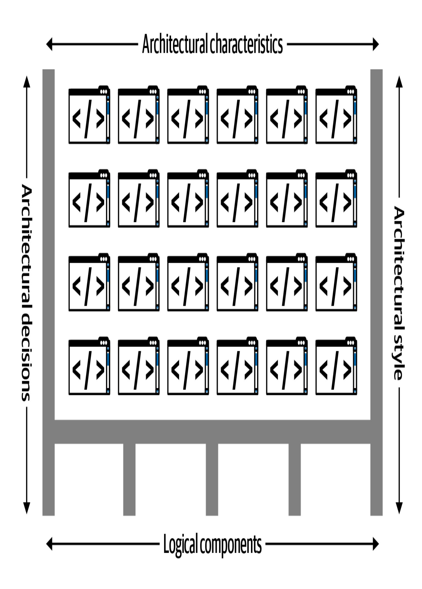
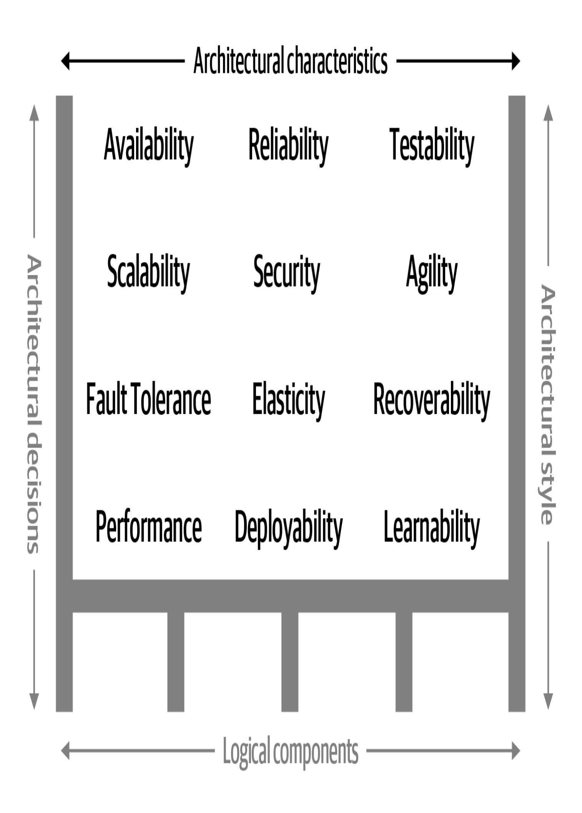
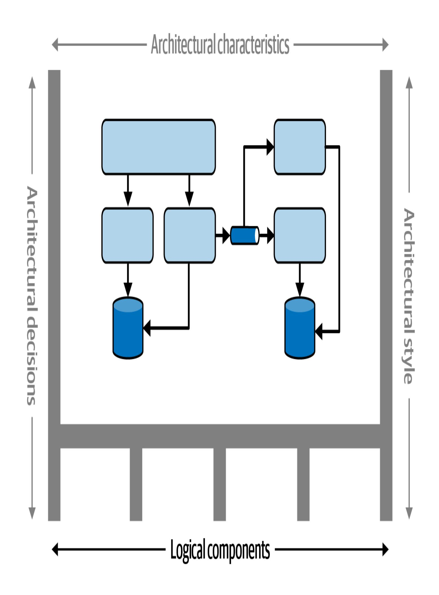

## 1장. 서론 (Kapitel 1. Einführung)

이 작업은 AI를 활용하여 번역되었습니다. 여러분의 피드백과 의견을 환영합니다: [translation-feedback@oreilly.com](mailto:translation-feedback@oreilly.com)

당신은 소프트웨어 아키텍처에 관심이 있습니다. 아마도 다음 커리어 단계를 밟고자 하는 개발자이거나, 소프트웨어 아키텍처가 작동할 때 무슨 일이 일어나는지 이해하고 싶은 프로젝트 매니저일 수도 있습니다. 혹은 "우연한 아키텍트(accidental architect)"일 수도 있습니다: 아키텍처 결정을 내리지만 아직 "소프트웨어 아키텍트"라는 직함을 갖지 못한 사람... 아직은요.

왜 소프트웨어 아키텍처에 관심을 가져야 할까요? 아마도 많은 프로젝트 경험을 쌓았고, 시스템의 더 큰 구성 요소들이 어떻게 결합되는지, 어떤 트레이드오프(trade-off)가 존재하는지 더 잘 이해하고 싶을 것입니다. 그렇다면 소프트웨어 아키텍처는 명백한 다음 커리어 단계입니다.

이 책은 여러분 모두를 위한 것입니다. "소프트웨어 아키텍트"라는 극도로 다양한 직업에 대한 개요를 제공합니다.

소프트웨어 아키텍트는 소프트웨어 시스템을 전체적인 복잡성 속에서 이해하고 분석해야 하며, 때로는 불완전한 정보로 트레이드오프에 대한 중요한 결정을 내려야 합니다. 생성형 AI가 점진적으로 자신을 대체할 수 있다고 우려하는 많은 소프트웨어 개발자들이 소프트웨어 아키텍처로의 전환을 고려하고 있는데, 이는 대체하기 훨씬 어려운 역할입니다. 소프트웨어 아키텍트는 AI가 내릴 수 없는 바로 그러한 종류의 결정을 내리며, 복잡하고 변화하는 맥락 속에서 트레이드오프를 저울질합니다.

아키텍처는 예술의 많은 것들처럼 오직 맥락 속에서만 이해될 수 있습니다. 아키텍트는 그들의 환경 조건에 따라 결정을 내립니다. 한 가지 예: 20세기 후반 소프트웨어 아키텍처의 주요 목표 중 하나는 공유 인프라와 리소스를 가능한 한 효율적으로 사용하는 것이었습니다. 운영 체제, 애플리케이션 서버, 데이터베이스 서버 등이 모두 상용이었고 매우 비쌌기 때문입니다.

2002년에 마이크로서비스(Microservices)와 같은 아키텍처를 구축하려는 시도는 상상할 수 없을 정도로 비용이 많이 들었을 것입니다. 2002년 데이터센터에 가서 운영 관리자에게 이렇게 말한다고 상상해 보세요: "안녕하세요, 각 서비스가 자체 격리된 머신에서 자체 데이터베이스와 함께 실행되는 혁명적인 아키텍처에 대한 훌륭한 아이디어가 있습니다. Windows 라이선스 50개, 애플리케이션 서버 라이선스 30개 추가, 그리고 데이터베이스 서버 라이선스 최소 50개가 필요합니다." 오늘날 우리가 이러한 아키텍처를 구축할 수 있는 것은 오픈 소스의 도입과 DevOps 혁명의 업데이트된 기술적 절차 덕분입니다. 모든 아키텍처는 그 맥락의 산물입니다 - 이 책을 읽을 때 이것을 잊지 마세요.

# 소프트웨어 아키텍처의 정의 (Definition der Software-Architektur)

그렇다면 소프트웨어 아키텍처란 무엇일까요? [그림](#page-3-0) 1-1은 우리가 소프트웨어 아키텍처에 대해 어떻게 생각하는지 보여줍니다. 이 정의는 네 가지 차원을 가지고 있습니다. 시스템의 소프트웨어 아키텍처는 출발점으로서의 *아키텍처 스타일(Architekturstil)*, 그것이 지원해야 하는 *아키텍처 특성(Architekturmerkmale)*, 행동을 구현하기 위한 *논리적 구성요소(logischen Komponenten)*, 그리고 마지막으로 전체를 정당화하는 *아키텍처 결정(Architekturentscheidungen)*으로 구성됩니다. 시스템의 구조는 아키텍처를 지원하는 굵은 검은색 선으로 표현됩니다. 아키텍트가 분석하는 순서대로 이러한 차원들을 간략히 살펴보겠습니다.

그림 1-1. 아키텍처는 시스템의 구조와 아키텍처 특성("-ilities"), 논리적 구성요소, 아키텍처 스타일, 그리고 결정의 결합으로 구성됩니다 (Abbildung 1-1. Die Architektur besteht aus der Struktur des Systems, kombiniert mit Architekturmerkmalen ("-fähigkeiten"), logischen Komponenten, Architekturstilen und Entscheidungen)

*아키텍처 특성(Architekturmerkmale)* ([그림](#page-5-0) 1-2 참조)은 시스템의 *역량(capabilities)*(일반적으로 "-ilities"로 약칭)과 성공 기준을 정의합니다: 간단히 말해, 시스템이 무엇을 *해야* 하는지입니다. 아키텍처 특성은 매우 중요하기 때문에 이 책에서 이러한 특성의 이해와 정의에 여러 장을 할애했습니다.

아키텍처 특성이 시스템의 역량을 정의하는 반면, *논리적 구성요소(logische Komponenten)*는 시스템의 *행동(Verhalten)*을 결정합니다. 논리적 구성요소 설계는 아키텍트에게 가장 중요한 구조적 활동 중 하나입니다. [그림](#page-7-0) 1-3에서 논리적 구성요소는 애플리케이션의 도메인, 엔티티, 워크플로우를 형성합니다.

아키텍트가 시스템에 필요한 아키텍처 특성과 논리적 구성요소를 분석하고 나면(둘 다 나중에 상세히 설명됨), 솔루션 구현을 위한 출발점으로 적절한 아키텍처 스타일을 선택할 수 있을 만큼 충분히 알게 됩니다 [그림](#page-9-0) 1-4.

그림 1-4. 아키텍처 스타일을 선택하는 것은 특정 요구사항 집합에 대한 가장 간단한 구현 경로를 찾는 것입니다 (Abbildung 1-4. Bei der Wahl eines Architekturstils geht es darum, den einfachsten Implementierungspfad für einen bestimmten Satz von Anforderungen zu finden)

소프트웨어 아키텍처를 정의하는 네 번째 차원은 *아키텍처 결정(Architekturentscheidungen)*으로, 시스템 구축을 위한 규칙을 설정합니다. 예를 들어, 아키텍트는 계층형 아키텍처(layered architecture) 내에서 비즈니스 계층과 서비스 계층만이 데이터베이스에 접근할 수 있도록 결정할 수 있으며([그림](#page-11-0) 1-5 참조), 프레젠테이션 계층은 직접적인 데이터베이스 호출을 할 수 없습니다. 아키텍처 결정은 시스템의 경계를 형성하고 개발 팀에게 무엇이 허용되고 무엇이 허용되지 않는지 알려줍니다.

[장(Kapitel)](#page--1-0) 21에서는 아키텍처 결정과 그것을 간결하게 문서화하는 방법을 논의합니다.

## 소프트웨어 아키텍처의 법칙 (Gesetze der Softwarearchitektur)

우리 두 저자가 이 책의 초판을 집필하기 시작했을 때, 우리는 야심찬 목표를 가지고 있었습니다: 소프트웨어 아키텍처와 관련하여 보편적으로 보이는 것들을 찾아 소프트웨어 아키텍처의 "법칙(Gesetze)"으로 기록하기를 희망했습니다. 집필하는 동안 기록할 수 있는 것들을 계속 찾았습니다; 아마도 10개나 15개 정도를 찾을 수 있을 것이라고 기대했습니다. 놀랍게도, 초판에서는 단 두 개의 법칙만 찾았고, 제2판을 집필하면서 하나를 더 발견했습니다. 우리의 원래 의도에 충실하게, 이 세 가지 법칙은 상당히 보편적인 것으로 보이며 소프트웨어 아키텍트의 작업에 대한 많은 중요한 관점을 제공합니다.

우리는 소프트웨어 아키텍처의 첫 번째 법칙을 반복적으로 직면하면서 배웠으며, 이것이 이러한 보편적 진실이 왜 그렇게 포착하기 어려운지의 핵심을 찌른다고 믿습니다:

*소프트웨어 아키텍처의 모든 것은 트레이드오프다.*

—소프트웨어 아키텍처의 첫 번째 법칙 (Erstes Gesetz der Softwarearchitektur)

아무것도 아름답고 명확한 스펙트럼 위에 존재하지 않습니다. 소프트웨어 아키텍트가 내리는 모든 결정은 상황에 따라 다른 값을 취하는 수많은 변수를 고려해야 합니다. 트레이드오프는 소프트웨어 아키텍처 결정의 알파이자 오메가입니다.

*트레이드오프가 아닌 것을 발견했다고 생각한다면, 아마도 아직 트레이드오프를 발견하지 못했을 뿐이다... 아직은.*

#### —보조정리 1 (Korollar 1)

*트레이드오프 분석을 한 번만 하고 끝낼 수는 없다.*

#### —보조정리 2 (Korollar 2)

팀들은 표준을 좋아하며, 아키텍트들이 어떤 아키텍처 스타일을 사용할지, 아키텍처의 부분들이 어떻게 통신해야 하는지, 공통 기능을 어떻게 관리할지, 그리고 많은 다른 어려운 결정들을 결정하기 위해 큰 트레이드오프 잼버리를 개최할 수 있다면 좋을 것입니다. 하지만 우리는 그렇게 할 수 없습니다. 왜냐하면 모든 상황에서 이러한 모든 트레이드오프를 다시 평가해야 하기 때문입니다. (우리는 팀들이 이것을 시도하는 것을 보았습니다 - 예를 들어, 분산 워크플로우에서 기본적으로 코레오그래피(choreography)만 사용하려고 시도했지만, 이것이 때로는 작동하고

때로는 엄청난 재앙이라는 것을 발견했습니다. "코레오그래피와 [오케스트레이션(Orchestrierung)"](#page--1-1)에 대한 우리의 논의를 참조하세요).

아키텍처는 구조적 요소의 결합 이상입니다. 이것이 우리의 차원적 정의가 원칙, 특성 등도 포함하는 이유입니다. 이것은 소프트웨어 아키텍처의 두 번째 법칙에 반영되어 있습니다:

*'왜(Why)'가 '어떻게(How)'보다 더 중요하다.*

—소프트웨어 아키텍처의 두 번째 법칙 (Zweites Gesetz der Softwarearchitektur)

경험 많은 아키텍트로서 누군가가 내가 본 적 없는 아키텍처를 보여준다면, 나는 그것이 *어떻게* 작동하는지 이해할 수 있지만, 이전 아키텍트나 팀이 특정 결정을 *왜* 내렸는지는 설명할 수 없습니다. 아키텍트는 매우 구체적인 맥락에서 결정을 내리기 때문에, 일반적이고 포괄적인 결정을 내리기 어렵습니다. 아키텍트가 특정 결정을 *왜* 내렸는지는 그들이 고려한 트레이드오프도 포함하며, 왜 이 결정이 다른 것보다 나은지에 기여합니다. 소프트웨어 아키텍처 결정의 가장 중요한 특징 중 하나는 그것들이 거의 이진법적(binary)이지 않다는 것으로 밝혀졌습니다. 이것은 우리를 소프트웨어 아키텍처의 세 번째 법칙으로 이끕니다:

*대부분의 아키텍처 결정은 이진법적이지 않으며, 극단 사이의 스펙트럼에서 움직인다.*

—소프트웨어 아키텍처의 세 번째 법칙 (Drittes Gesetz der Softwarearchitektur)

이 책 전반에 걸쳐 우리는 아키텍트가 특정 결정을 *왜* 내리는지, 그리고 어떤 트레이드오프를 해야 하는지를 보여줍니다. [장(Kapitel)](#page--1-0) 21에서는 중요한 결정을 기록하는 좋은 기법도 보여줍니다.

독자들은 책 전체에 걸쳐 이러한 법칙을 인식하게 될 것이며, 소프트웨어 아키텍처에 대한 결정을 평가할 때 이것들을 염두에 두기를 권장합니다. 우리는 [장(Kapitel)](#page--1-0) 27에서 몇 가지 추가 예제와 함께 이러한 법칙으로 돌아옵니다.

이제 소프트웨어 아키텍처에 대한 실무적 정의를 가졌으므로, 실제 임무로 전환할 수 있습니다.

## 아키텍트에 대한 기대 (Erwartungen an einen Architekten)

소프트웨어 아키텍트의 역할은 숙련된 프로그래머의 역할부터 전체 기업의 전략적 기술 방향 설정까지 다양할 수 있습니다. 이것은 역할을 정의하기 어렵게 만들지만, 우리는 소프트웨어 아키텍트에게 무엇이 *기대되는지*는 말할 수 있습니다. 우리는 소프트웨어 아키텍트/아키텍트에 대한 8가지 핵심 기대사항을

역할, 직함, 직무 설명과 무관하게 정리했습니다:

- 아키텍처 결정 내리기
- 아키텍처의 지속적 분석
- 최신 트렌드를 따라가기
- 결정 준수 보장
- 다양한 기술, 프레임워크, 플랫폼, 환경 이해하기
- 비즈니스 도메인 알기
- 팀을 이끌고 대인관계 기술 보유하기
- 조직의 정치 이해하고 탐색하기

소프트웨어 아키텍트로서 성공하기 위해서는 이러한 각각의 기대사항을 이해하고 충족해야 합니다. 이 섹션에서는 8가지 모두를 순차적으로 살펴봅니다.

### **아키텍처 결정 내리기 (Architekturentscheidungen treffen)**

*아키텍트는 팀, 부서, 또는 전체 기업의 기술 결정을 위한 기반이 되는 아키텍처 결정과 디자인 원칙을 수립할 것으로 기대됩니다.*

이 첫 번째 기대사항에서 핵심 단어는 *가이드(guide)*입니다: 아키텍트는 기술 선택을 *지시(dictate)*하기보다는 *안내*해야 합니다. 예를 들어, 프론트엔드 개발에 React.js를 사용하기로 결정하는 것은 기술적 결정이지 아키텍처 결정이 아닙니다. 이러한 결정을 내리는 대신, 아키텍트는 개발 팀이 프론트엔드 웹 개발을 위해 반응형(reactive) 프레임워크를 사용하도록 안내하고, Angular, Elm, React.js, Vue 또는 다른 반응형 웹 프레임워크 중에서 선택할 것을 권장해야 합니다. 핵심은 아키텍처 결정이 팀이 올바른 기술 솔루션을 선택하도록 *안내*하는지, 아니면 선택을 빼앗는지의 여부입니다. 그러나 확장성, 성능, 또는 가용성과 같은 특정 아키텍처 특성을 유지하기 위해 아키텍트가 특정 기술 결정을 내려야 하는 경우도 있습니다. 아키텍트에게는 이 균형을 찾는 것이 종종 어렵기 때문에, [장(Kapitel)](#page--1-0) 21은 전적으로 아키텍처 결정에 관한 것입니다.

### **아키텍처를 지속적으로 분석하기 (Analysiere die Architektur fortlaufend)**

*아키텍트는 아키텍처와 현재의 기술 환경을 지속적으로 분석하고 개선 솔루션을 제안할 것으로 기대됩니다.*

*아키텍처의 생명력(Vitalität der Architektur)*은 3년 이상 전에 정의된 아키텍처가 비즈니스와 기술의 변화를 고려할 때 *오늘날* 얼마나 생존 가능한지를 평가합니다. 우리의 경험상, 충분한 아키텍트가 기존 아키텍처를 지속적으로 분석하는 데 에너지를 집중하지 않습니다. 그 결과, 대부분의 아키텍처는 개발자들이 성능, 가용성, 확장성과 같은 필수 아키텍처 속성에 영향을 미치는 코드나 디자인 변경을 할 때 발생하는 어느 정도의 구조적 부패(structural decay)를 겪습니다.

이 기대사항에서 자주 잊혀지는 다른 측면은 테스트 및 릴리스 환경입니다. 코드를 빠르게 변경할 수 있는 능력은 명백한 이점을 가진 일종의 민첩성(agility)이지만, 변경 사항을 테스트하는 데 몇 주가 걸리고 릴리스까지 몇 달이 걸린다면, 전체 아키텍처는 민첩성을 달성할 수 없습니다.

아키텍트는 기술과 문제 도메인의 변화를 전체적으로 분석하여 아키텍처가 계속 실행 가능한지 결정해야 합니다. 이러한 종류의 고려는 구인 광고에는 거의 등장하지 않지만 애플리케이션이 관련성을 유지하도록 보장합니다.

### **최신 트렌드를 따라가기 (Mit den neuesten Trends auf dem Laufenden bleiben)**

*아키텍트는 항상 최신 기술 및 산업 트렌드를 따라갈 것으로 기대됩니다.*

개발자는 관련성을 유지하고 (일자리를 유지하기 위해!) 매일 사용하는 것을 포함하여 최신 기술을 따라가야 합니다. 아키텍트에게는 최신 기술 및 산업별 트렌드를 따라가는 것이 훨씬 더 중요합니다. 아키텍트가 내리는 결정은 일반적으로 장기적이고

변경하기 어렵습니다. 트렌드를 이해하면 아키텍트가 미래에도 관련성이 있는 결정을 내리는 데 도움이 됩니다. 최근 몇 년 동안, 예를 들어, 아키텍트는 클라우드 기반 스토리지 및 배포를 다루어야 했으며, 이 제2판을 작성하는 동안 생성형 AI는 개발 생태계의 많은 영역에 엄청난 영향을 미치고 있습니다.

트렌드를 추적하고 최신 상태를 유지하는 것은 특히 소프트웨어 아키텍트에게는 어렵습니다. [장(Kapitel)](#page--1-0) 2에서는 이를 달성하는 데 도움이 되는 몇 가지 기법과 리소스를 논의합니다.

### **결정 준수 보장 (Sicherstellen der Einhaltung von Beschlüssen)**

*아키텍트는 아키텍처 결정 및 디자인 원칙의 준수를 보장할 것으로 기대됩니다.*

규정 준수를 보장하려면 개발 팀이 아키텍트가 수립하고, 문서화하고, 전달한 결정과 디자인 원칙을 따르고 있는지 지속적으로 확인해야 합니다.

아키텍트로서 계층형 아키텍처에서 비즈니스 계층과 서비스 계층으로만 데이터베이스 접근을 제한하기로 결정했다고 상상해 보세요(프레젠테이션 계층은 제외). 이는 ([장(Kapitel)](#page--1-0) 10에서 볼 수 있듯이) 프레젠테이션 계층이 가장 간단한 데이터베이스 호출조차 하기 위해 아키텍처의 모든 계층을 통과해야 한다는 것을 의미합니다. 그러나 UI(사용자 인터페이스) 개발자는 이

결정에 동의하지 않고 성능상의 이유로 프레젠테이션 계층에 데이터베이스에 대한 직접 접근을 제공합니다. 당신은 특정한 이유로 이 아키텍처 결정을 내렸습니다: 데이터베이스의 변경이 프레젠테이션 계층에 영향을 미치지 않도록 하기 위해서입니다. 아키텍처 결정이 준수되도록 보장하지 않으면, 이와 같은 위반이 발생할 수 있습니다. 이는 아키텍처가 요구되는 속성을 갖지 못하고 애플리케이션이나 시스템이 예상대로 작동하지 않게 할 수 있습니다. [장(Kapitel)](#page--1-0) 6은 자동화된 적합성 함수(fitness functions) 및 기타 도구를 사용하여 적합성을 측정하는 것에 관한 것입니다.

### **다양한 기술 이해 (Verschiedene Technologien verstehen)**

*아키텍트는 여러 가지 다양한 기술, 프레임워크, 플랫폼 및 환경에 익숙할 것으로 기대됩니다.*

모든 아키텍트가 모든 프레임워크, 플랫폼 및 언어의 전문가가 될 것으로 기대되지는 않지만, 적어도 다양한 기술에 익숙해야 합니다. 오늘날 대부분의 환경은 이기종이므로, 아키텍트는 적어도 언어, 플랫폼 또는 기술에 관계없이 여러 시스템 및 서비스와 함께 작업하는 방법을 알아야 합니다.

이러한 기대를 충족하는 최선의 방법 중 하나는 상자 밖에서 생각하고 다양한 언어, 플랫폼 및 기술에서 경험을 쌓을 기회를 공격적으로 찾는 것입니다. 아키텍트는 기술적 깊이(technical depth)보다는 기술적 폭(technical breadth)에 집중해야 합니다. 기술적 폭은 자세히 알지는 못하지만 알고 있는 것들과 많이 아는 것들을 결합한 것을 포함합니다. 예를 들어, 아키텍트에게는 하나의 캐싱 제품의 전문가가 되는 것보다 10개의 다른 캐싱 제품의 장단점에 익숙한 것이 훨씬 더 가치가 있습니다.

### **비즈니스 도메인 알기 (Das Geschäftsfeld kennen)**

*아키텍트는 비즈니스 도메인에 대해 어느 정도의 전문 지식을 갖출 것으로 기대됩니다.*

효과적인 소프트웨어 아키텍트는 아키텍처로 해결해야 할 비즈니스 문제, 목표 및 요구사항, 즉 문제 영역의 *비즈니스 도메인(business domain)*을 이해합니다. 비즈니스 요구사항을 이해하지 못하면 효과적인 아키텍처를 설계하기 어렵습니다. 대형 은행의 아키텍트이면서 *"평균 방향 지수(average directional index)"*, *"알레아토리 계약(aleatory contracts)"*, *"금리 랠리(interest rate rally)"* 또는 심지어 *"비우선 부채(non-priority debt)"*와 같은 일반적인 금융 용어를 이해하지 못한다고 상상해 보세요. 이해관계자 및 비즈니스 사용자와 소통할 수 없을 것이며 빠르게 신뢰성을 잃게 될 것입니다.

우리가 아는 가장 성공적인 아키텍트는 포괄적이고 실무 지향적인 기술 지식 *그리고* 특정 도메인에 대한 견고한 지식을 모두 갖추고 있습니다. 그들은 이러한 이해관계자들이 알고 이해하는 언어로 경영진 및 비즈니스 사용자와 소통할 수 있습니다. 이는 그들이 무엇을 하고 있는지 알고 효과적이고 올바른 아키텍처를 만들 역량이 있다는 신뢰를 구축합니다.

## **대인관계 기술 보유 (Über zwischenmenschliche Fähigkeiten verfügen)**

*아키텍트는 팀워크, 중재, 리더십을 포함한 뛰어난 대인관계 기술을 보유할 것으로 기대됩니다.*

기술자로서 개발자와 아키텍트는 대인관계 문제보다 기술 문제를 해결하는 것을 선호하는 경향이 있으므로, 뛰어난 리더십 기술과 대인관계 기술은 거의 기대되지 않습니다. 하지만 Gerald [Weinberg](https://oreil.ly/wyDB8)가 말했듯이: "그들이 당신에게 무엇을 말하든, 그것은 항상 인간의 문제다". 아키텍트가 제공하는 안내는 단지 기술적인 것이 아니라 아키텍처 구현에서 개발 팀을 이끄는 것도 포함합니다. 리더십 기술은 역할이나 직함에 관계없이 효과적인 소프트웨어 아키텍트가 되기 위해 필요한 것의 *최소한 절반*입니다.

업계는 제한된 수의 직책을 놓고 경쟁하는 소프트웨어 아키텍트로 넘쳐나고 있습니다. 강력한 리더십과 사회적 역량을 가진 사람들이 군중으로부터 돋보입니다. 반대로, 우리는 뛰어난 기술자이지만 팀을 이끌고, 개발자를 코칭하고 멘토링하거나, 아이디어, 아키텍처 결정 및 원칙을 전달하는 데 어려움을 겪는 많은 소프트웨어 아키텍트를 알고 있습니다. 물론 이러한 아키텍트가 일자리를 유지하기는 어렵습니다.

### **정치 이해하고 탐색하기 (Politik verstehen und navigieren)**

*아키텍트는 기업의 정치적 분위기를 이해하고 정치를 탐색할 수 있을 것으로 기대됩니다.*

소프트웨어 아키텍처에 관한 책에서 사무실 정치에 대해 이야기하는 것이 이상하게 보일 수 있지만, 협상 기술은 이 역할에 결정적입니다. 이를 설명하기 위해 두 가지 시나리오를 고려해 보세요.

첫 번째 시나리오에서, 개발자는 복잡한 코드의 특정 부분의 복잡성을 줄이기 위해 특정 디자인 패턴을 사용하기로 결정합니다. 이것은 개발자가 승인을 구할 필요가 없는 좋은 결정입니다. 코드 구조, 클래스 디자인, 디자인 패턴 선택, 때로는 언어 선택과 같은 프로그래밍 측면은 모두 프로그래밍 기술의 일부입니다.

두 번째 시나리오에서, 대규모 CRM(고객 관계 관리) 시스템을 담당하는 아키텍트는 다른 시스템의 데이터베이스 접근을 제어하고, 특정 고객 데이터를 보호하고, 데이터베이스 스키마를 변경하는 데 어려움을 겪고 있습니다. 이러한 모든 문제는 너무 많은 다른 시스템이 CRM 데이터베이스를 사용하기 때문에 발생합니다. 따라서 아키텍트는 *애플리케이션 사일로(application silos)*를 만들기로 결정하는데, 각 애플리케이션 데이터베이스는 데이터베이스를 소유한 애플리케이션에서만 접근할 수 있습니다. 이 결정으로 아키텍트는 고객 데이터, 보안 및 변경에 대한 더 나은 제어를 갖게 됩니다.

그러나 첫 번째 시나리오의 개발자 결정과 달리, 아키텍트는 기업의 거의 모든 사람이 자신의 결정에 이의를 제기할 것으로 예상할 수 있습니다(CRM 애플리케이션 팀은 예외일 수 있습니다). 다른 애플리케이션은 CRM 데이터가 필요하며, 데이터베이스에 더 이상 직접 접근할 수 없다면 원격 접근 호출을 통해 CRM 시스템에 데이터를 요청해야 합니다. 제품 책임자, 프로젝트 매니저 및 비즈니스 이해관계자는 더 높은 비용이나 더 많은 노력에 반대할 수 있으며, 개발자는 자신의 접근 방식이 더 낫다고 생각할 수 있습니다. *아키텍트가 내리는 거의 모든 결정이 도전받을 것입니다*.

이의가 무엇이든, 아키텍트는 조직 정치를 통과하고 대부분의 결정을 관철시키기 위해 협상 기술을 사용해야 합니다. 이것은 매우

좌절스러울 수 있습니다. 대부분의 소프트웨어 아키텍트는 개발자로 시작했고 승인이나 검토 없이 결정을 내리는 데 익숙해져 있습니다. 아키텍트로서 그들은 이제 마침내 광범위하고 중요한 결정을 내릴 수 있지만, 거의 모든 결정에 대해 정당화하고 싸워야 합니다. 협상 기술은 리더십 역량만큼이나 중요해서 우리는 이에 대해 전체 장을 할애했습니다([장(Kapitel)](#page--1-0) 25).

## 로드맵 (Straßenkarte)

이 책은 세 부분으로 구성됩니다:

#### *[파트(Teil)](#page--1-0) I: 기초 (Grundlagen)*

파트 I은 소프트웨어 아키텍처의 핵심 구성요소를 정의하며, 아키텍처 구조의 두 가지 핵심 요소인 아키텍처 특성과 논리적 구성요소에 초점을 맞춥니다. 이러한 각 요소의 분석을 위해서는 우리가 상세히 다루는 다양한 기법이 필요합니다. 이러한 활동의 결과는 소프트웨어 아키텍트에게 구현의 전반적인 철학에 대한 골격을 나타내는 적절한 아키텍처 스타일을 선택하기에 충분한 정보를 제공합니다.

#### *[파트(Teil)](#page--1-0) II: 아키텍처 스타일 (Architekturstile)*

파트 II는 소프트웨어 아키텍처의 토폴로지라고 불리는 *아키텍처 스타일(architectural styles)*의 카탈로그를 포함합니다. 우리는 각 스타일의 구조적 및 통신적 차이를 보여주고, 데이터 토폴로지, 팀 및 물리적 아키텍처를 포함한 광범위한 스펙트럼을 따라 비교할 기반을 제공합니다.

#### *[파트(Teil)](#page--1-0) III: 기법 및 소프트 스킬 (Techniken und Soft Skills)*

파트 I과 II는 직업의 기술적 측면에 초점을 맞추지만, 소프트웨어 아키텍트 역할의 상당 부분은 전통적으로 *소프트 스킬(soft skills)*이라고 불리는 것도 포함합니다: 기술이 아닌 다른 사람들과 관련된 기술입니다. 아이러니하게도, 소프트 스킬은 소프트웨어 아키텍트 지망생에게 배우기 가장 어려운 경우가 많은데, 소프트웨어 아키텍트 역할로 가는 주요 경로는 일반적으로 대인관계 탁월성보다 기술적 탁월성을 더 요구하기 때문입니다. 그러나 일단 직무에 들어가면, 아키텍트는 이러한 기술이 결정적으로 중요하다는 것을 발견합니다. 따라서 우리 책의 파트 III는 이 역할에서 성공하는 데 도움이 될 몇 가지 중요한 소프트 스킬을 다룹니다.