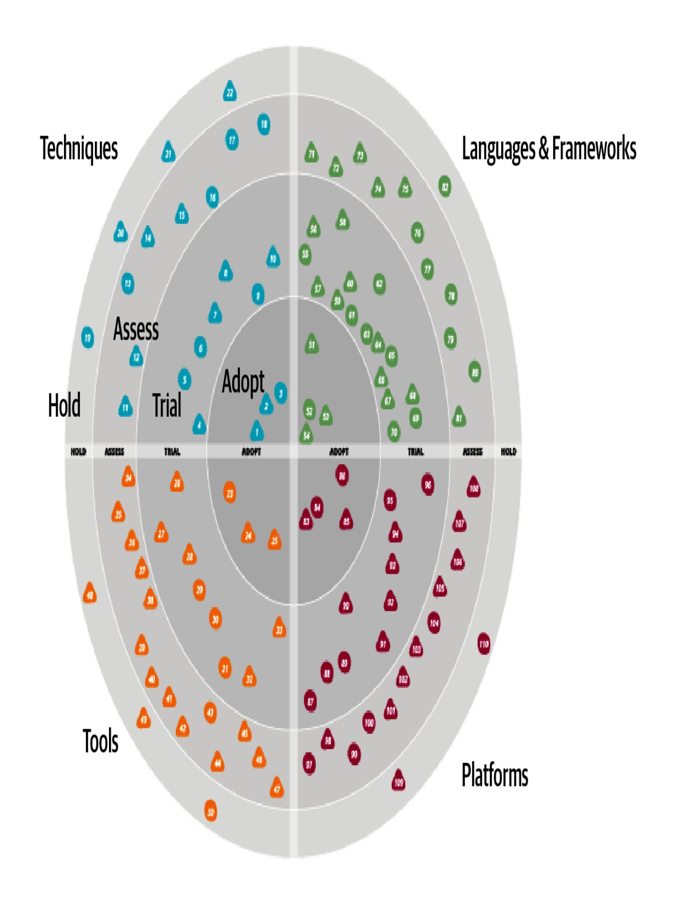

# Kapitel 2. Architektonisches Denken

Diese Arbeit wurde mithilfe von KI übersetzt. Wir freuen uns über dein Feedback und deine Kommentare: [translation-feedback@oreilly.com](mailto:translation-feedback@oreilly.com)

Beim architektonischen Denken geht es darum, die Dinge mit den Augen eines Architekten zu sehen - mit anderen Worten, vom Standpunkt der Architektur aus. Zu verstehen, wie sich eine bestimmte Änderung auf die allgemeine Skalierbarkeit auswirkt, darauf zu achten, wie verschiedene Teile eines Systems zusammenwirken, und zu wissen, welche Bibliotheken und Frameworks von Drittanbietern für eine bestimmte Situation am besten geeignet sind, sind alles Beispiele für architektonisches Denken.

Um wie ein Architekt denken zu können, muss man zunächst verstehen, was Softwarearchitektur ist und was der Unterschied zwischen Architektur und Design ist. Dazu gehört auch ein breites Wissen, um Lösungen und Möglichkeiten zu erkennen, die andere nicht sehen; die Bedeutung von geschäftlichen Faktoren und deren Umsetzung in architektonische Belange zu verstehen; und Kompromisse zwischen verschiedenen Lösungen und Technologien zu verstehen, zu analysieren und in Einklang zu bringen.

In diesem Kapitel untersuchen wir diese Aspekte des Denkens wie ein Architekt.

# Architektur vs. Design

Nimm dir einen Moment Zeit und stell dir dein Traumhaus vor. Wie viele Stockwerke hat es? Ist das Dach flach oder spitz? Ist es ein großes, weitläufiges, einstöckiges Ranchhaus oder ein mehrstöckiges modernes Haus? Wie viele Schlafzimmer soll es haben? All diese Dinge bestimmen die *Gesamtstruktur* des Hauses - mit anderen Worten: seine Architektur. Nimm dir jetzt einen Moment Zeit, um dir das Innere des Hauses vorzustellen. Hat es Teppichboden oder Hartholzböden? Welche Farbe haben die Wände? Gibt es Stehlampen oder Lampen, die von der Decke hängen? All diese Dinge beziehen sich auf das *Design* des Hauses.

Auch bei der Softwarearchitektur geht es weniger um das Aussehen eines Systems als vielmehr um seine Struktur, während es beim Design mehr um das Aussehen eines Systems und weniger um seine Struktur geht. Die Entscheidung für Microservices bestimmt zum Beispiel die Struktur und Form des Systems (seine Architektur), während das Aussehen und die Bedienung der Benutzeroberfläche (UI) das Design des Systems bestimmen.

Aber was ist mit Entscheidungen wie der, ob ein Dienst in kleinere Teile zerlegt werden soll, oder der Entscheidung für ein UI-Framework? Leider liegen die meisten dieser Entscheidungen irgendwo im *Spektrum* zwischen Architektur und Design, was es schwierig macht, zu bestimmen, was als Architektur betrachtet werden sollte.

Anhand der folgenden Kriterien kannst du feststellen, ob es sich eher um Architektur oder eher um Design handelt:

- Ist sie eher strategisch oder taktisch?
- Wie viel Aufwand ist nötig, um etwas zu ändern oder zu bauen?
- Wie groß sind die Kompromisse?

Diese Faktoren sind in [Abbildung](#page-2-0) 2-1 dargestellt, die das Spektrum zwischen Architektur und Design veranschaulicht, um zu bestimmen, wo eine Entscheidung liegt und wer die Verantwortung dafür tragen sollte.

Abbildung 2-1. Das Spektrum zwischen Architektur und Design

**Strategische versus taktische Entscheidungen**

Je strategischer eine Entscheidung ist, desto architektonischer wird sie. Umgekehrt gilt: Je taktischer eine Entscheidung ist, desto eher geht es um Design. *Strategische* Entscheidungen sind in der Regel langfristig, während *taktische* Entscheidungen in der Regel kurzfristig und unabhängig von anderen Aktionen oder Entscheidungen sind.

Eine gute Methode, um festzustellen, ob eine Entscheidung eher strategisch oder taktisch ist, ist, die folgenden Fragen zu stellen:

*Wie viel Überlegung und Planung steckt in dieser Entscheidung?* Eine Entscheidung, die nur ein paar Minuten dauert, ist eher taktisch und hat daher mehr mit Design zu tun, während eine Entscheidung, die wochenlang geplant werden muss, eher strategisch ist und daher mehr mit Architektur zu tun hat.

*Wie viele Menschen sind an der Entscheidung beteiligt?* Eine Entscheidung, die allein oder mit einem Kollegen getroffen wird, ist wahrscheinlich eher taktisch und auf der Designseite des Spektrums angesiedelt, während eine Entscheidung, die viele Treffen mit vielen verschiedenen Interessengruppen erfordert, wahrscheinlich eher strategisch und auf der Architekturseite des Spektrums angesiedelt ist.

*Ist die Entscheidung eine langfristige Vision oder eine kurzfristige Aktion?*

Eine Entscheidung, die sich wahrscheinlich bald ändern wird, ist in der Regel taktischer Natur und hat mehr mit Design zu tun, während eine Entscheidung, die sehr lange Bestand hat, in der Regel strategischer ist und mehr mit Architektur zu tun hat.

Diese Fragen sind zwar etwas subjektiv, aber sie helfen dabei, festzustellen, ob etwas strategisch oder taktisch ist und somit eher mit Architektur oder Design zu tun hat.

### **Grad der Anstrengung**

In seinem berühmten Artikel "Who Needs an [Architect?"](https://oreil.ly/MKCvQ) schreibt [der](https://oreil.ly/MKCvQ) Softwarearchitekt Martin Fowler, dass Architektur "das Zeug ist, das schwer zu ändern ist". Je schwieriger etwas zu ändern ist, desto mehr Aufwand ist erforderlich, was diese Entscheidung oder Aktivität auf die architektonische Seite des Spektrums stellt. Umgekehrt ist etwas, das mit minimalem Aufwand zu implementieren oder zu ändern ist, eher auf der Designseite des Spektrums angesiedelt.

Die Umstellung von einer monolithischen Schichtenarchitektur auf Microservices würde zum Beispiel einen erheblichen Aufwand erfordern und wäre daher eher eine Frage der Architektur. Die Neuanordnung von Feldern auf einem Bildschirm würde nur minimalen Aufwand erfordern und wäre daher eher eine Frage des Designs.

### **Die Bedeutung von Kompromissen**

Die Analyse der Kompromisse bei einer bestimmten Entscheidung kann sehr hilfreich sein, um festzustellen, ob es eher um Architektur oder Design geht. Je größer die Kompromisse sind, desto eher ist die

Entscheidung architektonisch geprägt. Die Entscheidung für eine Microservices-Architektur bietet zum Beispiel eine bessere Skalierbarkeit, Flexibilität, Elastizität und Fehlertoleranz. Allerdings ist diese Architektur sehr komplex, sehr teuer, hat eine schlechte Datenkonsistenz und ist aufgrund der Kopplung von Diensten nicht sehr leistungsfähig. Das sind einige ziemlich bedeutende Kompromisse. Daraus können wir schließen, dass diese Entscheidung eher auf der architektonischen Seite des Spektrums liegt als auf der Designseite.

Auch bei Designentscheidungen gibt es Kompromisse. Die Aufteilung einer Klassendatei bietet beispielsweise eine bessere Wartbarkeit und Lesbarkeit - allerdings auf Kosten der Verwaltung von mehr Klassen. Diese Kompromisse sind nicht übermäßig wichtig (vor allem im Vergleich zu den Kompromissen bei Microservices), daher liegt diese Entscheidung eher auf der Designseite des Spektrums.

## Technische Breite

Im Gegensatz zu Entwicklern ( ), die über ein hohes Maß an *technischer Tiefe* verfügen müssen, um ihre Arbeit zu erledigen, müssen Softwarearchitekten über ein hohes Maß an *technischer Breite* verfügen, um die Dinge aus architektonischer Sicht zu sehen. Bei der technischen Tiefe geht es darum, eine bestimmte Programmiersprache, Plattform, ein Framework, ein Produkt usw. zu beherrschen, während es bei der technischen Breite darum geht, ein wenig über viele Dinge zu wissen.

Um den Unterschied besser zu verstehen, betrachte die in [Abbildung](#page-7-0) 2-2 dargestellte Wissenspyramide. Sie fasst das gesamte technische Wissen der Welt zusammen, das in drei Stufen unterteilt werden kann: *Dinge, die du weißt*, *Dinge, von denen du weißt, dass du sie nicht weißt*, und *Dinge, von denen du nicht weißt, dass du sie nicht weißt*.

Zu*den Dingen, die du kennst*, gehören die Technologien, Frameworks, Sprachen und Tools, die Technologen tagtäglich verwenden, um ihre Arbeit zu erledigen (z. B. ein Java-Programmierer, der Java kennt). Sie sind gut oder sogar Experten in all diesen Dingen. Beachte, dass diese Wissensebene (der oberste Teil der Pyramide) die kleinste ist und die wenigsten Dinge enthält. Das liegt daran, dass die meisten Technologen sich die Bereiche aussuchen müssen, in denen sie Fachwissen entwickeln wollen - niemand kann Experte in allem sein.

Zu*den Dingen, von denen du weißt, dass du sie nicht kennst* (der mittlere Teil der Pyramide), gehören Dinge, über die ein Technologe ein wenig weiß oder von denen er gehört hat, mit denen er aber keine oder nur wenig Erfahrung oder Fachwissen hat. Die meisten Technologen haben zum Beispiel schon von Clojure *gehört* und wissen, dass es eine auf Lisp basierende Programmiersprache ist, können aber keinen Quellcode in Clojure schreiben. Diese Wissensebene ist viel größer als die oberste Ebene. Das liegt daran, dass Menschen mit viel mehr Dingen vertraut werden können, als sieFachwissen entwickeln können.

*Dinge, von denen du nicht weißt, dass du sie nicht weißt*, sind der größte Teil der Wissenspyramide. Er umfasst eine ganze Reihe von Technologien, Tools, Frameworks und Sprachen, die die perfekte Lösung für ein Problem wären, wenn der Technologe, der das Problem lösen will, nur wüsste, dass es diese Lösungen gibt. Das Ziel einer jeden Karriere sollte es sein, die Dinge aus dem Bereich, von dem *du nicht*

*weißt, dass du ihn nicht kennst*, in den zweiten Bereich der Pyramide zu verschieben - den *Bereich, von dem du weißt, dass du ihn nicht kennst und*, wenn Fachwissen notwendig wird, die Dinge aus dem mittleren Teil der Pyramide an die Spitze zu bringen: den *Bereich, den du kennst*.

Schon früh in der Karriere eines Entwicklers bedeutet das Erweitern der Spitze der Pyramide[\(Abbildung](#page-10-0) 2-3), dass man wertvolles Fachwissen erwirbt. Aber das, was *du weißt*, musst du auch *pflegen -*in der Welt der Software ist *nichts*statisch. Wenn ein/e Entwickler/in ein Experte für Ruby on Rails wird, bleibt dieses Wissen nicht erhalten, wenn er/sie Ruby on Rails ein oder zwei Jahre lang ignoriert. Um an der Spitze der Pyramide zu bleiben, muss Zeit investiert werden, um das Fachwissen zu erhalten. Der obere Teil der *Pyramide* steht für die *technische Tiefe* der Person: die Dinge, die sie wirklich gut kennt.

Die Art des Wissens ändert sich jedoch, wenn Entwickler in die Rolle des Architekten wechseln. Ein großer Teil des Wertes eines Architekten besteht darin, dass er ein *umfassendes* Verständnis von Technologie hat und weiß, wie man sie zur Lösung bestimmter Probleme einsetzt. Es ist zum Beispiel besser, wenn ein Architekt weiß, dass es fünf Lösungen für ein bestimmtes Problem gibt, als wenn er sich nur auf eine einzige spezialisiert hat. Die wichtigsten Teile der Pyramide für Architekten sind der obere *und der* mittlere Abschnitt. Wie weit der mittlere Abschnitt in den unteren Abschnitt hineinreicht, zeigt die technische *Breite* eines Architekten, wie in [Abbildung](#page-12-0) 2-4 dargestellt.

Für einen Architekten ist die *Breite* wichtiger als die *Tiefe*. Da Architekten Entscheidungen treffen müssen, die ihre Fähigkeiten mit den technischen Einschränkungen in Einklang bringen, ist ein breites Verständnis für eine Vielzahl von Lösungen wertvoll. Daher ist es für einen Architekten klug, einige hart erarbeitete Fachkenntnisse zu opfern und diese Zeit zu nutzen, um sein Portfolio zu erweitern, wie in [Abbildung](#page-14-0) 2-5 dargestellt. Einige Fachgebiete werden erhalten bleiben, wahrscheinlich in besonders angenehmen Technologiebereichen, während andere sinnvollerweise verkümmern.

Unsere Wissenspyramide verdeutlicht, wie grundlegend unterschiedlich die Rollen von *Architekten* und *Entwicklern* sind. Entwickler verbringen ihr ganzes Berufsleben damit, ihr Fachwissen zu verfeinern. Der Wechsel in die Rolle des Architekten bedeutet einen Perspektivwechsel, den viele Menschen als schwierig empfinden. Das wiederum führt zu zwei häufigen Fehlfunktionen: Erstens versucht ein Architekt, sein Fachwissen in einer Vielzahl von Bereichen aufrechtzuerhalten, hat aber in keinem davon Erfolg und arbeitet sich dabei zu Tode. Zweitens äußert sich das in *veraltetem Fachwissen - dem*falschen Gefühl, dass dein veraltetes Wissen immer noch auf dem neuesten Stand ist. Wir sehen das oft in großen Unternehmen, in denen die Entwickler, die das Unternehmen gegründet haben, in Führungspositionen aufgestiegen sind, aber immer noch Technologieentscheidungen nach uralten Kriterien treffen (siehe "Frozen Caveman [Antipattern"\).](#page-16-0)

#### **GEFRORENER HÖHLENMENSCH ANTIPATTERN**

Ein *Antipattern* ist das, was der Programmierer [Andrew](https://oreil.ly/p9i_Y) Koenig als etwas definiert, das am Anfang wie eine gute Idee aussieht, dich aber in Schwierigkeiten bringt. Ein in der freien Wildbahn häufig zu beobachtendes Verhaltensmuster, das Frozen Caveman Antipattern, beschreibt Architekten, die bei jeder Architektur auf ihr irrationales Lieblingsanliegen zurückgreifen. Ein Beispiel: Einer von Neals Kollegen arbeitete an einem System mit einer zentralisierten Architektur. Jedes Mal, wenn sie den Entwurf den Architekten des Auftraggebers vorlegten, lautete die ständige Frage: "Aber was ist, wenn wir Italien verlieren?" Einige Jahre zuvor hatte ein verrücktes Kommunikationsproblem dazu geführt, dass die Zentrale des Kunden nicht mehr mit den Filialen in Italien kommunizieren konnte, was zu großen Unannehmlichkeiten führte. Obwohl die Wahrscheinlichkeit, dass sich so etwas wiederholen könnte, äußerst gering war, waren die Architekten von diesem besonderen architektonischen Merkmal besessen.

Dieses Verhaltensmuster zeigt sich in der Regel bei Architekten, die in der Vergangenheit durch eine schlechte Entscheidung oder ein unerwartetes Ereignis in Mitleidenschaft gezogen wurden und deshalb bei allem, was damit zusammenhängt, besonders vorsichtig sind. Eine Risikobewertung ist zwar wichtig, aber sie sollte auch realistisch sein. Den Unterschied zwischen echten und vermeintlichen technischen Risiken zu verstehen, ist Teil des ständigen Lernprozesses. Um wie ein Architekt zu denken, muss man diese eingefrorenen Höhlenmenschen-Ideen und -Erfahrungen überwinden, andere Lösungen sehen und mehr relevante Fragen stellen.

Architekten sollten sich auf die technische Breite konzentrieren, damit sie einen größeren Köcher haben, aus dem sie Pfeile ziehen können. Entwickler/innen, die in die Rolle des Architekten/der Architektin wechseln, müssen möglicherweise ihre Sichtweise auf den Wissenserwerb ändern. Ein ausgewogenes Verhältnis zwischen der Tiefe und der Breite seines Wissensportfolios ist etwas, das jeder Entwickler während seiner gesamten Karriere berücksichtigen sollte. Aber wie kann ein Architekt technisches Wissen in die Breite bringen? In den nächsten Abschnitten findest du einige Techniken, die dir dabei helfen, die "Dinge, die du nicht weißt, weil du sie nicht weißt", aufzudecken.

### **Die 20-Minuten-Regel**

Wie in [Abbildung](#page-14-0) 2-5 dargestellt, ist die technische Breite für Architekten wichtiger als die technische Tiefe. Aber wie hältst du dich über die neuesten Trends und Schlagworte auf dem Laufenden, während du gleichzeitig Vollzeit arbeitest, deine Karriere vorantreibst, Zeit mit Freunden verbringst und dich um deine Familie kümmerst?

Eine Technik, die wir anwenden, ist die *20-Minuten-Regel*. Dabei geht es darum, *mindestens* 20 Minuten am Tag etwas Neues zu lernen oder sich mit einem bestimmten Thema zu beschäftigen. [Abbildung](#page-18-0) 2-6 zeigt einige gute Orte, an denen du deine 20 Minuten verbringen kannst, z. B. [InfoQ,](https://infoq.com/) DZone [Refcardz](https://dzone.com/refcardz) und das [Thoughtworks](https://thoughtworks.com/radar) Technology Radar. Du kannst mehr über unbekannte Buzzwords lernen, indem du sie im Internet nachschlägst und so dein Wissen von "dem Zeug, von dem du

nicht weißt, dass du es nicht weißt" in das "Zeug, von dem du weißt, dass du es nicht weißt" verschiebst. Du könntest diese Zeit auch damit verbringen, ein Buch wie dieses zu lesen. Das Wichtigste ist, dass du dir Zeit nimmst, um dich auf die Entwicklung deines Fachwissens und damit auf deine Karriere zu konzentrieren.

Viele Technologinnen und Technologen planen ihre 20 Minuten für die Mittagspause oder nach der Arbeit ein, aber unserer Erfahrung nach funktionieren diese Zeiträume nur selten. Es ist leicht, die Mittagspause zu nutzen, um die Arbeit nachzuholen, anstatt eine Pause zu machen, und abends ist es noch schlimmer, wenn man nach einem langen Tag noch soziale Pläne hat, Zeit mit der Familie verbringt und vieles mehr. Stattdessen empfehlen wir dir, deine 20 Minuten gleich am Morgen zu nehmen - gleich nach einer Tasse Kaffee oder Tee und vor allem, *bevor du deine E-Mails abrufst*. Sobald du deine E-Mails abrufst, ist dein Morgen vorbei und dein Tag hat begonnen. Nimm dir deine 20 Minuten, solange dein Geist noch frisch ist und bevor Ablenkungen die Oberhand gewinnen.

Wenn du die 20-Minuten-Regel befolgst, kannst du dein technisches Wissen erweitern und das Wissen, das dich zu einem effektivenSoftwarearchitekten macht, entwickeln und pflegen.

### **Ein persönliches Radar entwickeln**

In den 90er und Anfang der 00er Jahre war einer eurer Autoren der CTO eines kleinen Schulungs- und Beratungsunternehmens. Als er dort anfing, war die wichtigste Plattform Clipper, ein Tool zur schnellen Anwendungsentwicklung, mit dem man DOS-Anwendungen auf dBASE-Dateien aufbauen konnte. Bis es eines Tages verschwand. Das Unternehmen hatte den Aufstieg von Windows mitbekommen, aber der Unternehmensmarkt war immer noch DOS... bis er es plötzlich nicht mehr war. Ein Mitarbeiter beklagte sich, dass sie ihr enormes ClipperWissen nicht durch etwas anderes ersetzen konnten. Hat irgendeine Gruppe in der Geschichte, so fragte sich der Kollege, innerhalb ihres Lebens so viel Detailwissen gelernt und weggeworfen wie die Softwareentwickler? Diese Erfahrung hinterließ einen bleibenden Eindruck: *Ignoriere den Fortschritt der Technologie auf eigene Gefahr*.

Sie hat uns auch eine wichtige Lektion über Technologieblasen erteilt. Wenn Entwickler/innen, Architekt/innen und andere Technolog/innen sich intensiv mit einer bestimmten Technologie beschäftigen und ihre Arbeit und Gedanken in sie einfließen lassen, neigen wir dazu, in einer Denkblase zu leben. Innerhalb dieser Blase, die auch als Echokammer dient, kennt und schätzt jeder diese Technologie genauso wie wir. Es kann sein, dass wir nicht einmal ehrliche Einschätzungen von außerhalb der Blase zu sehen bekommen, vor allem wenn die Blase von einem Technologieanbieter geschaffen wurde. Und wenn die Blase zu platzen beginnt, gibt es keine Warnung mehr, bis es zu spät ist.

Was uns in unserer Blase fehlt, ist ein *Technologie-Radar*: ein lebendiges Dokument, das uns hilft, die Risiken und Chancen bestehender und neuer Technologien zu bewerten. Das Radarkonzept stammt von [Thoughtworks](https://thoughtworks.com/), wo Neal als Direktor und Softwarearchitekt tätig ist. In diesem Abschnitt beschreiben wir, wie dieses Konzept entstanden ist und zeigen dir, wie du einen persönlichen Radar erstellen kannst.

### **Das Thoughtworks Technologie-Radar**

Das Technology Advisory Board (TAB) ist eine Gruppe hochrangiger Technologieführer bei Thoughtworks, die den CTO bei Entscheidungen über technologische Richtungen und Strategien für das Unternehmen und seine Kunden unterstützt. Um auf dem Laufenden zu bleiben, hat diese Gruppe damit begonnen, den nun zweimal jährlich erscheinenden [Technology](https://thoughtworks.com/radar) Radar zu erstellen.

Das hatte unerwartete Nebeneffekte. Wenn Neal auf Konferenzen sprach, kamen die Teilnehmer/innen auf ihn zu, um ihm für seine Hilfe bei der Erstellung des Radars zu danken, und fügten oft hinzu, dass ihr Unternehmen mit der Produktion seiner eigenen Version begonnen habe. Neal erkannte auch, dass dies die Antwort auf eine Frage war, die ihm auf Konferenzen immer wieder gestellt wurde: "Wie hältst du mit der Technologie Schritt? Wie findet ihr heraus, was ihr als Nächstes machen wollt?" Die Antwort ist natürlich, dass die Rednerinnen und Redner alle eine Art internes Radar haben.

#### **Teile**

Das Thoughtworks Radar besteht aus vier Quadranten, die versuchen, den größten Teil der Softwareentwicklungslandschaft abzudecken:

*Werkzeuge*

Von Entwicklungswerkzeugen wie IDEs bis hin zu Integrationswerkzeugen für Unternehmen

*Sprachen und Frameworks*

Computersprachen, Bibliotheken und Frameworks, in der Regel Open Source

*Techniken*

Alle Verfahren, die die Softwareentwicklung insgesamt unterstützen, einschließlich Prozesse, technische Verfahren und Beratung

#### *Plattformen*

Technologieplattformen, einschließlich Datenbanken, Cloud-Anbietern undBetriebssystemen

#### **Ringe**

Das Radar hat vier Ringe, die hier von außen nach innen aufgelistet sind:

#### *Halte*

Ursprünglich bedeutete der "Hold"-Ring "Halte dich vorerst zurück", um Technologien zu kennzeichnen, die noch zu neu waren, um sie vernünftig beurteilen zu können - Technologien, die viel Aufsehen erregten, aber noch nicht erprobt waren. Der "Hold"-Ring hat sich weiterentwickelt und bedeutet jetzt so etwas wie "Fang mit dieser Technologie nichts Neues an". Es kann nicht schaden, ihn bei bestehenden Projekten zu verwenden, aber überlege dir gut, ob du ihn für neue Entwicklungen nutzen willst.

#### *Bewerten*

Der Ring "Bewerten" zeigt an, dass eine Technologie es wert ist, erforscht zu werden (z. B. durch Entwicklungsspitzen, Forschungsprojekte oder Konferenzsitzungen), um zu sehen, wie sie sich auf das Unternehmen auswirken wird. Als zum Beispiel mobile Browser aufkamen, durchliefen viele große Unternehmen diese Phase bei der Formulierung einer mobilen Strategie.

#### *Versuch*

Der Versuchsring ist für Technologien, die es wert sind, verfolgt zu werden. Wenn eine Fähigkeit in diesem Ring ist, ist es wichtig zu wissen, wie man sie entwickelt. Jetzt ist es an der Zeit, ein risikoarmes Projekt zu testen.

#### *Adoptiere*

Thoughtworks ist der festen Überzeugung, dass die Branche die im Adopt Ring aufgeführten Punkte übernehmen sollte.

In der Beispielansicht des Radars in [Abbildung](#page-25-0) 2-7 steht jeder "Blip" für eine andere Technologie oder Technik. Thoughtworks nutzt das Radar, um seine kollektiven Meinungen über die Softwarewelt zu verbreiten, aber viele Entwickler/innen und Architekt/innen verwenden es auch, um ihren Technologiebewertungsprozess zu strukturieren und ihre Gedanken darüber zu ordnen, in was sie Zeit investieren sollten. Für den persönlichen Gebrauch schlagen wir vor, die Bedeutungen der Quadranten wie folgt zu ändern:

#### *Halte*

Dazu gehören nicht nur Technologien und Techniken, die du vermeiden solltest, sondern auch Gewohnheiten, die du ablegen willst. Wenn du zum Beispiel ein Architekt aus der .NET-Welt bist, bist du vielleicht daran gewöhnt, die neuesten Nachrichten und den Klatsch in Foren über Team-Interna zu lesen. Das ist zwar unterhaltsam, aber ein Informationsstrom von geringem Wert. Indem du sie in den Halte-Ring stellst, erinnerst du dich daran, was du vermeiden willst.

#### *Bewerten*

Verwende den Ring "Bewerten" für vielversprechende Technologien, über die du schon viel Gutes gehört hast, aber noch keine Zeit hattest, sie selbst zu bewerten. Dieser Ring dient als Zwischenstation für ernsthaftere zukünftige Forschung.

#### *Versuch*

Der Versuchsring steht für aktive Forschung und Entwicklung, z. B. die Durchführung von Spike-Experimenten innerhalb einer größeren Codebasis. Es lohnt sich, Zeit in diese Technologien zu investieren, um sie besser zu verstehen, damit du sie effektiv in die Analyse von Kompromissen einbeziehen kannst.

#### *Adoptiere*

Dein persönlicher Adoptionsring steht für die neuen Dinge, von denen du am meisten begeistert bist, und für bewährte Methoden zur Lösung bestimmter Probleme.

Die meisten Technologen wählen Technologien mehr oder weniger ad hoc aus, je nachdem, was gerade angesagt ist oder was ihre Arbeitgeber verwenden - aber es ist gefährlich für deine Karriere, eine Laissez-faire-Haltung gegenüber deinem Technologieportfolio einzunehmen. Die Erstellung eines Technologie-Radars hilft dir, dein Denken über Technologie zu formalisieren und gegensätzliche Entscheidungskriterien abzuwägen. (Zum Beispiel kann es schwieriger sein, einen neuen Job zu bekommen, wenn du dich auf die "coolere" Technologie konzentrierst, während eine etabliertere Technologie vielleicht einen riesigen Arbeitsmarkt hat, aber weniger interessante Arbeit bietet.)

Behandle dein Technologieportfolio wie ein Finanzportfolio: diversifiziere! Wähle einige Technologien und/oder Fähigkeiten, die sehr gefragt sind, und verfolge diese Nachfrage. Vielleicht möchtest du aber auch ein paar technologische Spielereien ausprobieren, wie generative KI oder eingebettete IOT-Geräte. Es gibt viele Anekdoten über Entwickler/innen, die sich von der Knechtschaft in der Kabine befreit haben, indem sie bis spät in die Nacht an Open-Source-Projekten gearbeitet haben, die populär und schließlich käuflich wurden. Das ist ein weiterer Grund, sich auf die Breite und nicht auf die Tiefe zu konzentrieren.

Die Erstellung eines persönlichen Radars ist ein gutes Gerüst, um dein Technologieportfolio zu erweitern - aber letztendlich ist die Übung wichtiger als das Ergebnis. Die Visualisierung des Radars gibt dir eine

Ausrede, um dir in deinem vollen Terminkalender Zeit zu nehmen, um über diese Dinge nachzudenken, und das ist oft die einzige Möglichkeit, diese Art des Denkens zu erreichen.

Das Wichtigste beim Erstellen deines persönlichen Radars sind die Gespräche, die dabei entstehen, aber es gibt auch einige sehr nützliche Visualisierungen. Auf vielfachen Wunsch von Technologen, die ihre eigenen Radar-Visualisierungen erstellen wollen, hat Thoughtworks ein Tool namens Build Your Own [Radar](https://oreil.ly/IV7G8) veröffentlicht. Mit einer Google-Tabelle als Eingabe erstellt es Radar-Visualisierungen, die dein persönliches Radar zeigen. Wir empfehlen jedem Technologen, es zu nutzen.

# Die Analyse von Kompromissen

Beim architektonischen Denken geht es darum, bei jeder Lösung, ob technisch oder anderweitig, Kompromisse zu sehen und diese zu analysieren, um die beste Lösung zu finden. Das folgende Zitat von Mark (einem eurer Autoren) verdeutlicht, warum dies eine der wichtigsten Tätigkeiten eines Architekten ist (und damit Teil des architektonischen Denkens):

*Architektur ist das, was du nicht googeln oder einen LLM fragen kannst.*

—Mark Richards

*Alles* in der Architektur ist ein Kompromiss, weshalb die berühmte Antwort auf jede Architekturfrage im Universum lautet: "Es kommt darauf an." Diese Antwort mag zwar ärgerlich sein, aber sie ist leider wahr. Du kannst die Antwort nicht googeln oder eine KI-Engine oder ein Large Language Model (LLM) fragen, ob REST oder Messaging für dein System besser wäre oder ob Microservices der richtige Architekturstil für dein neues Produkt sind, denn die Antwort hängt *tatsächlich* davon ab. Sie hängt von der Einsatzumgebung, den Geschäftsfaktoren, der Unternehmenskultur, dem Budget, dem Zeitrahmen, den Fähigkeiten der Entwickler/innen und dutzenden anderen Faktoren ab. Jede Umgebung, Situation und jedes Problem ist anders. Deshalb ist die Architektur so schwierig. Um Neal, deinen anderen Autor, zu zitieren:

*In der Architektur gibt es keine richtigen oder falschen Antworten, sondern nur Kompromisse.*

—Neal Ford

Nehmen wir zum Beispiel ein Auktionssystem[\(Abbildung](#page-29-0) 2-8), bei dem Online-Bieter auf zu versteigernde Artikel bieten. Der Dienst Bid Producer erzeugt ein Gebot des Bieters und sendet diesen Betrag an die Dienste Bid Capture , Bid Tracking und Bid Analytics .

Abbildung 2-8. Auktionssystem als Beispiel für einen Kompromiss - Warteschlangen oder Themen?

Für das asynchrone Verhalten in diesem System könnte ein Architekt Warteschlangen in einer Punkt-zu-Punkt-Nachrichtenübermittlung oder ein Topic in einer Publish-and-Subscribe-Nachrichtenübermittlung verwenden. Wofür soll er sich entscheiden? Er kann die Antwort nicht googeln. In der Architektur muss er die Kompromisse, die mit jeder Option verbunden sind, analysieren und die beste (oder am wenigsten schlechte) Option für die jeweilige Situation auswählen.

Die beiden Nachrichtenoptionen für das Artikelauktionssystem sind in [Abbildung](#page-30-0) 2-9, die die Verwendung von Topics in einem Publish-and-Subscribe-Nachrichtenmodell zeigt, und in [Abbildung](#page-31-0) 2-10, die die

Verwendung von Warteschlangen in einem Point-to-Point-Nachrichtenmodell darstellt, dargestellt.

Abbildung 2-9. Verwendung eines Topics für die Kommunikation zwischen Diensten

Abbildung 2-10. Verwendung von Warteschlangen für die Kommunikation zwischen Diensten

Der klare Vorteil (und die scheinbar offensichtliche Lösung) für dieses Problem in [Abbildung](#page-30-0) 2-9 ist die *Erweiterbarkeit der Architektur*. Der

Dienst Bid Producer benötigt nur eine einzige Verbindung zu einem Topic. Vergleiche das mit der Warteschlangenlösung in [Abbildung](#page-31-0) 2-10, bei der Bid Producer eine Verbindung zu drei verschiedenen Warteschlangen herstellen muss. Wenn ein neuer Dienst namens Bid History zu diesem System hinzugefügt würde (um jedem Bieter einen Überblick über alle seine Gebote zu geben), wären keine Änderungen an den bestehenden Diensten oder der Infrastruktur erforderlich. Der neue Dienst Bid History könnte einfach das Thema abonnieren, das bereits die Angebotsinformationen enthält.

Bei der in [Abbildung](#page-31-0) 2-10 gezeigten Option "Warteschlange" hingegen würde der Dienst Bid History eine neue Warteschlange benötigen, und die Bid Producer müsste geändert werden, um eine zusätzliche Verbindung zur neuen Warteschlange herzustellen. Der Punkt ist, dass die Verwendung von Warteschlangen bedeutet, dass das Hinzufügen neuer Bietfunktionen erhebliche Änderungen an den Diensten und der Infrastruktur erfordert, während beim Topic-Ansatz keine Änderungen an der bestehenden Infrastruktur erforderlich sind. Außerdem ist Bid Producer bei der Topic-Option weniger an die Dienste gekoppelt, da Bid Producer nicht weiß, wie und von welchen Diensten die Bietinformationen verwendet werden. Bei der Option "Warteschlange" weiß Bid Producer genau, wie die Angebotsinformationen verwendet werden (und von wem), und ist daher stärker an das System gekoppelt.

Bis jetzt scheint diese Analyse der Kompromisse klar zu machen, dass der Topic-Ansatz mit dem Publish-and-Subscribe-Messaging-Modell die offensichtliche und beste Wahl ist. Um jedoch Rich [Hickey,](https://oreil.ly/JXhHN) den Erfinder der Programmiersprache Clojure, zu zitieren:

*Programmierer kennen die Vorteile von allem und die Kompromisse von nichts. Architekten müssen beides verstehen.*

#### —Rich Hickey

Architektonisch zu denken bedeutet, nicht nur die Vorteile einer bestimmten Lösung zu betrachten, sondern auch die damit verbundenen Nachteile oder Kompromisse zu analysieren. Um beim Beispiel des Auktionssystems zu bleiben, würde ein Softwarearchitekt sowohl die negativen als auch die positiven Aspekte der Topic-Lösung analysieren. In [Abbildung](#page-30-0) 2-9 siehst du, dass bei einem Topic *jeder* auf die Angebotsdaten zugreifen kann, was zu Problemen beim Datenzugriff und der Datensicherheit führen kann. In dem in [Abbildung](#page-31-0) 2-10 dargestellten Warteschlangenmodell können die an die Warteschlange gesendeten Daten jedoch *nur* von dem jeweiligen Verbraucher, der diese Nachricht erhält, eingesehen werden. Wenn ein abtrünniger Dienst eine Warteschlange abhören würde, würde der entsprechende Dienst diese Gebote nicht erhalten und es würde sofort eine Benachrichtigung über den Datenverlust (und eine mögliche Sicherheitsverletzung) gesendet werden. Mit anderen Worten: Es ist sehr einfach, ein Thema abzuhören, aber nicht eine Warteschlange.

Zusätzlich zum Sicherheitsproblem unterstützt die Topic-Lösung in [Abbildung](#page-30-0) 2-9 nur homogene Verträge. Alle Dienste, die die Angebotsdaten erhalten, müssen denselben Datenvertrag und denselben Satz von Angebotsdaten akzeptieren. Bei der Warteschlangenoption kann jeder Verbraucher seinen eigenen Vertrag haben, der auf die von ihm benötigten Daten zugeschnitten ist. Nehmen wir zum Beispiel an, der neue Dienst Bid History benötigt den aktuellen Angebotspreis zusammen mit dem Gebot, aber kein anderer Dienst benötigt diese Information. In diesem Fall müsste der Vertrag geändert werden, was sich auf alle anderen Dienste auswirken würde, die diese Daten nutzen. Im Warteschlangenmodell wäre dies ein separater Kanal und somit ein separater Vertrag, der sich auf keinen anderen Dienst auswirkt.

Ein weiterer Nachteil des Topic-Modells ist, dass die Anzahl der Nachrichten im Topic nicht überwacht werden kann, sodass keine automatische Skalierung möglich ist. Mit der Warteschlangenoption kann jedoch jede Warteschlange einzeln überwacht und ein programmgesteuerter Lastausgleich auf jeden Bieter angewandt werden, so dass sie unabhängig voneinander automatisch skaliert werden können. Dieser Kompromiss ist [technologiespezifisch:](https://www.amqp.org/) Das Advanced Message Queuing Protocol (AMQP) kann aufgrund der Trennung zwischen einem Exchange (an den der Producer sendet) und einer Queue (die der Consumer abhört) einen programmatischen Lastausgleich und eine Überwachung unterstützen.

Welche Option ist angesichts dieser ausführlichen Analyse des Kompromisses die bessere?

Es kommt darauf an! [Tabelle](#page-35-0) 2-1 fasst diese Kompromisse zusammen.

Tabelle 2-1. Kompromisse für Themen

| Thema Vorteile                      | Thema Nachteile                                                   |
|-------------------------------------|-------------------------------------------------------------------|
| Architektonische Erweiterbarkeit | Bedenken hinsichtlich Datenzugang und Datensicherheit |
| Entkopplung von Diensten      | Keine heterogenen Verträge                                  |
|                                     | Überwachung und programmatische Skalierbarkeit           |

Auch *in* der Softwarearchitektur gibt es Kompromisse: Vor- und Nachteile. Wie ein Architekt zu denken bedeutet, diese Kompromisse zu analysieren und dann Fragen zu stellen wie: "Was ist wichtiger: Erweiterbarkeit oder Sicherheit?" Die Entscheidung des Architekten hängt immer von den geschäftlichen Faktoren, der Umgebung und einer Vielzahl anderer Faktoren ab.

## Business Drivers verstehen

Wie ein Architekt zu denken bedeutet auch, die für den Erfolg des Systems erforderlichen Geschäftsfaktoren zu verstehen und diese Anforderungen in Architekturmerkmale wie Skalierbarkeit, Leistung und Verfügbarkeit zu übersetzen. Dies ist eine anspruchsvolle Aufgabe, die vom Architekten ein gewisses Maß an Fachwissen und eine gute Zusammenarbeit mit den wichtigsten Interessengruppen des Unternehmens erfordert. Wir haben diesem Thema in diesem Buch vier Kapitel gewidmet: In [Kapitel](#page--1-0) 4 definieren wir verschiedene Architekturmerkmale. In [Kapitel](#page--1-0) 5 beschreiben wir, wie man Architekturmerkmale identifizieren und qualifizieren kann. In [Kapitel](#page--1-0) 6 beschreiben wir, wie jedes Merkmal gemessen werden kann, um sicherzustellen, dass die geschäftlichen Anforderungen des Systems erfüllt werden. In [Kapitel](#page--1-0) 7 diskutieren wir schließlich den Umfang von Architekturmerkmalen und wie sie mit der Kopplung zusammenhängen.

# Gleichgewicht zwischen Architektur und praktischer Codierung

Eine der schwierigen Aufgaben eines Architekten ist es, ein Gleichgewicht zwischen praktischer Programmierung und Softwarearchitektur zu finden. Wir sind der festen Überzeugung, dass jeder Architekt programmieren und ein gewisses Maß an technischer Tiefe beibehalten sollte (siehe ["Technische](#page-5-0) Breite"). Auch wenn das wie eine einfache Aufgabe aussieht, ist sie manchmal schwer zu bewältigen.

Unser erster Tipp für alle, die ein Gleichgewicht zwischen praktischer Programmierung und der Rolle eines Softwarearchitekten anstreben, ist die Vermeidung der *Engpassfalle*. Die Engpassfalle tritt auf, wenn ein Architekt die Verantwortung für den Code innerhalb des kritischen Pfads eines Systems übernimmt (in der Regel der zugrunde liegende

Rahmencode oder einige der komplizierteren Teile) und zum Engpass für das Team wird. Das passiert, weil der Architekt kein Vollzeitentwickler ist und daher die Entwicklungsarbeit (wie das Schreiben und Testen des Quellcodes) mit der Rolle des Architekten (Zeichnen von Diagrammen, Teilnahme an Meetings und, na ja, Teilnahme an weiteren Meetings) in Einklang bringen muss.

Eine Möglichkeit, die Engpassfalle zu vermeiden, besteht darin, dass der Architekt die kritischen Teile des Systems an andere Mitglieder des Entwicklungsteams delegiert und sich dann ein bis drei Iterationen später auf die Programmierung eines kleineren Teils der Geschäftsfunktionalität (z. B. eines Dienstes oder einer Benutzeroberfläche) konzentriert. Das hat drei positive Auswirkungen. Erstens sammelt der Architekt praktische Erfahrungen, indem er Produktionscode schreibt, ohne dass er zum Engpass im Team wird. Zweitens werden der kritische Pfad und der Rahmencode an das Entwicklungsteam verteilt (wo sie hingehören), wodurch das Team die Verantwortung für die schwierigeren Teile des Systems übernimmt und ein besseres Verständnis dafür entwickelt. Drittens, und das ist vielleicht am wichtigsten, schreibt der Architekt denselben geschäftsbezogenen Quellcode wie das Entwicklungsteam. Dadurch kann er sich besser mit den Problemen des Entwicklungsteams in Bezug auf Prozesse, Verfahren und die Entwicklungsumgebung identifizieren (und hoffentlich daran arbeiten, diese Dinge zu verbessern).

Nehmen wir jedoch an, dass der Architekt nicht mit dem Entwicklungsteam Code entwickeln kann. Wie können sie trotzdem aktiv bleiben und ein gewisses Maß an technischer Tiefe beibehalten? Im Folgenden findest du einige Tipps und Techniken für Architekten, die ihre technischen Fähigkeiten weiter vertiefen wollen:

### *Häufige Proofs-of-Concept*

Die häufige Durchführung von Proofs-of-Concept (POCs) erfordert, dass der Architekt Quellcode schreibt; sie hilft auch, eine Architekturentscheidung zu validieren, indem sie die Implementierungsdetails berücksichtigt. Nehmen wir zum Beispiel an, ein Architekt muss sich zwischen zwei Caching-Lösungen entscheiden. Eine effektive Entscheidungshilfe ist die Entwicklung eines Arbeitsbeispiels in jedem Caching-Produkt und der Vergleich der Ergebnisse. So kann sich der Architekt aus erster Hand ein Bild von den Implementierungsdetails und dem Aufwand machen, der für die Entwicklung der vollständigen Lösung erforderlich ist. Außerdem können sie so die architektonischen Merkmale der verschiedenen Caching-Lösungen besser vergleichen, z. B. Skalierbarkeit, Leistung und Fehlertoleranz insgesamt.

Wann immer möglich, sollte der Architekt den bestmöglichen Code in Produktionsqualität schreiben. Wir empfehlen diese Vorgehensweise aus zwei Gründen. Erstens wird der "Wegwerfcode", der als Proof-of-Concept dient, häufig in das Quellcode-Repository aufgenommen und dient dann als Referenzarchitektur oder als Vorbild für andere, die ihm folgen. Das Letzte, was ein Architekt möchte, ist, dass sein schlampiger Code als typisches Beispiel für die Qualität seiner Arbeit angesehen wird. Zweitens bedeutet das Schreiben von

produktionsfähigem Proof-of-Concept-Code, dass du Übung im Schreiben von qualitativ hochwertigem, gut strukturiertem Code bekommst, anstatt ständig schlechte Programmierpraktiken zu entwickeln, indem du schnelle, schlampige POCs erstellst.

### *Technische Schulden abbauen*

Eine weitere Möglichkeit für Architekten, sich einzubringen, besteht darin, sich um technische Schulden zu kümmern, damit das Entwicklungsteam an den wichtigen funktionalen User Stories arbeiten kann. Technische Schulden haben in der Regel eine niedrige Priorität. Wenn der Architekt also nicht die Möglichkeit hat, eine technische Aufgabe innerhalb einer bestimmten Iteration zu erledigen, ist das kein Weltuntergang und hat in der Regel keinen Einfluss auf den Erfolg der Iteration.

#### *Fehler beheben*

Auch die Arbeit an Fehlerbehebungen innerhalb einer Iteration ist eine Möglichkeit, praktische Programmierkenntnisse zu erhalten und dem Entwicklungsteam zu helfen. Diese Technik ist zwar nicht gerade glamourös, aber sie ermöglicht es dem Architekten, Probleme und Schwachstellen in der Codebasis und möglicherweise in der Architektur zu erkennen.

### *Automatisieren*

Die Automatisierung durch die Entwicklung einfacher Befehlszeilen-Tools und Analyseprogramme, die das Entwicklungsteam bei seinen täglichen Aufgaben unterstützen, ist eine weitere gute Möglichkeit, die praktischen Programmierkenntnisse zu erhalten und gleichzeitig die Effizienz des Entwicklungsteams zu steigern. Suche nach sich wiederholenden Aufgaben, die das Entwicklungsteam ausführt, und automatisiere sie. Sie werden für die Automatisierung dankbar sein. Einige Beispiele sind automatisierte Quellcode-Validatoren, die dabei helfen, bestimmte Codierungsstandards zu überprüfen, die in anderen Lint-Tests nicht vorkommen, automatisierte Checklisten und sich wiederholende manuelle Code-Refactoring-Aufgaben.

Automatisierung in Form von Architekturanalysen und Fitnessfunktionen, die die Vitalität und Konformität der Architektur sicherstellen, ist eine weitere gute Möglichkeit, praxisnah zu bleiben. Ein Architekt kann zum Beispiel Java-Code in [ArchUnit](https://archunit.org/) auf der Java-Plattform schreiben, um die Einhaltung der Architektur zu automatisieren, oder benutzerdefinierte [Fitnessfunktionen,](https://evolutionaryarchitecture.com/) um die Einhaltung der Architektur zu gewährleisten und gleichzeitig praktische Erfahrungen zu sammeln. Wir sprechen über diese Techniken in [Kapitel](#page--1-0) 6.

#### *Codeüberprüfungen durchführen*

Eine letzte Technik, um als Architekt/in aktiv zu bleiben, sind häufige Codeüberprüfungen. Auch wenn der Architekt den Code nicht selbst schreibt, so bleibt er doch zumindest am Quellcode *beteiligt*. Weitere Vorteile von Codeüberprüfungen sind die Sicherstellung der Einhaltung der Architektur und die Identifizierung von Möglichkeiten für Mentoring und Coaching im Team.

# Architektonisches Denken ist mehr als das

In diesem Kapitel werden die Grundlagen dafür gelegt, wie ein Architekt oder eine Architektin zu denken. Aber es gehört noch viel mehr dazu, wie ein Architekt zu denken als das, was in diesem Kapitel beschrieben wird. Wie ein Architekt zu denken bedeutet, die Gesamtstruktur eines Systems zu verstehen (dieses Thema behandeln wir in [Kapitel](#page--1-0) 3), die geschäftlichen Belange zu verstehen und diese Belange in architektonische Merkmale zu übersetzen (zu diesem Thema gibt es vier Kapitel) und schließlich ein System durch seine logischen Komponenten - die Bausteine eines Systems - zu sehen (dieses Thema behandeln wir in [Kapitel](#page--1-0) 8).