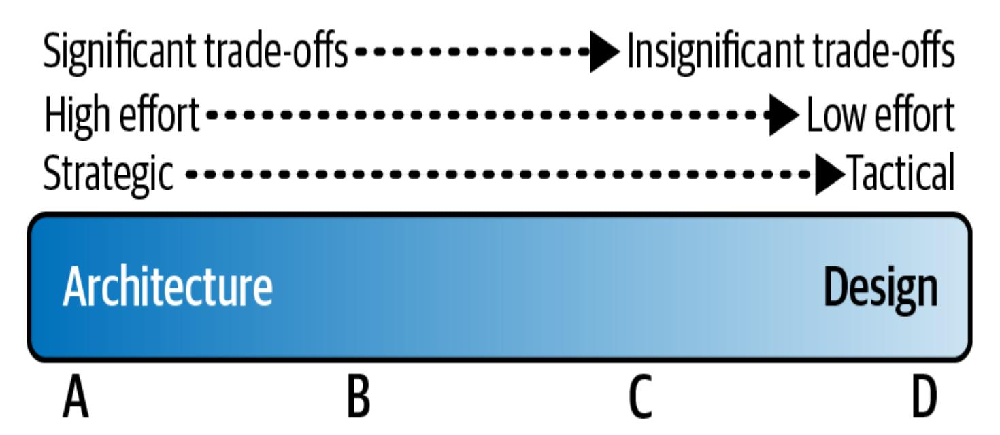
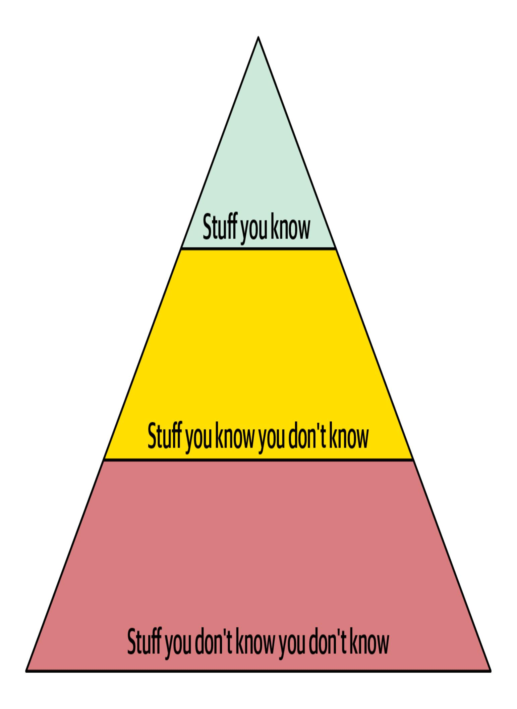
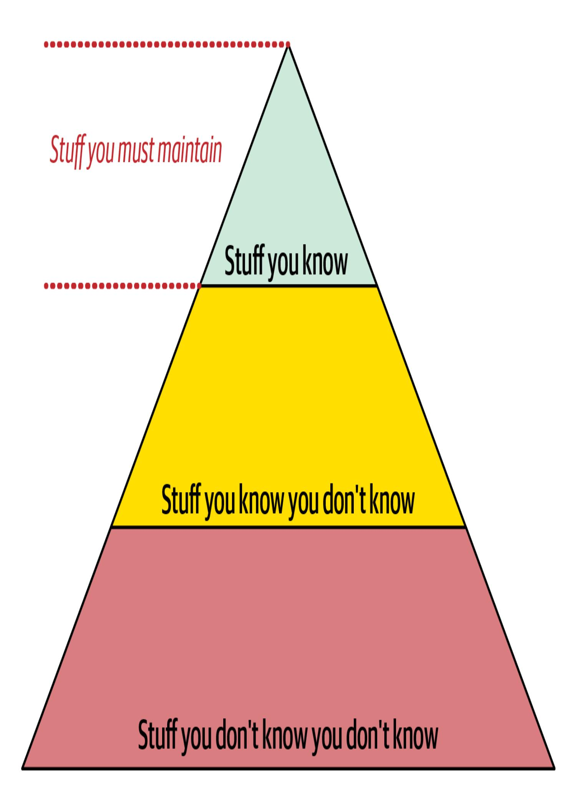
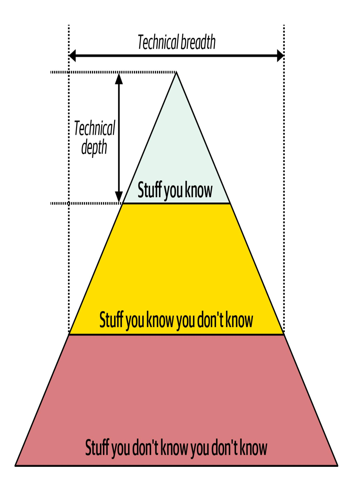
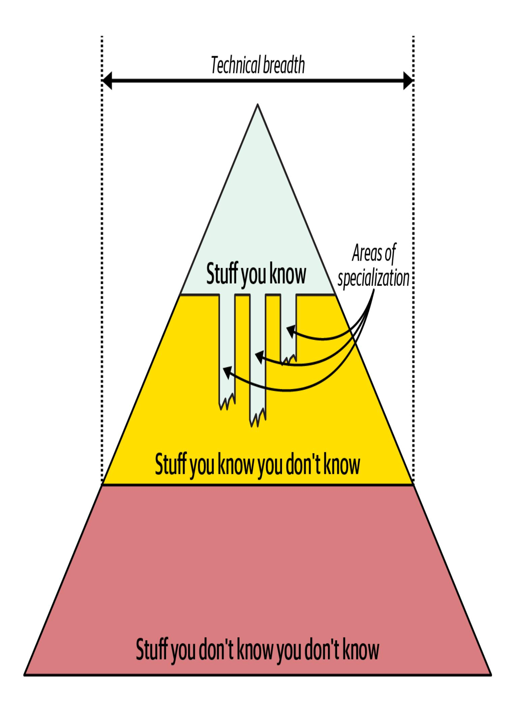
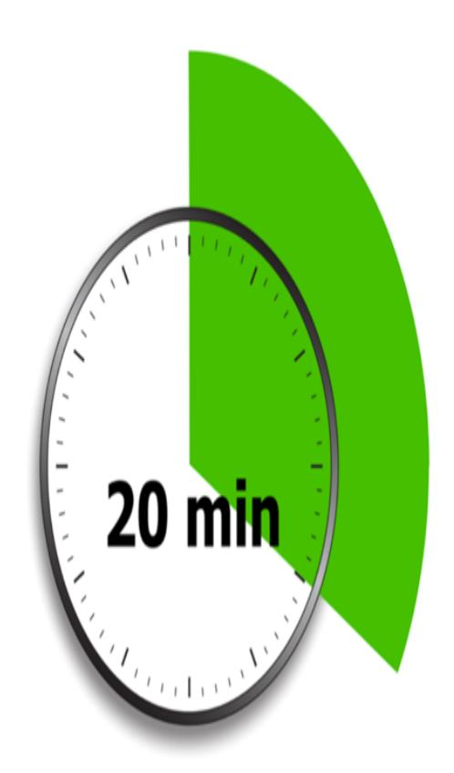
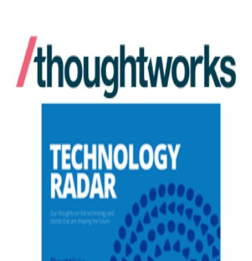
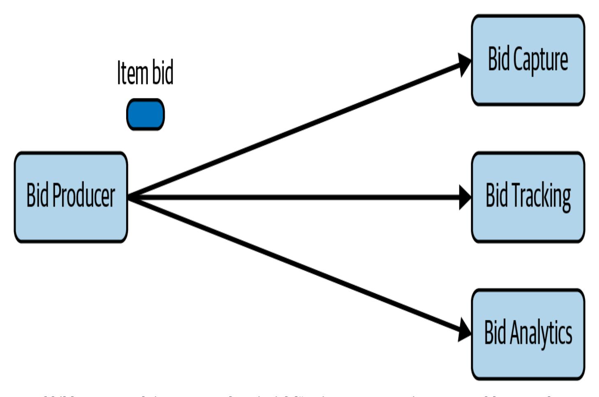
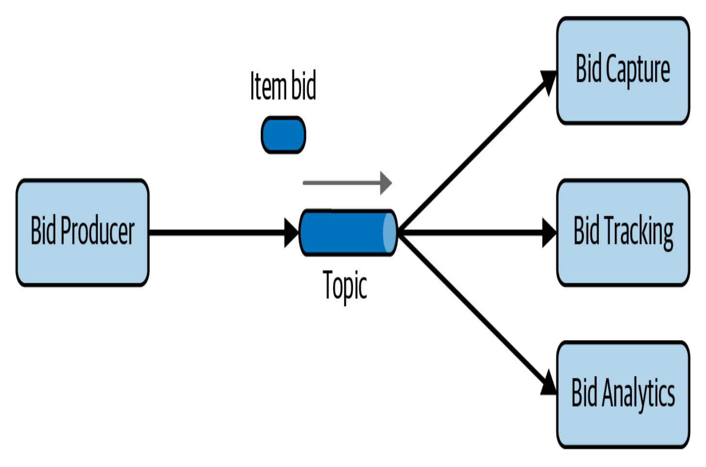
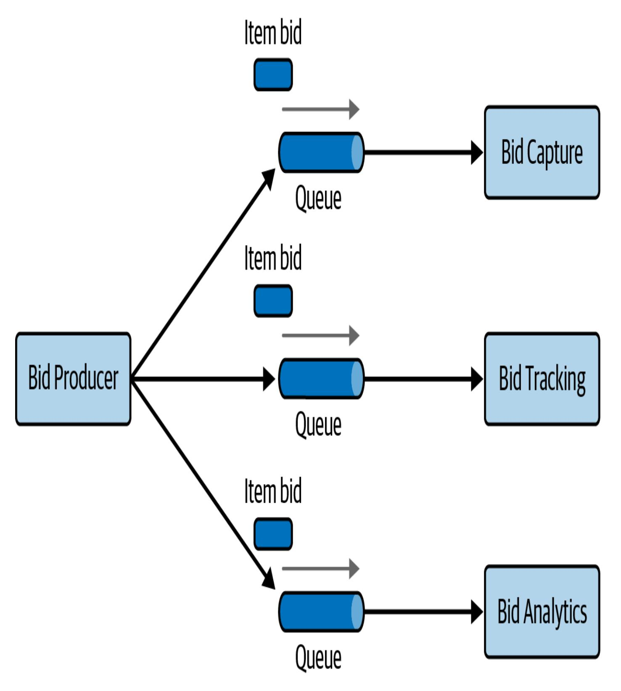

# 2장. 아키텍처적 사고 (Kapitel 2. Architektonisches Denken)

이 저작물은 AI의 도움을 받아 번역되었습니다. 여러분의 피드백과 의견을 환영합니다: [translation-feedback@oreilly.com](mailto:translation-feedback@oreilly.com)

아키텍처적 사고란 사물을 아키텍트의 시각, 즉 아키텍처 관점에서 바라보는 것입니다. 특정 변경 사항이 전체 확장성에 어떤 영향을 미치는지 이해하고, 시스템의 여러 부분이 서로 어떻게 작용하는지 주의 깊게 살피며, 주어진 상황에 가장 잘 맞는 서드파티 라이브러리와 프레임워크를 파악하는 것 모두가 아키텍처적 사고의 예입니다.

아키텍트처럼 생각하려면 먼저 소프트웨어 아키텍처(Softwarearchitektur)가 무엇인지, 그리고 아키텍처와 디자인의 차이가 무엇인지 이해해야 합니다. 이는 폭넓은 지식을 갖춰 다른 사람이 보지 못하는 해법과 기회를 식별하고, 비즈니스 요소의 중요성을 이해해 이를 아키텍처 관심사로 번역하며, 다양한 해법과 기술 사이의 트레이드오프를 파악하고 조율하는 일을 포함합니다.

이 장에서는 아키텍트처럼 사고하는 데 필요한 이러한 요소를 살펴봅니다.

# 아키텍처와 디자인 (Architektur vs. Design)

잠시 시간을 내어 당신의 꿈의 집을 떠올려 보세요. 몇 층짜리인가요? 지붕은 평평한가요 아니면 뾰족한가요? 넓게 펼쳐진 단층 랜치하우스인가요, 아니면 다층의 현대식 주택인가요? 침실은 몇 개를 원하나요? 이런 것들이 집의 *전체 구조*, 즉 아키텍처를 결정합니다. 이제 집 내부를 상상해 보세요. 바닥은 카펫인가요, 원목 마루인가요? 벽은 무슨 색인가요? 스탠드 조명이 있나요, 아니면 천장에 매달린 조명이 있나요? 이런 요소는 모두 집의 *디자인*에 해당합니다.

소프트웨어 아키텍처에서도 시스템의 외관보다는 구조가 중요하며, 디자인은 구조보다는 시스템이 어떻게 보이고 느껴지는지에 집중합니다. 예를 들어 마이크로서비스(Microservices)를 사용하기로 한 결정은 시스템의 구조와 형태, 즉 아키텍처를 규정하지만, 사용자 인터페이스(UI)의 모양과 작동 방식은 시스템의 디자인을 결정합니다.

그렇다면 서비스를 더 작은 단위로 분해할지, 특정 UI 프레임워크를 채택할지는 어디에 속할까요? 안타깝게도 대부분의 결정은 아키텍처와 디자인 사이의 *스펙트럼* 어딘가에 존재하기 때문에 어떤 것이 아키텍처에 속하는지 가늠하기 어렵습니다.

다음 기준을 활용하면 해당 결정이 아키텍처에 가까운지, 디자인에 가까운지 판단할 수 있습니다.

- 결정이 전략적인가, 전술적인가?
- 무언가를 변경하거나 구축하는 데 얼마나 많은 노력이 드는가?
- 트레이드오프의 규모는 어느 정도인가?

이 요소들은 [그림 2-1](#page-2-0)에 제시되어 있으며, 아키텍처와 디자인 사이의 스펙트럼을 시각화해 각 결정이 어디에 놓여 있는지, 누가 책임져야 하는지 판단할 수 있도록 돕습니다.

그림 2-1. 아키텍처와 디자인 사이의 스펙트럼

**전략적 결정 대 전술적 결정**

결정이 전략적일수록 더 아키텍처적이며, 전술적일수록 디자인에 가깝습니다. *전략적* 결정은 대개 장기적인 반면, *전술적* 결정은 단기적이고 다른 활동이나 결정과 독립적인 경우가 많습니다.

결정이 전략적인지 전술적인지 판단하려면 다음 질문을 던져 보세요.

*이 결정을 위해 얼마나 많은 고민과 계획이 필요했는가?* 몇 분 만에 끝나는 결정이라면 전술적일 가능성이 높고, 따라서 디자인과 관련이 큽니다. 반대로 몇 주에 걸친 계획이 필요한 결정이라면 전략적이며 아키텍처와 더 연관됩니다.

*이 결정에는 얼마나 많은 사람이 관여했는가?* 혼자 또는 동료 한두 명과 내린 결정이라면 전술적이고 스펙트럼의 디자인 쪽에 위치할 가능성이 큽니다. 반대로 다양한 이해관계자와 수많은 회의를 거쳐야 하는 결정이라면 전략적이며 아키텍처 쪽에 가깝습니다.

*결정이 장기적 비전인가, 단기적 조치인가?*

곧 바뀔 가능성이 큰 결정은 보통 전술적이며 디자인에 속합니다. 반면 오랫동안 지속될 결정은 전략적이며 아키텍처에 속합니다.

이 질문들은 다소 주관적일 수 있지만, 무엇이 전략인지 전술인지, 따라서 아키텍처와 디자인 중 어디에 관련이 있는지 가늠하는 데 도움이 됩니다.

### **노력의 정도 (Grad der Anstrengung)**

Martin Fowler의 유명한 글 ["Who Needs an Architect?"](https://www.martinfowler.com/ieeeSoftware/whoNeedsArchitect.pdf)에서 그는 아키텍처를 *"솔루션의 중요한 구성요소에 관한 논리적인 결정을 내리고, 이러한 결정의 개별적인 설계에 반하는 영향을인지하는 것"*으로 정의했습니다. 이 정의에서 드러나듯이, 많은 사람이 아키텍처를 중요한 구조적 요소와 관련된 결정이라고 여깁니다. 이러한 결정을 내리는 데 얼마나 많은 노력이 필요한지 역시 해당 결정이 아키텍처적인지 디자인적인지 구분하는 데 도움이 됩니다.

### **트레이드오프의 중요성 (Die Bedeutung von Kompromissen)**

트레이드오프가 크고 복잡할수록 해당 결정은 아키텍처에 속할 가능성이 크며, 트레이드오프가 작고 단순할수록 디자인에 속할 가능성이 높습니다. 아키텍처와 디자인은 모두 트레이드오프를 포함하지만, 아키텍처적 결정은 시스템의 구조와 성공에 더 큰 영향을 미칩니다.

## 기술적 폭 (Technische Breite)

개발자는 업무를 수행하려면 높은 수준의 *기술적 깊이*가 필요하지만, 소프트웨어 아키텍트는 아키텍처 관점에서 사물을 보기 위해 높은 수준의 *기술적 폭*을 갖춰야 합니다. 기술적 깊이는 특정 프로그래밍 언어, 플랫폼, 프레임워크, 제품 등을 숙달하는 것이고, 기술적 폭은 많은 것들을 조금씩 아는 능력입니다.

이 차이를 더 잘 이해하려면 [그림 2-2](#page-7-0)에 제시된 지식 피라미드를 살펴보세요. 이 피라미드는 세 가지 층—*내가 아는 것*, *내가 모른다는 사실을 아는 것*, *모른다는 사실조차 모르는 것*—으로 전 세계의 모든 기술 지식을 요약합니다.

*내가 아는 것*에는 기술자들이 매일 업무에 활용하는 기술, 프레임워크, 언어, 도구가 포함됩니다(예: Java 프로그래머가 Java를 알고 있는 경우). 이 최상단 층은 가장 작으며 항목 수도 적습니다. 대부분의 기술자는 전문성을 키울 영역을 선택해야 하고, 모든 분야에서 전문가가 될 수는 없기 때문입니다.

*내가 모른다는 사실을 아는 것*은 피라미드의 중간 층으로, 이름만 들어 보았거나 약간 알고 있지만 실무 경험은 거의 없는 영역을 뜻합니다. 대부분의 기술자가 Clojure가 Lisp 계열 프로그래밍 언어라는 사실은 알고 있지만, 실제로 Clojure 코드를 작성하지는 못한다는 예를 떠올려 보세요. 이 층은 최상단보다 훨씬 큽니다. 우리가 전문성을 쌓을 수 있는 것보다 훨씬 더 많은 주제와 접촉할 수 있기 때문입니다.

*모른다는 사실조차 모르는 것*은 피라미드에서 가장 큰 부분입니다. 문제에 완벽한 해법이 될 수 있는 수많은 기술, 도구, 프레임워크, 언어가 여기에 속하지만, 존재 자체를 모르기 때문에 활용하지 못합니다. 커리어의 목표는 이 영역에 있는 항목을 한 단계 위로 옮겨 *내가 모른다는 사실을 아는* 영역으로 이동시키고, 필요할 때는 그중 일부를 최상단인 *내가 아는 것*으로 끌어올리는 것입니다.

경력 초기에 피라미드의 꼭대기를 확장한다는 것은 [그림 2-3](#page-10-0)처럼 값진 전문성을 확보한다는 뜻입니다. 하지만 *알고 있는 것*은 계속 *관리*해야 합니다. 소프트웨어 세계에서 정체된 것은 아무것도 없기 때문입니다. 누군가가 Ruby on Rails 전문가라고 하더라도 1~2년 동안 해당 기술을 사용하지 않으면 지식이 금세 낡아버립니다. 피라미드 상단에 머무르려면 전문성을 유지하는 데 시간을 들여야 합니다. 이 최상단이 바로 개인의 *기술적 깊이*를 나타냅니다.

소프트웨어 개발자도 아이스버그 모델의 변형을 따르는 경향이 있습니다. [그림 2-3](#page-10-0)처럼 개발자는 시간이 지날수록 여러 기술을 접하지만, 특정 분야에서 깊이 있는 전문 능력을 갈고닦습니다. 이러한 전문 능력이 그들의 평판과 가치를 높여 주기 때문에, 어림짐작으로 변화를 한 번에 추진하기는 어렵습니다.

하지만 개발자가 아키텍트 역할로 전환하면 필요한 지식의 성격이 달라집니다. 아키텍트가 제공하는 가치의 상당 부분은 *폭넓은* 기술 이해와 이를 특정 문제 해결에 어떻게 활용할 수 있는지 아는 데서 나옵니다. 예를 들어 특정 문제에 적용할 수 있는 해법이 다섯 가지라는 사실을 아는 것이, 한 가지에만 특화된 것보다 훨씬 낫습니다. 아키텍트에게 중요한 지식 피라미드의 부분은 상단 *그리고* 중단이지만, 중단이 하단까지 얼마나 내려가는지가 [그림 2-4](#page-12-0)에 제시된 아키텍트의 기술적 *폭*을 보여 줍니다.

아키텍트에게는 *폭*이 *깊이*보다 더 중요합니다. 아키텍트는 자신의 역량을 기술적 제약과 조율해야 하기 때문에 폭넓은 해결책을 이해하는 능력이 가치 있습니다. 따라서 [그림 2-5](#page-14-0)처럼 일부 어렵게 얻은 전문성을 과감히 조정하고, 그 시간을 포트폴리오를 넓히는 데 쓰는 것이 현명할 때가 많습니다. 즐거움을 주는 기술 분야에 대한 전문성은 유지하면서, 다른 부분은 자연스럽게 줄어들기도 합니다.

이 지식 피라미드는 *아키텍트*와 *개발자*의 역할이 근본적으로 다르다는 사실을 잘 보여 줍니다. 개발자는 직업 생애 전반에 걸쳐 자신의 전문 역량을 다듬습니다. 아키텍트 역할로 전환한다는 것은 많은 사람이 어려워하는 관점의 전환을 의미합니다. 그 결과 두 가지 문제가 자주 발생합니다. 첫째, 아키텍트가 다양한 영역에서 전문성을 유지하려 애쓰지만 어느 곳에서도 성공하지 못하고 번아웃에 시달릴 수 있습니다. 둘째, *구식 전문성*이 생겨 자신의 오래된 지식이 여전히 최신이라고 착각하는 경우도 있습니다. 대기업에서 창업 멤버 출신 개발자가 리더 역할로 올라선 뒤에도 수년 전 기준으로 기술 결정을 내리는 모습을 자주 볼 수 있습니다( "얼어붙은 동굴인간(Frozen Caveman) [안티패턴"](#page-16-0) 참조).

#### **얼어붙은 동굴인간 안티패턴 (GEFRORENER HÖHLENMENSCH ANTIPATTERN)**

*안티패턴*은 프로그래머 [Andrew Koenig](https://oreil.ly/p9i_Y)이 정의했듯이 처음에는 좋아 보이나 결국 문제를 일으키는 아이디어입니다. 현장에서 자주 볼 수 있는 얼어붙은 동굴인간 안티패턴은 어떤 아키텍트가 늘 자신의 비이성적인 애착사례로 되돌아가는 행동 양식을 가리킵니다. 예를 들어 Neal의 한 동료가 중앙집중식 아키텍처를 가진 시스템을 만드는 프로젝트에서 일한 적이 있습니다. 고객사 아키텍트에게 설계를 보여 줄 때마다 빠짐없이 나오는 질문은 "하지만 우리가 이탈리아를 잃어버리면 어떻게 되죠?"였습니다. 몇 년 전 고객사의 본사와 이탈리아 지사 간 통신 문제가 발생해 큰 혼란을 겪은 적이 있었기 때문입니다. 같은 일이 다시 일어날 가능성은 극히 낮았지만, 아키텍트들은 그 특정 아키텍처 특성에 집착했습니다.

이 행동 양식은 과거 잘못된 결정이나 예기치 않은 사건으로 큰 피해를 본 아키텍트가 관련된 모든 사안에 과도하게 신중해질 때 나타납니다. 위험 분석은 중요하지만, 현실적이어야 합니다. 진짜 기술적 위험과 상상 속 위험을 구분하는 것은 지속적인 학습 과정의 일부입니다. 아키텍트처럼 생각하려면 이런 얼어붙은 동굴인간식 사고와 경험을 넘어, 다른 해법을 살피고 더 관련성 높은 질문을 던질 수 있어야 합니다.

아키텍트는 기술적 폭에 집중해 더 많은 화살을 쏠 수 있는 큰 화살통을 갖춰야 합니다. 개발자에서 아키텍트로 전환하는 사람은 지식 습득에 대한 관점을 바꿔야 할 수도 있습니다. 지식 포트폴리오의 깊이와 폭 사이 균형을 맞추는 일은 개발자라면 누구나 경력 전반에 걸쳐 고민해야 합니다. 그렇다면 아키텍트는 어떻게 기술적 폭을 확장할 수 있을까요? 다음 절에서는 "알지 못한다는 사실조차 모르는 것"을 드러내는 데 도움이 되는 몇 가지 기법을 소개합니다.

### **20분 규칙 (Die 20-Minuten-Regel)**

[그림 2-5](#page-14-0)가 보여 주듯, 아키텍트에게는 기술적 폭이 기술적 깊이보다 중요합니다. 그렇다면 풀타임으로 일하고, 커리어를 관리하며, 가족이나 친구, 취미와 시간을 보내야 하는 와중에 최신 트렌드와 유행어를 어떻게 따라잡을 수 있을까요? Neal은 이를 위해 "20분 규칙"을 활용합니다. 이 규칙은 매우 간단합니다. *매일* 20분을 투자해 그날 관심이 가는 어떤 기술 주제든 조사합니다.

[그림 2-6](#page-18-0)은 InfoQ, [DZone Refcardz](https://dzone.com/refcardz), [Thoughtworks Technology Radar](https://thoughtworks.com/radar) 등 20분을 보낼 만한 장소 예시를 보여 줍니다. 인터넷 검색으로 생소한 유행어를 찾아보고, 모른다는 사실조차 몰랐던 주제를 "모른다는 사실을 아는" 영역으로 옮길 수 있습니다. 이 시간에 지금 읽고 있는 것과 같은 책을 읽어도 좋습니다. 핵심은 자신의 전문성과 커리어를 위해 매일 시간을 투자한다는 사실입니다.

20분이라는 짧은 시간은 집중력을 유지하고, 새로운 것을 배우며, 관련성이 떨어지는 토끼굴로 빠질 위험을 줄이는 데 충분합니다. Neal은 대개 매일 아침 5시 30분에 일어나 그날의 기술 주제를 찾습니다. 그는 각 주제를 20분간 탐구하고, 마지막에 그 기술을 더 깊이 파고들 필요가 있는지 평가합니다. 대부분의 경우 그런 필요가 없지만, 때때로 흥미를 느껴 이후 더 시간을 할애하기도 합니다. 시간이 지나면 Neal의 기술 지식 포트폴리오에는 깊이 집중해 본 항목과 단순 개요만 살펴본 항목이 자연스럽게 뒤섞여 균형을 이룹니다.

많은 기술 종사자가 점심시간이나 퇴근 후에 20분을 확보하려 하지만, 경험상 그렇게 마련한 시간은 종종 무용지물입니다. 점심시간은 휴식 대신 밀린 일을 처리하는 데 쓰이기 쉽고, 저녁에는 긴 하루를 마치고 나면 사회적 일정이나 가족과의 시간 등으로 금세 빼앗깁니다. 그래서 우리는 커피나 차를 마신 직후, *이메일을 열기 전에* 아침에 20분을 확보하라고 권합니다. 이메일을 여는 순간 하루가 시작되고 집중력이 분산되기 때문입니다. 정신이 맑고 방해가 적을 때 20분을 먼저 확보하세요.

이 규칙은 새로운 기술 트렌드뿐 아니라 기술의 늪에 빠지지 않도록 도와줍니다. 예를 들어 한 기술에서 다른 기술로 옮겨갈지 고민 중이라면, 20분 규칙은 해당 기술에 대한 기본적인 직관을 얻는 데 도움이 됩니다. 20분은 한 기술의 표면을 훑어보고, 추후 더 시간을 들일지 판단하기 충분한 시간입니다. 같은 목적으로 Neal은 즐겨찾는 기술 사이트를 꾸려 매일 빠르게 훑습니다. 그는 이 리스트를 Workbench 뉴스레터에 공유합니다.

### **개인 레이더 만들기 (Ein persönliches Radar entwickeln)**

기술적 폭을 확장하려는 개발자나 아키텍트에게는 이전 섹션에서 소개한 20분 규칙 외에도 다양한 도구가 필요합니다. 그중 하나가 *기술 레이더*입니다. 기술 레이더는 개발자나 아키텍트에게 어떤 기술을 학습해야 하고, 어떤 기술을 보류해야 하며, 새로운 기술과 도구가 등장할 때 어떤 질문을 던져야 하는지 알려 줍니다. 이 아이디어는 Neal이 일하는 Thoughtworks에서 처음 고안되었으며, 이후 여러 조직이 자체 버전을 만들어 사용하고 있습니다.

1990년대와 2000년대 초반에 우리의 공동 저자 중 한 명은 소규모 교육·컨설팅 회사의 CTO였습니다. 그가 부임했을 때 회사에서 가장 중요한 플랫폼은 Clipper라는 도구였는데, 이는 dBASE 파일 위에 DOS 애플리케이션을 빠르게 구축할 수 있는 도구였습니다. 그러다 어느 날, 그 플랫폼은 흔적도 없이 사라졌습니다. 회사는 Windows의 부상을 알고 있었지만, 엔터프라이즈 시장은 여전히 DOS 중심이라고 여겼죠—그러다 갑자기 상황이 완전히 달라졌습니다. 한 직원은 자신들이 Clipper에 쌓은 방대한 지식을 다른 것으로 대체할 수 없다고 하소연했습니다. "한 세대 안에 이토록 많은 세부 지식을 배우고 다시 버려야 했던 집단이 역사상 또 있을까요?"라는 그의 질문이 남긴 교훈은 분명했습니다. *기술 발전을 무시하면 결국 큰 대가를 치르게 된다*는 것입니다.

이 경험은 기술 버블에 대한 중요한 교훈도 남겼습니다. 개발자와 아키텍트, 다른 기술자들이 특정 기술에 몰두해 자신의 일과 생각을 모두 쏟아붓다 보면, 우리는 마치 에코 체임버 같은 사고의 거품 속에 살게 됩니다. 그 안에서는 누구나 우리가 애정하는 기술을 알고 높이 평가한다고 믿게 되며, 특히 기술 공급업체가 만든 거품일수록 외부의 솔직한 평가를 접하기 어렵습니다. 그 거품이 터지기 시작할 때까지는 경고조차 받지 못한 채 뒤늦게 추락을 경험하게 됩니다.

이럴 때 필요한 것이 바로 *기술 레이더*입니다. 기술 레이더는 기존 및 신규 기술의 위험과 기회를 평가하는 살아 있는 문서입니다. 이 개념은 Neal이 디렉터이자 소프트웨어 아키텍트로 활동하는 [Thoughtworks](https://thoughtworks.com/)에서 탄생했습니다. 이제 이 개념이 어떻게 만들어졌는지 살펴보고, 여러분이 직접 개인 레이더를 구축하는 방법을 소개하겠습니다.

### **Thoughtworks 기술 레이더 (Das Thoughtworks Technologie-Radar)**

Technology Advisory Board(TAB)는 Thoughtworks의 고위 기술 리더 그룹으로, CTO가 회사와 고객을 위한 기술 방향과 전략을 결정할 때 자문을 제공합니다. 이 그룹은 최신 동향을 파악하기 위해 매년 두 차례 [Technology Radar](https://thoughtworks.com/radar)를 발간하기 시작했습니다.

이 과정은 예상치 못한 부수 효과를 낳았습니다. Neal이 컨퍼런스에서 발표하면, 참가자들이 찾아와 레이더 작성에 도움을 준 것에 감사하며 자신들의 회사도 자체 버전을 만들기 시작했다고 이야기하곤 했습니다. Neal은 또한 컨퍼런스에서 늘 받던 질문에 대한 답을 발견했습니다. "기술을 어떻게 따라잡나요? 다음에 무엇을 해야 할지 어떻게 결정하나요?" 그 답은 발표자들 모두가 어떤 형태로든 내부 레이더를 갖추고 있다는 것입니다.

#### **요소 (Teile)**

Thoughtworks 레이더는 소프트웨어 개발 전반을 가능한 한 많이 포괄하기 위해 네 개의 사분면으로 구성됩니다.

*도구*

IDE 같은 개발 도구부터 기업 통합 도구까지 포함합니다.

*언어와 프레임워크*

컴퓨터 언어, 라이브러리, 프레임워크(대개 오픈소스)를 다룹니다.

*기법*

프로세스, 기술적 방법, 컨설팅 등 소프트웨어 개발 전반을 지원하는 모든 실천법을 포함합니다.

#### *플랫폼 (Plattformen)*

데이터베이스, 클라우드 제공업체, 운영체제 등 기술 플랫폼을 다룹니다.

#### **링 (Ringe)**

레이더에는 바깥쪽에서 안쪽으로 나열되는 네 개의 링이 있습니다.

#### *보류 (Halte)*

처음에 "Hold" 링은 합리적으로 평가하기에는 너무 새로운 기술, 즉 큰 화제를 모았지만 아직 검증되지 않은 기술을 "당분간 보류하라"는 의미로 표시했습니다. 이후 "Hold" 링은 지금은 대체로 "이 기술로 새로운 일을 시작하지 말라"는 뜻으로 발전했습니다. 기존 프로젝트에서 사용해도 큰 문제는 없지만, 새로운 개발에 적용할지는 신중히 결정해야 합니다.

#### *평가 (Bewerten)*

"Assess"(Bewerten) 링은 기술이 탐구할 가치가 있음을 나타냅니다. 예를 들어 모바일 브라우저가 등장했을 때 많은 대기업이 모바일 전략을 세우면서 이 단계를 거쳤습니다. 이 단계에서는 스파이크 개발, 연구 프로젝트, 컨퍼런스 세션 등을 통해 해당 기술이 조직에 어떤 영향을 줄지 살펴봅니다.

#### *시도 (Versuch)*

"Trial"(Versuch) 링은 따라가 볼 만한 기술을 의미합니다. 어떤 역량이 이 링에 있다면 해당 역량을 구축하는 방법을 아는 것이 중요합니다. 지금이 위험이 낮은 프로젝트에서 실험할 시점입니다.

#### *도입 (Adoptiere)*

Thoughtworks는 산업계가 "Adopt" 링에 기재된 항목을 채택해야 한다고 굳게 믿습니다.

[그림 2-7](#page-25-0)의 레이더 예시에서 각 "블립"은 서로 다른 기술이나 기법을 나타냅니다. Thoughtworks는 레이더를 활용해 소프트웨어 세계에 대한 집단적 의견을 공유하지만, 많은 개발자와 아키텍트는 그 레이더를 통해 자신들의 기술 평가 프로세스를 구조화하고 어떤 것에 시간을 투자해야 할지 생각을 정리합니다. 개인용으로 사용할 경우, 사분면의 의미를 다음과 같이 바꾸어 쓰길 권장합니다.

#### *보류 (Halte)*

여기에는 피해야 할 기술과 기법뿐 아니라 버리고 싶은 습관도 포함합니다. 예를 들어 .NET 세계의 아키텍트라면 내부 팀 루머에 관한 포럼에서 최신 뉴스를 읽는 데 익숙할 수 있습니다. 재미있을 수는 있지만 가치가 낮은 정보 흐름입니다. 이러한 항목을 보류 링에 넣어 두면 시간과 노력을 어떻게 써야 할지 계속 상기하게 됩니다.

#### *평가 (Bewerten)*

이 사분면에는 당신이 배워야 한다고 생각하는 모든 것을 넣습니다. 예를 들어 한 아키텍트는 웹 UI에 큰 변화가 있을 때마다 관련 기술을 이 링에 넣는다고 말했습니다. 개인 레이더에서 그는 [Elm](https://elm-lang.org/) 같은 함수형 프론트엔드 프레임워크부터 브라우저 내 WASM(WebAssembly)까지 다양한 아이디어를 다룹니다. 기업 레이더에서는 기업이 미래를 대비해야 하는 모든 기술을 이 링에 넣습니다. 기술이 여기 오래 머무르지 않도록 시기와 빈도를 정해 주기적으로 점검하는 것이 중요합니다.

#### *시도 (Versuch)*

이 링은 위험이 낮은 환경에서 적극적으로 실험해 보려는 기술을 의미합니다. 기존 프로덕션 프로젝트에 도입하라는 뜻은 아니지만, 예를 들어 사이드 프로젝트나 해커톤에서 적용해 볼 수 있습니다. 조직 레이더에서는 무언가를 시도 링에 올려둔 순간, 작은 규모이더라도 실제 파일럿으로 가동해 보라는 신호로 읽힙니다.

#### *도입 (Adoptiere)*

개인 레이더에서는 한 기술을 자신의 표준 도구 모음에 추가해 어디서든 사용할 준비가 됐음을 의미합니다. 조직 레이더에서는 해당 기술이 이미 프로덕션에 들어갔고, 조직 전체에 배포할 만큼 안정적이라는 뜻입니다.

# 트레이드오프 분석 (Die Analyse von Kompromissen)

아키텍처적 사고란 기술적이든 다른 영역이든 모든 해법에서 트레이드오프를 찾아 분석해 최선의 해법을 선택하는 것입니다. 아래에 Mark(이 책의 공동 저자 중 한 명)의 인용문이 이런 활동이 왜 아키텍트의 가장 중요한 업무 가운데 하나인지를 잘 보여 줍니다.

*아키텍처는 검색하거나 LLM에게 물어볼 수 없는 것이다.*

—Mark Richards

아키텍처에서 *모든 것*은 트레이드오프입니다. 그렇기 때문에 우주에 존재하는 모든 아키텍처 질문에 대한 유명한 대답이 "상황에 따라 다르다"인 것입니다. 짜증 날 수 있지만, 불편하게도 사실입니다. REST가 나을지 메시징이 나을지, 새로운 제품에 마이크로서비스 아키텍처 스타일이 맞을지 여부를 검색하거나 AI 엔진이나 LLM에게 물어볼 수 없습니다. 정답은 정말로 *상황에 따라* 달라지기 때문입니다. 배포 환경, 비즈니스 요인, 조직 문화, 예산, 일정, 개발 팀의 역량, 그 밖의 수십 가지 요인이 영향을 줍니다. 환경, 상황, 문제는 모두 다릅니다. 이것이 아키텍처가 어려운 이유입니다. 공동 저자 Neal의 말을 다시 인용하면 다음과 같습니다.

*아키텍처에는 옳고 그름이 없고, 오직 트레이드오프만 있다.*

—Neal Ford

예를 들어 [그림 2-8](#page-29-0)에 있는 경매 시스템을 살펴보겠습니다. 온라인 입찰자가 경매 품목에 입찰하고, Bid Producer 서비스가 입찰을 생성해 Bid Capture, Bid Tracking, Bid Analytics 서비스로 보냅니다.

그림 2-8. 트레이드오프 예제로 살펴본 경매 시스템—큐를 쓸까, 토픽을 쓸까?

이 시스템의 비동기 동작을 위해 아키텍트는 포인트 투 포인트 메시징의 큐 또는 퍼블리시-서브스크라이브 메시징의 토픽 가운데 하나를 선택할 수 있습니다. 어떤 것을 골라야 할까요? 답을 검색할 수는 없습니다. 아키텍처에서 아키텍트는 각 옵션에 따른 트레이드오프를 분석하고 주어진 상황에서 가장 좋은(혹은 가장 덜 나쁜) 옵션을 선택해야 합니다.

이 경매 시스템을 위한 두 가지 메시징 옵션은 [그림 2-9](#page-30-0)에 제시된 퍼블리시-서브스크라이브 모델의 토픽 사용과, [그림 2-10](#page-31-0)에 제시된 포인트 투 포인트 모델의 큐 사용입니다.

그림 2-9. 서비스 간 통신에 토픽을 사용하는 경우

그림 2-10. 서비스 간 통신에 큐를 사용하는 경우

[그림 2-9](#page-30-0)의 상황에서 분명한(그리고 겉보기에 가장 타당한) 장점은 *아키텍처 확장성*입니다. Bid Producer 서비스는 토픽 하나에만 연결하면 됩니다. 이는 [그림 2-10](#page-31-0)의 큐 솔루션과 대조됩니다. 큐를 선택하면 Bid Producer는 서로 다른 세 개의 큐에 각기 연결해야 합니다. 여기에 Bid History라는 새로운 서비스가 추가되어 각 입찰자에게 자신의 입찰 내역을 제공한다고 가정해 보겠습니다. 토픽 접근법을 사용하면 기존 서비스와 인프라를 전혀 변경할 필요가 없습니다. 새로운 Bid History 서비스가 이미 입찰 정보를 담고 있는 토픽을 구독하기만 하면 됩니다.

반면 [그림 2-10](#page-31-0)의 큐 옵션에서는 Bid History 서비스가 새로운 큐를 필요로 하고, Bid Producer도 코드 변경을 통해 새 큐에 대한 추가 연결을 만들어야 합니다. 즉 큐를 사용하면 새로운 입찰 기능을 추가할 때마다 서비스와 인프라에 상당한 변경 사항이 필요하지만, 토픽 접근법에서는 기존 인프라에 손댈 필요가 없습니다. 또한 토픽 접근법을 사용하면 Bid Producer가 입찰 정보가 어떻게, 누구에 의해 사용되는지 알지 못하므로 서비스 간 결합도가 낮아집니다. 반대로 큐 옵션에서는 Bid Producer가 입찰 정보를 어떻게, 누가 사용하는지 정확히 알고 있어 시스템과 더 강하게 결합됩니다.

지금까지의 트레이드오프 분석만 보면 퍼블리시-서브스크라이브 모델의 토픽 접근법이 명백한 최선처럼 보입니다. 그러나 Clojure 프로그래밍 언어의 창시자인 Rich [Hickey](https://oreil.ly/JXhHN)의 말을 들어 보겠습니다.

*프로그래머는 모든 것의 장점만 알고, 트레이드오프는 모른다. 아키텍트는 둘 다 알아야 한다.*

#### —Rich Hickey

아키텍처적 사고란 특정 해법의 장점뿐 아니라 그에 수반되는 단점과 트레이드오프도 분석하는 것입니다. 경매 시스템 예로 돌아가 보면, 소프트웨어 아키텍트는 토픽 해법의 장단점을 모두 따져 봅니다. [그림 2-9](#page-30-0)에서 보듯 토픽을 사용하면 *누구나* 입찰 데이터에 접근할 수 있어 데이터 접근 및 보안 문제가 발생할 수 있습니다. 반면 [그림 2-10](#page-31-0)의 큐 모델에서는 큐로 전송된 데이터를 해당 메시지를 받은 소비자만 볼 수 있습니다. 만약 악의적인 서비스가 큐를 엿듣는다면, 그 큐를 청취해야 할 정상 서비스가 입찰을 받지 못하게 되고, 즉시 데이터 손실(및 잠재적인 보안 침해)에 대한 알림이 발생합니다. 다시 말해 토픽을 도청하는 것은 쉽지만, 큐를 도청하는 것은 어렵습니다.

보안 문제 외에도 [그림 2-9](#page-30-0)의 토픽 해법은 동질적인 계약만 지원합니다. 입찰 데이터를 받는 모든 서비스는 동일한 데이터 계약과 동일한 입찰 데이터 집합을 수용해야 합니다. 큐 옵션에서는 각 소비자가 자신의 필요에 맞춘 계약을 가질 수 있습니다. 예를 들어 새로 추가된 Bid History 서비스가 현재 입찰 가격과 입찰 자체를 모두 필요로 하지만, 다른 서비스는 그렇지 않다고 가정해 보겠습니다. 이 경우 계약을 변경해야 하고, 데이터를 사용하는 모든 다른 서비스에도 영향이 갑니다. 큐 모델에서는 별도의 채널, 즉 별도의 계약이 되어 다른 서비스에 영향을 미치지 않습니다.

토픽 모델의 또 다른 단점은 토픽 내 메시지 수를 모니터링할 수 없어 자동 확장이 불가능하다는 점입니다. 반면 큐 옵션에서는 각 큐를 개별적으로 모니터링하고 각 입찰자에게 프로그래밍 방식의 부하 분산을 적용하여 독립적으로 자동 확장할 수 있습니다. 이 트레이드오프는 [기술별 이슈](https://www.amqp.org/)로, 퍼블리셔가 데이터를 보내는 익스체인지와 소비자가 청취하는 큐가 분리되어 있는 Advanced Message Queuing Protocol(AMQP)은 프로그래밍 방식 부하 분산과 모니터링을 지원합니다.

이렇게 트레이드오프를 꼼꼼히 분석한 뒤 어느 옵션이 더 나을까요?

경우에 따라 다릅니다! [표 2-1](#page-35-0)은 이러한 트레이드오프를 요약한 것입니다.

표 2-1. 토픽에 대한 트레이드오프

| 토픽의 장점 | 토픽의 단점 |
|-------------------------------------|-------------------------------------------------------------------|
| 아키텍처 확장성 | 데이터 접근 및 보안에 대한 우려 |
| 서비스 간 결합도 감소 | 이질적 계약을 지원하지 못함 |
| | 모니터링과 프로그래밍 방식 확장성 부족 |

소프트웨어 아키텍처 자체도 트레이드오프입니다. 아키텍트처럼 생각한다는 것은 이러한 트레이드오프를 분석하고 "확장성과 보안 중 무엇이 더 중요한가?"와 같은 질문을 던지는 것입니다. 아키텍트의 결정은 항상 비즈니스 요인, 환경, 기타 다양한 요소에 달려 있습니다.

## 비즈니스 동인 이해하기 (Business Drivers verstehen)

아키텍트처럼 생각한다는 것은 시스템 성공에 필요한 비즈니스 요인을 이해하고, 이를 확장성, 성능, 가용성과 같은 아키텍처 특성으로 번역하는 것입니다. 이는 아키텍트가 일정 수준의 도메인 전문성과 주요 비즈니스 이해관계자들과의 긴밀한 협업을 요구하는 어려운 작업입니다. 우리는 이 책에서 이 주제에 네 개의 장을 할애했습니다. [4장](#page--1-0)에서는 다양한 아키텍처 특성을 정의하고, [5장](#page--1-0)에서는 아키텍처 특성을 식별하고 정성적으로 평가하는 방법을 설명합니다. [6장](#page--1-0)에서는 각 특성을 측정해 시스템의 비즈니스 요구가 충족되는지 확인하는 방법을 다루고, [7장](#page--1-0)에서는 아키텍처 특성의 범위와 결합도와의 관계를 논의합니다.

# 아키텍처와 실전 코딩 사이의 균형 (Gleichgewicht zwischen Architektur und praktischer Codierung)

아키텍트의 어려운 과제 중 하나는 실전 프로그래밍과 소프트웨어 아키텍처 사이 균형을 찾는 일입니다. 우리는 모든 아키텍트가 코딩할 줄 알고 일정 수준의 기술적 깊이를 유지해야 한다고 굳게 믿습니다(["기술적 폭"](#page-5-0) 참조). 겉보기에는 쉬워 보이지만 실제로는 쉽지 않을 때가 많습니다.

실전 프로그래밍과 소프트웨어 아키텍트 역할 사이에서 균형을 찾고자 하는 사람에게 우리가 전하는 첫 번째 조언은 *병목 함정*을 피하라는 것입니다. 병목 함정은 아키텍트가 시스템의 임계 경로에 속한 코드(대개 프레임워크 코드나 복잡한 부분)를 책임지고 팀의 병목이 되는 상황을 말합니다. 아키텍트는 풀타임 개발자가 아니므로 소스 코드 작성과 테스트 같은 개발 작업을 다수의 다이어그램 작성, 회의 참석 등 아키텍트 업무와 병행해야 합니다. 그래서 병목이 생깁니다.

병목 함정을 피하는 한 가지 방법은 아키텍트가 시스템의 중요한 부분을 개발 팀의 다른 구성원에게 위임하고, 한두 번의 이터레이션이 지난 뒤 비즈니스 기능의 작은 부분(예: 한 서비스나 사용자 인터페이스)을 직접 구현하도록 집중하는 것입니다. 이 접근법에는 세 가지 장점이 있습니다. 첫째, 아키텍트는 팀의 병목이 되지 않으면서도 제품 코드 작성 경험을 얻게 됩니다. 둘째, 임계 경로와 프레임워크 코드가 개발 팀 전체에 분산되어 팀이 더 어려운 시스템 부분을 책임지고 더 깊이 이해하게 됩니다. 셋째이자 가장 중요한 점은, 아키텍트가 개발 팀과 동일한 비즈니스 코드를 작성하면서 프로세스, 절차, 개발 환경과 관련된 팀의 문제를 더 잘 이해하고 개선할 기회를 얻게 된다는 것입니다.

만약 아키텍트가 개발 팀과 함께 코드를 작성할 수 없는 상황이라면 어떻게 기술적 깊이를 유지할 수 있을까요? 다음은 기술 역량을 계속 연마하려는 아키텍트를 위한 몇 가지 팁과 기법입니다.

### *빈번한 프루프 오브 컨셉 (Häufige Proofs-of-Concept)*

프루프 오브 컨셉(POC)을 자주 수행하면 아키텍트가 직접 소스 코드를 작성해야 하며, 구현 세부 사항을 고려해 아키텍처 결정을 검증하는 데 도움이 됩니다. 예를 들어 아키텍트가 두 가지 캐싱 솔루션 중 하나를 선택해야 한다면, 각각의 캐싱 제품으로 동작하는 예제를 만들어 결과를 비교하는 것이 효과적인 의사결정 방법입니다. 아키텍트는 직접 구현 세부 사항과 전체 솔루션을 개발하는 데 필요한 노력을 체감할 수 있습니다. 또한 각 캐싱 솔루션의 아키텍처 특성(예: 확장성, 성능, 내결함성)을 더 잘 비교할 수 있습니다.

가능하다면 POC에서도 최대한 프로덕션 품질에 가까운 코드를 작성해야 합니다. 그 이유는 두 가지입니다. 첫째, POC를 위해 만든 "일회성 코드"가 소스 코드 저장소에 포함되어 참조 아키텍처나 다른 사람이 따라야 할 본보기로 사용되는 경우가 많습니다. 아키텍트는 자신의 허술한 코드가 작업 품질을 보여 주는 전형으로 남는 일을 원치 않을 것입니다. 둘째, 프로덕션급 POC 코드를 작성하면 빠르고 거친 POC를 만들며 나쁜 코딩 습관을 반복하는 대신, 고품질의 잘 구조화된 코드를 작성하는 연습을 꾸준히 할 수 있습니다.

### *기술 부채 줄이기 (Technische Schulden abbauen)*

아키텍트가 직접 기여할 수 있는 또 다른 방법은 개발 팀이 중요한 기능적 사용자 스토리 작업에 집중할 수 있도록 기술 부채를 처리해 주는 것입니다. 기술 부채는 대개 우선순위가 낮기 때문에 아키텍트가 특정 이터레이션 안에서 기술 부채를 처리하지 못하더라도 큰 문제가 되지 않으며, 보통 이터레이션의 성공에 영향을 주지 않습니다.

#### *버그 수정 (Fehler beheben)*

이터레이션 동안 버그 수정을 담당하는 것도 실전 프로그래밍 역량을 유지하고 개발 팀을 돕는 한 방법입니다. 화려한 작업은 아니지만, 아키텍트가 코드베이스와 아키텍처에서 문제와 약점을 발견할 수 있도록 해 줍니다.

### *자동화 (Automatisieren)*

개발 팀의 일상 업무를 지원하는 간단한 명령줄 도구나 분석 프로그램을 개발해 자동화하는 것도 실전 프로그래밍 역량을 유지하고 팀 효율을 높이는 훌륭한 방법입니다. 개발 팀이 반복하는 작업을 찾아 자동화해 주세요. 팀은 자동화에 감사할 것입니다. 예로는 기존 린트 검사에 없는 특정 코딩 표준을 확인하는 자동화된 소스 코드 검증 도구, 자동화된 체크리스트, 반복적인 수동 코드 리팩터링 작업 등이 있습니다.

아키텍처 분석과 아키텍처의 활력 및 준수를 보장하는 피트니스 함수 형태의 자동화도 실전 감각을 유지하는 데 좋습니다. 예를 들어 아키텍트는 [ArchUnit](https://archunit.org/) 같은 Java 플랫폼 도구로 Java 코드를 작성해 아키텍처 준수를 자동화할 수 있으며, [피트니스 함수](https://evolutionaryarchitecture.com/)를 직접 만들어 아키텍처 준수를 확인하면서 실전 경험을 쌓을 수 있습니다. 이러한 기술은 [6장](#page--1-0)에서 다룹니다.

#### *코드 리뷰 수행 (Codeüberprüfungen durchführen)*

아키텍트가 실전 감각을 유지하는 마지막 기법은 빈번한 코드 리뷰입니다. 아키텍트가 직접 코드를 작성하지 않더라도 최소한 소스 코드에 *관여*하게 됩니다. 코드 리뷰의 추가 장점으로는 아키텍처 준수를 확인하고, 팀 내 멘토링과 코칭 기회를 식별할 수 있다는 점이 있습니다.

# 아키텍처적 사고는 이것뿐만이 아니다 (Architektonisches Denken ist mehr als das)

이 장은 아키텍트가 어떻게 생각해야 하는지에 관한 기초를 제공합니다. 하지만 아키텍트처럼 생각하는 데 필요한 것은 이 장의 내용보다 훨씬 많습니다. 아키텍트처럼 생각하려면 시스템의 전체 구조를 이해해야 하며(이 주제는 [3장](#page--1-0)에서 다룹니다), 비즈니스 관심사를 파악해 이를 아키텍처 특성으로 번역해야 하고(이 주제에 대한 설명은 네 개의 장에서 이어집니다), 마지막으로 시스템을 구성 요소 관점에서 바라볼 줄 알아야 합니다—즉 시스템의 빌딩 블록을 이해해야 합니다. 이 내용은 [8장](#page--1-0)에서 다룹니다.
