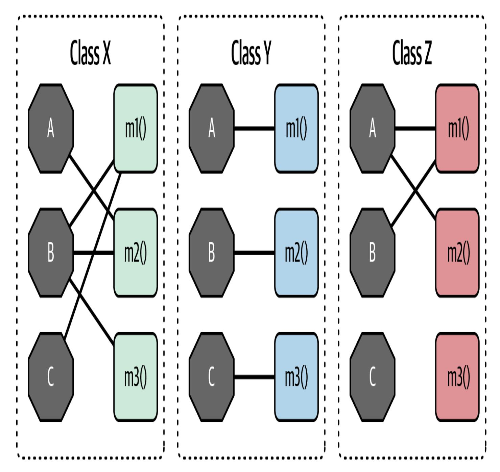
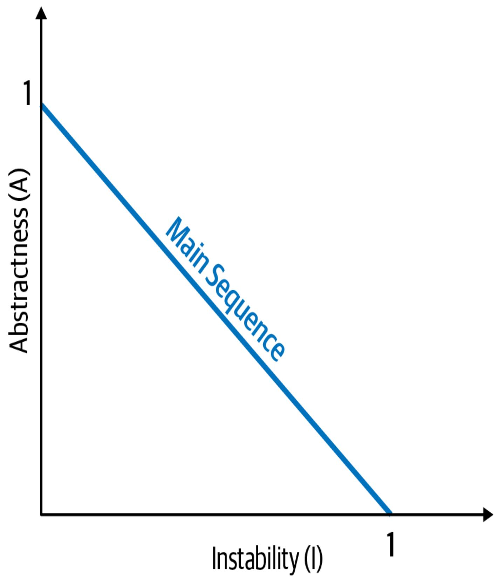
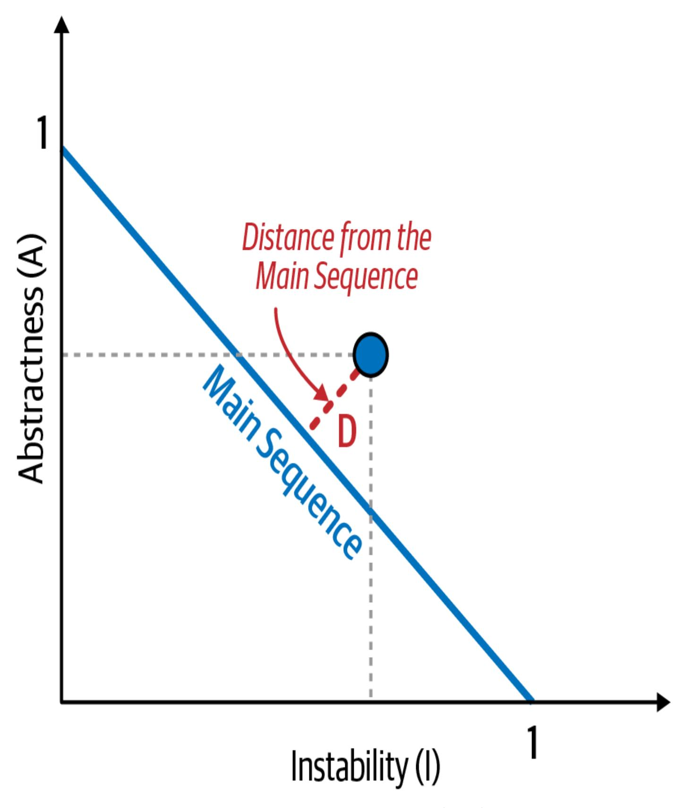
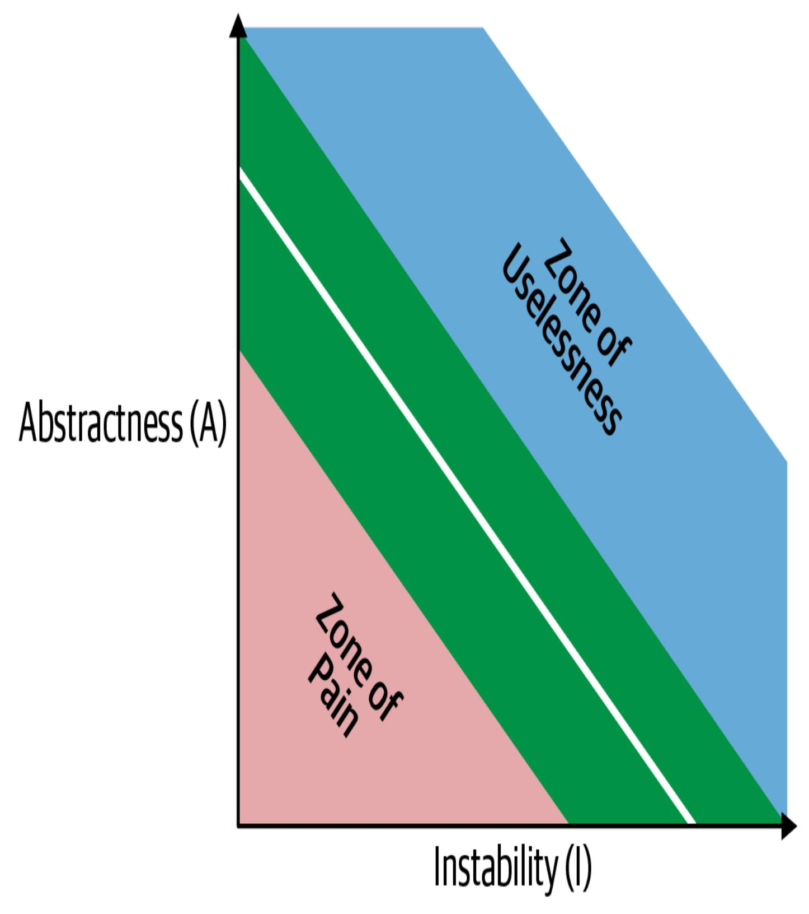
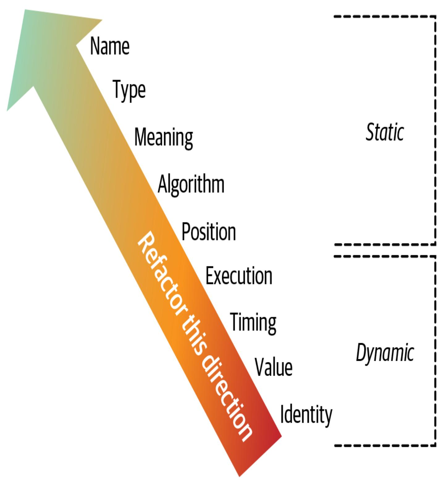

# Kapitel 3. Modularität

Diese Arbeit wurde mithilfe von KI übersetzt. Wir freuen uns über dein Feedback und deine Kommentare: [translation-feedback@oreilly.com](mailto:translation-feedback@oreilly.com)

Architekten und Entwickler haben sich schon seit geraumer Zeit mit dem Konzept der Modularität auseinandergesetzt, wie dieses Zitat aus *Composite/Structured Design* (Van Nostrand Reinhold, 1978) zeigt:

*95 % der Texte [über Softwarearchitektur] preisen die Vorteile der "Modularität" an, und es wird nur wenig, wenn überhaupt, darüber gesprochen, wie man sie erreicht.*

### —Glenford J. Myers

Verschiedene Plattformen bieten unterschiedliche Mechanismen für die Wiederverwendung von Code, aber alle unterstützen eine Möglichkeit, zusammenhängenden Code in *Modulen* zusammenzufassen. Obwohl dieses Konzept in der Software-Architektur allgemeingültig ist, hat es sich als schwierig erwiesen, es zu definieren. Eine einfache Internetrecherche ergibt Dutzende von Definitionen, die nicht einheitlich sind (und sich teilweise widersprechen). Das ist kein neues Problem. Da es jedoch keine anerkannte Definition gibt, müssen wir uns einmischen und unsere eigenen Definitionen aufstellen, um die Konsistenz im Buch zu gewährleisten.

Für Architekten ist es wichtig, die Modularität und ihre vielen Ausprägungen auf der Entwicklungsplattform ihrer Wahl zu verstehen. Viele der Werkzeuge, die uns zur Analyse der Architektur zur Verfügung stehen (z. B. Metriken, Fitnessfunktionen und Visualisierungen), basieren auf Modularität und verwandten Konzepten. *Modularität* ist ein Ordnungsprinzip. Wenn ein Architekt ein System entwirft, ohne darauf zu achten, wie die einzelnen Teile zusammenhängen, wird das System unzählige Schwierigkeiten bereiten. Um eine Analogie aus der Physik zu verwenden: Softwaresysteme bilden komplexe Systeme ab, die zur Entropie (oder Unordnung) neigen. In einem physikalischen System muss Energie zugeführt werden, um die Ordnung zu erhalten. Das Gleiche gilt für Softwaresysteme: Architekten müssen ständig Energie aufwenden, um die strukturelle Stabilität zu gewährleisten, was nicht zufällig geschieht.

Die Wahrung einer guten Modularität ist ein Beispiel für unsere Definition einer *impliziten* Architektureigenschaft: Praktisch keine Projektanforderungen fordern den Architekten explizit auf, eine gute modulare Unterscheidung und Kommunikation zu gewährleisten, aber nachhaltige Codebasen erfordern die Ordnung und Konsistenz, die dies mit sich bringt.

# Modularität versus Granularität

Entwickler/innen und Architekt/innen verwenden die Begriffe *Modularität* und *Granularität* oft synonym, obwohl sie sehr unterschiedliche Bedeutungen haben. Bei der Modularität geht es darum, Systeme in kleinere Teile zu zerlegen, z. B. den Wechsel von einer monolithischen Architektur (wie der traditionellen n-tiered Schichtenarchitektur) zu einer hochgradig verteilten Architektur, wie Microservices. Bei der Granularität geht es dagegen um die *Größe* dieser Teile - wie groß ein bestimmter Teil des Systems (oder Dienstes) sein sollte. Wie einer deiner Autoren im folgenden Zitat sagt, ist es jedoch die *Granularität*, die Architekten und Entwickler in Schwierigkeiten bringt:

*Nimm die Modularität an, aber hüte dich vor der Granularität.*

## —Mark Richards

Granularität führt dazu, dass Dienste oder Komponenten aneinander gekoppelt werden, was zu komplexen, schwer zu wartenden Architekturmustern wie der *Spaghetti-Architektur*, *verteilten Monolithen* und dem berühmten *Big Ball of Distributed Mud* führt. Der Trick, um diese Architekturmuster zu vermeiden, besteht darin, auf die Granularität und den Gesamtgrad der Kopplung zwischen Diensten und Komponenten zu achten.

# Modularität definieren

Merriam-Webster definiert ein *Modul* als "jedes einer Reihe von standardisierten Teilen oder unabhängigen Einheiten, die zum Aufbau einer komplexeren Struktur verwendet werden können". Im Gegensatz dazu verwenden wir in diesem Buch den Begriff *"Modularität"*, um eine logische Gruppierung von zusammengehörigem Code zu beschreiben, z. B. eine Gruppe von Klassen in einer objektorientierten Sprache oder eine Gruppe von Funktionen in einer strukturierten oder funktionalen Sprache. In der Regel verwenden Entwickler/innen Module, um zusammenhängenden Code zu gruppieren. Zum Beispiel sollte das Paket com.mycompany.customer in Java alles enthalten, was mit Kunden zu tun hat. Die meisten Sprachen bieten Mechanismen für die Modularität ( package in Java, namespace in .NET usw.).

Moderne Programmiersprachen verfügen über eine Vielzahl von Paketierungsmechanismen, und viele Entwickler/innen finden es schwierig, sich zwischen ihnen zu entscheiden. In vielen modernen Sprachen können Entwickler/innen beispielsweise Verhalten in Funktionen/Methoden, Klassen oder Paketen/Namensräumen definieren, die jeweils unterschiedliche Sichtbarkeits- und Scoping-Regeln haben. Einige Sprachen verkomplizieren dies noch, indem sie Programmierkonstrukte wie das [Metaobjektprotokoll](https://oreil.ly/9Zw-J) hinzufügen, um noch mehr Erweiterungsmechanismen zu bieten.

Architekten müssen sich bewusst sein, wie Entwickler Dinge verpacken, denn die Paketierung hat wichtige Auswirkungen auf die Architektur. Wenn zum Beispiel mehrere Pakete eng gekoppelt sind, wird es schwieriger, eines davon für verwandte Aufgaben wiederzuverwenden.

#### **MODULARE WIEDERVERWENDUNG VOR DEM UNTERRICHT**

Entwickler, die ihre Ausbildung in den Tagen vor den objektorientierten Sprachen absolviert haben, rätseln vielleicht, warum es so viele verschiedene Trennungsschemata gibt. Ein Großteil des Grundes hat mit der Abwärtskompatibilität zu tun - nicht des Codes, sondern der Denkweise der Entwickler.

Im März 1968 veröffentlichte die Zeitschrift *Communications of the Association for Computing Machinery (ACM)* einen Artikel des Informatikers Edsger Dijkstra mit dem Titel "Go To Statement Considered Harmful". Er verunglimpfte die damals in Programmiersprachen übliche GOTO Anweisung, weil sie nichtlineare Sprünge innerhalb des Codes erlaubte, was die Argumentation und Fehlersuche erschwerte.

Dijkstras Aufsatz läutete Mitte der 1970er Jahre die Ära der *strukturierten* Programmiersprachen ein, für die Pascal und C beispielhaft sind und die ein tieferes Nachdenken darüber fördern, wie Dinge zusammenpassen. Die Entwickler erkannten schnell, dass die meisten Programmiersprachen keine gute Möglichkeit boten, ähnliche Dinge logisch zusammenzufassen. So begann Mitte der 1980er Jahre die kurze Ära der *modularen* Sprachen, wie Modula (die nächste Sprache des Pascal-Schöpfers Niklaus Wirth) und Ada. Diese Sprachen setzten auf das Programmierkonstrukt des *Moduls*, ähnlich wie wir heute an Pakete oder Namensräume denken (nur ohne Klassen).

Die Ära der modularen Programmierung Mitte der 1980er Jahre war jedoch kurzlebig, weil objektorientierte Sprachen populär wurden und neue Möglichkeiten zur Kapselung und Wiederverwendung von Code boten. Dennoch erkannten die Sprachentwickler den Nutzen von Modulen und behielten sie in Form von Paketen und Namensräumen bei. Viele Sprachen enthalten immer noch Kompatibilitätsfunktionen, die heute seltsam erscheinen, aber eingeführt wurden, um diese verschiedenen Paradigmen zu unterstützen. Java zum Beispiel unterstützt modulare Paradigmen (über Pakete und die Initialisierung auf Paketebene mit statischen Initialisierern) sowie objektorientierte und funktionale Paradigmen, die jeweils ihre eigenen Scoping-Regeln und Eigenheiten haben.

In den Diskussionen über die Architektur in diesem Buch verwenden wir *Modularität* als allgemeinen Begriff, um eine zusammenhängende Gruppierung von Code zu bezeichnen: Klassen, Funktionen oder jede andere Gruppierung. Damit ist keine physische Trennung gemeint, sondern nur eine logische. (Der Unterschied ist manchmal wichtig.) Es kann zum Beispiel praktisch sein, eine große Anzahl von Klassen in einer monolithischen Anwendung zusammenzufassen; wenn es jedoch an der Zeit ist, die Architektur umzustrukturieren, kann die durch die lose Partitionierung geförderte Kopplung die Bemühungen behindern, den Monolithen aufzubrechen. Deshalb ist es sinnvoll, über Modularität als Konzept zu sprechen, unabhängig von der physischen Trennung, die eine bestimmte Plattform erzwingt oder impliziert.

Es lohnt sich, das allgemeine Konzept eines *Namensraums* zu erörtern, das sich von der technischen Umsetzung in der .NET-Plattform

unterscheidet, die auch als Namensraum bezeichnet wird. Entwickler brauchen oft genaue, voll qualifizierte Namen für verschiedene Softwarekomponenten (Komponenten, Klassen usw.), um sie voneinander zu unterscheiden. Das offensichtlichste Beispiel, das die Menschen tagtäglich nutzen, ist das Internet, das sich auf eindeutige, globale Bezeichner stützt, die an IP-Adressen gebunden sind.

Die meisten Sprachen haben einen modularen Mechanismus, der als Namensraum dient, um Dinge wie Variablen, Funktionen oder Methoden zu organisieren. Manchmal wird die Modulstruktur auch physisch abgebildet: Java-Paketstrukturen müssen zum Beispiel die Verzeichnisstruktur der physischen Klassendateien widerspiegeln.

#### **EINE SPRACHE OHNE NAMENSKONFLIKTE: JAVA 1.0**

Die ursprünglichen Entwickler von Java hatten viel Erfahrung im Umgang mit Namenskonflikten und -überschneidungen, die damals bei Programmierplattformen üblich waren. Java 1.0 benutzte einen cleveren Hack, um Mehrdeutigkeiten zu vermeiden, wenn zwei Klassen denselben Namen hatten - z. B. wenn die Problemdomäne eine *Katalogbestellung* und eine *Installationsbestellung* umfasste, die beide *Order* hießen, aber sehr unterschiedliche Bedeutungen (und Klassen) hatten. Die Lösung der Java-Entwickler bestand darin, den package Namespace-Mechanismus zu schaffen, zusammen mit der Anforderung, dass die physische Verzeichnisstruktur mit dem Paketnamen übereinstimmen muss. Da Dateisysteme nicht zulassen, dass sich zwei Dateien mit demselben Namen im selben Verzeichnis befinden, wurden so die dem Betriebssystem innewohnenden Funktionen zur Vermeidung von Mehrdeutigkeiten und Namenskonflikten genutzt. Daher enthielt die ursprüngliche classpath in Java nur Verzeichnisse.

Wie die Sprachdesigner jedoch feststellten, war es mühsam, für jedes Projekt eine vollständige Verzeichnisstruktur zu erstellen, vor allem, wenn die Projekte größer wurden. Außerdem war es schwierig, wiederverwendbare Assets zu erstellen: Frameworks und Bibliotheken mussten in die Verzeichnisstruktur "aufgelöst" werden. In der zweiten Hauptversion von Java (1.2, aber Java 2 genannt) fügten die Entwickler den jar Mechanismus hinzu, mit dem eine Archivdatei als Verzeichnisstruktur auf dem Klassenpfad fungieren kann. In den folgenden zehn Jahren kämpften die Java-Entwickler damit, den Klassenpfad als eine Kombination aus Verzeichnissen und JAR-Dateien

genau richtig zu gestalten. Ihre ursprüngliche Absicht war gebrochen worden: Jetzt *konnten* zwei JAR-Dateien widersprüchliche Namen auf einem Klassenpfad erzeugen. Deshalb gibt es unter Java-Entwicklern aus dieser Zeit zahlreiche Kriegsgeschichten über die Fehlersuche in Klassenladern.

# Modularität messen

Da Modularität so wichtig ist, brauchen Architekten Werkzeuge, die ihnen helfen, sie besser zu verstehen. Glücklicherweise haben Forscherinnen und Forscher zu diesem Zweck eine Reihe von sprachunabhängigen Metriken entwickelt. Wir werden uns hier auf drei Schlüsselkonzepte konzentrieren: *Kohäsion*, *Kopplung* und *Konnaszenz*.

# **Kohäsion**

*Der Zusammenhalt* bezieht sich auf das Ausmaß, in dem die Teile eines Moduls innerhalb desselben Moduls enthalten sein sollten. Mit anderen Worten: Er misst, wie sehr die Teile miteinander verbunden sind. Ein ideales kohäsives Modul ist ein Modul, in dem alle Teile zusammen verpackt sind. Würden sie in kleinere Teile zerlegt, müssten die Teile über Aufrufe zwischen Modulen miteinander verbunden werden, um sinnvolle Ergebnisse zu erzielen. Das folgende Zitat aus dem Buch *Structured Design* (Pearson, 2008) veranschaulicht, wie wichtig Modularität für den Zusammenhalt ist:

*Der Versuch, ein zusammenhängendes Modul aufzuteilen, würde nur zu einer stärkeren Kopplung und schlechteren Lesbarkeit führen.*

#### —Larry Constantine

Informatiker haben einen Bereich für die Kohäsion definiert, der von der besten bis zur schlechtesten gemessen wird:

#### *Funktionaler Zusammenhalt*

Jeder Teil des Moduls ist mit dem anderen verbunden, und das Modul enthält alles, was es zum Funktionieren braucht.

#### *Sequentielle Kohäsion*

Zwei Module interagieren: Das eine gibt Daten aus, die zum Input für das andere werden.

# *Kommunikativer Zusammenhalt*

Zwei Module bilden eine Kommunikationskette, in der jedes Modul Informationen verarbeitet und/oder zu einer bestimmten Ausgabe beiträgt. Zum Beispiel fügt das eine Modul einen Datensatz zur Datenbank hinzu und das andere erstellt auf der Grundlage dieser Information eine E-Mail.

#### *Verfahrenstechnischer Zusammenhalt*

Zwei Module müssen den Code in einer bestimmten Reihenfolge ausführen.

#### *Zeitliche Kohäsion*

Module sind durch zeitliche Abhängigkeiten miteinander verbunden. Viele Systeme haben zum Beispiel eine Liste von scheinbar unzusammenhängenden Dingen, die beim Systemstart initialisiert werden müssen; diese verschiedenen Aufgaben sind *zeitlich zusammenhängend*.

### *Logischer Zusammenhalt*

Die Daten in den Modulen sind logisch, aber nicht funktional miteinander verbunden. Betrachte zum Beispiel ein Modul, das Informationen aus Text, serialisierten Objekten oder Streams in ein anderes Format umwandelt. Die Operationen sind zwar miteinander verbunden, aber die Funktionen sind ganz unterschiedlich. Ein gängiges Beispiel für diese Art von Zusammenhalt findet sich in praktisch jedem Java-Projekt in Form des StringUtils -Pakets, einer Gruppe von statischen Methoden, die mit String arbeiten, aber ansonsten nicht miteinander verbunden sind.

## *Zufälliger Zusammenhalt*

Die Elemente eines Moduls sind nicht miteinander verbunden, außer dass sie sich in derselben Quelldatei befinden. Dies ist die negativste Form der Kohäsion.

Trotz ihrer vielen Varianten ist die *Kohäsion* eine weniger präzise Metrik als die *Kopplung*. Oft wird der Grad der Kohäsion eines bestimmten Moduls nach dem Ermessen eines bestimmten Architekten festgelegt. Betrachte diese Moduldefinition:

*Customer Maintenance*

- add customer
- update customer
- get customer
- notify customer
- get customer orders
- cancel customer orders

Sollen die letzten beiden Einträge in diesem Modul enthalten sein? Oder sollte der Entwickler zwei separate Module erstellen? So würde das aussehen:

#### *Customer Maintenance*

- add customer
- update customer
- get customer
- notify customer

#### *Order Maintenance*

- get customer orders
- cancel customer orders

Welche ist die richtige Struktur? Wie immer kommt es darauf an:

- Sind dies die einzigen beiden Operationen für Order Maintenance ? Wenn ja, könnte es sinnvoll sein, diese Vorgänge wieder in Customer Maintenance zusammenzufassen.
- Ist zu erwarten, dass Customer Maintenance viel größer wird? Wenn ja, sollten die Entwickler vielleicht nach Möglichkeiten suchen, das Verhalten in ein anderes (oder neues) Modul zu verlagern.
- Benötigt Order Maintenance so viel Wissen über Customer , dass eine Trennung der beiden Module ein hohes Maß an Kopplung erfordern würde, damit es funktioniert? (Dies bezieht sich auf das vorherige Zitat von Larry Constantine.)

Diese Fragen stellen die Art von Kompromissanalyse dar, die das Herzstück der Arbeit eines Softwarearchitekten ist.

Informatikerinnen und Informatiker haben eine gute strukturelle Metrik entwickelt, um den Zusammenhalt zu bestimmen - genauer gesagt, den *Mangel an Zusammenhalt* (was ein bisschen überraschend ist, wenn man bedenkt, wie subjektiv dieses Merkmal ist). Die bekannte Chidamber and Kemerer [Object-Oriented](https://oreil.ly/-1lMh) Metrics Suite misst bestimmte Aspekte von objektorientierten Softwaresystemen. Sie umfasst viele gängige Codemetriken, wie z. B. die zyklomatische Komplexität (siehe ["Zyklomatische](#page--1-0) Komplexität") und mehrere wichtige Kopplungsmetriken, die in ["Kopplung"](#page-16-0) besprochen werden [.](#page-16-0)

Chidamber und Kemerer haben auch eine LCOM-Kennzahl (Lack of Cohesion in Methods) entwickelt, die den strukturellen Zusammenhalt eines Moduls misst. Die erste Version ist in [Gleichung](#page-13-0) 3-1 dargestellt.

#### <span id="page-13-0"></span>Gleichung 3-1. LCOM, Version 1

$$LCOM = egin{cases} |P| - |Q|, & ext{wenn} \ |P| > |Q| \ 0, & ext{sonst}$$

In dieser Gleichung erhöht sich *P* um 1 für jede Methode, die nicht auf ein bestimmtes gemeinsames Feld zugreift; *Q* verringert sich um 1 für Methoden, *die* ein bestimmtes gemeinsames Feld nutzen. Wenn du diese Formulierung verwirrend findest, haben wir Verständnis dafür - und sie wurde nach und nach noch ausgefeilter. Die zweite Variante, die 1996 eingeführt wurde (daher der Name *LCOM96B*), findet sich in <u>Gleichung 3-2</u>.

#### <span id="page-13-1"></span>Gleichung 3-2. LCOM96B

$$LCOM96b = rac{1}{a} \sum_{j=1}^{a} rac{m - \mu(Aj)}{m}$$

Wir werden uns nicht die Mühe machen, die Variablen und Operatoren in <u>Gleichung 3-2</u> zu entwirren, weil die folgende schriftliche Erklärung klarer ist. Grundsätzlich deckt die LCOM-Metrik die zufällige Kopplung innerhalb von Klassen auf. Eine bessere Definition von LCOM wäre "die Summe der Mengen von Methoden, die nicht über gemeinsame Felder geteilt werden".

Betrachte eine Klasse mit den privaten Feldern a und b. Viele der Methoden greifen nur auf a zu, und viele andere Methoden greifen nur auf b zu. Die *Summe* der Mengen von Methoden, die nicht über gemeinsame Felder geteilt werden (a und b), ist hoch; daher erhält

diese Klasse eine hohe LCOM-Punktzahl, was auf einen erheblichen *Mangel an Kohäsion in den Methoden* hinweist.

Betrachte die drei in [Abbildung](#page-15-0) 3-1 dargestellten Klassen. Hier erscheinen Felder als einzelne Buchstaben innerhalb von Achtecken und Methoden als Blöcke. In Klasse X ist der LCOM-Wert niedrig, was auf eine gute strukturelle Kohäsion hinweist. Der Klasse Y fehlt es jedoch an Kohäsion; jedes der Feld/Methoden-Paare in Klasse Y könnte in einer eigenen Klasse erscheinen, ohne das Verhalten des Systems zu beeinflussen. Klasse Z weist eine gemischte Kohäsion auf; die letzte Feld/Methoden-Kombination könnte in eine eigene Klasse umstrukturiert werden.

<span id="page-15-0"></span>

Abbildung 3-1. Die LCOM-Metrik, bei der die Felder Achtecke und die Methoden Quadrate sind

Die LCOM-Metrik ist für Architekten nützlich, die Codebasen analysieren, um bei der Umstrukturierung, Migration oder dem Verständnis einer Codebasis zu helfen. Gemeinsam genutzte Hilfsklassen bereiten bei der Umstellung von Architekturen häufig Kopfschmerzen. Die LCOM-Metrik kann Architekten dabei helfen, Klassen zu finden, die zufällig gekoppelt sind und von vornherein nie eine einzige Klasse hätten sein dürfen.

Viele Software-Metriken haben schwerwiegende Mängel, und auch LCOM ist dagegen nicht immun. Alles, was diese Metrik feststellen kann, ist ein *struktureller* Mangel an Kohäsion; sie hat keine Möglichkeit zu bestimmen, ob bestimmte Teile logisch zusammenpassen. Das führt uns zu unserem zweiten Gesetz der Softwarearchitektur zurück: Das *Warum* ist wichtiger als das *Wie*.

# <span id="page-16-0"></span>**Kupplung**

Zum Glück haben wir bessere Werkzeuge, um die Kopplung in Codebasen zu analysieren. Diese basieren zum Teil auf der Graphentheorie: Da die Methodenaufrufe und -rückgaben einen Aufrufgraph bilden, kann dieser mathematisch analysiert werden. Das Buch *Structured Design* von Edward Yourdon und Larry Constantine *: Fundamentals of a Discipline of Computer Program and Systems Design* (Prentice-Hall, 1979), in dem viele Kernkonzepte definiert werden, darunter die Metriken *afferent coupling* und *efferent coupling*. Die*afferente* Kopplung misst die Anzahl der *eingehenden* Verbindungen zu einem Code-Artefakt (Komponente, Klasse, Funktion usw.). Die*efferente* Kopplung misst die *ausgehenden* Verbindungen zu anderen Code-Artefakten. Für praktisch jede Plattform gibt es Tools, mit denen Architekten die Kopplungseigenschaften des Codes analysieren können.

#### **WARUM SO ÄHNLICHE NAMEN FÜR KOPPLUNGSMETRIKEN?**

Warum heißen zwei wichtige Messgrößen in der Welt der Architektur, die für *entgegengesetzte Konzepte* stehen, praktisch gleich und unterscheiden sich nur durch die Vokale, die am ähnlichsten klingen? Diese Begriffe stammen aus dem Buch *Structured Design*. In Anlehnung an Konzepte aus der Mathematik prägten Yourdon und Constantine die heute üblichen Begriffe *afferente* und *efferente* Kopplung. Eigentlich hätten sie *eingehende* und *ausgehende* Kopplung heißen müssen, aber die Autoren haben sich eher an der mathematischen Symmetrie als an der Klarheit orientiert. Die Entwickler haben sich verschiedene Merksätze ausgedacht, um die Sache zu vereinfachen. Im englischen Alphabet steht zum Beispiel *a* vor *e*, so wie *incoming* vor *outgoing* steht. Der Buchstabe *e* in *efferent* entspricht dem Anfangsbuchstaben von *exit*, was dabei hilft, sich zu erinnern, dass es sich um ausgehende Verbindungen handelt.

# **Kernmetriken**

Während die Komponentenkopplung für Architekten von unmittelbarem Wert ist, ermöglichen mehrere andere abgeleitete Metriken eine tiefergehende Bewertung. Die in diesem Abschnitt vorgestellten Kennzahlen wurden von dem [Softwareentwickler](https://oreil.ly/QxmzC) Robert C. Martin entwickelt und lassen sich auf die meisten objektorientierten Sprachen anwenden.

*Abstraktheit* ist das Verhältnis von abstrakten Artefakten (abstrakte Klassen, Schnittstellen usw.) zu konkreten Artefakten (Implementierungen). Die Abstraktheitskennzahl misst den Grad der Abstraktheit einer Codebasis im Vergleich zur Implementierung. Am einen Ende der Skala steht zum Beispiel eine Codebasis, die keine Abstraktionen enthält, sondern nur eine einzige große Funktion (z. B. eine einzige Methode von main() ). Das andere Ende der Skala wäre eine Codebasis mit zu vielen Abstraktionen, die es den Entwicklern schwer macht zu verstehen, wie die Dinge zusammenhängen. (Zum Beispiel brauchen Entwickler eine Weile, um herauszufinden, was sie mit der abstrakten Klasse AbstractSingletonProxyFactoryBean machen sollen, da sie viele Abstraktionsschichten und einen zweideutigen Namen hat).

Die Formel für die Abstraktheit findest du in [Gleichung](#page-18-0) 3-3.

### <span id="page-18-0"></span>**Gleichung 3-3. Abstraktheit**

$$A = rac{\sum m^a}{\sum m^c + \sum m^a}$$

Architekten berechnen die Abstraktheit, indem sie das Verhältnis der Summe der abstrakten Artefakte zur Summe der konkreten und abstrakten berechnen. In der Gleichung, m<sup>a</sup> für die *abstrakten* Elemente (Schnittstellen oder abstrakte Klassen) des Moduls, und m<sup>c</sup> steht für *konkrete* Elemente (nicht-abstrakte Klassen). Diese Metrik sucht nach denselben Kriterien. Am einfachsten lässt sich diese Metrik veranschaulichen, wenn du dir eine Anwendung mit 5.000 Codezeilen vorstellst, die alle in einer main() Methode enthalten sind. Der Zähler

der Abstraktheit wäre 1, während der Nenner 5.000 wäre, was einen Abstraktheitswert von fast 0 ergäbe. So misst diese Kennzahl den Anteil der Abstraktionen im Code.

Eine weitere abgeleitete Metrik, die *Instabilität*, ist definiert als das Verhältnis der efferenten Kopplung zur Summe der efferenten und afferenten Kopplung, wie in <u>Gleichung 3-4</u> dargestellt.

## <span id="page-19-0"></span>Gleichung 3-4. Instabilität

$$I = \frac{C^e}{C^e + C^a}$$

In der Gleichung,  $c^e$  die efferente (oder ausgehende) Kopplung, und  $c^a$  steht für die afferente (oder eingehende) Kopplung.

Die Metrik "Instabilität" bestimmt die *Volatilität* einer Codebasis. Eine Codebasis, die einen hohen Grad an Instabilität aufweist, bricht leichter zusammen, wenn sie aufgrund der starken Kopplung geändert wird. Wenn eine Klasse zum Beispiel zu viele andere Klassen aufruft, um Arbeit zu delegieren, ist die aufrufende Klasse sehr anfällig dafür, dass sie zusammenbricht, wenn sich eine oder mehrere der aufgerufenen Methoden ändern.

# Entfernung von der Hauptreihenfolge

Eine der wenigen ganzheitlichen Metriken, die Architekten für die architektonische Struktur zur Verfügung stehen, ist die *Distanz zur* 

*Hauptreihenfolge*, eine abgeleitete Metrik, die auf Instabilität und Abstraktheit basiert und in [Gleichung](#page-20-0) 3-5 dargestellt ist.

#### <span id="page-20-0"></span>**Gleichung 3-5. Entfernung von der Hauptreihenfolge**

$$D = |A + I - 1|$$

In der Gleichung, A = Abstraktheit und I = Instabilität.

Beachte, dass sowohl Abstraktheit als auch Instabilität Brüche sind, deren Ergebnisse immer zwischen 0 und 1 liegen (außer in einigen Extremfällen). Wenn du die Beziehung grafisch darstellst, erhältst du das Diagramm in [Abbildung](#page-21-0) 3-2.

<span id="page-21-0"></span>

Abbildung 3-2. Die Hauptsequenz definiert die ideale Beziehung zwischen Abstraktheit und Instabilität

Die *Abstandsmetrik* stellt sich ein ideales Verhältnis zwischen Abstraktheit und Instabilität vor; Klassen, die in die Nähe dieser Ideallinie fallen, weisen eine gesunde Mischung aus diesen beiden konkurrierenden Anliegen auf. Wenn du zum Beispiel eine bestimmte Klasse grafisch darstellst, kannst du den *Abstand zur Hauptreihenfolge* berechnen (siehe [Abbildung](#page-23-0) 3-3).

<span id="page-23-0"></span>

Abbildung 3-3. Normalisierter Abstand von der Hauptreihenfolge für eine bestimmte Klasse

Die Metrik in [Abbildung](#page-23-0) 3-3 stellt die Kandidatenklasse grafisch dar und misst dann ihren Abstand von der idealisierten Linie. Je näher an der Linie, desto ausgewogener ist die Klasse. Klassen, die zu weit in die obere rechte Ecke fallen, geraten in das, was Architekten die " *Zone der Nutzlosigkeit*" nennen: Zu abstrakter Code ist schwer zu verwenden. Umgekehrt gerät Code, der in die untere linke Ecke fällt, wie in [Abbildung](#page-25-0) 3-4 dargestellt, in die *Zone des Schmerzes*: Code mit zu viel Implementierung und zu wenig Abstraktion wird spröde und schwer zu warten.

<span id="page-25-0"></span>

Abbildung 3-4. Die Zonen der Nutzlosigkeit und des Schmerzes

Viele Plattformen bieten Tools zur Berechnung dieser Maße, die Architekten bei der Analyse von Codebasen helfen, um sich mit ihnen vertraut zu machen, eine Migration vorzubereiten oder technische Schulden zu bewerten.

#### **DIE GRENZEN DER METRIKEN**

Zwar gibt es in der Branche einige Metriken auf Code-Ebene, die wertvolle Erkenntnisse liefern, aber im Vergleich zu den Analysewerkzeugen in anderen technischen Disziplinen sind unsere Werkzeuge extrem stumpf. Selbst Metriken, die direkt von der Struktur des Codes abgeleitet sind, müssen interpretiert werden. So misst z. B. die zyklomatische Komplexität (siehe ["Zyklomatische](#page--1-0) Komplexität") die Komplexität von Codebasen, aber diese Metrik kann nicht zwischen *notwendiger* Komplexität (der Code ist komplex, weil das zugrunde liegende Problem komplex ist) und *zufälliger Komplexität* (der Code ist komplexer als er sein sollte) unterscheiden. Praktisch alle Metriken auf Code-Ebene müssen interpretiert werden, aber es ist dennoch sinnvoll, Basiswerte für kritische Metriken wie die zyklomatische Komplexität festzulegen, damit Architekten einschätzen können, welchen Typ die Code-Basis aufweist. Wir besprechen die Einrichtung solcher Tests in "Governance und [Fitnessfunktionen".](#page--1-1)

Das Buch *Structured Design* von Yourdon und Constantine, das 1979 veröffentlicht wurde, war noch vor der Popularität objektorientierter Sprachen. Es konzentriert sich stattdessen auf strukturierte Programmierkonstrukte, wie Funktionen (nicht Methoden). Es definiert auch andere Arten der Kopplung, die durch das moderne Design von

Programmiersprachen überholt sind. Mit der objektorientierten Programmierung wurden zusätzliche Konzepte eingeführt, die die afferente und efferente Kopplung überlagern, darunter ein verfeinertes Vokabular zur Beschreibung der Kopplung, die sogenannte *Konnaskenz*.

# **Connascence**

Meilir Page-Jones' Buch *What Every Programmer Should Know about Object-Oriented Design* (Dorset House, 1996) hat eine präzisere *Sprache* entwickelt, um verschiedene Arten der Kopplung in objektorientierten Sprachen zu beschreiben. Connascence ist keine Kopplungsmetrik wie afferente und efferente Kopplung, sondern eine Sprache, die Architekten dabei hilft, verschiedene Arten der Kopplung genauer zu beschreiben (und einige häufige Folgen von Kopplungsarten zu verstehen).

Zwei Komponenten sind *miteinander verbunden*, wenn eine Änderung in einer Komponente die Änderung der anderen erfordert, um die Gesamtkorrektheit des Systems zu gewährleisten. Page-Jones unterscheidet zwei Arten von Konnaszenz: *statisch* und *dynamisch*.

## **Statische Konnaszenz**

*Statische Kopplung* bezieht sich auf die Kopplung auf Quellcode-Ebene (im Gegensatz zur Kopplung zur [Ausführungszeit, die](#page-30-0) in "Dynamische Kopplung" behandelt wird [\).](#page-30-0) Die Architekten betrachten die statische Kopplung als den *Grad*, in dem etwas entweder durch afferente oder efferente Kopplung gekoppelt ist. Es gibt verschiedene Arten von statischer Kopplung:

### *Namensgleichheit*

Mehrere Komponenten müssen sich auf den Namen einer Entität einigen.

Methodennamen und Methodenparameter sind die häufigste Art und Weise, wie Codebasen gekoppelt werden, und die wünschenswerteste, vor allem angesichts moderner Refactoring-Tools, mit denen systemweite Namensänderungen trivial zu implementieren sind. Zum Beispiel ändern Entwickler nicht mehr den Namen einer Methode in einer aktiven Codebasis, sondern *refaktorisieren* den Methodennamen mit modernen Werkzeugen, wodurch die Änderung in der gesamten Codebasis wirksam wird.

# *Übereinstimmung der Typen*

Mehrere Komponenten müssen sich auf den Typ einer Entität einigen.

Diese Art der Verknüpfung bezieht sich auf die in vielen statisch typisierten Sprachen übliche Tendenz, Variablen und Parameter auf bestimmte Typen zu beschränken. Diese Möglichkeit gibt es jedoch nicht nur bei statisch typisierten Sprachen - einige dynamisch typisierte Sprachen bieten auch selektive Typisierung, vor allem [Clojure](https://clojure.org/) und [Clojure](https://clojure.org/about/spec) Spec.

#### *Connascence of Meaning*

Mehrere Komponenten müssen sich auf die Bedeutung bestimmter Werte einigen. Dies wird auch als *Connascence of Convention* bezeichnet.

Der häufigste offensichtliche Fall für diese Art von Konnaszenz in Codebasen sind fest kodierte Zahlen anstelle von Konstanten. In einigen Sprachen ist es zum Beispiel üblich, irgendwo zu definieren, dass int TRUE = 1; int FALSE = 0 . Stell dir die Probleme vor, die entstehen würden, wenn jemand diese Werte umdreht.

#### *Zusammenführung der Positionen*

Mehrere Komponenten müssen sich auf die Reihenfolge der Werte einigen.

Dies ist ein Problem bei Parameterwerten für Methoden- und Funktionsaufrufe, selbst in Sprachen mit statischer Typisierung. Wenn ein Entwickler zum Beispiel eine Methode void updateSeat(String name, String seatLocation) erstellt und sie mit den Werten updateSeat("14D", "Ford, N") aufruft, ist die Semantik nicht korrekt, auch wenn die Typen korrekt sind.

#### *Konkaskade des Algorithmus*

Mehrere Komponenten müssen sich auf einen bestimmten Algorithmus einigen.

Ein häufiger Fall für die *Kopplung von Algorithmen* ist, wenn ein Entwickler einen Sicherheits-Hash-Algorithmus definiert, der sowohl auf dem Server als auch auf dem Client ausgeführt werden und identische Ergebnisse liefern muss, um den Benutzer zu authentifizieren. Dies bedeutet natürlich ein hohes Maß an Kopplung wenn sich Details eines der beiden Algorithmen ändern, wird der Handshake nicht mehr funktionieren.

# <span id="page-30-0"></span>**Dynamische Konnaszenz**

Die andere Art der Verknüpfung, die Page-Jones definiert, ist die *dynamische Verknüpfung*, bei der die Aufrufe zur Laufzeit analysiert werden. Zu den Arten der dynamischen Konnazzenz gehören:

# *Vollzugskonsequenz*

Die Reihenfolge der Ausführung von mehreren Komponenten ist wichtig.

## Betrachte diesen Code:

```
email = new Email();
email.setRecipient("foo@example.com");
email.setSender("me@me.com");
email.send();
email.setSubject("whoops");
```

Es wird nicht richtig funktionieren, weil bestimmte Eigenschaften in einer bestimmten Reihenfolge eingestellt werden müssen.

### *Zeitliche Konstellation*

Das Timing der Ausführung von mehreren Komponenten ist wichtig.

Der häufigste Fall für diese Art von Konflikten ist eine Race Condition, die durch die gleichzeitige Ausführung von zwei Threads verursacht wird und das Ergebnis der gemeinsamen Operation beeinträchtigt.

#### *Wertekongruenz*

Mehrere Werte hängen voneinander ab und müssen sich gemeinsam ändern.

Nehmen wir an, ein Entwickler hat ein Rechteck definiert, indem er vier Punkte festgelegt hat, die seine Ecken darstellen. Um die Integrität der Datenstruktur zu wahren, kann der Entwickler nicht willkürlich einen der Punkte ändern, ohne die Auswirkungen auf die anderen Punkte zu berücksichtigen, damit die Form des Rechtecks erhalten bleibt.

Ein häufiger und problematischer Fall sind Transaktionen, vor allem in verteilten Systemen. Wenn jemand in einem System mit getrennten Datenbanken einen einzelnen Wert in allen Datenbanken aktualisieren muss, müssen die Werte entweder alle zusammen geändert werden oder gar nicht.

### *Identitätskonflikt*

Mehrere Komponenten müssen auf dieselbe Entität verweisen.

Ein gängiges Beispiel für die *Connascence of Identity* sind zwei unabhängige Komponenten, die sich eine gemeinsame Datenstruktur teilen und aktualisieren müssen, z. B. eine verteilte Warteschlange.

# **Connascence Eigenschaften**

Connascence ist ein Analyse-Framework für Architekten und Entwickler, und einige seiner Eigenschaften tragen dazu bei, dass wir es klug einsetzen. Zu diesen Eigenschaften von Connascence gehören:

## *Stärke*

Architekten bestimmen die *Stärke* der Verknüpfung eines Systems anhand der Leichtigkeit, mit der ein Entwickler die Kopplung überarbeiten kann. Einige Arten der Kopplung sind nachweislich wünschenswerter als andere, wie in [Abbildung](#page-33-0) 3-5 dargestellt. Durch Refactoring in Richtung besserer Verknüpfungstypen können die Kopplungseigenschaften einer Codebasis verbessert werden.

Architekten sollten die statische Konnaszenz der dynamischen vorziehen, weil Entwickler sie durch eine einfache Quellcodeanalyse bestimmen können und weil es mit modernen Werkzeugen trivial ist, die statische Konnaszenz zu verbessern. Zum Beispiel könnte die *Bedeutungskonnektivität* durch ein Refactoring zu einer *Namenskonnektivität* verbessert werden, indem eine benannte Konstante anstelle eines magischen Wertes geschaffen wird.

<span id="page-33-0"></span>

Abbildung 3-5. *Die Connascence-Stärke* kann ein guter Refactoring-Leitfaden sein

#### *Ortschaft*

Die *Lokalität* der Verknüpfung eines Systems misst, wie nah die Module in der Codebasis beieinander liegen. *Nahe beieinander*

*liegender Code* (Code im selben Modul) weist in der Regel mehr und stärkere Formen der Verknüpfung auf als weiter voneinander entfernter Code (in separaten Modulen oder Codebasen). Mit anderen Worten: Formen der Verknüpfung, die auf eine schlechte Kopplung hindeuten würden, wenn die Komponenten weit voneinander entfernt sind, sind in Ordnung, wenn die Komponenten näher beieinander liegen. Wenn zum Beispiel zwei Klassen im selben Modul eine *Connascence of Meaning* haben, ist das weniger schädlich für die Codebasis, als wenn diese Klassen in verschiedenen Modulen wären.

Als der Autor diese Beobachtung zum ersten Mal veröffentlichte, waren sich die Architekten der Bedeutung dieser Feststellung weitgehend nicht bewusst. Aus heutiger Sicht schlägt er vor, dass Architekten den Umfang der Implementierungsdetails (hohe Kopplung) so eng wie möglich begrenzen sollten. Dies ist derselbe Ratschlag, der sich aus dem Konzept des Domain-Driven Design (DDD) ableitet, dem Konzept des begrenzten Kontexts. Die architektonische Beobachtung ist die gleiche - die Kopplung der Implementierung zu begrenzen. Meilir-Page beschrieb ein gutes Designprinzip, das durch DDD wieder eingeführt wurde (siehe ["Domain-Driven](#page--1-0) Design's Bounded Context" in [Kapitel](#page--1-2) 7).

Es ist eine gute Idee, Stärke und Lokalität gemeinsam zu betrachten. Stärkere Formen der Vernetzung innerhalb desselben Moduls verursachen weniger "Codegeruch" als die gleiche Vernetzung an verschiedenen Stellen.

Der *Grad* der Verflechtung bezieht sich auf die Größe der Auswirkungen der Änderung einer Klasse in einem bestimmten Modul - wirkt sich die Änderung auf einige wenige Klassen oder viele aus? Ein geringerer Grad an Konnaszenz erfordert weniger Änderungen an anderen Klassen und Modulen und beschädigt daher die Codebasis weniger. Mit anderen Worten: Ein hoher Grad an dynamischer Verknüpfung ist nicht schlimm, wenn ein Architekt nur ein paar Module hat. Allerdings neigen Codebasen dazu, zu wachsen, wodurch ein kleines Problem in Bezug auf Änderungen entsprechend größer wird.

In *What Every Programmer Should Know about Object-Oriented Design (Was jeder Programmierer über objektorientiertes Design wissen sollte*) bietet Page-Jones drei Richtlinien für die Verwendung von Konnaskenz zur Verbesserung der Systemmodularität:

- Minimiere den Gesamtzusammenhang, indem du das System in gekapselteElemente aufteilst.
- Minimiere alle verbleibenden Verbindungen, die die Kapselungsgrenzen überschreiten.
- Maximiere die Konnaszenz innerhalb der Verkapselungsgrenzen.

Der legendäre Softwarearchitektur-Innovator Jim [Weirich](https://oreil.ly/LpE7_), der das Konzept der Connescence wieder populär gemacht hat, bietet zwei großartige Regeln aus seinem Vortrag ["Connescence](https://oreil.ly/q7NxU) Examined" auf der Emerging Technologies for the Enterprise Konferenz 2012:

*Regel des Grades: Verwandle starke Formen des Zusammenhalts in schwächere Formen desZusammenhalts.*

*Regel der Örtlichkeit: Je größer der Abstand zwischen den Softwareelementen ist, desto schwächer sind die Formen der Vernetzung.*

Architekten profitieren von der Kenntnis der Konnaskenz aus demselben Grund, aus dem es vorteilhaft ist, etwas über Entwurfsmuster zu lernen: Die Konnaskenz bietet eine präzisere Sprache, um verschiedene Arten der Kopplung zu beschreiben. Ein Architekt kann zum Beispiel sagen: "Wir brauchen einen Dienst, von dem es nur eine Instanz geben darf", oder er kann sagen: "Wir brauchen einen Singleton-Dienst". Das Singleton-Entwurfsmuster kapselt den Kontext und die Lösung für ein gemeinsames Problem mit einem einfachen Namen.

Ähnlich kann ein Architekt bei einer Codeüberprüfung einen Entwickler anweisen: "Füge keine magische String-Konstante in der Mitte einer Methodendeklaration ein. Extrahiere sie stattdessen als Konstante." Oder er könnte sagen: "Du hast eine *Bedeutungskonstante*; refaktorisiere sie zu einer *Namenskonstante*."

# Von Modulen zu Komponenten

Wir verwenden den Begriff *Modul* in diesem Buch als allgemeine Bezeichnung für Bündel von zusammengehörigem Code. Die meisten Architekten bezeichnen Module jedoch als *Komponenten*, die wichtigsten Bausteine der Softwarearchitektur. Das Konzept der *Komponente* und die entsprechende Analyse der logischen oder physischen Trennung gibt es schon seit den Anfängen der Informatik, aber Entwickler und Architekten kämpfen immer noch um gute Ergebnisse.

In [Kapitel](#page--1-2) 8 werden wir uns mit der Ableitung von Komponenten aus Problemdomänen befassen, aber zunächst müssen wir einen anderen grundlegenden Aspekt der Softwarearchitektur erörtern: die architektonischen Merkmale und ihren Umfang.