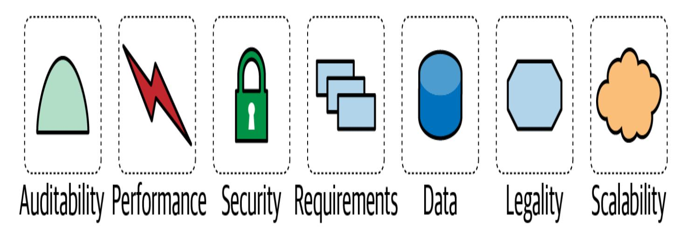
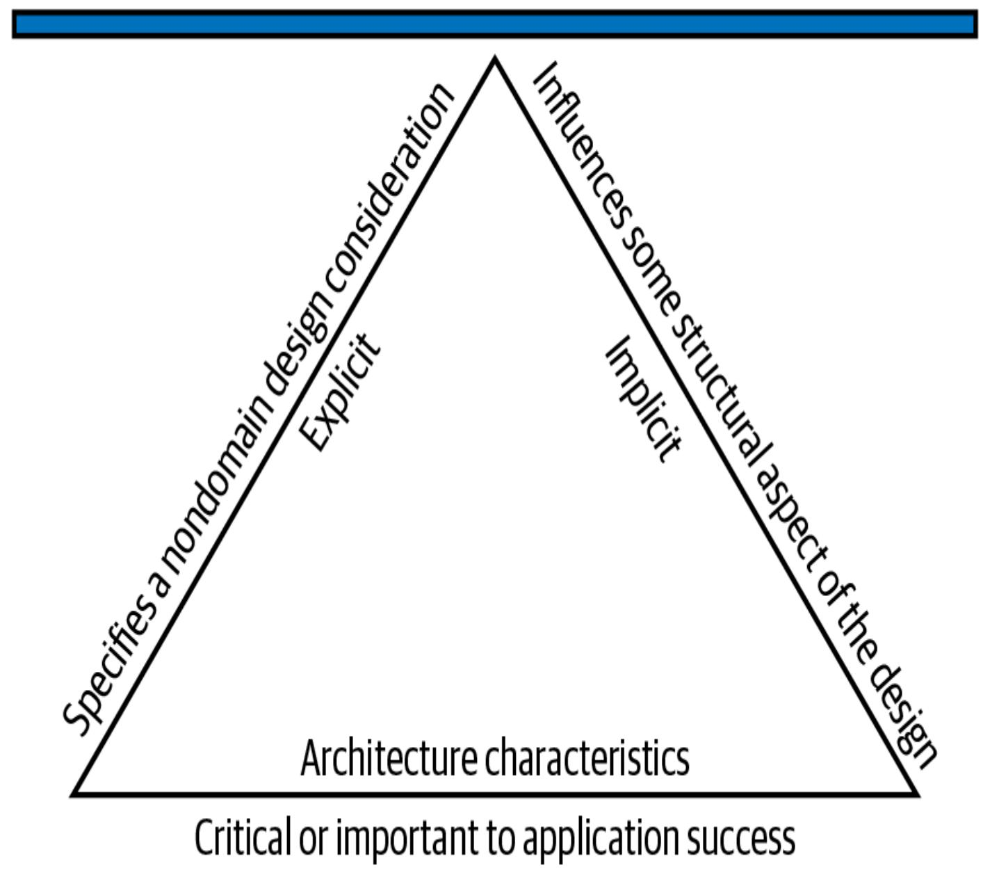

## Kapitel 4. Architektonische Merkmale definiert

Diese Arbeit wurde mithilfe von KI übersetzt. Wir freuen uns über dein Feedback und deine Kommentare: [translation-feedback@oreilly.com](mailto:translation-feedback@oreilly.com)

Wir befassen uns nun mit den Details des strukturellen Entwurfs, einer der wichtigsten Aufgaben von Softwarearchitekten. Dieser besteht hauptsächlich aus zwei Tätigkeiten: der *Analyse der architektonischen Merkmale*, die in diesem Kapitel behandelt wird, und dem *Entwurf der logischen Komponenten*, der in [Kapitel](#page--1-0) 8 behandelt wird. Architekten können diese beiden Tätigkeiten in beliebiger Reihenfolge (oder sogar parallel) durchführen, aber sie treffen an einem entscheidenden Punkt zusammen.

Wenn ein Unternehmen beschließt, ein bestimmtes Problem mit Hilfe von Software zu lösen, stellt es eine Liste von Anforderungen an das System zusammen (es gibt viele Techniken, um sie zu ermitteln, wie in [Kapitel](#page--1-0) 8 beschrieben). Wir werden diese Anforderungen im weiteren Verlauf des Buches als *Problemdomäne* (oder einfach als *Domäne*) bezeichnen. In [Kapitel](#page--1-0) 1 hast du gelernt, dass *die Architekturmerkmale* die wichtigen Aspekte eines Systems sind, die unabhängig von der Problemdomäne sind und für den Erfolg des Systems wichtig sind. In diesem Kapitel werden wir den Begriff "Architektur" genauer definieren und uns mit den spezifischen Architekturmerkmalen beschäftigen.

Architekten arbeiten oft an der Definition der Domäne mit, müssen aber auch all die Dinge definieren, entdecken und analysieren, die die Software tun muss, die nicht direkt mit der Funktionalität der Domäne zu tun haben: *architektonische Merkmale*. Die Rolle des Architekten bei der Definition der architektonischen Merkmale ist ein Teil dessen, was Softwarearchitektur von Programmierung und Design unterscheidet. Beim Entwurf einer Softwarelösung müssen sie auch viele andere Faktoren berücksichtigen, wie in [Abbildung](#page-1-0) 4-1 dargestellt.

Abbildung 4-1. Eine Softwarelösung besteht sowohl aus fachlichen Anforderungen als auch aus Architekturmerkmalen

#### **DIE LANGLEBIGKEIT DES BEGRIFFS "NICHT-FUNKTIONALE ANFORDERUNGEN"**

Viele Unternehmen beschreiben architektonische Merkmale mit einer Vielzahl von Begriffen, darunter auch *nicht-funktionale Anforderungen*, ein Begriff, der geschaffen wurde, um architektonische Merkmale von *funktionalen Anforderungen* zu unterscheiden. Wir mögen diesen Begriff nicht, weil er sich selbst verunglimpft und sich sprachlich negativ auswirkt: Wie kann man Teams davon überzeugen, etwas "nichtfunktionalem" genügend Aufmerksamkeit zu schenken? Ein anderer beliebter Begriff ist *Qualitätsattribute*, den wir nicht mögen, weil er eher eine nachträgliche Qualitätsbewertung als eine Planung impliziert.

Wir bevorzugen den Begriff der *architektonischen Merkmale*, weil er die Belange beschreibt, die für den Erfolg der Architektur und damit des Systems als Ganzes entscheidend sind, ohne die Bedeutung dieser Belange zu schmälern. In *Head First Software Architecture* [\(O'Reilly, 2024\)](https://www.oreilly.com/library/view/head-first-software/9781098134341) bezeichnen wir die architektonischen Merkmale als die *Fähigkeiten* des Systems; im Gegensatz dazu steht die Domäne für das *Verhalten* des Systems.

Manchmal bleiben Begriffe "hängen", und *nicht-funktionale Anforderungen* scheinen unter Softwarearchitekten ein besonders heikles Thema zu sein. In vielen Unternehmen ist er immer noch üblich. Der Begriff tauchte erstmals Ende der 1970er Jahre in der Literatur zur Softwareentwicklung auf, etwa zur gleichen Zeit wie die *Funktionspunktanalyse*, eine Schätztechnik, bei der die Systemanforderungen in "Funktionspunkte" zerlegt werden, die jeweils eine Arbeitseinheit darstellen. Theoretisch konnten die Teams am Ende

des Analyseprozesses alle Funktionspunkte zusammenzählen und so einen gewissen Einblick in das Projekt gewinnen. Leider bot diese Methode zwar einen Anschein von Sicherheit, war aber wie viele andere Schätzverfahren auch von Subjektivität geprägt und wird daher nicht mehr verwendet.

Eine Erkenntnis aus dieser Zeit ist jedoch geblieben: Ein Großteil des Aufwands bei der Entwicklung eines Systems bezieht sich auf die *Fähigkeiten* des Systems und nicht auf seine Anforderungen. Sie nannten diese Bemühungen *"non-function points"*, was dazu führte, dass sich der Begriff *"non-functional requirements"* durchsetzte.

## Architektonische Merkmale und Systemdesign

Um als Architekturmerkmal zu gelten, muss eine Anforderung drei Kriterien erfüllen. Sie muss einen bereichsfremden Entwurfsaspekt spezifizieren, einen strukturellen Aspekt des Entwurfs beeinflussen *und* kritisch oder wichtig für den Erfolg der Anwendung sein. Diese ineinander greifenden Teile unserer Definition sind in [Abbildung](#page-4-0) 4-2 dargestellt, die aus diesen drei Komponenten und einigen Modifikatoren besteht.

Abbildung 4-2. Die Unterscheidungsmerkmale der architektonischen Merkmale

Schauen wir uns diese Komponenten genauer an:

*Ein Architekturmerkmal spezifiziert eine Designüberlegung, die nicht zur Domäne gehört.*

Der strukturelle Entwurf in der Softwarearchitektur besteht aus zwei Aktivitäten eines Architekten: dem Verstehen der Problemdomäne

und dem Herausfinden, welche Arten von Fähigkeiten das System unterstützen muss, um erfolgreich zu sein. Die Überlegungen zum Domänenentwurf betreffen das Verhalten des Systems, und die Architekturmerkmale definieren die Fähigkeiten.

Zusammengenommen definieren diese beiden Tätigkeiten den strukturellen Entwurf.

Während die Entwurfsanforderungen festlegen *, was* die Anwendung tun soll, geben die architektonischen Merkmale an, *wie* die Anforderungen umgesetzt werden sollen und *warum* bestimmte Entscheidungen getroffen wurden: kurz gesagt, die Betriebs- und Entwurfskriterien für den Erfolg des Projekts.

Zum Beispiel sind bestimmte Leistungsniveaus oft ein wichtiges architektonisches Merkmal, werden aber in den Anforderungsdokumenten oft nicht erwähnt. Noch wichtiger ist, dass in keinem Anforderungsdokument steht, dass ein Entwurf "technische Schulden verhindern" muss, aber es ist ein gängiger Entwurfsaspekt. Wir behandeln diese Unterscheidung zwischen expliziten und impliziten Merkmalen ausführlich in "Extracting Architectural [Characteristicsfrom](#page--1-1) Domain Concerns".

*Ein Architekturmerkmal beeinflusst einen strukturellen Aspekt des Entwurfs.*

Der Hauptgrund, warum Architekten versuchen, architektonische Merkmale bei Projekten zu beschreiben, ist, dass sie wichtige gestalterische Überlegungen herausfinden wollen. Kann der Architekt es mit Hilfe des Entwurfs umsetzen, oder erfordert dieses

architektonische Merkmal besondere *bauliche* Überlegungen, um erfolgreich zu sein?

Zum Beispiel ist die Sicherheit bei praktisch jedem Projekt ein Thema, und alle Systeme müssen bei der Entwicklung und Programmierung bestimmte grundlegende Vorkehrungen treffen. Sicherheit wird jedoch zu einem architektonischen Merkmal, wenn der Architekt entscheidet, dass die Architektur eine besondere Struktur braucht, um sie zu unterstützen.

Betrachte zwei gemeinsame Merkmale der Architektur: Sicherheit und Skalierbarkeit. Architekten können die Sicherheit in einem monolithischen System durch eine gute Kodierungshygiene gewährleisten, einschließlich bekannter Techniken wie Verschlüsselung, Hashing und Salting. (Architektonische Fitnessfunktionen, die ebenfalls unter diesen Begriff fallen, werden in [Kapitel](#page--1-0) 6 behandelt.) In einer verteilten Architektur wie Microservices hingegen würde der Architekt einen gehärteten Dienst mit strengeren Zugriffsprotokollen aufbauen - ein struktureller Ansatz. Architekten können die Sicherheit also entweder über das Design oder die Struktur berücksichtigen. Andererseits sollte man die Skalierbarkeit bedenken: Eine monolithische Architektur lässt sich auch durch noch so cleveres Design nicht über einen bestimmten Punkt hinaus skalieren. Ab diesem Punkt muss das System auf eine verteilte Architektur umgestellt werden.

Architekten achten sehr auf betriebliche architektonische Merkmale (siehe "Betriebliche [architektonische](#page-8-0) Merkmale"), weil diese

Merkmale am häufigsten eine besondere bauliche Unterstützung erfordern.

*Ein Architekturmerkmal muss für den Erfolg der Anwendung entscheidend oder wichtig sein.*

Anwendungen *können* eine Vielzahl von architektonischen Merkmalen unterstützen... aber das sollten sie nicht. Jedes architektonische Merkmal, das ein System unterstützt, erhöht die Komplexität seines Designs. Deshalb sollten sich Architekten bemühen, so *wenige* Architekturmerkmale wie möglich zu wählen, anstatt so viele wie möglich.

Wir unterteilen Architekturmerkmale in implizite und explizite Architekturmerkmale. Implizite Merkmale tauchen selten in den Anforderungen auf, sind aber für den Erfolg des Projekts notwendig. Verfügbarkeit, Zuverlässigkeit und Sicherheit sind die Grundlage fast aller Anwendungen, werden aber nur selten in den Entwurfsunterlagen erwähnt. Architekten müssen ihr Wissen über die Problemdomäne nutzen, um diese architektonischen Merkmale während der Analysephase aufzudecken. Ein Unternehmen, das im Hochfrequenzhandel tätig ist, muss zum Beispiel nicht in jedem System eine niedrige Latenzzeit angeben, weil die Architekten in diesem Problembereich bereits wissen, wie wichtig sie ist. Explizite architektonische Merkmale erscheinen in Anforderungsdokumenten oder anderen spezifischen Anweisungen.

In [Abbildung](#page-4-0) 4-2 ist die Wahl des Dreiecks beabsichtigt: Jedes der Definitionselemente unterstützt die anderen, die wiederum das

Gesamtdesign des Systems unterstützen. Der durch das Dreieck geschaffene Drehpunkt verdeutlicht, wie diese architektonischen Merkmale oft miteinander interagieren. Deshalb verwenden Architekten so oft den Begriff *Kompromiss*.

## Architektonische Merkmale (Teilweise) Aufgeführt

Architektureigenschaften gibt es in einem breiten Spektrum von Komplexität, das von Low-Level-Code-Merkmalen (wie Modularität) bis hin zu anspruchsvollen betrieblichen Belangen (wie Skalierbarkeit und Elastizität) reicht. Es gibt keinen wirklich universellen Standard, auch wenn man versucht hat, einen zu kodifizieren. Stattdessen interpretiert jede Organisation diese Begriffe für sich selbst. Da sich das Software-Ökosystem so schnell verändert, tauchen ständig neue Konzepte, Begriffe, Maßnahmen und Überprüfungen auf, die neue Möglichkeiten zur Definition von Architekturmerkmalen bieten.

Obwohl es aufgrund der schieren Menge und Breite der Architekturmerkmale schwierig ist, sie zu quantifizieren, kategorisieren Architekten sie. In den folgenden Abschnitten werden einige dieser groben Kategorien beschrieben und einige Beispiele angeführt.

#### **Operative architektonische Merkmale**

Operative Architekturmerkmale umfassen Fähigkeiten wie Leistung, [Skalierbarkeit, Elastizität, Verfügbarkeit](#page-10-0) und Zuverlässigkeit. In Tabelle 4-1 sind einige operative Architektureigenschaften aufgeführt.

Tabelle 4-1. Gemeinsame operative Architekturmerkmale

| Begriff       | Definition                                                                                                                                                                                                                                                                           |
|---------------|--------------------------------------------------------------------------------------------------------------------------------------------------------------------------------------------------------------------------------------------------------------------------------------|
| Verfügbarkeit | Wie lange muss das System verfügbar sein? Wenn es sich um einen 24/7-Betrieb handelt, müssen Maßnahmen ergriffen werden, damit das System im Falle eines Ausfalls schnell wieder einsatzbereit ist. |
| Kontinuität   | Die Disaster-Recovery-Fähigkeit des Systems.                                                                                                                                                                                                                                |
| Leistung      | Wie gut das System funktioniert; Möglichkeiten, dies zu messen, sind Stresstests, Spitzenwertanalysen, Analysen der Häufigkeit der verwendeten Funktionen und Reaktionszeiten.                                                       |

| Begriff                    | Definition                                                                                                                                                                                                                                                                                                                       |
|----------------------------|----------------------------------------------------------------------------------------------------------------------------------------------------------------------------------------------------------------------------------------------------------------------------------------------------------------------------------|
| Wiederherstellbarkeit      | Anforderungen an die Geschäftskontinuität: Wie schnell muss das System im Katastrophenfall wieder online kommen. Dazu gehören Backup Strategien und Anforderungen an Ersatzhardware.                                                                                 |
| Verlässlichkeit/Sicherheit | Ob das System fehlschlagsicher sein muss oder ob es in einer Weise unternehmenskritisch ist, die Leben beeinflusst. Wenn es fehlschlägt, wird es das Unternehmen viel Geld kosten? Das ist oft ein Spektrum und keine Binärzahl. |
| Robustheit                 | Die Fähigkeit des Systems, im laufenden Betrieb mit Fehlern und Randbedingungen umzugehen, z. B. wenn die Internetverbindung oder die Stromversorgung fehlschlägt.                                                                                                            |

| Begriff        | Definition                                                                                                                    |
|----------------|-------------------------------------------------------------------------------------------------------------------------------|
| Skalierbarkeit | Die Fähigkeit des Systems, bei steigender Anzahl von Nutzern oder Anfragen zu funktionieren. |

Die Merkmale der betrieblichen Architektur überschneiden sich stark mit den Belangen von Betrieb und DevOps.

#### **Strukturelle architektonische Merkmale**

Architekten sind für die richtige Codestruktur verantwortlich. In vielen Fällen ist der Architekt allein oder mitverantwortlich für die Qualität des Codes, einschließlich seiner Modularität, seiner Lesbarkeit, der Kontrolle der Kopplung zwischen den Komponenten, der Lesbarkeit des Codes und einer Vielzahl anderer interner Qualitätsbewertungen. In [Tabelle](#page-13-0) 4-2 sind einige strukturelle Architekturmerkmale aufgeführt.

Tabelle 4-2. Strukturelle architektonische Merkmale

| Begriff                      | Definition                                                                                                                                               |
|------------------------------|----------------------------------------------------------------------------------------------------------------------------------------------------------|
| Konfigurierbarkeit           | Wie einfach können Endnutzer/innen Aspekte der Softwarekonfiguration über Schnittstellen ändern.                              |
| Erweiterbarkeit              | Wie gut sich die Architektur an Änderungen anpassen lässt, die die bestehenden Funktionen erweitern.                 |
| Installierbarkeit            | Wie einfach es ist, das System auf allen notwendigen Plattformen zu installieren.                                          |
| Nutzbarkeit/Wiederverwendung | Das Ausmaß, in dem die gemeinsamen Komponenten des Systems über mehrere Produkte hinweg genutzt werden können. |

| Begriff            | Definition                                                                                                                                     |
|--------------------|------------------------------------------------------------------------------------------------------------------------------------------------|
| Lokalisierung      | Unterstützung für mehrere Sprachen auf Eingabe-/Abfragebildschirmen in Datenfeldern.                                      |
| Instandhaltbarkeit | Wie einfach es ist, Änderungen vorzunehmen und das System zu verbessern.                                         |
| Tragbarkeit        | Die Fähigkeit des Systems, auf mehr als einer Plattform zu laufen (z. B. Oracle und SAP DB).            |
| Aufrüstbarkeit     | Wie einfach und schnell es ist, auf eine neuere Version auf Servern und Clients zu aktualisieren. |

#### **Merkmale der Wolke**

Das Ökosystem der Softwareentwicklung verändert und entwickelt sich ständig weiter; das jüngste hervorragende Beispiel ist die Ankunft der Cloud. Als die erste Ausgabe veröffentlicht wurde, gab es Cloud-Computing zwar schon, aber es war noch nicht weit verbreitet. Heute haben die meisten Systeme zumindest in gewissem Umfang mit Cloudbasierten Systemen zu tun. Ein paar dieser [Überlegungen](#page-16-0) sind in Tabelle 4-3 aufgeführt.

Tabelle 4-3. Architektonische Merkmale des Cloud-Providers

| Begriff                                        | Definition                                                                                                                                                                                                                                                                                                                                                                                                                   |
|------------------------------------------------|------------------------------------------------------------------------------------------------------------------------------------------------------------------------------------------------------------------------------------------------------------------------------------------------------------------------------------------------------------------------------------------------------------------------------|
| Skalierbarkeit nach Bedarf               | Die Fähigkeit des Cloud-Providers, Ressourcen dynamisch und bedarfsgerecht zu skalieren.                                                                                                                                                                                                                                                                                                             |
| Elastizität nach Bedarf                  | Die Flexibilität des Cloud-Providers, wenn der Ressourcenbedarf steigt; ähnlich wie die Skalierbarkeit.                                                                                                                                                                                                                                                                                        |
| Zonenbasierte Verfügbarkeit                 | Die Fähigkeit des Cloud-Providers, Ressourcen nach Rechenzonen zu trennen, um die Ausfallsicherheit der Systeme zu erhöhen.                                                                                                                                                                                                                                                           |
| Regionaler Datenschutz und Sicherheit | Die rechtliche Möglichkeit des Cloud-Providers, Daten aus verschiedenen Ländern und Regionen zu speichern. In vielen Ländern gibt es Gesetze, die regeln, wo die Daten ihrer Bürgerinnen und Bürger gespeichert werden dürfen (und die oft die Speicherung von Daten außerhalb ihrer Region einschränken). |

In der zweiten Auflage dieses Buches haben wir jedem Kapitel über Architekturstile einen Abschnitt hinzugefügt, in dem beschrieben wird, wie der jeweilige StilCloud-Überlegungen unterstützt und erleichtert.

### **Übergreifende architektonische Merkmale**

Während sich viele architektonische Merkmale in leicht erkennbare Kategorien einordnen lassen, gibt es andere, die sich einer Kategorisierung entziehen und dennoch wichtige gestalterische Einschränkungen und Überlegungen darstellen. [Tabelle](#page-18-0) 4-4 beschreibt einige dieser Merkmale.

Tabelle 4-4. Übergreifende Architekturmerkmale

| Begriff           | Definition                                                                                                                                                                                |
|-------------------|-------------------------------------------------------------------------------------------------------------------------------------------------------------------------------------------|
| Zugänglichkeit    | Wie leicht können alle Nutzer/innen auf das System zugreifen, einschließlich derer mit Behinderungen wie Farbenblindheit oder Hörverlust. |
| Archivierbarkeit  | Die Beschränkungen des Systems für die Archivierung oder Löschung von Daten nach einem bestimmten Zeitraum.                                     |
| Authentifizierung | Sicherheitsanforderungen, um sicherzustellen, dass die Nutzer die sind, die sie vorgeben zu sein.                                                           |

| Begriff       | Definition                                                                                                                                                                                                                                                       |
|---------------|------------------------------------------------------------------------------------------------------------------------------------------------------------------------------------------------------------------------------------------------------------------|
| Autorisierung | Sicherheitsanforderungen, um sicherzustellen, dass Benutzer nur auf bestimmte Funktionen innerhalb der Anwendung zugreifen können (nach Anwendungsfall, Subsystem, Webseite, Geschäftsregel, Feldebene usw.). |

# **Begriff Definition**

Legal Die gesetzlichen Rahmenbedingungen, unter denen das System arbeitet, wie z.B. Datenschutzgesetze wie GDPR oder Gesetze zu Finanzdaten wie Sarbanes-Oxley in den USA, oder Vorschriften zur Art und Weise, wie die Anwendung entwickelt oder eingesetzt werden soll. Dazu gehört auch, welche Vorbehaltsrechte

Datenschutz Die Fähigkeit des Systems, Transaktionen zu verschlüsseln und vor unternehmensinternen

und Netzwerkarchitekten,

Mitarbeitern, sogar DBAs

zu verbergen.

das Unternehmen

benötigt.

| Begriff           | Definition                                                                                                                                                                                                                                                                                     |
|-------------------|------------------------------------------------------------------------------------------------------------------------------------------------------------------------------------------------------------------------------------------------------------------------------------------------|
| Sicherheit        | Regeln und Beschränkungen für die Verschlüsselung in der Datenbank oder für die Netzwerkkommunikation zwischen internen Systemen; Authentifizierung für den Fernzugriff von Benutzern und andere Sicherheitsmaßnahmen. |
| Unterstützbarkeit | Das Maß an technischer Unterstützung, das die Anwendung benötigt; inwieweit sind Protokollierung und andere Einrichtungen erforderlich, um Fehler im System zu beheben.                                                               |

| Begriff                               | Definition                                                                                                                                       |
|---------------------------------------|--------------------------------------------------------------------------------------------------------------------------------------------------|
| Benutzerfreundlichkeit/Erreichbarkeit | Das Maß an Schulung, das die Nutzer/innen benötigen, um ihre Ziele mit der Anwendung/Lösung zu erreichen. |

Jede Liste von architektonischen Merkmalen ist zwangsläufig unvollständig; jedes Softwareprojekt kann auf der Grundlage einzigartiger Faktoren architektonische Merkmale erfinden. Viele der Begriffe, die wir gerade aufgelistet haben, sind unpräzise und mehrdeutig, manchmal aufgrund von feinen Nuancen oder einem Mangel an objektiven Definitionen. *Interoperabilität* und *Kompatibilität* zum Beispiel scheinen gleichbedeutend zu sein, und für manche Systeme trifft das auch zu. Sie unterscheiden sich jedoch, weil *Interoperabilität* eine einfache Integration mit anderen Systemen voraussetzt, was wiederum veröffentlichte, dokumentierte APIs voraussetzt. Bei der *Kompatibilität* hingegen geht es eher um Branchenund Domänenstandards. Ein weiteres Beispiel ist die *Lernfähigkeit*: Eine Definition besagt, "wie leicht es für die Nutzer/innen ist, die Nutzung der Software zu erlernen", eine andere, "wie weit das System automatisch über seine Umgebung lernen kann, um sich mithilfe von maschinellen Lernalgorithmen selbst zu konfigurieren oder zu optimieren".

Viele Definitionen überschneiden sich: *Verfügbarkeit* und *Zuverlässigkeit* zum Beispiel. Aber betrachte das Internetprotokoll IP, das TCP zugrunde liegt. IP ist *verfügbar*, aber nicht *zuverlässig*: Pakete können in der falschen Reihenfolge ankommen, und der Empfänger muss fehlende Pakete möglicherweise erneut anfordern.

Es gibt keine vollständige Liste von Normen, die diese Kategorien definieren. Die Internationale Organisation für Normung (ISO) veröffentlicht eine nach [Fähigkeiten](https://oreil.ly/SKc_Y) geordnete Liste, die sich mit unserer Liste hier überschneidet, aber hauptsächlich eine unvollständige Kategorieliste erstellt. Hier sind einige der ISO-Definitionen, die umformuliert wurden, um die Begriffe zu aktualisieren und Kategorien hinzuzufügen, damit sie den modernen Anforderungen gerecht werden:

#### *Leistungseffizienz*

Maß für die Leistung im Verhältnis zur Menge der verwendeten Ressourcen unter bekannten Bedingungen. Dazu gehören das *Zeitverhalten* (Maß für Reaktions-, Verarbeitungszeiten und/oder Durchsatzraten), die *Ressourcennutzung* (Menge und Art der verwendeten Ressourcen) und die *Kapazität* (Grad der Überschreitung der festgelegten Höchstgrenzen).

#### *Kompatibilität*

Grad, in dem ein Produkt, ein System oder eine Komponente Informationen mit anderen Produkten, Systemen oder Komponenten austauschen und/oder seine erforderlichen Funktionen ausführen kann, während es dieselbe Hardware- oder Softwareumgebung nutzt.

Dazu gehören *Koexistenz* (kann seine erforderlichen Funktionen effizient ausführen, während es eine gemeinsame Umgebung und Ressourcen mit anderen Produkten teilt) und *Interoperabilität* (Grad, in dem zwei oder mehr Systeme Informationen austauschen und nutzen können).

#### *Benutzerfreundlichkeit*

Die Nutzer können das System effektiv, effizient und zufriedenstellend für den vorgesehenen Zweck nutzen. Dazu gehören die *Erkennbarkeit der Angemessenheit* (die Nutzer können erkennen, ob die Software für ihre Bedürfnisse geeignet ist), die *Erlernbarkeit* (wie leicht die Nutzer die Nutzung der Software erlernen können), der *Schutz vor Benutzerfehlern* und die *Zugänglichkeit* (die Software muss für Menschen mit den unterschiedlichsten Eigenschaften und Fähigkeiten zugänglich sein).

#### *Verlässlichkeit*

Grad, in dem ein System unter bestimmten Bedingungen für einen bestimmten Zeitraum funktioniert. Dieses Merkmal umfasst Unterkategorien wie *Reife* (erfüllt die Software die Anforderungen an die Zuverlässigkeit im Normalbetrieb), *Verfügbarkeit* (ist die Software einsatzfähig und zugänglich), *Fehlertoleranz* (funktioniert die Software trotz Hardware- oder Softwarefehlern wie vorgesehen) und *Wiederherstellbarkeit* (kann die Software nach einem Ausfall alle betroffenen Daten wiederherstellen und den gewünschten Zustand des Systems wiederherstellen).

#### *Sicherheit*

Grad, in dem die Software Informationen und Daten so schützt, dass Menschen oder andere Produkte oder Systeme den ihrer Art und Berechtigung entsprechenden Grad an Datenzugriff haben. Zu dieser Familie von Merkmalen gehören *Vertraulichkeit* (Daten sind nur denjenigen zugänglich, die dazu berechtigt sind), *Integrität* (die Software verhindert den unbefugten Zugriff auf oder die Veränderung von Software oder Daten), *Unverfälschbarkeit* (es kann nachgewiesen werden, dass Aktionen oder Ereignisse stattgefunden haben), *Nachvollziehbarkeit* (die Aktionen eines Benutzers können zurückverfolgt werden) und *Authentizität* (Nachweis der Identität eines Benutzers).

#### *Instandhaltbarkeit*

Steht für den Grad der Effektivität und Effizienz, mit dem Entwickler die Software verändern können, um sie zu verbessern, zu korrigieren oder an veränderte Umgebungen und/oder Anforderungen anzupassen. Zu diesem Merkmal gehören die *Modularität* (der Grad, zu dem die Software aus einzelnen Komponenten besteht), die *Wiederverwendbarkeit* (der Grad, zu dem Entwickler ein Asset in mehr als einem System oder bei der Erstellung anderer Assets verwenden können), die *Analysierbarkeit* (wie leicht Entwickler konkrete Metriken über die Software sammeln können), die *Modifizierbarkeit* (der Grad, zu dem Entwickler die Software verändern können, ohne Fehler einzuführen oder die bestehende Produktqualität zu verschlechtern) und die *Testbarkeit* (wie leicht Entwickler und andere die Software testen können).

#### *Tragbarkeit*

Grad, in dem Entwickler ein System, ein Produkt oder eine Komponente von einer Hardware-, Software- oder anderen Betriebsoder Nutzungsumgebung auf eine andere übertragen können. Dieses Merkmal umfasst die Untermerkmale *Anpassungsfähigkeit* (können Entwickler die Software effektiv und effizient an unterschiedliche oder sich entwickelnde Hardware-, Software- oder andere Betriebsoder Nutzungsumgebungen anpassen), *Installierbarkeit* (kann die Software in einer bestimmten Umgebung installiert und/oder deinstalliert werden) und *Ersetzbarkeit* (wie leicht können Entwickler die Funktionalität durch andere Software ersetzen).

Der letzte Punkt in der ISO-Liste befasst sich mit den funktionalen Aspekten der Software:

#### *Funktionale Eignung*

Dieses Merkmal gibt an, inwieweit ein Produkt oder System Funktionen bereitstellt, die den angegebenen und implizierten Bedürfnissen entsprechen, wenn es unter bestimmten Bedingungen verwendet wird. Dieses Merkmal setzt sich aus den folgenden Untermerkmalen zusammen:

#### *Funktionale Vollständigkeit*

Grad, in dem die Menge der Funktionen alle festgelegten Aufgaben und Nutzerziele abdeckt.

#### *Funktionale Korrektheit*

Grad, in dem ein Produkt oder System die richtigen Ergebnisse mit dem erforderlichen Maß an Präzision liefert.

*Funktionale Angemessenheit*

Das Ausmaß, in dem die Funktionen das Erreichen der festgelegten Aufgaben und Ziele erleichtern.

Wir sind jedoch der Meinung, dass die funktionale Eignung nicht in diese Liste gehört. Sie beschreibt keine architektonischen Merkmale, sondern eher die motivierenden Anforderungen für die Erstellung der Software. Dies verdeutlicht, wie sich das Denken über die Beziehung zwischen architektonischen Merkmalen und der Problemdomäne entwickelt hat. Auf diese Entwicklung gehen wir in [Kapitel](#page--1-0) 7 ein.

#### **DIE VIELEN ZWEIDEUTIGKEITEN IN DER SOFTWAREARCHITEKTUR**

Eine Quelle ständiger Frustration unter Architekten ist der Mangel an klaren Definitionen für so viele wichtige Dinge, einschließlich der Tätigkeit der Softwarearchitektur selbst! Das Fehlen eines Standards führt dazu, dass Unternehmen ihre eigenen Begriffe für alltägliche Dinge definieren. Das führt oft zu einer branchenweiten Verwirrung, weil Architekten entweder undurchsichtige Begriffe verwenden oder, was noch schlimmer ist, die gleichen Begriffe für völlig unterschiedliche Bedeutungen.

So sehr wir uns auch bemühen würden, wir können der Welt der Softwareentwicklung keine Standardnomenklatur aufzwingen. Um jedoch terminologische Missverständnisse zu vermeiden, rät Domain-Driven Design den Unternehmen, eine einheitliche *Sprache* unter den Mitarbeitern einzuführen und zu verwenden. Wir folgen diesem Rat und empfehlen.

## Kompromisse und Least Worst Architecture

Wir haben bereits gesagt, dass Architekten nur die Architekturmerkmale unterstützen sollten, die für den Erfolg des Systems kritisch oder wichtig sind. Systeme können aus verschiedenen Gründen nur einige der von uns aufgeführten architektonischen Merkmale unterstützen. Erstens ist die Unterstützung für ein Architekturmerkmal selten kostenlos. Jedes

unterstützte Merkmal erfordert einen Entwurfsaufwand des Architekten, einen Aufwand für die Entwickler, um es zu implementieren und zu pflegen, und vielleicht auch strukturelle Unterstützung.

Zweitens sind die architektonischen Merkmale synergetisch miteinander *und mit* dem Problembereich verbunden. So sehr wir uns auch etwas anderes wünschen würden, jedes Designelement steht in Wechselwirkung mit allen anderen. Wenn wir z. B. die *Sicherheit* verbessern, wird sich das mit ziemlicher Sicherheit negativ auf die *Leistung* auswirken: Die Anwendung muss mehr fliegende Verschlüsselung, Umwege (zum Verstecken von Geheimnissen) und andere Aktivitäten durchführen, die die Leistung beeinträchtigen können. Flugzeugpiloten haben oft Schwierigkeiten, wenn sie das Fliegen von Hubschraubern lernen, die für jede Hand und jeden Fuß eine Steuerung haben. Die Änderung eines Steuerelements wirkt sich auf alle anderen aus, weil sie synergetisch sind. Das Fliegen eines Hubschraubers ist eine Balanceübung, die den Prozess des Kompromisses bei der Auswahl von Architekturmerkmalen gut beschreibt; sie stehen in ähnlicher Weise in Synergie mit anderen Architekturmerkmalen und dem Domänendesign: Die Änderung eines Merkmals zieht oft die Änderung eines anderen nach sich. Wie unser geübter Hubschrauberpilot müssen auch Architekten lernen, mit ineinandergreifenden Elementen zu jonglieren.

Drittens bedeutet das Fehlen von Standarddefinitionen für architektonische Merkmale, dass die Unternehmen mit Mehrdeutigkeit zu kämpfen haben, wie bereits erwähnt. Zwar wird die Branche niemals eine unveränderliche Liste von Architekturmerkmalen erstellen können (weil ständig neue auftauchen), aber jedes Unternehmen kann seine eigene Liste (oder allgemeingültige *Sprache*) mit objektiven Definitionen erstellen.

Schließlich nimmt nicht nur die Zahl der architektonischen Merkmale ständig zu, sondern auch die Zahl der *Kategorien* hat in den letzten zehn Jahren zugenommen. Vor ein paar Jahrzehnten kümmerten sich Architekten zum Beispiel wenig um betriebliche Belange, die als separate "Blackbox" betrachtet wurden. Mit der zunehmenden Beliebtheit von Architekturen wie Microservices müssen Architekten und Betrieb jedoch immer intensiver und häufiger zusammenarbeiten. Je komplexer die Softwarearchitektur wird, desto mehr verstrickt sie sich mit anderen Bereichen des Unternehmens.

Daher ist es für Architekten sehr selten möglich, ein System zu entwerfen und jedes einzelne architektonische Merkmal zu optimieren. Meistens geht es darum, Kompromisse zwischen mehreren konkurrierenden Anliegen zu finden.

#### **TIPP**

Strebe nie nach der *besten* Architektur, sondern nach der *am wenigsten schlechten*Architektur.

Der Versuch, zu viele architektonische Merkmale zu unterstützen, führt zu generischen Lösungen, die versuchen, jedes Geschäftsproblem zu

lösen. Das Design wird schnell unhandlich, so dass solche Architekturen selten funktionieren.

Bemühe dich, eine möglichst iterative Architektur zu entwerfen. Je einfacher es ist, die Architektur zu ändern, desto weniger muss sich jeder darum bemühen, beim ersten Versuch genau das Richtige zu finden. Eine der wichtigsten Lehren der Agilen Softwareentwicklung ist der Wert der Iteration; das gilt für alle Ebenen der Softwareentwicklung, auch für die Architektur .