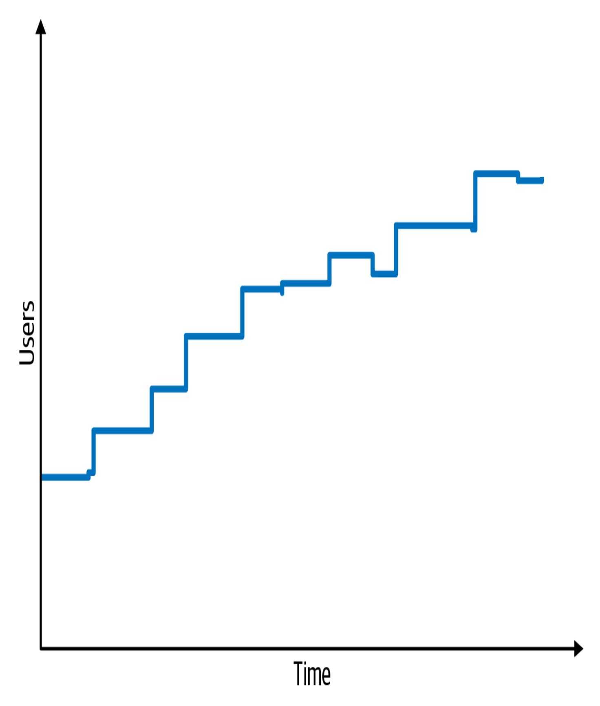
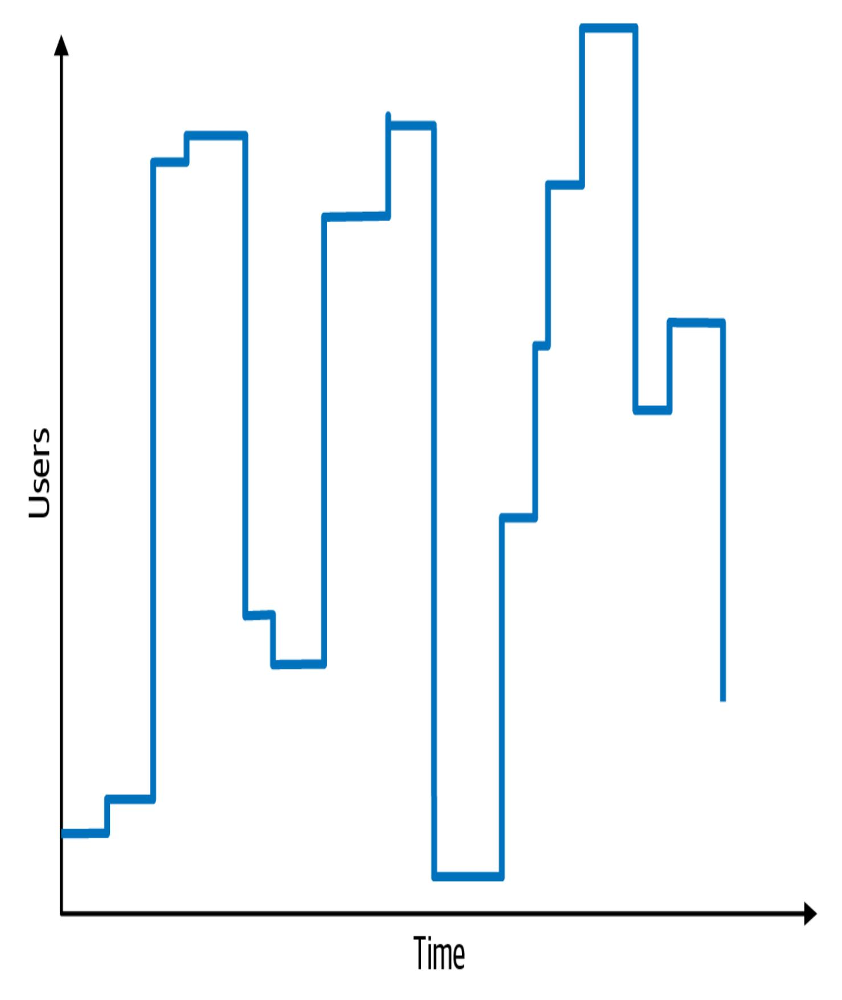

# 5장. 아키텍처 특성 식별 (Kapitel 5. Identifizierung architektonischer Merkmale)

이 작업은 AI를 활용하여 번역되었습니다. 여러분의 피드백과 의견을 환영합니다: [translation-feedback@oreilly.com](mailto:translation-feedback@oreilly.com)

아키텍처를 생성하거나 기존 아키텍처의 유효성을 결정하려면, 아키텍트는 두 가지를 분석해야 합니다: 아키텍처 속성과 도메인. [장(Kapitel)](#page--1-0) 4에서 배웠듯이, 특정 문제나 애플리케이션에 대한 올바른 아키텍처 특성("-ilities")을 결정하기 위해서는 도메인의 문제를 이해하는 것뿐만 아니라 이해관계자들과 협력하여 도메인 관점에서 실제로 중요한 것이 무엇인지 파악하는 것이 필요합니다.

프로젝트에 필요한 아키텍처 특성을 찾기 위한 최소 세 가지 접근점이 있습니다: 도메인 관심사, 프로젝트 요구사항, 그리고 여러분의 암묵적 도메인 지식. 보안과 모듈성과 같은 일반적인 암묵적 아키텍처 속성 외에도, 일부 영역에는 암묵적 아키텍처 속성이 있다는 것을 발견했습니다. 예를 들어, 진단 장비에서 읽어들이는 의료 소프트웨어에 작업하는 아키텍트는 데이터 무결성이 얼마나 중요한지, 그리고 메시지 손실의

결과가 무엇인지 이미 알아야 합니다. 이 영역에서 일하는 아키텍트는 데이터 무결성을 내면화하여, 그들이 설계하는 모든 솔루션에 암묵적으로 포함되도록 합니다.

# 도메인 관심사로부터 아키텍처 특성 추출 (Extrahieren von architektonischen Merkmalen aus Domain Concerns)

대부분의 아키텍처 특성은 가장 중요한 이해관계자들에게 귀를 기울이고 그들과 협력하여 비즈니스 관점에서 무엇이 중요한지 파악함으로써 발생합니다. 이것은 간단하게 들릴 수 있지만, 문제는 아키텍트와 이해관계자가 다른 언어를 사용한다는 것입니다. 아키텍트는 확장성(Skalierbarkeit), 상호운용성(Interoperabilität), 내결함성(Fehlertoleranz), 학습성(Lernfähigkeit), 가용성(Verfügbarkeit)에 대해 이야기하는 반면, 비즈니스 도메인 이해관계자는 인수합병, 사용자 만족도, 출시 시간, 경쟁 우위에 대해 이야기합니다. 문제는 아키텍트와 이해관계자가 번역 과정에서 길을 잃기 때문에 서로를 이해하지 못한다는 것입니다. 아키텍트는 사용자 만족도를 지원하는 아키텍처를 어떻게 만들어야 할지 모르고, 비즈니스 도메인 이해관계자는 아키텍트가 왜 애플리케이션의 가용성, 상호운용성, 학습성, 내결함성에 그렇게 집중하는지 이해하지 못합니다.

다행히도 도메인 관심사를 아키텍처 특성의 언어로 "번역"하는 것이 가능합니다. [표(Tabelle)](#page-3-0) 5-1은 가장 일반적인 도메인 관심사와 이를 지원하는 해당 "-ilities"를 보여줍니다. 아키텍트가 도메인의 주요 목표를 이해하면, 이러한 관심사를 "-ilities"로 번역할 수 있으며, 이는 올바르고 정당화 가능한 아키텍처 결정의 기초가 됩니다. 예를 들어, 출시 시간이 확장성보다 더 중요한가, 아니면 아키텍트가 내결함성, 보안 또는 성능에 집중해야 하는가? 아마도 시스템은 이러한 모든 속성의 조합이 필요할 것입니다.

표 5-1. 도메인 관심사를 아키텍처 특성으로 번역 (Tabelle 5-1. Übersetzen von Domänenbelangen in Architekturmerkmale)

| 도메인 관심사 (Bereich Sorge) | 아키텍처 특성 (Architektonische Merkmale) |
|-----------------------------------|----------------------------------------------------------------------------------------------------|
| 인수합병 (Fusionen und Übernahmen) | 상호운용성, 확장성, 적응성, 확장가능성 (Interoperabilität, Skalierbarkeit, Anpassbarkeit, Erweiterbarkeit) |
| 출시 시간 (Zeit bis zur Markteinführung) | 민첩성, 테스트성, 배포성 (Agilität, Testbarkeit, Einsatzfähigkeit) |
| 사용자 만족도 (Zufriedenheit der Nutzer) | 성능, 가용성, 내결함성, 테스트성, 배포성, 민첩성, 보안 (Leistung, Verfügbarkeit, Fehlertoleranz, Testbarkeit, Einsatzfähigkeit, Agilität, Sicherheit) |
| 경쟁 우위 (Wettbewerbsvorteil) | 민첩성, 테스트성, 배포성, 확장성, 가용성, 내결함성 (Agilität, Testbarkeit, Einsatzfähigkeit, Skalierbarkeit, Verfügbarkeit, Fehlertoleranz) |
| 시간 및 예산 (Zeit und Budget) | 단순성, 실행가능성 (Einfachheit, Machbarkeit) |

# 복합 아키텍처 특성 (Architektonische Merkmale von Verbundwerkstoffen)

비즈니스 관심사를 아키텍처 특성으로 번역할 때 흔한 함정은 잘못된 동치화, 예를 들어 *민첩성(Agilität)*을 *출시 시간(Markteinführungszeit)*과 동일시하는 것입니다. 민첩성은 *복합(composite)* 아키텍처 특성의 예입니다: 객관적인 정의가 없는 특성으로, 다른 측정 가능한 요소들로 구성됩니다. 민첩성에 대한 측정값은 없으므로, 아키텍트는 자문해야 합니다: 민첩성은 무엇으로 구성되는가? 이는 *배포성(Einsatzfähigkeit)*, *모듈성(Modularität)*, *테스트성(Testbarkeit)*과 같은 것들을 포함하며, 이 모든 것은 측정 가능합니다.

편의상 아키텍트가 복합물의 일부에만 집중하는 일반적인 행동 패턴이 발생합니다. 이것은 케이크 반죽에 밀가루를 넣는 것을 잊는 것과 같습니다. 예를 들어, 도메인 이해관계자는 이렇게 말할 수 있습니다: "규제 요구사항으로 인해 장 마감 시 펀드 가격을 제시간에 확정하는 것이 절대적으로 필요합니다.

비효율적인 아키텍트는 성능에만 배타적으로 집중함으로써 반응할 수 있는데, 이것이 도메인의 주요 초점인 것처럼 보이기 때문입니다. 그러나 이 접근법은 많은 이유로 실패할 것입니다:

- 시스템이 필요할 때 사용할 수 없다면 얼마나 빠른지는 중요하지 않습니다.
- 도메인이 성장하고 더 많은 펀드가 생성되면, 시스템은 장 마감 처리를 제시간에 완료하기 위해 확장 가능해야 합니다.
- 시스템은 사용 가능할 뿐만 아니라 신뢰할 수 있어야 하므로, 장 마감 시 펀드 가격이 계산될 때 충돌하지 않아야 합니다.

- 가격 결정이 85% 완료된 상태에서 시스템이 충돌하면 어떻게 되는가? 가격 결정이 중단된 곳에서 복구하고 계속할 수 있어야 합니다.
- 마지막으로, 시스템은 빠를 수 있지만, 펀드 가격도 올바르게 계산되는가?

따라서 성능 외에도 아키텍트는 가용성, 확장성, 신뢰성, 복구성, 검증가능성에도 주의를 기울여야 합니다.

많은 비즈니스 목표는 복합 아키텍처 특성으로 시작합니다. 이를 분해하고 결과 특성에 객관적인 정의를 제공하는 것은 아키텍트 작업의 일부입니다. (이것이 얼마나 중요한지는 [장(Kapitel)](#page--1-0) 6에서 볼 것입니다.)

# 아키텍처 특성 추출 (Architektonische Merkmale extrahieren)

대부분의 아키텍처 특성은 어떤 종류의 요구사항 문서에서 명시적인 진술로부터 나옵니다. 예를 들어, 도메인 관심사 목록에는 일반적으로 예상 사용자 수와 범위에 대한 명시적인 숫자가 포함됩니다. 다른 특성은 아키텍트의 본질적인 전문 지식에서 나옵니다(모든 아키텍트가 자신의 도메인을 알아야 하는 많은 이유 중 하나).

당신이 아키텍트이고 대학에서 강좌 등록을 위한 애플리케이션을 설계한다고 가정해 봅시다. 계산을 단순화하기 위해, 학교에 1,000명의 학생이 있고 등록에 10시간이 걸린다고 가정합니다. 학생들이 이 10시간에 걸쳐 균등하게 분산될 것이라고 가정하고 균등한 분포를 허용하는 시스템을 설계해야 할까요? 아니면 학생들의 습관과 성향에 대한 지식을 바탕으로 마지막 10분 안에 등록하려는 1,000명의 학생을 모두 처리할 수 있는 시스템을 개발해야 할까요?

학생들이 얼마나 전형적으로 미루는 경향이 있는지 아는 사람이라면 이 질문에 대한 답을 알고 있습니다! 이러한 세부사항은 요구사항 문서에 거의 나타나지 않지만, 설계 결정에 영향을 미칩니다.

#### **아키텍처 카타의 기원 (DER URSPRUNG DER ARCHITEKTUR KATAS)**

10년 이상 전에, 저명한 아키텍트인 Ted Neward는 *아키텍처 카타(Architektur-Katas)*를 개발했습니다. 이는 예비 아키텍트들이 목적 지향적인 설명으로부터 아키텍처 특성을 도출하는 연습을 할 수 있는 영리한 방법입니다. *카타(Kata)*라는 단어는 일본어에서 유래했으며, 올바른 형식과 기술이 중요한 무술의 단일 연습을 나타냅니다.

*우리는 어떻게 좋은 디자이너를 얻을 수 있는가? 좋은 디자이너는 당연히 디자인한다.*

—Fred Brooks

대규모 아키텍처 프로젝트는 시간이 걸리며, 아키텍트가 경력에서 아마도 6개 정도의 시스템을 설계하는 것이 일반적입니다. 그렇다면 우리는 어떻게 좋은 아키텍트를 얻을 수 있을까요? 핵심은 예비 아키텍트에게 자신의 기술을 연습할 기회를 제공하는 것입니다. 커리큘럼을 만들기 위해 Ted는 첫 번째 아키텍처 카타 웹사이트를 만들었고, 저자 Neal과 Mark가 이 책의 동반 웹사이트인 *[fundamentalsofsoftwarearchitecture.com](https://fundamentalsofsoftwarearchitecture.com/)*에서 이를 조정하고 업데이트했습니다. 아키텍처 카타는 원래 목적에 충실하며 예비 아키텍트를 위한 유용한 실험실입니다.

### **카타 작업 (Arbeiten mit Katas)**

기본 전제는 각 카타 연습이 비즈니스 용어로 문제, 일련의 요구사항, 추가 컨텍스트(요구사항에 나타나지 않지만 설계에 영향을 줄 수 있는 것들)를 제공한다는 것입니다. 소규모 팀은 특정 시간 동안 설계(아키텍처 특성 분석 및 다이어그램으로 구성)를 작업합니다. 그런 다음 그룹은 결과를 교환하고 누가 최고의 아키텍처를 개발했는지 투표합니다.

각 카타에는 미리 정의된 섹션이 있습니다:

#### *설명 (Beschreibung)*

시스템이 해결할 일반적인 문제.

#### *사용자 (Benutzer)*

시스템의 예상 사용자 수 및/또는 유형.

#### *요구사항 (Anforderungen)*

도메인 요구사항(사용자 및 도메인 전문가가 기대하는 대로).

### *추가 컨텍스트 (Zusätzlicher Kontext)*

저자들은 앞서 언급한 웹사이트에서 중요한 고려사항이 포함된 *추가 컨텍스트 섹션*으로 카타 형식을 업데이트하여 연습을 더 현실적으로 만들었습니다.

우리는 독자들이 웹사이트를 사용하여 자신만의 카타 연습을 수행할 것을 권장합니다. 누구나 브라운백 런치

를 개최할 수 있으며, 예비 아키텍트 팀이 문제를 해결할 수 있습니다. 숙련된 아키텍트는 설계와 트레이드오프 분석을 평가하고 현장에서 또는 사후에 놓친 트레이드오프와 대안적 설계에 대해 논의할 수 있습니다. 연습이 시간 제한이 있기 때문에 설계는 매우 정교하지 않을 것입니다.

다음으로 아키텍처 카타를 사용하여 아키텍트가 요구사항으로부터 아키텍처 특성을 어떻게 도출하는지 보여드리겠습니다. *실리콘 샌드위치(Silicon Sandwiches)* 카타에 오신 것을 환영합니다.

### 카타: 실리콘 샌드위치 (Kata: Silizium-Sandwiches)

#### *설명 (Beschreibung)*

전국적인 샌드위치 가게가 현재의 전화 주문 서비스 외에 온라인 주문도 가능하게 하려고 합니다.

#### *사용자 (Benutzer)*

수천 명, 언젠가는 수백만 명이 될 수도 있습니다.

#### *요구사항 (Anforderungen)*

- 사용자가 주문하고, 가게에서 배달 서비스를 제공하는 경우 픽업 또는 배달을 선택할 수 있도록 허용합니다.
- 픽업하는 사람에게 주문 픽업 시간과 가게까지의 길찾기를 제공합니다(다양한

외부 지도 서비스와 교통 정보를 통합해야 함).

- 배달 서비스의 경우 운전자를 주문과 함께 사용자에게 보냅니다.
- 모바일 기기 액세스를 제공합니다.
- 일일 전국 프로모션 및 스페셜을 제공합니다.
- 일일 지역 프로모션 및 스페셜을 제공합니다.
- 온라인, 매장 내, 또는 배달 시 결제를 수락합니다.

#### *추가 컨텍스트 (Zusätzlicher Kontext)*

- 샌드위치 가게는 각각 다른 소유자를 가진 프랜차이즈입니다.
- 모회사는 가까운 미래에 해외로 확장할 계획을 가지고 있습니다.
- 회사의 목표는 이익을 극대화하기 위해 저렴한 노동력을 고용하는 것입니다.

이 시나리오에서 어떻게 아키텍처 특성을 도출하시겠습니까? 요구사항의 각 부분은 아키텍처의 하나 이상의 측면에 기여할 수 있습니다(많은 부분은 기여하지 않을 것입니다). 아키텍트는 여기서 전체 시스템을 설계하는 것이 아닙니다 - 상당한 노력은 여전히 도메인 설계를 해결하기 위한 코드 작성에 투입되어야 합니다([장(Kapitel)](#page--1-0) 8 참조). 대신, 설계에 영향을 미치는 것들, 특히 구조적 성격의 것들을 찾아야 합니다.

먼저 고려 대상 아키텍처 특성을 명시적 특성과 암묵적 특성으로 분리합니다.

### **명시적 특성 (Explizite Merkmale)**

명시적 아키텍처 특성은 필요한 설계의 일부로 요구사항 명세에 나타납니다. 예를 들어, 쇼핑 웹사이트는 특정 수의 동시 사용자를 지원해야 할 수 있으며, 비즈니스 분석가가 요구사항에 이를 명시합니다. 요구사항의 각 부분을 검토하여 아키텍처 특성에 기여하는지 확인합니다. 하지만 먼저 카타의 사용자 섹션에 표시된 대로 예상 메트릭에 대한 도메인 수준의 예측을 살펴봐야 합니다.

가장 먼저 눈에 띄어야 할 세부사항 중 하나는 사용자 수입니다: 현재 수천 명, 언젠가는 수백만 명(이것은 매우 야심찬 샌드위치 가게입니다!). 따라서 *확장성(Skalierbarkeit)*—심각한 성능 저하 없이 많은 수의 동시 사용자를 처리할 수 있는 능력—은 아키텍처의 가장 중요한 특성 중 하나입니다. 과제 설명에서 확장성을 명시적으로 요청하지 않았지만, 이 요구사항은 예상 사용자 수로 표현되었음에 유의하십시오. 아키텍트는 종종 도메인 언어를 기술적 등가물로 변환해야 합니다.

아마도 *탄력성(Elastizität)*도 필요할 것입니다—다양한 요청을 처리할 수 있는 능력. 이 두 속성은 종종 한데 묶이지만, 서로 다른 전제 조건을 가지고 있습니다. 확장성은 [그림(Abbildung)](#page-13-0) 5-1의 다이어그램처럼 보입니다.

그림 5-1. 확장성은 시간 경과에 따른 사용자 수 증가의 척도입니다 (Abbildung 5-1. Skalierbarkeit ist ein Maß für den Anstieg der Nutzerzahlen im Laufe der Zeit)

반면에 *탄력성(Elastizität)*은 [그림(Abbildung)](#page-15-0) 5-2에 표시된 것처럼 트래픽 급증을 측정합니다.

그림 5-2. 탄력적 시스템은 사용자의 급증을 견뎌야 합니다 (Abbildung 5-2. Elastische Systeme müssen einem Ansturm von Nutzern standhalten)

일부 시스템은 확장 가능하지만 탄력적이지 않습니다. 예를 들어, 특별 판매나 이벤트가 없는 호텔 예약 시스템의 사용자 수는 아마도 계절적으로만 제한될 것입니다. 반대로 콘서트 티켓 예약 시스템을 생각해 보십시오. 새 티켓이 판매되면 웹사이트는 열광적인 팬들로 넘쳐나며, 이는 높은 수준의 탄력성을 요구합니다. 탄력적 시스템은 종종 *확장성(Skalierbarkeit)*도 필요합니다: 피크 시간과 많은 수의 동시 사용자를 처리할 수 있는 능력.

탄력성은 실리콘 샌드위치의 요구사항에는 나타나지 않지만, 여전히 중요한 측면으로 식별해야 합니다. 요구사항에서 때때로 아키텍처 특성을 직접 명시하지만, 다른 것들은 문제 도메인에 숨겨져 있습니다. 샌드위치 가게의 트래픽이 하루 종일 균등한가, 아니면 식사 시간에 특히 많은 방문객이 있는가? 거의 확실히 후자이므로, 이 잠재적 아키텍처 특성을 식별하십시오.

다음으로 이러한 각 비즈니스 요구사항을 차례로 살펴보고 아키텍처 특성이 필요한지 확인합니다:

*주문하고, 가게에서 배달 서비스를 제공하는 경우 픽업 또는 배달을 선택합니다.* 이 요구사항을 충족하는 데 특별한 아키텍처 특성이 필요하지 않은 것 같습니다.

*샌드위치를 픽업하는 고객은 시간과 가게까지의 길찾기를 받습니다(교통 정보가 있는 외부 지도 서비스를 통합할 수 있는 기능을 제공해야 함).*

외부 매핑 서비스는 신뢰성과 같은 측면에 영향을 미칠 수 있는 통합 지점을 의미합니다. 예: 개발자가 제3자 시스템에 의존하는 시스템을 구축합니다. 이러한 호출이 실패하면 호출 시스템의 신뢰성에 영향을 미칩니다. 반대로, 아키텍처 특성을 과도하게 지정하지 않도록 주의해야 합니다. 외부 교통 서비스가 다운되면 어떻게 되나요? 실리콘 샌드위치 사이트가 실패해야 하나요, 아니면 교통 정보 없이 약간 덜 효율적으로 작동해야 하나요? 아키텍트는 설계에 불필요한 취약성이나 민감성을 도입하지 않도록 항상 주의해야 합니다.

*배달 서비스의 경우 운전자를 주문과 함께 사용자에게 보냅니다.*

이 요구사항을 충족하는 데 특별한 아키텍처 특성이 필요하지 않은 것 같습니다.

*모바일 기기 액세스를 허용합니다.*

이 요구사항은 주로 애플리케이션의 사용성에 영향을 미치며, 모바일 웹 애플리케이션 또는 여러 네이티브 웹 애플리케이션을 개발해야 함을 시사합니다. 제한된 예산과 애플리케이션의 단순성을 고려할 때 여러 애플리케이션을 만드는 것은 아마도 과도할 것이므로,

따라서 설계는 모바일 최적화 웹 애플리케이션을 가리킵니다. 따라서 페이지 로드 시간 및 기타 이동성 관련 특성을 최적화하기 위해 특정 성능 관련 아키텍처 특성을 설정해야 합니다.

이러한 상황에서는 혼자 행동해서는 안 됩니다. UX 디자이너, 이해관계자 및 기타 이해 당사자와 협력하여 이러한 결정을 검토하십시오. 회사는 네이티브 애플리케이션을 개발해야만 가능한 특정 동작을 요구할 수 있습니다.

*일일 전국 프로모션 및 스페셜 제공; 일일 지역 프로모션 및 스페셜 제공.*

이 두 요구사항은 프로모션과 오퍼의 개별 맞춤화를 요구합니다. 요구사항 1은 또한 사용자 주소를 기반으로 한 개별 교통 정보를 포함합니다. 이 두 요구사항을 기반으로 맞춤화(customizability)를 아키텍처 특성으로 고려할 수 있습니다. 예를 들어, 마이크로커널 아키텍처 스타일([장(Kapitel)](#page--1-0) 13 참조)은 플러그인 아키텍처를 정의함으로써 개별 동작을 매우 잘 지원합니다. 이 경우 기본 동작은 코어에 포함되고, 개발자는 선택적인 위치별 사용자 정의 부분을 플러그인으로 작성합니다. 그러나 전통적인 설계도 디자인 패턴(예: 템플릿 메서드)의 도움으로 이 요구사항을 충족할 수 있습니다. 이 문제는 아키텍처에서 흔하며 아키텍트가

[경쟁하는](#page-23-0) 옵션 간의 트레이드오프를 지속적으로 평가하도록 요구합니다. "설계 대 아키텍처 및 트레이드오프"에서 특정 트레이드오프에 대해 더 자세히 설명합니다[.](#page-23-0)

*온라인, 매장 내, 또는 배달 시 결제 수락.* 온라인 결제는 어느 정도의 보안이 필요하지만, 이 요구사항의 어떤 것도 암묵적인 것 이상의 특별히 높은 보안 수준을 시사하지 않습니다. 아키텍트는 설계 또는 아키텍처로 보안을 처리할 수 있으므로, 이 애플리케이션에서는 최소한의 아키텍처 특성만 나타냅니다.

*샌드위치 가게는 각각 다른 소유자를 가진 프랜차이즈입니다.*

이 요구사항은 아키텍처에 대한 비용 제약으로 이어질 수 있습니다. 비용, 시간 및 인력 자격과 같은 제약 조건을 기반으로 실행 가능성을 검토하여 간단하거나 [희생](https://oreil.ly/790O1) 아키텍처가 정당화되는지 확인하십시오.

*모회사는 가까운 미래에 해외로 확장할 계획을 가지고 있습니다.*

이 요구사항은 *국제화(Internationalization)*(종종 "i18n"으로 약칭)를 의미합니다. 특별한 구조를 요구하지 않아야 하는 이 요구사항을 충족하는 많은 설계 기법이 있습니다. 그러나 이것은 확실히 UX 결정에 영향을 미칠 것입니다.

*회사의 목표는 이익을 극대화하기 위해 저렴한 노동력을 고용하는 것입니다.*

이 요구사항은 사용성이 중요함을 시사하지만, 여기서도 아키텍처 특성보다는 설계에 관한 것입니다.

앞선 요구사항으로부터 도출할 수 있는 세 번째 아키텍처 특성은 *성능(Leistung)*입니다: 특히 피크 시간에 성능이 좋지 않은 샌드위치 가게에서 아무도 사고 싶어하지 않습니다. 그러나 *성능*은 미묘한 개념입니다. *어떤 종류의* 성능을 목표로 해야 할까요? (성능의 다양한 뉘앙스는 [장(Kapitel)](#page--1-0) 6에서 다룹니다).

확장성 수치와 함께 성능 수치를 정의하는 것도 중요합니다. 즉, 특정 확장 없이 성능의 기준값을 설정하고 특정 사용자 수에 대해 허용 가능한 성능 수준을 결정하십시오. 종종 아키텍처 특성은 서로 상호 작용하므로, 아키텍트는 이들을 서로 관련하여 정의해야 합니다.

### **암묵적 특성 (Implizite Merkmale)**

많은 아키텍처 특성은 설계의 중요한 측면임에도 불구하고 요구사항 문서에 언급되지 않습니다. 시스템이 지원해야 하는 암묵적 아키텍처 특성은 *가용성(Verfügbarkeit)*입니다: 사용자가 웹사이트에 액세스할 수 있도록 보장해야 합니다. 가용성과 밀접하게 관련된 것은 *안정성(Stabilität)*입니다: 상호작용 중에 웹사이트가 계속 사용 가능하도록 보장해야 합니다. 연결이 끊어지고 다시 로그인해야 하는 웹사이트에서 아무도 쇼핑하고 싶어하지 않습니다.

*보안(Sicherheit)*은 모든 시스템에서 암묵적 특성으로 나타납니다: 아무도 안전하지 않은 소프트웨어를 만들고 싶어하지 않습니다. 그러나 얼마나 중요한지에 따라 다른 우선순위를 부여할 수 있으며, 이는 우리 정의의 상호 연결을 명확히 합니다. 보안이 설계의 구조적 측면에 영향을 미치고 애플리케이션에 중요하거나 핵심적인 경우 아키텍처 특성으로 간주할 수 있습니다.

실리콘 샌드위치의 경우, 결제는 제3자가 처리해야 한다고 가정할 수 있습니다. 개발자가 일반적인 보안 위생(신용카드 번호를 평문으로 전달하지 않기, 너무 많은 정보를 저장하지 않기 등)을 준수하는 한, 애플리케이션의 좋은 설계로 충분합니다; 보안을 보장하기 위한 특별한 구조가 필요하지 않습니다. 아키텍처 특성은 *시너지적(synergetisch)*이라는 것을 기억하십시오—각 아키텍처 특성은 다른 것들과 상호 작용합니다. 이것이 아키텍처 특성의 과도한 지정이 그렇게 흔한 함정인 이유입니다. 과도한 지정은 과소 지정만큼 해로운데, 시스템 설계를 너무 복잡하게 만들기 때문입니다.

실리콘 샌드위치가 지원해야 하는 마지막 중요한 아키텍처 속성인 *맞춤화(Anpassbarkeit)*는 요구사항의 여러 세부사항으로 구성됩니다. 문제 도메인의 여러 부분이

사용자 정의 동작을 제공합니다: 레시피, 지역 판매 및 지역적으로 재정의될 수 있는 방향. 따라서 아키텍처는 사용자 정의 동작을 지원해야 합니다. 일반적으로 이것은 애플리케이션 설계에 속할 것입니다. 그러나 문제 도메인의 일부가 이를 지원하기 위해 사용자 정의 구조에 의존한다면, 우리의 정의에 따라 아키텍처 특성의 영역에 속합니다. 그러나 이 설계 요소는 애플리케이션의 성공에 결정적이지 않습니다. 아키텍처 특성 선택에 정답은 없고 오답만 있다는 것을 기억하십시오—또는:

*아키텍처에는 잘못된 답은 없고, 비싼 답만 있을 뿐이다.*

—마커스의 유명한 인용구 중 하나 (Eines der berühmten Zitate von Markus)

#### **설계 대 아키텍처 및 트레이드오프 (DESIGN VS. ARCHITEKTUR UND KOMPROMISSE)**

실리콘 샌드위치 카타에서는 시스템의 일부로 맞춤화를 식별하겠지만, 그러면 질문이 제기됩니다: 아키텍처인가 설계인가? 아키텍처는 구조적 구성요소를 의미하는 반면, 설계는 아키텍처 내에 위치합니다. 실리콘 샌드위치의 경우 마이크로커널과 같은 아키텍처 스타일을 선택하고 맞춤화를 위한 구조적 지원을 구축할 수 있습니다. 그러나 경쟁하는 이해관계로 인해 다른 스타일을 선택한다면, 개발자는 상위 클래스가 하위 클래스에서 재정의할 수 있는 워크플로우를 정의할 수 있는 템플릿 메서드 디자인 패턴으로 맞춤화를 구현할 수 있습니다. 어느 옵션이 더 나은가?

아키텍처의 모든 것처럼, 그것은 달려 있습니다. 첫째, 마이크로커널 아키텍처를 구현하지 *않을* 좋은 이유가 있는가(예: 성능 및 결합)? 둘째, 다른 바람직한 아키텍처 특성이 한 설계에서 다른 설계보다 더 어려운가? 셋째, 아키텍처와 설계에서 모든 아키텍처 특성을 지원하는 비용은 얼마인가? 이러한 종류의 트레이드오프 분석은 아키텍트 작업의 중요한 부분입니다.

무엇보다도 개발자, 프로젝트 매니저, 운영 팀 및 소프트웨어 시스템의 다른 공동 설계자와 협력하는 것이 중요합니다. 아키텍처 결정은 구현 팀과 분리되어 이루어져서는 안 됩니다(이는

두려운 상아탑 아키텍처 패턴으로 이어집니다). 실리콘 샌드위치의 경우, 아키텍트, 기술 리더, 개발자 및 도메인 분석가가 함께 협력하여 맞춤화를 가장 잘 구현하는 방법을 결정해야 합니다.

올바른 아키텍처를 찾는 것에 대해 너무 많이 걱정할 필요는 없습니다. 개발자는 다양한 방법으로 기능을 구현할 수 있습니다. 그러나 중요한 구조적 요소를 올바르게 식별하면 더 간단하거나 우아한 설계가 가능할 수 있습니다. 맞춤화를 구조적으로 고려하지 않는 아키텍처를 설계하고 대신 애플리케이션 설계 자체가 이 동작을 지원하도록 요구할 수 있습니다("설계 대 아키텍처 및 [트레이드오프"](#page-23-0) 참조). 기억하십시오: 아키텍처에는 최상의 설계가 없고, 가장 덜 나쁜 트레이드오프 모음만 있을 뿐입니다.

가장 간단한 필수 세트를 찾으려고 할 때 이러한 아키텍처 특성의 우선순위를 정하십시오. 팀이 아키텍처 특성을 결정하기 위한 첫 번째 시도를 했다면, 가장 덜 중요한 특성을 식별하는 것이 합리적입니다. 하나를 제외해야 한다면 어느 것인가? 일반적으로 아키텍트는 명시적 아키텍처 특성을 제거하는 경향이 있는데, 암묵적 특성의 대부분이 전반적인 성공을 지원하기 때문입니다. 무엇이 성공에 중요하거나 핵심적인지를 정의하는 방식은 애플리케이션이

*실제로* 각 아키텍처 특성을 *필요로* 하는지를 결정하는 데 도움이 됩니다. 가장 덜 적용 가능한 특성을 결정하려는 시도는 중요한 필요성을 판단하는 데 도움이 될 수 있습니다.

실리콘 샌드위치의 경우 우리가 식별한 아키텍처 특성 중 어느 것이 가장 덜 중요한가? 여기서도 절대적으로 올바른 답은 없습니다. 그러나 이 경우 솔루션은 맞춤화 또는 성능에서 손실을 볼 수 있습니다. 맞춤화를 아키텍처 특성으로 제거하고 이 동작을 애플리케이션 설계의 일부로 구현할 계획을 세울 수 있습니다. 운영 아키텍처 속성 중에서 성능은 아마도 성공에 가장 덜 결정적일 것입니다. 물론 이것이 개발자가 성능이 좋지 않은 애플리케이션을 개발하고 싶어한다는 의미는 아닙니다; 이는 단지 성능이 이 설계에서 확장성이나 가용성과 같은 다른 특성보다 더 중요하지 않다는 것을 의미합니다.

# 아키텍처 특성의 제한 및 우선순위 지정 (Einschränkung und Priorisierung von architektonischen Merkmalen)

아키텍처 특성의 정의에서 도메인 이해관계자와 협력할 때의 팁: 최종 목록을 가능한 한 짧게 유지하도록 노력하십시오. 흔히 볼 수 있는 행동 패턴은 *범용 아키텍처(generic architecture)*를 설계하려는 시도입니다: *모든* 아키텍처 특성을 지원하는 아키텍처. 아키텍처가

지원하는 각 특성은 전체 시스템 설계를 복잡하게 만들므로, 너무 많은 아키텍처 특성을 지원하면 점점 더 큰 복잡성으로 이어집니다. 그리고 이것은 아키텍트와 개발자가 문제 도메인—소프트웨어 작성의 원래 동기—을 다루기 시작하기도 전입니다. 특성의 수를 신경쓰지 말고 동기를 기억하십시오: 설계를 간단하게 유지하는 것.

#### **사례 연구: *VASA***

아키텍처 특성의 과도한 지정이 프로젝트를 궁극적으로 실패로 이끄는 대표적인 예는 *Vasa*입니다. 이것은 1626년부터 1628년까지 역사상 가장 화려한 배를 원했던 왕이 건조한 스웨덴 전함이었습니다. 그때까지 배는 병력 수송선 또는 포함이었지만—*Vasa*는 둘 다였습니다! 대부분의 배는 갑판이 하나였지만—*Vasa*는 두 개였습니다! 모든 대포는 유사한 배의 것보다 두 배나 컸습니다. 몇 가지 우려에도 불구하고, 조선 전문가들은 아돌푸스 왕에게 반대할 수 없었습니다.

건설 완료를 축하하기 위해 *Vasa*는 스톡홀름 항구로 항해하여 한쪽에서 대포 일제사격을 했습니다. 배가 머리가 무거워서 불행히도 전복되어 바닥으로 가라앉았습니다. 1961년에 배가 인양되었고 현재 스톡홀름의 박물관에 있습니다.

아키텍처 속성 분석에서 아키텍트와 이해관계자 간의 협력은 결정적입니다. 그러나 아키텍트가 가능한 아키텍처 속성의 광범위한 목록을 제시하고 이해관계자에게 아키텍처가 어떤 속성을 지원해야 하는지 묻는다면, 매번 답은 무엇일까요? *"모두!"*

따라서 아키텍트는 어떤 아키텍처 특성이 구조적 결정에 영향을 미치고 성공에 결정적인지 판단하는 방법이 필요합니다. 저자들은 이 작업을 용이하게 하기 위한 일련의 기법을 개발했으며, [그림(Abbildung)](#page-29-0) 5-3에 표시된 아키텍처 특성 "워크시트"를 포함합니다(*<https://developertoarchitect.com/resources.html>*에서 다운로드 가능*[\).](https://developertoarchitect.com/resources.html)*

워크시트는 아키텍트가 주도하는 대화형 세션을 위해 설계되었으며, 원하는 아키텍처 특성의 수와 세부사항에 대한 이해관계자의 의견을 수집합니다. 왼쪽에는 원하는 아키텍처 특성을 나열할 수 있는 7개의 필드가 있습니다.

왜 7개인가? 왜 안 되는가? 진지하게 말하면, 아키텍트는 목록을 합리적인 수로 제한해야 합니다—6개 또는 8개도 작동할 것입니다(7이라는 숫자 뒤에는 흥미로운 심리학이 있지만). 두 번째 열에는 몇 가지 암묵적 [아키텍처](https://oreil.ly/QXFBt) 특성이 포함되어 있습니다. 이것들은 대부분의 시스템에서 발생하지만, 때로는 아키텍트가 애플리케이션의 주요 관심사로

분류하여 특별한 설계와 고려가 필요합니다. 이러한 경우 아키텍트는 암묵적 특성을 첫 번째 열로 "끌어당깁니다". 첫 번째 열이 채워지고 더 나은 특성이 기존 특성을 대체하면, 아키텍트는 그것을 "고려된 기타 특성" 범주로 이동합니다.

| •     | n/project: ect/team: |                                                  |
|-------|-------------------------|--------------------------------------------------|
| Top 3 | Driving characteristics | Implicit characteristics Feasibility (cost/time) |
|       |                         | Security                                         |
|       |                         | Maintainability                                  |
|       |                         | Observability                                    |
|       |                         | Others considered                                |

마지막 단계는 임의의 순서로 상위 3개의 아키텍처 특성을 공동으로 선택하는 것입니다(각 특성 옆의 상자를 체크하십시오). 이를 통해 아키텍트는 설계 결정 및 트레이드오프 분석에 사용할 수 있는 가장 중요한 요소의 짧고 우선순위가 지정된 목록을 작성할 수 있습니다.

많은 아키텍트와 이해관계자는 애플리케이션이나 시스템이 지원해야 하는 아키텍처 특성의 최종 목록을 작성하기를 원합니다. 이것은 바람직한 결과이지만, 대부분의 경우 시간을 낭비할 뿐만 아니라 주요 이해관계자와의 불필요한 좌절과 의견 불일치로 이어지는 잘못된 길입니다. 모든 이해관계자가 각 개별 특성의 우선순위에 대해 합의하는 경우는 거의 없습니다. 더 나은 접근법은 최종 목록에서 상위 3개 특성을 선택하는 것입니다(임의의 순서로). 이것은 합의를 찾기 훨씬 쉽게 만들고 무엇이 가장 중요한지에 대한 논의를 촉진합니다. 이 모든 것은 아키텍트가 중요한 아키텍처 결정을 내릴 때 트레이드오프 분석을 하는 데 도움이 됩니다.