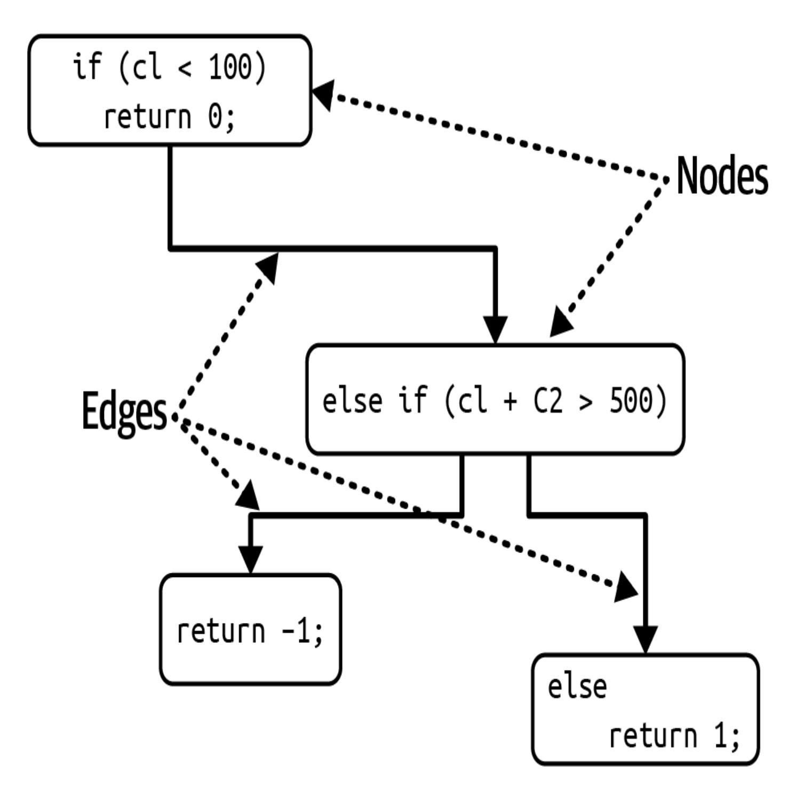
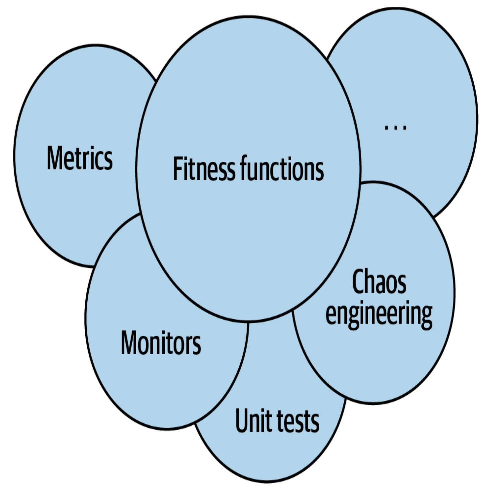
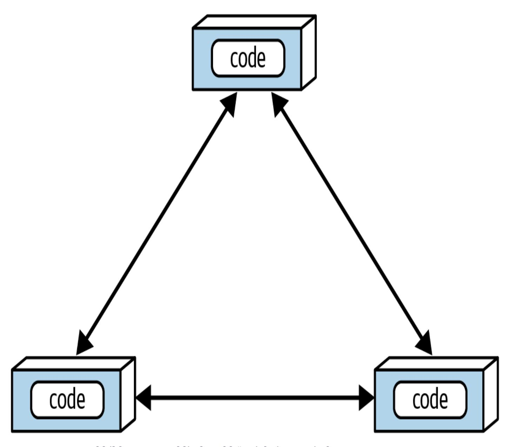
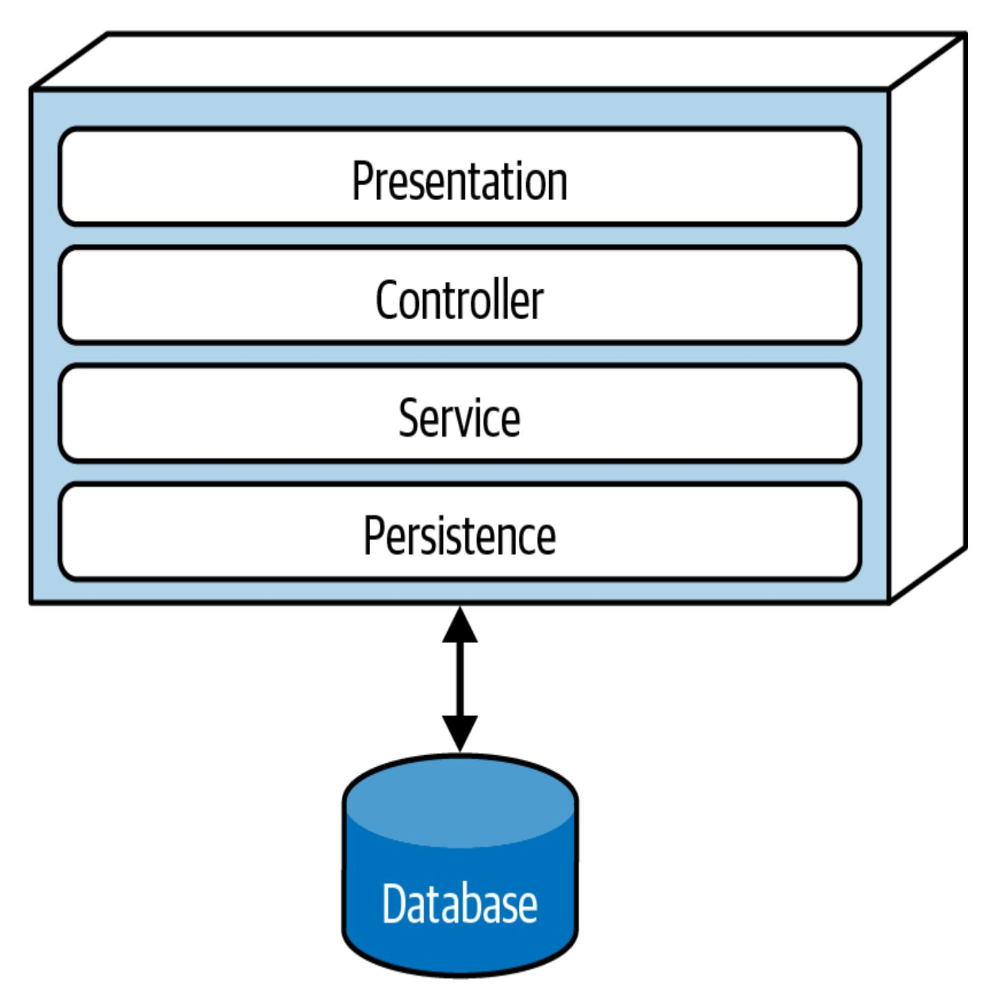

# Kapitel 6. Messung und Steuerung vonArchitekturmerkmalen

Diese Arbeit wurde mithilfe von KI übersetzt. Wir freuen uns über dein Feedback und deine Kommentare: [translation-feedback@oreilly.com](mailto:translation-feedback@oreilly.com)

Architekten müssen sich mit einer außerordentlich großen Vielfalt an Architekturmerkmalen auseinandersetzen, die alle Aspekte von Softwareprojekten betreffen. Betriebliche Aspekte wie Leistung, Elastizität und Skalierbarkeit vermischen sich mit strukturellen Aspekten wie Modularität und Einsatzfähigkeit. Für Architekten ist es von Vorteil, wenn sie wissen, wie man Architekturmerkmale messen und steuern kann, anstatt sich in unklaren Begriffen und weit gefassten Definitionen zu verlieren. In diesem Kapitel geht es darum, einige der gängigsten Architekturmerkmale konkret zu definieren und Governance-Mechanismen für sie zu entwickeln.

# Messung der Architekturmerkmale

Architekten haben aus verschiedenen Gründen Schwierigkeiten, architektonische Merkmale zu definieren:

*Sie sind keine Physik*

Viele Architekturmerkmale haben im allgemeinen Sprachgebrauch eine vage Bedeutung. Wie entwirft ein Architekt zum Beispiel *Agilität* oder *Einsatzfähigkeit*? Was ist mit *"wicked fast performance"*? Die Menschen in der Branche haben sehr unterschiedliche Sichtweisen auf gängige Begriffe - manchmal aus legitimen Gründen, manchmal zufällig.

### *Sehr unterschiedliche Definitionen*

Selbst innerhalb desselben Unternehmens kann es vorkommen, dass verschiedene Abteilungen unterschiedliche Definitionen für kritische Merkmale wie *Leistung* haben. Solange sich Entwickler, Architekten, Betriebsleiter und andere nicht auf eine gemeinsame Definition einigen können, wie können sie sich dann richtig unterhalten?

#### *Zu zusammengesetzt*

Viele wünschenswerte Architektureigenschaften sind in Wirklichkeit Sammlungen von anderen Eigenschaften in kleinerem Maßstab, wie du dich vielleicht aus unserer Diskussion über zusammengesetzte Architektureigenschaften in [Kapitel](#page--1-0) 5 erinnerst. Agilität lässt sich zum Beispiel in Eigenschaften wie Modularität, Einsatzfähigkeit und Testbarkeit unterteilen.

Die Zerlegung von zusammengesetzten Architekturmerkmalen in ihre Bestandteile ist ein wichtiger Bestandteil der Festlegung objektiver Definitionen für Architekturmerkmale, die alle drei Probleme lösen.

Wenn sich eine Organisation darauf einigt, dass alle Beteiligten standardisierte, konkrete Definitionen für Architekturmerkmale verwenden, schafft sie eine allgemeingültige *Sprache* für die Architektur. Diese Standardisierung ermöglicht es, zusammengesetzte Merkmale auszupacken, um *objektiv messbare* Eigenschaften zu entdecken.

## **Operative Maßnahmen**

Viele Architektureigenschaften lassen sich direkt messen, z. B. die Leistung oder Skalierbarkeit. Doch selbst diese bieten viele nuancierte Interpretationen, je nach den Zielen des Teams. Vielleicht misst dein Team zum Beispiel die durchschnittliche Antwortzeit für bestimmte Anfragen - ein gutes Beispiel für ein Maß für ein operatives Architekturmerkmal. Aber wenn dein Team nur den Durchschnitt misst, was passiert dann, wenn 1% der Anfragen aufgrund einer Randbedingung 10 Mal länger braucht als andere? Wenn die Website genügend Traffic hat, werden die Ausreißer vielleicht gar nicht angezeigt. Um Ausreißer zu erkennen, solltest du vielleicht auch die maximalen Antwortzeiten messen.

Hochrangige Teams legen nicht nur harte Leistungszahlen fest, sondern stützen ihre Definitionen auf statistische Analysen. Ein Beispiel: Ein Video-Streaming-Dienst möchte die Skalierbarkeit überwachen. Anstatt eine willkürliche Zahl als Ziel festzulegen, messen die Ingenieure die Skalierung im Laufe der Zeit und erstellen statistische Modelle, um dann Alarm zu schlagen, wenn die Echtzeitmesswerte außerhalb der Vorhersagemodelle liegen. Wenn das der Fall ist, kann das zwei Dinge bedeuten: Das Modell ist falsch (was die Teams gerne wissen) oder es stimmt etwas nicht (was die Teams ebenfalls gerne wissen).

Die Arten von Merkmalen, die Teams messen, entwickeln sich in Verbindung mit Tools, Zielen, Geräten und Fähigkeiten schnell weiter. In letzter Zeit haben sich viele Teams zum Beispiel auf Leistungsbudgets für Metriken wie *"First Contentful Paint"* und *"First CPU Idle"* konzentriert, die beide Aufschluss über Leistungsprobleme für Webseitenbenutzer auf mobilen Geräten geben. Da sich diese und unzählige andere Dinge ändern, werden Teams neue Dinge und Wege finden, sie zu messen.

#### **DIE VIELEN GESCHMACKSRICHTUNGEN DER LEISTUNG**

Für viele der von uns beschriebenen Architekturmerkmale gibt es mehrere Definitionen. Die Leistung ist ein gutes Beispiel. Viele Projekte befassen sich mit der allgemeinen Leistung: zum Beispiel wie lange die Anfrage- und Antwortzyklen einer Webanwendung dauern. In vielen Unternehmen haben Architekten und DevOps-Ingenieure jedoch in mühevoller Arbeit spezifische Leistungsbudgets für bestimmte Teile einer Anwendung festgelegt. Viele Unternehmen haben zum Beispiel das Nutzerverhalten untersucht und festgestellt, dass die optimale Zeit für das Rendern der ersten Seite (das erste sichtbare Zeichen für den Fortschritt einer Webseite in einem Browser oder auf einem mobilen Gerät) bei einem Bruchteil einer Sekunde liegt. Die meisten Anwendungen liegen bei dieser Kennzahl im zweistelligen Bereich. Aber für moderne Websites, die möglichst viele Nutzerinnen und Nutzer ansprechen wollen, ist dies eine wichtige Kennzahl, die es zu verfolgen gilt, und die Unternehmen, die hinter solchen Websites stehen, haben sehr differenzierte Maßnahmen entwickelt.

Einige dieser Metriken haben zusätzliche Auswirkungen auf das Anwendungsdesign. Viele vorausschauende Unternehmen setzen *K-Gewicht-Budgets* für Seitendownloads ein, d.h. sie erlauben eine maximale Anzahl von Bytes an Bibliotheken und Frameworks auf einer bestimmten Seite. Der Grund dafür liegt in physikalischen Beschränkungen: Es können nur so viele Bytes auf einmal über ein Netzwerk übertragen werden, vor allem bei mobilen Geräten in Gebieten mit geringer Bandbreite.

## **Strukturelle Maßnahmen**

Manche objektiven Maße sind nicht so offensichtlich wie die Leistung. Wie sieht es mit internen strukturellen Merkmalen aus, wie zum Beispiel einer gut definierten Modularität? Dies ist ein gutes Beispiel für eine implizite Architektureigenschaft - Architekten sind für die Definition von Komponenten und Interaktionen verantwortlich und wollen eine nachhaltige Struktur für eine hohe Gesamtqualität aufbauen. Leider gibt es noch keine umfassenden Maßstäbe, um die Qualität einer Architektur zu bewerten. Es gibt jedoch Metriken und gängige Werkzeuge, die es Architekten ermöglichen, einige kritische Aspekte der Codestruktur zu berücksichtigen, wenn auch in einem engen Rahmen.

Ein messbarer Aspekt von Code ist die Komplexität, die durch die Metrik der *zyklomatischen Komplexität* definiert wird.

#### **ZYKLOMATISCHE KOMPLEXITÄT**

*Die [zyklomatische](https://oreil.ly/mAHFZ) Komplexität* (CC) ist eine Metrik auf Codeebene, die 1976 von Thomas McCabe Sr. entwickelt wurde, um ein objektives Maß für die Komplexität von Code auf Funktions-/Methoden-, Klassen- oder Anwendungsebene zu schaffen. Sie wird berechnet, indem die Graphentheorie auf den Code angewandt wird - insbesondere auf die *Entscheidungspunkte*, die unterschiedliche Ausführungspfade verursachen. Wenn eine Funktion zum Beispiel keine Entscheidungsanweisungen (wie if ) hat, dann ist CC = 1 . Wenn die Funktion eine einzige Bedingung hat, dann CC = 2 , weil es zwei mögliche Ausführungspfade gibt.

Die Formel zur Berechnung des CC für eine einzelne Funktion oder Methode lautet CC = E − N + 2wobei *<sup>N</sup>* für *Knoten* (Codezeilen) und *E* für *Kanten* (mögliche Entscheidungen) steht. Betrachte den Cähnlichen Code in [Beispiel](#page-6-0) 6-1.

#### <span id="page-6-0"></span>**BEISPIEL 6-1. BEISPIELCODE FÜR DIE BEWERTUNG DER ZYKLOMATISCHEN KOMPLEXITÄT**

```
public void decision(int c1, int c2) {
    if (c1 < 100)
        return 0;
    else if (c1 + C2 > 500)
       return 1;
    else
      return -1;
}
```

Die zyklomatische Komplexität für [Beispiel](#page-6-0) 6-1 ist 3 (3 - 2 + 2), wie in [Abbildung](#page-7-0) 6-1 dargestellt.

<span id="page-7-0"></span>

**ABBILDUNG 6-1. ZYKLOMATISCHER KOMPLEXITÄTSGRAPH FÜR DIE ENTSCHEIDUNGSFUNKTION**

Die Zahl 2 in der Formel für die zyklomatische Komplexität stellt eine Vereinfachung für eine einzelne Funktion/Methode dar. Für Fan-out-Aufrufe zu anderen Methoden (in der Graphentheorie als *verbundene Komponenten* bekannt) lautet die allgemeinere Formel CC = E − N + 2Pwobei *<sup>P</sup>* die Anzahl der verbundenen Komponenten darstellt.

Architekten und Entwickler sind sich einig, dass übermäßig komplexer Code einen "Codegeruch" hat - etwas, das im Code auftaucht und so schlecht ist, dass es einen imaginären Geruch hat. Er schadet praktisch allen wünschenswerten Eigenschaften von Codebasen: Modularität, Testbarkeit, Verteilbarkeit und so weiter. Wenn Teams die allmählich wachsende Komplexität nicht im Auge behalten, wird sie die Codebasis dominieren.

Die zyklomatische Komplexität ist ein gutes Beispiel für die Stumpfheit der Metriken, die Architekten zur Verfügung stehen. Sie misst zwar die Komplexität von Code, kann aber nicht feststellen, ob diese Komplexität *notwendig* ist (weil wir ein kompliziertes Problem lösen) oder *zufällig* (weil wir ein schlechtes Design implementiert haben). Metriken wie CC sind äußerst nützlich, um Code zu bewerten, egal ob er von Entwicklern oder generativer KI geschrieben wurde. Generative KI neigt dazu, Probleme mit roher Gewalt zu lösen, was oft zu unbeabsichtigter Komplexität führt.

#### **WAS IST EIN GUTER WERT FÜR ZYKLOMATISCHE KOMPLEXITÄT?**

Eine häufige Frage, die den Autoren gestellt wird, wenn sie über dieses Thema sprechen, ist: Was ist ein guter Schwellenwert für CC? Wie bei allen Fragen in der Softwarearchitektur lautet die Antwort natürlich: Es kommt darauf an! Genauer gesagt hängt es von der Komplexität der Problemdomäne ab. Wenn du zum Beispiel ein algorithmisch komplexes Problem hast, wird die Lösung komplexe Funktionen ergeben. Einige der wichtigsten Aspekte von CC, die Architekten im Auge behalten sollten: Sind die Funktionen aufgrund der Problemdomäne oder aufgrund schlechter Codierung komplex? Oder ist der Code schlecht partitioniert? Mit anderen Worten: Könnte eine große Methode in kleinere, logische Teile zerlegt werden, um die Arbeit (und die Komplexität) auf besser funktionierende Methoden zu verteilen?

Die Schwellenwerte der Industrie für CC deuten im Allgemeinen darauf hin, dass ein Wert unter 10 akzeptabel ist, sofern keine anderen Erwägungen wie z. B. komplexe Domänen vorliegen. Wir halten diesen Schwellenwert für sehr hoch und würden es vorziehen, wenn der Code unter fünf fällt, was auf zusammenhängenden, gut durchdachten Code hindeutet. Ein Metrik-Tool in der Java-Welt, [Crap4J,](http://www.crap4j.org/) versucht zu bestimmen, wie schlecht (beschissen) dein Code ist, indem es eine Kombination aus CC und Codeabdeckung auswertet; wenn CC auf über 50 ansteigt, kann keine noch so gute Codeabdeckung den Code vor der Beschissenheit bewahren. Das erschreckendste professionelle Artefakt, das Neal je begegnet ist, war eine einzelne C-Funktion, die das Herzstück eines kommerziellen Softwarepakets war und deren CC über 800 betrug! Es handelte sich um eine einzige Funktion mit über 4.000 Codezeilen,

einschließlich der großzügigen Verwendung von GOTO Anweisungen (um unmöglich tief verschachtelte Schleifen zu vermeiden).

Technische Praktiken wie die testgetriebene Entwicklung (TDD) haben den positiven Nebeneffekt, dass sie im Durchschnitt kleinere, weniger komplexe Methoden für einen bestimmten Problembereich hervorbringen. Bei TDD versuchen die Entwickler/innen, einen einfachen Test zu schreiben und dann so wenig Code wie möglich zu schreiben, um den Test zu bestehen. Dieser Fokus auf diskretes Verhalten und gute Testgrenzen fördert gut durchdachte, in sich geschlossene Methoden, die einenniedrigen CC aufweisen.

### **Prozessmaßnahmen**

Einige Architekturmerkmale überschneiden sich mit Softwareentwicklungsprozessen. Zum Beispiel erscheint Agilität oft als wünschenswertes Merkmal. Sie ist jedoch ein zusammengesetztes Architekturmerkmal, das sich aus Merkmalen wie Testbarkeit und Einsatzfähigkeit zusammensetzt.

Die Testbarkeit lässt sich mit Code-Coverage-Tools für praktisch alle Plattformen messen, die darüber berichten, wie viel Prozent des Codes die Tests ausführen. Wie bei allen Softwareprüfungen können diese Tools jedoch nicht das Denken und die Absicht ersetzen. Eine Codebasis kann zum Beispiel eine Codeabdeckung von 100 % haben, aber schlechte Assertions verwenden, die kein Vertrauen in die Korrektheit des Codes geben.

Die Testbarkeit ist eine objektiv messbare Eigenschaft, ebenso wie die Einsatzfähigkeit. Zu den Kennzahlen für die Einsatzfähigkeit gehören der Prozentsatz der erfolgreichen Einsätze, die Dauer der Einsätze und die Probleme/Fehler, die bei den Einsätzen auftreten. Jedes Team muss eine gute Auswahl an Messwerten treffen, die nützliche qualitative und quantitative Daten für die Prioritäten und Ziele der Organisation und des Teams erfassen.

Agilität und die damit verbundenen Aspekte beziehen sich zwar eindeutig auf den Softwareentwicklungsprozess, aber dieser Prozess kann auch die Struktur der Architektur beeinflussen. Wenn z. B. eine einfache Bereitstellung und Testbarkeit hohe Priorität haben, würde der Architekt auf der Architekturebene eine gute Modularität und Isolierung betonen - ein Beispiel für ein Architekturmerkmal, das eine strukturelle Entscheidung beeinflusst. Praktisch alles, was in einem Softwareprojekt vorkommt, kann zu einem Architekturmerkmal werden, wenn es unsere drei Kriterien erfüllt, so dass ein Architekt gezwungen ist, wichtige Entscheidungen zu treffen, um es zu berücksichtigen.

# Governance- und Fitnessfunktionen

Wie können Architekten sicherstellen, dass die Entwickler diese Prioritäten respektieren und ihre Entwürfe unabhängig vom Termindruck korrekt und sicher implementieren, sobald sie die

Architekturmerkmale festgelegt und priorisiert haben? Bei vielen Softwareprojekten steht die Dringlichkeit im Vordergrund, aber Architekten brauchen trotzdem Werkzeuge und Techniken, um die Architektur zu *steuern*. Modularität ist ein gutes Beispiel für einen Aspekt der Architektur, der wichtig, aber nicht dringend ist.

## **Merkmale der regulierenden Architektur**

*Governance*, abgeleitet vom griechischen Wort *kubernan* (lenken), ist eine wichtige Aufgabe der Architektenrolle. Wie der Name schon sagt, deckt sie alle Aspekte des Softwareentwicklungsprozesses ab, die Architekten beeinflussen wollen. So fällt zum Beispiel die Sicherung der Softwarequalität unter die architektonische Steuerung, denn wenn sie vernachlässigt wird, kann das zu katastrophalen Qualitätsproblemen führen.

Glücklicherweise haben Architekten immer ausgefeiltere Lösungen für dieses Problem - ein gutes Beispiel für das schrittweise Wachstum der Fähigkeiten des Softwareentwicklungs-Ökosystems. Das Streben nach Automatisierung, das durch Extreme [Programming](http://www.extremeprogramming.org/) ausgelöst wurde, führte zur kontinuierlichen Integration (CI). CI führte zu einer weiteren Automatisierung im Betrieb, die wir heute DevOps nennen, und diese Kette setzt sich bis zur [Architektur-Governance](https://learning.oreilly.com/library/view/building-evolutionary-architectures/9781492097532) fort. Das Buch *Building Evolutionary Architectures* (O'Reilly, 2022) von Neal Ford et al. beschreibt eine Reihe von Techniken, die sogenannten *Fitnessfunktionen*, mit denen sich viele Aspekte der Architektursteuerung automatisieren lassen. Im

weiteren Verlauf dieses Kapitels werden wir uns mit Fitnessfunktionen befassen.

## **Fitness-Funktionen**

Das Wort *evolutionär* im Titel *Building Evolutionary Architectures* kommt eher aus dem evolutionären Computing als aus der Biologie. Eine der Autorinnen, Dr. Rebecca Parsons, hat einige Zeit im Bereich des evolutionären Rechnens verbracht und unter anderem mit Werkzeugen wie genetischen Algorithmen gearbeitet. Wenn ein Entwickler einen genetischen Algorithmus entwirft, um ein vorteilhaftes Ergebnis zu erzielen, möchte er den Algorithmus oft durch ein objektives Maß für die Qualität seines Ergebnisses lenken. Dieser Steuerungsmechanismus wird als *Fitnessfunktion* bezeichnet: eine Objektfunktion, mit der bewertet wird, wie nahe das Ergebnis dem Ziel kommt.

Nehmen wir zum Beispiel an, du musst das Problem des [Handlungsreisenden](https://oreil.ly/GApjt) lösen, ein berühmtes Problem, das als Grundlage für maschinelles Lernen dient. Wie sieht die optimale Route aus, die die Entfernung, die Zeit und die Kosten minimiert, wenn man einen Verkäufer, eine Liste von Städten, die er besuchen muss, und die Entfernungen zwischen diesen Städten angibt? Wenn du einen genetischen Algorithmus entwickelst, um dieses Problem zu lösen, könntest du eine Fitnessfunktion verwenden, um die Länge der Route zu bewerten, und eine andere, um die mit der Route verbundenen Gesamtkosten zu bewerten. Eine andere könnte die Zeit bewerten, die der reisende Verkäufer unterwegs ist.

Praktiken der evolutionären Architektur greifen dieses Konzept auf, um eine *architektonische Fitnessfunktion* zu schaffen: ein Mechanismus, der eine objektive Integritätsbewertung eines Architekturmerkmals oder einer Kombination von Architekturmerkmalen ermöglicht.

Fitnessfunktionen sind kein neues Framework, das Architekten herunterladen können. Vielmehr bieten sie eine neue Perspektive auf viele bestehende Werkzeuge. Beachte in der Definition die Formulierung " *jeder Mechanismus" -*die Verifizierungstechniken für Architekturmerkmale sind so vielfältig wie die Merkmale selbst. Fitnessfunktionen überschneiden sich mit vielen bestehenden Überprüfungsmechanismen, je nachdem, wie sie eingesetzt werden: im Chaos Engineering oder als Metriken, Monitore oder Unit-Testing-Bibliotheken (siehe [Abbildung](#page-15-0) 6-2).

<span id="page-15-0"></span>

Abbildung 6-2. Die Mechanismen der Fitnessfunktionen

Je nach den Merkmalen der Architektur können viele verschiedene Tools zur Implementierung von Fitnessfunktionen verwendet werden. Schauen wir uns ein paar Beispiele für Fitnessfunktionen an, die verschiedene Aspekte der Modularität testen.

### **Zyklische Abhängigkeiten**

Modularität ist ein implizites Architekturmerkmal, das den meisten Architekten wichtig ist. Da eine schlecht gepflegte Modularität der Struktur einer Codebasis schadet, legen Architekten im Allgemeinen großen Wert auf eine gute Modularität. Auf vielen Plattformen gibt es jedoch Kräfte, die gegen diese guten Absichten arbeiten. Sobald ein Entwickler in einer gängigen Java- oder .NET-Entwicklungsumgebung eine Klasse referenziert, die noch nicht importiert wurde, zeigt die IDE einen Dialog an, in dem er gefragt wird, ob er die Referenz automatisch importieren möchte. Das passiert so oft, dass die meisten Programmierer den Auto-Import-Dialog reflexartig wegdrücken. Aber das willkürliche Importieren von Klassen zwischen Komponenten kann für die Modularität eine Katastrophe bedeuten. [Abbildung](#page-17-0) 6-3 zeigt z. B. die *zyklischen Abhängigkeiten*, ein besonders schädliches Muster, das Architekten vermeiden wollen.

In [Abbildung](#page-17-0) 6-3 verweist jede Komponente auf etwas in den anderen Komponenten. Ein solches Netzwerk schadet der Modularität, denn es ist unmöglich, eine einzelne Komponente wiederzuverwenden, ohne die anderen mit einzubeziehen. Und wenn diese anderen Komponenten mit anderen Komponenten gekoppelt sind? Dann neigt die Architektur immer mehr zum Big Ball of [Mud-Antipattern.](https://oreil.ly/usx7p) Wie können Architekten dieses Verhalten steuern, ohne den Entwicklern ständig über die Schultern zu schauen? Codeüberprüfungen sind hilfreich, aber sie finden zu spät im Entwicklungszyklus statt, um wirklich effektiv zu sein. Wenn das Entwicklungsteam bis zur Codeüberprüfung eine Woche lang

hemmungslos in die Codebasis importiert, hat es ihr bereits schweren Schaden zugefügt.

<span id="page-17-0"></span>

Abbildung 6-3. Zyklische Abhängigkeiten zwischen Komponenten

Die Lösung für dieses Problem ist, eine Fitnessfunktion zu schreiben, die nach Zyklen sucht, wie in [Beispiel](#page-17-1) 6-2 gezeigt.

<span id="page-17-1"></span>**Beispiel 6-2. Fitnessfunktion zur Erkennung von Komponentenzyklen**

```
public class CycleTest {
    private JDepend jdepend;
    @BeforeEach
    void init() {
      jdepend = new JDepend();
      jdepend.addDirectory("/path/to/project/persistence/clas
      jdepend.addDirectory("/path/to/project/web/classes");
      jdepend.addDirectory("/path/to/project/thirdpartyjars")
    }
    @Test
    void testAllPackages() {
      Collection packages = jdepend.analyze();
      assertEquals("Cycles exist", false, jdepend.containsCyc
    }
}
```

Dieser Code verwendet das Metrik-Tool [JDepend](https://oreil.ly/ozzzk), um die Abhängigkeiten zwischen Paketen zu prüfen. Das Tool versteht die Struktur von Java-Paketen und schlägt den Test fehl, wenn es irgendwelche Zyklen findet. Ein Architekt kann diesen Test in den kontinuierlichen Build eines Projekts einbinden und muss sich keine Sorgen mehr machen, dass schießwütige Entwickler versehentlich Zyklen einführen. Dies ist ein großartiges Beispiel für eine Fitnessfunktion, die *eher die wichtigen als die dringenden* Praktiken der Softwareentwicklung schützt: Sie ist ein wichtiges Anliegen für Architekten, hat aber nur geringe Auswirkungen auf die tägliche Programmierung.

### **Abstand von der Hauptsequenz Fitnessfunktion**

In ["Kopplung"](#page--1-1) haben wir die esoterischere Metrik der *Distanz zur Hauptreihe* eingeführt, die auch mit Fitnessfunktionen überprüft werden kann, wie in [Beispiel](#page-19-0) 6-3 gezeigt.

<span id="page-19-0"></span>**Beispiel 6-3. Abstand von der Hauptreihenfolge Fitnessfunktion**

```
@Test
void AllPackages() {
    double ideal = 0.0;
    double tolerance = 0.5; // project-dependent
    Collection packages = jdepend.analyze();
    Iterator iter = packages.iterator();
    while (iter.hasNext()) {
      JavaPackage p = (JavaPackage)iter.next();
      assertEquals("Distance exceeded: " + p.getName(),
        ideal, p.distance(), tolerance);
    }
}
```

Dieser Code verwendet JDepend, um einen Schwellenwert für akzeptable Werte festzulegen, und schlägt den Test fehl, wenn eine Klasse außerhalb dieses Bereichs liegt. (Das Tool ArchUnit, das im nächsten Abschnitt vorgestellt wird, ermöglicht es Architekten, ähnliche Fitnessfunktionen zu erstellen.) Dieses Beispiel für ein objektives Maß für eine Architektureigenschaft zeigt, wie wichtig die Zusammenarbeit zwischen Entwicklern und Architekten bei der Entwicklung und Umsetzung von Fitnessfunktionen ist. Es geht nicht darum, dass sich

eine Gruppe von Architekten in einen Elfenbeinturm begibt und esoterische Fitnessfunktionen entwickelt, die die Entwickler nicht verstehen können, sondern darum, automatisierte Governance-Regeln einzuführen, die die Qualität der Codebasis sicherstellen.

#### **TIPP**

Die Architekten müssen sicherstellen, dass die Entwickler den Zweck einer Fitnessfunktion verstehen, bevor sie ihnen diese auferlegen.

In den letzten Jahren sind die Tools für Fitness-Funktionen immer ausgefeilter geworden, vor allem, weil einige Spezial-Tools entstanden sind. Ein solches Tool ist [ArchUnit](https://archunit.org/), ein Java-Testframework, das sich an mehreren Teilen des [JUnit-Ökosystems](https://junit.org/) orientiert und diese nutzt. ArchUnit bietet eine Vielzahl von vordefinierten Governance-Regeln, die in Form von Unit-Tests kodiert sind, und ermöglicht es Architekten, spezifische Tests zu schreiben, die die Modularität berücksichtigen. Betrachte die in [Abbildung](#page-21-0) 6-4 dargestellte Schichtenarchitektur.

<span id="page-21-0"></span>

Abbildung 6-4. Mehrschichtige Architektur

Beim Entwurf eines mehrschichtigen Monolithen wie in [Abbildung](#page-21-0) 6-4 legt der Architekt die Schichten aus guten Gründen fest (wir beschreiben diese Beweggründe, Kompromisse und andere Aspekte in [Kapitel](#page--1-0) 10). Manche Entwickler verstehen jedoch nicht, wie wichtig diese Muster sind, während andere aufgrund übergeordneter lokaler Bedenken, wie z.

B. der Leistung, lieber um Vergebung als um Erlaubnis bitten. Aber wenn man zulässt, dass sie die Gründe für die Architektur aushöhlen, schadet das der langfristigen Gesundheit der Architektur.

ArchUnit ermöglicht es Architekten, dieses Problem über eine Fitnessfunktion zu lösen, wie in [Beispiel](#page-22-0) 6-4 gezeigt.

<span id="page-22-0"></span>**Beispiel 6-4. ArchUnit Fitnessfunktion zur Steuerung von Schichten**

```
layeredArchitecture()
    .layer("Controller").definedBy("..controller..")
    .layer("Service").definedBy("..service..")
    .layer("Persistence").definedBy("..persistence..")
    .whereLayer("Controller").mayNotBeAccessedByAnyLayer()
    .whereLayer("Service").mayOnlyBeAccessedByLayers("Control
    .whereLayer("Persistence").mayOnlyBeAccessedByLayers("Ser
```

In [Beispiel](#page-22-0) 6-4 definiert der Architekt die gewünschte Beziehung zwischen den Schichten und schreibt eine Verifizierungsfitnessfunktion, um sie zu steuern.

Es gibt ein ähnliches Tool im .NET-Bereich, [NetArchTest.](https://oreil.ly/EMXpv) [Beispiel](#page-22-1) 6-5 zeigt eine Ebenenprüfung in C#.

#### <span id="page-22-1"></span>**Beispiel 6-5. NetArchTest für Layer-Abhängigkeiten**

```
var result = Types.InCurrentDomain()
    .That()
    .ResideInNamespace("NetArchTest.SampleLibrary.Presentatio
    .ShouldNot()
    .HaveDependencyOn("NetArchTest.SampleLibrary.Data")
    .GetResult()
    .IsSuccessful;
```

Unsere Diskussion über die Prüfbarkeit zeigt ein Problem auf, das mit jeder Metrik oder Messung einhergeht: die Möglichkeit, dass Entwickler versuchen, das System zu manipulieren. Sobald sie erfahren, wie die Architekten die Einhaltung der Vorgaben messen, programmieren sie vielleicht nach den Vorgaben, anstatt das Richtige zu tun. Ein häufiges Fehlschlagen der Testbarkeit tritt zum Beispiel auf, wenn Entwickler/innen, die Abkürzungen nehmen, Unit-Tests schreiben, aber keine Assertions. Den Code "anzufassen", aber nicht zu überprüfen, ob er funktioniert, ist ein Betrug an der Code-Coverage-Metrik. Das Schreiben von Governance-Code mit Tools wie ArchUnit hilft Architekten, dieses Verhalten zu verhindern, indem sie sicherstellen, dass jeder Unit-Test mindestens eine Assertion enthält. Natürlich werden engagierte Regelverstöße immer einen Weg finden, aber Fitnessfunktionen wie diese verhindern versehentliche Fehler.

Ein weiteres Beispiel für Fitnessfunktionen ist Netflix' "Chaos Monkey" und die dazugehörige [Simian](https://oreil.ly/GipHq) Army. Als Netflix beschloss, seinen Betrieb in die Cloud von Amazon zu verlagern, hatten die Architekten keine Kontrolle mehr über den Betrieb, was sie beunruhigte: Was würde passieren, wenn ein Fehler im Betrieb auftritt? Um dieses Problem zu

lösen, haben sie die Disziplin des *Chaos Engineering* ins Leben gerufen. Der Chaos Monkey fungiert im Wesentlichen als Fitnessfunktion für die Produktion, indem er das allgemeine Chaos simuliert, um zu sehen, wie gut das System es aushalten kann. Bei einigen AWS-Instanzen war die Latenz ein Problem, also simulierte der Chaos Monkey eine hohe Latenz. (Das war sogar so problematisch, dass sie schließlich einen speziellen Latency Monkey entwickelten). Daraufhin wurden weitere Tools entwickelt: Der Chaos Kong, der den Ausfall eines ganzen Amazon-Rechenzentrums simuliert, hat Netflix dabei geholfen, solche Ausfälle zu vermeiden, wenn sie tatsächlich eintreten.

Insbesondere die *Konformitäts-*, *Sicherheits-* und *Hausmeister-* "Affen" (Fitnessfunktionen) veranschaulichen den Ansatz der automatisierten Steuerung. Mit dem "Conformity Monkey" können die Netflix-Architekten Governance-Regeln festlegen, die der Affe in der Produktion durchsetzt. Wenn sie z. B. entscheiden, dass jeder Dienst auf alle Anfragen fehlerfrei antworten soll, bauen sie diese Prüfung in den Conformity Monkey ein. Der Security Monkey prüft jeden Dienst auf bekannte Sicherheitsmängel, wie z. B. Ports, die nicht aktiv sein sollten, und Konfigurationsfehler.

Schließlich sucht der Janitor Monkey nach Instanzen, zu denen keine anderen Dienste mehr führen. Netflix hat eine evolutionäre Architektur, so dass Entwickler regelmäßig zu neueren Diensten migrieren und alte Dienste ohne Mitstreiter zurücklassen. Da der Betrieb von Diensten in der Cloud Geld kostet, sucht der Janitor Monkey nach verwaisten Diensten und schließt sie aus der Produktion aus.

Chaos Engineering bietet eine interessante neue Perspektive auf die Architektur: Es geht nicht darum, *ob* etwas irgendwann kaputt geht, sondern *wann*. Indem man diese Brüche vorhersieht und testet, um sie zu [verhindern, werden](https://www.oreilly.com/library/view/chaos-engineering/9781492043850) Systeme viel robuster. Das Buch *Chaos Engineering* (O'Reilly, 2020) von Casey Rosenthal und Nora Jones, einigen der Netflix-Innovatoren, zeigt diesen Ansatz.

Atul Gawandes einflussreiches Buch *The Checklist [Manifesto](https://oreil.ly/XNcV9)* (Metropolitan, 2009) beschreibt, wie Fachleute wie Piloten und Chirurgen Checklisten verwenden (manchmal sind sie sogar gesetzlich dazu verpflichtet). (Manchmal sind sie sogar gesetzlich dazu verpflichtet.) Das liegt nicht daran, dass diese Fachleute ihren Job nicht kennen oder vergesslich sind. Vielmehr ist es so, dass Fachleute, die einen sehr detaillierten Auftrag immer wieder ausführen, leicht Details vergessen; eine knappe Checkliste ist eine wirksame Erinnerung.

Das ist die richtige Sichtweise auf Fitnessfunktionen - sie sind kein schwergewichtiger Governance-Mechanismus, sondern ein Mechanismus für Architekten, um wichtige Architekturprinzipien auszudrücken und automatisch zu überprüfen. Entwickler wissen, dass sie keinen unsicheren Code veröffentlichen sollten, aber das steht in Konkurrenz zu Dutzenden oder Hunderten von anderen Prioritäten. Werkzeuge wie der Security Monkey und Fitnessfunktionen im Allgemeinen ermöglichen es Architekten, wichtige Governance-Prüfungen in das Substrat der Architektur einzubauen.