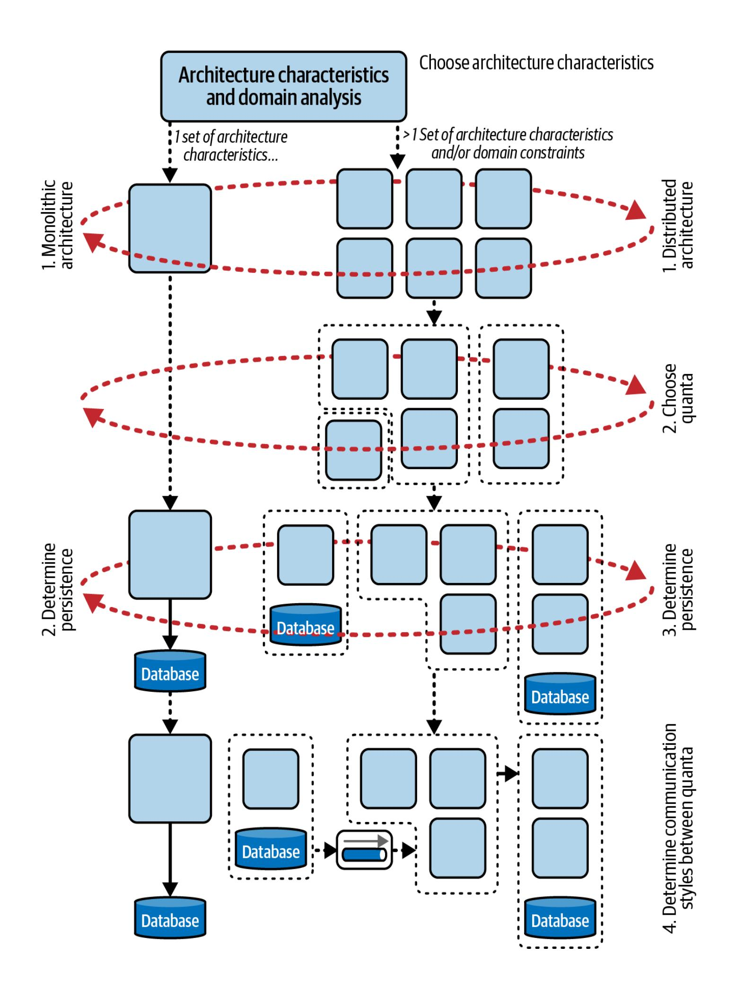
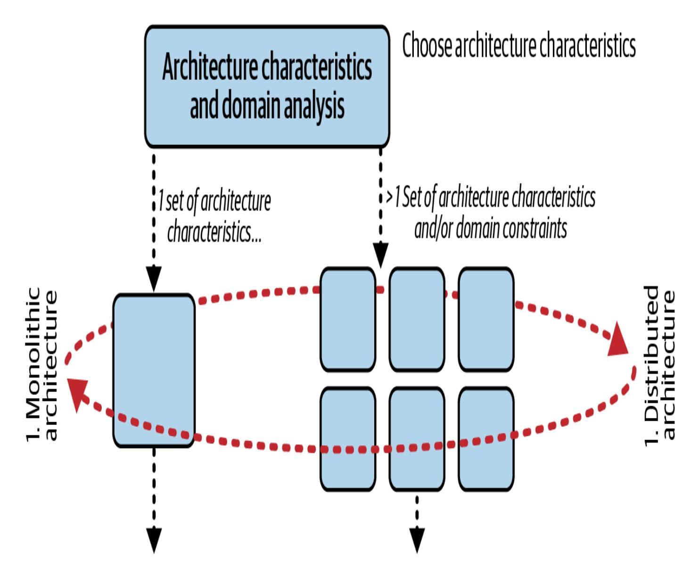
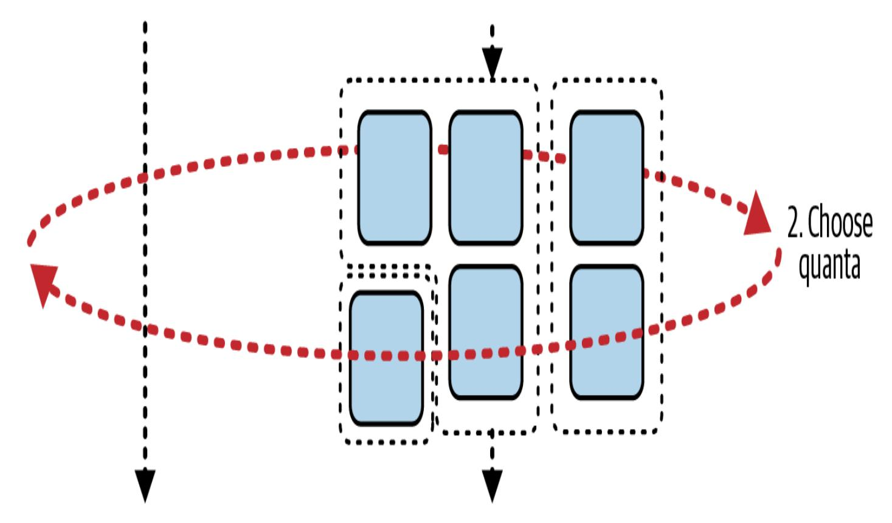
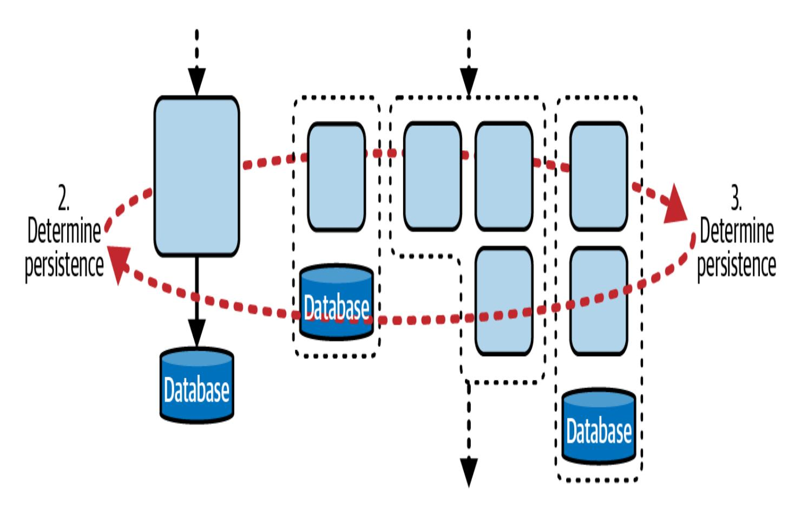
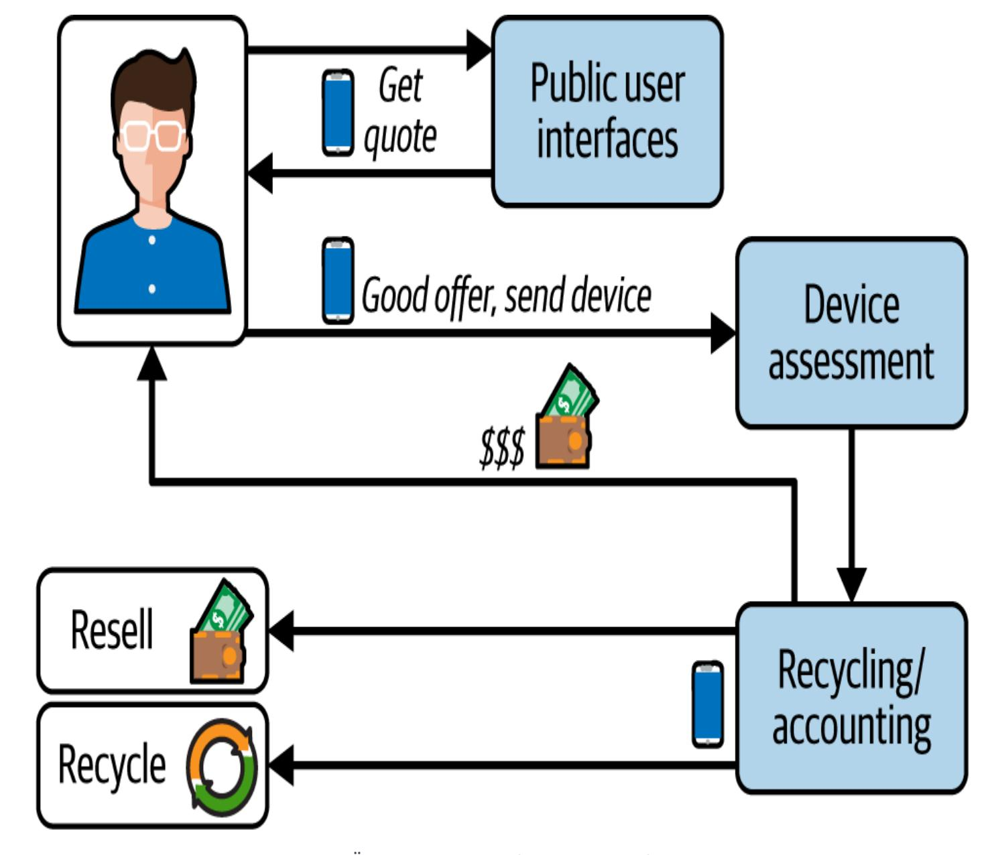
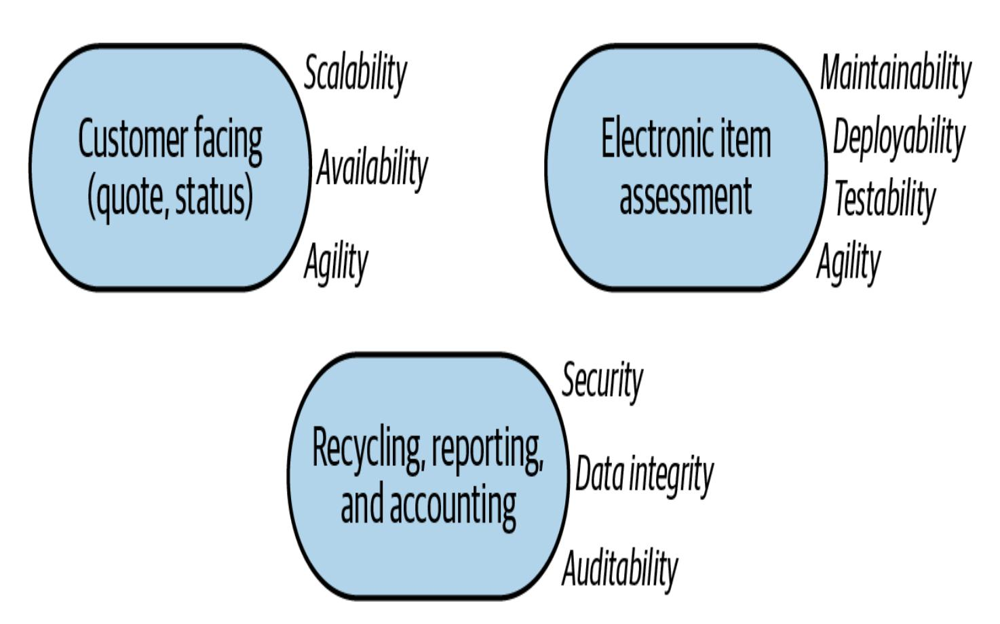
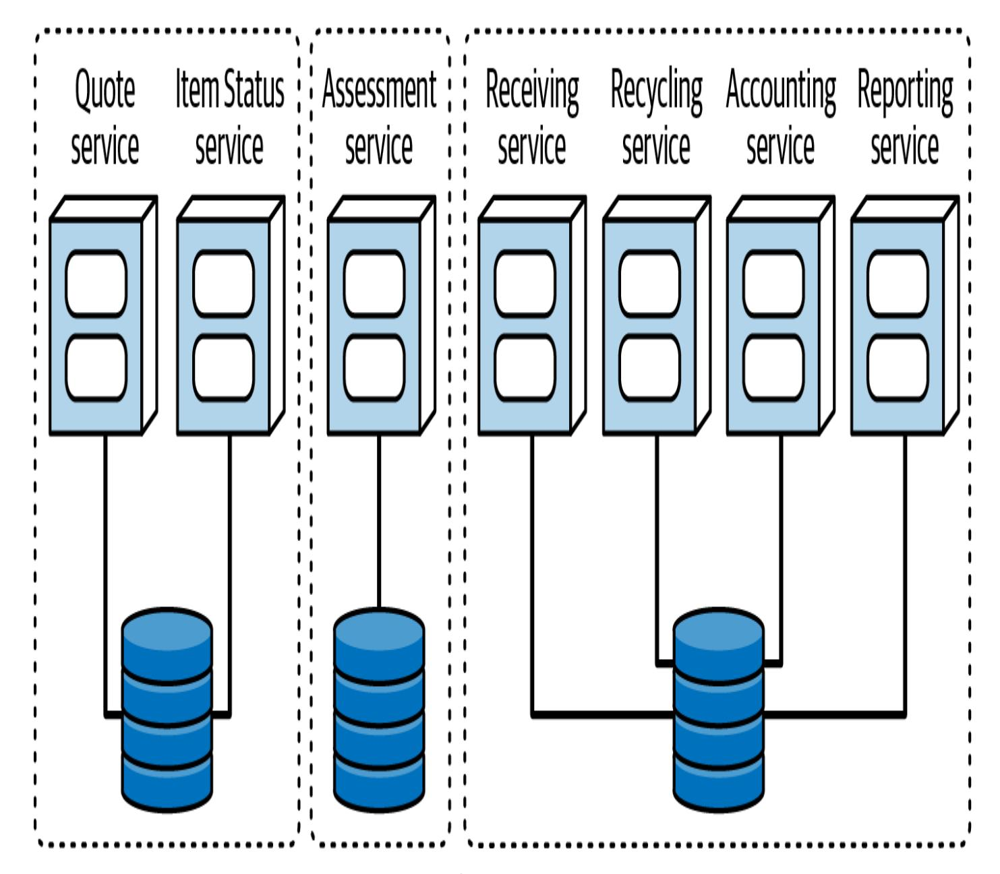

# 7장. 아키텍처 특성의 범위 (Kapitel 7. Der Umfang der architektonischen Merkmale)

이 작업은 KI의 도움으로 번역되었습니다. 의견과 코멘트를 [translation-feedback@oreilly.com](mailto:translation-feedback@oreilly.com)으로 보내 주시면 감사하겠습니다.

소프트웨어 아키텍트의 사고방식은 생태계와 함께 진화해야 하며, 이는 아키텍처 특성(Architektureigenschaften)을 정의할 때 가장 분명합니다. 한때 널리 쓰였던 많은 프레임워크는 전체 시스템에 단 하나의 아키텍처 특성 집합만 존재한다고 가정하는 치명적인 결함이 있었습니다. 지금도 가끔은 맞지만, 마이크로서비스(Microservices)처럼 현대적인 아키텍처의 상당수는 서비스와 시스템 차원에서 서로 다른 아키텍처 특성을 갖습니다.

아키텍처 특성의 범위(scope)는 아키텍트가 구현의 출발점으로 삼을 가장 적합한 아키텍처 스타일을 선택할 때 특히 유용한 척도입니다. 우리가 *Building Evolutionary [Architectures](https://evolutionaryarchitecture.com/)*를 집필할 때 특정 아키텍처 스타일의 구조적 진화 가능성을 측정할 방법이 필요했지만, 기존 기법은 적절한 세분도를 제공하지 못했습니다. "구조적 [측정지표](#page--1-0)" 절에서는 아키텍트가 구조적 측면을 분석할 수 있도록 코드 수준의 다양한 측정지표를 다루지만, 그 무엇도 범위를 반영하지는 못합니다. 이 지표들은 코드의 저수준 세부 정보를 제공하지만, 많은 아키텍처 특성 특히 운영 특성에 영향을 미치는 데이터베이스 같은 코드베이스 외부의 종속 구성요소를 평가하지는 못합니다. 아키텍트가 성능이나 탄력성을 위해 코드베이스를 아무리 공들여 설계해도 시스템 데이터베이스가 그 특성에 부합하지 않으면 노력은 수포로 돌아갑니다.

만족스러운 범위 지표가 없었기에 우리는 직접 만들었습니다. 그것이 바로 *아키텍처 퀀텀(Architektur-Quantum)*입니다.

# 아키텍처 퀀텀과 세분도 (Architektonische Quanten und Granularität)

컴포넌트 수준의 결합만이 소프트웨어를 묶어 두는 유일한 힘은 아닙니다. 많은 비즈니스 개념이 시스템의 일부를 의미적으로 연결해 *기능적 응집력*을 형성합니다. 소프트웨어를 성공적으로 설계·분석·진화시키려면 아키텍트와 개발자는 끊어질 가능성이 있는 모든 결합 지점을 고려해야 합니다.

#### **라틴어 전문 용어 복수형 (PLURALE FÜR LATEINISCHE FACHBEGRIFFE)**

*퀀텀(Quantum)*은 라틴어에서 왔기에 복수형이 *a*로 끝납니다. 즉 퀀텀이 둘 이상이면 *퀀타(Quanten)*가 되는데, 라틴어에서 온 더 익숙한 단어 *데이터(Daten)*와 같습니다. 아키텍트가 단수 *datum*을 말하는 일은 거의 없습니다. *시카고 스타일 매뉴얼*은 "이 단어는 원래 *datum*의 복수형이지만, 오늘날에는 보통 물질명사로 취급되어 단수 동사와 호응한다"고 설명합니다(18판, 2024년, 336쪽).

과학에 익숙한 많은 아키텍트는 물리학에서 "퀀텀"이 어떤 것, 보통 에너지의 가장 작은 양을 가리킨다는 사실을 알고 있습니다. *Quantum*은 라틴어로 "얼마나 크냐" 혹은 "얼마나 많냐"를 의미합니다. 일상적으로는 우리 정의처럼 "작고 분해되지 않는 것"을 뜻합니다. *아키텍처 퀀텀*의 또 다른 비공식 정의는 "시스템에서 독립적으로 실행되는 가장 작은 부분"입니다. 예를 들어, 마이크로서비스는 종종 아키텍처 퀀텀을 이룹니다. 각 서비스는 자체 데이터와 다른 의존성을 포함해 아키텍처 안에서 독립적으로 실행될 수 있기 때문입니다.

*아키텍처 퀀텀*은 일련의 아키텍처 특성을 위한 경계를 마련하며 다음과 같은 특성을 갖습니다.

아키텍처의 다른 부분과 독립적으로 배포됨

- 높은 기능적 응집력
- 외부 구현에 대한 낮은 정적 결합
- 다른 퀀텀과의 동기식 통신

이 정의는 여러 요소로 구성되어 있으니 차례로 살펴보겠습니다.

*일련의 아키텍처 특성을 위한 경계를 마련한다* 아키텍트는 아키텍처 퀀텀을, 특히 운영 특성을 포함한 아키텍처 특성 집합을 경계 짓는 데 활용합니다. 퀀텀은 독립적으로 배포할 수 있고 기능적 응집력이 높기 때문에(아래 참조) 아키텍처 모듈성을 측정하는 유용한 단위입니다.

### *독립적으로 배포 가능 (Unabhängig einsetzbar)*

아키텍처 퀀텀은 다른 부분과 무관하게 작동하는 데 필요한 모든 구성요소를 포함합니다. 예를 들어 애플리케이션이 데이터베이스를 사용한다면 시스템이 데이터 없이 동작할 수 없기 때문에 해당 데이터베이스는 퀀텀에 포함됩니다. 따라서 단일 데이터베이스로 동작하는 레거시 시스템은 거의 모두 정의상 단일 퀀텀입니다. 반면 마이크로서비스 아키텍처에서는 각 서비스가 고유한 데이터베이스를 갖습니다(이는 [18장](#page--1-0)에서 자세히 다루는 *제한된 컨텍스트 제어* 철학의 일부입니다). 그 결과 각 서비스가 고유한 아키텍처 범위를 가지므로 아키텍처에는 여러 개의 퀀텀이 생깁니다.

*높은 기능적 응집력*

컴포넌트 설계에서 *응집력(Kohäsion)*은 코드가 얼마나 일관된 목적을 공유하는지를 뜻합니다. 예를 들어 속성과 메서드가 모두 *고객*을 다루는 Customer 컴포넌트는 높은 응집력을 가집니다. 다양한 메서드를 무작위로 모아 둔 Utility 컴포넌트는 그렇지 않습니다. 높은 기능적 응집력은 아키텍처 퀀텀 하나가 의미 있는 일을 수행함을 뜻합니다. 단일 데이터베이스를 쓰는 전통적 모놀리식 애플리케이션에서는 응집력이 사실상 전체 시스템을 가리키므로 큰 차이가 나지 않습니다. 하지만 이벤트 기반이나 마이크로서비스처럼 분산된 아키텍처에서는 각 서비스를 단일 워크플로( ["Domain-Driven Design의 제한된 컨텍스트"](#page-5-0)에서 설명하듯 *제한된 컨텍스트*)에 맞추어 설계하는 경우가 많기 때문에 각 서비스는 높은 기능적 응집력을 갖습니다.

#### **도메인 주도 설계의 제한된 컨텍스트 (DOMAIN-DRIVEN DESIGN IM BEGRENZTEN KONTEXT)**

Eric Evans의 저서 *Domain-Driven Design*(Addison-Wesley Professional, 2003)은 현대 아키텍처 사고방식에 지대한 영향을 미쳤습니다. *[Domain-Driven](https://dddcommunity.org/) Design* (DDD)은 아키텍트가 복잡한 문제 도메인을 조직적으로 분해하도록 돕는 모델링 기법입니다. DDD는 도메인의 일부와 관련된 모든 것이 내부에서는 보이고 다른 제한된 컨텍스트에는 불투명한 *제한된 컨텍스트*를 정의합니다.

DDD 이전에는 아키텍트가 조직 전반에서 공통 엔터티를 공유함으로써 코드를 거시적으로 재사용하려 했습니다. 그러나 공통 아티팩트를 만들면 긴밀한 결합, 어렵고 느린 조정, 높은 복잡도 같은 문제가 생겼습니다. 제한된 컨텍스트 개념은 각 엔터티가 국지적으로 제약된 컨텍스트에서 가장 잘 작동함을 인정합니다. 따라서 조직 전체를 위한 단일 Customer 클래스를 만들기보다 각 문제 도메인이 자체 Customer 클래스를 만들고, 다른 도메인과의 통신 지점에서 차이를 조정할 수 있습니다.

다음 정의를 명확히 하려면 결합 유형을 좀 더 세분해야 합니다.

*의미적 결합*

*의미적 결합(semantische Kopplung)*은 아키텍트가 해결하려는 문제 자체에서 비롯되는 자연스러운 결합을 설명합니다. 예를 들어 주문 처리 애플리케이션의 결합에는 재고, 카탈로그, 장바구니, 고객, 판매 등이 포함됩니다. 소프트웨어 솔루션을 낳은 문제의 본질이 이런 결합을 정의합니다. 도메인 변경(따라서 의미 변경)은 시스템 요구를 바꾸므로 아키텍트가 도메인 변화가 시스템에 미치는 영향을 막을 마법 같은 패턴은 없습니다. 아키텍트는 변화를 수용할 수는 있지만, 핵심 문제의 변화가 아키텍처에 파급되는 것을 완전히 차단할 수는 없습니다.

#### *구현 결합 (Kopplung der Implementierung)*

*구현 결합(Implementierungskopplung)*은 아키텍트와 팀이 특정 의존성을 어떻게 구현할지 내리는 결정을 의미합니다. 주문 처리 애플리케이션에서 팀은 도메인 경계를 정의할 때 여러 제약을 고려해야 합니다. 모든 데이터를 단일 데이터베이스에 둘 것인가, 아니면 더 나은 확장성과 가용성을 위해 일부를 분할할 것인가? 모놀리식 아키텍처를 만들 것인가, 분산 아키텍처를 만들 것인가? 이러한 질문의 답은 시스템의 의미적 결합에는 거의 영향을 주지 않지만 아키텍처 결정에는 큰 영향을 줍니다.

#### *정적 결합 (Statische Kopplung)*

*정적 결합(statische Kopplung)*은 아키텍처의 "배선"을, 즉 서비스들이 서로에게 어떻게 의존하는지를 나타냅니다. 두 서비스가 동일한 결합 지점에 의존하면 동일한 아키텍처 퀀텀에 속합니다. 예를 들어 Catalog와 Shipping이라는 두 마이크로서비스가 주소 정보를 교환하기 위해 공통 구성요소에 의존한다면 두 서비스 모두 해당 의존성에 묶여 있으므로 동일한 퀀텀입니다.

소프트웨어 아키텍처의 결합을 단순하게 생각하는 방법이 있습니다. 하나를 바꾸었을 때 다른 하나를 망가뜨릴 수 있다면 둘은 결합되어 있습니다. 정적 결합은 아키텍처 내부의 의존 관계를 정의합니다. 여러 서비스가 같은 관계형 데이터베이스를 사용한다면 모두 동일한 퀀텀에 속합니다.

### *동적 결합 (Dynamische Kopplung)*

*동적 결합(dynamische Kopplung)*은 아키텍처 퀀텀이 서로 통신해야 할 때 발생하는 힘을 설명합니다. 예를 들어 두 서비스가 실행 중이라면 워크플로를 구성하고 시스템 내 업무를 수행하기 위해 서로 통신해야 합니다. [15장](#page--1-0)에서 자세히 다루듯, 아키텍트는 분산 아키텍처에서 서비스 간 통신이 낳는 트레이드오프를 고려해야 합니다.

이제 *아키텍처 퀀텀 정의*를 완성할 수 있습니다.

*외부 구현에 대한 낮은 정적 결합* 아키텍처 퀀텀 사이의 결합 정도는 낮아야 합니다. 이 특징은 제한된 컨텍스트 간 결합을 줄이려는 DDD 철학에서 유도됩니다. 퀀텀은 컴포넌트보다 한 단계 위의 추상화로, 아키텍처의 운영적 빌딩 블록을 형성합니다. 서비스 경계와 겹치는 경우가 많습니다. 목표는 아키텍처의 서로 다른 부분 사이에서 느슨한 결합을 달성하려는 아키텍트의 일반적 선호를 반영합니다.

일반적으로 높은 응집력이 필요한 좁은 범위(서비스나 하위 시스템 내부)에서는 긴밀한 결합이 허용됩니다. 그러나 단일 구현 변경이 많은 다른(겉보기에는 관련 없어 보이는) 요소를 망가뜨릴 수 있다면 우리는 그 아키텍처를 "취약"하다고 부릅니다. 시스템의 범위가 넓을수록 느슨한 결합이 아키텍처를 덜 취약하게 만들며, 예를 들어 어떤 아키텍트가 서비스 호출의 필드를 State에서 StateCode로 이름만 바꾸면 한 호출자만 영향을 받으리라 생각했지만 실제로는 많은 다른 의존성이 끊어지는 식입니다.

#### **팁 (TIPP)**

범위가 좁을수록 더 높은 결합이 허용되지만, 범위가 넓어질수록 결합은 느슨해야 합니다.

## 동기식 통신 (Synchrone Kommunikation)

*통신*은 아키텍처 퀀텀이 서로 호출할 때 즉, 분산 아키텍처에서 흔히 발생하는 동적 결합을 의미합니다. 이는 "운영 아키텍처 특성"( [링크](#page--1-1))에서 설명하는 운영 [아키텍처 특성](#page--1-1)과 밀접하게 관련되며, 분산 아키텍처의 중요한 지연과 블로킹을 결정합니다.

마이크로서비스 아키텍처에서 Payment 서비스와 Auction 서비스가 있다고 가정해 봅시다. 경매가 끝나면 Auction 서비스는 결제 정보를 Payment 서비스에 *동기식*으로 보냅니다. 그런데 Payment 서비스가 500ms마다 하나의 결제만 처리할 수 있다면 어떻게 될까요? 동시에 많은 경매가 끝나면 첫 호출만 성공하고 나머지는 실패합니다. Payment 서비스가 Auction 서비스만큼 확장 가능하지 않기 때문입니다. 두 서비스가 서로 다른 아키텍처 특성을 갖고 있기 때문입니다.

여기서는 동기식 통신을 다룹니다. 비동기 통신은 영향이 덜할 수 있기 때문입니다. 예를 들어 Auction 서비스가 큐를 통해 Payment 서비스를 비동기식으로 호출하면 큐가 버퍼 역할을 하여 두 시스템이 계속 일할 수 있습니다. 물론 Auction 서비스가 Payment가 처리할 수 있는 것보다 많은 메시지를 지속적으로 보내면 언젠가는 큐가 넘칩니다. 하지만 메시지가 간헐적으로 몰릴 경우 큐가 수신자가 준비될 때까지 메시지를 보관할 수 있습니다. 분산 아키텍처에서 동기식 통신은 특히 아키텍처 일부가 서로 다른 특성을 가질 때 유연성이 떨어집니다. 이벤트 기반 아키텍처의 통신 방식은 [15장](#page--1-0)에서 자세히 다룹니다.

아키텍처 퀀텀 개념은 범위를 새롭게 사고할 수 있는 방법을 제공합니다. 현대 시스템에서 아키텍트는 시스템 전체가 아니라 퀀텀 수준에서 아키텍처 특성을 정의합니다. 이는 새로운 문제 도메인을 분석할 때 중요한 정보를 제공합니다.

## 범위 지정의 영향 (Die Auswirkungen des Scoping)

아키텍트는 [그림 7-1](#page-11-0)에 제시된 의사결정 트리에 따라 아키텍처 특성 범위를 활용해 적절한 서비스 경계를 도출할 수 있습니다.

### **범위와 아키텍처 스타일 (Rahmen und architektonischer Stil)**

문제 도메인의 퀀텀 경계를 결정하면 어떤 아키텍처 스타일(모놀리식 vs. 분산)이 적합한지 판단하는 데 도움이 됩니다. [그림 7-2](#page-12-0)에 있는 의사결정 다이어그램 첫 부분을 살펴보세요.

그림 7-2. 아키텍처 특성을 기준으로 적절한 설계 스타일을 선택하기

[4장](#page--1-0)에서 논의했듯, 아키텍트는 아키텍처 특성과 도메인을 분석해 가장 잘 맞는 아키텍처 스타일을 선택해야 합니다. 그 분석의 일부는 해결책이 여러 아키텍처 특성 그룹을 필요로 하는지 여부입니다. [그림 7-2](#page-12-0)의 1단계에서 아키텍트는 시스템이 단일 특성 그룹으로 충분한지, 아니면 둘 이상이 필요한지 판단합니다(예시는 "[카타: Going Green](#page-16-0)" 참조).

아키텍트가 단일 아키텍처 특성 집합이면 충분하다고 판단하면 모놀리식 아키텍처를 택해 이후 선택지를 줄일 수 있습니다. 분산 아키텍처를 택하면 [그림 7-3](#page-14-0)처럼 다음 단계에서 퀀텀 경계를 정해야 합니다.

그림 7-3. 분산 아키텍처에서는 적절한 퀀텀 경계를 선택해야 한다

[18장](#page--1-0)에서는 세분도를 결정하기 위한 지침을 제공합니다. 다음 단계는 [그림 7-4](#page-15-0)처럼 두 아키텍처 패밀리 모두에 해당하는 영속성 메커니즘을 선택하는 것입니다.

그림 7-4. 어떤 아키텍처 스타일이든 한 종류 이상의 영속성이 필요하다

모놀리식 아키텍처에서는 단일 모놀리식 데이터베이스가 보통 적합합니다. 아키텍처와 데이터베이스가 동시에 설계·배포되며 같은 보폭으로 움직입니다. 이렇게 하면 프로세스가 끝나고, 아키텍트는 가장 알맞은 모놀리식 스타일을 선택하면 됩니다.

반면 분산 아키텍처는 단일 데이터베이스(이벤트 기반 아키텍처에서 흔함)를 사용할 수도 있고, 서비스 세분도에 따라 데이터를 분할(마이크로서비스 아키텍처에서처럼)할 수도 있습니다. 이후에는 퀀텀 사이에서 사용할 통신 유형(동기 혹은 비동기)을 결정해야 합니다. (이 주제는 [15장](#page--1-0)에서 자세히 다룹니다.) 일부 시스템에서는 동기식 통신 선택이 정적 결합으로 결정된 퀀텀 경계를 바꿀 수 있으니, 두 결합 유형이 자주 상호 작용한다는 사실을 기억해야 합니다.

### **카타: Going Green (Kata: Going Green)**

이제 아키텍처 퀀텀을 아키텍처 특성의 프레임으로 활용하며 문제를 분석해 보겠습니다. *Going Green*이라는 문제는 [그림 7-5](#page-17-0)에 나와 있습니다.

지금 당신은 휴대폰 같은 중고 전자 기기를 재활용해 되파는 Going Green(GG)과 함께 일하고 있습니다. 이 시스템은 공공 키오스크와 웹사이트로 구성되며 모두 동일한 시스템과 연동됩니다. 사용자는 기기의 모델 번호와 상태를 업로드하면 GG가 기기에 대한 입찰가를 제시합니다. 사용자가 제안을 수락하면 키오스크에 기기를 맡기거나, 웹사이트를 통해 거래하면 GG가 발송용 상자를 보내 줍니다. GG는 기기를 받은 뒤 평가하고 사용자에게 대금을 지급합니다. 그런 다음 기기 가치를 산정해 재활용하거나 재판매합니다. 시스템은 보고서와 기타 분석도 생성합니다.

그림 7-5. Going Green을 위한 요구사항 개요

아키텍처 특성을 분석하는 동안 [그림 7-6](#page-18-0)에서 보듯 서로 다른 세 개의 클러스터가 형성된다는 사실을 발견합니다.

그림 7-6. GG 아키텍처 특성 분석에서 세 가지 능력 그룹이 도출된다

애플리케이션의 대외 공개 영역에는 *확장성*, *가용성*, *민첩성(Agilität)*이 필요합니다. 백오피스 기능에는 *보안*, *데이터 무결성*, *감사 가능성*이 필요하고, 평가 영역에는 *유지보수성*, *배포성*, *테스트 용이성*이 필요합니다(이 세 요소는 합성 아키텍처 특성인 *민첩성*을 구성합니다). 평가 영역에 별도의 아키텍처 특성 집합이 필요한 이유는 무엇일까요? 이는 비즈니스 요인과 아키텍처 고려사항이 어떻게 교차하는지를 보여주는 좋은 예입니다. GG의 비즈니스 모델은 최고 품질의 중고 전자 기기를 되파는 데 기반하며, 시장에는 끊임없이 새로운 모델이 등장합니다. 기기 평가를 더 빨리 업데이트할수록 더 새로운(따라서 가치가 높은) 기기를 조기에 확보해 판매할 수 있습니다.

확장성, 가용성, 보안, 데이터 무결성, 감사 가능성, 유지보수성, 배포성, 테스트 용이성을 모두 충족하는 시스템을 설계할 수 있을까요? 가능하겠지만 쉽지는 않습니다. 이러한 아키텍처 특성은 종종 서로 충돌합니다. 예를 들어 백오피스의 감사 가능성을 최우선으로 고려하면 빠른 배포성을 달성하기가 훨씬 어렵습니다. 또한 사용자 인터페이스가 요구하는 확장성 수준은 시스템의 다른 부분과 크게 다릅니다.

모든 것을 한 시스템에 억지로 담으려 하기보다는 아키텍처 특성 클러스터를 참고해 퀀텀을 분리하는 편이 낫습니다. [그림 7-7](#page-20-0)에서 점선은 각 아키텍처 퀀텀을 나타냅니다. 특성 범위를 서비스 세분도의 가이드로 삼으면 가장 유리한 트레이드오프를 찾는 첫걸음이 됩니다. (이 주제는 [18장](#page--1-0)에서 더 자세히 다룹니다.)

그림 7-7. GG 아키텍처는 각 아키텍처 특성 집합을 경계로 묶는다

## 범위 지정과 클라우드 (Scoping und die Cloud)

클라우드 기반 리소스는 시스템의 운영 아키텍처 특성을 광범위하게 캡슐화하기 때문에 범위를 복잡하게 만듭니다. 배포 모델에 따라 아키텍트는 애플리케이션 전체 혹은 일부에 클라우드 기반 리소스를 활용할 때 최소 두 가지 시나리오를 고려해야 합니다.

*클라우드를 컨테이너 호스트로 사용*

많은 개발팀은 클라우드를 서버 컨테이너를 실행(및 오케스트레이션)하는 대체 운영 센터로 사용합니다. 이런 경우 아키텍트는 컨테이너의 아키텍처 특성과 오케스트레이션 도구(예: [Kubernetes](https://kubernetes.io/))가 부과하는 제약을 고려해야 합니다.

*클라우드 제공업체 리소스를 시스템 구성요소로 사용* 또 다른 클라우드 기반 시스템 패턴에서는 트리거형 함수, 데이터베이스 등 클라우드 제공업체의 빌딩 블록으로 애플리케이션을 조립합니다. 이때 아키텍트는 제공업체가 내놓고(가능하다면 유지 관리도) 있는 역량을 검토해, 주어진 맥락에 적합한 역량을 어떻게 구축할지 판단해야 합니다.

탄력성처럼 오늘날 클라우드 설정으로 간단히 켜고 끌 수 있는 많은 역량은 물리적 시스템을 다루던 이전 세대 아키텍트가 어렵게 얻어낸 것입니다. 그들의 핵심 우려는 단순해졌지만, 우리는 공급업체 가용성과 보안 우려 증가 같은 현대적 트레이드오프를 감수해야 합니다. 소프트웨어 아키텍처의 세부 사항은 끊임없이 변하지만, 트레이드오프를 분석하는 임무는 변하지 않습니다.
