# Kapitel 8. Komponentenbasiertes Denken

Diese Arbeit wurde mithilfe von KI übersetzt. Wir freuen uns über dein Feedback und deine Kommentare: [translation-feedback@oreilly.com](mailto:translation-feedback@oreilly.com)

In [Kapitel](#page--1-0) 3 haben wir das Konzept eines *Moduls* als eine Sammlung von zusammenhängendem Code vorgestellt. In diesem Kapitel tauchen wir viel tiefer in dieses Konzept ein und konzentrieren uns auf den architektonischen Aspekt der Modularität in Form von *logischen Komponenten - den*Bausteinen eines Systems.

Die Identifizierung und Verwaltung logischer Komponenten ist Teil des *architektonischen Denkens* (siehe [Kapitel](#page--1-0) 2), so sehr, dass wir diese Tätigkeit *komponentenbasiertes Denken* nennen. Komponentenbasiertes Denken bedeutet, die Struktur eines Systems als eine Reihe von logischen Komponenten zu sehen, die alle zusammenwirken, um bestimmte Geschäftsfunktionen zu erfüllen. Auf dieser Ebene (nicht auf der Klassenebene) "sieht" ein Architekt das System.

In diesem Kapitel definieren wir logische Komponenten innerhalb der Softwarearchitektur, wie man sie identifiziert und wie man durch die Analyse der sogenannten *Kohäsion* (wir definieren, was das bedeutet, etwas später in diesem Kapitel) eine angemessene Granularität erreicht. Wir sprechen auch über die Kopplung zwischen Komponenten und darüber, wie und warum man lose gekoppelte Systeme erstellen sollte.

## Logische Komponenten definieren

Denke an den Grundriss eines typischen westlichen Hauses, wie in [Abbildung](#page-1-0) 8-1 dargestellt. Der Grundriss besteht aus verschiedenen Räumen (z. B. Küche, Schlafzimmer, Badezimmer, Wohnzimmer, Büro usw.), die jeweils einem bestimmten Zweck dienen. Diese Räume stellen die Bausteine - die *Komponenten -*des Hauses dar.

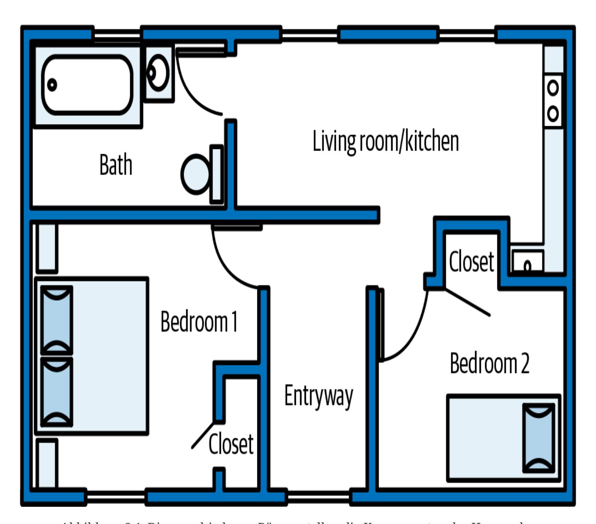

Abbildung 8-1. Die verschiedenen Räume stellen die Komponenten des Hauses dar

Auf die gleiche Weise stellen die Hauptfunktionen eines Systems die Komponenten dieses Systems dar, wie in [Abbildung](#page-2-0) 8-2 dargestellt. Wie die Zimmer eines Hauses erfüllt jede Komponente eine bestimmte Funktion, z. B. die Verwaltung des Lagerbestands, den Versand von Bestellungen oder die Bearbeitung von Zahlungen. Zusammen bilden sie das System. Jede Komponente enthält den Quellcode, der die jeweilige Geschäftsfunktion implementiert.

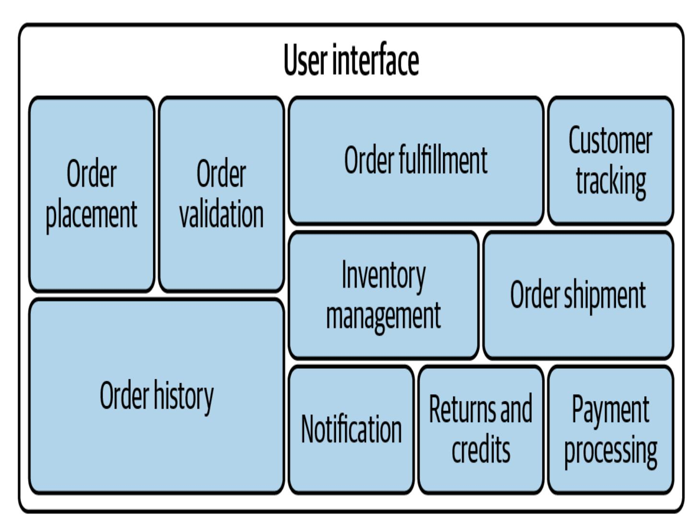

Abbildung 8-2. Die verschiedenen Hauptfunktionen stellen die Komponenten des Systems dar

Logische Komponenten in der Softwarearchitektur werden in der Regel durch einen Namensraum oder eine Verzeichnisstruktur manifestiert,

die den Quellcode enthält, der die jeweilige Funktionalität implementiert. In der Regel stellen die *Blattknoten* der Verzeichnisstruktur oder des Namensraums, die den Quellcode enthalten, die logischen Komponenten der Architektur dar, während die übergeordneten Verzeichnisse oder Namensraumknoten die Domänen und Subdomänen des Systems repräsentieren. In der in [Abbildung](#page-4-0) 8-3 dargestellten Verzeichnisstruktur steht der Verzeichnispfad *order\_entry/ordering/payment* für die Komponente Payment Processing und der Pfad *order\_entry/processing/fulfillment* für die Komponente Order Fulfillment . Der Quellcode, der den Verzeichnissen zugrunde liegt, implementiert diese logischen Komponenten.

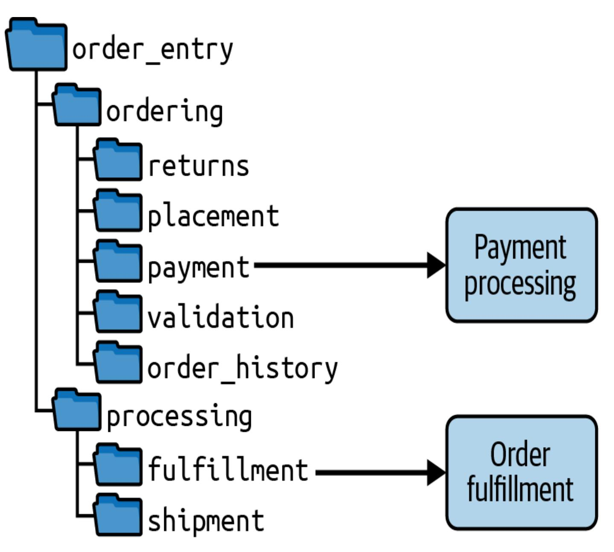

Abbildung 8-3. Die Blattknoten des Verzeichnisses stellen die Komponenten des Systems dar

Ein Architekt kann die Verzeichnisstrukturen oder Namensräume eines Softwaresystems analysieren, um seine interne Struktur zu verstehen mit anderen Worten, seine *logische Architektur*. Die Unterschiede zwischen logischen und physischen Architekturen werden im nächsten Abschnitt beschrieben.

## Logische versus physische Architektur

Eine *logische Architektur* besteht aus den logischen Komponenten (Bausteinen) eines Systems und wie sie miteinander interagieren. In der Regel zeigt sie auch ihre Interaktionen mit verschiedenen *Akteuren* (Benutzern, die mit dem System interagieren) und kann auch ein Repository (keine Datenbank) zeigen, um zu verdeutlichen, wo die Daten verwendet oder zwischen den Komponenten übertragen werden. [Abbildung](#page-6-0) 8-4 zeigt ein Beispiel für eine logische Architektur.

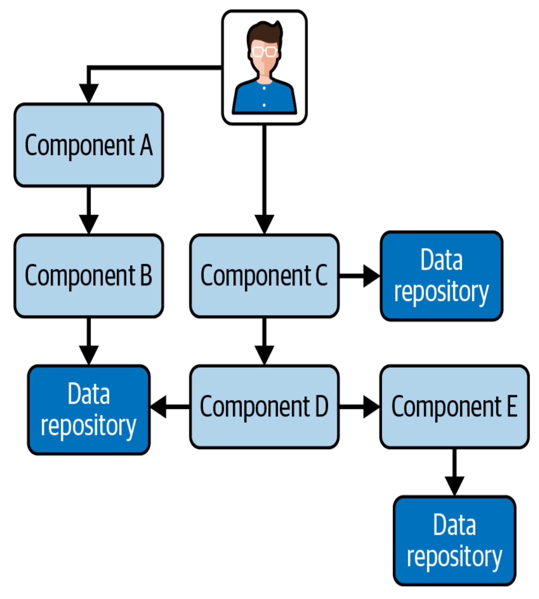

Abbildung 8-4. Diagramm einer logischen Architektur

Ein logisches Architekturdiagramm zeigt normalerweise keine Benutzeroberfläche, Datenbanken, Dienste oder andere physische Artefakte. Es zeigt vielmehr die logischen Komponenten und ihr

Zusammenspiel, das mit den Verzeichnisstrukturen und Namensräumen übereinstimmen sollte, in denen der Code organisiert ist.

Eine *physische Architektur* hingegen umfasst physische Artefakte wie Dienste, Benutzeroberflächen, Datenbanken usw. [Abbildung](#page-8-0) 8-5 ist ein Beispiel für ein physisches Architekturdiagramm.

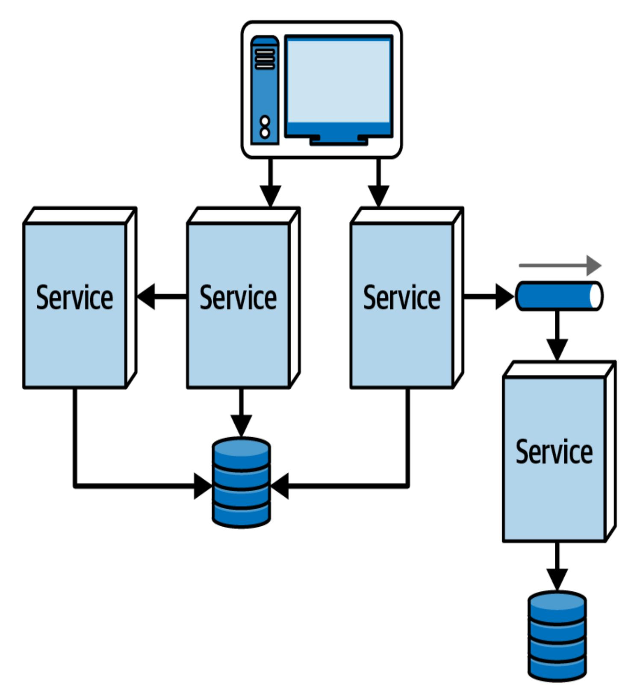

Abbildung 8-5. Diagramm einer physischen Architektur

Die physische Architektur des Systems sollte einem (oder mehreren) der vielen Architekturstile entsprechen, die in [Teil](#page--1-0) II dieses Buches

beschrieben werden: Microservices, Schichtenarchitektur, ereignisgesteuerte Architektur usw.

Viele Architekten entscheiden sich dafür, die Erstellung einer logischen Architektur zu umgehen und direkt mit einer physischen Architektur zu beginnen. Wir raten jedoch davon ab, denn eine physische Architektur zeigt nicht immer, wo sich die Funktionen des Systems befinden und wie sie zusammenpassen. In einer physischen Architektur können zum Beispiel die Funktionen zur Zahlungsabwicklung über mehrere Dienste verteilt sein, so dass es schwierig ist, zu erkennen, wie sie mit anderen Teilen des Systems zusammenhängen. Außerdem gibt eine physische Architektur den Entwicklungsteams keine Anhaltspunkte, wie sie ein monolithisches oder verteiltes System aufbauen oder den Code organisieren sollen. Das Ergebnis sind meist unstrukturierte Architekturen, die schwer zu warten, zu testen und einzusetzen sind.

Im Allgemeinen ist die logische Architektur eines Systems unabhängig von seiner physischen Architektur. Mit anderen Worten: Bei der Erstellung einer logischen Architektur liegt der Schwerpunkt eher darauf, was das System tut, wie diese Funktionalität abgegrenzt wird und wie die funktionalen Teile des Systems zusammenwirken, als auf seiner physischen Struktur. Der Architekt, der eine logische Architektur wie in [Abbildung](#page-6-0) 8-4 erstellt, hat zum Beispiel noch nicht entschieden, ob die Komponenten alle in einer monolithischen Architektur (eine einzige Bereitstellungseinheit) oder als Dienste (separate Bereitstellungseinheiten) bereitgestellt werden sollen.

## Erstellen einer logischen Architektur

Die Erstellung einer logischen Architektur erfordert eine kontinuierliche Identifizierung und Umstrukturierung der logischen Komponenten. Die *Identifizierung von Komponenten* funktioniert am besten in einem iterativen Prozess. Dabei werden die in Frage kommenden Komponenten erstellt und dann in einer Feedbackschleife verfeinert, wie in [Abbildung](#page-10-0) 8-6 dargestellt.

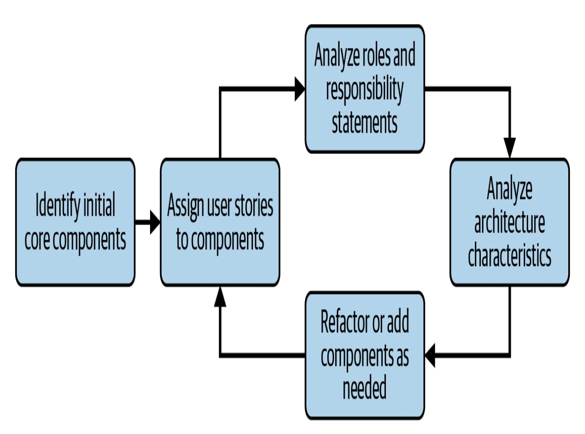

Abbildung 8-6. Der Komponentenidentifikations- und Refactoring-Zyklus

Die erste Aktivität eines Architekten bei der Entwicklung einer logischen Architektur besteht darin, die ersten Kernkomponenten zu identifizieren und ihnen dann User Stories oder Anforderungen zuzuordnen. Danach analysiert er die Rollen und Verantwortlichkeiten der Komponenten, um sicherzustellen, dass die ihnen zugewiesenen User Stories oder Anforderungen sinnvoll sind. Dann betrachtet der Architekt die architektonischen Merkmale, die das System unterstützen muss, und stellt fest, ob ein Refactoring erforderlich ist, um die Komponente auf der Grundlage dieser Merkmale möglicherweise aufzubrechen oder zu kombinieren. Schließlich kann der Architekt die Komponenten auf der Grundlage dieser Analyse verfeinern. Dieser Prozess ist eine Rückkopplungsschleife, die im Grunde nie aufhört.

Der Arbeitsablauf in [Abbildung](#page-10-0) 8-6 kann für neue Systeme verwendet werden oder immer dann, wenn eine Funktion im System hinzugefügt oder geändert wird. Nehmen wir zum Beispiel an, du musst ein Bestellsystem aktivieren, damit die Nutzer/innen die Artikel im Laden abholen können, anstatt sie sich nach Hause liefern zu lassen. Dazu muss ein Zeitplanungsprogramm hinzugefügt und der bestehende Bestellprozess geändert werden. Diese Änderung kann neue Komponenten, Änderungen an bestehenden Komponenten oder beides erfordern. Wenn sich Komponenten ändern, können sich auch ihre Aufgaben und Zuständigkeiten ändern, was dich dazu auffordert, deinen Code umzustrukturieren oder neue Komponenten dafür zu erstellen.

Wir beschreiben jeden dieser Schritte in den folgenden Abschnitten im Detail.

### **Identifizierung von Kernkomponenten**

Die Herausforderung beim Start einer neuen logischen Architektur (oder bei größeren Änderungen an einer bestehenden) besteht darin, die anfänglichen Kernkomponenten zu bestimmen. Ein Fehler, den viele Softwarearchitekten machen, ist, dass sie sich zu viel Mühe geben, um die ersten logischen Komponenten gleich beim ersten Mal perfekt zu machen. Ein besserer Ansatz ist es, auf der Grundlage der Kernfunktionen des Systems eine "beste Vermutung" darüber anzustellen, wie die anfänglichen Kernkomponenten aussehen könnten, und sie anhand der in [Abbildung](#page-10-0) 8-6 dargestellten Arbeitsschritte zu verfeinern. Mit anderen Worten: Es ist besser, die logischen Komponenten immer wieder zu überarbeiten, wenn du mehr über das System erfährst, als zu versuchen, alles beim ersten Mal perfekt zu machen, wenn du am wenigsten über das System und seine spezifischen Anforderungen weißt.

In den meisten Fällen muss der Architekt nicht alle (oder manchmal gar keine) Anforderungen und Spezifikationen des Systems kennen, um mit der Erstellung logischer Komponenten zu beginnen. In der Regel basieren die ersten Kernkomponenten auf den wichtigsten Aktionen, die die Benutzer/innen ausführen können, oder auf den wichtigsten Verarbeitungsabläufen des Systems.

Wir stellen uns die anfänglichen Kernkomponenten gerne als leere Eimer vor. Der Bucket hat keine Funktion, bis der Architekt ihn "füllt", d.h. der Komponente User Stories oder Anforderungen zuweist. Wie in [Abbildung](#page-13-0) 8-7 dargestellt, sollte der Komponentenname für die vorgeschlagene Rolle und Verantwortung stehen. Solange der Architekt ihr jedoch keine User Stories zuweist (der nächste Schritt im Arbeitsablauf), ist sie im Grunde nur ein Platzhalter - die beste Vermutung für einen funktionalen Baustein.

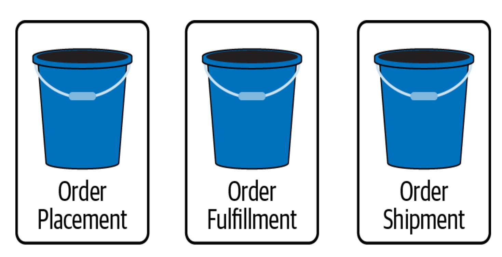

Abbildung 8-7. Am Anfang sind die ersten Komponenten wie leere Eimer

Die ersten beiden Ansätze (Workflow und Actor/Action) halten wir für nützlich, während wir vor dem dritten Ansatz (Entity Trap) warnen.

### **Der Workflow-Ansatz**

Ein gängiger Ansatz, den Architekten zur Identifizierung der ersten Kernkomponenten einer logischen Architektur verwenden, ist der *Workflow-Ansatz*. Wie der Name schon sagt, nutzt dieser Ansatz die wichtigsten fehlerfreien Arbeitsabläufe, die ein Benutzer durch das System (oder den Hauptarbeitsablauf bei der Bearbeitung von Anfragen) durchlaufen könnte. Wenn der Architekt ein Gefühl für den allgemeinen Ablauf hat, kann er Komponenten entwickeln, die auf diesen Schritten basieren.

Nehmen wir zum Beispiel an, du baust ein neues

Auftragserfassungssystem für dein Unternehmen. Du kennst die spezifischen Anforderungen und Spezifikationen noch nicht, aber du kennst zumindest den allgemeinen Arbeitsablauf für die Bearbeitung einer neuen Bestellung. Du kannst also jedem Schritt im Arbeitsablauf eine Komponente zuordnen:

- 1. Der Benutzer durchsucht den Katalog der Artikel → Item Browser
- 2. Der Nutzer gibt eine Bestellung auf → Order Placement
- 3. Nutzer zahlt für die Bestellung → Order Payment
- 4. Sende dem Benutzer eine E-Mail mit den Bestelldaten → Customer Notification
- 5. Bereite die Bestellung → vor Order Fulfillment
- 6. Verschicke die Bestellung →. Order Shipment
- 7. E-Mail an den Kunden, dass die Bestellung versandt wurde → Customer Notification
- 8. Verfolgung der Sendung → Order Tracking

Bei der Workflow-Methode führt nicht jeder Schritt im Haupt-Workflow zu einer neuen Komponente. Im obigen Workflow verwenden die Schritte 4 und 7 beide die Komponente Customer Notification . Der Architekt modelliert so viele Haupt-Workflows oder User Journeys wie möglich für das System und identifiziert die entsprechenden Komponenten für diese Schritte.

Auch hier handelt es sich nur um eine "beste Schätzung", wie die logische Architektur aussehen könnte. Diese Komponenten stellen leere Eimer dar und haben noch keine Zuständigkeiten. Sie werden sich also wahrscheinlich im Laufe der Entwicklung ändern (wie in [Abbildung](#page-10-0) 8-6 dargestellt). Das ist völlig normal und gehört zur iterativen Natur der Softwarearchitektur. Mach dir keine Gedanken darüber, wie du jeden Arbeitsablauf in deinem System modellieren kannst. Konzentriere dich stattdessen auf die wichtigsten Arbeitsabläufe. Der Rest wird sich entwickeln, wenn du mehr über das System erfährst und anfängst, User Stories und Anforderungen zu sammeln.

### **Der Akteur/Aktionsansatz**

Eine weitere Möglichkeit für Architekten, erste Kernkomponenten zu identifizieren, ist der *Akteur/Aktionsansatz*. Dieser Ansatz ist besonders nützlich, wenn ein System mehrere Akteure hat. Bei diesem Ansatz identifiziert der Architekt die wichtigsten Aktionen, die ein Nutzer im System ausführen kann (z. B. eine Bestellung aufgeben). Das System selbst ist immer auch ein Akteur, der automatisierte Funktionen wie die Rechnungsstellung und das Auffüllen der Lagerbestände durchführt.

In unserem Beispiel des Auftragseingabesystems könnte ein Architekt drei Akteure identifizieren: den *Kunden*, den *Auftragspacker* (die Person, die den Karton verpackt und ihn zum Versand bringt) und das *System*. Der Architekt identifiziert dann die wichtigsten Aktionen, die jeder dieser Akteure durchführt, und ordnet diesen Aktionen Komponenten zu:

### *Kunde Schauspieler*

- Suche nach Artikeln → Item Search
- Details zu einem Artikel anzeigen → Item Details
- Einen Auftrag erteilen → Order Placement
- Einen Auftrag stornieren → Order Cancel
- Registriere dich als neuer Kunde → Customer Registration
- Kundeninformationen aktualisieren → Customer Profile

#### *Packer Schauspieler bestellen*

- Wähle die Boxgröße →. Order Fulfillment
- Markiere die Bestellung als versandbereit → Order Fulfillment
- Versende die Bestellung an den Kunden → Order Shipment

#### *Systemakteur*

- Bestand anpassen → Inventory Management
- Mehr Bestand beim Lieferanten bestellen → Supplier Ordering
- Zahlung → anwenden Order Payment

Wie beim Workflow-Ansatz hat nicht jede Aktion notwendigerweise ihre eigene Komponente. Zum Beispiel werden die Auswahl der Kartongröße

für die Bestellung und die Kennzeichnung der Versandbereitschaft beide von der Komponente Order Fulfillment erledigt.

Im Allgemeinen erzeugt der Actor/Action-Ansatz mehr Komponenten als der Workflow-Ansatz, je nachdem, wie viele wichtige Workflows der Architekt modellieren möchte. Bei beiden Ansätzen kann der Architekt jedoch die ersten Kernkomponenten und deren Kommunikation identifizieren, noch bevor er detaillierte Anforderungen oder Spezifikationen erhält.

### **Die Entitätsfalle**

Für einen Architekten ist es nur allzu verlockend, sich bei der Identifizierung von Komponenten auf die Entitäten zu konzentrieren, die mit dem System verbunden sind, und dann Komponenten von diesen Entitäten abzuleiten. In einem typischen Auftragseingabesystem könntest du zum Beispiel Customer , Item und Order als die wichtigsten Entitäten des Systems identifizieren und dementsprechend eine Customer Manager Komponente, eine Item Manager Komponente und eine Order Manager Komponente erstellen. Von diesem Ansatz raten wir aus den folgenden Gründen dringend ab.

Erstens sind die Namen der logischen Komponenten mehrdeutig und beschreiben nicht die Rolle der Komponente. Wenn du zum Beispiel fragst, was die Komponente Order Manager macht, wenn du nur auf den Namen schaust, erhältst du die nutzlose Antwort "sie verwaltet Bestellungen", was nichts über ihre spezifische Rolle oder Verantwortung im System aussagt. Vergleicht man dies mit einem

Komponentennamen wie Validate Order , wird die Bedeutung eines guten, beschreibenden Komponentennamens deutlich. Wenn ein Komponentenname ein Suffix wie Manager , Supervisor , Controller , Handler , Engine oder Processor enthält, ist das ein guter Indikator dafür, dass der Architekt in das Antipattern "Entity Trap" verwickelt sein könnte.

Zweitens werden Komponenten zur Müllhalde für domänenbezogene Funktionalitäten. Betrachte eine entitätsbasierte Komponente mit dem Namen Order Manager , wie in [Abbildung](#page-19-0) 8-8 dargestellt. Jede einzelne Bestellfunktionalität würde in dieser Komponente enthalten sein: Bestellungsprüfung, Bestellungsaufgabe, Bestellungshistorie, Ausführung der Bestellung, Versand der Bestellung, Nachverfolgung der Bestellung und so weiter. Im Grunde ist es wie bei den "Spülbecken"- Utility-Klassen, die jeder Entwickler mindestens einmal in seiner Karriere geschrieben hat, mit Dutzenden von Methoden, die Zeichenketten, Daten, Zeitberechnungen und was auch immer der Entwickler sonst noch einbauen kann, bearbeiten.

Drittens: Wenn Komponenten zu grobkörnig werden, tun sie zu viel und verlieren ihren Zweck. Anstatt feinkörnig zu sein und nur einen Zweck zu erfüllen (wie im Beispiel der Komponente Validate Order ), können Komponenten zu groß werden. Solche Komponenten sind schwer zu warten, zu testen und einzusetzen und daher nicht sehr zuverlässig.

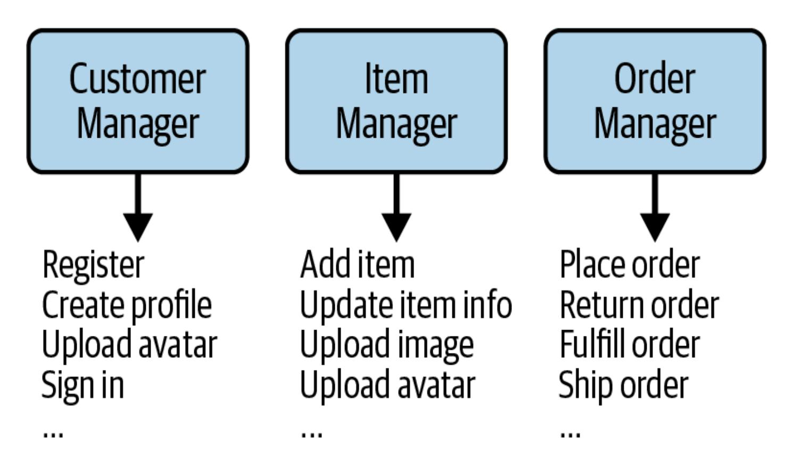

Abbildung 8-8. Die Verwendung des Antipatterns Entity Trap erzeugt Komponenten mit zu viel Verantwortung

Wenn ein Architekt ein System baut, das wirklich auf Entitäten basiert und lediglich CRUD-basierte Operationen (Erstellen, Lesen, Aktualisieren und Löschen) mit diesen Entitäten durchführt, dann braucht das System keine Architektur, sondern eher ein CRUD-basiertes Framework, Tool oder eine No-Code/Low-Code-Umgebung, die es den Entwicklern ermöglicht, den meisten Quellcode zu generieren, der auf diese Entitäten wirkt .

### **Zuweisung von User Stories zu Komponenten**

Der nächste Schritt bei der Erstellung einer logischen Architektur ist die Zuordnung von Benutzergeschichten oder Anforderungen zu den logischen Komponenten. Dies ist ein iterativer Prozess, denn die meisten User Stories oder Anforderungen sind im Vorfeld nicht vollständig bekannt; sie entwickeln sich mit der Entwicklung des Systems. Dieser Schritt dient dazu, die leeren Bereiche zu füllen und den Komponenten bestimmte Rollen und Verantwortlichkeiten zuzuweisen, wie in [Abbildung](#page-20-0) 8-9 dargestellt.

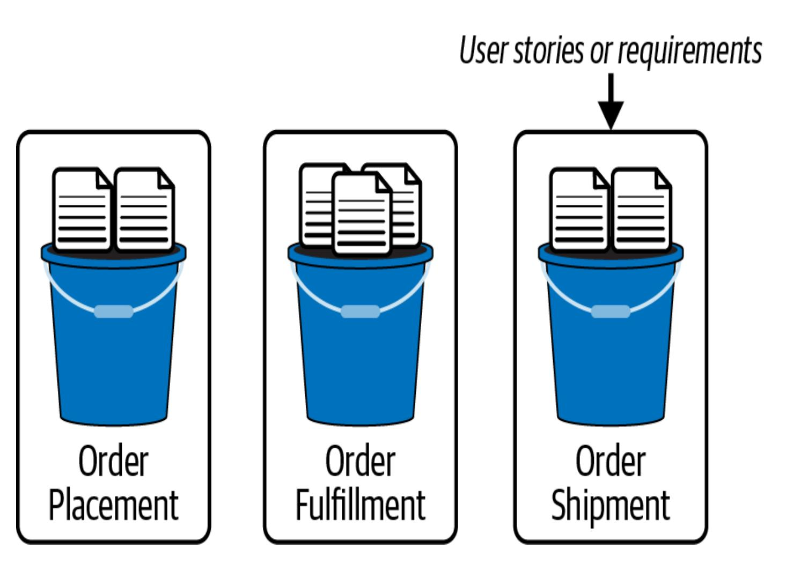

Abbildung 8-9. Auffüllen der leeren Eimer (Komponenten) mit User Stories oder Anforderungen

Um zu sehen, wie sich logische Komponenten entwickeln, betrachte die folgenden User Stories:

*Kunde #1*

Als Kunde möchte ich meine Bestellung validieren lassen, um sicherzugehen, dass ich alles vollständig und richtig eingegeben habe.

### *Auftragsvorbereiter*

Als die Person, die die Bestellung vorbereitet, würde ich gerne wissen, welche Kartongröße ich für die Bestellung verwenden soll, damit ich sie so effizient wie möglich verpacken kann.

### *Kunde #2*

Als Kunde möchte ich jedes Mal eine E-Mail erhalten, wenn sich der Bestellstatus ändert, damit ich immer weiß, wie es um meine Bestellung steht.

Angenommen, der Architekt hat bisher die folgenden logischen Komponenten identifiziert:

- Order Placement
- Order Fulfillment
- Order Shipment
- Inventory Management

Es ist sinnvoll, die erste User Story der Komponente Order Placement zuzuweisen, da dies die Komponente ist, mit der der Benutzer interagiert, um die Bestellung aufzugeben:

*Bestätige die Bestellung (User Story Kunde 1) → Order Placement*

Die Bestimmung der Kartongröße sollte wahrscheinlich von der Komponente Order Fulfillment übernommen werden, da sie für die gesamte Systemlogik verantwortlich ist, die zum Vorbereiten und Verpacken der Bestellung in einem Karton benötigt wird:

*Bestimme die Größe der Box (User Story des Bestellvorbereiters) → Order Fulfillment*

Aber was ist mit der dritten User Story? Welche der vier aufgeführten Komponenten soll E-Mails an den Kunden senden, wenn die Bestellung aufgegeben wurde, versandfertig ist und versandt wurde? Die Antwort könnte die Komponenten Order Placement , Order Fulfillment und Order Shipment sein. Bedenke aber, dass die User Story durch Quellcode implementiert wird, der sich in einem bestimmten Verzeichnis oder Namensraum befinden muss. Da es keine gute Idee wäre, den Code auf drei Komponenten zu verteilen, muss der Architekt eine neue Komponente definieren, die diese User Story behandelt:

*E-Mail-Kunde (User Story Kunde #2) → Customer Notification (neu)*

Die Komponenten Order Placement , Order Fulfillment und Order Shipment müssen mit der neuen Komponente kommunizieren, um ihr mitzuteilen, dass sie eine E-Mail senden soll. Mit dieser Ergänzung sieht die logische Architektur nun wie in [Abbildung](#page-23-0) 8-10 aus.

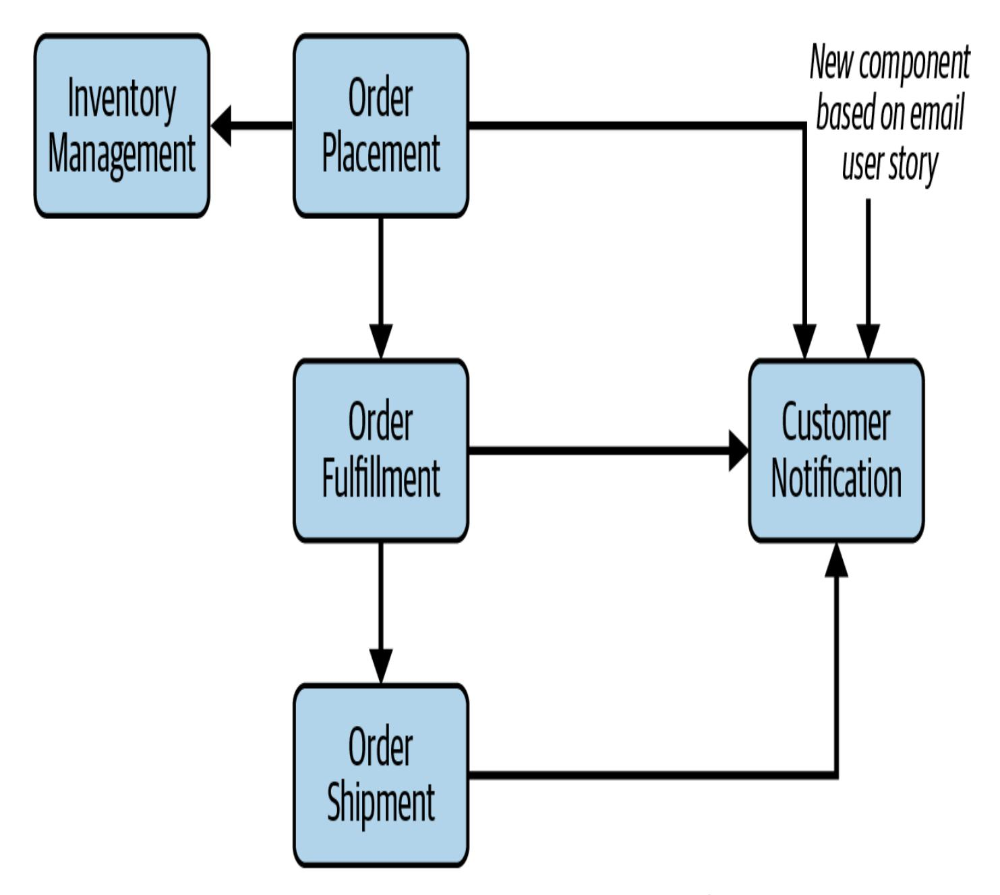

Abbildung 8-10. Entwicklung von Komponenten basierend auf neuen User Stories

### **Analyse der Rollen und Verantwortlichkeiten**

Der nächste Schritt bei der Verfeinerung der logischen Komponenten ist die Analyse der Rollen und Verantwortlichkeiten der einzelnen Komponenten. So stellt der Architekt sicher, dass die Anforderungen oder User Stories, die diesen Komponenten zugewiesen wurden, auch dorthin gehören und dass die Komponenten nicht zu viel tun. In diesem

Schritt geht es dem Architekten um den *Zusammenhalt*: wie und in welchem Umfang die Vorgänge einer Komponente miteinander verbunden sind. Im Laufe der Zeit können Komponenten zu groß werden, auch wenn ihre Aufgaben alle miteinander verbunden sind.

Um zu veranschaulichen, wie dieser Schritt funktioniert, nehmen wir an, dass der Architekt der Komponente Order Placement die folgenden Anforderungen zugewiesen hat:

- Überprüfe die Bestellung, um sicherzustellen, dass alle Felder korrekt ausgefüllt wurden.
- Zeige den Einkaufswagen mit den Artikelbeschreibungen, Mengen und Preisen an.
- Bestimme die richtige Lieferadresse.
- Sammle Zahlungsinformationen.
- Erstelle eine eindeutige Bestell-ID.
- Übernimm die Zahlung für die Bestellung.
- Passe die Bestandszahlen für die bestellten Artikel an.
- Sende dem Kunden eine Bestellzusammenfassung per E-Mail.

Wenn der Architekt eine Rollen- und Verantwortungserklärung für diese Komponente schreiben würde, würde sie wie folgt lauten:

*Diese Komponente ist für die Überprüfung der Bestellung und die Anzeige des gültigen Warenkorbs mit Artikelbild, Beschreibung, Menge und Preis verantwortlich. Diese Komponente ist auch dafür verantwortlich, die korrekte Lieferadresse für die Bestellung zu ermitteln und alle Zahlungsinformationen vom Kunden einzuholen. Außerdem ist sie dafür verantwortlich, die Zahlung durchzuführen, den Bestand anzupassen und dem Kunden eine E-Mail mit der Bestellübersicht zu schicken.*

Alle diese Vorgänge haben mit der Bestellung zu tun, aber die Komponente Order Placement übernimmt eindeutig zu viel Verantwortung, vor allem in Bezug auf die Zahlung, die Anpassung des Bestands und die E-Mail an den Kunden. Eine Möglichkeit, um zu erkennen, ob eine Komponente zu viel Verantwortung übernimmt, ist die Suche nach Konjunktivsätzen wie " *und"*, *"auch"*, " *zusätzlich"* oder "sowohl *als auch*" sowie die übermäßige Verwendung von Kommas.

Wie bereits erwähnt, wird eine logische Komponente durch einen Namensraum oder ein Verzeichnis im Code-Repository repräsentiert. Im Fall der Komponente Order Placement würde sich der *gesamte* Quellcode dieser Komponente in demselben Verzeichnis oder Namensraum befinden, z. B. *com/app/order/placement* oder *com.app.order.placement*. Das ist eine Menge an Funktionen wahrscheinlich zu viel Code für ein einziges Verzeichnis. Deshalb wäre es sinnvoll, die Klassendateien für die Zahlungsabwicklung, die Bestandsverwaltung und die E-Mail-Kommunikation in separate

Verzeichnisse für diese Funktionen aufzuteilen. Genau darum geht es bei der Trennung von logischen Komponenten.

Wenn der Architekt die Verantwortlichkeiten für die Zahlung, die Anpassung des Lagerbestands und das Versenden einer E-Mail an den Kunden auf separate Komponenten überträgt, kann er die Verantwortung der einzelnen Komponente Order Placement reduzieren, was die Wartung, das Testen und die Bereitstellung erleichtert. Die resultierenden Komponenten würden wie folgt aussehen:

#### *Order Placement*

- Überprüfe die Bestellung, um sicherzustellen, dass alle Felder korrekt ausgefüllt wurden.
- Zeige den Einkaufswagen mit den Artikelbeschreibungen, Mengen und Preisen an.
- Bestimme die richtige Lieferadresse.
- Sammle Zahlungsinformationen.
- Erstelle eine eindeutige Bestell-ID.

### *Payment Processing*

Zahlung anwenden.

### *Inventory Management*

Passe die Bestandszahlen für die bestellten Artikel an.

### *Customer Notification*

Sende dem Kunden eine Bestellzusammenfassung per E-Mail.

Jede Komponente hat jetzt eine klarere, deutlichere Rolle und Verantwortung.

### **Analysieren der architektonischen Merkmale**

Der letzte Analyseschritt besteht darin, die architektonischen Merkmale zu berücksichtigen, die das System benötigt. Einige Architektureigenschaften wie Skalierbarkeit, Zuverlässigkeit, Verfügbarkeit, Fehlertoleranz, Elastizität und Agilität (die Fähigkeit, schnell auf Veränderungen zu reagieren) können die Größe einer logischen Komponente beeinflussen.

Wenn du zum Beispiel eine größere Komponente (mit viel Verantwortung) in kleinere Komponenten aufteilst, ist jede einzelne leichter zu warten und zu testen (das ist Agilität) und bietet bessere Skalierbarkeit, Elastizität und Fehlertoleranz. Ein weiteres gutes Beispiel sind zwei Teile eines Systems, die mit Benutzereingaben umgehen: Wenn ein Teil mit Hunderten von gleichzeitigen Benutzern zu tun hat und der andere nur einige wenige gleichzeitig unterstützen muss, brauchen sie unterschiedliche Architekturmerkmale. Während eine rein funktionale Sichtweise des Komponentendesigns einen Architekten dazu veranlassen könnte, eine einzelne Komponente mit der Benutzerinteraktion zu betrauen, könnte die Analyse der Komponenten im Hinblick auf die Architekturmerkmale zu einer Unterteilung führen.

Da der Architekt die architektonischen Merkmale kennen muss, bevor er eine logische Architektur erstellen kann, erfolgt dies in der Regel *, nachdem* er bestimmt hat, welche architektonischen Merkmale für das System am wichtigsten sind.

### **Komponenten der Umstrukturierung**

Feedback ist beim Softwaredesign entscheidend. Architekten müssen ihre Komponentenentwürfe in Zusammenarbeit mit den Entwicklern ständig überarbeiten. Bei der Entwicklung von Software treten immer wieder unerwartete Schwierigkeiten auf. Daher ist ein iterativer Ansatz für das Komponentendesign entscheidend. Erstens ist es praktisch unmöglich, alle möglichen Entdeckungen und Kanten zu berücksichtigen, die zu einem neuen Design führen könnten. Zweitens: Je tiefer die Architektur und die Entwickler in die Entwicklung der Anwendung eintauchen, desto besser verstehen sie, wo die Verhaltensweisen und Rollen liegen sollten.

Architekten sollten damit rechnen, dass sie während des Lebenszyklus eines Systems oder Produkts häufig Komponenten umstrukturieren müssen - nicht nur bei neuen Systemen, sondern auch bei solchen, die häufig gewartet werden.

## Bauteil-Kopplung

Wenn Komponenten miteinander kommunizieren oder wenn eine Änderung an einer Komponente Auswirkungen auf andere Komponenten haben kann, spricht man von einer *Kopplung* der Komponenten. Je stärker die Komponenten eines Systems gekoppelt sind, desto schwieriger ist es, das System zu warten und zu testen (siehe [Abbildung](#page-30-0) 8-11). Deshalb ist es wichtig, der Kopplung große Aufmerksamkeit zu schenken.

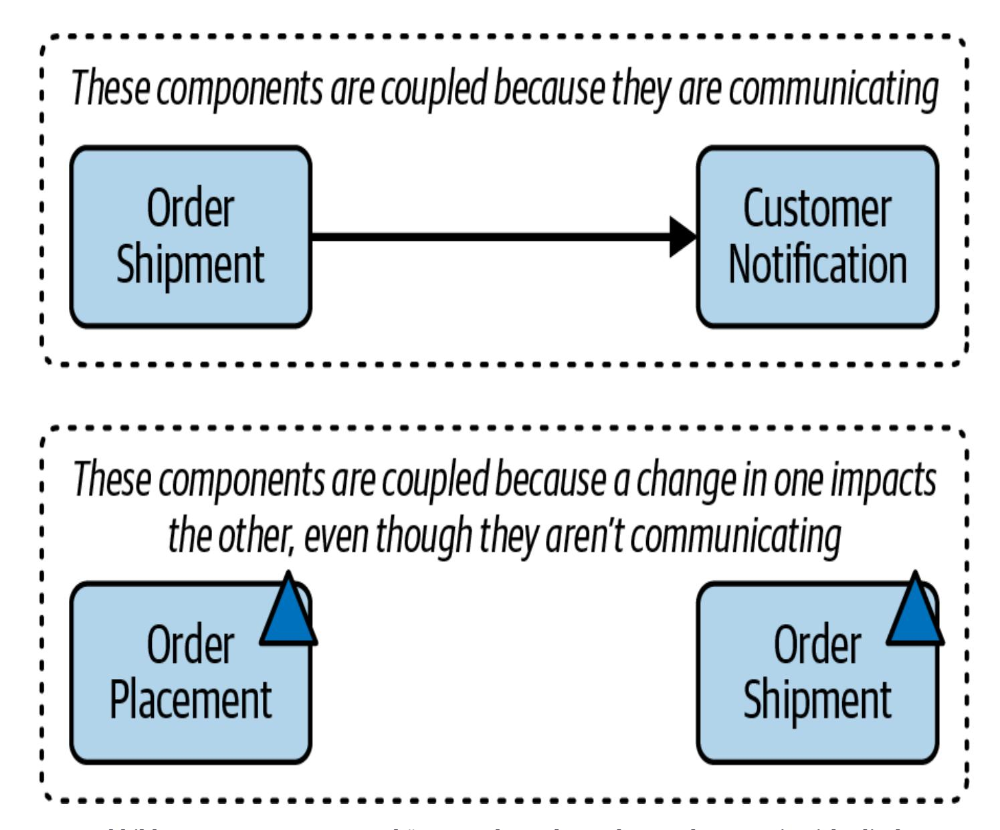

Abbildung 8-11. Komponenten können gekoppelt werden, auch wenn sie nicht direkt miteinander kommunizieren

### **Statische Kopplung**

*Statische Kopplung* liegt vor, wenn Komponenten synchron miteinander kommunizieren. Architekten müssen sich um zwei Arten von Kopplung kümmern: afferente und efferente.

Die*afferente Kopplung* (auch *Eingangs-* oder *Fan-in-Kopplung* genannt) ist das Ausmaß, in dem andere Komponenten von einer Zielkomponente

abhängen. Nehmen wir zum Beispiel die Komponente Customer Notification aus unserem Beispiel für die Auftragseingabe in [Abbildung](#page-31-0) 8-12. Um dem Kunden eine E-Mail zu schicken, müssen sowohl die Komponenten Order Placement als auch Order Shipment mit der Komponente Customer Notification kommunizieren. Das bedeutet, dass die Komponente Customer Notification mit den Komponenten Order Placement und Order Shipment *afferent gekoppelt* ist und einen afferenten Kopplungsgrad von 2 hat (die Anzahl der eingehenden Abhängigkeiten). Die afferente Kopplung wird normalerweise mit *CA* bezeichnet.

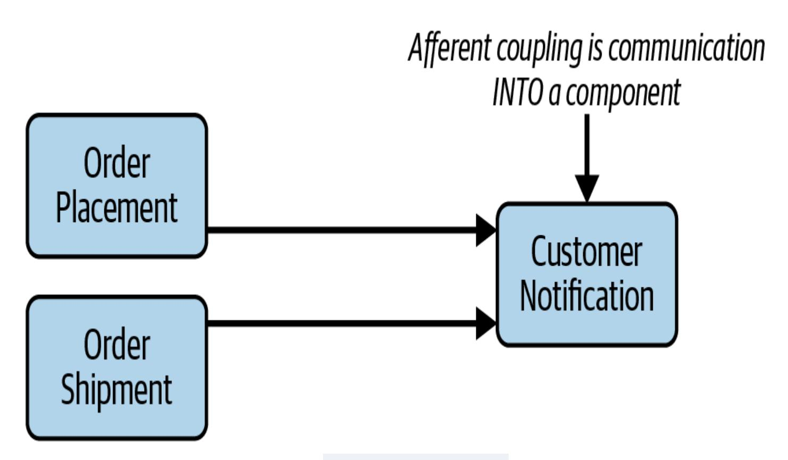

Abbildung 8-12. Die Komponente Customer Notification ist afferent mit den anderen Komponenten gekoppelt

Die*efferente Kopplung* (auch *Outgoing-* oder *Fan-Out-Kopplung* genannt) ist der Grad, in dem eine Zielkomponente von anderen Komponenten

abhängt. Wie in [Abbildung](#page-32-0) 8-13 dargestellt, ist die Komponente Order Placement beispielsweise von der Komponente Order Fulfillment abhängig und als solche efferent gekoppelt, d.h. sie hat einen efferenten Kopplungsgrad von 1 (die Anzahl der ausgehenden Abhängigkeiten). Die efferente Kopplung wird normalerweise mit *CE* bezeichnet.

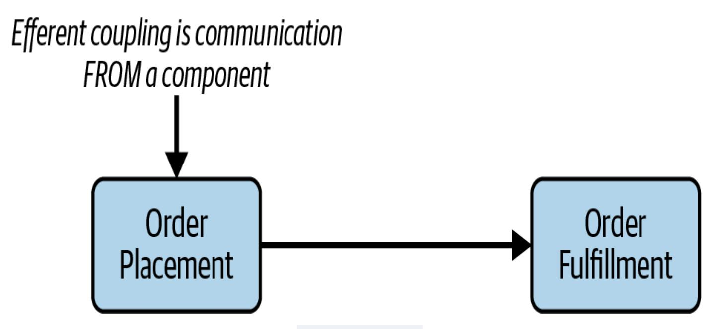

Abbildung 8-13. Die Komponente Order Placement ist efferent mit der Komponente Order gekoppelt. Fulfillment Komponente

### **Zeitliche Kopplung**

Die*zeitliche Kopplung* beschreibt nicht statische Abhängigkeiten, die in der Regel auf Zeitvorgaben oder *Transaktionen* (einzelne Arbeitseinheiten) basieren. Wenn das System z. B. eine Bestellung bearbeitet, muss die Funktionalität in der Komponente Order Placement vor der Funktionalität in der Komponente Order Shipment aufgerufen werden. Diese Komponenten werden daher als zeitlich gekoppelt bezeichnet.

Das Problem bei der zeitlichen Kopplung ist, dass sie mit den derzeit auf dem Markt erhältlichen Werkzeugen nur schwer zu erkennen ist. In den meisten Fällen wird diese Art der Kopplung stattdessen über die Entwurfsdokumente identifiziert oder durch Fehlerbedingungen aufgedeckt.

### **Das Gesetz der Demeter**

Den meisten Architekten wird gesagt, dass sie beim Systemdesign eine lose Kopplung anstreben sollen. Eine geringere Kopplung zwischen Komponenten oder Diensten macht ein System wartungsfreundlicher, einfacher zu testen und weniger riskant in der Anwendung. Außerdem erhöht sich die Gesamtzuverlässigkeit des Systems, da sich Änderungen auf weniger Komponenten auswirken und somit weniger Möglichkeiten für Fehler bestehen.

Eine Technik, um lose gekoppelte Systeme zu schaffen, ist das *Gesetz der Demeter*, auch bekannt als das *Prinzip des geringsten Wissens*. In der griechischen Mythologie produzierte die Göttin Demeter das gesamte Getreide für die ganze Welt, aber sie hatte keine Ahnung, was die Menschen damit machten (Vieh füttern, Brot backen und so weiter). Demeter war praktisch vom Rest der Welt abgekoppelt.

Das Gesetz von Demeter besagt: *Eine Komponente oder ein Dienst sollte nur begrenzte Kenntnisse über andere Komponenten oder Dienste haben.* Das klingt vielleicht einfach und offensichtlich, ist es aber nicht. Lass uns dir zeigen, was wir meinen.

Betrachte die in [Abbildung](#page-34-0) 8-14 dargestellten Komponenten und die dazugehörige Kommunikation. Wenn die Order Placement Komponente die Bestellung eines Kunden annimmt, muss sie der Inventory Management Komponente sagen, dass sie den Lagerbestand verringern soll. Wenn der Bestand zu niedrig ist, muss die Komponente Order Placement zwei Dinge tun: Sie muss der Komponente Supplier Ordering sagen, dass sie mehr Bestand beim Lieferanten bestellen soll, und sie muss der Komponente Item Pricing sagen, dass sie den Preis an das begrenzte Angebot anpassen soll. Wenn das alles erledigt ist, weist die Order Placement Komponente die Email Notification Komponente an, dem Kunden eine E-Mail mit den Bestelldaten zu schicken.

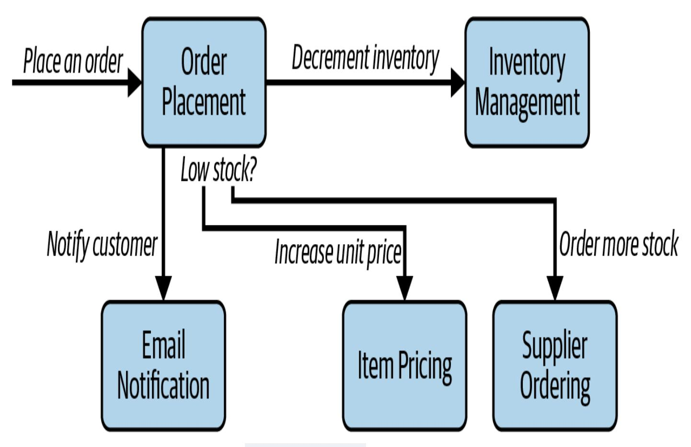

Abbildung 8-14. Die Komponente Order Placement ist stark mit dem Rest des Systems gekoppelt, weil sie zu viel Wissen hat

Beachte, dass die Komponente Order Placement in dieser Architektur stark mit den anderen Komponenten verbunden ist. Sie ist zwar nicht *für* die Durchführung der Aktionen *verantwortlich*, aber sie *weiß,* dass diese Aktionen durchgeführt werden müssen - und mehr Wissen bedeutet eine stärkere Kopplung.

Die Idee hinter dem Demeter-Gesetz ist es, das *Wissen* der einzelnen [Komponenten](#page-34-0) über den Rest des Systems zu begrenzen. In Abbildung 8- 14 weiß die Komponente Order Placement , dass der Bestand verringert werden muss, dass eventuell mehr Ware bestellt werden muss, dass der Artikelpreis angepasst werden muss und dass eine E-Mail an den Kunden gesendet werden muss. (Das ist eine Menge Wissen!) Aber was wäre, wenn dieses Wissen auf andere Komponenten verteilt werden könnte? Dann kann der Architekt diese Komponente effektiv vom Rest des Systems entkoppeln.

Um zu sehen, wie das Demeter-Gesetz angewendet werden kann, um die Kopplung von Komponenten zu reduzieren, schau dir das System in [Abbildung](#page-34-0) 8-14 an. Wenn der Architekt eine weitere Komponente zwischen Order Placement und Inventory Management hinzufügen würde, um das *Wissen*, dass der Bestand verringert werden muss, aufzuschieben, hätte die Komponente Order Placement immer noch den gleichen efferenten (ausgehenden) Kopplungsgrad. Daher muss dieser Kopplungspunktso bleiben, wie er ist.

Aber was ist mit dem Wissen, dass das System bei einem zu geringen Angebot mehr Vorrat bestellen und den Artikelpreis anpassen muss? Diese beiden Kenntnisse *können* auf die Komponente Inventory

Management verschoben werden, wodurch die Kopplungsebene der Komponente Order Placement reduziert wird. [Abbildung](#page-36-0) 8-15 zeigt die resultierende Architektur nach der Anwendung des Demeter-Gesetzes. Durch das Entfernen des *Wissens*, dass bestimmte Funktionen ausgeführt werden müssen, ist die Komponente Order Placement weniger stark mit dem Rest des Systems verbunden.

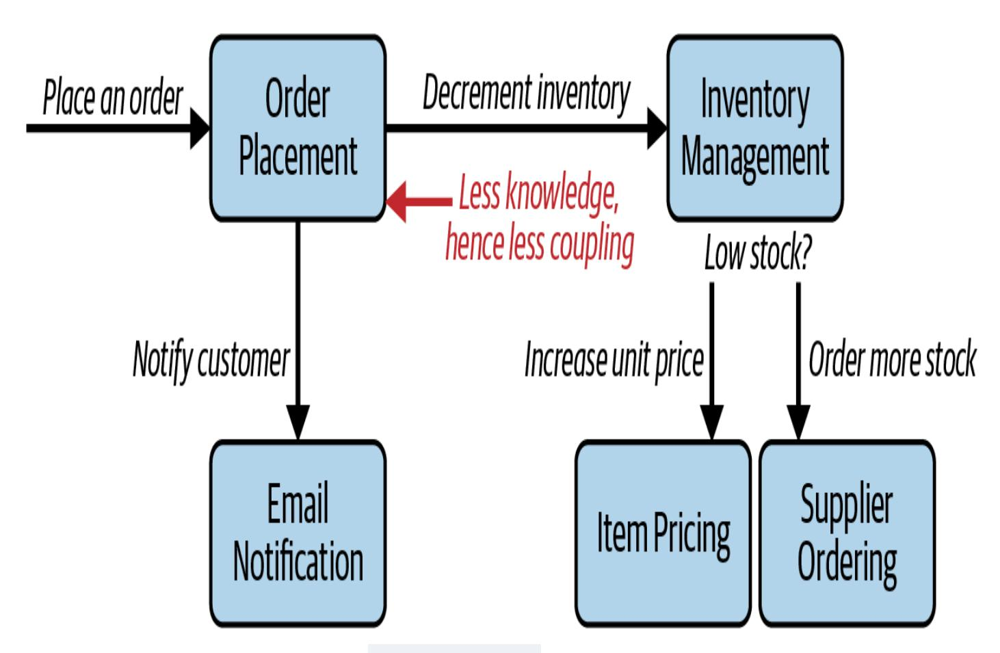

Abbildung 8-15. Die Komponente Order Placement ist weniger an das System gekoppelt, wenn sie weniger Wissen hat

Der aufmerksame Leser wird feststellen, dass die Anwendung des Demeter-Gesetzes zwar den Kopplungsgrad der Komponente Order Placement verringert, aber auch den Kopplungsgrad der Komponente Inventory Management *erhöht*. Die Anwendung des Demeter-Gesetzes führt nicht unbedingt zu einer Verringerung des systemweiten

Kopplungsgrads, sondern verteilt diesen in der Regel auf verschiedene Teile des Systems .

# Fallstudie: Going, Going, Gone - Komponenten entdecken

Wenn ein Team keine besonderen Einschränkungen hat und nach einer guten, allgemein anwendbaren Komponentenzerlegung sucht, eignet sich der Actor/Actions-Ansatz gut als allgemeine Lösung.

Wenn der Architekt den Akteur/Aktionsansatz auf Going, Going, Gone (GGG) anwendet, wird er feststellen, dass dieses System drei Hauptrollen hat: den *Bieter*, den *Auktionator* und das *System - ein*häufiger Teilnehmer in dieser Modellierungstechnik für interne Aktionen. Die Rollen interagieren mit dem System über die folgenden Hauptaktionen:

#### *Bidder*

- Live-Videostream ansehen.
- Sieh dir den Gebots-Livestream an.
- Gib ein Gebot ab.

#### *Auctioneer*

- Gib Live-Gebote in das System ein.
- Nimm Online-Gebote entgegen.

Markiere den Artikel als verkauft.

### *System*

- Starte die Auktion.
- Bezahle.
- Verfolge die Bieteraktivitäten.

Ausgehend von diesen Aktionen kann der Architekt eine Reihe von Startkomponenten für GGG erstellen und diese dann überarbeiten. Eine solche Lösung ist in [Abbildung](#page-39-0) 8-16 dargestellt.

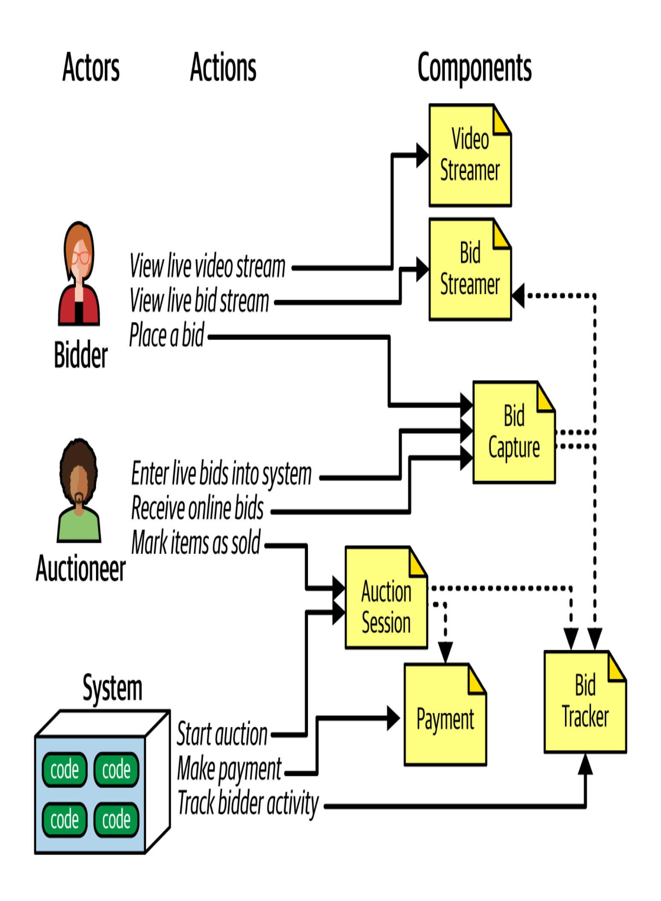

In [Abbildung](#page-39-0) 8-16 wird jede Rolle und Aktion einer Komponente zugeordnet. Die Komponenten müssen möglicherweise zusammenarbeiten, um Informationen auszutauschen. Das sind die Komponenten, die wir für diese Lösung ausgewählt haben:

#### *Video Streamer*

Streamt eine Live-Auktion zu den Nutzern.

#### *Bid Streamer*

Überträgt die Gebote an die Nutzer, sobald sie eingehen. Sowohl Video Streamer als auch Bid Streamer bieten Bietern eine Nur-Lese-Ansicht der Auktion.

### *Bid Capture*

Diese Komponente erfasst die Gebote des Auktionators und der Bieter.

### *Bid Tracker*

Verfolgt die Gebote und fungiert als System der Aufzeichnungen.

### *Auction Session*

Startet eine Auktion. Wenn der Bieter den Zuschlag erhält und die Auktion für diesen Artikel endet, löst diese Komponente die Zahlungsund Abwicklungsschritte aus, einschließlich der Benachrichtigung der Bieter über den nächsten zu versteigernden Artikel.

#### *Payment*

Ein dritter Zahlungsabwickler für Kreditkartenzahlungen.

Nach der ersten Runde der [Komponentenidentifikation](#page-10-0) (siehe Abbildung 8-6) analysiert der Architekt die zuvor identifizierten Architekturmerkmale, um festzustellen, ob eines von ihnen das Design der Komponente verändern wird. Der aktuelle Entwurf sieht zum Beispiel eine Bid Capture Komponente vor, um Gebote sowohl von Bietern als auch vom Auktionator zu erfassen. Das ist funktional sinnvoll: Gebote von allen können auf die gleiche Weise erfasst und verarbeitet werden. Aber welche zuvor identifizierten Architekturmerkmale sind für die Gebotserfassung erforderlich? Der Auktionator braucht nicht dasselbe Maß an Skalierbarkeit oder Elastizität wie die Bieter, deren Zahl in die Tausende gehen kann.

Ebenso kann es sein, dass der Auktionator bestimmte Merkmale der Architektur mehr braucht als andere Teile des Systems, wie z. B. Zuverlässigkeit (damit die Verbindung nicht abbricht) und Verfügbarkeit (damit das System verfügbar bleibt). Während es zum Beispiel schlecht für das Geschäft wäre, wenn sich ein Bieter nicht einloggen kann oder die Verbindung abbricht, wäre es für den Auktionator eine Katastrophe, wenn eines dieser Dinge passiert.

Um die unterschiedlichen Anforderungen der Bieter und des Auktionators an dieselben Architektureigenschaften zu unterstützen, beschließt der Architekt, die Komponente Bid Capture in zwei Komponenten aufzuteilen: Bid Capture und Auctioneer Capture . Der aktualisierte Entwurf ist in [Abbildung](#page-43-0) 8-17 dargestellt.

Der Architekt erstellt eine neue Komponente für Auctioneer Capture . Sie aktualisieren auch die Informationslinks von Auctioneer Capture

zu Bid Streamer (um den Online-Bietern die Live-Gebote zu zeigen) und Bid Tracker (um die Gebotsströme zu verwalten). Bid Tracker ist nun die Komponente, die zwei sehr unterschiedliche Informationsströme vereint: den einzelnen Informationsstrom des Auktionators und die verschiedenen Ströme der Bieter.

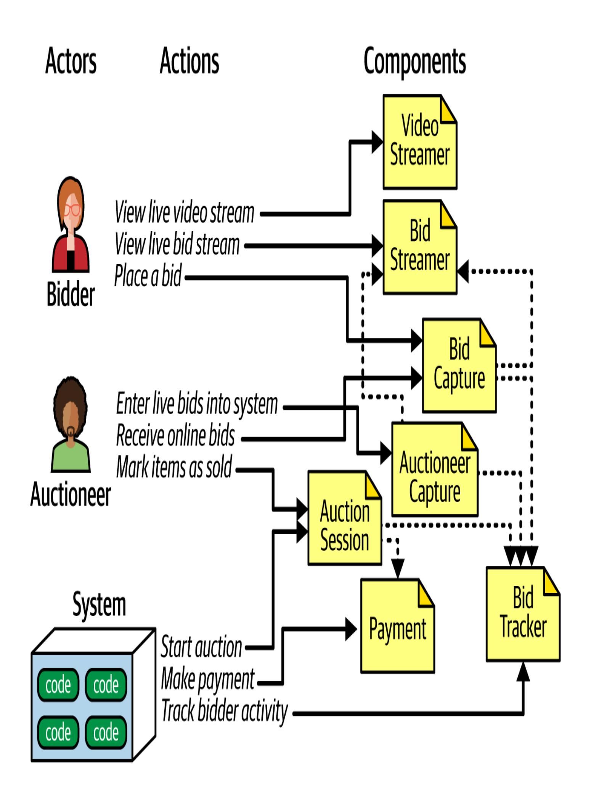

Der in [Abbildung](#page-43-0) 8-17 gezeigte Entwurf wird wahrscheinlich nicht der endgültige Entwurf sein. Es müssen noch weitere Anforderungen aufgedeckt werden: Wie werden neue Konten registriert, wie werden die Zahlungsfunktionen verwaltet und so weiter. Dieser Entwurf ist jedoch ein guter Ausgangspunkt für weitere Iterationen.

Dies ist ein möglicher Satz von Komponenten, um das GGG-Problem zu lösen - aber es ist nicht unbedingt die beste oder die einzige Lösung. Es gibt nur wenige Softwaresysteme, die nur auf eine Weise implementiert werden können. Bei jedem Entwurf gibt es eine Reihe von Kompromissen. Als Architekt solltest du dich nicht darauf versteifen, das "einzig wahre Design" zu finden, denn es gibt viele, die ausreichen. Versuche, die Kompromisse zwischen den verschiedenen Entwurfsentscheidungen so objektiv wie möglich zu bewerten, und entscheide dich für den Entwurf, der die "am wenigsten schlechten" Kompromisse aufweist.