# Kapitel 9. Fundamente

Diese Arbeit wurde mithilfe von KI übersetzt. Wir freuen uns über dein Feedback und deine Kommentare: [translation-feedback@oreilly.com](mailto:translation-feedback@oreilly.com)

Wir wissen, dass du unbedingt zu den Details der Architekturstile und muster kommen willst, aber zuerst müssen wir einige grundlegende und definitorische Dinge behandeln, um den richtigen Kontext für die späteren Kapitel zu schaffen.

# Stile statt Muster

Zunächst müssen wir zwischen *Architekturstilen* und *-mustern in der Architektur* unterscheiden, die leicht zu verwechseln sind.

Der Stil einer Architektur beschreibt verschiedene Merkmale dieser Architektur, wie z.B. ihre:

#### *Komponententopologie*

Ein Architekturstil legt fest, wie die Komponenten und ihre Abhängigkeiten organisiert sind. Bei einer Schichtenarchitektur werden die Komponenten beispielsweise nach ihren technischen Fähigkeiten gegliedert, während bei einem modularen Monolithen die Komponenten nach Domänen geordnet werden (mehr zu diesem Unterschied in ["Architekturaufteilung"\).](#page-13-0)

#### *Physikalische Architektur*

Oft diktiert der Stil die Art der physischen Architektur: entweder monolithisch oder verteilt. Ein modularer Monolith zum Beispiel ist in der Regel eine monolithische Architektur mit einer einzigen Datenbank, während eine ereignisgesteuerte Architektur immer verteilt ist.

#### *Einsatz*

Die Granularität eines Systems und seine Einsatzhäufigkeit sind oft mit seinem Architekturstil verbunden. Monolithische Architekturen werden in der Regel als Einzelimplementierung zusammen mit einer einzigen relationalen Datenbank bereitgestellt. Hochgradig agile verteilte Architekturen, wie z. B. Microservices, zeichnen sich dagegen durch eine automatisierte Integration, eine automatisierte Bereitstellung und manchmal auch durch eine automatisierte Bereitstellung aus; sie werden in der Regel stückweise und in einem viel schnelleren Rhythmus bereitgestellt.

#### *Kommunikationsstil*

Der Architekturstil bestimmt auch, wie die Komponenten miteinander kommunizieren. Monolithische Architekturen können Methodenaufrufe innerhalb des Monolithen tätigen, während verteilte Architekturen über Netzwerkprotokolle wie REST oder Message Queues kommunizieren.

#### *Datentopologie*

Genau wie die Komponententopologie wird auch die Datentopologie eines Systems oft durch seinen Architekturstil bestimmt.

Monolithische Architekturen haben in der Regel eine monolithische Datenbank, während bei verteilten Architekturen die Daten manchmal getrennt werden - abhängig von der Philosophie des Architekturstils.

Die Benennung eines Stils bietet eine prägnante Möglichkeit, diese komplexe Reihe von Faktoren zu beschreiben. Jeder Name fasst eine Fülle von Details zusammen - das ist einer der Zwecke von Entwurfsmustern. Während ein Muster jedoch eine kontextbezogene Lösung beschreibt, ist ein Stil spezifischer für die Architektur und beschreibt die oben genannten Aspekte. Ein Architekturstil beschreibt die Topologie der Architektur und ihre angenommenen und voreingestellten Eigenschaften, sowohl vorteilhafte als auch nachteilige. In [Kapitel](#page--1-0) 20 gehen wir auf einige gängige moderne Architekturmuster ein. Architekten sollten mit einigen grundlegenden Stilen vertraut sein, die die gemeinsamen Bausteine von Systemen darstellen.

#### **WOHER KOMMEN DIE ARCHITEKTONISCHEN STILE?**

Entgegen der landläufigen Meinung gibt es keine offizielle Architektenkammer, die sich in einem Elfenbeinturm trifft, um zu entscheiden, welche neuen Architekturstile als Nächstes kommen. Vielmehr ergeben sich neue Stile aus den sich ständig weiterentwickelnden Ökosystemen, in denen Architekten arbeiten.

Nehmen wir an, ein kluger Architekt stellt fest, dass eine neue Fähigkeit, die gerade im Ökosystem aufgetaucht ist, ein bestimmtes Problem löst, das ihm auf die Nerven geht. Er beschließt, sie mit mehreren anderen Dingen zu kombinieren, neuen und alten. Andere Architekten sehen diese clevere Lösung und kopieren sie. Sie wird so alltäglich, dass es einfacher wird, darüber zu sprechen, wenn man ihr einen Namen gibt.

Die Microservices-Architektur ist ein gutes Beispiel für dieses Phänomen. Das Aufkommen neuer DevOps-Funktionen, zuverlässiger Open-Source-Betriebssysteme und der domänenorientierten Designphilosophie ermöglichte es Architekten, Systeme auf neue Weise zu bauen, um Probleme wie Skalierbarkeit zu lösen. Der Name *Microservices* entstand als Reaktion auf die damals üblichen Architekturstile, die große Dienste und eine umfangreiche Orchestrierung vorsahen. Microservices ist eine Bezeichnung, keine Beschreibung. Es ist kein Gebot für Teams, die kleinstmöglichen Dienste zu bauen, sondern eine Bezeichnung für den Architekturstil.

# Grundlegende Muster

Einige grundlegende Muster tauchen in der Geschichte der Softwarearchitektur immer wieder auf, weil sie im Allgemeinen eine nützliche Perspektive für die Organisation von Code, Implementierungen oder anderen Aspekten der Architektur bieten. So ist zum Beispiel das Konzept der Schichten, die verschiedene Anliegen auf der Grundlage der Funktionalität voneinander trennen, so alt wie die Software selbst. Dennoch treten Schichten (sowohl in Stilen als auch in Mustern) weiterhin in verschiedenen Formen auf, einschließlich der modernen Varianten, die wir in [Kapitel](#page--1-0) 10 besprechen.

Leider gibt es noch ein weiteres gängiges Muster, das aus dem Fehlen einer Architektur resultiert: der Big Ball of Mud.

### **Großer Ball aus Schlamm**

Architekten bezeichnen das Fehlen einer erkennbaren Architekturstruktur als *Big Ball of Mud*, benannt nach dem Antipattern, das Brian Foote und Joseph Yoder in einem 1997 auf der Konferenz über Patterns Languages of Programs vorgestellten Papier definiert haben.

*Ein Big Ball of Mud ist ein planlos strukturierter, ausufernder, schlampiger Spaghetti-Code-Dschungel, der mit Klebeband und Drähten zusammengehalten wird. Diese Systeme zeigen unverkennbare Anzeichen von unkontrolliertem Wachstum und wiederholten, zweckmäßigen Reparaturen. Informationen werden munter zwischen weit entfernten Elementen des Systems ausgetauscht, was oft so weit geht, dass fast alle wichtigen Informationen global oder doppelt vorhanden sind.*

*Die Gesamtstruktur des Systems wurde vielleicht nie genau definiert.*

*Wenn das der Fall war, ist er vielleicht bis zur Unkenntlichkeit ausgehöhlt worden. Programmierer mit einem Funken architektonischer Sensibilität meiden diese Sumpfgebiete. Nur diejenigen, die sich nicht um Architektur scheren und denen die Trägheit des täglichen Flickens der Löcher in diesen fehlschlagenden Deichen nichts ausmacht, arbeiten gerne an solchen Systemen.*

Heute könnte *Big Ball of Mud* eine einfache Skriptanwendung ohne wirkliche interne Struktur beschreiben, deren Event-Handler direkt mit Datenbankaufrufen verknüpft sind. Viele triviale Anwendungen fangen so an und werden dann unhandlich, wenn sie wachsen.

Generell solltest du diese Art von Architektur auf jeden Fall vermeiden. Ihre fehlende Struktur macht Änderungen immer schwieriger. Solche Architekturen leiden auch unter Problemen bei der Bereitstellung, Testbarkeit, Skalierbarkeit und Leistung. Je größer diese Systeme

werden, desto schlimmer werden die Probleme, die durch ihre fehlende Architektur verursacht werden.

Leider kommt dieses Verhaltensmuster in der Praxis recht häufig vor. Nur wenige Architekten haben die Absicht, ein Chaos zu schaffen, aber viele Projekte schaffen es ungewollt, meist wegen mangelnder Kontrolle über die Codequalität und -struktur. Neal hat zum Beispiel an einem Kundenprojekt gearbeitet, dessen Struktur in [Abbildung](#page-7-0) 9-1 dargestellt ist.

Der Kunde (dessen Name aus offensichtlichen Gründen nicht genannt wird) hat über mehrere Jahre hinweg so schnell wie möglich eine Javabasierte Webanwendung erstellt. Die technische Visualisierung in [Abbildung](#page-7-0) 9-1 zeigt die Kopplung: Jeder Punkt am Rand des Kreises steht für eine Klasse, und jede Linie stellt eine Verbindung zwischen den Klassen dar, wobei fettere Linien für stärkere Verbindungen stehen. Wenn in dieser Codebasis eine Klasse geändert wird, ist es schwierig, die Auswirkungen auf andere Klassen vorherzusagen, was Änderungen zu einer beängstigenden Angelegenheit macht.

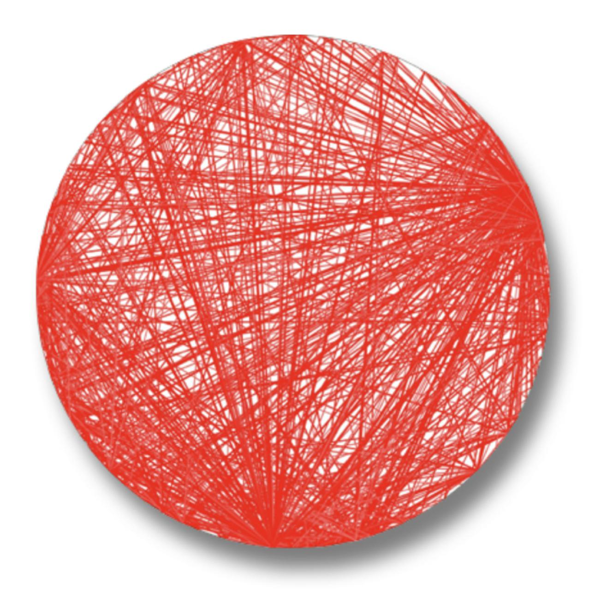

Abbildung 9-1. Eine Big Ball of Mud-Architektur, visualisiert anhand einer echten Codebasis. (Erstellt mit einem inzwischen eingestellten Tool namens XRay, einem Eclipse-Plug-in).

Das Problem mit Big Ball of Mud-Architekturen ist nicht nur ihre mangelnde Struktur. Da alles mit allem verbunden ist, haben Änderungen oft schwer vorhersehbare Nebeneffekte, die sich ausbreiten. Dieses Problem kann einen kritischen Punkt erreichen, an dem die Entwickler/innen ihre ganze Zeit damit verbringen, Bugs und deren Nebenwirkungen zu jagen, anstatt an neuen Funktionen zu arbeiten.

## **Einheitliche Architektur**

Am Anfang gab es nur den Computer und die Software, die auf ihm lief. Die beiden waren zunächst eine Einheit und wurden dann im Laufe der Entwicklung und mit dem Bedarf an immer ausgefeilteren Funktionen aufgeteilt. Großrechner zum Beispiel waren anfangs ein einziges System, dann wurden die Daten nach und nach in eine eigene Art von System aufgeteilt. Auch bei der Entwicklung von Personalcomputern (PCs) lag der Schwerpunkt zunächst auf Einzelgeräten. Als sich die Vernetzung von PCs durchsetzte, kamen verteilte Systeme (wie Client/Server) auf.

### **Client/Server**

Außerhalb von eingebetteten Systemen und anderen stark eingeschränkten Umgebungen gibt es nur wenige einheitliche Architekturen. Im Allgemeinen neigen Softwaresysteme dazu, im Laufe der Zeit weitere Funktionen hinzuzufügen, so dass eine Trennung der Bereiche notwendig wird, um die Eigenschaften der Architektur, wie Leistung und Skalierbarkeit, aufrechtzuerhalten.

Viele Architekturstile befassen sich damit, wie man Teile des Systems effizient voneinander trennen kann. Ein grundlegender Architekturstil trennt die technischen Funktionen zwischen Frontend und Backend: Dies wird als *zweistufige* oder *Client/Server-Architektur* bezeichnet. Es gibt sie in verschiedenen Varianten, je nach Zeitalter und Rechenleistung des Systems.

### **Desktop und Datenbankserver**

Eine frühe PC-Architektur ermutigte Entwickler dazu, umfangreiche Desktop-Anwendungen in Benutzeroberflächen wie Windows zu schreiben und die Daten in einem separaten Datenbankserver zu speichern. Diese Architektur fiel mit dem Aufkommen von eigenständigen Datenbankservern zusammen, die über Standard-Netzwerkprotokolle verbunden werden konnten. So konnte die Präsentationslogik auf dem Desktop untergebracht werden, während die rechenintensiveren Aktionen (sowohl hinsichtlich des Umfangs als auch der Komplexität) auf robusteren Datenbankservern stattfanden.

#### **Browser und Webserver**

Als die moderne Webentwicklung aufkam, wurde es üblich, die Architekturen in einen Webbrowser aufzuteilen, der mit einem Webserver verbunden ist (der wiederum mit einem Datenbankserver verbunden ist). Diese Trennung der Zuständigkeiten ähnelte der Desktop-Variante, aber mit noch dünneren Clients als Browsern, die eine größere Verbreitung sowohl innerhalb als auch außerhalb von Firewalls ermöglichten. Auch wenn die Datenbank vom Webserver getrennt ist, betrachten viele Architekten diese Architektur immer noch als zweistufig, weil die Web- und Datenbankserver auf einer Klasse von Rechnern in der Betriebszentrale laufen, während die Benutzeroberfläche auf dem Browser des Nutzers läuft.

### **Einseitige JavaScript-Anwendungen**

Mit der Verbesserung der Reaktionsfähigkeit des Internets wurden auch die JavaScript-Implementierungen in den Browsern verbessert. Es

entstand eine Familie von Anwendungen im Client/Server-Stil, die der ursprünglichen Desktop-Variante ähnelt, bei der der Rich Client jedoch in JavaScript im Browser und nicht als Desktop-Anwendung geschrieben wurde.

Wie dieser Abschnitt zeigt, wird es immer Schichten geben, die verschiedene Teile von Architekturen voneinander trennen, je nach den Bedürfnissen der Anwendung und den Möglichkeiten der Plattform.

#### **Dreistufig**

In den späten 1990er Jahren wurde die*dreistufige Architektur* populär, die eine noch stärkere Trennung zwischen den einzelnen Schichten ermöglichte. Als Tools wie Anwendungsserver in Java und .NET an Bedeutung gewannen, begannen Unternehmen, noch mehr Schichten in ihre Topologien einzubauen. Ein System kann aus einer Datenbankebene mit einem leistungsstarken Datenbankserver, einer Anwendungsebene, die von einem Anwendungsserver verwaltet wird, und einem Frontend bestehen, das in HTML und zunehmend auch in JavaScript programmiert ist (je mehr Möglichkeiten es gibt).

Die dreistufige Architektur entsprach Protokollen auf Netzwerkebene wie Common Object Request Broker [Architecture](https://www.corba.org/) (CORBA ) und Distributed [Component](https://oreil.ly/1TEqv) Object Model (DCOM ), um den Aufbau verteilter Architekturen zu erleichtern.

Genauso wie sich Entwickler heute keine Gedanken darüber machen, wie Netzwerkprotokolle wie TCP/IP funktionieren (weil sie einfach

funktionieren), müssen sich die meisten Architekten keine Gedanken über diese Art von Klempnerarbeit in verteilten Architekturen machen. Die Möglichkeiten, die die damaligen Werkzeuge boten, gibt es heute entweder als Werkzeuge (wie Nachrichtenwarteschlangen) oder als [Architekturmuster](#page--1-0) (wie die ereignisgesteuerte Architektur, die in Kapitel 15 behandelt wird).

#### **DREISTUFIGE ARCHITEKTUREN, SPRACHDESIGNUND LANGFRISTIGE AUSWIRKUNGEN**

In den 1990er Jahren, als die Sprache Java entwickelt wurde, war Three-Tier-Computing der letzte Schrei. Man ging davon aus, dass in Zukunft alle Systeme dreistufige Architekturen haben würden. Eine der häufigsten Schwierigkeiten bei den damals existierenden Sprachen, wie z. B. C++, bestand darin, dass es sehr mühsam war, Objekte auf konsistente Weise über das Netzwerk zwischen Systemen zu bewegen. Daher beschlossen die Entwickler von Java, diese Fähigkeit in den Kern der Sprache einzubauen, und zwar mit einem Mechanismus namens *Serialisierung*.

Jedes Java-Objekt implementiert eine Schnittstelle, die die Serialisierung unterstützt. Die Entwickler dachten, dass die dreistufige Architektur für immer bestehen würde und dass es sehr praktisch wäre, sie in die Sprache einzubauen. Natürlich kam und ging dieser Architekturstil doch die Überbleibsel sind bis heute in Java zu finden. Obwohl so gut wie niemand mehr die Serialisierung verwendet, müssen neue Java-Funktionen sie aus Gründen der Abwärtskompatibilität unterstützen, was die Sprachentwickler sehr frustriert.

Die langfristigen Auswirkungen von Design-Entscheidungen zu verstehen, ist uns schon immer entgangen, in der Softwareentwicklung genauso wie in anderen technischen Disziplinen. Der ständige Ratschlag, einfache Designs zu bevorzugen, ist in vielerlei Hinsicht eine zukunftssichernde Strategie.

# Architektur Partitionierung

Das erste Gesetz der Softwarearchitektur besagt, dass alles in der Software ein Kompromiss ist, auch die Art und Weise, wie Architekten Komponenten in einer Architektur aufteilen. Da Komponenten ein allgemeiner Eingrenzungsmechanismus sind, können Architekten sie nach Belieben aufteilen. Es gibt mehrere gängige Stile, die unterschiedliche Kompromisse beinhalten. Eine bestimmte Art der Komponentenanordnung hat einen besonders großen Einfluss: die *Partitionierung auf oberster Ebene*.

Von den beiden in [Abbildung](#page-14-0) 9-2 dargestellten Architekturstilen wird einer vielen bekannt sein: der *Schichtenmonolith* (der in [Kapitel](#page--1-0) 10 ausführlich behandelt wird). Der andere, der so genannte *modulare Monolith*, ist ein von Simon [Brown](https://simonbrown.je/) entwickelter Architekturstil, der aus einer einzigen Bereitstellungseinheit besteht, die mit einer Datenbank verbunden und nach Domänen und nicht nach technischen Fähigkeiten aufgeteilt ist (siehe [Kapitel](#page--1-0) 11). Diese beiden Stile stehen für unterschiedliche Methoden der Top-Level-Partitionierung. Beachte, dass bei beiden Varianten jede Top-Level-Schicht oder -Komponente wahrscheinlich andere Komponenten enthält. Die Partitionierung auf oberster Ebene ist für Architekten von besonderem Interesse, weil sie einen grundlegenden Architekturstil und eine Art der Partitionierung von Code definiert.

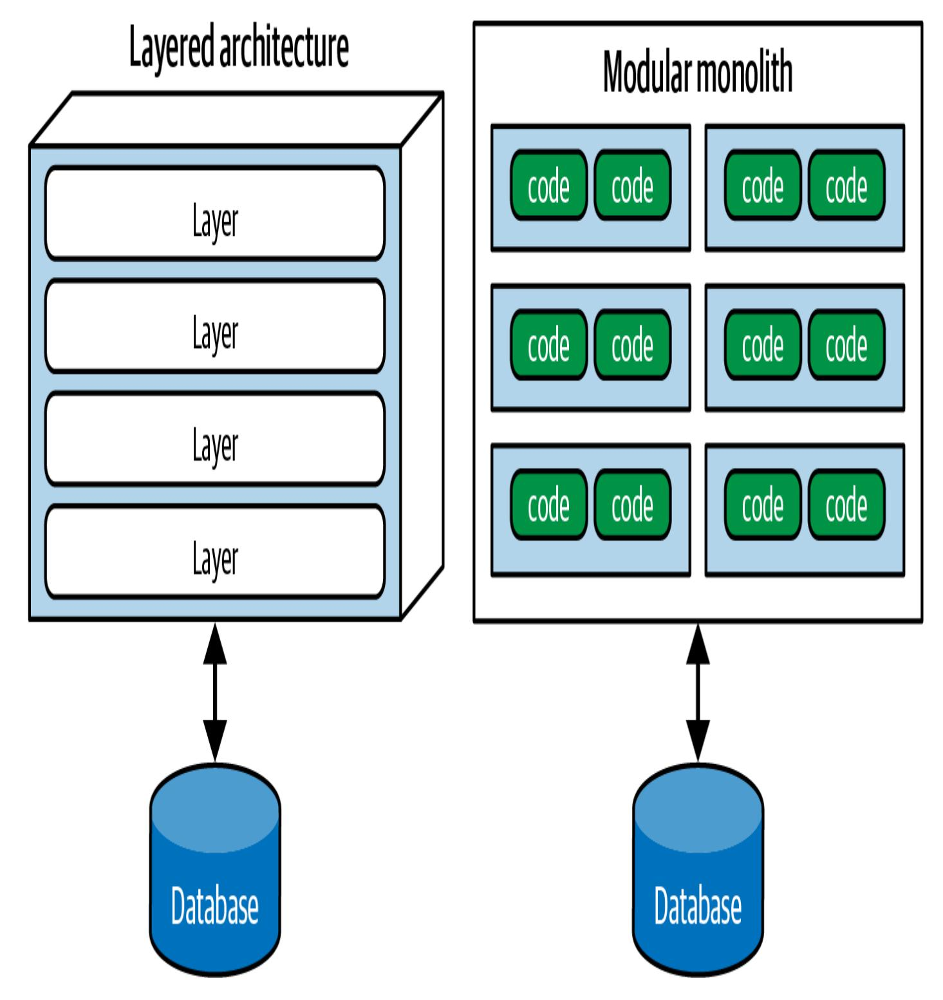

Abbildung 9-2. Zwei Arten der Top-Level-Partitionierung: technisch (wie die Schichtenarchitektur) und fachlich (wie der modulare Monolith)

Die Organisation der Architektur auf der Grundlage ihrer technischen Fähigkeiten, wie es der Layered-Monolith-Stil tut, stellt eine *technische Partitionierung auf höchster Ebene* dar.

Eine gängige Version davon ist in [Abbildung](#page-16-0) 9-3 zu sehen, in der der Architekt die Funktionalität des Systems in *technische* Fähigkeiten unterteilt hat: Präsentation, Geschäftsregeln, Dienste, Persistenz und so weiter. Diese Art der Organisation einer Codebasis ist durchaus sinnvoll. Der gesamte Persistenzcode befindet sich in einer Schicht, so dass es für die Entwickler einfach ist, den persistenzbezogenen Code zu finden. Auch wenn das Grundkonzept der Schichtenarchitektur schon seit Jahrzehnten bekannt ist, passt das Model-View-Controller Design Pattern (eines der grundlegenden Patterns in *Head First Design [Patterns](https://www.oreilly.com/library/view/head-first-design/9781492077992)* von Eric Freeman und Elisabeth Robson (O'Reilly, 2020)) zu diesem architektonischen Muster, so dass es für Entwickler leicht zu verstehen ist. Daher ist es in vielen Unternehmen die Standardarchitektur.

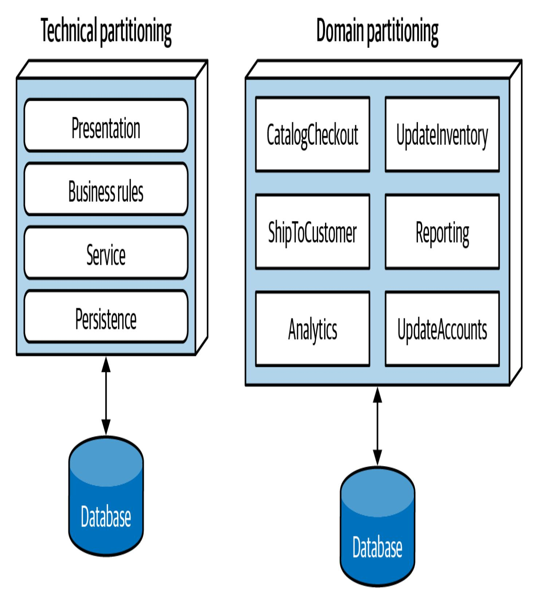

Abbildung 9-3. Zwei Arten der Top-Level-Partitionierung in der Architektur

Ein interessanter Nebeneffekt der vorherrschenden Schichtenarchitektur ist, dass Unternehmen die Sitzordnung in ihren Büros oft nach den verschiedenen Projektrollen organisieren. Aufgrund des Conway'schen Gesetzes ist es bei einer Schichtenarchitektur sinnvoll, alle Backend-Entwickler in einer Abteilung zu versammeln, die DBAs in einer anderen, das Präsentationsteam in einer anderen, und so weiter.

Die andere Architekturvariante in [Abbildung](#page-16-0) 9-3 ist die *Domänenpartitionierung*, eine Modellierungstechnik zur Zerlegung komplexer Softwaresysteme, bei der die Komponenten nach Domänen und nicht nach technischen Fähigkeiten organisiert werden. Die Domänenpartitionierung wurde durch das Buch *Domain-Driven Design* von Eric Evans inspiriert. Bei DDD identifiziert der Architekt Domänen oder Arbeitsabläufe, die unabhängig und voneinander entkoppelt sind. Der Stil der Microservices-Architektur basiert auf dieser Philosophie.

Eine modulare monolithische Architektur ist nach Domänen oder Arbeitsabläufen partitioniert und nicht nach technischen Fähigkeiten. Da die Komponenten oft ineinander verschachtelt sind, kann jede Komponente in der in [Abbildung](#page-16-0) 9-3 gezeigten, nach Domänen aufgeteilten Architektur (z. B. CatalogCheckout ) eine Persistenzbibliothek verwenden und eine separate Schicht für Geschäftsregeln haben, aber die oberste Partitionierung dreht sich immer noch um Domänen.

#### **CONWAY'S GESETZ**

Ende der 1960er Jahre machte Melvin [Conway](https://oreil.ly/qo59i) eine Beobachtung, die als *Conway's Law* bekannt geworden ist:

*Organisationen, die Systeme entwerfen, sind gezwungen, Entwürfe zu erstellen, die die Kommunikationsstrukturen dieser Organisationen widerspiegeln.*

Dieses Gesetz besagt, dass, wenn eine Gruppe von Menschen ein technisches Artefakt entwirft, die Strukturen ihres Entwurfs die Art und Weise wiedergeben, wie diese Menschen kommunizieren. Menschen auf allen Ebenen von Organisationen sehen dieses Gesetz in Aktion und treffen manchmal Entscheidungen auf dieser Grundlage. So ist es zum Beispiel üblich, dass Unternehmen ihre Mitarbeiter/innen nach ihren technischen Fähigkeiten einteilen, aber das ist eine künstliche Trennung von gemeinsamen Anliegen, die die Zusammenarbeit behindern kann.

Eine verwandte Beobachtung, die von Jonny Leroy von Thoughtworks geprägt wurde, ist das *Inverse Conway [Manöver](https://oreil.ly/9EYd6)*, das vorschlägt, die Strukturen von Teams und Organisationen gemeinsam zu entwickeln, um die gewünschte Architektur zu fördern. Diese Überlegung ist inzwischen allgemein als *Teamtopologien* bekannt.

Unternehmen haben erkannt, dass Teamtopologien einen erheblichen Einfluss auf viele wichtige Facetten ihres Geschäfts haben können, auch auf die Softwarearchitektur. In den folgenden Kapiteln, die sich mit den einzelnen Stilen befassen, werden wir die Auswirkungen der einzelnen Architekturstile auf diese Teamtypen diskutieren.

Eine der grundlegenden Unterscheidungen zwischen Architekturmustern ist die Art der Partitionierung auf oberster Ebene, die jedes Muster unterstützt. In den folgenden stil-spezifischen Kapiteln gehen wir auf diese Unterscheidung für jedes einzelne Muster ein. Die Partitionierung auf oberster Ebene hat auch einen großen Einfluss darauf, ob der Architekt sich entscheidet, die Komponenten zunächst technisch oder nach Domäne zu identifizieren.

Architekten, die eine technische Partitionierung verwenden, organisieren die Komponenten des Systems nach ihren technischen Fähigkeiten: Präsentation, Geschäftsregeln, Persistenz usw. Eines der Organisationsprinzipien der Schichtenarchitektur ist die *Trennung der technischen Belange*, wodurch nützliche Entkopplungsebenen geschaffen werden. Wenn zum Beispiel die Serviceschicht nur mit der darunter liegenden Persistenzschicht und der darüber liegenden Geschäftsregelnschicht verbunden ist, wirken sich Änderungen an der Persistenz nur auf diese Schichten aus. Diese Entkopplung verringert die Gefahr von Nebeneffekten auf abhängige Komponenten.

Es ist sicherlich logisch, Systeme mithilfe der technischen Partitionierung zu organisieren, aber wie bei allen Dingen in der Softwarearchitektur gibt es auch hier einige Kompromisse. Die durch die technische Partitionierung erzwungene Trennung ermöglicht es Entwicklern, bestimmte Kategorien der Codebasis schnell zu finden, da diese nach Fähigkeiten organisiert ist.

In der in [Abbildung](#page-21-0) 9-4 gezeigten technisch partitionierten Architektur betrachten wir den allgemeinen Geschäftsablauf von CatalogCheckout . Der Code zur Bearbeitung von CatalogCheckout in der technisch partitionierten Architektur erscheint in allen Schichten. Mit anderen Worten: Die Domäne ist über die technischen Schichten verteilt.

Abbildung 9-4. Wo Domänen/Workflows in technisch partitionierten und domänenpartitionierten Architekturen erscheinen

Im Gegensatz dazu steht die in [Abbildung](#page-21-0) 9-4 gezeigte Architektur mit Domänenaufteilung, bei der die Architekten Top-Level-Komponenten

um Arbeitsabläufe und Domänen herum aufgebaut haben. Jede Komponente kann Unterkomponenten haben, einschließlich Ebenen, aber die Top-Level-Partitionierung konzentriert sich auf Domänen, was die Art der Änderungen, die in Projekten am häufigsten vorkommen, besser widerspiegelt.

Keiner dieser Stile ist richtiger als der andere. (Siehe das erste Gesetz der Softwarearchitektur.) Dennoch haben wir in den letzten Jahren einen deutlichen Trend in der Branche hin zur Partitionierung der Domäne sowohl bei monolithischen als auch bei verteilten Architekturen (z. B. Microservices) beobachtet. Wie wir bereits festgestellt haben, ist dies eine der ersten Entscheidungen, die ein Architekt treffen muss.

### **Kata: Silizium-Sandwiches - Aufteilung**

Betrachte den Fall einer unserer [Beispielkatas, "Kata:](#page--1-1) Silicon Sandwiches". Betrachten wir zunächst die erste von zwei Möglichkeiten für Silicon Sandwiches: die Partitionierung des Bereichs, wie in [Abbildung](#page-23-0) 9-5 dargestellt.

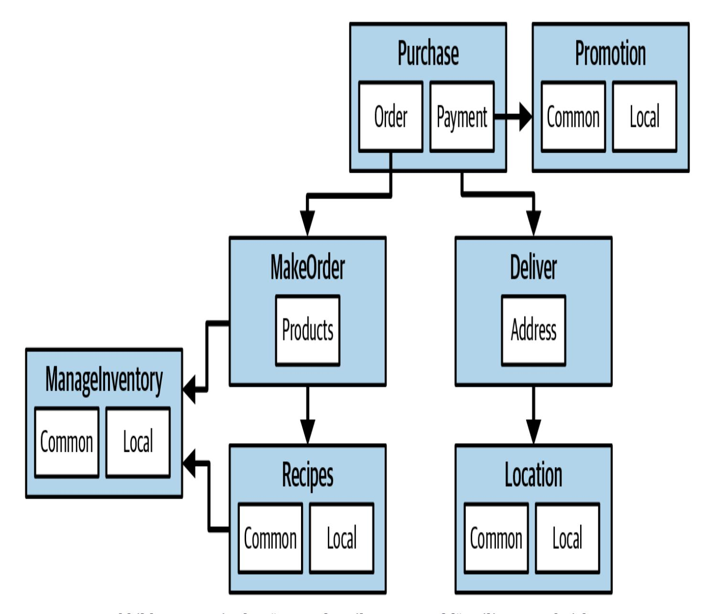

Abbildung 9-5. Ein domänenaufgeteilter Entwurf für Silicon Sandwiches

In [Abbildung](#page-23-0) 9-5 hat der Architekt Domänen (Workflows) entworfen und einzelne Komponenten für Purchase , Promotion , MakeOrder , ManageInventory , Recipes , Delivery und Location erstellt. Innerhalb vieler dieser Komponenten gibt es Unterkomponenten, die sowohl allgemeine als auch lokale Anpassungen vornehmen können.

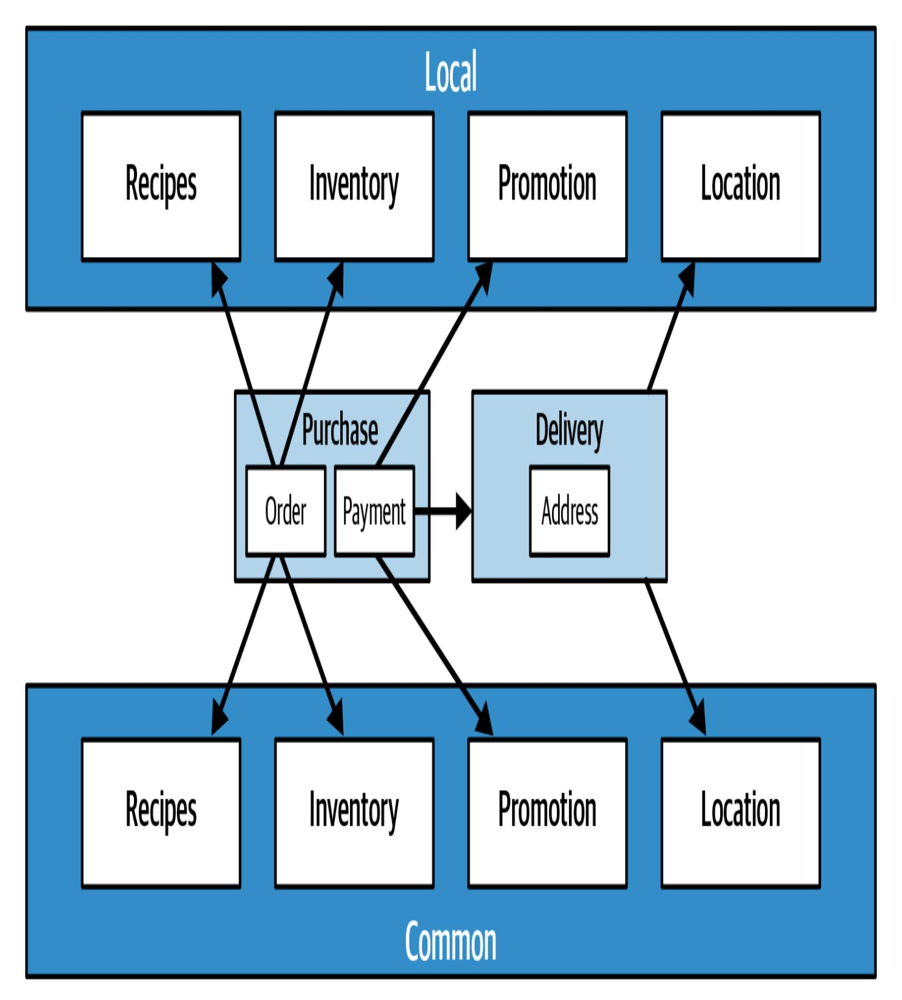

Abbildung 9-6. Ein technisch partitionierter Entwurf für Silizium-Sandwiches

Ein alternatives Design isoliert die gemeinsamen und lokalen Teile in ihre eigenen Partitionen, wie in [Abbildung](#page-24-0) 9-6 dargestellt. Common und Local stellen die Top-Level-Komponenten dar, während Purchase und Delivery für den Workflow übrig bleiben.

Was ist besser? Das kommt darauf an! Jede Art der Partitionierung bietet unterschiedliche Vor- und Nachteile.

#### **Domänenaufteilung**

Domänen-geteilte Architekturen trennen Top-Level-Komponenten nach Workflows und/oder Domänen.

#### *Vorteile*

- Sie orientieren sich eher an der Funktionsweise des Unternehmens als an einem Implementierungsdetail
- Es ist einfacher, funktionsübergreifende Teams für bestimmte Bereiche zu bilden
- Stärkere Anlehnung an die modulare Monolith- und Microservices-Architektur
- Der Nachrichtenfluss entspricht dem Problembereich
- Einfache Migration von Daten und Komponenten zu einer verteilten Architektur

#### *Nachteil*

Anpassungscode erscheint an mehreren Stellen

#### **Technische Aufteilung**

Technisch partitionierte Architekturen trennen die Komponenten auf der obersten Ebene nach technischen Fähigkeiten und nicht nach diskreten Arbeitsabläufen. Dies kann in Form von Schichten geschehen, die sich an der Model-View-Controller-Trennung orientieren, oder in Form einer anderen technischen Ad-hoc-Partitionierung. Die in [Abbildung](#page-24-0) 9-6 dargestellte Architektur trennt ihre Komponenten auf der Grundlage vonAnpassungen.

#### *Vorteile*

- Trenne den Anpassungscode klar ab.
- Entspricht eher dem Muster der Schichtenarchitektur.

#### *Benachteiligungen*

- Höherer Grad der globalen Kopplung. Änderungen an der Komponente Common oder Local wirken sich wahrscheinlich auch auf alle anderen Komponenten aus.
- Es kann sein, dass die Entwickler die Domänenkonzepte sowohl in der gemeinsamen als auch in der lokalen Ebene duplizieren müssen.
- Typischerweise ist die Kopplung auf der Datenebene höher. In einem solchen System würden die Anwendungsarchitekten und die Datenarchitekten wahrscheinlich zusammenarbeiten, um eine einzige Datenbank zu erstellen, einschließlich Anpassungen und

Domänen. Das wiederum würde zu Schwierigkeiten bei der Entwirrung der Datenbeziehungen führen, wenn die Architekten diese Architektur später auf ein verteiltes System umstellen wollen. Viele andere Faktoren spielen bei der Wahl des Architekturstils eine Rolle, wie wir in [Teil](#page--1-0) II erläutern.

# Monolithische versus verteilte Architekturen

Wie du in Teil I gelernt hast, können Architekturen in zwei Haupttypen eingeteilt werden: *monolithische* (eine einzige Einsatzeinheit für den gesamten Code) und *verteilte* (mehrere Einsatzeinheiten, die über Fernzugriffsprotokolle verbunden sind). Auch wenn kein Klassifizierungsschema perfekt ist, haben verteilte Architekturen eine Reihe von Herausforderungen und Problemen gemeinsam, die bei monolithischen Architekturen nicht vorkommen, so dass dieses Klassifizierungsschema eine gute Unterscheidung zwischen den verschiedenen Architekturen darstellt.

In Teil II dieses Buches beschreiben wir die folgenden Architekturstile im Detail:

#### *Monolithisch*

- Mehrschichtige Architektu[r\(Kapitel](#page--1-0) 10)
- Pipeline-Architektur[\(Kapitel](#page--1-0) 12)

Mikrokernel-Architektu[r\(Kapitel](#page--1-0) 13)

#### *Verteilt*

- Servicebasierte Architektur[\(Kapitel](#page--1-0) 14)
- Ereignisgesteuerte Architektu[r\(Kapitel](#page--1-0) 15)
- Weltraumbasierte Architektu[r\(Kapitel](#page--1-0) 16)
- Serviceorientierte Architektu[r\(Kapitel](#page--1-0) 17)
- Microservices-Architektur[\(Kapitel](#page--1-0) 18)

Verteilte Architekturen sind zwar in Bezug auf Leistung, Skalierbarkeit und Verfügbarkeit viel leistungsfähiger als monolithische Architekturen, haben aber auch erhebliche Kompromisse. Die erste Gruppe von Problemen, mit denen alle verteilten Architekturen konfrontiert sind, wird in den ["Trugschlüssen](https://oreil.ly/fVAEY) des verteilten Rechnens" beschrieben [, die](https://oreil.ly/fVAEY) erstmals 1994 von L. Peter Deutsch und anderen Kollegen von Sun Microsystems aufgeführt wurden. Ein *Trugschluss* ist etwas Falsches, von dem jemand glaubt oder annimmt, es sei wahr. Alle acht Trugschlüsse des verteilten Rechnens treffen heute auf verteilte Architekturen zu. In den folgenden Abschnitten wird jeder Trugschluss beschrieben.

**Trugschluss Nr. 1: Das Netzwerk ist zuverlässig**

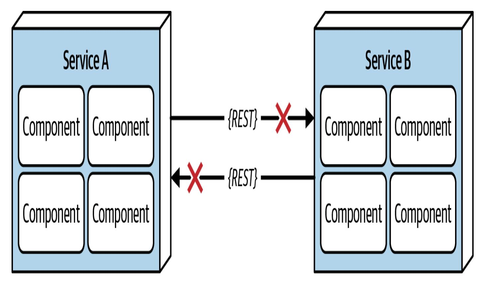

Abbildung 9-7. Das Netzwerk ist nicht zuverlässig

Entwickler/innen und Architekt/innen gehen davon aus, dass das Netzwerk zuverlässig ist, aber das ist es nicht. Zwar sind die Netzwerke im Laufe der Zeit zuverlässiger geworden, aber Tatsache ist, dass sie im Allgemeinen immer noch unzuverlässig sind. Das ist für alle Arten von verteilten Architekturen von Bedeutung, denn sie sind auf das Netzwerk angewiesen, um von, zu und zwischen den Diensten zu kommunizieren. Wie in [Abbildung](#page-29-0) 9-7 zu sehen ist, kann Service B völlig gesund sein, aber Service A kann es aufgrund eines Netzwerkproblems nicht erreichen. Noch schlimmer ist es, wenn Service A Service B auffordert, Daten zu verarbeiten, aber aufgrund eines Netzwerkproblems keine Antwort erhält. Aus diesem Grund gibt es zwischen den Diensten so etwas wie Timeouts und Stromkreisunterbrechungen. Je mehr sich ein System auf das Netzwerk

verlässt (wie es bei Microservices-Architekturen der Fall ist), desto größer ist die Gefahr, dass es unzuverlässig wird.

### **Irrtum Nr. 2: Die Latenzzeit ist gleich Null**

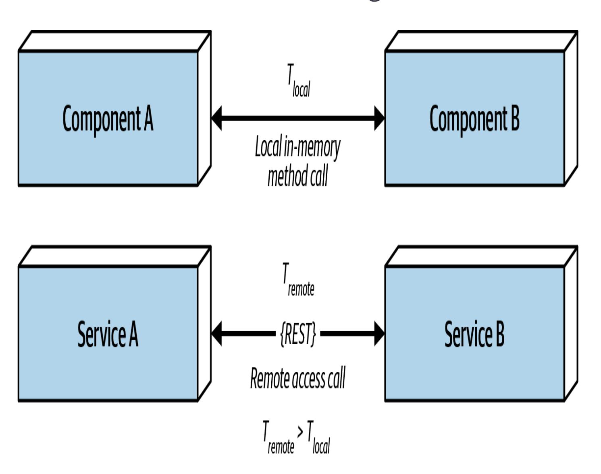

Abbildung 9-8. Die Latenz ist nicht null

Wie [Abbildung](#page-30-0) 9-8 zeigt, wird bei einem lokalen Aufruf einer anderen Komponente über eine Methode oder einen Funktionsaufruf die Zeit für den Zugriff auf diese Komponente ( t\_local ) in Nanosekunden oder Mikrosekunden gemessen. Erfolgt derselbe Aufruf jedoch über ein

Fernzugriffsprotokoll (wie REST, Messaging oder RPC), wird die Zeit ( t\_remote ) in Millisekunden gemessen und ist daher immer größer als t\_local . Die Latenzzeit ist in jeder verteilten Architektur nicht gleich null - dennoch ignorieren die meisten Architekten diesen Trugschluss und bestehen darauf, dass sie schnelle Netzwerke haben. Frag dich selbst: Weißt du, wie hoch die durchschnittliche Latenzzeit für einen RESTful-Aufruf in deiner Produktionsumgebung ist? Sind es 60 Millisekunden? Sind es 500 Millisekunden?

Wenn Architekten den Einsatz einer verteilten Architektur, insbesondere von Microservices, in Betracht ziehen, müssen sie diese durchschnittliche Latenzzeit kennen. Nur so lässt sich feststellen, ob eine verteilte Architektur aufgrund der Feinkörnigkeit der Dienste und des Umfangs der Kommunikation zwischen ihnen machbar ist.

Nehmen wir zum Beispiel eine durchschnittliche Latenzzeit von 100 ms pro Anfrage an. Die Verkettung von Serviceaufrufen, um eine bestimmte Geschäftsfunktion auszuführen, verlängert die Anfrage um 1.000 ms! Es ist wichtig, die durchschnittliche Latenz zu kennen, aber noch wichtiger ist es, die 95- bis 99-prozentige Latenz zu kennen. Während die durchschnittliche Latenzzeit des Systems vielleicht nur 60 ms beträgt (was gut ist), kann das 95. Perzentil bei 400 ms liegen! In der Regel ist es diese "Long Tail"-Latenz, die die Leistung in einer verteilten Architektur zunichte macht. In den meisten Fällen kann ein Netzwerkadministrator die Latenzwerte angeben (siehe "Irrtum Nr. 6: Es gibt nur einen [Administrator"\).](#page-36-0)

### **Irrtum Nr. 3: Die Bandbreite ist unendlich**

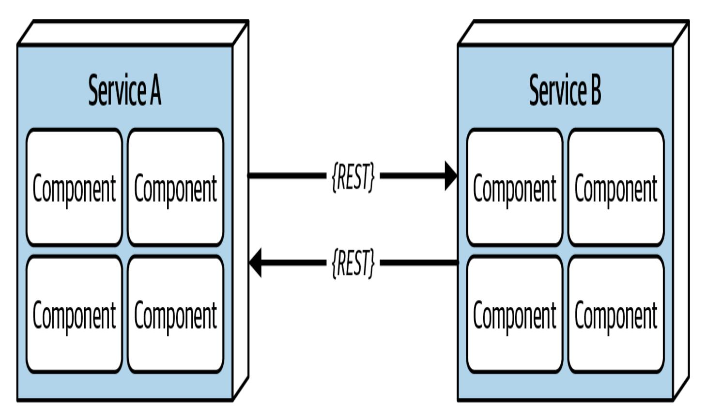

Abbildung 9-9. Die Bandbreite ist nicht unendlich

In monolithischen Architekturen ist die Bandbreite in der Regel kein Problem, denn sobald eine Geschäftsanfrage in einem Monolithen eingeht, wird nur noch wenig oder gar keine Bandbreite für ihre Bearbeitung benötigt. Sobald ein System jedoch in einer verteilten Architektur, z. B. bei Microservices, in kleinere Bereitstellungseinheiten (Dienste) aufgeteilt wird, benötigt die Kommunikation zu und zwischen diesen Diensten eine erhebliche Bandbreite, wie in [Abbildung](#page-32-0) 9-9 dargestellt. Das verlangsamt das Netzwerk und wirkt sich auf die Latenz (Trugschluss Nr. 2) und die Zuverlässigkeit (Trugschluss Nr. 1) aus.

Um die Bedeutung dieses Trugschlusses zu verdeutlichen, betrachte die beiden in [Abbildung](#page-32-0) 9-9 gezeigten Dienste. Nehmen wir an, Service A

verwaltet die Wunschlisten für die Website und Service B verwaltet die Kundenprofile. Wenn eine Anfrage für einen Wunschzettel bei Service A eingeht, benötigt Service A den Kundennamen für den Antwortvertrag für den Wunschzettel. Um den Namen zu erhalten, muss er einen Interservice-Aufruf an Service B tätigen. Service B gibt 45 Attribute, insgesamt 500 KB, an Service A zurück, das nur den Namen (200 Byte) benötigt. Das hört sich vielleicht nicht viel an, aber die Anfragen für die Wunschlisteneinträge erfolgen etwa 2.000 Mal pro Sekunde. Das bedeutet, dass Service A 2.000 Mal pro Sekunde Service B aufruft. Bei 500 KB pro Anfrage beansprucht *jeder* Interservice-Aufruf 1 GBps an Bandbreite!

Diese Form der Kopplung, die sogenannte *Stempelkopplung*, verbraucht in verteilten Architekturen erhebliche Mengen an Bandbreite. Wenn Service B *nur* die 200 Bytes an Daten, die Service A benötigt, zurückgeben würde, würde es insgesamt nur 400 Kbps verbrauchen.

Die Stempelkopplung kann aufgelöst werden durch:

- Private RESTful API Endpunkte erstellen
- Feldselektoren in Verträgen verwenden
- [GraphQL](https://graphql.org/) zur Entkopplung von Verträgen nutzen
- Wertorientierte Verträge mit verbraucherorientierten Verträgen nutzen
- Interne Messaging-Endpunkte verwenden

Unabhängig von der verwendeten Technik lässt sich dieser Fehler in einer verteilten Architektur am besten dadurch beheben, dass

sichergestellt wird, dass Dienste oder Systeme nur die notwendigen Daten übertragen.

### **Trugschluss Nr. 4: Das Netzwerk ist sicher**

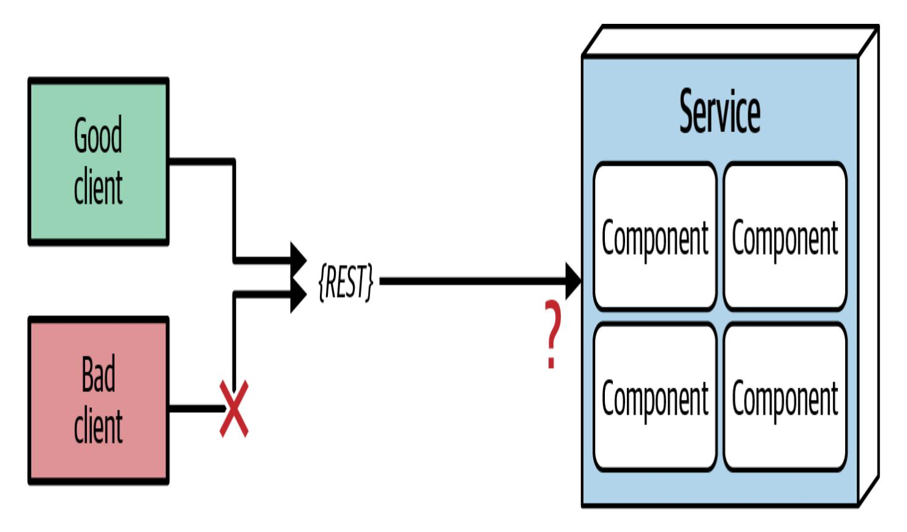

Abbildung 9-10. Das Netzwerk ist nicht sicher

Die meisten Architekten und Entwickler gewöhnen sich so sehr an die Verwendung von virtuellen privaten Netzwerken (VPNs), vertrauenswürdigen Netzwerken und Firewalls, dass sie diesen Trugschluss des verteilten Computings vergessen - *das Netzwerk ist nicht sicher*. Wie in [Abbildung](#page-34-0) 9-10 dargestellt, muss jeder einzelne Endpunkt jeder verteilten Einsatzeinheit gegen unbekannte oder bösartige Anfragen gesichert werden. Die Angriffsfläche für Bedrohungen und Angriffe vergrößert sich um ein Vielfaches, wenn man von einer

monolithischen zu einer verteilten Architektur wechselt, was die Sicherheit erheblich erschwert. Die Absicherung jedes Endpunkts, auch bei der Kommunikation zwischen den Diensten, ist ein weiterer Grund dafür, dass die Leistung in synchronen, stark verteilten Architekturen wie Microservices und servicebasierten Architekturen tendenziell langsamer ist.

## **Trugschluss Nr. 5: Die Topologie ändert sich nie**

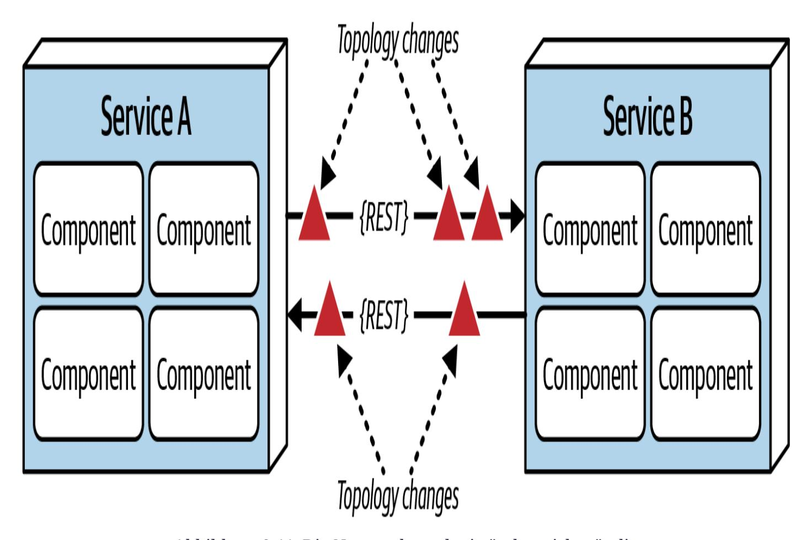

Abbildung 9-11. Die Netzwerktopologie ändert sich ständig

Irrtum Nr. 5, wie in [Abbildung](#page-35-0) 9-11 dargestellt, bezieht sich auf die gesamte Netzwerktopologie, einschließlich aller Router, Hubs, Switches, Firewalls, Netzwerke und Geräte. Architekten gehen davon aus, dass die Topologie feststeht und sich nie ändert. *Natürlich ändert sie sich.* Sie ändert sich die ganze Zeit. Was ist die Bedeutung dieses Trugschlusses?

Angenommen, du kommst an einem Montagmorgen zur Arbeit und alle rennen wie verrückt herum, weil die Dienste in der Produktion immer wieder ausfallen. Du arbeitest mit den Teams und versuchst verzweifelt herauszufinden, warum das so ist. Über das Wochenende wurden keine neuen Dienste bereitgestellt. Woran kann das liegen? Nach einigen Stunden entdeckst du, dass ein vermeintlich "kleines" Netzwerk-Upgrade um zwei Uhr morgens alle Latenzannahmen des Systems außer Kraft gesetzt hat, was zu Zeitüberschreitungen und Stromkreisunterbrechungen geführt hat.

Die Architekten müssen ständig mit den Betriebs- und Netzwerkadministratoren darüber kommunizieren, was sich wann ändert, damit sie Anpassungen vornehmen können, um solche Überraschungen zu vermeiden. Das mag offensichtlich und einfach erscheinen, ist es aber nicht. Tatsächlich führt dieser Trugschluss direkt zum nächsten Trugschluss.

**Irrtum Nr. 6: Es gibt nur einen Verwalter**

Abbildung 9-12. Es gibt viele Netzwerkadministratoren, nicht nur einen

Architekten verfallen immer wieder in diesen Trugschluss: Sie nehmen an, dass sie nur mit einem Administrator zusammenarbeiten und kommunizieren müssen. Wie [Abbildung](#page-37-0) 9-12 zeigt, gibt es in einem typischen Großunternehmen Dutzende von Netzwerkadministratoren. Mit wem sollte der Architekt über Latenzzeiten oder Topologieänderungen sprechen? Dieser Trugschluss verdeutlicht die Komplexität einer verteilten Architektur und den hohen Koordinationsaufwand, der nötig ist, damit alles richtig funktioniert. Bei einer monolithischen Anwendung mit einer einzigen Bereitstellungseinheit ist ein solches Maß an Kommunikation und Zusammenarbeit nicht erforderlich.

# **Irrtum Nr. 7: Die Transportkosten sind gleich null**

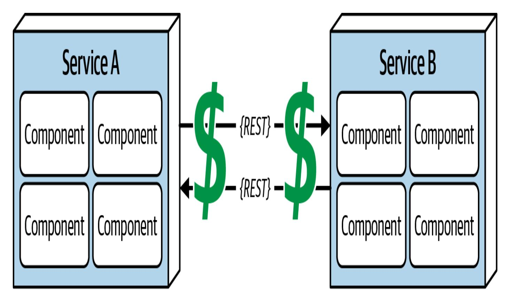

Abbildung 9-13. Fernzugriff kostet Geld

Viele Softwarearchitekten verwechseln diesen Trugschluss, der in [Abbildung](#page-39-0) 9-13 dargestellt ist, mit dem Trugschluss Nr. 2 (Latenzzeit ist Null). *Die Transportkosten* beziehen sich hier nicht auf die Latenzzeit, sondern auf die tatsächlichen *monetären Kosten* für einen "einfachen RESTful-Aufruf". Architekten gehen fälschlicherweise davon aus, dass die notwendige und ausreichende Infrastruktur bereits vorhanden ist, um einen einfachen RESTful-Aufruf durchzuführen oder eine monolithische Anwendung aufzubrechen. *Das ist in der Regel nicht der Fall.* Verteilte Architekturen kosten deutlich mehr als monolithische Architekturen, vor allem wegen des erhöhten Bedarfs an Hardware, Servern, Gateways, Firewalls, neuen Subnetzen, Proxys usw.

Wir ermutigen Architekten, die eine verteilte Architektur aufbauen wollen, ihre aktuelle Server- und Netzwerktopologie im Hinblick auf Kapazität, Bandbreite, Latenz und Sicherheitszonen zu analysieren, damit sie nicht von diesem Trugschluss überrascht werden.

### **Irrtum Nr. 8: Das Netzwerk ist homogen**

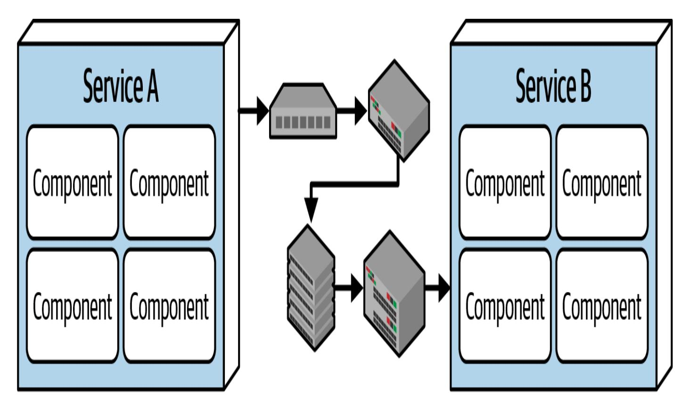

Abbildung 9-14. Das Netzwerk ist nicht homogen

Die meisten Architekten und Entwickler gehen davon aus, dass ein Netzwerk homogen ist, wie in [Abbildung](#page-40-0) 9-14dargestellt - [dass](#page-40-0)es aus Netzwerkhardware von nur einem Hersteller besteht. Nichts könnte weiter von der Wahrheit entfernt sein. Die Infrastrukturen der meisten Unternehmen bestehen aus mehreren Netzwerkhardware-Anbietern.

Was also? Die Bedeutung dieses Trugschlusses liegt darin, dass nicht alle dieser heterogenen Hardware-Anbieter gut zusammenspielen. Lässt sich die Hardware von Juniper Networks nahtlos in die Hardware von Cisco

Systems integrieren? Das meiste funktioniert, und die Netzwerkstandards haben sich im Laufe der Jahre weiterentwickelt, so dass dies weniger ein Problem darstellt. Allerdings sind nicht alle Situationen, Belastungen und Umstände vollständig getestet worden, so dass gelegentlich Netzwerkpakete verloren gehen können. Das wiederum wirkt sich auf die Zuverlässigkeit des Netzwerks und die Annahmen und Behauptungen über Latenzzeiten und Bandbreiten aus. Mit anderen Worten: Dieser Irrtum ist mit allen anderen Irrtümern verknüpft und bildet eine Endlosschleife der Verwirrung und Frustration im Umgang mit Netzwerken (was bei verteilten Architekturen unausweichlich ist).

### **Die anderen Irrtümer**

Die acht zuvor aufgelisteten Trugschlüsse sind eine berühmte Reihe von Beobachtungen - jeder Architekt lernt sie entweder aus Deutschs Liste oder auf die harte Tour, einen nach dem anderen, im Laufe seiner Karriere. Die Autoren haben auch einige schmerzhafte, fast universelle Lektionen gelernt, die wir als Ergänzung zu dieser berühmten Liste anbieten.

#### **Irrtum #9. Versionierung ist einfach**

Wenn zwei Dienste miteinander kommunizieren müssen, übermitteln sie Informationen in einem *Vertrag*, der die für die Kommunikation erforderlichen Informationen enthält. Oft entwickelt sich die interne Implementierung eines Dienstes im Laufe der Zeit weiter und ändert die Felder, die der Dienst akzeptiert und an andere Dienste weitergibt. Eine Möglichkeit, dieses Problem zu lösen, besteht darin, den Vertrag zu versionieren, d. h. verschiedene Versionen für den alten und den neuen Vertrag mit unterschiedlichen Informationen zu erstellen. Diese scheinbar einfache Entscheidung führt jedoch zu einer Reihe von Kompromissen:

- Soll das Team auf der Ebene der einzelnen Dienste oder für das gesamte System arbeiten?
- Wie weit soll die Versionierung reichen? Welcher Teil der Architektur muss sie unterstützen?
- Wie viele Versionen sollte das Team zu einem bestimmten Zeitpunkt unterstützen? (Manche Teams nehmen versehentlich Dutzende verschiedener Versionen für unterschiedliche Zwecke in Anspruch).
- Sollte das Team ältere Versionen auf Systemebene oder für jeden einzelnenDienst abschaffen?

Die Versionierung ist zwar ein vernünftiger Ansatz für die Weiterentwicklung der Kommunikation zwischen Diensten, aber sie bringt eine Reihe von Kompromissen mit sich, mit denen Architekten rechnen sollten.

### **Irrtum Nr. 10. Kompensierende Updates funktionieren immer**

*Kompensierende Aktualisierungen* sind ein Architekturmuster, bei dem ein Mechanismus (z. B. ein Orchestrator Dienst) dafür sorgt, dass mehrere zusammenhängende Dienste gemeinsam aktualisiert werden. Wenn das nicht der Fall ist, macht der Orchestrator die Aktualisierung rückgängig. Das *kompensierende Update* kommt vom Orchestrator, der eine Reversing-Operation durchführt, um den Zustand wiederherzustellen, wie er vorher war.

Das ist ein gängiges Muster, von dem die meisten Architekten leichtfertig annehmen, dass es immer funktioniert... aber das tut es nicht. Was passiert, wenn die kompensierende Aktualisierung fehlschlägt? Wenn Architekten zeigen, wie komplexe Interaktionen in verteilten Architekturen wie Microservices funktionieren, müssen sie auch zeigen, wie kompensierende Updates funktionieren. Architekten, die transaktionale Workflows in Microservices entwerfen, sollten also den "normalen" Kompensations-Workflow berücksichtigen, müssen aber auch überlegen, wie die Wiederherstellung funktioniert, wenn *sowohl* die Aktualisierung als auch die kompensierende Aktualisierung (oder ein Teil davon) fehlschlagen.

### **Irrtum Nr. 11. Beobachtbarkeit ist optional (für verteilte Architekturen)**

Ein häufiges architektonisches Merkmal, auf das Architekten in verteilten Architekturen Wert legen, ist die *Beobachtbarkeit*: die Möglichkeit, die Interaktionen jedes Dienstes mit anderen Diensten und dem Ökosystem zu beobachten, wie sie durch Monitore oder Logs erfasst werden. Während die Protokollierung in monolithischen Architekturen nützlich ist, ist sie in verteilten Architekturen *von entscheidender*

*Bedeutung*, da hier viele Kommunikationsfehler auftreten, die ohne umfassende Interaktionsprotokolle nur schwer zu beheben sind.

# Team-Topologien und Architektur

Architekten und Teams haben viel über die Überschneidung von Architektur und Teamtopologien geforscht, und zwar über die Auswirkungen der Architekturpartitionierung hinaus, die wir bereits besprochen haben. Das sehr einflussreiche Buch *Team [Topologies](https://oreil.ly/aPB3u)* von Matthew Skelton und Manuel Pais (IT Revolution Press, 2019) definiert verschiedene Teamtypen, die sich mit der Softwarearchitektur überschneiden:

#### *Auf den Strom ausgerichtete Teams*

In der Terminologie der Teamtopologien ist ein *Stream* ein Arbeitsstrom, der auf einen bestimmten Geschäftsbereich oder eine bestimmte Fähigkeit ausgerichtet ist. *Teams, die auf einen Stream ausgerichtet sind,* konzentrieren sich auf einen einzigen Arbeitsbereich, z. B. ein Produkt, eine Dienstleistung oder eine bestimmte Anzahl von Funktionen.

Das Ziel von Teams, die sich an den Abläufen orientieren, ist es, so schnell wie möglich voranzukommen, weil sie dem Unternehmen einen besonderen Wert liefern. Daher sind die anderen Teamtypen darauf ausgelegt, Reibungsverluste zu verringern, die die stromgesteuerten Teams behindern könnten.

#### *Teams befähigen*

Ein *Enabling Team* überbrückt eine Lücke in einer bestimmten Fähigkeit und bietet einen Platz für notwendige Forschung, Lernen und andere Aufgaben, die wichtig, aber nicht dringend sind. Sie stellen Wissen und Ressourcen aus spezialisierten Bereichen zur Verfügung, um die auf den Strom ausgerichteten Teams zu unterstützen. Gute Enabling Teams sind sehr kooperativ und proaktiv.

#### *Teams mit komplizierten Subsystemen*

Viele Systeme umfassen hochspezialisierte Systeme oder Teile, die ähnlich spezialisierte Fähigkeiten erfordern. Mitglieder von *Teams für komplizierte Teilsysteme* verstehen ein komplexes Teilsystem oder eine Domäne vollständig und können einem Team, das auf einen Strom ausgerichtet ist, bei dessen Anwendung helfen. Ihr Ziel ist es, die kognitive Belastung der anderen Teams zu verringern.

#### *Plattform-Teams*

Ein *Plattformteam* bietet interne Dienstleistungen und Bausteine für Lösungen an. Nach der Definition von Evan [Botcher](https://oreil.ly/ieO_7) ist eine Plattform

*eine Grundlage aus Self-Service-APIs, Tools, Diensten, Wissen und Support, die als überzeugendes internes Produkt gestaltet sind. Autonome Lieferteams können die Plattform nutzen, um Produktfunktionen in einem höheren Tempo und mit weniger Koordination zu liefern.*

Die Plattformteams unterstützen die anderen Teams, indem sie versuchen, unnötige Reibungsverluste zu vermeiden und gleichzeitig die notwendige Kontrolle über Belange wie Qualität und Sicherheit zu gewährleisten.

# Weiter zu spezifischen Stilen

Um eine Analyse der Kompromisse durchführen zu können, müssen Architekten eine Reihe verschiedener Architekturstile verstehen. Jeder Stil unterstützt eine andere Reihe von architektonischen Merkmalen jeder Stil hat einen "Sweet Spot", den er am besten beherrscht. Wenn ein Architekt die verschiedenen Stile und die ihnen zugrundeliegenden Philosophien kennt, kann er besser verstehen, wann ein Stil am besten (oder am wenigsten schlecht) funktioniert.