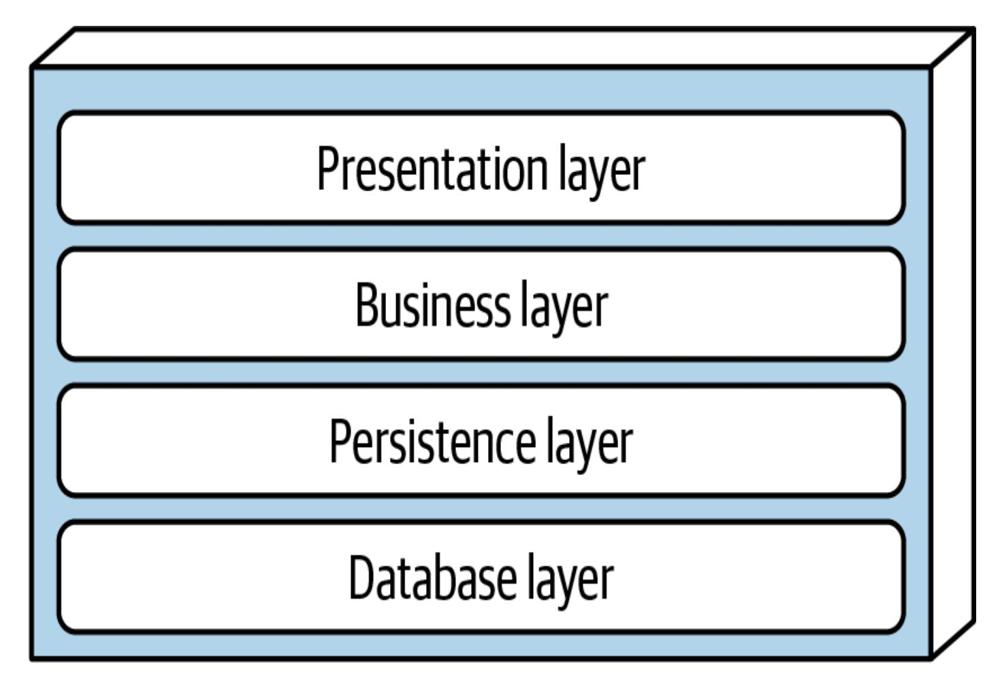
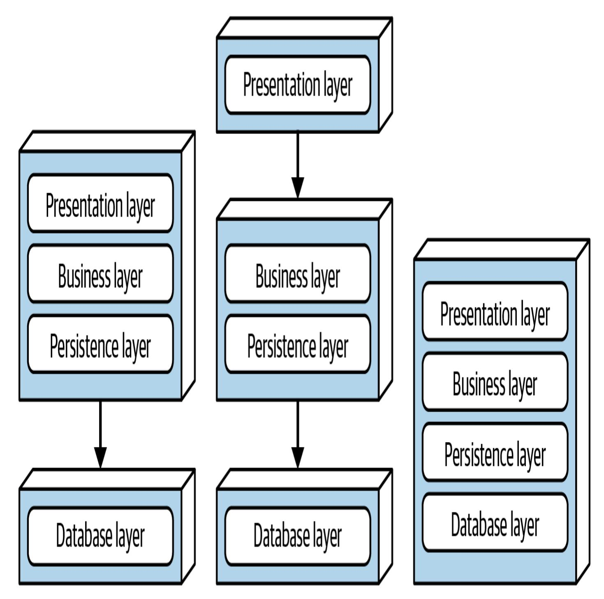
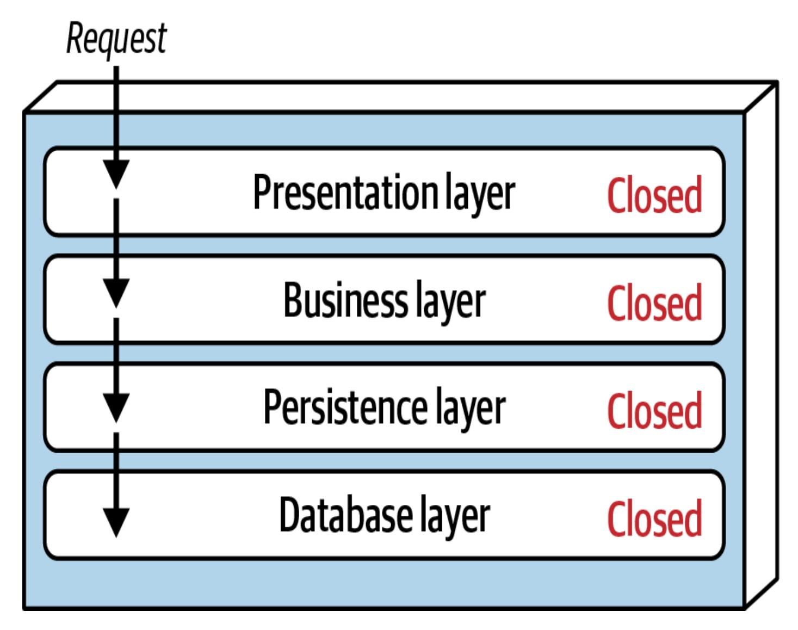
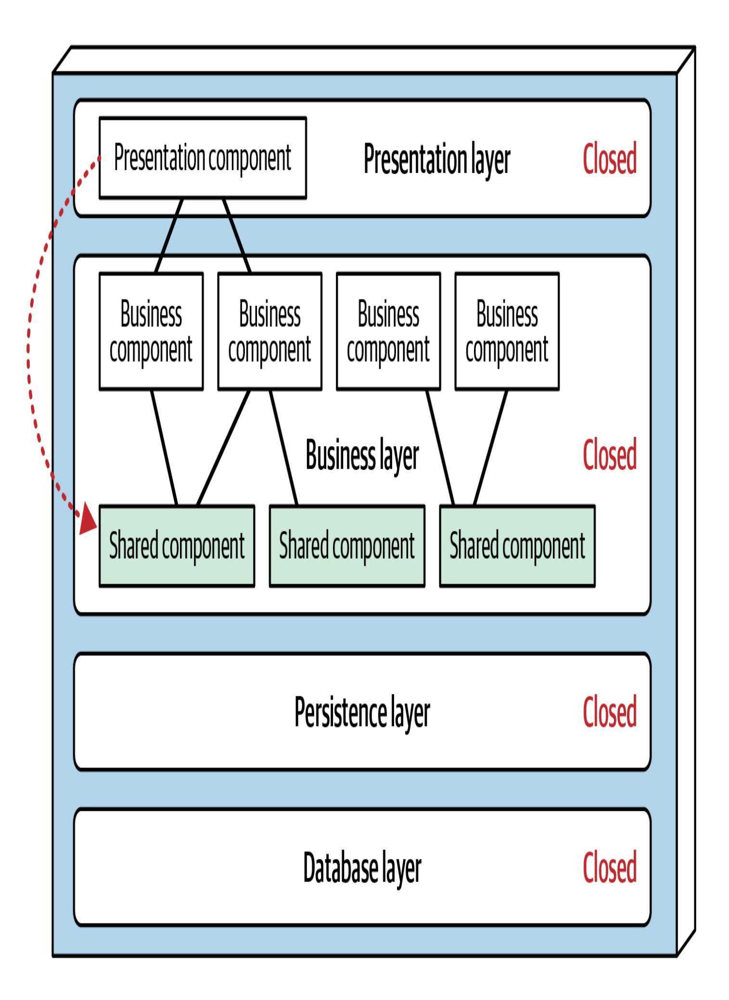
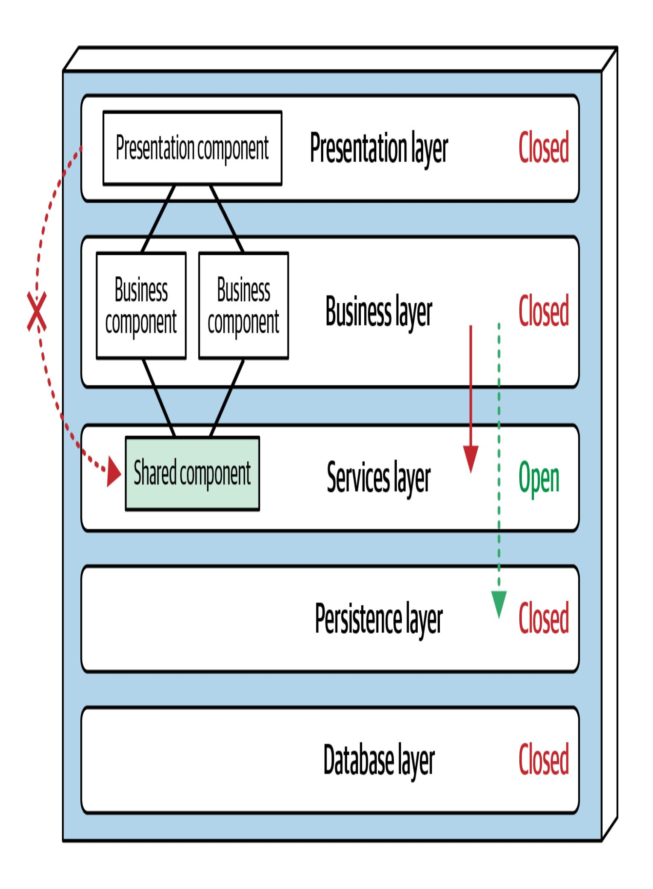

# Kapitel 10. Layered Architecture Stil

Diese Arbeit wurde mithilfe von KI übersetzt. Wir freuen uns über dein Feedback und deine Kommentare: [translation-feedback@oreilly.com](mailto:translation-feedback@oreilly.com)

Die *Schichtenarchitektur*, auch bekannt als *n-tiered*, ist einer der gängigsten Architekturstile. Aufgrund ihrer Einfachheit, Vertrautheit und geringen Kosten ist sie der De-facto-Standard für viele Legacy-Anwendungen.

Der Stil der Schichtenarchitektur kann in mehrere architektonische Antipatterns fallen, darunter das *[Architecture](https://oreil.ly/QAFGg) by Implication* und das *Accidental [Architecture](https://oreil.ly/YNBXx)* Antipattern. Wenn Entwickler/innen oder Architekt/innen "einfach anfangen zu programmieren", ohne zu wissen, welchen Architekturstil sie verwenden, stehen die Chancen gut, dass sie den Stil der Schichtenarchitektur umsetzen.

# Topologie

Die Komponenten der Schichtenarchitektur sind in logischen horizontalen Schichten organisiert, wie in [Abbildung](#page-1-0) 10-1 dargestellt, wobei jede Schicht eine bestimmte Aufgabe innerhalb der Anwendung übernimmt (z. B. Präsentationslogik oder Geschäftslogik). Obwohl es keine spezifischen Beschränkungen in Bezug auf die Anzahl und Art der Schichten gibt, bestehen die meisten Schichtenarchitekturen aus vier Standardschichten: Präsentation, Business, Persistenz und Datenbank. In einigen Architekturen werden die Business- und die Persistenzschicht kombiniert, vor allem wenn die Persistenzlogik (wie SQL oder HSQL) in die Komponenten der Business-Schicht eingebettet ist. Kleinere Anwendungen haben vielleicht nur drei Schichten, während größere und komplexere Geschäftsanwendungen fünf oder mehr enthalten können.

<span id="page-1-0"></span>

Abbildung 10-1. Logische Standardschichten im Stil der Schichtenarchitektur

[Abbildung](#page-3-0) 10-2 zeigt die Topologievarianten aus der Perspektive der physischen Schichten (Bereitstellung). Bei der ersten Variante werden die Präsentations-, Geschäfts- und Persistenzschicht in einer einzigen Bereitstellungseinheit zusammengefasst, wobei die Datenbankschicht in der Regel als separate externe physische Datenbank (oder Dateisystem) dargestellt wird. Bei der zweiten Variante wird die Präsentationsschicht physisch in eine eigene Bereitstellungseinheit getrennt, während die Business- und Persistenzschicht in einer zweiten Bereitstellungseinheit zusammengefasst werden. Auch bei dieser Variante wird die Datenbankschicht normalerweise durch eine externe Datenbank oder ein Dateisystem physisch getrennt. Eine dritte Variante kombiniert alle vier Standardschichten in einer einzigen Einsatzeinheit, einschließlich der Datenbankschicht. Diese Variante kann für kleinere Anwendungen mit einer intern eingebetteten Datenbank oder einer In-Memory-Datenbank nützlich sein, z. B. für Anwendungen auf mobilen Geräten. Viele On-Premises-Produkte (vor Ort) werden mit dieser dritten Variante erstellt und an Kunden ausgeliefert.

<span id="page-3-0"></span>

Abbildung 10-2. Physikalische Topologie (Einsatzvarianten)

Jede Schicht hat eine bestimmte Rolle und Verantwortung und bildet eine Abstraktion um die Arbeit, die getan werden muss, um eine bestimmte Geschäftsanfrage zu erfüllen. Die Präsentationsschicht ist zum Beispiel für die gesamte Benutzeroberfläche und die Kommunikationslogik des Browsers zuständig, während die

Geschäftsschicht für die Ausführung der mit der Anfrage verbundenen spezifischen Geschäftsregeln verantwortlich ist. Die Präsentationsschicht muss nicht wissen oder sich darum kümmern, wie sie Kundendaten erhält; sie muss diese Informationen nur in einem bestimmten Format auf dem Bildschirm anzeigen. Die Geschäftsschicht muss sich auch nicht darum kümmern, wie die Kundendaten für die Anzeige auf einem Bildschirm formatiert werden oder woher die Daten kommen. Sie muss lediglich die Daten von der Persistenzschicht abrufen, eine Geschäftslogik darauf anwenden (z. B. Werte berechnen oder Daten aggregieren) und diese Informationen an die Präsentationsschicht weitergeben.

Diese Trennung von Belangen im Stil der Schichtenarchitektur macht es einfach, effektive Rollen- und Verantwortungsmodelle zu erstellen. Die Komponenten einer bestimmten Schicht haben einen begrenzten Anwendungsbereich und befassen sich nur mit der Logik, die zu dieser Schicht gehört. So behandeln Komponenten in der Präsentationsschicht nur die Präsentationslogik, während Komponenten in der Geschäftsschicht nur die Geschäftslogik behandeln. Auf diese Weise können sich die Entwickler/innen mit ihrem speziellen Fachwissen auf die technischen Aspekte der Domäne konzentrieren (z. B. Präsentationslogik oder Persistenzlogik). Der Kompromiss dieses Vorteils ist jedoch ein Mangel an *ganzheitlicher Agilität* (die Fähigkeit des gesamten Systems, schnell auf Veränderungen zu reagieren).

Die Schichtenarchitektur ist eine *technisch partitionierte* Architektur (im Gegensatz zu einer *domänenpartitionierten* Architektur). Das bedeutet,

wie du in [Kapitel](#page--1-0) 9 gelernt hast, dass die Komponenten nach ihrer technischen Rolle in der Architektur (z. B. Präsentation oder Geschäft) und nicht nach ihrem Bereich (z. B. Kunde) getrennt sind. Das hat zur Folge, dass eine bestimmte Geschäftsdomäne über alle Schichten der Architektur verteilt ist. Die Domäne "Kunde" ist zum Beispiel in der Präsentationsschicht, der Geschäftsschicht, der Regelschicht, der Serviceschicht und der Datenbankschicht enthalten, was es schwierig macht, Änderungen an dieser Domäne vorzunehmen. Daher passt ein DDD-Ansatz nicht besonders gut zum Stil der Schichtenarchitektur.

### Stil Besonderheiten

Schichten in diesem Architekturstil kapseln bestimmte technische Verantwortungsbereiche, aber die Schichten selbst können auch andere Merkmale aufweisen.

### **Schichten der Isolation**

Jede Ebene kann entweder geschlossen oder offen sein. Wenn eine Ebene *geschlossen* ist, kann eine Anfrage auf dem Weg von der obersten zur untersten Ebene keine Ebenen überspringen. Sie muss durch die unmittelbar darunter liegende Schicht gehen, um zur nächsten Schicht zu gelangen (siehe [Abbildung](#page-6-0) 10-3). In einer Architektur, in der alle Schichten geschlossen sind, muss eine Anfrage, die von der Präsentationsschicht ausgeht, zum Beispiel zuerst die Geschäftsschicht und dann die Persistenzschicht durchlaufen, bevor sie schließlich die Datenbankschicht erreicht.

<span id="page-6-0"></span>

Abbildung 10-3. Geschlossene Schichten innerhalb einer mehrschichtigen Architektur

Beachte, dass es in [Abbildung](#page-6-0) 10-3 viel schneller und einfacher wäre, wenn die Präsentationsschicht für einfache Abfragen direkt auf die Datenbank zugreifen und alle unnötigen Schichten umgehen würde (was in den frühen 2000er Jahren als *Fast-Lane-Reader-Muster* bekannt war). Dazu müssten die Business- und die Persistenzschicht *offen* sein, so dass Anfragen die anderen Schichten umgehen können. Was ist besser offene Schichten oder geschlossene Schichten? Die Antwort auf diese Frage liegt in einem Schlüsselkonzept, das als *Isolationsschichten* bekannt ist.

Das Konzept *der Isolationsschichten* bedeutet, dass sich Änderungen in einer Schicht der Architektur in der Regel nicht auf die Komponenten in anderen Schichten auswirken, sofern die Verträge zwischen diesen Schichten unverändert bleiben. Jede Schicht ist unabhängig von den anderen Schichten und hat wenig oder gar keine Kenntnis von deren Innenleben. Um die Isolation der Schichten zu unterstützen, müssen die Schichten, die am Hauptfluss einer Anfrage beteiligt sind, jedoch geschlossen sein. Wenn die Präsentationsschicht direkt auf die Persistenzschicht zugreifen kann, wirken sich Änderungen in der Persistenzschicht sowohl auf die Geschäftsschicht *als auch auf die* Präsentationsschicht aus. Das macht eine Schichtenarchitektur sehr brüchig und macht es schwierig und teuer, sie zu ändern.

<span id="page-7-0"></span>Durch die Verwendung von Isolationsschichten kann jede Schicht in der Architektur ersetzt werden, ohne dass dies Auswirkungen auf eine andere Schicht hat (vorausgesetzt, die Verträge sind klar definiert und das *Business Delegate* Pattern wird verwendet). So kannst du zum Beispiel dein älteres UI-Framework durch ein neueres ersetzen, und zwar innerhalb der Präsentationsschicht. **[1](#page-25-0)**

### **Hinzufügen von Layern**

Auch wenn geschlossene Schichten die Isolierung von Schichten erleichtern und damit helfen, Änderungen zu isolieren, gibt es Zeiten, in denen es sinnvoll ist, dass bestimmte Schichten offen sind. Nehmen wir zum Beispiel an, die Business-Schicht deiner Schichtenarchitektur verfügt über gemeinsam genutzte Objekte, die gemeinsame Funktionen

für Business-Komponenten enthalten (z. B. Datums- und String-Utility-Klassen, Auditing-Klassen, Logging-Klassen usw.). Du triffst eine architektonische Entscheidung, die es der Präsentationsschicht verbietet, diese gemeinsamen Geschäftsobjekte zu nutzen. Diese Einschränkung ist in [Abbildung](#page-9-0) 10-4 dargestellt, wobei die gestrichelte Linie von einer Präsentationskomponente zu einem gemeinsam genutzten Geschäftsobjekt in der Geschäftsschicht führt. Dieses Szenario ist schwer zu steuern und zu kontrollieren, da die Präsentationsschicht *architektonisch gesehen* Zugriff auf die Geschäftsschicht und damit auch auf die gemeinsamen Objekte innerhalb dieser Schicht hat.



Eine Möglichkeit, diese Einschränkung architektonisch umzusetzen, wäre das Hinzufügen einer neuen Serviceschicht, die alle gemeinsamen Geschäftsobjekte enthält (siehe [Abbildung](#page-11-0) 10-5). Das Hinzufügen dieser neuen Schicht würde die Präsentationsschicht architektonisch daran hindern, auf die gemeinsamen Geschäftsobjekte zuzugreifen, da die Geschäftsschicht geschlossen ist. Du musst die neue Serviceschicht jedoch als *offen* markieren, da die Business-Schicht sonst gezwungen wäre, die Serviceschicht zu durchlaufen, um auf die Persistenzschicht zuzugreifen. Wenn du die Dienstebene als offen markierst, kann die Geschäftsebene entweder auf diese Ebene zugreifen (wie durch den durchgezogenen Pfeil angezeigt) oder sie umgehen und zur nächsttieferen Ebene gehen (wie durch den gepunkteten Pfeil angezeigt).



Die Nutzung des Konzepts der offenen und geschlossenen Schichten hilft dabei, die Beziehung zwischen den Architekturschichten und den Anfrageflüssen zu definieren. Außerdem erhalten die Entwickler so die notwendigen Informationen und Anleitungen, um die Zugriffsbeschränkungen der Schichten innerhalb der Architektur zu verstehen. Wenn nicht dokumentiert oder kommuniziert wird, welche Schichten in der Architektur offen und geschlossen sind (und warum), führt dies in der Regel zu eng gekoppelten, brüchigen Architekturen, die sehr schwer zu testen, zu warten und einzusetzen sind.

In jeder Schichtenarchitektur gibt es zumindest einige Szenarien, die in das *Architektur-Sinkloch-Antipattern* fallen. Dieses Muster tritt auf, wenn Anfragen einfach von Schicht zu Schicht weitergeleitet werden, ohne dass eine Geschäftslogik ausgeführt wird. Nehmen wir zum Beispiel an, die Präsentationsschicht antwortet auf die einfache Anfrage eines Benutzers, der grundlegende Kundendaten (wie Name und Adresse) abrufen möchte. Die Präsentationsschicht leitet die Anfrage an die Geschäftsschicht weiter, die nichts anderes tut, als die Anfrage an die Regelschicht weiterzuleiten, die wiederum nichts anderes tut, als sie an die Persistenzschicht weiterzuleiten, die dann einen einfachen SQL-Aufruf an die Datenbankschicht macht, um die Kundendaten abzurufen. Die Daten werden dann ohne zusätzliche Verarbeitung oder Logik zum Aggregieren, Berechnen, Anwenden von Regeln oder Umwandeln den ganzen Weg zurück in den Stack geleitet. Dies führt zu einer unnötigen

Instanziierung und Verarbeitung von Objekten, was sowohl den Speicherverbrauch als auch dieLeistung beeinträchtigt.

Um festzustellen, ob es sich um ein Antipattern handelt, musst du den Prozentsatz der Anfragen analysieren, die in diese Kategorie fallen. Die 80-20-Regel ist normalerweise eine gute Vorgehensweise. So ist es zum Beispiel akzeptabel, wenn nur 20 % der Anfragen Sinkholes sind. Wenn es jedoch 80 % sind, ist das ein guter Indikator dafür, dass die Schichtenarchitektur nicht der richtige Architekturstil für den Problembereich ist. Ein anderer Ansatz, um das Problem der Architektur-Sinklöcher zu lösen, besteht darin, alle Schichten der Architektur offen zu gestalten - natürlich mit dem Kompromiss, dass die Verwaltung von Änderungen schwieriger wird.

## Daten-Topologien

Traditionell bilden Schichtenarchitekturen ein monolithisches System neben einer einzigen, monolithischen Datenbank. Die gemeinsame Persistenzschicht wird oft verwendet, um Objekthierarchien zwischen den bevorzugten objektorientierten Sprachen und der mengenbasierten Welt der relationalen Datenbanken abzubilden.

# Überlegungen zur Cloud

Da Schichtenarchitekturen in der Regel monolithisch und in Schichten aufgeteilt sind, beschränken sich die Cloud-Optionen auf die

Bereitstellung einer oder mehrerer Schichten über einen Cloud-Provider. Die dieser Architektur innewohnende technische Partitionierung eignet sich gut für die getrennte Bereitstellung in der Cloud. Allerdings kann die Kommunikationslatenz zwischen den Servern vor Ort und der Cloud zu Problemen führen, da die Arbeitsabläufe in dieser Architektur in der Regel die meisten Schichten durchlaufen.

### Gemeinsame Risiken

Schichtenarchitekturen bieten keine Fehlertoleranz, da sie monolithisch aufgebaut sind und keine modulare Architektur aufweisen. Wenn in einem kleinen Teil einer Schichtenarchitektur ein Out-of-Memory-Zustand auftritt, stürzt die gesamte Anwendung ab. Die Gesamtverfügbarkeit wird auch dadurch beeinträchtigt, dass die meisten monolithischen Anwendungen eine hohe mittlere Wiederherstellungszeit (MTTR) haben: Die Startzeiten können zwischen 2 Minuten bei kleineren Anwendungen und 15 Minuten oder mehr bei den meisten großen Anwendungen liegen.

### Governance

Das ist eine gute Nachricht für die Verwaltung dieses Architekturstils: Weil er so weit verbreitet ist, haben die Architekten, die einige der ursprünglichen Strukturtest-Tools entwickelt haben, diese Architektur im Hinterkopf gehabt. Die Beispiel-Fitnessfunktion in [Abbildung](#page--1-0) 6-4

wurde sogar für die [Schichtenarchitektur](#page-15-0) entwickelt (siehe Beispiel 10- 1).

#### <span id="page-15-0"></span>**Beispiel 10-1. ArchUnit-Fitnessfunktion zur Steuerung von Schichten**

```
layeredArchitecture()
.layer("Controller").definedBy("..controller..")
.layer("Service").definedBy("..service..")
.layer("Persistence").definedBy("..persistence..")
.whereLayer("Controller").mayNotBeAccessedByAnyLayer()
.whereLayer("Service").mayOnlyBeAccessedByLayers("Control
.whereLayer("Persistence").mayOnlyBeAccessedByLayers("Ser
```

In [Beispiel](#page-15-0) 10-1 definiert der Architekt die Schichten in der Architektur und vergibt praktische Namen wie Controller für die Komponente, die durch den Paketnamen dargestellt wird. (In der ArchUnit-Syntax zeigen zwei Punkte ( .. ) auf beiden Seiten eines Paketnamens an, dass er Eigentum ist.) Dann legt der Architekt die Kommunikation zwischen den Schichten fest, indem er ihre offenen und geschlossenen Schichten bestimmt.

Fitness-Funktionsbibliotheken unterstützen den Stil der Schichtenarchitektur sehr gut und ermöglichen es Architekten, die Steuerung der Beziehungen zwischen den Schichten während der Implementierung zu automatisieren.

# Überlegungen zur Team-Topologie

Anders als einige der in diesem Buch beschriebenen Architekturstile ist der Stil der Schichtenarchitektur im Allgemeinen unabhängig von Teamtopologien und funktioniert mit jederTeamkonfiguration:

#### *Auf den Strom ausgerichtete Teams*

Da die Schichtenarchitektur in der Regel klein und in sich geschlossen ist und eine einzige Reise oder einen einzigen Fluss durch das System darstellt, funktioniert sie gut mit Teams, die auf einen Fluss ausgerichtet sind. Bei dieser Team-Topologie sind die Teams in der Regel für den Fluss durch das System von Anfang bis Ende verantwortlich und erstellen Workflows als Teil ihrer Lösungen.

#### *Teams befähigen*

Da die Schichtenarchitektur hochgradig modular und nach technischen Gesichtspunkten getrennt ist, lässt sie sich gut mit Team-Topologien kombinieren. Spezialisten und bereichsübergreifende Teammitglieder können mit einer oder mehreren Schichten interagieren, um Vorschläge zu machen und Experimente durchzuführen, ohne den Rest des Ablaufs zu beeinträchtigen. So kann das Team z. B. mit einer neuen UI-Bibliothek experimentieren, indem es der Präsentationsschicht neue Verhaltensweisen hinzufügt, während die anderen Schichten von den Änderungen isoliert werden.

*Teams mit komplizierten Subsystemen*

Da jede Schicht eine ganz bestimmte Aufgabe erfüllt, eignet sich dieser Stil gut für die Team-Topologie mit komplizierten Subsystemen. Die Persistenzschicht ist zum Beispiel der perfekte Aufhänger für ein Team, das zu Analysezwecken Zugriff auf Betriebsdaten benötigt. Wenn der Zugriff auf die Persistenzschicht erlaubt ist, kann das Team des komplizierten Subsystems arbeiten, ohne die anderen Schichten zu beeinträchtigen, die den auf den Stream ausgerichteten Teams noch gehören.

#### *Plattform-Teams*

Plattformteams, die an einer mehrschichtigen Architektur arbeiten, können den hohen Grad an Modularität nutzen, indem sie die vielen dafür verfügbaren Werkzeuge einsetzen.

Die größte Herausforderung für die meisten Plattformteams ist das gleiche Problem wie bei Monolithen im Allgemeinen: Wenn sie wachsen, werden sie immer unhandlicher. Wenn Teams immer neue Funktionen zu einem Monolithen hinzufügen, egal wie gut partitioniert und verwaltet er ist, wird er irgendwann an seine Grenzen stoßen: Datenbankverbindungen, Speicher, Leistung, gleichzeitige Benutzer oder eine Reihe anderer drohender Probleme. Um das System funktionsfähig zu halten, muss das Plattformteam immer schwierigere Aufgaben erledigen.

# Stilmerkmale

Eine Ein-Stern-Bewertung in der Tabelle zur Bewertung der Merkmale (siehe [Abbildung](#page-19-0) 10-6) bedeutet, dass ein bestimmtes Architekturmerkmal in der Architektur nicht gut unterstützt wird, während eine Fünf-Sterne-Bewertung bedeutet, dass das Architekturmerkmal eines der stärksten Merkmale des Architekturstils ist. Die Definition für jedes in der Scorecard identifizierte Merkmal findest du in [Kapitel](#page--1-0) 4.

|             | Architectural characteristic | Star rating                      |
|-------------|------------------------------|----------------------------------|
|             | Overall cost                 | \$                               |
| Structural  | Partitioning type            | Technical                        |
|             | Number of quanta             | 1                                |
|             | Simplicity                   | ***                              |
|             | Modularity                   | $\bigstar$                       |
| Engineering | Maintainability              | $\stackrel{\bigstar}{\sim}$      |
|             | Testability                  | $\stackrel{\wedge}{\Rightarrow}$ |
|             | Deployability                | $\stackrel{\bigstar}{\sim}$      |
|             | Evolvability                 | $\stackrel{\bigstar}{\sim}$      |
| Operational | Responsiveness               | <b>☆☆☆</b>                       |
|             | Scalability                  | $\bigstar$                       |
|             | Elasticity                   | $\stackrel{\bigstar}{\sim}$      |
|             | Fault tolerance              | $\stackrel{\bigstar}{\sim}$      |

Gesamtkosten und Einfachheit sind die Hauptstärken der Schichtenarchitektur. Da sie monolithisch sind, sind Schichtenarchitekturen nicht so komplex wie verteilte Architekturen; sie sind einfacher, leichter zu verstehen und relativ kostengünstig zu erstellen und zu warten. Sei jedoch vorsichtig, denn diese Eigenschaften nehmen schnell ab, wenn die monolithische Schichtenarchitektur größer und damit komplexer wird.

Weder die Einsetzbarkeit noch die Testbarkeit sind bei diesem Architekturstil gut. Die Einsatzfähigkeit ist gering, weil der Einsatz ein hohes Risiko birgt, selten erfolgt und mit viel Aufwand verbunden ist. Um beispielsweise eine einfache dreizeilige Änderung an einer Klassendatei vorzunehmen, muss die gesamte Bereitstellungseinheit neu bereitgestellt werden, was die Gefahr birgt, dass sich neben der ursprünglichen Änderung auch Änderungen an der Datenbank, der Konfiguration oder anderen Aspekten des Codes einschleichen. Außerdem wird diese einfache dreizeilige Änderung in der Regel mit Dutzenden von anderen Änderungen gebündelt, die das Risiko und die Häufigkeit von Deployments weiter erhöhen. Die niedrige Bewertung der Testbarkeit spiegelt dieses Szenario ebenfalls wider: Bei einer einfachen dreizeiligen Änderung werden die meisten Entwickler nicht Stunden damit verbringen, die gesamte Regressionstestsuite für eine einfache dreizeilige Änderung auszuführen (vorausgesetzt, sie haben überhaupt eine solche Testsuite). Wir bewerten die Testbarkeit mit zwei Sternen (statt einem Stern), weil dieser Stil die Möglichkeit bietet,

Komponenten oder sogar eine ganze Schicht zu mocken oder zu stubben, was den Testaufwand insgesamt erleichtert.

Die technischen Merkmale der Schichtenarchitektur spiegeln die oben erwähnte Dynamik wider: Sie fangen alle gut an, verschlechtern sich aber mit zunehmender Größe der Codebasis.

Elastizität und Skalierbarkeit werden bei der Schichtenarchitektur sehr niedrig bewertet (ein Stern), was in erster Linie auf die monolithischen Implementierungen und die fehlende Modularität der Architektur zurückzuführen ist. Obwohl es möglich ist, bestimmte Funktionen innerhalb eines Monolithen stärker zu skalieren als andere, erfordert dieser Aufwand in der Regel sehr komplexe Entwurfstechniken, für die diese Architektur nicht gut geeignet ist, wie z. B. Multithreading, internes Messaging und andere Parallelverarbeitungsmethoden. Da das Architekturquantum eines Schichtsystems jedoch immer 1 ist (aufgrund der monolithischen Benutzeroberfläche und Datenbank sowie der Backend-Verarbeitung), können Anwendungen nur bis zu einem bestimmten Punkt skalieren.

Architekten können mit sorgfältigem Design eine hohe Reaktionsfähigkeit in einer geschichteten Architektur erreichen und diese durch Techniken wie Caching und Multithreading weiter steigern. Wir geben diesem Stil insgesamt drei Sterne, denn er leidet unter dem Mangel an inhärenter Parallelverarbeitung sowie unter dem geschlossenen Layering und dem Architektur-Sinkhole-Antipattern.

### **Wann verwendet man**

Der mehrschichtige Architekturstil ist eine gute Wahl für kleine, einfache Anwendungen oder Websites. Er ist auch ein guter Ausgangspunkt für Situationen mit sehr engen Budget- und Zeitvorgaben. Aufgrund seiner Einfachheit und seiner Vertrautheit mit Entwicklern und Architekten ist dies vielleicht einer der kostengünstigsten Stile, der die Entwicklung kleinerer Anwendungen erleichtert. Die Schichtenarchitektur ist auch eine gute Wahl, wenn Architekten noch überlegen, ob komplexere Architekturen besser geeignet wären, aber mit der Entwicklung beginnen müssen.

Wenn du diese Technik anwendest, solltest du die Wiederverwendung von Code auf ein Minimum beschränken und die Objekthierarchien (die Tiefe des Vererbungsbaums) relativ flach halten, um ein gutes Maß an Modularität zu erhalten. Das erleichtert später den Wechsel zu einem anderen Architekturstil.

### **Wann man nicht verwenden sollte**

Wie wir gezeigt haben, werden Eigenschaften wie Wartbarkeit, Agilität, Testbarkeit und Verteilbarkeit negativ beeinflusst, wenn Anwendungen, die den Stil der Schichtenarchitektur verwenden, wachsen. Aus diesem Grund sollten große Anwendungen und Systeme besser auf andere, modularere Architekturen umgestellt werden.

# Beispiele und Anwendungsfälle

Die Schichtenarchitektur ist einer der häufigsten Architekturstile und taucht in zahlreichen Kontexten auf.

Entwickler von Betriebssystemen (wie Linux oder Windows) verwenden Schichten aus denselben Gründen wie Anwendungsarchitekten: Sie wollen ihre Anliegen voneinander trennen. Zu den gängigen Schichten in Betriebssystemen gehören:

*Hardware-Ebene*

Beinhaltet physische Hardware wie CPU, Speicher und E/A-Geräte

*Kernel-Schicht*

Bietet Hardwareabstraktion, Speicherverwaltung und Prozessplanung

*System Call Interface Schicht*

Interagiert mit dem Kernel, um Systemdienste bereitzustellen

*Benutzerschicht*

Umfasst Anwendungen und Dienstprogramme, mit denen Benutzer interagieren

Das OSI-Modell ( *Open Systems Interconnection* ) beschreibt, wie Netzwerke die Zuständigkeiten abgrenzen. Das Basisprotokoll des Internets, TCP/IP, umfasst zum Beispiel die folgenden Schichten:

*Physikalische Schicht* Überträgt Daten physisch

*Datenübertragungsschicht*

Verwendet Fehlererkennung und Frame-Synchronisation

*Network+ Schicht*

Verwaltet das Routing (z. B. IP)

*Transportschicht*

Gewährleistet eine zuverlässige Datenübertragung (z. B. TCP)

*Anwendungsschicht*

Bietet Dienste wie E-Mail (SMTP), Dateiübertragung (FTP) und Webbrowsing (HTTP)

Die Schichtenarchitektur fördert die Trennung von Belangen, verbessert die Wartbarkeit und ermöglicht eine unabhängige Entwicklung der einzelnen Schichten, so dass jede Architektur, die diese Eigenschaften schätzt, davon profitiert.

Eine mehrschichtige Architektur wird auch sehr häufig von Teams verwendet, die versuchen, die architektonischen Merkmale der *Machbarkeit* zu erreichen: Können wir den angegebenen Umfang in der vorgegebenen Zeit mit den verfügbaren Ressourcen tatsächlich umsetzen? Wenn ein Unternehmen zum Beispiel von Investoren getrieben wird und so schnell wie möglich etwas liefern muss, ist die Einfachheit der Schichtenarchitektur oft eine gute Wahl, selbst wenn Teile später umgeschrieben werden müssen, um andere Fähigkeiten zu erreichen.

<span id="page-25-0"></span>*Business Delegate* ist ein Muster, das die Kopplung zwischen Geschäftsdiensten und der Benutzeroberfläche verringern soll. Business Delegates fungieren als Adapter, um Geschäftsobjekte von der Präsentationsschicht aus aufzurufen. **[1](#page-7-0)**