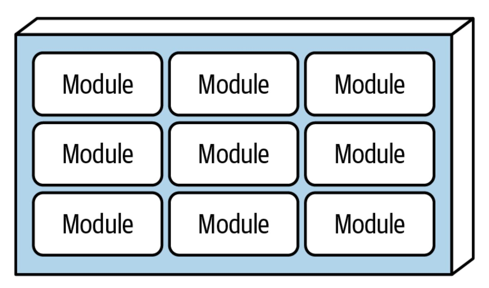
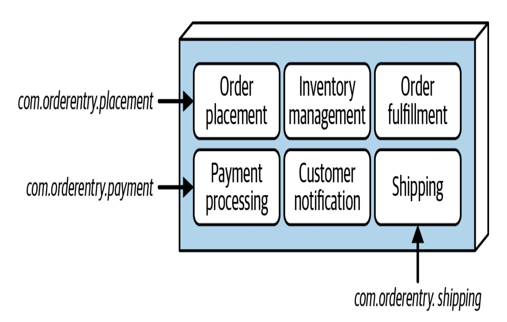
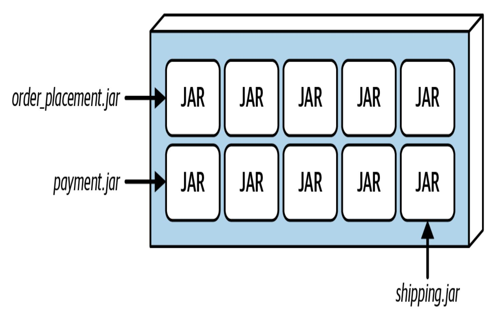
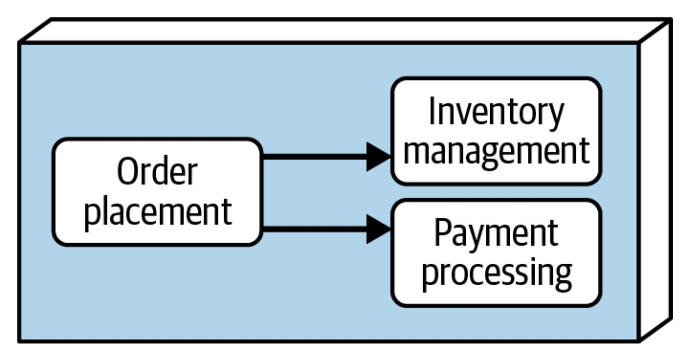
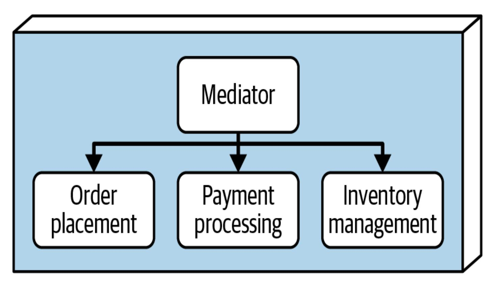
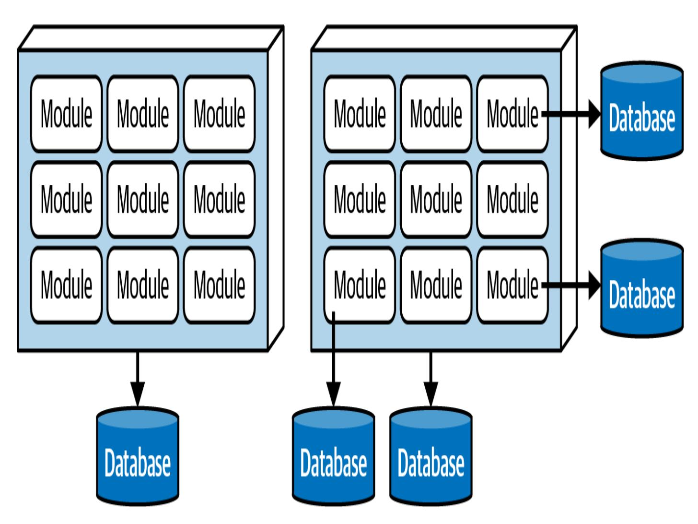
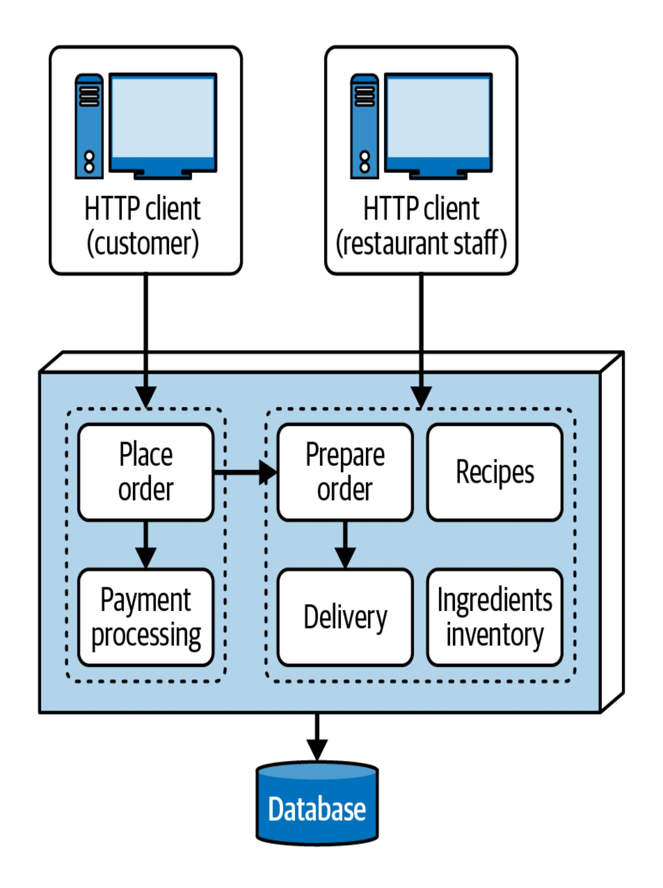

# Kapitel 11. Der modulare monolithische Architekturstil

Diese Arbeit wurde mithilfe von KI übersetzt. Wir freuen uns über dein Feedback und deine Kommentare: [translation-feedback@oreilly.com](mailto:translation-feedback@oreilly.com)

Dank der weit verbreiteten Einführung von [Domain-Driven](https://oreil.ly/czIi5) Design (DDD) und der verstärkten Konzentration auf die Partitionierung von Domänen hat der *modulare monolithische* Architekturstil seit der ersten Ausgabe dieses Buches im Jahr 2020 so stark an Popularität gewonnen, dass wir beschlossen haben, der zweiten Ausgabe ein Kapitel hinzuzufügen, in dem er beschrieben (und bewertet) wird.

# Topologie

Wie der Name schon sagt, handelt es sich beim modularen monolithischen Architekturstil um eine *monolithische* Architektur. Als solche wird sie als eine einzige Softwareeinheit eingesetzt: eine WAR-Datei (Web Archive), eine einzelne Assembly in .NET, eine EAR-Datei (Enterprise Archive) in der Java-Plattform und so weiter. Da der modulare Monolith als eine Architektur *mit Domänenunterteilung* gilt (die nach Geschäftsbereichen und nicht nach technischen Fähigkeiten organisiert ist), wird seine isomorphe Form als *eine einzelne Bereitstellungseinheit* definiert *, deren Funktionen nach*

*Domänenbereichen gruppiert sind*. [Abbildung](#page-1-0) 11-1 veranschaulicht die typische Topologie eines modularen Monolithen.

Um einen Eindruck von der Art des modularen Monolithen zu bekommen, betrachte die traditionelle Schichtenarchitektur (beschrieben in [Kapitel](#page--1-0) 10). Ihre Komponenten werden durch ihre *technischen* Fähigkeiten definiert und organisiert: Präsentations-, Geschäfts- und Persistenzschicht und so weiter. Die Präsentationslogik für die Pflege von Kundenprofilen könnte zum Beispiel durch eine Komponente mit dem Namensraum *com.app.presentation.customer.profile* dargestellt werden. Der dritte Knoten im Namensraum steht für das *technische* Anliegen der Schicht (in diesem Fall die Präsentationsschicht).

<span id="page-1-0"></span>

Abbildung 11-1. Bei der modularen monolithischen Architektur wird die Funktionalität nach Domänenbereichen gruppiert

Im Gegensatz dazu sind modulare monolithische Komponenten hauptsächlich nach *Domänen* organisiert. So würde in einer modularen monolithischen Architektur dieselbe Komponente zur Pflege von Kundenprofilen durch den Namensraum *com.app.customer.profile* repräsentiert werden. In diesem Fall bezieht sich der dritte Knoten des Namensraums eher auf einen *fachlichen* als auf einen technischen Aspekt. Je nach Komplexität der Komponente kann der Namensraum nach *dem* Domain Concern weiter nach technischen Belangen unterteilt werden, z. B. *com.app.customer.profile.presentation* oder *com.app.customer.profile.business*.

## Stil Besonderheiten

Domains (oder in manchen Fällen Subdomains) werden in diesem Architekturstil *Module* genannt. Module können auf eine von zwei Arten organisiert werden. Die einfachste Architektur ist eine *monolithische Struktur*, bei der alle Module und die entsprechenden logischen Komponenten in derselben Codebasis enthalten sind, die durch den Namensraum oder die Verzeichnisstruktur, in der sie enthalten sind, abgegrenzt wird. Eine etwas komplexere Option ist die *modulare Struktur*, bei der jedes Modul als unabhängiges, in sich geschlossenes Artefakt (z. B. eine JAR- oder DLL-Datei) dargestellt wird und die Module bei der Bereitstellung zu einer monolithischen Softwareeinheit zusammengefasst werden.

Wie bei allem in der Softwarearchitektur hängt die Wahl zwischen diesen beiden strukturellen Optionen von vielen Faktoren und

Kompromissen ab. In den folgenden Abschnitten werden beide Optionen vorgestellt und die entsprechenden Kompromisse diskutiert.

## <span id="page-3-1"></span>**Monolithische Struktur**

Bei der monolithischen Struktur sind alle Module, die das System darstellen, in einem einzigen Quellcode-Repository enthalten. Der gesamte Code der einzelnen Module wird bei der Auslieferung oder Freigabe der Software als eine Einheit bereitgestellt. Diese strukturelle Option ist in [Abbildung](#page-3-0) 11-2 dargestellt. Jedes Modul wird durch ein eigenes übergeordnetes Verzeichnis repräsentiert, das die Komponenten und alle Subdomänen enthält, aus denen das Modul besteht.

<span id="page-3-0"></span>

Abbildung 11-2. Ein Beispiel für die Option der monolithischen Struktur

Die folgenden Namensräume veranschaulichen, wie ein modularer Monolith für die in [Abbildung](#page-3-0) 11-2 dargestellte Architektur aussehen könnte:

```
com.orderentry.orderplacement
com.orderentry.inventorymanagement
com.orderentry.paymentprocessing
com.orderentry.notification
com.orderentry.fulfillment
com.orderentry.shipping
```

Dies ist die einfachste Option für den modularen Monolithen: Der gesamte Quellcode des Systems befindet sich an einem Ort und kann so leichter gewartet, getestet und eingesetzt werden. Allerdings ist eine strenge Governance erforderlich (siehe ["Governance"\),](#page-12-0) um die Grenzen der einzelnen Module zu wahren. Obwohl diese strukturelle Option einfach ist, neigen Entwickler dazu, zu viel Code modulübergreifend wiederzuverwenden und zu viel Kommunikation zwischen den Modulen zuzulassen (siehe ["Modulkommunikation"\).](#page-6-0) Diese Praktiken können einen gut architektonisch aufgebauten modularen Monolithen in einen unstrukturierten Big Ball of Mud verwandeln.

### <span id="page-4-0"></span>**Modularer Aufbau**

Bei der modularen Struktur werden Module als eigenständige Artefakte (z. B. JAR- und DLL-Dateien) dargestellt, die dann bei der Bereitstellung zu einer einzigen Bereitstellungseinheit zusammengefügt werden.

[Abbildung](#page-5-0) 11-3 veranschaulicht diese Option anhand von JAR-Dateien auf der Java-Plattform.

<span id="page-5-0"></span>

Abbildung 11-3. Ein Beispiel für die modulare Strukturoption mit JAR-Dateien

Der Vorteil dieser Struktur ist, dass jedes Modul in sich abgeschlossen ist und die Teams an separaten Modulen arbeiten können (siehe "Überlegungen zur [Team-Topologie"\),](#page-16-0) oft sogar innerhalb des eigenen Quellcode-Repositorys des Teams für diese Module. Diese Option funktioniert gut, wenn die Module weitgehend unabhängig von anderen Modulen sind. Sie eignet sich auch für größere, komplexere Systeme, bei denen jedes Modul eine andere Art von Fachwissen oder Geschäftskenntnissen erfordert. Bei einer modularen Struktur neigen Entwickler/innen weniger dazu, Code zu oft wiederzuverwenden oder

Module zu viel miteinander kommunizieren zu lassen (siehe ["Modulkommunikation"\).](#page-6-0) Diese Option führt auch zu klareren Grenzen zwischen den Modulen und zu einer besseren Trennung der einzelnen Bereiche.

Diese strukturelle Option verliert jedoch ihre Wirksamkeit, wenn Module, die voneinander abhängig sind, miteinander kommunizieren müssen. In diesem Fall ist der Ansatz der monolithischen Struktur effektiver.

### <span id="page-6-0"></span>**Modul Kommunikation**

Kommunikation zwischen Modulen ist in diesem Architekturstil nie eine gute Sache, aber wir erkennen an, dass sie in vielen Fällen notwendig ist. In der in [Abbildung](#page-3-0) 11-2 gezeigten Architektur muss zum Beispiel das Modul OrderPlacement mit dem Modul InventoryManagement kommunizieren, damit dieses den Bestand für den bestellten Artikel anpasst und zusätzliche Verarbeitungen vornimmt (z. B. um mehr Ware zu bestellen, wenn der Bestand zu niedrig ist). Außerdem muss es mit dem Modul PaymentProcessing kommunizieren, um die Zahlung für eine Bestellung zu veranlassen. Es gibt zwei Hauptoptionen für die Kommunikation zwischen den Modulen, die wir in den folgenden Abschnitten beschreiben.

### **Peer-to-Peer-Ansatz**

Die einfachste Lösung ist die einfache Peer-to-Peer-Kommunikation zwischen Modulen. Bei diesem Ansatz instanziiert eine Klassendatei in einem Modul eine Klasse in einem anderen Modul und ruft die notwendige(n) Methode(n) in dieser Klasse auf, um die Operation durchzuführen (siehe [Abbildung](#page-7-0) 11-4).

<span id="page-7-0"></span>

Abbildung 11-4. Peer-to-Peer-Kommunikation zwischen Modulen

Ein Problem des monolithischen Ansatzes ist, dass es für Entwickler *zu* einfach ist, jede Klasse in einem anderen Modul zu instanziieren. Das macht es leicht, von einer gut strukturierten Architektur zum Big Ball of Mud Antipattern zu werden (siehe [Abbildung](#page--1-0) 9-1).

Bei der modularen Struktur können sich die in einem anderen Modul enthaltenen Klassen jedoch in separaten, externen Artefakten (JARs oder DLL-Dateien) befinden und nicht in einem eigenen Verzeichnis im Quellcode-Repository. Ein Modul, das mit anderen Modulen kommuniziert, lässt sich nur dann kompilieren, wenn es die Klassenreferenzen hat, d.h. der Entwickler muss *zur Kompilierzeit* eine

Abhängigkeit zwischen diesen Modulen herstellen. Die übliche Lösung für dieses Problem besteht darin, eine gemeinsame Schnittstellenklasse zwischen den Modulen zu erstellen (in einer separaten JAR- oder DLL-Datei), so dass jedes Modul unabhängig von anderen Modulen kompiliert werden kann. In jedem Fall führt zu viel Kommunikation zwischen den Modulen bei der Verwendung der modularen Struktur zum *DLL Hell* [Antipattern](https://oreil.ly/lx7U5) (oder, in der Java-Plattform, zum *JAR Hell* Antipattern).

### **Mediator-Ansatz**

Der *Mediator-Ansatz* entkoppelt die Module, indem er eine Mediator-Komponente als Abstraktionsschicht zwischen den Modulen einsetzt. Der Mediator fungiert als Orchestrator, der Anfragen entgegennimmt und sie an die entsprechenden Module weiterleitet. [Abbildung](#page-9-0) 11-5 veranschaulicht diesen Ansatz.

<span id="page-9-0"></span>

Abbildung 11-5. Der Mediator entkoppelt die Module, so dass sie nicht miteinander kommunizieren müssen

Der aufmerksame Leser wird feststellen, dass der Mediator-Ansatz die Module zwar entkoppelt, aber jedes Modul effektiv an den Mediator gekoppelt ist. Dieser Ansatz beseitigt nicht *alle* Kopplungen und Abhängigkeiten, aber er vereinfacht die Architektur und hält die Module unabhängig voneinander. Beachte, dass der *Mediator* und nicht die abhängigen Module eine Art API oder Schnittstelle benötigen, um die Funktionen in anderen Modulen aufzurufen.

# Daten-Topologien

Da die modulare monolithische Architektur in der Regel als eine einzige Softwareeinheit eingesetzt wird, basiert sie in der Regel auf einer monolithischen Datenbanktopologie. Die Verwendung einer einzigen

Datenbank hilft, die Kommunikation zwischen den Modulen zu reduzieren, da die Daten gemeinsam genutzt werden. Wenn die Module jedoch unabhängig voneinander sind und spezifische Funktionen erfüllen, können sie auch ihre eigenen Datenbanken mit spezifischen Kontextdaten haben, obwohl die Architektur selbst monolithisch ist. [Abbildung](#page-10-0) 11-6 veranschaulicht diese beiden Möglichkeiten der Datenbanktopologie.

<span id="page-10-0"></span>

Abbildung 11-6. Daten können monolithisch sein oder Module können ihre eigenen Datenbanken haben

# Überlegungen zur Cloud

Obwohl modulare, monolithische Architekturen in Cloud-Umgebungen eingesetzt werden können (vor allem, wenn es sich um ein kleines System handelt), eignen sie sich im Allgemeinen nicht gut für den Einsatz in der Cloud: Aufgrund ihrer monolithischen Natur können sie die Vorteile der On-Demand-Bereitstellung, die Cloud-Umgebungen bieten, weniger gut nutzen. Dennoch können auch kleinere Systeme, die in diesem Architekturstil implementiert sind, viele Cloud-Dienste nutzen, z. B. die Speicherung von Dateien, Datenbanken und Messaging.

## Gemeinsame Risiken

Wie bei jedem monolithischen System besteht auch bei der modularen monolithischen Architektur das Hauptrisiko darin, dass sie zu groß werden kann, um sie ordnungsgemäß zu warten, zu testen und zu implementieren. Monolithische Architekturen sind an sich nicht schlecht, aber wenn sie zu groß werden, gibt es Probleme. Was "zu groß" bedeutet, ist von System zu System unterschiedlich, aber hier sind einige Warnzeichen dafür, dass das System zu groß sein könnte:

- Änderungen brauchen zu lange, um vorgenommen zu werden.
- Wenn ein Bereich des Systems verändert wird, gehen andere Bereiche unerwartet kaputt.
- Die Teammitglieder kommen sich bei der Umsetzung von Änderungen gegenseitig in die Quere.
- Es dauert zu lange, bis das System hochfährt.

Ein weiteres Risiko ist die übertriebene Wiederverwendung von Code. Die Wiederverwendung und gemeinsame Nutzung von Code ist ein notwendiger Bestandteil der Softwareentwicklung, aber bei diesem Architekturstil verwischt eine zu starke Wiederverwendung von Code die Modulgrenzen und führt die Architektur in das riskante Gebiet des *unstrukturierten Monolithen*: eine monolithische Architektur mit so stark voneinander abhängigem Code, dass sie nicht mehr entwirrt werden kann.

Zu viel Kommunikation zwischen den Modulen ist ein weiteres Risiko bei diesem Architekturstil. Idealerweise sollten die Module unabhängig und in sich geschlossen sein. Wie wir bereits festgestellt haben, ist es normal (und manchmal auch notwendig), dass einige Module mit anderen kommunizieren, insbesondere innerhalb eines komplexen Workflows. Wenn es jedoch zu viel Kommunikation zwischen Modulen gibt, ist das ein guter Hinweis darauf, dass die Domänen nicht richtig definiert wurden. In solchen Fällen lohnt es sich, über eine Neudefinition der Domänen nachzudenken, um komplexe Arbeitsabläufe und gegenseitige Abhängigkeiten zu berücksichtigen.

## <span id="page-12-0"></span>Governance

Das primäre Artefakt im modularen monolithischen Stil ist ein *Modul*, das eine bestimmte Domäne oder Subdomäne repräsentiert und in der Regel durch die Verzeichnisstruktur oder den Namespace (oder die Paketstruktur in der Java-Plattform) dargestellt wird. Daher ist eine der ersten Formen der automatisierten Governance, die Architekten

anwenden können, die Definition und Sicherstellung der Einhaltung der in der Architektur verwendeten Module.

Um automatisierte Governance-Prüfungen zu schreiben, verwenden Architekten eine Vielzahl von Tools, darunter [ArchUnit](https://archunit.org/) für die Java-Plattform, [ArchUnitNet](https://oreil.ly/-hjOC) und [NetArchTest](https://oreil.ly/4e-2j) für die .NET-Plattform, [PyTestArch](https://oreil.ly/lWKVt) für Python und [TSArch](https://oreil.ly/Fk4OG) für TypeScript und JavaScript. Der Pseudocode in [Beispiel](#page-13-0) 11-1 stellt sicher, dass der gesamte Quellcode des in [Abbildung](#page-3-0) 11-2 dargestellten Architekturbeispiels unter einen der aufgelisteten Namensräume fällt, die jedes definierte Modul im System darstellen.

### <span id="page-13-0"></span>**Beispiel 11-1. Pseudocode, um sicherzustellen, dass der Code den definierten Modulen des Systems folgt**

```
# The following namespaces represent the modules in the system
LIST module_list = {
   com.orderentry.orderplacement,
   com.orderentry.inventorymanagement,
   com.orderentry.paymentprocessing,
   com.orderentry.notification,
   com.orderentry.fulfillment,
   com.orderentry.shipping
   }
# Get the list of namespaces in the system
LIST namespace_list = get_all_namespaces(root_directory)
# Make sure all the namespaces start with one of the listed modules
FOREACH namespace IN namespace_list {
   IF NOT namespace.starts_with(module_list) {
      send_alert(namespace)
   }
}
```

Wenn ein Entwickler zusätzliche High-Level-Namensräume oder Verzeichnisse außerhalb der definierten Module und ihrer

entsprechenden Namensräume (oder Verzeichnisse) erstellt, erhält er eine Warnung, die darauf hinweist, dass der Quellcode nicht mit der Architektur konform ist.

Diese Form der Governance funktioniert gut mit der Option der monolithischen Struktur dieses Architekturstils (siehe "Monolithische Struktur"), ist aber eine [Herausforderung](#page-3-1) bei der Option der modularen Struktur (siehe ["Modulare](#page-4-0) Struktur"), da der Code möglicherweise nicht in demselben monolithischen Quellcode-Repository enthalten ist. Bei der modularen Struktur muss jedes Modul separat getestet werden, wie in [Beispiel](#page-14-0) 11-2 gezeigt.

### <span id="page-14-0"></span>**Beispiel 11-2. Pseudocode für die Validierung des Moduls** InventoryManagement

```
# Get the list of namespaces in the system
LIST namespace_list = get_all_namespaces(root_directory)
# Make sure all the namespaces start with com.orderentry.inventorymanagement
FOREACH namespace IN namespace_list {
   IF NOT namepace.starts_with("com.orderentry.inventorymanagement") {
      send_alert(namespace)
   }
}
```

Eine weitere Möglichkeit, eine modulare monolithische Architektur zu steuern, besteht darin, den Umfang der Kommunikation zwischen den Modulen zu kontrollieren. Die Definition, was "zu viel" Kommunikation ist, ist sehr subjektiv und variiert von System zu System, aber in den meisten Fällen sollten Architekten versuchen, die Anzahl der Abhängigkeiten zwischen den Modulen zu minimieren. [Beispiel](#page-15-0) 11-3 zeigt einen Pseudocode, der sicherstellt, dass die maximale

Gesamtabhängigkeit nicht mehr als fünf Kommunikationspunkte (oder Kopplungspunkte) beträgt.

### <span id="page-15-0"></span>**Beispiel 11-3. Pseudocode für die Begrenzung der Gesamtzahl der Abhängigkeiten eines bestimmten Moduls**

```
# Walk the directory structure, gathering modules and the source code files
# contained within those modules
LIST module_list = {
   com.orderentry.orderplacement,
   com.orderentry.inventorymanagement,
   com.orderentry.paymentprocessing,
   com.orderentry.notification,
   com.orderentry.fulfillment,
   com.orderentry.shipping
   }
MAP module_source_file_map
FOREACH module IN module_list {
  LIST source_file_list = get_source_files(module)
  ADD module, source_file_list TO module_source_file_map
}
# Determine how many references exist for each source file and send an alert if
# the system's total dependency count is greater than 5
FOREACH module, source_file_list IN module_source_file_map {
  FOREACH source_file IN source_file_list {
    incoming count = used_by_other_module(source_file, module_source_file_map) {
    outgoing_count = uses_other_module(source_file) {
    total_count = incoming count + outgoing count
  }
  IF total_count > 5 {
    send_alert(module, total_count)
  }
}
```

Eine letzte Form der automatischen Steuerung besteht darin, sicherzustellen, dass die Module unabhängig voneinander bleiben, indem ein bestimmtes Modul nicht mit einem anderen Modul kommunizieren darf. In [Abbildung](#page-3-0) 11-2 sollte zum Beispiel das Modul OrderPlacement nicht mit dem Modul Shipping kommunizieren.

[Beispiel](#page-16-1) 11-4 zeigt den ArchUnit-Code in Java, um diese Abhängigkeit zu regeln.

### <span id="page-16-1"></span>**Beispiel 11-4. ArchUnit-Code zur Regelung von Abhängigkeitsrestriktionen zwischen bestimmten Modulen**

```
public void order_placement_cannot_access_shipping() {
   noClasses().that()
   .resideInAPackage("..com.orderentry.orderplacement..")
   .should().accessClassesThat()
   .resideInAPackage("..com.orderentry.shipping..")
   .check(myClasses);
}
```

# <span id="page-16-0"></span>Überlegungen zur Team-Topologie

Da der modulare Monolith als domänenspezifische Architektur gilt, funktioniert er am besten, wenn die Teams auch nach Domänen ausgerichtet sind (z. B. funktionsübergreifende Teams mit Spezialisierung). Wenn eine bereichsbezogene Anforderung auftaucht, kann ein bereichsorientiertes, funktionsübergreifendes Team gemeinsam an dieser Funktion arbeiten, von der Präsentationslogik bis hin zur Datenbank. Umgekehrt funktionieren Teams, die nach technischen Kategorien organisiert sind (z. B. UI-Teams, Backend-Teams, Datenbank-Teams usw.), nicht gut mit diesem Architekturstil, vor allem wegen der Aufteilung nach Bereichen. Die Zuweisung von fachlichen Anforderungen an technisch organisierte Teams erfordert viel

Kommunikation und Zusammenarbeit, was sich oft als schwierig erweist.

Im Folgenden werden einige Überlegungen angestellt, um die in "Team-Topologien und -Architektur" [beschriebenen](#page--1-1) spezifischen Team-Topologien mit dem modularen Monolith-Stil in Einklang zu bringen:

#### *Auf den Strom ausgerichtete Teams*

Teams, die sich an Strömen orientieren, haben in der Regel den Fluss durch das System von Anfang bis Ende in der Hand, was gut zu der monolithischen und im Allgemeinen in sich geschlossenen Form des modularen Monolithen passt.

#### *Teams befähigen*

Aufgrund des hohen Maßes an Modularität und der Trennung von Belangen funktioniert die Team-Topologie ebenfalls gut. Spezialisten und bereichsübergreifende Teammitglieder können Vorschläge machen und Experimente durchführen, indem sie zusätzliche Module in das System einführen, ohne die anderen bestehenden Module zu beeinträchtigen.

#### *Teams mit komplizierten Subsystemen*

Jedes Modul in einer modularen monolithischen Architektur übernimmt in der Regel eine bestimmte Aufgabe, die sich auf seine Domäne oder Subdomäne bezieht (z. B. PaymentProcessing ). Dies funktioniert gut mit der Team-Topologie eines komplizierten Subsystems, da sich verschiedene Teammitglieder unabhängig von

anderen Teammitgliedern (und Modulen) auf die Bearbeitung komplizierter Domänen oder Subdomänen konzentrieren können.

#### *Plattform-Teams*

Entwickler können die Vorteile der Plattform-Teams-Topologie nutzen, indem sie gemeinsame Tools, Dienste, APIs und Aufgaben verwenden, vor allem aufgrund des hohen Maßes an Modularität, das dieser Architekturstil bietet.

# Stilmerkmale

Eine Ein-Stern-Bewertung in der Tabelle in [Abbildung](#page-20-0) 11-7 bedeutet, dass ein bestimmtes Architekturmerkmal in der Architektur nicht gut unterstützt wird, während eine Fünf-Sterne-Bewertung bedeutet, dass das Architekturmerkmal eines der stärksten Merkmale des Architekturstils ist. Die in der Scorecard enthaltenen Merkmale werden in [Kapitel](#page--1-0) 4 beschrieben und definiert.

Der modulare monolithische Architekturstil ist eine *domänenaufgeteilte* Architektur, da die Anwendungslogik in Module aufgeteilt ist. Da sie in der Regel als monolithischer Einsatz implementiert wird, ist ihr Architekturquantum typischerweise 1.

Gesamtkosten, Einfachheit und Modularität sind die Hauptstärken des modularen monolithischen Architekturstils. Da diese Architekturen monolithisch sind, weisen sie nicht die Komplexität auf, die mit verteilten Architekturen verbunden ist. Sie sind einfacher und leichter zu verstehen und relativ kostengünstig zu erstellen und zu warten. Die Modularität der Architektur wird durch die Trennung von Belangen zwischen den verschiedenen Modulen erreicht, die Domänen und Subdomänen darstellen.

Die Einsetzbarkeit und die Testbarkeit werden zwar nur mit zwei Sternen bewertet, sind aber bei der modularen monolithischen Architektur aufgrund ihrer Modularität etwas höher als bei der geschichteten Architektur. Dennoch handelt es sich auch bei dieser Architektur um einen Monolithen: Zeremonie, Risiko, Häufigkeit des Einsatzes und Vollständigkeit der Tests wirken sich negativ auf diese Werte aus.

Die Elastizität und Skalierbarkeit der modularen monolithischen Architektur ist sehr gering (ein Stern), was vor allem auf die monolithischen Implementierungen zurückzuführen ist. Obwohl es möglich ist, bestimmte Funktionen innerhalb eines Monolithen stärker zu skalieren als andere, erfordert dieser Aufwand in der Regel sehr komplexe Designtechniken (wie Multithreading, internes Messaging und andere Parallelverarbeitungspraktiken), für die diese Architektur nicht gut geeignet ist.

|             | Architectural characteristic | Star rating                      |
|-------------|------------------------------|----------------------------------|
|             | Overall cost                 | \$                               |
| Structural  | Partitioning type            | Domain                           |
|             | Number of quanta             | 1                                |
|             | Simplicity                   | ***                              |
|             | Modularity                   | $\stackrel{\wedge}{\Rightarrow}$ |
| Engineering | Maintainability              | $\stackrel{\wedge}{\Rightarrow}$ |
|             | Testability                  | $\stackrel{\wedge}{\Rightarrow}$ |
|             | Deployability                | $\stackrel{\wedge}{\Rightarrow}$ |
|             | Evolvability                 | $\stackrel{\wedge}{\Rightarrow}$ |
| Operational | Responsiveness               | <b>☆☆☆</b>                       |
|             | Scalability                  | $\overset{\bigstar}{}$           |
|             | Elasticity                   | $\stackrel{\bigstar}{\sim}$      |
|             | Fault tolerance              | $\stackrel{\bigstar}{\sim}$      |

Modulare monolithische Architektur Monolithische Implementierungen unterstützen keine Fehlertoleranz. Wenn ein kleiner Teil der Architektur einen Out-of-Memory-Zustand verursacht, stürzt die gesamte Anwendungseinheit ab. Außerdem wird die Gesamtverfügbarkeit, wie bei den meisten monolithischen Anwendungen, durch die hohe mittlere Wiederherstellungszeit (MTTR) beeinträchtigt, wobei die Startzeiten normalerweise in Minuten gemessen werden.

### **Wann verwendet man**

Aufgrund ihrer Einfachheit und der geringen Kosten ist die modulare monolithische Architektur eine gute Wahl, wenn das Budget und die Zeit knapp sind. Er ist auch eine gute Wahl, wenn du mit einem neuen System anfängst. Wenn die architektonische Richtung des Systems noch unklar ist, ist es oft effektiver, mit einem modularen Monolithen zu beginnen und später zu einem komplizierteren und teureren verteilten Architekturstil, wie z. B. servicebasiert (siehe [Kapitel](#page--1-0) 14) oder Microservices (siehe [Kapitel](#page--1-0) 18), überzugehen, als direkt in die verteilte Architektur zu springen.

Der modulare Monolith ist auch eine gute Wahl für fachlich orientierte Teams, z. B. für funktionsübergreifende Teams mit Spezialisierung. So kann sich jedes Team von Anfang bis Ende auf ein bestimmtes Modul innerhalb der Architektur konzentrieren und muss sich nur minimal mit anderen Teams abstimmen. Dieser Architekturstil eignet sich auch gut

für Situationen, in denen die meisten Änderungen am System domänenbasiert sind (z. B. das Hinzufügen von Verfallsdaten zu Artikeln auf der Wunschliste eines Kunden).

Da der modulare Monolith eine Architektur mit Domänenaufteilung ist, eignet er sich gut für Teams, die sich mit [DDD](https://oreil.ly/czIi5) beschäftigen.

### **Wann man nicht verwenden sollte**

Der Hauptgrund, diesen Architekturstil nicht zu verwenden, ist, wenn Systeme oder Produkte ein hohes Maß an bestimmten Betriebseigenschaften wie Skalierbarkeit, Elastizität, Verfügbarkeit, Fehlertoleranz, Reaktionsfähigkeit und Leistung erfordern. Wie die meisten monolithischen Architekturen ist auch der modulare Monolith für diese Anforderungen nicht geeignet.

Vermeide es, einen modularen Monolithen zu verwenden, wenn ein Großteil der Änderungen technisch orientiert ist, z. B. wenn die Benutzeroberfläche oder die Datenbanktechnologie ständig ersetzt wird. Da diese Architektur in verschiedene Bereiche unterteilt ist, wirken sich solche Änderungen auf jedes Modul aus und erfordern in der Regel einen hohen Kommunikations- und Abstimmungsaufwand zwischen den Teams der einzelnen Bereiche. In solchen Situationen ist die Schichtenarchitektur (siehe [Kapitel](#page--1-0) 10) eine viel bessere Wahl.

# Beispiele und Anwendungsfälle

EasyMeals ist ein neues Restaurant mit Lieferservice, das sich an Berufstätige richtet, die nach einem anstrengenden Tag nicht immer Zeit haben, zu kochen. Hungrige Kunden können online ein leckeres Essen bestellen und bekommen es innerhalb einer Stunde nach Hause geliefert.

Als kleines, lokales Restaurant haben sie keine hohen Anforderungen an Skalierbarkeit oder Reaktionsfähigkeit. Und da ihr Budget begrenzt ist, wollen sie nicht viel Geld für ein aufwändiges Softwaresystem ausgeben. Die Form dieses Geschäftsproblems macht den modularen Monolithen zu einer guten Wahl für EasyMeals.

[Abbildung](#page-24-0) 11-8 zeigt, wie das einfache Restaurant-Management-System von EasyMeals aussehen könnte, wenn man den modularen monolithischen Architekturstil verwendet.



Kunden greifen auf die Module PlaceOrder und PaymentProcessing über eine eigene Benutzeroberfläche zu. Die folgenden Namensräume repräsentieren die einzelnen Module für dieses System:

```
com.easymeals.placeorder
com.easymeals.payment
com.easymeals.prepareorder
com.easymeals.delivery
com.easymeals.recipes
com.easymeals.inventory
```

Mit dem Modul PlaceOrder kann jeder Kunde das Menü anzeigen, Artikel auswählen, seinen Namen, seine Adresse und Zahlungsinformationen hinzufügen und die Bestellung abschicken. Die Komponenten dieses Moduls können durch die folgenden Namensräume dargestellt werden, wobei der Quellcode jede dieser Hauptfunktionen implementiert:

```
com.easymeals.placeorder.menu
com.easymeals.placeorder.shoppingcart
com.easymeals.placeorder.customerdata
com.easymeals.placeorder.paymentdata
com.easymeals.placeorder.checkout
```

Dieses Beispiel verdeutlicht, dass ein Modul im modularen Monolithen aus einer bis mehreren *Komponenten* besteht (siehe [Kapitel](#page--1-0) 8).

Das Modul PaymentProcessing ist für die Zahlung zuständig. EasyMeals akzeptiert Kreditkarten, Debitkarten und PayPal; die Modularität dieser Architektur macht es einfach, weitere Zahlungsarten (wie Treuepunkte) hinzuzufügen. Die Kunden geben diese Informationen in das Modul PlaceOrder ein, das sie an das Modul PaymentProcessing weiterleitet. Die Komponenten für dieses Modul können durch die folgenden Namensräume dargestellt werden:

```
com.easymeals.payment.creditcard
com.easymeals.payment.debitcard
com.easymeals.payment.paypal
```

Sobald die Bestellung bezahlt ist, kommuniziert das Modul PlaceOrder mit dem Modul PrepareOrder , das dem Küchenpersonal die gesamte Bestellung anzeigt. Nach dem Kochen markiert das Küchenpersonal die Bestellung als auslieferungsbereit und sendet sie an das Modul Delivery . Die folgenden Namensräume stehen für die Komponenten innerhalb des Moduls PrepareOrder :

```
com.easymeals.prepareorder.displayorder
com.easymeals.prepareorder.ready
```

Das Modul Delivery ordnet der Bestellung einen Zusteller zu und gibt die Lieferadresse an. Es ermöglicht dem Zusteller, die Bestellung als

zugestellt zu markieren und damit den Lebenszyklus für diese Bestellung zu beenden. Außerdem kann er alle Probleme erfassen (z. B. einen aggressiven Hund am Eingangstor oder einen Kunden, der nicht zu Hause ist). Die folgenden Namensräume stehen für die Komponenten des Moduls Delivery :

```
com.easymeals.delivery.assign
com.easymeals.delivery.issues
com.easymeals.delivery.complete
```

Das Modul Recipes ermöglicht es den Köchen und dem Verwaltungspersonal, der Speisekarte Artikel hinzuzufügen und die Liste der Zutaten und Maße für jeden Menüpunkt zu pflegen. Die folgenden Namensräume stehen für die Komponenten des Moduls Recipes :

```
com.easymeals.recipes.view
com.easymeals.recipes.maintenance
```

Schließlich sorgt das Modul IngredientsInventory dafür, dass genügend Zutaten für die Rezepte auf der Speisekarte vorhanden sind. Dieses Modul ist etwas komplexer als die anderen: Es verfügt über eine ausgeklügelte KI-Komponente, die den Umsatz prognostiziert, um die Beschaffung der Zutaten für die Woche zu automatisieren.

Die folgenden Namensräume stehen für die Komponenten innerhalb des Moduls IngredientsInventory :

```
com.easymeals.inventory.maintenance
com.easymeals.inventory.forecasting
com.easymeals.inventory.ordering
com.easymeals.inventory.suppliers
com.easymeals.inventory.invoices
```

Und das war's! Die Einfachheit und der Grad der Modularität des modularen Monolithen machen es relativ einfach, Code zu finden und zu pflegen, um einen Fehler zu beheben oder eine neue Funktion hinzuzufügen. Dies verdeutlicht die Stärke dieses einfachen und geradlinigen Architekturstils.