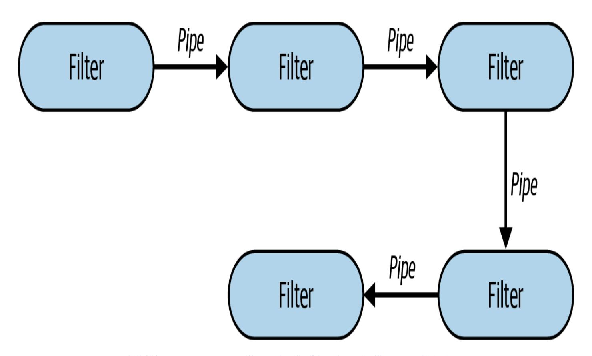
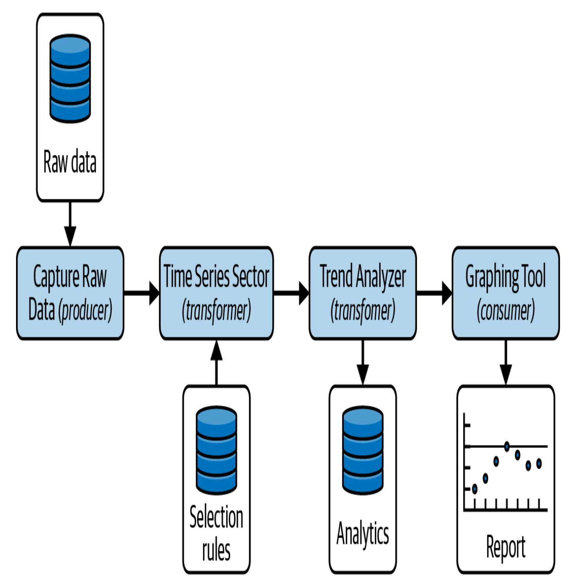
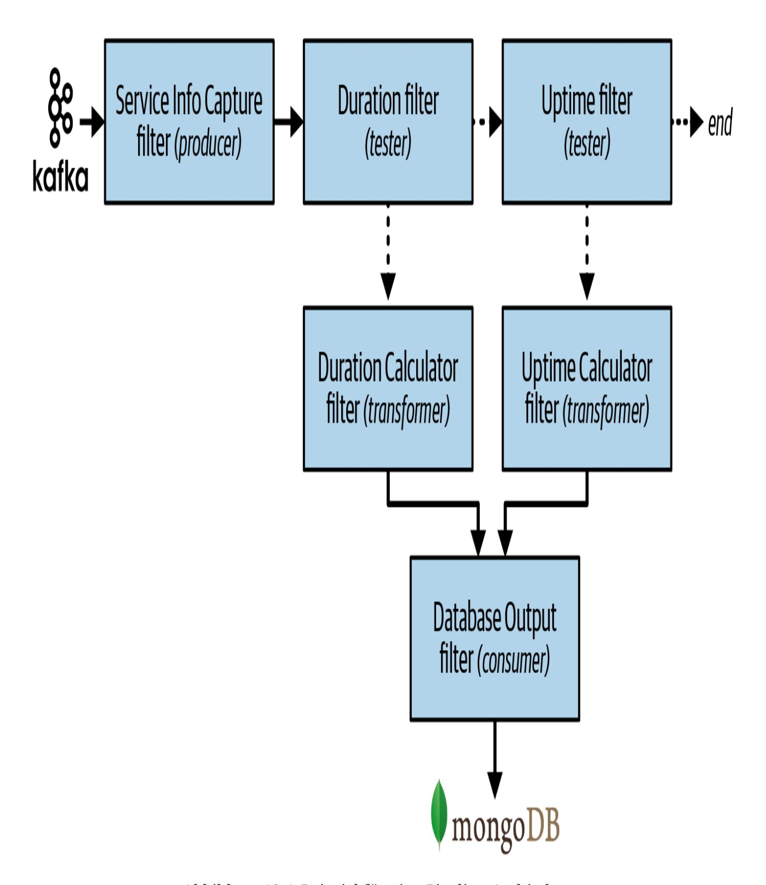

# 12장. 파이프라인 아키텍처 스타일 (Kapitel 12. Stil der Pipeline-Architektur)

이 작업은 AI의 도움을 받아 번역되었습니다. 피드백과 의견을 환영합니다: [translation-feedback@oreilly.com](mailto:translation-feedback@oreilly.com)

소프트웨어 아키텍처의 기본 스타일 중 하나는 *파이프라인 아키텍처(Pipeline-Architektur)* (또는 *파이프 앤 필터 아키텍처(Pipes-and-Filter-Architektur)* 라고도 함)입니다. 개발자와 아키텍트가 기능을 개별 부분으로 분할하기로 결정한 순간부터 이 아키텍처 스타일이 뒤따랐습니다. 대부분의 개발자는 이 아키텍처를 [Bash](https://oreil.ly/uP2Bo) 및 [Zsh](https://oreil.ly/40UyF)와 같은 Unix 터미널 셸 언어의 기본 원리로 알고 있습니다.

많은 함수형 프로그래밍 언어의 개발자는 언어 구조와 이 아키텍처의 요소 사이에서 유사점을 발견할 것입니다. 실제로 [MapReduce 프로그래밍 모델](https://oreil.ly/veX6W)을 사용하는 많은 도구가 이 기본 토폴로지를 따릅니다. 이 장의 예제는 파이프라인 아키텍처의 저수준 구현을 보여주지만, 더 복잡한 비즈니스 애플리케이션에도 사용될 수 있습니다.

# 토폴로지 (Topologie)

파이프라인 아키텍처의 토폴로지는 두 가지 주요 컴포넌트 타입으로 구성됩니다: 파이프(Pipes)와 필터(Filter)입니다. *필터(Filter)* 는 시스템 기능을 포함하고 특정 비즈니스 기능을 수행하며, *파이프(Pipes)* 는 데이터를 체인의 다음 필터(또는 필터들)로 전달합니다. 이들은 특정 방식으로 조정되며, 파이프는 그림 12-1에 나타난 것처럼 필터 간에 단방향의, 대부분 점대점 통신을 형성합니다.

<span id="page-1-0"></span>

그림 12-1. 파이프라인 아키텍처의 기본 토폴로지

따라서 파이프라인 아키텍처의 동형적(isomorphic) "형태"는 *단방향 파이프로 연결된 필터에 기능이 포함된 단일 배포 단위*입니다.

## 스타일 특징 (Stil Besonderheiten)

대부분의 파이프라인 아키텍처 구현이 모놀리식이지만, 각 필터(또는 일련의 필터들)를 서비스로 배포하여 각 서비스에 대한 동기 또는 비동기 원격 호출을 통해 분산 아키텍처를 만드는 것도 가능합니다. 배포 토폴로지와 관계없이 아키텍처는 필터와 파이프 두 가지 컴포넌트로만 구성되며, 다음 섹션에서 이를 자세히 설명하겠습니다.

## **필터 (Filter)**

*필터*는 다른 필터와 독립적인 자체 포함된 기능 단위입니다. 일반적으로 상태를 유지하지 않으며 하나의 작업만 수행해야 합니다. 복합 작업은 일반적으로 단일 필터가 아닌 일련의 필터에 의해 처리됩니다.

필터는 하나 이상의 클래스 파일로 구현될 수 있기 때문에 아키텍처의 *컴포넌트(Komponenten)* 로 간주됩니다(8장 참조). 필터가 간단하고 단일 클래스 파일로만 구현되더라도 여전히 컴포넌트입니다.

파이프라인 아키텍처 스타일에는 네 가지 유형의 필터가 있습니다:

### *프로듀서 (Produzent)*

프로세스의 시작점인 프로듀서 필터는 아웃바운드 전용입니다. 때때로 *소스(Quelle)* 라고도 합니다. 사용자 인터페이스와 시스템에 대한 외부 요청은 모두 프로듀서 필터의 예입니다.

## *트랜스포머 (Transformator)*

트랜스포머 필터는 입력을 받아 선택적으로 일부 또는 모든 데이터에 대한 변환을 수행한 다음 데이터를 아웃바운드 파이프로 전달합니다. 함수형 프로그래밍 지지자들은 이 기능을 *Map*으로 알 것입니다. 트랜스포머 필터는 예를 들어 데이터를 보강, 변환 또는 계산을 수행할 수 있습니다.

### *테스터 (Tester)*

테스터 필터는 입력을 받아 하나 이상의 기준에 따라 검사한 다음 테스트 결과를 기반으로 선택적으로 출력을 생성합니다. 함수형 프로그래머는 이것을 *reduce*와 유사하다고 인식할 것입니다. 테스터 필터는 모든 데이터가 유효하고 올바르게 입력되었는지 확인하거나, 처리를 계속할지 결정하는 스위치 역할을 할 수 있습니다(예: "주문 금액이 5달러 미만이면 데이터를 다음 필터로 전달하지 않음").

### *컨슈머 (Verbraucher)*

파이프라인 플로우의 끝점으로서 컨슈머 필터는 때때로 파이프라인 프로세스의 최종 결과를 데이터베이스에 저장하거나 UI 화면에 최종 결과를 표시합니다.

파이프와 필터의 단방향 특성과 단순성은 조합적 재사용을 촉진합니다. 많은 개발자가 셸을 통해 이 기능을 발견했습니다. "More [Shell, Less](https://oreil.ly/ljeb5) Egg" 블로그의 유명한 이야기는 이러한 추상화가 얼마나 강력한지를 보여줍니다. Donald Knuth는 텍스트 처리 문제를 해결하는 프로그램을 작성하도록 요청받았습니다: 텍스트 파일을 읽고, *n*개의 가장 자주 사용되는 단어를 식별하고, 빈도순으로 정렬된 이러한 단어의 목록을 출력해야 했습니다. 그는 10페이지 이상의 Pascal로 구성된 프로그램을 작성하고 그 과정에서 새로운 알고리즘을 개발(및 문서화)했습니다. 그런 다음 Doug McIlroy는 소셜 미디어 게시물에 쉽게 들어갈 정도로 작고 문제를 우아하게 해결하는 셸 스크립트를 시연했습니다:

```
tr -cs A-Za-z '\n' |
tr A-Z a-z |
sort |
uniq -c |
sort -rn |
sed ${1}q
```

Unix 셸의 설계자조차도 개발자들이 단순하지만 강력한 조합 추상화를 얼마나 창의적으로 사용하는지 종종 놀랍니다.

## **파이프 (Rohre)**

*파이프*는 이 아키텍처에서 필터 간의 통신 채널을 형성합니다. 각 파이프는 일반적으로 단방향이며 점대점이며, 한 소스로부터 입력을 받아 출력을 다른 소스로 전달합니다. 페이로드는 임의의 형식일 수 있지만, 아키텍트는 일반적으로 높은 성능을 달성하기 위해 더 적은 양의 데이터를 선호합니다.

필터(또는 필터 그룹)가 분산 환경에서 별도의 서비스로 배포되는 경우, 파이프는 REST, 메시징, 스트리밍 또는 기타 원격 통신 프로토콜을 통해 단방향 원격 액세스를 호출합니다. 모놀리식 배포든 분산 배포든 관계없이 파이프는 동기 또는 비동기일 수 있습니다. 모놀리식 구현에서 아키텍트는 필터와의 비동기 통신을 위해 스레드 또는 임베디드 메시징을 사용합니다.

## 데이터 토폴로지 (Daten-Topologien)

대부분의 파이프라인 아키텍처가 모놀리스로 구현되기 때문에 단일 모놀리식 데이터베이스에 연결됩니다. 그러나 항상 그런 것은 아닙니다. 이 아키텍처 스타일에서 데이터베이스 토폴로지는 단일 데이터베이스에서 필터당 데이터베이스까지 크게 다를 수 있습니다.

그림 12-2의 예는 프로덕션 환경에서 실행되고 특정 운영 특성(예: 응답성 또는 확장성)을 분석하는 일반적인 지속적 피트니스 함수(아키텍처 테스트)를 위한 파이프라인 아키텍처를 보여줍니다. "원시 데이터 캡처(Rohdaten erfassen)" 필터가 원시 데이터가 있는 별도의 데이터베이스를 로드한다는 점에 유의하세요. 이 필터는 파이프를 통해 원시 데이터를 Time Series Selector 필터로 보내며, 이 필터는 별도의 데이터베이스에서 구성 정보(예: 분석할 기간)를 읽습니다. 그런 다음 변환된 데이터는 다른 파이프를 통해 Trend Analyzer 필터로 전송되며, 이 필터는 데이터를 분석하고 이러한 분석을 별도의 데이터베이스에 저장합니다. 이 필터는 마지막 파이프를 통해 분석 데이터를 Graphing Tool 필터로 보내며, 이 필터는 데이터의 그래픽 보고서를 생성하여 파이프라인을 완료합니다.

<span id="page-7-0"></span>

그림 12-2. 파이프라인 아키텍처는 단일 데이터베이스 또는 여러 데이터베이스를 가질 수 있음

# 클라우드 고려사항 (Überlegungen zur Cloud)

파이프라인 아키텍처는 높은 수준의 모듈성과 별도의 필터 유형으로 인해 클라우드 기반 배포에 적합합니다. 대부분의 파이프라인 아키텍처는 지나치게 복잡하거나 방대하지 않기 때문에 모든 필터가 동일한 배포 단위에 배포되는 모놀리식 아키텍처로 배포하기에 적합합니다.

그러나 필터는 분산 함수로서 클라우드 환경에서도 잘 작동합니다. AWS에서는 [파이프라인 아키텍처](https://oreil.ly/G-MYV)를 AWS Step Functions로 배포할 수 있으며, 각 필터는 워크플로우에서 별도의 Lambda로 배포됩니다. AWS Step Functions는 두 가지 워크플로우를 제공합니다: 각 단계가 정확히 한 번 실행되는 *Standard*와 각 단계가 두 번 이상 실행될 수 있는 *Express*입니다. 파이프라인 아키텍처는 둘 다와 함께 작동합니다. 다음 코드는 그림 12-2의 지속적 피트니스 함수 예제를 AWS Step Function으로 구현된 파이프라인 아키텍처의 일반적인 클라우드 배포로 보여줍니다:

```
{
  "Comment": "Measure and analyze scalability trends.",
  "StartAt": "Capture Raw Data",
  "States": {
    "Capture Raw Data": {
    "Type": "Task",
    "Resource": "arn:aws:lambda:region:account_id:function:ra
    "Next": "Time Series Selector"
   },
    "Time Series Selector": {
    "Type": "Task",
    "Resource": "arn:aws:lambda:region:account_id:function:ti
    "Next": "Trend Analyzer"
```

```
},
    "Trend Analyzer": {
    "Type": "Task",
    "Resource": "arn:aws:lambda:region:account_id:function:tr
    "Next": "Graphing Tool"
    },
    "Graphing Tool": {
    "Type": "Task",
    "Resource": "arn:aws:lambda:region:account_id:function:gr
    "End": true
    }
  }
}
```

이 예제는 클라우드 환경에서 파이프라인 아키텍처를 활용하는 유일한 방법이 아닙니다. 필터는 서버리스 함수, 컨테이너화된 함수 또는 모놀리식 배포에 네 개의 필터 컴포넌트가 모두 포함된 단일 서비스로도 배포될 수 있습니다.

## 일반적인 위험요소 (Gemeinsame Risiken)

파이프라인 아키텍처의 주요 목표는 기능을 단일 목적 필터로 분할하는 것이며, 각 필터는 데이터에 대해 *하나의* 특정 작업을 수행한 다음 추가 처리를 위해 다른 필터로 전달합니다. 따라서 가장 일반적인 위험 중 하나는 필터에 과도한 책임을 부여하는 것입니다. 다음 섹션에서 다룰 좋은 거버넌스는 팀이 각 필터 컴포넌트 뒤의 목적을 식별함으로써 이러한 위험을 완화하는 데 도움이 됩니다.

이 아키텍처의 또 다른 위험은 필터 간에 양방향 통신을 도입하는 것입니다. 파이프는 *단방향만* 되어야 하며 필터 간의 협업을 피하기 위해 명확한 분리를 보장해야 합니다. 양방향 통신이 필요한 경우, 이는 파이프라인 아키텍처가 올바른 스타일이 아니거나 필터가 너무 복잡하다는 좋은 지표입니다. 기능이 올바르게 구분되지 않은 것입니다.

오류 상태 처리는 이 아키텍처 스타일에서 상당한 위험을 초래할 수 있는 또 다른 복잡성입니다. 파이프라인에서 오류가 발생하면 파이프라인이 시작된 후 파이프라인을 적절하게 종료하고 복원하는 방법을 결정하기 어려운 경우가 많습니다. 이러한 이유로 아키텍트가 아키텍처를 확정하기 전에 파이프라인 내에서 발생 가능한 치명적인 오류 조건을 결정하는 것이 중요합니다.

마지막 위험 영역은 필터 간 계약 관리입니다. 각 파이프에는 다음 필터로 보내는 데이터(및 가능하면 해당 타입)를 포함하는 계약이 있습니다. 필터 간 계약을 변경하려면 계약을 받는 다른 필터가 중단되지 않도록 엄격한 제어와 검토가 필요합니다.

## 거버넌스 (Governance)

응답성, 확장성, 가용성 등과 같은 일반 운영 특성의 제어는 각 개별 사용 사례에 따라 다르며 크게 달라질 수 있습니다. 그러나 *구조적* 관점에서 아키텍트는 각 필터 유형의 역할과 책임을 활용하여 파이프라인 아키텍처를 관리합니다.

네 가지 기본 필터 유형(Producer, Transformer, Tester, Consumer) 각각은 특정 작업을 수행합니다. 그러나 개발자가 필터에 과도한 책임을 부여하고 파이프라인 아키텍처를 구조화되지 않은 모놀리스로 전환하기는 너무 쉽습니다.

Producer 필터가 실제로 파이프라인의 시작점인지 또는 Tester 필터가 실제로 플로우를 계속할지 종료할지를 결정하기 위해 조건부 검사를 수행하는지 판단하기 위해 자동화된 피트니스 함수를 작성하기는 어렵습니다. 거버넌스 기술은 아키텍트가 개발 팀이 각 필터 유형의 역할과 특정 필터 유형의 책임을 준수하도록 지원하는 데 도움이 됩니다.

이러한 기술 중 하나는 *태그(Tags)* 의 사용입니다(Java에서 태그는 *애노테이션(Annotationen)* 으로 구현되고, C#에서는 *사용자 정의 속성(benutzerdefinierte Attribute)* 으로 구현됩니다). 태그는 실제 기능을 수행하지 않지만 컴포넌트 또는 서비스에 대한 프로그래밍 방식의 메타데이터를 제공합니다. 필터 컴포넌트의 시작 클래스에 태그를 사용함으로써 개발자는 생성하거나 수정하는 필터의 유형을 알 수 있으며, 필터에 과도한 책임을 부여하거나 해당 유형에 맞지 않는 기능을 수행하는 것을 방지할 수 있습니다.

이 기술을 설명하기 위해 네 가지 기본 필터 유형에 대한 태그를 정의하는 다음 소스 코드를 살펴보겠습니다. 다음은 Java 태그 애노테이션의 정의입니다:

```
@Retention(RetentionPolicy.RUNTIME)
@Target(ElementType.TYPE)
public @interface Filter {
   public FilterType[] value();
   public enum FilterType {
      PRODUCER,
      TESTER,
      TRANSFORMER,
      CONSUMER
   }
}
```

그리고 다음은 C# 태그의 사용자 정의 속성 정의입니다:

```
[System.AttributeUsage(System.AttributeTargets.Class)]
class Filter : System.Attribute {
```

```
public FilterType[] filterType;
   public enum FilterType {
      PRODUCER,
      TESTER,
      TRANSFORMER,
      CONSUMER
   };
}
```

필터는 본질적으로 아키텍처 컴포넌트이므로 여러 클래스 파일로 구현될 수 있습니다. 그림 12-2의 지속적 피트니스 함수 예제에서 Trend Analyzer 필터는 상당히 복잡하며 여러 클래스 파일로 구성될 수 있습니다. 이러한 이유로 필터의 진입점을 나타내는 클래스를 식별하기 위해 추가 태그를 정의하여 다른 태그를 첨부할 수 있도록 합니다.

다음은 Java 진입점 태그의 정의입니다:

```
@Retention(RetentionPolicy.RUNTIME)
@Target(ElementType.TYPE)
public @interface FilterEntrypoint {}
```

그리고 C# 진입점 태그 정의:

```
[System.AttributeUsage(System.AttributeTargets.Class)]
class FilterEntrypoint : System.Attribute {}
```

이제 개발자는 진입점 클래스에 해당 유형과 아키텍처에서의 역할을 나타내는 FilterType 태그를 추가할 수 있습니다. 예를 들어, 다음 애노테이션은 Trend Analyzer 트랜스포머 필터의 유형과 역할을 나타냅니다. Java에서:

```
@FilterEntrypoint
@Filter(FilterType.TRANSFORMER)
public class TrendAnalyzerFilter {
   ...
}
```

그리고 C#에서:

```
[FilterEntrypoint]
[Filter(FilterType.TRANSFORMER)]
class TrendAnalyzerFilter {
   ...
}
```

이 기술은 모든 개발자가 트랜스포머 필터 유형을 테스트 로직 실행에 사용하는 것(Tester 필터가 수행해야 하는 작업)을 막을 수는 없지만, 최소한 추가 컨텍스트를 제공합니다.

# 팀 토폴로지 고려사항 (Überlegungen zur Team-Topologie)

이 책에서 설명하는 일부 아키텍처 스타일과 달리 파이프라인 아키텍처 스타일은 일반적으로 팀 토폴로지와 무관하며 모든 팀 구성과 함께 작동합니다:

## *스트림 정렬 팀 (Auf den Strom ausgerichtete Teams)*

파이프라인 아키텍처는 일반적으로 작고 자체 포함되어 있으며 시스템을 통한 단일 여정 또는 단일 플로우를 나타내므로 스트림 정렬 팀과 잘 작동합니다. 이 팀 토폴로지에서 팀은 일반적으로 처음부터 끝까지 시스템을 통한 플로우를 소유하며, 이는 파이프라인 아키텍처의 형태와 잘 맞습니다.

### *인에이블링 팀 (Teams befähigen)*

파이프라인 아키텍처는 고도로 모듈화되어 있고 기술적 측면에서 분리되어 있기 때문에 인에이블링 팀 토폴로지와 잘 결합됩니다. 전문가와 교차 기능 팀 멤버는 나머지 플로우를 방해하지 않고 파이프라인에 추가 필터를 삽입하여 제안하고 실험을 수행할 수 있습니다. 지속적 피트니스 함수 예제에서 인에이블링 팀은 예를 들어 Time Series Selector 필터 후에 트랜스포메이션 필터를 추가하여 대체 트렌드 분석을 수행할 수 있습니다. 이 새 필터는 파이프라인의 정상적인 플로우를 방해하지 않고 기존 Trend Analyzer 필터와 동일한 데이터를 사용할 것입니다.

### *복잡한 서브시스템 팀 (Teams mit komplizierten Subsystemen)*

각 필터가 매우 특정한 작업을 수행하기 때문에 파이프라인 아키텍처는 복잡한 서브시스템 팀 토폴로지와 잘 작동합니다. 다양한 팀 멤버가 독립적으로(그리고 다른 필터와 독립적으로) 복잡한 필터 작업에 집중할 수 있습니다. 이 아키텍처와 함께 제공되는 단방향 전달을 통해 복잡한 서브시스템 팀의 멤버는 특정 필터 처리에 포함된 복잡성에 정확히 집중할 수 있습니다.

### *플랫폼 팀 (Plattform-Teams)*

파이프라인 아키텍처에서 작업하는 플랫폼 팀은 공통 도구, 서비스, API 및 작업을 사용하여 높은 수준의 모듈성을 활용할 수 있습니다.

## 스타일 특성 (Stilmerkmale)

특성 표(그림 12-3)의 별 1개 등급은 특정 아키텍처 특성이 아키텍처에서 잘 지원되지 않음을 의미하며, 별 5개 등급은 아키텍처 특성이 아키텍처 스타일의 가장 강력한 특징 중 하나임을 의미합니다. 스코어카드에 포함된 특성은 4장에서 설명하고 정의됩니다.

파이프라인 아키텍처는 애플리케이션 로직이 필터 유형으로 분할되기 때문에 *기술적으로 분할된(technisch partitionierte)* 아키텍처입니다. 파이프라인 아키텍처는 일반적으로 모놀리식 배포로 구현되기 때문에 아키텍처 퀀텀은 항상 1입니다.

|             | Architectural characteristic | Star rating                      |
|-------------|------------------------------|----------------------------------|
|             | Overall cost                 | \$                               |
| Structural  | Partitioning type            | Technical                        |
|             | Number of quanta             | 1                                |
|             | Simplicity                   | <b>☆☆☆☆</b>                      |
|             | Modularity                   | $\stackrel{\wedge}{\Rightarrow}$ |
| Engineering | Maintainability              | $\stackrel{\wedge}{\Rightarrow}$ |
|             | Testability                  | <b>☆☆☆</b>                       |
|             | Deployability                | $\stackrel{\wedge}{\Rightarrow}$ |
|             | Evolvability                 | <b>☆☆☆</b>                       |
| Operational | Responsiveness               | <b>☆☆☆</b>                       |
|             | Scalability                  | $\bigstar$                       |
|             | Elasticity                   | $\stackrel{\bigstar}{\sim}$      |
|             | Fault tolerance              | $\stackrel{\bigstar}{\sim}$      |

전체 비용, 단순성 및 모듈성은 파이프라인 아키텍처의 주요 강점입니다. 파이프라인 아키텍처는 모놀리식이기 때문에 분산 아키텍처와 관련된 복잡성이 없으며, 단순하고 이해하기 쉬우며 구축 및 유지 관리 비용이 상대적으로 저렴합니다. 아키텍처의 모듈성은 다양한 필터 유형과 트랜스포머의 분리를 통해 달성됩니다: 각 필터는 다른 필터에 영향을 주지 않고 수정하거나 교체할 수 있습니다. 그림 12-4에 표시된 Kafka 예제에서 Duration Calculator는 다른 필터를 변경하지 않고 기간 계산을 변경하도록 수정될 수 있습니다.

배포성과 테스트 가능성은 평균 수준이지만, 필터가 달성할 수 있는 모듈성으로 인해 계층형 아키텍처보다 약간 낫습니다. 그러나 파이프라인 아키텍처는 여전히 *일반적으로* 모놀리식입니다. 따라서 단점에는 의식, 위험, 배포 빈도 및 테스트의 완전성이 포함됩니다.

탄력성과 확장성은 파이프라인 아키텍처에서 매우 낮은 평가(별 1개)를 받는데, 이는 주로 모놀리식 구현 때문입니다. 이 아키텍처 스타일을 비동기 통신을 사용하는 분산 아키텍처로 구현하면 이러한 특성을 크게 향상시킬 수 있지만, 그 대가는 전체 비용과 단순성의 손실입니다.

파이프라인 아키텍처는 일반적으로 모놀리식 시스템으로 구현되기 때문에 내결함성을 지원하지 않습니다. 파이프라인 아키텍처의 작은 부분에서 메모리 부족 상태가 발생하면 전체 애플리케이션이 영향을 받고 충돌합니다. 또한 대부분의 모놀리식 애플리케이션에 일반적인 높은 평균 복구 시간(MTTR)으로 인해 전체 가용성이 영향을 받으며, 시작 시간이 분 단위로 측정됩니다. 탄력성 및 확장성과 마찬가지로 이 아키텍처 스타일을 비동기 통신을 사용하는 분산 아키텍처로 구현하면 내결함성을 크게 향상시킬 수 있으며, 이는 다시 비용과 복잡성으로 대가를 치르게 됩니다.

앞서 언급했듯이 대부분의 낮은 평가를 받은 운영 특성은 각 필터가 별도의 배포 단위이고 파이프가 원격 호출인 비동기 통신을 사용하는 분산 아키텍처로 만들어 개선될 수 있습니다. 그러나 이것은 단순성 및 비용과 같은 다른 특성에 부정적인 영향을 미치며 소프트웨어 아키텍처의 고전적인 트레이드오프 중 하나를 보여줍니다.

## **언제 사용할 것인가 (Wann verwendet man)**

파이프라인 아키텍처는 명확하고 순서가 지정되고 결정론적인 한 방향 처리 단계가 있는 임의로 복잡한 시스템에 적합합니다. 단순성 덕분에 시간과 비용 프레임이 제한된 상황에도 적합합니다.

## **언제 사용하지 말아야 하는가 (Wann man nicht verwenden sollte)**

이 아키텍처는 모놀리식이기 때문에 높은 확장성, 탄력성 및 내결함성이 필요한 시스템에는 적합하지 않습니다. 그러나 분산 아키텍처 접근 방식은 이러한 문제를 완화할 수 있습니다.

파이프라인 아키텍처는 필터 간에 양방향 통신이 발생하는 시나리오에도 적합하지 않습니다. 파이프는 단방향만 되어야 하기 때문입니다. 파이프라인에 많은 테스터 필터를 사용하여 비결정론적 워크플로우에 이 아키텍처 스타일을 사용하는 것이 가능하지만 권장하지 않습니다. 이 상대적으로 단순한 아키텍처 스타일을 너무 복잡하게 만들고 유지 관리성, 테스트 가능성, 배포 가능성 및 결과적으로 전반적인 신뢰성에 부정적인 영향을 미칠 수 있습니다. 이벤트 기반 아키텍처(15장 참조)는 비결정론적 워크플로우가 관련된 상황에 훨씬 더 적합합니다.

파이프라인 아키텍처는 특히 단순한 단방향 처리를 가능하게 하는 작업에서 다양한 애플리케이션에서 나타납니다. 예를 들어, 많은 전자 데이터 교환(EDI) 도구는 파이프와 필터를 사용하여 한 문서 유형에서 다른 문서 유형으로 변환을 수행함으로써 이 패턴을 활용합니다. 데이터베이스 추출, 변환 및 로드(ETL) 도구는 파이프라인 아키텍처를 사용하여 데이터를 변경하고 한 데이터베이스 또는 데이터 소스에서 다른 것으로 전송합니다. [Apache](https://camel.apache.org/) Camel과 같은 오케스트레이터 및 미디에이터는 파이프라인 아키텍처를 사용하여 비즈니스 프로세스의 한 단계에서 다른 단계로 정보를 전송합니다.

# 예제 및 사용 사례 (Beispiele und Anwendungsfälle)

파이프라인 아키텍처를 어떻게 활용할 수 있는지 설명하기 위해 서비스 텔레메트리 데이터가 서비스에서 [Apache](https://kafka.apache.org/) Kafka로 스트리밍되는 다음 예제를 살펴보겠습니다(그림 12-4).

<span id="page-23-0"></span>

그림 12-4. 파이프라인 아키텍처 예제

그림 12-4에 표시된 시스템은 파이프라인 아키텍처를 사용하여 Kafka로 스트리밍되는 다양한 유형의 데이터를 처리합니다. "Service Info Capture" 필터(프로듀서 필터)는 Kafka 토픽을 구독하고 서비스 정보를 수신합니다. 그런 다음 이 캡처된 데이터를 테스터 필터인 Duration 필터로 보내 서비스 요청의 기간(밀리초)과 관련이 있는지 확인합니다.

필터 간의 관심사 분리에 주목하세요: Service Info Capture 필터는 Kafka 토픽에 연결하고 스트리밍 데이터를 수신하는 것만 처리하고, Duration 필터는 데이터를 검증하고 다음 파이프로 전달할지 결정하기만 합니다. 데이터가 서비스 요청의 기간과 관련이 있으면 트랜스포머 필터인 Duration Calculator로 전달됩니다. 그렇지 않으면 데이터가 Uptime 테스터 필터로 전달되어 가동 시간 메트릭과 관련이 있는지 확인합니다. 그렇지 않으면 파이프라인이 종료됩니다. 데이터가 이 특정 처리 플로우에 관심이 없기 때문입니다. 가동 시간 메트릭과 관련이 있으면 Uptime 테스터 필터가 Uptime Calculator로 전달하며, 이 필터는 가동 시간 메트릭을 계산하는 데 사용합니다. Uptime Calculator는 수정된 데이터를 Database Output 컨슈머로 전달하며, 이 컨슈머는 [MongoDB 데이터베이스](https://mongodb.com/)에 저장합니다.

이 예제는 파이프라인 아키텍처가 얼마나 확장 가능한지를 보여줍니다. 그림 12-4에서 Uptime 필터 후에 새 필터를 추가하여 새 메트릭(예: 데이터베이스 연결 대기 시간)에 데이터를 사용할 수 있습니다.

파이프라인 아키텍처 스타일은 일반적으로 모놀리식 아키텍처이지만 기술적으로 분할된 필터의 사용 덕분에 좋은 수준의 모듈성을 보여줍니다. 시스템 내에서 데이터를 처리하기 위해 워크플로우 기반의 단계별 접근 방식이 필요한 상황에 적합합니다.

더 복잡한 분산 아키텍처로 넘어가기 전에 다음 장에서 플러그인 컴포넌트의 사용을 통해 높은 수준의 모듈성도 지원하는 또 다른 모놀리식 아키텍처인 *마이크로커널 아키텍처(Mikrokernel-Architektur)* 를 설명하겠습니다.