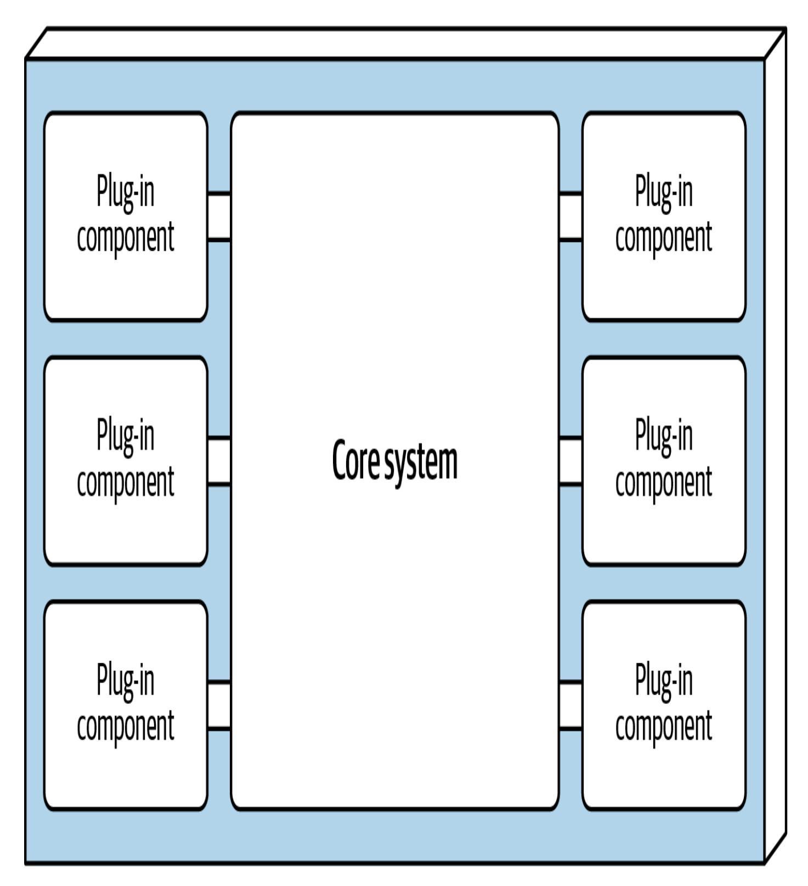
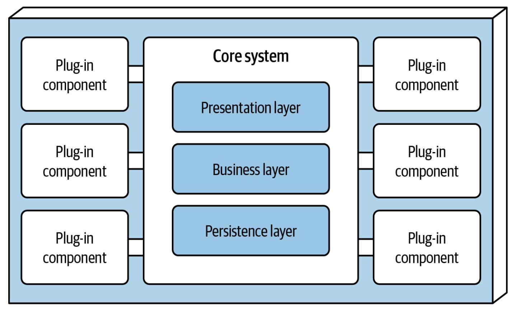
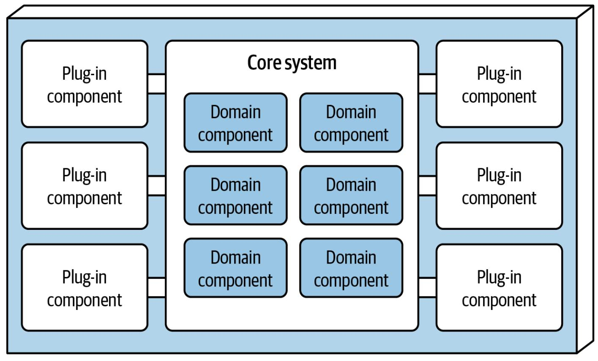
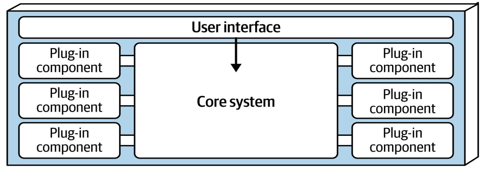
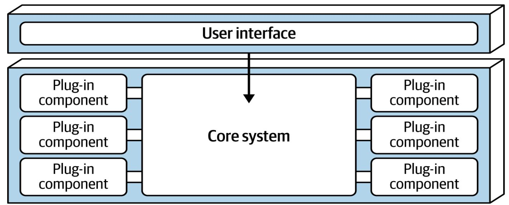
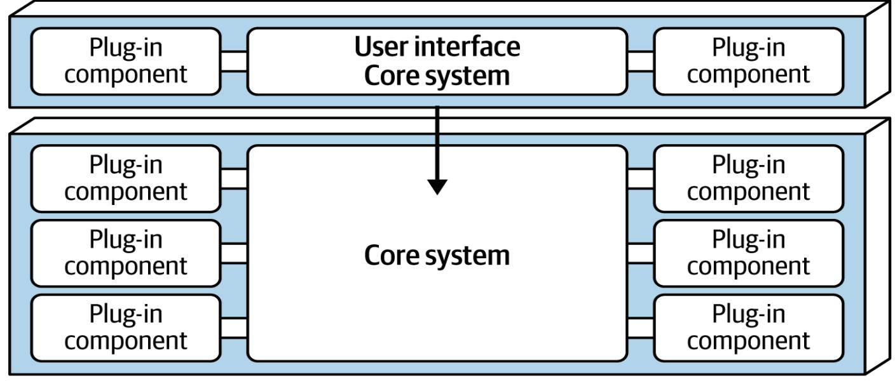
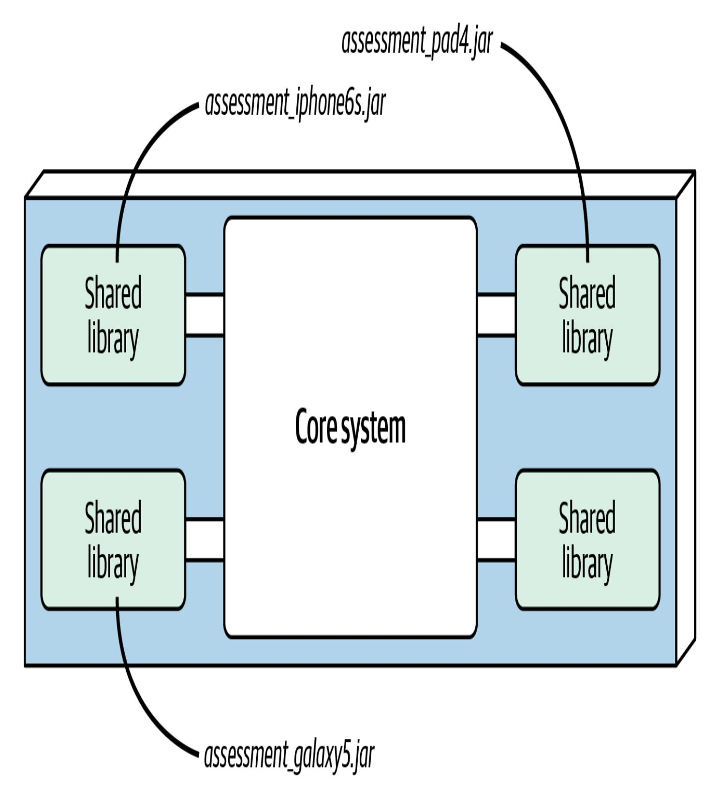
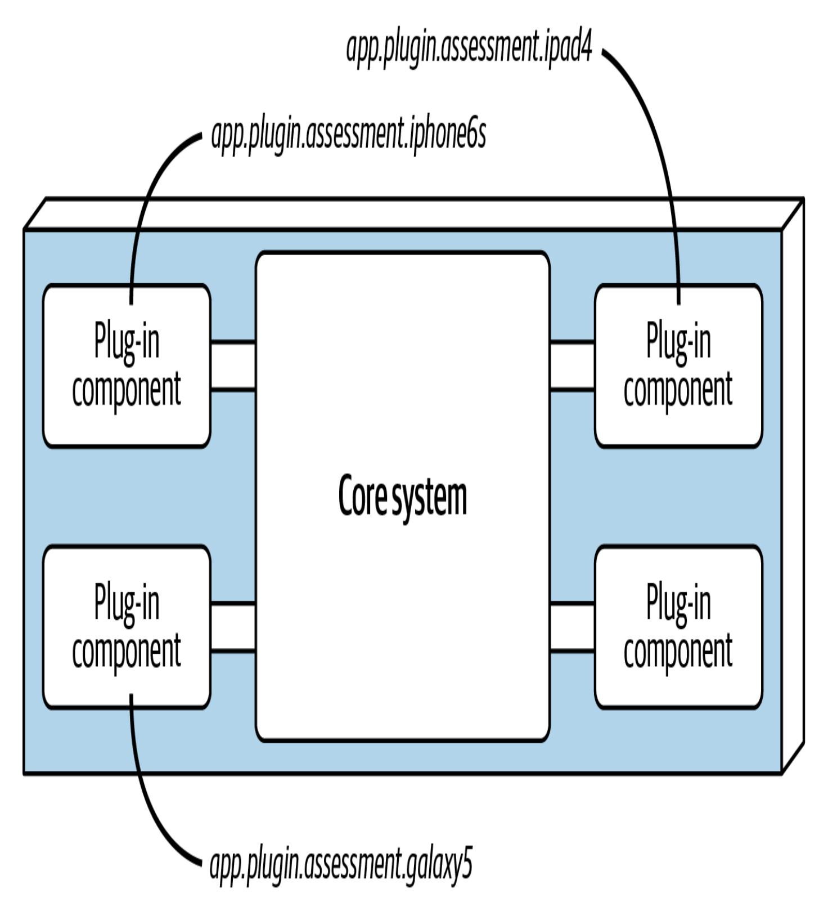
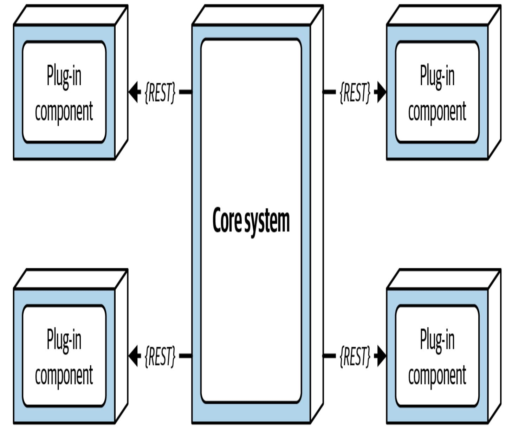
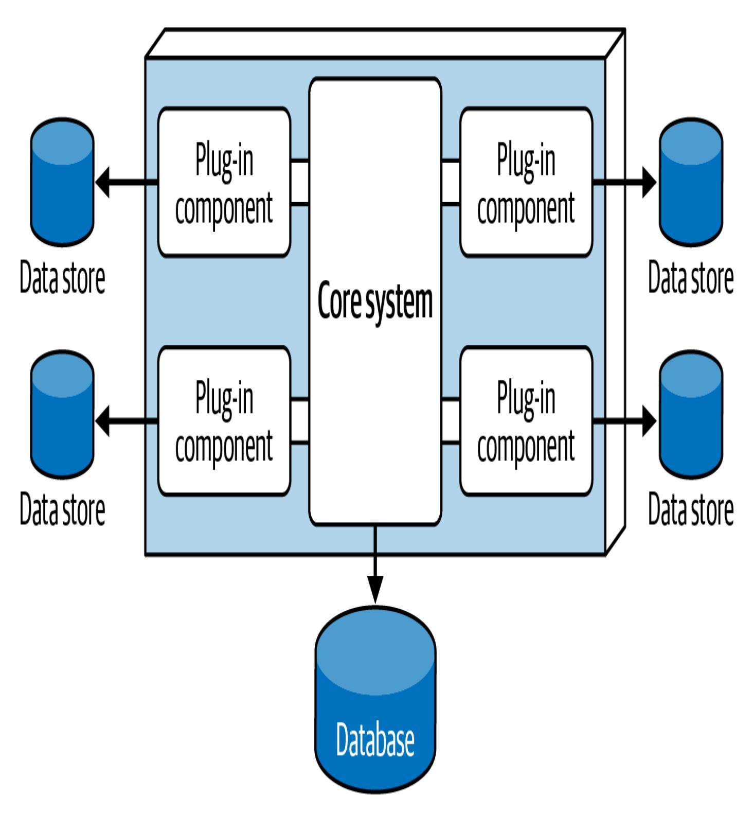

# 13장. 마이크로커널 아키텍처 스타일 (Kapitel 13. Stil der Mikrokernel-Architektur)

이 작업은 AI를 활용해 번역되었습니다. 여러분의 피드백과 의견을 환영합니다: [translation-feedback@oreilly.com](mailto:translation-feedback@oreilly.com)

*마이크로커널 아키텍처(Mikrokernel-Architektur, Plug-in-Architektur라고도 함)*는 수십 년 전에 등장했지만 지금도 널리 쓰입니다. 이 아키텍처는 단일 모놀리식 패키지로 다운로드·설치되어 고객 환경에 서드파티 제품으로 배포되는 *제품 기반 애플리케이션(produktbasierte Anwendungen)*에 특히 적합합니다. 또한 맞춤 구성이 필요한 문제 영역을 다루는 비제품성 업무 애플리케이션에도 자주 사용됩니다. 예를 들어 미국 각 주마다 고유한 규정을 두는 보험회사나, 다양한 법적·물류 변형을 준수해야 하는 국제 운송회사는 이 스타일의 이점을 누릴 수 있습니다.

# 토폴로지 (Topologie)

마이크로커널 스타일은 코어 시스템과 플러그인이라는 두 구성요소로 이뤄진 비교적 단순한 모놀리식 아키텍처입니다. 애플리케이션 로직은 독립적인 플러그인 컴포넌트와, 애플리케이션 기능을 분리하고 확장성·[적응성](#page-2-0)·고유 처리 로직을 제공하는 코어 시스템 사이에 나뉩니다. [그림](#page-2-0) 13-1은 마이크로커널 아키텍처의 기본 토폴로지를 보여 줍니다.

<span id="page-2-0"></span>

그림 13-1. 마이크로커널 아키텍처 스타일의 기본 구성 요소

# 스타일 특성 (Stil Besonderheiten)

마이크로커널 아키텍처는 크게 *코어 시스템(Kernsystem)*과 *플러그인(Plug-ins)*이라는 두 종류의 컴포넌트로 구성됩니다.

## **코어 시스템 (Kernsystem)**

*코어 시스템*은 시스템 운영에 필수적인 최소 기능으로 정의됩니다. 예를 들어 Eclipse IDE의 코어 시스템은 파일 열기, 텍스트 편집, 저장만 가능한 단순한 텍스트 편집기입니다. 플러그인을 추가해야만 Eclipse가 쓸 만한 제품이 됩니다.

코어 시스템을 정의하는 또 다른 방법은 사용자 정의 처리가 거의 없거나 전혀 없는 일반적인 애플리케이션 처리 흐름인 *"해피 패스(Happy Path)"*입니다. 마이크로커널 아키텍처에서는 애플리케이션의 순환 복잡도를 코어에서 분리해 별도의 플러그인 컴포넌트에 담습니다. 이렇게 하면 확장성, 유지보수성, 테스트 용이성이 향상됩니다.

조금 더 깊이 들어가기 위해 [7장](#page--1-0)에서 소개한 전자제품 재활용 애플리케이션인 Going Green으로 돌아가 봅시다. Going Green 애플리케이션이 수집한 모든 전자제품을 특정 맞춤 평가 규칙에 따라 평가해야 한다고 가정해 보겠습니다. 이 처리를 담당하는 Java 코드는 다음과 같을 수 있습니다.

```
public void assessDevice(String deviceID) {
   if (deviceID.equals("iPhone6s")) {
```

```
assessiPhone6s();
   } else if (deviceID.equals("iPad1"))
      assessiPad1();
   } else if (deviceID.equals("Galaxy5"))
      assessGalaxy5();
   } else ...
      ...
   }
}
```

높은 순환 복잡도를 지닌 이러한 맞춤 처리를 코어 시스템에 통합하는 대신, 평가해야 하는 전자기기마다 별도의 플러그인 컴포넌트를 만들 수 있습니다. 특정 클라이언트 플러그인을 사용하면 독립적인 기기 로직을 나머지 처리 과정에서 분리할 수 있을 뿐 아니라 확장성도 얻게 됩니다. 새로운 기기를 추가하려면 새로운 플러그인을 추가하고 레지스트리를 갱신하기만 하면 됩니다. 마이크로커널 아키텍처에서는 코어 시스템이 해당 기기 플러그인을 찾아 호출하기만 하면 되며, 아래와 같이 리팩터링된 소스 코드로 표현할 수 있습니다.

```
public void assessDevice(String deviceID) {
        String plugin = pluginRegistry.get(deviceID);
        Class<?> theClass = Class.forName(plugin);
        Constructor<?> constructor = theClass.getConstructor(
        DevicePlugin devicePlugin =
                (DevicePlugin)constructor.newInstance();
```

```
devicePlugin.assess();
}
```

이 예제에서 특정 전자기기의 평가 규칙과 지침은 모두 독립적인 플러그인 컴포넌트에 담겨 있으며, 코어 시스템은 이를 일반화된 방식으로 실행하기만 하면 됩니다.

규모와 복잡도에 따라 코어 시스템을 계층형 아키텍처나 모듈러 모놀리스로 구현할 수 있습니다([그림](#page-6-0) 13-2 참조). 경우에 따라 코어 시스템을 별도로 배포되는 도메인 서비스로 나누고 각 도메인 서비스에 해당 도메인에 특화된 플러그인을 포함하도록 할 수도 있습니다. 여기서는 Going Green 시스템을 계층형 아키텍처로 구현한다고 가정하겠습니다.

Payment Processing이 코어 시스템을 나타내는 도메인 서비스라고 가정해 봅시다. 신용카드, PayPal, 스토어 크레딧, 기프트 카드, 청구서 등 각 결제 수단마다 해당 결제 도메인에 특화된 자체 플러그인 컴포넌트가 존재합니다.



계층형 코어 시스템(기술적 분할)



모듈식 코어 시스템(도메인 분할)

코어 시스템의 프레젠테이션 계층은 코어에 내장할 수도 있고, 코어 시스템이 백엔드 서비스를 제공하는 별도의 사용자 인터페이스로 구현할 수도 있습니다. 또한 사용자 인터페이스 자체를 마이크로커널 스타일로 구현하는 것도 가능합니다. [그림](#page-8-0) 13-3은 코어 시스템과의 관계에서 이러한 프레젠테이션 계층 변형을 보여 줍니다.



**임베디드 사용자 인터페이스(단일 배포)**



별도 사용자 인터페이스(복수 배포 단위)



별도 사용자 인터페이스(복수 배포 단위, UI와 코어 모두 마이크로커널)

### **플러그인 컴포넌트 (Plug-In Komponenten)**

플러그인 컴포넌트는 특정 처리, 추가 기능, 맞춤 코드를 담아 코어 시스템을 보강하거나 확장하는 독립·자급식 컴포넌트입니다. 또한 변동성이 큰 코드를 격리해 애플리케이션의 유지보수성과 테스트 용이성을 높여 줍니다. 이상적으로 플러그인 컴포넌트는 서로 의존하지 않아야 합니다.

플러그인 컴포넌트와 코어 시스템 사이의 통신은 일반적으로 *점대점* 방식이며, 플러그인을 코어에 연결하는 "파이프"는 보통 플러그인 시작 클래스의 메서드/함수 호출입니다. 플러그인은 컴파일 타임 기반일 수도 있고 런타임 기반일 수도 있습니다. *런타임 플러그인*은 코어 시스템이나 다른 플러그인을 재배포하지 않고도 런타임에 추가·제거할 수 있으며, [Java용 OSGi(Open Service Gateway Initiative)](https://osgi.org/), Penrose(Java), [Jigsaw](https://oreil.ly/wv9bW)(Java), [Prism](https://oreil.ly/xmrtY)(.NET)과 같은 프레임워크로 관리합니다. *컴파일 기반* 플러그인은 관리가 훨씬 쉽지만, 수정·삭제·추가할 때마다 전체 모놀리식 애플리케이션을 다시 배포해야 합니다.

점대점 플러그인은 공유 라이브러리(JAR, DLL, Gem 등), Java 패키지 이름, C# 네임스페이스 형태로 구현할 수 있습니다. Going Green 애플리케이션에서는 각 전자기기 플러그인을 JAR, DLL, Ruby Gem(또는 다른 공유 라이브러리)로 작성해 독립적인 공유 라이브러리 이름이 해당 기기 이름과 일치하도록 만들 수 있으며, 이는 [그림](#page-11-0) 13-4에 나와 있습니다.

<span id="page-11-0"></span>

그림 13-4. 공유 라이브러리 플러그인 구현 예시

[그림](#page-13-0) 13-5에서 보듯이, 더 간단한 방법은 각 플러그인을 동일한 코드베이스나 IDE 프로젝트 안에서 고유한 네임스페이스/패키지로 구현하는 것입니다. 네임스페이스를 만들 때는 *app.plug-in.<Domäne>.<Kontext>* 같은 의미 체계를 추천합니다. 예를 들어 *app.plug-in.assessment.iphone6s* 네임스페이스를 보겠습니다. 두 번째 노드(plug-in)는 해당 컴포넌트가 플러그인임을 명확히 하여 자급식 구조와 다른 플러그인과의 분리를 강조합니다. 세 번째 노드는 영역(여기서는 assessment)을 설명해 플러그인을 공통 목적에 따라 조직하고 묶을 수 있게 합니다. 네 번째 노드(iphone6s)는 플러그인의 구체적 컨텍스트를 나타내므로, 기기 플러그인을 변경하거나 테스트할 때 찾기 쉽습니다.

<span id="page-13-0"></span>

그림 13-5. 패키지 혹은 네임스페이스 플러그인 구현

플러그인 컴포넌트가 반드시 점대점 방식으로 코어와 통신해야 하는 것은 아닙니다. 각 플러그인을 독립 서비스(혹은 컨테이너에 구현된 마이크로서비스)로 만들어 REST나 메시징을 통해 호출하는 방법도 있습니다. 이는 전반적인 확장성을 높이는 좋은 대안처럼 보이지만, 코어 시스템이 모놀리스인 이상 [그림](#page-15-0) 13-6에 나타난 토폴로지는 여전히 단일 아키텍처 퀀텀일 뿐입니다. 모든 요청은 플러그인 서비스에 도달하기 전에 반드시 코어를 통과해야 합니다.

플러그인을 개별 서비스로 구현해 원격 접근하는 방식은 컴포넌트 전반의 결합도를 낮추고, 확장성 및 처리량을 향상시키며, OSGi/Jigsaw/Prism 같은 특수 프레임워크 없이도 런타임 변경을 지원한다는 장점이 있습니다. 또한 필요 시 플러그인과 비동기 통신을 수행할 수 있어 사용자 응답성을 크게 개선할 수 있습니다. Going Green 예제에서 코어 시스템은 특정 기기 평가를 시작하는 비동기 *요청*을 전송한 뒤 전자제품 평가가 완료될 때까지 기다리지 않아도 됩니다. 검사가 끝나면 플러그인이 다른 비동기 메시징 채널을 통해 코어에 알리고, 코어는 다시 사용자에게 평가 완료를 알릴 수 있습니다.

<span id="page-15-0"></span>

그림 13-6. REST 기반 플러그인 원격 접근

이러한 장점에는 트레이드오프가 따릅니다. 원격 플러그인 접근을 사용하면 마이크로커널 아키텍처가 모놀리스가 아니라 분산 아키텍처가 되어 대부분의 온프레미스 서드파티 제품에는 구현과 배포가 더 어려워집니다. 또한 복잡도와 비용이 높아지고 배포 토폴로지가 복잡해집니다. 특히 시스템이 REST를 사용하면서 플러그인이 응답하지 않거나 중단되면 요청이 완료되지 않습니다. 모놀리식 배포에서는 나타나지 않는 문제입니다. 점대점과 원격 통신 중 무엇을 선택할지는 프로젝트 요구사항과 트레이드오프 분석에 따라 결정해야 합니다.

#### **마이크로커널-성 스펙트럼 (Das Spektrum der "Mikrokern-alität")**

플러그인을 지원하는 모든 시스템이 마이크로커널은 아니지만, 모든 마이크로커널은 플러그인을 지원합니다. 우리가 "마이크로커널-성"이라고 부르는 정도는 코어 시스템이 얼마나 많은 고유 기능을 포함하느냐에 따라 달라집니다. 이는 [그림](#page-16-0) 13-7에 제시된 스펙트럼으로 나타낼 수 있습니다.

<span id="page-16-0"></span>

그림 13-7. "마이크로커널-성" 스펙트럼

[그림](#page-16-0) 13-7에서 "순수" 마이크로커널 아키텍처(예: Eclipse IDE, 린터 도구)는 코어 기능이 매우 적습니다. 린터는 예를 들어 소스 코드를 분석해 추상 구문 트리를 제공하고, 개발자가 언어 사용 규칙을 작성하도록 합니다. 코어는 코드를 분석하지만 플러그인이 이를 활용하지 않으면 쓸모가 거의 없습니다. 반대로 웹 브라우저는 플러그인을 지원하지만 플러그인이 없어도 완전한 기능을 제공합니다.

코어의 변동성을 파악하면, 단순히 플러그인을 지원하는 시스템과 "순수" 마이크로커널 중 어느 쪽을 선택할지 결정하는 데 도움이 됩니다.

### **레지스트리 (Registry)**

코어 시스템은 사용 가능한 플러그인 모듈과 이들에 접근하는 방법을 알아야 합니다. 가장 일반적인 방법은 *플러그인 레지스트리*를 두는 것입니다. 레지스트리는 각 플러그인 모듈의 이름, 데이터 계약, 원격 접근 프로토콜 등 플러그인과 코어를 연결하는 데 필요한 정보를 담습니다. 예를 들어 위험한 세무 감사 항목을 표시하는 세무 소프트웨어 플러그인의 레지스트리 항목에는 서비스 이름(AuditChecker), 데이터 계약(입력·출력 데이터), 계약 형식(XML)이 포함될 수 있습니다.

레지스트리는 코어 시스템이 소유한 간단한 Map 구조처럼 키와 플러그인 참조만 보관할 수도 있고, Apache [ZooKeeper](https://zookeeper.apache.org/)나 [Consul](https://www.consul.io/) 같은 레지스트리·디스커버리 도구를 코어에 내장하거나 외부에 배치할 수도 있습니다. 전자제품 재활용 예제에서 다음 Java 코드는 코어 내부에 단순한 레지스트리를 구현하고, iPhone 6S 기기를 평가하기 위한 점대점·메시징·RESTful 항목을 보여 줍니다.

```
Map<String, String> registry = new HashMap<String, String>();
static {
  // 점대점 접근 예시
  registry.put("iPhone6s", "Iphone6sPlugin");
  // 메시징 예시
  registry.put("iPhone6s", "iphone6s.queue");
  // RESTful 예시
  registry.put("iPhone6s", "https://atlas:443/assess/iphone6s
}
```

#### **계약 (Verträge)**

플러그인과 코어 시스템 사이의 계약은 일반적으로 특정 플러그인 도메인에서 표준화되어 있으며, 플러그인이 제공해야 할 동작, 입력 데이터, 출력 데이터를 정의합니다. 플러그인이 서드파티에서 개발되어 아키텍트가 해당 계약을 제어할 수 없을 때는 사용자 정의 계약을 사용합니다. 이 경우 플러그인 계약과 표준 계약 사이에 어댑터를 만들어 코어 시스템이 플러그인마다 별도의 코드를 작성하지 않도록 합니다.

플러그인 계약은 XML, JSON, 혹은 플러그인과 코어 사이를 오가는 객체 형태로 구현할 수 있습니다. 전자제품 재활용 애플리케이션에서는 다음과 같은 계약(AssessmentPlugin이라는 표준 Java 인터페이스로 구현됨)이 전체 동작(assess(), register(), deregister())과 플러그인이 반환해야 하는 출력 데이터(AssessmentOutput)를 정의합니다.

```
public interface AssessmentPlugin {
        public AssessmentOutput assess();
        public String register();
        public String deregister();
}
public class AssessmentOutput {
        public String assessmentReport;
        public Boolean resell;
        public Double value;
        public Double resellPrice;
}
```

이 계약 예제는 기기 평가 플러그인이 다음 정보를 반환하도록 기대합니다.

- 서식이 적용된 문자열 보고서
- 기기를 서드파티 마켓에 재판매할 수 있는지, 아니면 안전하게 폐기해야 하는지를 나타내는 재판매 플래그(true/false)
- 재판매가 가능한 경우 계산된 가치와 추천 재판매 가격

이 예제의 역할·책임 모델을 특히 assessmentReport 필드에서 주의 깊게 보십시오. 코어 시스템은 평가 보고서의 세부 양식을 만들거나 이해할 책임이 없으며, 보고서를 출력하거나 사용자에게 보여 주기만 하면 됩니다.

## 데이터 토폴로지 (Daten-Topologien)

팀은 일반적으로 마이크로커널 아키텍처를 단일(대개 관계형) 데이터베이스를 사용하는 모놀리식 아키텍처로 구현합니다.

플러그인이 중앙 공유 데이터베이스에 직접 연결하는 일은 드뭅니다. 대신 코어 시스템이 데이터 접근을 담당하고 필요한 정보를 각 플러그인에 전달합니다. 이렇게 하는 주된 이유는 디커플링입니다. 데이터베이스가 변경되더라도 코어만 영향을 받고 플러그인은 영향을 받지 않아야 합니다. 단, 플러그인이 자체 전용 데이터 저장소를 가지는 것은 가능합니다. 예컨대 Going Green 시스템의 각 기기 평가 플러그인은 해당 제품의 세부 규칙을 담은 단순한 데이터베이스나 규칙 엔진을 자체적으로 가질 수 있습니다. 플러그인에 속한 데이터 저장소는 [그림](#page-21-0) 13-8처럼 외부에 있을 수도 있고, 인메모리·임베디드 데이터베이스처럼 플러그인이나 모놀리식 배포 안에 포함될 수도 있습니다.

<span id="page-21-0"></span>

그림 13-8. 플러그인이 전용 데이터 저장소를 소유할 수 있다

# 클라우드 고려 사항 (Überlegungen zur Cloud)

마이크로커널 아키텍처는 대개 모놀리스이므로, 클라우드에서는 몇 가지 거친 선택지만 제공합니다. 첫째, 전체 애플리케이션을 클라우드 인프라나 컨테이너에 배포하는 방법입니다. 둘째, 데이터만 클라우드에 두고 마이크로커널은 온프레미스 시스템으로 운영하는 방법입니다. 셋째, 코어 시스템을 온프레미스로 유지하고 플러그인을 클라우드에 배치하는 방법입니다. 모듈성 측면에서 보면 세 번째 방법이 좋아 보일 수 있지만, 응답성 측면에서는 도전 과제가 있습니다. 마이크로커널 아키텍처에서는 플러그인을 자주 호출하며, 팀이 중요한 워크플로를 플러그인으로 구현하기 때문에 호출마다 많은 정보를 주고받습니다. 코어와 플러그인을 분리하면 지연이 늘어나 바람직하지 않은 오버헤드가 생길 수 있습니다.

## 공통 위험 (Gemeinsame Risiken)

이 아키텍처와 관련된 일반적인 위험은 대부분 잘못된 사용에서 비롯됩니다.

## **휘발성 코어 (Flüchtiger Kern)**

마이크로커널의 코어는 초기 개발 이후 최대한 안정적으로 유지되어야 합니다. 이 스타일의 장점은 플러그인 변경을 격리할 수 있다는 데 있기 때문입니다. 끊임없이 바뀌는 코어를 만들면 이 철학을 무너뜨리게 되며, 실제로 자주 일어나는 실수입니다. 아키텍트가 코어의 변동성을 잘못 판단해 리팩터링으로 뒤늦게 수습해야 하는 경우가 많습니다.

### **플러그인 의존성 (Plug-In-Abhängigkeiten)**

플러그인이 코어와만 통신하고 서로 통신하지 않을 때 마이크로커널이 가장 잘 작동합니다. 마이크로커널이 아닌 시스템에서 플러그인을 사용하는 경우 대부분 *의존성 없는 플러그인*만 사용합니다. 즉 플러그인은 코어 외에 다른 의존성이 없습니다. 다시 말해 플러그인끼리는 통신하지 않으며, 코어가 해결해야 할 공동 의존성이 없습니다. 다만 Eclipse IDE처럼 복잡한 마이크로커널 애플리케이션에서는 종종 컴포넌트 간 의존성이 생겨 코어가 전이적 의존성 충돌을 해결해야 합니다.

따라서 의존성을 두는 것도 가능하지만, 전이적 의존성을 관리하는 데서 수많은 복잡도가 생깁니다. 두 플러그인이 동일한 핵심 라이브러리의 서로 다른 버전에 의존한다면 어떻게 될까요? 코어가 이 의존성을 조정하고 서로 다른 플러그인 버전 간 통신을 가능하게 해야 합니다. 전이적 의존성이 있는 환경에서 플러그인을 추가해 본 사람이라면 상충하는 버전을 정리하는 일이 얼마나 어려운지 잘 알 것입니다. 가능하면 플러그인 간 의존성을 피하는 것이 최선입니다.

## 거버넌스 (Governance)

마이크로커널 아키텍처 거버넌스는 아키텍트가 철학을 얼마나 잘 지키는지 검증하는 과정입니다.

일반적인 거버넌스 점검 항목은 다음과 같습니다.

- 코어 변동성 점검: 버전 관리에 내장한 피트니스 함수로 드리프트를 감시하며, 별도의 코드 리뷰가 필요하지 않음
- 코어 변경률
- 계약 테스트(특히 일부 플러그인이 점진적 진화 때문에 다른 버전을 지원하는 경우)
- 토폴로지 전반의 기타 구조 검토

# 팀 토폴로지 고려 사항 (Überlegungen zur Team-Topologie)

이 아키텍처에서 자연스러운 팀 분할은 토폴로지를 반영해 코어와 플러그인으로 나뉩니다.

#### *스트림 정렬 팀 (Auf den Strom ausgerichtete Teams)*

코어는 스트림 정렬 팀이 시스템 핵심 기능을 개발하기에 좋은 "스위트 스폿"입니다. 애플리케이션의 성격에 따라 플러그인도 이 팀의 관할일 수 있습니다.

#### *지원 팀 (Teams befähigen)*

마이크로커널 아키텍처는 일부 행위를 플러그인으로 위임해 A/B 테스트나 기타 실험을 가능하게 하므로 지원 팀에 매우 적합합니다.

#### *복잡한 하위 시스템 팀 (Teams mit komplizierten Subsystemen)*

마이크로커널은 복잡한 하위 시스템 팀에도 잘 맞습니다. 특수 기능을 플러그인으로 옮겨 스트림 정렬 팀이 코어 동작에 집중하고, 특수 행동이 필요할 때 고급 플러그인을 호출할 수 있기 때문입니다.

#### *플랫폼 팀 (Plattform-Teams)*

다른 모놀리식 아키텍처와 마찬가지로 플랫폼 팀은 운영 세부 사항을 주로 담당합니다.

# 아키텍처 특성 평가 (Architektur Merkmale Bewertungen)

[그림](#page-28-0) 13-9의 특성 중 별 1개는 해당 아키텍처 특성이 스타일에서 잘 지원되지 않음을 의미하고, 별 5개는 해당 특성이 스타일의 가장 강력한 특성 중 하나임을 뜻합니다. 스코어카드에 포함된 각 특성의 정의는 [4장](#page--1-0)에 나와 있습니다.

마이크로커널 아키텍처는 계층형 아키텍처와 마찬가지로 단순성과 전체 비용이 가장 큰 강점이고, 확장성·내결함성·탄력성이 주요 약점입니다. 이러한 약점은 마이크로커널이 보통 모놀리식으로 구현된다는 사실에서 비롯됩니다. 계층형 아키텍처와 마찬가지로, 모든 요청이 코어를 통과해 독립 플러그인으로 향해야 하므로 아키텍처 퀀텀은 항상 1개입니다. 여기까지가 두 스타일의 유사점입니다.

마이크로커널의 독특한 점은 도메인 분할 *과* 기술 분할을 모두 지원하는 유일한 아키텍처 스타일이라는 것입니다. 대부분의 마이크로커널 아키텍처는 기술적으로 분할되지만, 강력한 도메인-아키텍처 동형성 덕분에 도메인 분할도 자연스럽게 이뤄집니다. 예를 들어 위치나 클라이언트마다 서로 다른 구성을 요구하는 문제는 이 스타일과 매우 잘 맞습니다. Jira나 Eclipse 같은 사용자 맞춤과 기능 확장성이 핵심인 제품·애플리케이션도 마이크로커널의 좋은 후보입니다.

|             | Architectural characteristic | Star rating                                                                                               |
|-------------|------------------------------|-----------------------------------------------------------------------------------------------------------|
|             | Overall cost                 | \$                                                                                                        |
| Structural  | Partitioning type            | Domain and technical                                                                                      |
|             | Number of quanta             | 1                                                                                                         |
|             | Simplicity                   | ***                                                                                                       |
|             | Modularity                   | <b>☆☆☆</b>                                                                                                |
| Engineering | Maintainability              | <b>☆☆☆</b>                                                                                                |
|             | Testability                  | <b>☆☆☆</b>                                                                                                |
|             | Deployability                | <b>☆☆☆</b>                                                                                                |
|             | Evolvability                 | <b>☆☆☆</b>                                                                                                |
| Operational | Responsiveness               | <b>☆☆☆</b>                                                                                                |
|             | Scalability                  | $\stackrel{\textstyle \swarrow}{\!\!\!\!\!\!\!\!\!\!\!\!\!\!\!\!\!\!\!\!\!\!\!\!\!\!\!\!\!\!\!\!\!\!\!\!$ |
|             | Elasticity                   | $\stackrel{\bigstar}{\sim}$                                                                               |
|             | Fault tolerance              | $\stackrel{\bigstar}{\sim}$                                                                               |

테스트 용이성, 배포 용이성, 신뢰성은 모두 평균보다 약간 높은 별 3개입니다. 기능을 독립적인 플러그인 컴포넌트로 격리할 수 있기 때문입니다. 제대로 구현하면 변경 시 테스트 범위와 배포 위험이 줄어들며, 특히 플러그인을 런타임에 배포할 수 있을 때 효과가 큽니다.

모듈성과 진화 용이성도 별 3개로 평균을 웃돕니다. 마이크로커널 아키텍처에서는 독립적이고 자급식인 플러그인을 추가·제거·수정해 기능을 확장할 수 있습니다. 덕분에 애플리케이션을 확대·강화하기 쉬우며 팀이 변화에 더 빠르게 대응할 수 있습니다. 앞서 언급한 세무 작성 소프트웨어를 예로 들면, 미국 세법이 바뀌어(항상 그렇듯) 새 양식이 필요할 때 해당 양식을 플러그인으로 만든 뒤 큰 어려움 없이 애플리케이션에 추가할 수 있습니다. 더 이상 필요 없는 세무 양식이나 워크시트는 플러그인을 제거하면 됩니다.

응답성은 마이크로커널 아키텍처를 평가할 때 늘 흥미로운 특성입니다. 우리는 평균을 조금 웃도는 별 3개를 부여했습니다. 마이크로커널 애플리케이션은 일반적으로 작고, 대부분의 계층형 아키텍처만큼 거대해지지 않기 때문입니다. 또한 [10장](#page--1-0)에서 다룬 *아키텍처 싱크홀(Architektur-Sinkhole)* 안티패턴의 영향을 크게 받지 않습니다. 마지막으로, 마이크로커널은 필요 없는 기능을 제거해 애플리케이션 속도를 높일 수 있습니다. [WildFly](https://wildfly.org/)(구 JBoss Application Server)가 좋은 사례입니다. 클러스터링·캐싱·메시징 같은 불필요한 기능을 제거하면 해당 기능이 있을 때보다 훨씬 빠르게 동작합니다.

# 예제와 사용 사례 (Beispiele und Anwendungsfälle)

대부분의 소프트웨어 개발·배포 도구는 마이크로커널 아키텍처로 구현됩니다. 예로 [Eclipse](https://www.eclipse.org/ide) IDE, [PMD](https://pmd.github.io/), [Jira](https://www.atlassian.com/software/jira), [Jenkins](https://jenkins.io/) 등이 있습니다. Chrome, Firefox 같은 인터넷 브라우저도 마이크로커널을 자주 활용합니다. 뷰어나 기타 플러그인이 기본 브라우저(코어 시스템)에 없는 기능을 추가하기 때문입니다. 제품 기반 소프트웨어 사례는 무수히 많지만, 대규모 엔터프라이즈 애플리케이션에도 마이크로커널 아키텍처가 적용될 수 있을까요? 그 답도 "예"입니다.

이를 명확히 하기 위해 앞서 언급한 세무 작성 소프트웨어 예제를 다시 보겠습니다. 미국 국세청(IRS)에는 1040 양식이라는 2페이지짜리 세금 신고 양식이 있으며, 납세액을 계산하는 데 필요한 정보를 요약해 담고 있습니다. 1040 양식의 각 행은 총소득처럼 하나의 숫자를 포함하며, 이 숫자를 계산하려면 수많은 추가 양식과 워크시트가 필요합니다. 각 추가 양식과 워크시트를 플러그인 컴포넌트로 구현하고, 1040 요약 양식을 코어 시스템(드라이버)으로 두면 세법 변경을 독립적인 플러그인으로 격리해 수정 작업을 더 간단하고 덜 위험하게 만들 수 있습니다.

마이크로커널 아키텍처를 활용할 수 있는 크고 복잡한 비즈니스 애플리케이션의 또 다른 예는 보험 청구 처리입니다. 보험 청구 처리는 매우 복잡한 프로세스입니다. 국가마다 보험 청구에서 허용되는 항목이 다르며, 어떤 나라(예: 미국)는 돌에 맞아 파손된 앞유리를 무료로 교체해도 되지만 다른 나라에서는 허용되지 않습니다. 이 때문에 표준 청구 프로세스를 위한 조건이 사실상 무한히 늘어납니다.

대부분의 보험 청구 애플리케이션은 거대하고 복잡한 룰 엔진(Rules Engine)을 사용해 이러한 복잡성을 처리합니다. 룰 엔진은 개발자(또는 최종 사용자)가 시각화 도구나 도메인 특화 언어를 사용해 워크플로를 선언적으로 정의하도록 규칙이나 단계를 구성할 수 있는 프레임워크·라이브러리입니다. 그러나 이런 룰 엔진은 종종 거대한 스파게티 덩어리로 변해 작은 규칙 수정에도 분석가·개발자·테스터 군단이 필요할 정도가 됩니다. 마이크로커널 아키텍처 패턴은 이러한 문제의 상당 부분을 해결할 수 있습니다.

각 관할 구역의 청구 규칙을 소스 코드나 플러그인이 접근하는 룰 엔진의 전용 인스턴스 같은 독립 플러그인 컴포넌트에 담을 수 있습니다. 이렇게 하면 특정 관할 규칙을 추가·삭제·수정해도 시스템의 다른 부분은 영향을 받지 않습니다. 또한 새로운 관할 구역을 추가하거나 제거해도 다른 영역은 영향을 받지 않습니다. 이 예에서 코어 시스템은 청구 접수와 처리를 위한 표준 프로세스가 되며, 이는 자주 변하지 않습니다.

마이크로커널 아키텍처 스타일은 매우 일반적입니다. 한 번 이해하고 나면 어디서나 눈에 띕니다. 아키텍처 구조(코어 + 플러그인)가 일반적인 맞춤형 문제와 맞아떨어지는 사례이며, 소프트웨어 세계에서는 맞춤이 매우 흔하다는 사실을 보여 줍니다.
